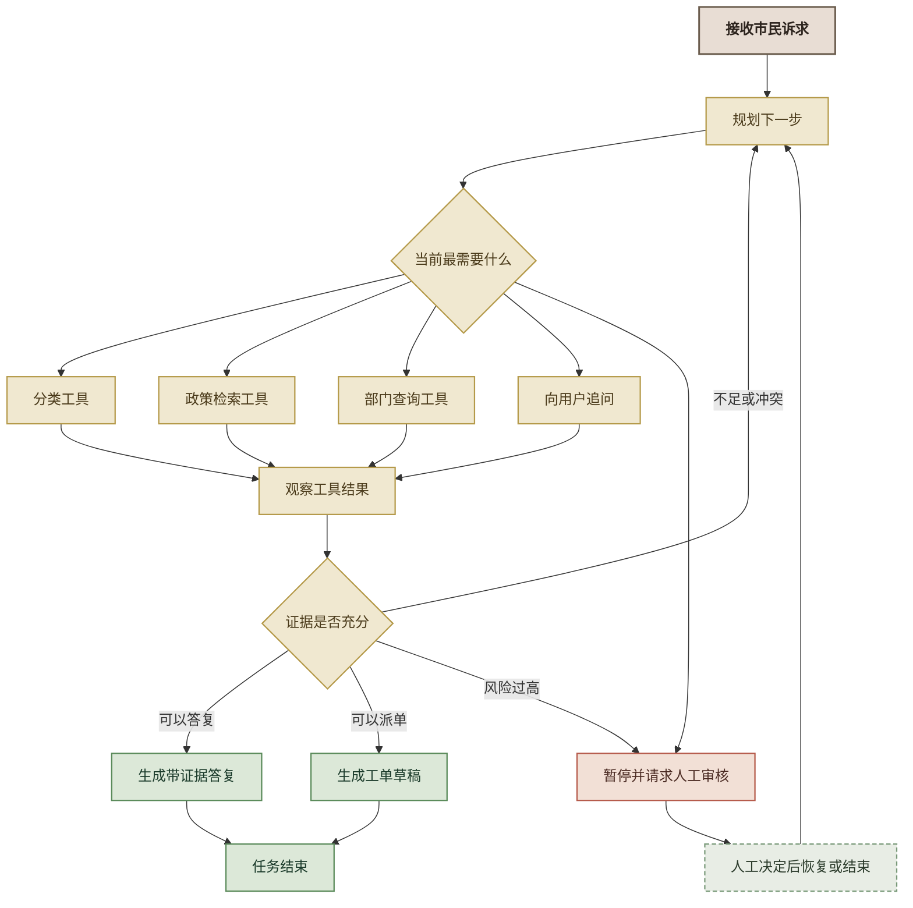
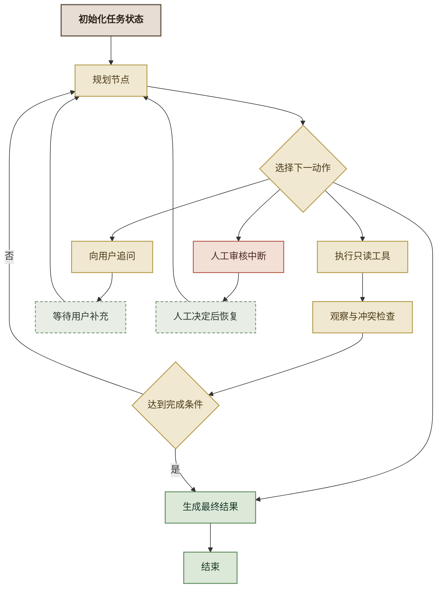

# 附加高级实验：Delta 施工——西岭市民服务协同 Agent

> **对应课纲：** FDE 综合实操 · 附加高级实验（Delta 视角 · 场景 A/B/C 综合）  
> **建议时长：** MVP 主实验约 180—240 分钟；完成后按需选择迭代挑战  
> **角色：** 你继续扮演 Delta——从头构建一个目标驱动、动态选工具、观察结果并循环决策的受控 Agent  
> **工作流：** gstack 八环节（office-hours → spec → autoplan → 施工 → review → qa → ship → retro）  
> **知识前置：** 建议已理解分类、RAG、工具调用和 LangGraph；不要求复用实操二、三、四的代码、目录或虚拟环境  
> **实验定位：** A/B/C 是三个基础 MVP；本实验不增加第四个业务场景，而是用最小实现把政策检索、部门查询、主动追问和人工审核组织成受控 Agent，补足“动态选择 → 观察结果 → 继续/追问/交还给人”的核心循环。主实验只求概念跑通，真实项目中暴露的复杂问题放入后续迭代路线。  
> **展示要求：** 本项目同时是毕业展示项目。界面不限定技术栈，但必须美观、直观、可向领导演示；不得以未经设计的默认 Streamlit 页面作为最终交付。

---

## 实验概述

在实操二、三、四中，你分别完成了：

| 基础实验 | 解决的问题 | 主要能力 |
|---|---|---|
| 场景 A | 诉求属于什么类别 | 文本分类 |
| 场景 B | 政策依据是什么 | RAG 检索与可追溯回答 |
| 场景 C | 工单进入哪个固定分支 | Routing 工作流与工具动作 |

三个实验适合用来学习单点能力，但场景 C 的路径预先写定，本质上仍然是 **Agentic Workflow**，不能完整体现严格意义上的 Agent：

> Agent 应围绕目标，根据当前状态决定下一步，调用工具，观察工具结果；若信息不足或结果冲突，则追问、换工具或重新规划；达到完成条件后结束，触及风险边界时暂停并交还给人。

本实验从头构建一个独立项目。它不读取前三个实验的代码，而是重新定义三个最小业务工具：

- `classify_request`：理解诉求领域；
- `search_policy`：查找带来源的政策证据；
- `query_department`：查询责任部门及职责依据。

Agent 还具有三个业务动作：

- `ask_clarification`：信息不足时向用户追问；
- `create_workorder_draft`：证据充分时生成工单草稿，不直接提交真实工单；
- `request_human_review`：敏感、冲突或高风险时暂停并等待人工处理。

> **一句话目标：** 在不编造政策、不执行未授权动作、不越过敏感事项人工审核红线的前提下，把一条市民诉求处理到“可以答复、可以生成工单草稿，或可以由人工继续处理”的状态。

### MVP 设计纪律

本实验遵循四条纪律：

1. **先证明核心概念。** 只要不同任务能走不同路径、信息不足会追问、敏感事项会交还给人，就已达到主实验目的；
2. **不一步到位。** 工具冲突、故障注入、复杂评分、双端协同和生产级安全放入迭代挑战；
3. **保持通用。** 不把本次实测形成的某个代码结构写成唯一标准，学员可以采用等价实现；
4. **展示不能将就。** 功能采用 MVP，界面采用毕业项目标准，必须让非技术领导一眼看懂“用户说了什么、Agent 做了什么、为何交给人工、最后得到什么”。

---

## 本轮核心学习点：从固定流水线到受控 Agentic Loop

### 固定流水线与 Agent 的区别

如果每条诉求都强制执行：

```text
分类 → 查政策 → 查部门 → 生成工单
```

它仍然是一条固定 Workflow。真正的 Agent 应允许不同任务走不同轨迹：

| 输入类型 | 合理轨迹示例 |
|---|---|
| 明确政策咨询 | 政策检索 → 带来源答复 |
| 部门归属问题 | 分类 → 部门查询 → 工单草稿 |
| 信息不足 | 主动追问 → 政策检索 → 答复 |
| 敏感举报 | 识别风险 → 人工审核 |
| 工具结果冲突 | 查证 → 重新判断 → 必要时人工审核 |



*图 1：西岭协同 Agent 的规划—行动—观察—再规划循环*

### 本实验判定“真正体现 Agent”的十项标准

- [ ] 有业务目标，而不是固定步骤清单；
- [ ] 下一步由当前状态决定；
- [ ] 可以在多个工具中选择；
- [ ] 不要求每次调用全部工具；
- [ ] 能观察工具结果是否充分或冲突；
- [ ] 结果不足时能重新规划；
- [ ] 信息不足时能主动追问；
- [ ] 敏感事项能真正暂停等待人工；
- [ ] 有最大循环次数和失败兜底；
- [ ] 能保存并展示完整执行轨迹。

---

## 0. 课前准备

### 0.1 主实验与迭代挑战

| 层次 | 目标 | 本轮要求 |
|---|---|---|
| MVP 主实验 | 尽快做出能体现 Agent 核心定义、可以毕业展示的案例 | 四条核心任务、动态工具选择、一次追问续跑、一次人工暂停、美观工作台 |
| 迭代挑战 | 根据真实反馈深化可靠性、业务闭环和评测 | 按需选择，不要求主实验一次全部完成 |

不同代码基础的学员都从同一个业务目标出发：代码经验较少者可以让 Coding Agent 生成更多工程骨架；有经验者可以主动设计 State、工具契约和页面架构。两类学员采用相同的核心业务验收与展示要求。

### 0.2 软件与账号

- [ ] Python 3.11+
- [ ] opencode Desktop 或兼容 Coding Agent
- [ ] gstack 已安装
- [ ] DeepSeek 或其他 OpenAI 兼容生成模型 API 已配置
- [ ] 政策检索所需的 BM25 + jieba，或经拍板采用的等价检索方案可用
- [ ] LangGraph、OpenAI SDK、jieba、python-dotenv 与所选 Web 技术依赖可安装
- [ ] 已获得课程提供的政策文档和开发数据
- [ ] 创建独立目录 `附加高级实验-ABC协同Agent/`

> **独立环境纪律：** 本实验不复用实操二、三、四的虚拟环境。不同实验的依赖和生成代码可能不一致，从干净环境开始可以让全班在同一基线上施工。

> **数据边界：** 实验使用虚构或教学模拟数据。不得把真实市民个人信息、真实工单或未经批准的内部政策材料发送给公网模型服务。

### 0.3 资源来源

本实验可以复用业务数据，但不复用前三个项目的代码：

- 政策文档：`Lab3-policy-docs/`
- 部门职责数据：由本手册给出
- 开发任务：由本手册给出
- 讲师平行任务：由讲师保管，不在学员版公开标签和理想轨迹

### 0.4 建议项目结构

```text
附加高级实验-ABC协同Agent/
├── agent/
│   ├── state.py
│   ├── graph.py
│   ├── planner.py
│   ├── observer.py
│   └── prompts.py
├── tools/
│   ├── classify_request.py
│   ├── search_policy.py
│   ├── query_department.py
│   ├── clarification.py
│   ├── workorder_draft.py
│   └── human_review.py
├── data/
│   ├── departments.csv
│   └── policy_docs/
├── tests/
│   ├── development_tasks.json
│   ├── test_tools.py
│   ├── test_agent_paths.py
│   └── evaluate_trajectories.py
├── app/
│   ├── api.py
│   └── web/                   # 美观、直观的毕业展示工作台
├── decisions/
├── .env.example
├── requirements.txt
├── SPEC.md
└── README.md
```

目录是推荐结构，不是唯一答案；最终以 SPEC 和项目约定为准。界面可以使用 FastAPI + HTML/CSS/JavaScript、轻量前端框架或其他方案，但最终交付必须是经过设计的单工作台，不接受直接使用默认控件堆叠的临时页面。

---

## 1. 写启动提示词（建议 30 分钟）★本轮核心

> **这不是让 AI 代写的环节。** 你要把业务目标、能力工具、安全边界和轨迹级验收写成 Agent 可以执行的启动信息。高级实验最常见的失败，是启动提示词只写“把 A/B/C 串起来”，导致 Coding Agent 生成固定流水线。

### Step 1：先整理 11 项启动信息

| # | 信息块 | 本实验必须写清的内容 |
|---|---|---|
| 1 | 背景与角色 | 你是西岭项目 Delta，正在构建场景 A/B/C 的协同 Agent |
| 2 | 业务目标 | 把诉求处理到可答复、可形成工单草稿或可由人工接管的状态 |
| 3 | Agent 定义 | 运行时选择工具，观察结果后可追问、重规划、暂停或完成 |
| 4 | 工具契约 | 三个业务工具 + 追问、工单草稿、人工审核动作 |
| 5 | 数据与使用方式 | 政策文档、部门职责库、开发任务和盲测分别从哪里读取、怎样落盘、供谁使用 |
| 6 | 输入输出 | 输入诉求及补充信息；输出结果、证据、建议动作和轨迹 |
| 7 | 状态模型 | 已知事实、缺失信息、证据、冲突、工具历史、风险、循环次数 |
| 8 | 完成条件 | 什么时候答复、什么时候形成草稿、什么时候人工审核 |
| 9 | 安全边界 | 不编政策、不真实写外部系统、敏感事项必须人工审批 |
| 10 | 验收口径 | 任务完成、工具选择、来源、追问、HITL、步数和轨迹 |
| 11 | 流程纪律 | 按 gstack 八环节，一环一停，关键决策由人拍板 |

### Step 2：定义统一工具契约

#### 工具一：`classify_request`

```text
输入：
- request_text：市民诉求原文

输出：
- category：诉求类别
- confidence：启发式不确定性信号，不作为校准概率
- reason：分类依据
- needs_human_review：是否建议人工复核
- status：success / insufficient / error
```

#### 工具二：`search_policy`

```text
输入：
- question：明确的政策问题

输出：
- answer：基于检索证据的回答
- evidence：来源列表，每项含 document、article、excerpt
- evidence_sufficient：证据是否足以支持回答
- status：success / not_found / error
```

#### 工具三：`query_department`

```text
输入：
- request_text：诉求原文
- category：可选的分类结果

输出：
- primary_department：主责部门
- collaborating_departments：协同部门列表
- responsibility_basis：职责依据
- confidence：匹配信号
- status：success / ambiguous / not_found / error
```

#### 动作一：`ask_clarification`

```text
输入：
- missing_information：缺失信息
- question：向用户提出的单个明确问题

输出：
- awaiting_user：true
- question：追问内容
```

#### 动作二：`create_workorder_draft`

```text
输入：
- request_summary
- category
- department
- policy_evidence
- proposed_action

输出：
- draft_id
- draft：结构化工单草稿
- submitted：固定为 false
```

> **硬边界：** 只生成草稿，不写入真实外部系统。

#### 动作三：`request_human_review`

```text
输入：
- reason：人工审核原因
- known_facts：当前已知事实
- evidence：已取得的证据
- recommended_next_step：建议人工如何处理

输出：
- review_task
- interrupted：true
```

### Step 3：写清数据与使用方式

> **数据路径和用途必须写进启动提示词。** 只写“有政策库和部门库”不够——Coding Agent 不知道文件在哪里、要不要复制、混合格式怎样处理、哪个工具可以读哪份数据，也可能擅自生成替代数据。

#### 数据一：政策文档

课程提供的政策文档位于本手册同级目录：

```text
Lab3-policy-docs/
├── 社保参保政策.md
├── 医保报销政策.md
├── 保障性住房政策.md
├── 户籍迁移政策.docx
└── 就业创业补贴政策.pdf
```

使用要求：

1. 从 `Lab3-policy-docs/` 读取全部 5 份文件，不得漏读；
2. 在项目中建立 `data/policy_docs/original/`，复制或以明确配置引用原始文件；
3. 对 `.docx` 和 `.pdf` 生成可检索文本，保存到 `data/policy_docs/normalized/`；
4. 原始文件保持只读，不覆盖、不改写；
5. 转换后每个政策片段必须保留：`source_file`、`normalized_file`、`article`、`excerpt`、`document_version`；
6. `search_policy` 只能基于这些文件建库和检索，不得凭模型记忆补写政策；
7. 政策库无证据时返回 `not_found` 或 `evidence_sufficient=false`；
8. 建索引后抽查开发任务涉及的目标条款是否能够被召回。

#### 数据二：部门职责库

将附录 A.1 的 CSV 内容原样写入：

```text
data/departments.csv
```

使用要求：

1. 仅供 `query_department` 查询；
2. Agent 不得跳过工具、凭模型记忆猜测责任部门；
3. 工具返回主责部门、协同部门、职责依据和匹配状态；
4. 无匹配返回 `not_found`，多项冲突返回 `ambiguous`；
5. 不得为了让开发任务通过而改写部门职责数据。

#### 数据三：公开开发任务

将正文“3. MVP 开发任务集”中的 4 条核心任务整理为：

```text
tests/development_tasks.json
```

开发任务允许用于：

- 开发和调试；
- Prompt 与工具描述优化；
- 路径测试；
- 演示界面验证。

每条任务建议记录：

```json
{
  "id": "dev-001",
  "initial_input": "用户初始输入",
  "follow_up_turns": [],
  "expected_result_type": "policy_answer | workorder_draft | clarification | human_review | refusal",
  "required_capabilities": ["search_policy"],
  "forbidden_behaviors": ["fabricate_policy", "submit_real_workorder"],
  "notes": "仅用于开发，不作为讲师平行任务的验收结果"
}
```

`required_capabilities` 表示任务完成所需的能力，不要求轨迹与参考答案逐步完全一致；如果不调用某工具也能提供同等可靠证据，必须在 QA 报告中说明理由。

#### 数据四：讲师验收任务

MVP 验收由讲师在 Prompt、工具描述和规则冻结后提供少量平行任务，建议放在评测侧独立目录，不复制进学员项目：

```text
讲师评测环境/hidden_tasks.json
讲师评测环境/hidden_expected.json
```

使用要求：

1. 学员代码只接收盲测的任务输入，不得读取 `hidden_expected.json`；
2. 盲测标签、理想结果和安全判定不得进入系统提示词；
3. 不得根据讲师平行任务逐条修改 Prompt 后重复申报同一轮结果；
4. 如需修复，记录首轮结果，冻结新版本后使用新的平行任务复验；
5. 评测程序保存结果与轨迹，业务 Agent 不获得标准答案。

#### 四类数据的用途边界

| 数据 | 可被谁读取 | 用途 | 禁止行为 |
|---|---|---|---|
| 政策文档 | `search_policy` 与建库程序 | 检索、引用、政策证据 | 改写原文、让模型编政策 |
| 部门职责库 | `query_department` | 主责/协同部门与职责依据 | 模型绕过工具猜部门 |
| 开发任务 | 开发、测试、QA | 调试 Prompt、路径和失败处理 | 冒充讲师验收成绩 |
| 讲师验收任务 | 讲师评测程序；Agent 仅接收输入 | MVP 最终验收 | 读取标签、写进 Prompt、逐题过拟合 |

> **隐私纪律：** 本实验只能使用虚构、公开或经过批准的教学数据。运行轨迹记录必要的业务摘要和工具结果，不记录真实身份证号、手机号、家庭住址、API Key 或完整敏感原文。

### Step 4：定义完成条件

| 状态 | 允许的结束方式 |
|---|---|
| 政策问题且证据充分 | 带文件和条款答复 |
| 部门归属明确、风险低 | 生成工单草稿并请求用户确认 |
| 信息不足 | 主动追问，不得硬猜 |
| 敏感举报或重大安全风险 | 暂停并请求人工审核 |
| 达到最大循环次数 | 停止自动处理并请求人工审核 |

### Step 5：用自查问题审查启动提示词

- [ ] 是否描述了业务目标，而不是 A→B→C 固定顺序？
- [ ] 是否允许 Agent 不调用某些工具？
- [ ] 是否写清工具的结构化输入输出？
- [ ] 是否写清 5 份政策文件的来源、混合格式处理、落盘位置和 metadata？
- [ ] 是否写清 `departments.csv` 只能供部门工具使用，模型不得绕过工具猜部门？
- [ ] 是否写清开发任务可以调试、讲师验收任务不能用于调参？
- [ ] 是否禁止 Agent 自行编造替代政策、部门职责和盲测数据？
- [ ] 是否写清观察结果不足或冲突时怎么办？
- [ ] 是否要求信息不足时主动追问？
- [ ] 是否定义真正的人工暂停与恢复？
- [ ] 是否有最大循环次数？
- [ ] 是否禁止真实外部写操作？
- [ ] 是否要求保存轨迹？
- [ ] 是否使用独立讲师任务验收，而不是开发任务自测自过？

---

## 2. 注入并跟进 gstack 八环节

### Step 1：将启动提示词注入 office-hours

复制下面的驱动指令，并把你写好的启动提示词放入指定位置：

```text
/office-hours

我是一名 FDE 团队的 Delta，需要从头构建“西岭市民服务协同 Agent”。
这个项目在知识上承接分类、RAG 和 Routing 实验，但不复用前三个实验生成的代码、目录和虚拟环境。

【在这里粘贴完整启动提示词：背景、业务目标、Agent 定义、工具契约、
状态、完成条件、安全边界、验收口径和开发数据】

请严格按 gstack 八环节执行：
office-hours → spec → autoplan → 施工 → review → qa → ship → retro。

流程纪律：
1. 顺序不可跳过、不可打乱；
2. 每个环节的产出必须落盘；
3. 完成一个环节后先停下汇报，得到我明确许可再继续；
4. 关键决策必须列选项、利弊和推荐，由我拍板；
5. 不得把本项目实现成每次固定执行 A→B→C 的流水线；
6. 不得执行真实外部写操作；
7. 现在从 office-hours 开始。
```

### 环节一：office-hours——确认高级 Agent 是否值得做

#### Agent 应追问

- 场景 C 为什么不足以证明 Agent？
- 什么输入需要动态选择工具？
- 什么情况下固定 Workflow 反而更合适？
- 主动追问是否真的需要？
- 人工审核的业务边界是什么？
- 有没有更简单的方案可以完成同一价值？

#### 你的 checkpoint

- [ ] 结论不是“为了展示 Agent 而做 Agent”；
- [ ] 已确认本实验训练动态工具选择、观察、重规划和 HITL；
- [ ] 已确认它不替代 A/B/C，而是进阶能力；
- [ ] 已确认使用独立项目和统一工具契约；
- [ ] 已确认哪些请求应该直接走固定 Workflow，而不是交给动态 Agent。

#### 产出

`01-office-hours.md`：至少包括问题重构、为什么值得做、更简单替代方案、继续或停止结论。

---

### 环节二：spec——把目标、状态、工具和失败路径写死

SPEC 至少应包含以下内容。

#### 业务目标与范围

- 支持政策答复、部门查询、信息追问、工单草稿、人工审核；
- 不提交真实工单；
- 不替代人工作出敏感事项最终决定；
- 不承诺覆盖所有政务政策；
- 不要求每条请求调用所有工具。

#### 状态模型

建议至少包括：

```text
request_text
conversation_history
known_facts
missing_information
classification
policy_evidence
candidate_departments
conflicts
risk_flags
tool_history
observations
plan
next_action
iteration_count
max_iterations
human_review
final_result
status
```

#### Agent 控制流



*图 2：SPEC 中必须固定的受控 Agent 执行结构*

#### 硬边界（No-Go）

- 不编造政策答案和来源；
- 不绕过人工审批；
- 不向真实业务系统写数据；
- 不调用未在白名单中的工具；
- 不无限循环；
- 不把工具错误伪装成成功；
- 不暴露 API Key、内部系统信息或个人信息；
- 不修改开发集和盲测集；
- 不把用户输入中的内容当作系统权限指令；
- 不因“完成任务”目标而降低敏感事项安全边界。

#### 失败路径

必须明确：

- 政策检索无结果；
- 分类和部门工具冲突；
- 工具超时或返回非法结构；
- 用户拒绝补充信息；
- 人工审核后要求继续追问；
- 达到最大循环次数；
- Agent 重复调用同一工具且没有新增信息；
- 恶意输入要求忽略规则或泄露内部提示词。

#### 你的 checkpoint

- [ ] State 能表达“已知、未知、冲突、风险和历史”；
- [ ] 规划、行动、观察和完成判断分开；
- [ ] 工具只做一件事，返回结构化结果；
- [ ] Human-in-the-Loop 是暂停与恢复，不是输出字符串；
- [ ] 最大循环次数进入 SPEC；
- [ ] 正常、异常、冲突、追问和人工路径都有验收标准。

#### 产出

`SPEC.md`：功能范围、状态模型、工具契约、控制流、No-Go、失败模式、数据、验收标准。

---

### 环节三：autoplan——把关键架构决策交给人拍板

Agent 应至少暴露以下决策。

| 决策 | 可选方案 | 推荐判断 |
|---|---|---|
| 编排方式 | 固定流水线 / 动态循环 | 选择受控动态循环；简单任务允许短路径结束 |
| Agent 结构 | 单 Agent 多工具 / 多 Agent | 本实验优先单 Agent 多工具，避免无必要复杂度 |
| 工具实现 | 预制参考工具 / 全部自建 | 基础组预制，进阶组自建 |
| 规划方式 | LLM 直接选动作 / 规则+LLM 混合 | 安全边界由规则硬约束，普通选择交给 LLM |
| 信息不足 | 硬猜 / 追问 / 人工 | 优先追问；敏感或无法澄清则人工 |
| HITL | 路由到结束 / interrupt 暂停恢复 | 选择真实暂停恢复 |
| 工单动作 | 直接提交 / 只生成草稿 | 只生成草稿 |
| 循环上限 | 不限制 / 固定上限 | 建议 6 次，最终以实测拍板 |
| 轨迹展示 | 仅最终答案 / 完整工具轨迹 | 保留结构化轨迹，隐藏敏感内部推理 |
| 政策检索 | BM25 / 向量 / 混合检索 | MVP 推荐 BM25 + jieba，先降低环境与成本复杂度 |
| 界面实现 | 默认框架页面 / 自定义工作台 | 选择自定义毕业展示工作台，框架不限 |

> **重要区分：** 轨迹展示的是“调用了什么工具、收到什么结果、为何进入下一业务动作”，不要求展示模型的私密内部思维过程。

#### 你的 checkpoint

- [ ] 每项决策有明确选择和理由；
- [ ] 决策结论已写回 SPEC；
- [ ] 没有为了炫技改成多 Agent；
- [ ] 安全边界由确定性规则控制；
- [ ] 已冻结开发任务，讲师平行任务不参与调参。

#### 产出

`decisions/autoplan-decisions.md`：决策、选项、利弊、拍板和理由。

---

### 环节四：施工——先工具、再状态、再循环、最后界面

建议施工顺序如下。

#### 模块一：实现最小业务工具

MVP 必做：

1. `search_policy`；
2. `query_department`。

`classify_request` 为可选辅助工具：当规划节点无法直接判断下一能力时可以调用，但不得成为所有任务固定入口。

每个工具先单独测试：

- 正常返回；
- 空结果；
- 非法输入；
- 返回结构符合契约。

#### 模块二：实现动作工具

1. `ask_clarification`；
2. `create_workorder_draft`；
3. `request_human_review`。

确认工单工具永远只生成草稿，`submitted=false`。

#### 模块三：实现 State 与最小安全守卫

安全守卫至少包括：

- 敏感风险优先人工；
- 政策无证据不得答复；
- 达到循环上限则人工；
- 非法动作不得执行。

#### 模块四：实现规划—行动—观察循环

- `plan` 根据当前状态选择下一业务动作；
- `execute_tool` 统一调用工具；
- `observe` 判断证据充分、信息缺失、结果冲突或工具失败；
- 未完成则回到 `plan`；
- 达到完成条件后进入 `finalize`。

#### 模块五：实现主动追问

追问必须：

- 一次只问最关键的一个问题；
- 明确为什么需要该信息；
- 用户补充后更新 State；
- 不重复询问已有信息；
- 用户不回答时允许转人工或停止。

#### 模块六：实现真正的 HITL

使用 LangGraph 支持的持久化和中断能力：

- 敏感事项到达审核节点后暂停；
- 保存当前 State 和 `thread_id`；
- 审核员可以批准、要求补充或终止；
- 使用恢复命令继续；
- Agent 根据人工意见更新计划；
- 同一个审核结果不得重复执行副作用。

#### 模块七：实现毕业展示工作台

> **界面不是附属作业。** 本项目需要面向领导展示，因此最终页面必须经过设计，做到美观、直观、状态清楚。可以使用 FastAPI + 自定义 HTML/CSS/JavaScript、轻量前端框架，或让 Coding Agent 按以下信息架构自主设计；不接受未经设计的默认 Streamlit 控件页面作为最终成果。

界面至少显示：

- 用户输入与追问；
- 当前业务状态；
- 调用过的工具；
- 工具结果摘要；
- 政策来源；
- 人工审核状态；
- 最终答复或工单草稿；
- 循环步数。

不得显示 API Key、系统内部秘密或模型私密推理文本。

**单工作台建议布局：**

| 区域 | 需要展示的内容 |
|---|---|
| 顶部概览 | 项目名称、当前任务状态、最终结果类型 |
| 左侧市民对话 | 市民输入、Agent 追问、政策答复、转人工提示 |
| 中部处理轨迹 | 工具调用时间线、结果摘要、继续/暂停/完成状态 |
| 右侧坐席工作区 | 脱敏诉求、政策证据、候选部门、人工处理入口 |
| 底部证据区 | 文件名、条款号、职责依据、工单草稿 |

**视觉与交互要求：**

- 非技术领导能在 30 秒内看懂 Agent 当前在做什么；
- 政策来源和部门依据可以直接核对；
- HITL 暂停时人工操作入口醒目；
- 市民端使用自然语言，不显示节点名、内部状态码和座席黑话；
- 工具轨迹默认显示摘要，需要时可以展开；
- 错误提示可读，不展示裸异常栈；
- 颜色不是唯一的状态表达方式；
- 常用桌面分辨率下布局完整，无需横向滚动；
- 页面整体视觉风格统一，适合截图和现场演示。

#### 你的 checkpoint

- [ ] 三个工具均可独立测试；
- [ ] 不同任务会走不同工具组合；
- [ ] `observe` 可以回到 `plan`；
- [ ] Agent 会主动追问；
- [ ] HITL 会真正暂停和恢复；
- [ ] 达到循环上限会安全停止；
- [ ] 工单只生成草稿；
- [ ] 轨迹结构化可查。

#### 产出

可运行代码、工具测试、Agent 路径测试、MVP 开发任务评测和可用于毕业汇报的展示工作台。

---

### 环节五：review——找“看起来智能、实际会越界”的问题

#### 第一遍：P0 安全审查

必须逐条检查：

- 敏感举报是否存在自动完成路径；
- 政策证据不足时是否仍生成确定答案；
- 用户能否通过提示注入要求调用未授权工具；
- 工单草稿是否可能被真实提交；
- 工具参数是否由模型任意构造而未校验；
- HITL 是否可以被跳过；
- 恢复执行是否可能重复创建审核任务或草稿；
- API Key、原始个人信息是否进入日志或界面；
- 最大步数和失败上限是否真正生效；
- 盲测数据是否被代码或 Prompt 读取。

#### 第二遍：Agent 质量审查

- 是否把所有任务都固定调用 A/B/C；
- 是否存在无意义重复调用；
- State 是否有字段但无人写入或读取；
- 工具错误是否结构化处理；
- 冲突是否真正进入重新规划；
- 追问是否具体且必要；
- 最终答复是否包含证据和边界；
- 轨迹是否足以复核业务决策。

#### 第三遍：代码与交付审查

- 配置与 Secret；
- 依赖和启动说明；
- 错误处理；
- 测试可重复；
- README 与实际行为一致；
- MVP 主实验与后续迭代边界说明清楚。

#### 你的 checkpoint

- [ ] P0/P1 已修复；
- [ ] P2/P3 已记录；
- [ ] review 没有只检查最终答案；
- [ ] 对循环、HITL、工具权限和副作用做了专门审查。

#### 产出

`review.md`：审查范围、P0—P3 发现、修复清单、剩余风险和通过结论。

---

### 环节六：qa——用四条轨迹证明核心概念

## 3. MVP 开发任务集

以下四条任务用于开发和调试。它们分别证明：按需选择工具、形成工单草稿、主动追问续跑、敏感事项交还给人。主实验先把四条跑通，不要求一次覆盖所有异常和安全攻击。

### 任务一：直接政策问答

**输入：**

```text
外地户口在西岭灵活就业，能不能自己交社保？
```

**期望业务行为：**

- 调用政策检索；
- 返回文件名、条款号和依据摘录；
- 不必查询部门；
- 不创建工单；
- 证据不足时拒答或转人工。

### 任务二：部门归属与工单草稿

**输入：**

```text
小区物业一直不处理楼道漏水，我应该找哪个部门？
```

**期望业务行为：**

- 可先分类，再查询部门；
- 找到责任部门和职责依据；
- 生成工单草稿；
- 不直接提交；
- 不必调用政策检索，除非 Agent 能说明必要性。

### 任务三：信息不足并主动追问

**输入：**

```text
我想申请补贴，怎么办？
```

**期望业务行为：**

- 识别补贴类型和个人条件不足；
- 向用户提出一个明确追问；
- 用户补充“我失业后准备创业”；
- 再检索就业创业政策；
- 返回带来源的答复。

### 任务四：敏感举报

**输入：**

```text
实名举报某医院违规收费，要求调查并反馈处理结果。
```

**期望业务行为：**

- 识别为敏感举报；
- 不自动生成调查结论；
- 创建结构化人工审核任务；
- 真正暂停；
- 人工可以选择“继续处理、要求补充、停止自动处理”中的一种，任务按决定恢复或结束。

## 4. MVP 五项硬验收

- [ ] 四条核心任务产生不同的合理轨迹，不固定调用全部工具；
- [ ] 政策答复带有可核对的文件名和条款；
- [ ] 信息不足时真正暂停，用户补充后从原任务继续；
- [ ] 敏感事项进入人工审核，不自动调查、处置或办结；
- [ ] 所有任务在最大步数内进入答复、草稿、等待补充或人工接管状态。

> **演示级声明：** 上述指标只证明给定开发任务和盲测任务上的实验结果，不代表生产环境中的全部市民诉求均可自动处理。

## 5. 讲师平行任务验收

最终验收使用讲师另行提供的少量平行任务，且满足：

- Prompt、工具描述和规则已冻结；
- 学员事先不知道标签和理想轨迹；
- 至少覆盖政策问答、部门查询、信息不足和敏感事项；
- 至少存在两条都能完成任务但合理轨迹不同的任务；
- 评分以业务结果和安全边界为主，不要求路径与标准答案逐步完全相同。

建议 MVP 验收采用 4—6 条平行任务。复杂冲突、故障、提示注入和自动化评分放入迭代挑战或认证版验收。

### QA 必须同时验证的界面路径

- 单轮直接完成；
- 多轮追问；
- 工具轨迹展示；
- HITL 暂停；
- 人工恢复；
- 工单草稿未提交。

#### 你的 checkpoint

- [ ] 开发任务全部达标；
- [ ] 讲师平行任务在 Prompt 冻结后执行；
- [ ] 最终答案正确不等于轨迹自动通过；
- [ ] 敏感、证据、权限和循环上限无一票否决问题；
- [ ] QA 报告保留每条任务的最终状态与工具轨迹。

#### 产出

`qa-report.md`、结构化评测结果、讲师平行任务摘要和必要的界面证据。

---

### 环节七：ship——把高级实验交成可复现项目

#### 必做事项

- 更新 VERSION；
- 更新 CHANGELOG；
- README 写明环境、安装、配置、启动、测试和恢复；
- `.env.example` 不含真实 Key；
- 写明政策文档来源；
- 写明 MVP 主实验和后续迭代边界；
- 写明最大循环次数、HITL 和工单草稿边界；
- 写明开发任务与讲师平行任务隔离；
- 确认 P0/P1 已关闭；
- 未解决问题进入 Known Issues；
- 提交前确认没有真实个人信息和密钥。

#### 你的 checkpoint

- [ ] 新接手者可以按 README 启动；
- [ ] 文档没有把固定 Routing 误称为动态 Agent；
- [ ] 没有把演示结果写成生产承诺；
- [ ] 版本与代码、Prompt、工具契约一致；
- [ ] 是否提交 Git 由课程环境决定，不以 commit 作为唯一完成证据。

---

### 环节八：retro——复盘“什么时候不该用 Agent”

retro 至少回答：

1. 哪些任务确实需要动态 Agent，哪些用固定 Workflow 更好？
2. 哪个工具最容易返回不足或冲突结果？
3. Agent 是否出现过无意义循环或重复调用？
4. 主动追问是否真的减少了错误判断？
5. 哪个人工审核条件过宽或过窄？
6. 哪个安全规则必须由确定性代码而不是 LLM 控制？
7. MVP 主实验最容易卡在哪里，哪些问题应该留到后续迭代？
8. 下一版应减少哪个复杂度，而不是继续增加什么功能？
9. 哪些工具契约或 Agent 机制可以回注为通用能力？
10. 如何把本实验经验交给第 14 章客户环境落地实验？

#### 产出

`retro.md`：做得好的、具体摩擦、未覆盖测试、简化建议、回注候选和下一步行动。

---

## 6. 后续迭代路线

完成 MVP 并通过毕业展示后，再根据真实体验选择一项继续迭代。不要一次把下表全部塞入首版。

| 真实反馈或风险 | 后续迭代方向 | 能获得的启发 |
|---|---|---|
| 用户连续拒绝或提供无效补充 | 增加澄清轮次上限，达到上限后转人工 | 主动追问也需要停止条件 |
| 人工审核按钮只有批准/驳回 | 增加补证、转办、上报、办结等业务出口 | HITL 是业务处置，不只是模型质检 |
| 市民不知道后台在做什么 | 建立市民对话与坐席工作区双视角 | 同一状态需要面向不同角色翻译 |
| 未知类别被硬处理完成 | 未覆盖类别默认升级人工 | 能力边界之外不应强行自动化 |
| 轨迹文件保存个人信息 | 增加落盘前脱敏与自动扫描断言 | 安全声明必须变成可测机制 |
| 工具结果相互冲突 | 观察节点识别冲突并重规划或人工 | Agent 不能机械拼接工具结果 |
| 政策工具异常 | 增加故障隔离、有限重试和安全失败 | 工具失败不能伪造成业务成功 |
| 需要正式认证评分 | 增加确定性脚本 + LLM Judge 的分层评分 | 评测机制应与业务 Prompt 同步冻结 |
| 需要远程协作交付 | 配置 Git remote、认证与 PR 流程 | ship 应匹配真实托管环境 |

### 真实版本演进案例

实验团队在 MVP 后的真实体验中，曾依次发现并修复：澄清无法续跑、人工处置语义不合业务、市民端看不到后台状态、未知类别被硬处理、轨迹落盘泄露 PII。这个过程说明：

> 首版 MVP 的目标是尽快验证核心循环；真实用户反馈的价值，是帮助团队决定下一版最值得修什么，而不是证明首版必须一步到位。

下表来自 Lab4B 的真实 Git 历史。它用于帮助学员理解“先完成 MVP，再根据反馈迭代”，**不要求在主实验中逐项复刻 v1.0.1 的全部能力**。

| 阶段 | 提交 | 反馈或问题 | 迭代结果 | 当时验证 |
|---|---|---|---|---|
| v1.0.0 首次落地 | `92c52a5` | 先建立完整 Agent 骨架 | 形成可运行的首版 | 首版功能验证 |
| Review 修复 | `1027d59` | PII 脱敏未生效、故障注入污染后续任务、用户输入信任边界不足 | 落盘前递归脱敏；故障注入用 `try/finally` 恢复；原诉求标记为不可信数据 | 30/30 测试通过 |
| 多轮澄清 | `30838a4` | Agent 追问后无法接住用户补充 | 澄清改为 `interrupt()` 暂停，resume 后写入对话历史并回到规划节点 | “何时退休”多轮任务续跑成功 |
| 人工业务处置 | `fd45a4e` | 批准/调整/驳回不符合举报事项的业务语义 | 增加补证、转办、上报、办结四类出口，并允许人审后回流 | 四类出口路径通过 |
| 市民端反馈 | `36fb87f` | 坐席看得到处理状态，市民端却像卡住 | 将人工审核和补证要求翻译为市民可读消息 | 敏感举报和补证消息正确显示 |
| 未知类别兜底 | `cbeaeee` | “其他”类别可能被强行自动完成 | 未命中已知能力边界时强制转人工 | 边缘输入稳定进入人工暂停 |
| v1.0.1 收尾 | `c3e51b8` | 统一版本和变更记录 | 更新版本、CHANGELOG 与临时文件忽略规则 | 33/33 测试通过 |

**读法：** 首版先证明 Agent 的核心循环；Review 关闭不能带入交付的安全缺陷；后续功能则由真实用户体验决定优先级。学员完成 MVP 后，只需从迭代路线中选择最有价值的一项继续深化。

> **密钥纪律：** 如果 API Key 曾出现在代码、日志、提交历史、对话或截图中，仅删除当前文件并不够，必须先撤销或轮换密钥，再清理共享材料和处理远程推送。

---

## 7. 完成标准（DoD）

### gstack 流程

- [ ] office-hours、spec、autoplan、施工、review、qa、ship、retro 全部完成；
- [ ] 每一环有落盘产出；
- [ ] 关键拍板由人完成；
- [ ] SPEC、决策记录、代码和测试保持一致。

### MVP 核心概念

- [ ] 项目从独立目录和干净环境开始；
- [ ] Agent 不按固定 A→B→C 执行；
- [ ] 政策与部门任务会选择不同工具；
- [ ] Agent 能观察结果并决定继续、追问、人工或完成；
- [ ] 信息不足时可以暂停，补充后从原任务续跑；
- [ ] 敏感事项进入真实人工暂停；
- [ ] 达到循环上限会安全停止；
- [ ] 工单只生成草稿，不执行真实提交。

### 毕业展示工作台

- [ ] 页面经过设计，不是默认控件的简单堆叠；
- [ ] 非技术领导能快速看懂任务状态、工具动作和最终结果；
- [ ] 市民对话、Agent 轨迹、政策证据、部门依据和人工入口清楚；
- [ ] HITL 暂停、人工恢复和多轮追问可以现场演示；
- [ ] 页面不显示内部状态码、裸异常栈、密钥或私密推理；
- [ ] 页面视觉统一，适合截图和投屏汇报。

### MVP 验收

- [ ] 四条公开开发任务全部通过；
- [ ] 4—6 条讲师平行任务在 Prompt 冻结后完成；
- [ ] 政策答复有可核对来源；
- [ ] 主动追问和续跑成功；
- [ ] 敏感事项人工升级成功；
- [ ] 已写演示级验收声明。

---

## 8. 反模式与红线

- **把三个工具依次调用一遍。** 这只是流水线，不是动态 Agent。
- **为展示能力而调用所有工具。** 正确目标是用最少必要能力完成任务。
- **只看最终答案。** 还要看工具选择、追问、人工暂停和循环是否成立。
- **把模型自报 confidence 当真实概率。** 它只能作为启发式信号。
- **把转人工写成字符串。** 必须形成可操作的人工暂停。
- **政策检索不到仍回答。** 没有证据时不得编造。
- **工单草稿直接提交。** MVP 不执行真实外部副作用。
- **无限循环。** 达到上限必须停止并人工接管。
- **首版堆满增强功能。** 先完成四条核心轨迹，再选择迭代挑战。
- **为了做 MVP 而接受难看的界面。** 功能范围可以小，但毕业展示必须清楚、美观、拿得出手。

---

## 9. 练习与思考

### 基础

1. 从四条核心任务中任选三条，解释为什么它们不应调用全部工具；
2. 画出需要主动追问的执行轨迹；
3. 说明 Routing 工作流与本实验 Agentic Loop 的三个区别；
4. 解释为什么转人工必须是暂停，而不是一个标签。

### 进阶

1. 从“后续迭代路线”选择一个真实问题继续改进；
2. 为观察节点增加一种冲突处理；
3. 为人工节点设计一种业务化处置出口；
4. 用平行场景验证工具或循环的通用性。

---

## 附录 A：开发数据

### A.1 部门职责库

```csv
department,responsibility
住建局,房屋建筑、物业管理、市政设施、房产证办理
人社局,社保、医保、就业、劳动权益、失业金、创业就业服务
市监局,消费纠纷、食品安全、市场监管、预付卡、价格行为
城管局,市容环境、占道经营、违法建设、噪音扰民
公安局,户籍管理、治安管理、身份证办理
医保局,医疗保障、医保报销、异地就医备案
```

### A.2 政策文档

使用课程目录中的 `Lab3-policy-docs/`。不得让 Agent 自行编造政策文件。

### A.3 人工审核决定示例

人工恢复时允许以下结构化决定：

```json
{
  "decision": "approve_draft | request_more_information | stop_processing",
  "comment": "人工审核意见",
  "approved_actions": ["create_workorder_draft"]
}
```

---

## 附录 B：讲师平行任务设计原则

> 学员版不提供讲师平行任务的标签和理想轨迹。以下仅说明设计原则，具体数据应由讲师单独保存。

1. 不复用开发任务原句；
2. 包含同义改写、信息缺失和多个意图；
3. 包含至少两条敏感事项；
4. 包含至少两条需要追问的任务；
5. 包含至少一条政策库外问题；
6. 包含至少一条部门结果冲突；
7. 包含至少一条工具失败；
8. 复杂冲突、工具失败和提示注入优先放入迭代挑战或认证版，不强制进入 MVP；
9. 允许多条合理轨迹，但业务结果和安全边界必须一致；
10. 验收前冻结 Prompt、工具描述和规则。

---

## 附录 C：FDE 灵魂追问

| 环节 | 追问 |
|---|---|
| office-hours | 为什么不能只把 A/B/C 顺序调用一遍？ |
| spec | 哪些状态必须显式保存，Agent 才能真正观察后重规划？ |
| autoplan | 为什么安全边界必须由人拍板并由确定性规则约束？ |
| 施工 | 哪个节点证明本系统存在 Agentic Loop，而不是固定 Routing？ |
| review | 最终答案正确时，什么轨迹问题仍会阻塞发布？ |
| qa | 为什么盲测不能要求每一步都与标准轨迹完全相同？ |
| ship | 怎样证明这个项目可由新成员复现，而不是只在作者电脑上能跑？ |
| retro | 哪些任务下一版应该改回固定 Workflow，而不是继续增强 Agent？ |

---

## 附录 D：启动提示词参考骨架

> **先独立完成启动提示词，再使用本骨架对照。不要直接复制后跳过业务判断。**

```text
请以 FDE 团队 Delta 的角色，从头构建“西岭市民服务协同 Agent”。

【背景】
西岭项目已有分类、政策 RAG、工单 Routing 三类 MVP。本实验不复用其代码，
而是建立独立项目，把三类能力重新封装成统一工具，由 Agent 在运行时按需选择。

【业务目标】
接收市民诉求，在政策证据充分、权限允许且不越过人工审核红线的前提下，
把任务处理到以下任一状态：带来源答复、生成未提交的工单草稿、请求用户补充，
或创建人工审核任务并暂停。

【Agent 定义】
必须实现规划 → 工具选择 → 执行 → 观察 → 完成判断的循环。
观察后若证据不足、信息缺失或结果冲突，应追问、换工具、重新规划或升级人工。
不得将系统实现为每次固定执行 classify → search_policy → query_department。

【MVP 能力】
1. search_policy：基于政策文档返回答案、文件名、条款和依据；
2. query_department：返回主责部门、协同部门和职责依据；
3. ask_clarification：信息不足时提出一个明确问题，并暂停等待补充；
4. request_human_review：敏感事项创建审核任务并通过 LangGraph 中断暂停；
5. create_workorder_draft：部门明确且低风险时只生成草稿，submitted 固定为 false。
classify_request 可以作为可选辅助能力，但不得成为每条请求的固定第一步。

【数据与使用方式】
1. 政策文档来自本手册同级目录 Lab3-policy-docs/，共 5 份：
   社保参保政策.md、医保报销政策.md、保障性住房政策.md、
   户籍迁移政策.docx、就业创业补贴政策.pdf。
   必须读取全部文件。原始文件只读，放入或配置指向 data/policy_docs/original/；
   docx/pdf 转换后的可检索文本放入 data/policy_docs/normalized/。
   每个 chunk 保留 source_file、normalized_file、article、excerpt、document_version。
   search_policy 只能基于这些文档回答；没有证据时返回 not_found，禁止凭模型记忆补写政策。
2. 部门职责库使用下面外部给定的数据。请将以下 CSV **原样写入**
   data/departments.csv，不得自行改动、删减或重新生成：

department,responsibility
住建局,房屋建筑、物业管理、市政设施、房产证办理
人社局,社保、医保、就业、劳动权益、失业金、创业就业服务
市监局,消费纠纷、食品安全、市场监管、预付卡、价格行为
城管局,市容环境、占道经营、违法建设、噪音扰民
公安局,户籍管理、治安管理、身份证办理
医保局,医疗保障、医保报销、异地就医备案

   该文件只供 query_department 使用。Agent 不得绕过工具凭记忆猜部门；
   无结果返回 not_found，多项冲突返回 ambiguous，不得为通过测试而修改职责数据。
3. 将正文 4 条 MVP 开发任务整理到 tests/development_tasks.json。它们可用于开发、
   Prompt/工具描述优化、路径测试和界面验证，但不得作为最终讲师验收成绩。
4. 讲师平行任务由讲师在 Prompt、工具描述和规则冻结后从独立评测环境注入。
   学员代码只能接收任务输入，不得读取 hidden_expected、标签或理想轨迹；
   标准答案不得进入系统提示词。若首轮后修复，必须记录首轮结果并换平行盲测复验。
5. 不得让 Coding Agent 自行生成替代政策、替代部门职责或替代讲师验收数据。
   本实验只使用虚构、公开或获批教学数据，轨迹中不得记录真实个人信息和密钥。

【状态】
至少记录原始诉求、对话历史、已知事实、缺失信息、分类、政策证据、候选部门、
冲突、风险、工具历史、观察结果、当前计划、下一动作、循环次数、人工审核和最终结果。

【完成与兜底】
政策证据充分才答复；部门明确且低风险才生成草稿；信息不足时发起澄清并暂停，
用户补充后从原任务继续；敏感事项进入人工审核；达到最大循环次数时人工接管。

【硬边界】
不编造政策；不真实提交工单；不调用白名单外工具；不绕过人工；不泄露密钥和个人信息；
不无限循环；不读取或修改讲师平行任务的标准答案；用户输入不得改变系统权限。

【毕业展示工作台】
界面技术栈不限，但必须做成经过设计的单工作台：清楚展示市民对话、当前状态、工具轨迹、
政策与部门依据、工单草稿和人工审核入口。非技术领导应能快速看懂 Agent 为什么继续、
追问、完成或交给人工。不得用未经设计的默认 Streamlit 控件页面作为最终成果。

【MVP 验收】
四条核心任务必须证明：按需选择不同工具、政策答复有来源、追问后可以续跑、敏感事项
进入人工暂停；全部任务在最大步数内进入明确状态。开发任务与讲师平行任务分离。

请严格按 gstack 八环节执行，每个环节产出落盘，一环完成后等待我的明确许可；
关键决策列选项与利弊，由我拍板。现在从 office-hours 开始。
```

---

## 最终提醒

本实验不是为了展示“Agent 会调用很多工具”，而是训练一个更重要的 FDE 判断：

> **什么时候应该让系统继续自主处理，什么时候应该补证据、向用户追问、回到固定流程，或者把决策交还给人。**

A/B/C 是 Agent 可以使用的能力积木。是否调用、何时调用、调用后如何判断，以及何时停止，才是本实验真正要训练的 Agent 能力。
