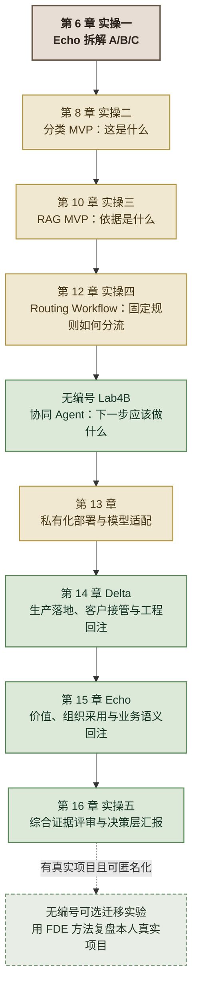
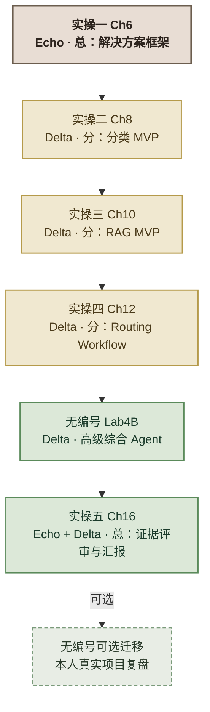
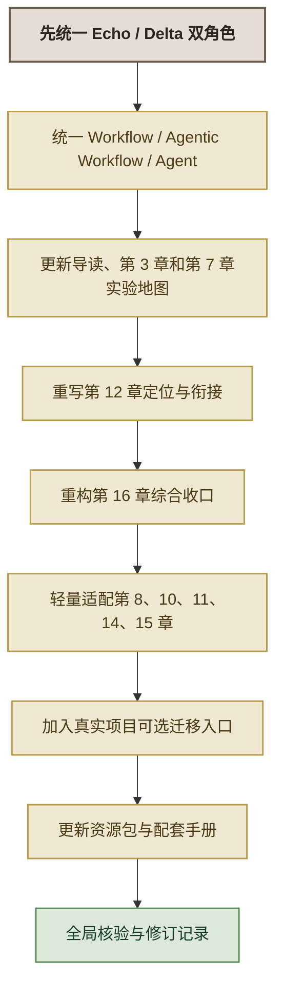

# Lab4B 与真实项目迁移实验纳入教科书：完整修订施工指南

> **文档用途：** 交付教材编写团队，指导教科书在新增 Lab4B 综合 Agent 实验和真实项目可选迁移实验后完成全书适配  
> **修订对象：** `D:/vibecoding/dsh/FDE实战课程20260830/textbook/`  
> **参考实验：** `D:/vibecoding/FDE课程/FDE课程包/陕西移动专题/综合实操/附加高级实验-ABC协同Agent-实验手册-学员版.md`  
> **真实项目迁移设计：** `D:/vibecoding/FDE课程/FDE课程包/陕西移动专题/综合实操/misc/附加迁移实验_真实项目FDE复盘与汇报_设计思路.md`  
> **修订性质：** 教科书知识体系、章节衔接、术语和最终实操的专题重构指南，不直接代替正文  
> **角色红线：** 课程只使用 Echo 和 Delta。客户安全、运维、平台、技术和监管人员属于客户协作方或干系人，不设置 Engineering 等第三种 FDE 角色。

---

## 一、修订目标

本轮修订需要同时解决四个问题：

1. **补齐 Agent 学习坡度。** 第 12 章的三路 Routing 是路径可枚举的 Agentic Workflow，不是能够观察结果后重新规划的完整 Agent；Lab4B 用无编号附加高级实验补足动态工具选择、主动追问、人工暂停和有限循环。
2. **保持五个主线实操不变。** Lab4B 不是场景 D，也不编号为实操五或实操六；A/B/C 仍是实操一拆出的三个业务场景。
3. **升级最后的全书收口。** 第 16 章不能再只总结三个 Demo，而要审查三个单点 MVP、Lab4B 综合 Agent、第 14 章客户落地证据和第 15 章价值采用证据，并作出下一阶段决策。
4. **增加真实工作迁移出口。** 完成西岭主线后，有真实项目且能匿名化的学员，可以选择无编号附加迁移实验，用同一套 Echo/Delta 方法完成拆解、复盘和汇报。该实验独立于实操五，不影响主线结业。

---

## 二、修订后的全书学习链路



*图 1：Lab4B 与真实项目可选迁移实验纳入后的全书学习链路*

### 2.1 必须保持的结构

- 五个编号实操仍为第 6、8、10、12、16 章；
- 五个主线实操仍构成“总—分—总”；
- Lab4B 是第 12 章之后的无编号附加高级实验；
- 真实项目复盘是全书结束后的无编号可选迁移实验；
- 西岭市民服务平台仍是全书唯一贯穿主案例；
- 真实项目迁移不能替代西岭主线和第 16 章统一验收。

### 2.2 两个无编号实验的区别

| 实验 | 作用 | 是否主干 | 是否要求真实项目 |
|---|---|---:|---:|
| Lab4B 综合 Agent | 补足真正的 Agentic Loop，形成毕业展示项目 | 主线后的高级桥梁，可按班型安排 | 否，继续使用西岭案例 |
| 真实项目迁移实验 | 检验能否把 FDE 方法带回本人工作 | 否，课程结束后的可选项 | 是，且必须可匿名化 |

---

## 三、全书统一概念与术语

### 3.1 技术能力链

| 能力 | 回答的问题 | 教材落点 | 统一口径 |
|---|---|---|---|
| 分类 | 这是什么 | 第 8 章 | 一次调用、结构化分类 |
| RAG | 依据是什么 | 第 9—10 章 | 检索证据后回答，来源可核对 |
| Routing Workflow | 按预设规则进入哪个分支 | 第 11—12 章 | 路径可枚举的 Agentic Workflow |
| Agentic Loop | 根据目标和当前状态，下一步做什么 | 第 11 章知识 + Lab4B 实验 | 动态选工具、观察、追问、暂停、继续和停止 |
| 业务本体 | 对象、关系、状态和动作如何成为可复用能力 | 第 14—15 章 | 平台无关方法，Palantir Ontology 是代表性实现 |

### 3.2 Workflow、Agentic Workflow 与 Agent

| 术语 | 定义 | 西岭案例 |
|---|---|---|
| Workflow | 步骤和判断均预先写定 | 固定文档处理流程 |
| Agentic Workflow | 路径预编排、可枚举，部分节点由 LLM 判定 | 第 12 章三路 Routing |
| Agent | 围绕目标自主选工具，观察结果后可继续、追问、暂停或结束 | Lab4B 协同 Agent |

### 3.3 角色体系

全书只保留：

| 角色 | 统一定位 |
|---|---|
| Echo | 靠想：挖真问题、拆场景、做取舍、判断价值、推动采用、判断业务通用性 |
| Delta | 靠做：施工、验证、适配客户环境、闭合动作、完成接管、判断工程复用性 |

“全团队”统一解释为 **Echo + Delta**。

客户方的技术、安全、运维、平台和监管人员，只作为干系人或协作方出现，不成为第三种 FDE 角色。

---

## 四、P0 级全书硬伤

### 4.1 角色体系冲突

当前第 1、3、4、6 章仍存在：

- Echo / Delta / Engineering；
- 作战单元三角色；
- Engineering 保阵地；
- Delta 主导 + Engineering 保障。

必须按语义修改：

- 删除 Engineering 作为课程角色；
- 相关职责归入 Delta 的协作范围，或写为客户安全/运维/平台协作方；
- 删除三角色图和三角色学习目标；
- 所有“全团队”改为“Echo + Delta 全团队”。

### 4.2 章节总数错误

`00_导读与体例说明.md` 写“全书 15 章结构”，实际已有第 1—16 章。改为：

> **全书 16 章结构**

### 4.3 第 11 与第 12 章概念冲突

第 11 章已将第 12 章定为 Agentic Workflow，第 12 章标题和正文却仍称完整 Agent。必须统一第 12 章为：

> **第 12 章　实操四 · 工单智能分级路由工作流（场景 C）**

### 4.4 第 16 章收口对象不完整

第 16 章目前只整合三个 Demo，未纳入 Lab4B、第 14 章客户环境证据、第 15 章价值采用证据和交付决策。必须重点重构。

### 4.5 数据出域口径存在风险

不得再笼统写：

> 先用公网 LLM 验证，再回填本地部署。

统一改为：

> 课堂阶段只使用完全虚构、脱敏、无真实个人信息的教学数据调用公网服务验证流程；真实客户数据只能在组织批准的安全域内完成验证、联调和生产落地，不得先进入公网服务再事后补救。

### 4.6 第 3 章阶段映射过时

当前第 3 章仍把 Build 的主要教学落点指向第 16 章。应改为：

- Prototype：第 8/10/12 章 + Lab4B；
- Build 与工程 Scale：第 14 章；
- 业务 Scale：第 15 章；
- 综合决策：第 16 章。

---

## 五、导读修改建议

目标文件：`textbook/00_导读与体例说明.md`

### 5.1 结构列表

1. “全书 15 章结构”改为“全书 16 章结构”；
2. 板块四改为“Delta 侧：三个单点 MVP + 一个无编号附加高级实验”；
3. 第 12 章名称改为“工单智能分级路由工作流”；
4. 在第 12 章后增加不占章号的 Lab4B 说明；
5. 在全书结构之后增加“课程结束后的可选迁移路径”。

### 5.2 建议正文

> **无编号附加高级实验 Lab4B：西岭市民服务协同 Agent。** 学员从头构建独立项目，将政策检索、部门查询、主动追问、工单草稿和人工审核组织为受控 Agent。它不是场景 D，也不计入五个编号实操；其作用是连接三个单点 MVP 与最后的综合交付。

> **课程结束后的可选迁移路径。** 手上已有真实项目且能够完成匿名化的学员，可以选择《附加迁移实验：用 FDE 方法复盘真实项目》。该实验不占章节编号，不属于实操五，不影响基础结业；它要求学员沿用 Echo/Delta 分工、四类失败模式、四层决策链、技术选型、四阶段和能力回注方法，对本人项目完成拆解、复盘和决策层汇报。

### 5.3 单案例主线

改为：

```text
第 6 章 Echo 拆解 A/B/C
→ 第 8/10/12 章完成三个单点 MVP
→ Lab4B 综合为受控 Agent
→ 第 14 章进入客户环境并完成接管
→ 第 15 章证明价值、推动采用并判断语义回注
→ 第 16 章综合评审和决策层汇报
```

### 5.4 学时口径

- 五个主线实操的原有学时保留；
- Lab4B 单列，建议 MVP 主实验 3—4 小时；
- 必须注明它是课堂必修、分层必修还是课后毕业项目；
- 真实项目迁移不计入主线学时，标为可选。

### 5.5 认证评价

当前“第 16 章使用陌生平行案例”与实际西岭收口冲突。建议拆为：

- 第 16 章：西岭主线统一综合实操；
- 陌生平行案例：资源包中的认证附加题；
- 本人真实项目：无编号可选迁移实验。

---

## 六、第 1、3、4、6 章角色体系修订

### 6.1 第 1 章

目标文件：`第01章_FDE是什么.md`

- 团队含义中的 Echo/Delta/Engineering 改为 Echo/Delta 双角色；
- 基础设施、安全和运维写为 Delta 需要协调的客户协作方；
- 不改变“全栈工程师 × 业务顾问 × 产品经理”的岗位能力三重融合，这不是课程战位数量。

### 6.2 第 3 章

目标文件：`第03章_FDE交付四阶段与能力回注.md`

- “己方侧作战单元三角色”改为 Echo/Delta 双角色；
- 删除 Engineering 独立小节；
- Gate 中“Engineering 保障”改为“Delta 主导，按需联合客户技术、安全与运维协作方”；
- 图题、表格和小结同步；
- 更新 Prototype/Build/Scale 的章节映射；
- 更新五实操图，插入无编号 Lab4B 虚线节点；
- 在五实操之后增加可选真实项目迁移出口，但不纳入五实操计数。

### 6.3 第 4 章

目标文件：`第04章_Echo与Delta_作战单元的分工与协作.md`

- 章定位和学习目标全部改为双角色；
- 删除三角色阵型和 Engineering；
- 增加 Lab4B 协作：Echo 拍板业务完成条件和人工边界，Delta 实现动态工具选择、追问续跑和 HITL；
- 更新训练模式：Ch8/10/12 为三个单点 MVP，Lab4B 为高级综合，Ch16 为 Echo + Delta 收口。

### 6.4 第 6 章

目标文件：`第06章_实操一_西岭需求调研与解决方案框架.md`

- 删除角色图中的 Engineering；
- 仍只拆 A/B/C，不新增场景 D；
- 补充说明：Lab4B 是对 A/B/C 能力的后续综合，不是实操一发现的第四个客户需求；
- 《解决方案框架》既是三个单点实操的直接任务书，也为 Lab4B 提供业务目标和自动化边界。

---

## 七、第 3 章实验地图具体改法

### 7.1 保留总—分—总

```text
总：第 6 章 Echo 定义问题
分：第 8/10/12 章 Delta 完成三个单点 MVP
桥：无编号 Lab4B 完成动态协同
总：第 16 章 Echo + Delta 综合收口
```

Lab4B 是综合桥梁，不是第四个“分”场景。

### 7.2 图 3-9 建议结构



*图 2：五个主线实操、Lab4B 与真实项目可选迁移的关系*

---

## 八、第 7 章修改建议

目标文件：`第07章_Delta工作法_VibeCoding与工程纪律.md`

### 8.1 更新公共底座范围

将“第 7—12 章公共底座”扩展为：

> 第 8、10、12 章与 Lab4B 共享的 Delta 施工底座。

### 8.2 更新图 7-1

节点改为：

```text
第 8 章分类 MVP
第 10 章 RAG MVP
第 12 章 Routing Workflow
无编号 Lab4B 协同 Agent
```

### 8.3 增加 Lab4B 的工程纪律

- 从头建立独立项目，不拼接前三个代码目录；
- 知识和数据可承接，代码与虚拟环境不依赖；
- 先完成 MVP 核心轨迹，再选择复杂迭代；
- 功能范围保持 MVP，但页面达到毕业展示标准；
- gstack 八环节继续一环一停、由人拍板。

---

## 九、第 8 章轻量适配

目标文件：`第08章_实操二_诉求智能分类器.md`

### 9.1 增加能力位置

> 本章回答“这是什么”。在 Lab4B 中，分类可以被封装为可选辅助能力，但不是所有请求固定调用的第一步。明确的政策问题可直接查询政策，明确的部门问题可直接查职责。

### 9.2 增加最小契约

在复盘中记录：

```text
classify_request
输入：request_text
输出：category、confidence、reason、needs_human_review、status
```

只记录接口思路，不要求本章服务化。

### 9.3 UI 口径

Streamlit 仅是轻量验证面板，不承担毕业展示主工作台职责。可以写为“Streamlit 或等价轻量验证面板”。

### 9.4 增加迁移问题

> 哪些任务真正需要先分类？为什么每条请求都先分类可能把综合 Agent 再次写成固定流水线？

---

## 十、第 10 章轻量适配

目标文件：`第10章_实操三_政策法规RAG问答系统.md`

### 10.1 能力位置

> 本章回答“依据是什么”。Lab4B 将其抽象为 `search_policy`，只在任务需要政策证据时调用。

### 10.2 最小契约

```text
search_policy
输入：question
输出：answer、evidence、evidence_sufficient、status
```

### 10.3 来源元数据统一

```text
source_file：原始文件名
normalized_file：转换后的检索文件名
article：条款号
excerpt：引用片段
```

- 面向用户展示 `source_file + article`；
- 内部索引和回验使用 `normalized_file`；
- 验收不要依赖偶然拼接出来的来源文本。

### 10.4 技术实现边界

- 第 10 章可继续用 Chroma + embedding 学完整 RAG；
- Lab4B 为降低综合复杂度可以用 BM25 + jieba；
- 两种实现共同遵守“无证据不回答、来源可核对”。

---

## 十一、第 11 章知识桥接

目标文件：`第11章_Agent系统设计_自动化边界.md`

### 11.1 保留现有三分法

Workflow / Agentic Workflow / Agent 三分法已经成立，不推倒重写。

### 11.2 修改章节地图

把图 11-1 的终点从“第 12 章路由器 Agent”改为两级：

```text
第 12 章 Routing Workflow
→ 无编号 Lab4B 受控协同 Agent
```

### 11.3 新增小节

建议新增：

> **11.3.7 从 Routing Workflow 到受控 Agentic Loop**

| 维度 | 第 12 章 | Lab4B |
|---|---|---|
| 下一步 | 条件边预设 | 按目标与状态动态选择 |
| 工具 | 分支固定 | 按需调用 |
| 观察后重规划 | 无 | 有 |
| 信息不足 | 进入预设结果 | 主动追问并续跑 |
| 人工介入 | 进入转人工分支 | `interrupt()` 暂停、接收人工输入后恢复 |
| 停止 | 固定分支结束 | 答复、草稿、等待补充、人工接管或步数上限 |

### 11.4 修正 interrupt 归属

- 第 12 章：固定转人工分支即可；
- Lab4B：真正实现 `interrupt()` + resume；
- 复杂人工业务出口、持久化和幂等作为后续迭代。

### 11.5 实测经验作为进阶观察

可加入：

- 澄清属于暂停状态，不是最终终态；
- 人工节点应使用业务处置语义；
- 市民端与坐席端需要不同表达；
- 未知类别应保守转人工；
- 安全红线要有真实测试机制。

这些是迭代启发，不强制 Lab4B MVP 一次全部完成。

---

## 十二、第 12 章中度重写

目标文件：`第12章_实操四_工单智能分级路由Agent.md`

### 12.1 标题和文件名

建议改为：

> **第 12 章　实操四 · 工单智能分级路由工作流（场景 C）**

文件名同步修改，并按语义更新全书引用。

### 12.2 本章定位

> 本章用 LangGraph 的 State、Node 和 Conditional Edge 构建 LLM 驱动的 Routing Workflow。它比纯分类器多了分支动作，但路径和动作在开发时已经预先枚举，属于 Agentic Workflow，不是会观察后自主重规划的完整 Agent。

### 12.3 学习目标

建议改为：

1. 用 LangGraph 构建固定三路 Routing Workflow；
2. 理解“分类后执行动作”与纯分类的差别；
3. 理解为什么路径可枚举时 Workflow 已经足够；
4. 落地敏感件人工兜底和“判档 + 动作”验收；
5. 为 Lab4B 的动态 Agent 学习建立状态、工具与人工边界基础。

### 12.4 核心学习点

从“Agent 决策循环”改为：

> **固定路由工作流的状态、条件分支与自动化边界。**

### 12.5 技术选型问题

必须同时回答：

- 为什么不只是分类器：分类后还要执行预定动作；
- 为什么不需要动态 Agent：三档分支和动作都能预先枚举。

### 12.6 验收保留

保留：

- 判档正确；
- 分支动作实际执行；
- 给定验证集敏感件召回率 100%；
- 演示级声明。

将“Agent 路由正确率”统一改为“路由工作流正确率”。

### 12.7 章末桥接 Lab4B

> 完成本章后，有代码经验或需要毕业综合项目的学员可进入无编号 Lab4B。Lab4B 从头构建独立项目，不复制本章代码，而是在状态、工具和人工边界基础上，进一步训练按需工具选择、观察后继续、主动追问和真正的人工暂停。

第 13 章仍作为正常编号的下一章。

---

## 十三、第 14 章适配 Lab4B

目标文件：`第14章_Delta工作法_生产落地_客户接管与能力回注.md`

### 13.1 保留基础路径

默认以第 8 章分类器完成生产落地纵切，原因：

- 业务逻辑简单；
- 依赖少；
- 可聚焦客户环境、动作闭环和接管；
- 符合 MVP 原则。

### 13.2 增加进阶路径

进阶组可选择 Lab4B，重点不再开发 Agent，而是检查：

- 政策工具和部门工具如何接入真实数据；
- 用户澄清由谁承接；
- 人工暂停由哪个岗位处理；
- 工单草稿怎样进入客户系统；
- 任务状态怎样回写；
- 政策、部门职责和人工队列由谁维护；
- FDE 离场后客户是否能继续运营。

### 13.3 更新三个 Demo 表

将“诉求分类器 / 政策 RAG / 路由工作流”扩为：

| 原型 | 进入客户环境后的关键问题 |
|---|---|
| 分类器 | 分类结果如何写回，低置信度如何进入人工 |
| RAG | 来源能否打开，政策更新后如何重建和复验 |
| Routing Workflow | 固定分支动作、人工队列和状态回写是否真实闭环 |
| Lab4B Agent | 多轮状态、追问、人工暂停和恢复如何由客户承接 |

### 13.4 不重复 Lab4B 构建

第 14 章只做客户环境落地和接管，不重教规划、工具选择和 Agentic Loop。

---

## 十四、第 15 章升级能力回注

目标文件：`第15章_Echo工作法_价值落地_组织采纳与能力回注.md`

### 14.1 更新能力拼图

现有“三块拼图”升级为：

```text
分类器回答：这是什么
RAG 回答：依据是什么
Routing Workflow 回答：按固定规则进入哪个分支
Lab4B Agent 回答：根据目标和当前状态，下一步应该做什么
业务本体回答：对象、关系、状态和动作如何成为可复用业务能力
```

### 14.2 更新本体映射

在已有对象、关系、状态和动作基础上加入 Lab4B 的贡献：

- 等待市民补充；
- 等待人工处理；
- 用户补充信息；
- 工具调用记录；
- 工单草稿；
- 人工决定后的状态迁移。

补证、转办、上报、办结可作为迭代动作候选，不要求 Lab4B MVP 全部实现。

### 14.3 增加可选真实项目迁移接口

建议新增：

> **15.9 可选迁移：把价值、采用与回注方法带回真实项目**

只提供迁移入口，不展开完整实验：

1. 客户或内部被服务部门是谁；
2. 表面需求和真实问题是什么；
3. 项目处于 Discovery、Prototype、Build 还是 Scale；
4. 哪些结论已实测、客户确认、仍是假设或待获取；
5. 价值证据链是否完整；
6. 组织采用的主要阻力是什么；
7. 哪些内容客户专属，哪些能力值得回注；
8. 下一步建议是哪类决策。

明确：

- Echo 重新判断问题、价值、采用和业务通用性；
- Delta 重新核验技术证据、真实环境差距、人工接管和工程复用性；
- 不增加第三角色。

---

## 十五、第 16 章重点重构

目标文件：`第16章_实操五_全团队交付与决策层汇报.md`

### 15.1 建议标题

> **第 16 章　实操五 · 综合证据评审、能力回注与决策层汇报**

### 15.2 章节定位

> 本章是 Echo + Delta 的最终综合实操。学员使用 A/B/C 三个单点 MVP、Lab4B 综合 Agent、第 14 章客户环境与接管证据、第 15 章价值采用与回注判断，对各场景作出下一阶段决策并向决策层汇报。本章不再开发新功能，也不重复教授前章方法。

### 15.3 更新前置

- 第 6 章解决方案框架；
- 第 8/10/12 章三个单点 MVP；
- Lab4B 综合 Agent；
- 第 14 章客户环境、接管与工程回注判断；
- 第 15 章价值、采用与业务语义回注判断。

### 15.4 调整 AI 使用边界

删除“全程不用 AI”的绝对表述，改为：

> 独立判断、风险接受、能力回注和交付决策必须由 Echo 与 Delta 完成。AI 可以辅助整理 QA 证据、汇总轨迹和扮演红队，但不得替团队决定项目价值、风险是否可接受或是否 Go/No-Go。

### 15.5 双层验收

#### 第一层：三个业务场景

| 对象 | Echo 判断 | Delta 判断 |
|---|---|---|
| A 分类 | 是否减少错分和返工 | 样本证据、未知输入和人工兜底 |
| B RAG | 是否减少政策答错责任 | 来源、无证据拒答和更新机制 |
| C Routing | 是否改善工单分流 | 固定分支动作和敏感件人工边界 |

#### 第二层：Lab4B 综合能力

- 是否按需选择工具；
- 是否避免固定 A→B→C；
- 是否能追问并从原任务续跑；
- 是否能真正暂停等待人工；
- 是否能在最大步数内收束；
- 展示工作台是否让非技术领导看懂；
- 哪些能力仍只是 MVP。

### 15.6 下一阶段决策

每个场景和综合方案使用：

| 决策 | 含义 |
|---|---|
| Go | 证据足够，可以进入下一阶段 |
| Conditional Go | 可以推进，但必须先满足明确条件 |
| Continue Pilot | 继续试点补证据，暂不扩大 |
| No-Go | 价值或风险不成立，应停止或返回 Discovery |

每项必须写：

```text
当前决策
→ 业务依据
→ 技术依据
→ 未关闭风险
→ 责任人
→ 下一 Gate
```

### 15.7 能力回注

至少评审：

- 可配置分类能力；
- 带证据的政策检索工具；
- 固定路由工作流模板；
- Agentic Loop、主动澄清和 HITL；
- 统一工具契约；
- 诉求—政策—部门—工单—人工审核的业务本体；
- 客户专属内容与公共能力边界。

### 15.8 最终汇报结构

建议十页：

```text
第 1 页  项目问题与建议结论
第 2 页  场景 A 分类能力与证据
第 3 页  场景 B 政策证据与可追溯性
第 4 页  场景 C 固定路由与敏感件边界
第 5 页  Lab4B 综合 Agent 现场演示
第 6 页  主动追问、人工暂停与责任边界
第 7 页  客户环境、接管与剩余风险
第 8 页  价值证据与组织采用
第 9 页  能力回注与业务本体
第 10 页 下一阶段决策请求
```

### 15.9 Lab4B 现场演示

必选两条：

1. 政策任务：按需调用政策工具并提供来源；
2. 信息不足或敏感事项：追问续跑或人工暂停。

可选第三条：部门查询并形成工单草稿。

必须说明：

- 为什么没有调用全部工具；
- 为什么某任务交还给人；
- 为什么页面漂亮不等于生产可用；
- 下一阶段仍需补什么证据。

### 15.10 全书结束后的真实项目可选出口

在全书收口前增加：

> **可选延伸：用 FDE 方法复盘你的真实项目。** 完成西岭主线后，手上已有真实项目且能够匿名化的学员，可以选择随书资源包中的无编号附加迁移实验。该实验独立于实操五，不影响主线结业，不要求重新开发完整系统，也不强制使用 Agent。

---

## 十六、真实项目可选迁移实验纳入方式

### 16.1 不新增第 17 章

建议放入：

```text
resources/optional-labs/
└── 附加迁移实验-用FDE方法复盘真实项目-学员版.md
```

### 16.2 教科书只设置三个入口

1. 导读：可选学习路径；
2. 第 15 章：价值、采用与回注迁移接口；
3. 第 16 章：全书结束后的可选出口。

### 16.3 独立实验的统一结构

```text
课前准备与匿名化
→ Echo 重走 Discovery
→ Delta 重审 Prototype、Build 与 Scale
→ Echo + Delta 双视角收口
→ 能力回注
→ 下一阶段决策
→ 决策层汇报与质询
```

### 16.4 项目准入

- 有明确客户或内部被服务部门；
- 有真实业务问题；
- 能描述当前流程或项目现状；
- 至少有一项匿名化真实证据；
- 可以讨论价值、风险或组织采用；
- 可以在不泄密的情况下汇报。

### 16.5 证据状态

| 状态 | 含义 |
|---|---|
| 已实测 | 有运行、数据或用户行为支持 |
| 客户确认 | 已由客户或业务负责人确认 |
| 当前假设 | 合理但尚未验证 |
| 待获取 | 缺少关键资料 |

### 16.6 迁移实验红线

1. 不编号为实操六或第 17 章；
2. 不替代西岭实操五；
3. 不要求所有学员参加；
4. 不影响主线结业；
5. 不增加 Echo/Delta 外的第三角色；
6. 不强制重新开发系统；
7. 不强制使用 Agent；
8. 不编造数据、ROI、客户反馈或测试结果；
9. 不泄露客户数据、凭据、源码或商业秘密；
10. AI 只能辅助整理和红队，关键判断由 Echo 与 Delta 完成。

---

## 十七、第 13 章最小联动

目标文件：`第13章_企业私有化部署与模型微调.md`

本轮不需要因 Lab4B 大改第 13 章，只需：

- 标题和正文若决定统一为“模型适配”，同步文件名和引用；
- 增加 Lab4B 的部署提醒：多工具 Agent 还需考虑工具数据域和人工状态存储位置；
- 不把模型微调写成 Agent 成熟度升级的必经路径；
- 第 13 章仍回答“部署在哪里、模型怎样适配”，不承担 Agent 构建和客户接管。

---

## 十八、文件级施工清单

### P0：必须修改

- [ ] `00_导读与体例说明.md`：16 章、Lab4B、可选迁移路径、学时和认证口径；
- [ ] `第01章_FDE是什么.md`：删除 Engineering 第三角色；
- [ ] `第03章_FDE交付四阶段与能力回注.md`：双角色、实验地图、阶段映射；
- [ ] `第04章_Echo与Delta_作战单元的分工与协作.md`：彻底统一为 Echo/Delta；
- [ ] `第06章_实操一_西岭需求调研与解决方案框架.md`：删除第三角色，说明 Lab4B 非场景 D；
- [ ] `第11章_Agent系统设计_自动化边界.md`：第 12 章与 Lab4B 桥接；
- [ ] `第12章_实操四_工单智能分级路由Agent.md`：重命名并统一为 Routing Workflow；
- [ ] `第16章_实操五_全团队交付与决策层汇报.md`：综合证据、Lab4B、交付决策与可选迁移出口；
- [ ] 全书真实数据“公网验证→本地回填”口径校正。

### P1：建立完整叙事

- [ ] 第 7 章更新 Delta 施工地图；
- [ ] 第 8 章增加分类工具桥接；
- [ ] 第 10 章增加政策工具契约和 metadata；
- [ ] 第 14 章增加 Lab4B 进阶落地路径；
- [ ] 第 15 章更新能力拼图、本体和迁移接口；
- [ ] 第 13 章增加多工具数据域提醒；
- [ ] `AGENTS.md` 同步双角色、Lab4B 与两个无编号实验定位。

### P2：资源和课程配套

- [ ] 在 `resources/optional-labs/` 收录 Lab4B 实验手册；
- [ ] 收录真实项目迁移实验手册；
- [ ] 增加 Lab4B 讲师版和平行验收任务；
- [ ] 增加真实项目匿名化模板和证据状态表；
- [ ] 更新课程总览、学员合订本、讲师合订本和实操五总结工作台；
- [ ] 更新导读修订记录。

---

## 十九、建议施工顺序



*图 3：教材编写团队建议施工顺序*

顺序理由：

1. 角色体系是底座，不先修会污染后续所有章节；
2. Agent 术语是 Lab4B 的知识前提；
3. 实验地图确定全书结构；
4. 第 12 和第 16 章是本轮改动最大的两个正文文件；
5. 其他章节只做桥接和证据接口；
6. 真实项目迁移最后作为无编号出口接入，不反向改变主干。

---

## 二十、全局搜索与引用迁移

修改后至少搜索：

```text
Engineering
三角色
三种角色
保阵地
工单分级 Agent
路由器 Agent
实操四 Agent
真正的 Agent
决策循环
第 12 章.*Agent
三个 Demo
三块拼图
前四轮
全程不用 AI
公网验证
本地回填
全书 15 章
五个实操
陌生平行案例
真实项目
场景 D
第 17 章
实操六
```

处理原则：

- 不能机械全局替换；
- “全栈工程师 × 业务顾问 × 产品经理”是岗位能力融合，不是课程第三角色，保留；
- 第 11 章讨论 Agent 定义时保留“Agent”；
- 第 12 章相关引用改为 Routing Workflow；
- Lab4B 才对应受控 Agentic Loop；
- “三个 Demo”在历史修订记录中可保留，正文主线改为“三个单点 MVP + Lab4B”；
- 五个实操计数保留，并注明两个无编号实验；
- 真实项目迁移只能写成可选。

---

## 二十一、全书验收标准

### 21.1 结构

- [ ] 全书章数为 16；
- [ ] 五个主线实操编号不变；
- [ ] Lab4B 无编号、非场景 D；
- [ ] 真实项目迁移无编号、可选、独立于实操五；
- [ ] 西岭仍是唯一贯穿主案例。

### 21.2 角色

- [ ] 全书课程角色只有 Echo 和 Delta；
- [ ] “全团队”明确为 Echo + Delta；
- [ ] 客户技术、安全、运维和监管人员作为协作方或干系人；
- [ ] 无 Engineering 第三角色残留。

### 21.3 技术概念

- [ ] 第 8 章分类、第 10 章 RAG、第 12 章 Routing Workflow、Lab4B Agent 层次清楚；
- [ ] 第 11 与第 12 章不再互相矛盾；
- [ ] 第 12 章不冒充动态 Agent；
- [ ] Lab4B 明确体现按需选工具、观察、追问、暂停和停止条件；
- [ ] 本体是业务语义回注载体，不是某厂商专属概念。

### 21.4 FDE 交付链

- [ ] 第 14 章负责 Delta 的客户环境落地、接管和工程回注；
- [ ] 第 15 章负责 Echo 的价值、采用和业务语义回注；
- [ ] 第 16 章综合两类证据作决策；
- [ ] 第 16 章不重新教授前章理论；
- [ ] 最终结果允许 Continue Pilot 和 No-Go。

### 21.5 实验与证据

- [ ] 三个基础实验保持 MVP，不因 Lab4B 过度复杂化；
- [ ] Lab4B 功能范围采用 MVP，展示工作台达到毕业项目标准；
- [ ] 页面美观不被当作生产可用证据；
- [ ] 课堂模拟数据和真实客户数据边界准确；
- [ ] 所有实测结果标明仅适用于本次环境与样本。

### 21.6 真实项目迁移

- [ ] 明确可选、不影响结业；
- [ ] 不要求重新开发系统；
- [ ] 不强制使用 Agent；
- [ ] 只使用 Echo 和 Delta；
- [ ] 要求至少一项匿名化真实证据；
- [ ] 区分已实测、客户确认、当前假设和待获取；
- [ ] 不泄露客户数据、凭据、源码和商业秘密；
- [ ] 不编造 ROI、客户反馈和测试结果。

### 21.7 编辑与格式

- [ ] 新增小节编号连续；
- [ ] 交叉引用按语义更新；
- [ ] Mermaid 超过 4 个节点采用垂直布局；
- [ ] 图下有图题；
- [ ] Mermaid 节点不使用带圈数字；
- [ ] 表格完整，长表有读法；
- [ ] 所有代码块闭合；
- [ ] 导读修订记录已更新；
- [ ] `AGENTS.md` 与正文口径一致。

---

## 二十二、教材编写团队最终应形成的统一叙事

修订后，学员应能复述：

1. Echo 先把模糊需求拆成 A/B/C 三个业务场景；
2. Delta 分别用分类、RAG 和 Routing Workflow 做出三个单点 MVP；
3. 第 12 章的 Routing 是预编排工作流，不是动态 Agent；
4. Lab4B 将政策检索、部门查询、主动追问和人工审核组织成受控 Agent；
5. 第 14 章训练 Delta 如何让系统进入客户环境、让客户接得住；
6. 第 15 章训练 Echo 如何证明价值、推动采用并判断业务语义回注；
7. 第 16 章由 Echo + Delta 基于证据决定继续、附条件推进、继续试点或停止；
8. 完成西岭主线后，有真实项目的学员可以自愿做无编号迁移实验，把同一套 FDE 方法带回工作。

全书最终收束为：

```text
西岭主线把方法教会
→ Lab4B 把综合 Agent 做出来
→ 第 14—16 章把交付、采用和回注闭环
→ 可选真实项目迁移检验方法能否带回工作
```

最重要的判断不是“学员做了多少个 AI 系统”，而是：

> **学员能否以 Echo 找对问题，以 Delta 把正确的方案做出来、接入客户环境，并由 Echo 与 Delta 共同依据证据完成交付决策和能力回注。**
