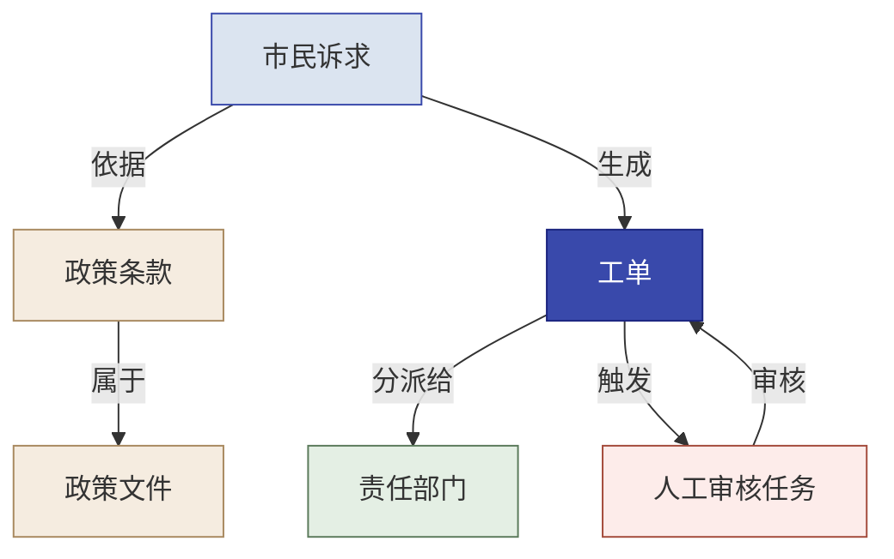

# Palantir 本体建模融入“能力回注”的编写施工指南

> **文档用途：** 指导教科书编写团队将 Palantir Ontology 的核心思想融入第 14—16 章  
> **依据版本：** 教科书 v0.7 及《第13-15章重构施工建议》  
> **主要落点：** 第 14 章工程验证、第 15 章业务语义回注、第 16 章综合评审  
> **资料口径：** Palantir Foundry 官方文档，信息核验于 2026 年 8 月  
> **重要边界：** 本书借鉴 Palantir Ontology 的建模思想，不把能力回注等同于 Palantir 产品使用，也不要求学员拥有 Foundry 环境。

---

## 一、为什么要把本体建模写进能力回注

本书现有能力回注主线是：

```text
识别 → 抽象 → 集成 → 验证
```

这条过程正确，但如果只用“把定制代码整理成通用组件”来解释，能力回注容易停留在技术复用层：

- 把 provider 封装成适配层；
- 把日志做成公共组件；
- 把重试、熔断和审计做成通用模块；
- 把 Prompt 或评测脚本整理成模板。

这些都是重要的**工程能力回注**，但还没有回答更深一层的问题：

> FDE 在客户现场理解到的业务对象、关系、状态、动作和治理规则，怎样从散落的数据字段、Prompt、流程文档和代码分支中抽出来，沉淀为下一个项目可以继续使用的业务能力？

Palantir Foundry 的 Ontology 提供了一种代表性答案。官方文档将 Ontology 描述为组织的数字孪生：它把组织的数据集和模型组织为对象类型、属性、关系类型和动作类型；同时把动作、函数、动态安全等“可执行”元素纳入同一体系。[1][2]

因此，本书引入本体建模的目的不是增加一段 Palantir 产品介绍，而是补足能力回注的**业务语义层**：

> **把项目中反复出现的业务对象、关系、状态、动作和治理约束，沉淀为人和系统都能共同理解、查询、执行和治理的业务模型。**

---

## 二、在全书中的定位

### 1. 能力回注增加“两条路径”

建议将能力回注明确拆成两条互补路径：

| 回注路径 | 回注什么 | 典型内容 | 主导角色 |
|---|---|---|---|
| 工程能力回注 | 可跨系统复用的技术机制 | 配置、日志、审计、provider 适配、重试熔断、健康检查、发布回滚 | Delta 主导 |
| 业务语义回注 | 对业务世界的稳定表达 | 对象、属性、关系、状态、动作、业务规则、权限边界 | Echo 主导抽象，Delta 验证实现 |

两条路径分别回答：

```text
工程能力回注：这套技术机制能否在下一个系统复用？
业务语义回注：这套业务语言能否在下一个客户复用？
```

### 2. 不改变能力回注四步法

本体建模不是第五个步骤，也不替代既有四步法。两者关系如下：

| 内容 | 作用 |
|---|---|
| 能力回注四步法 | 规定回注过程：识别、抽象、集成、验证 |
| 本体建模 | 为业务语义的抽象与集成提供结构化载体 |
| 第 14 章工程验证 | 验证对象能否映射数据、动作能否执行、权限能否落实 |
| 第 15 章业务判断 | 判断哪些对象、关系和动作具有跨客户价值 |
| 第 16 章最终评审 | 判断候选能力是否真正完成集成与跨场景验证 |

### 3. 不将本书改成 Foundry 产品教程

本书必须明确：

- Palantir Ontology 是代表性实现，不是唯一实现；
- 学员不需要 Foundry 账号或许可证；
- 可以使用领域模型、知识图谱、业务对象层或自建语义层表达同类思想；
- 正文教授的是业务建模与能力回注方法；
- Palantir 产品的具体操作只作为延伸阅读，不进入必做实验。

---

## 三、建议加入教材的核心概念

### 1. 教材定义

建议使用以下定义：

> **本体建模，是把业务世界中稳定存在的对象、属性、关系、状态、动作和治理约束，组织成一套人和系统都能共同理解、查询和执行的业务语言。**

Palantir 官方文档中的 Ontology 包含语义元素和可执行元素：对象类型、属性和关系用于描述组织中“有什么、彼此如何关联”；动作类型和函数用于表达组织“可以做什么”；权限和治理约束则控制谁能读取、修改或执行。[1][2][4]

### 2. 六类基础元素

| 元素 | 回答的问题 | 西岭示例 |
|---|---|---|
| 对象类型 | 业务世界中有什么 | 市民诉求、政策文件、政策条款、责任部门、工单、人工审核任务 |
| 属性 | 对象具有什么特征 | 诉求类别、敏感等级、处理状态、政策文号、生效日期 |
| 关系类型 | 对象之间怎样关联 | 诉求引用政策条款、工单分派给部门、条款属于政策文件 |
| 状态 | 对象当前处于什么阶段 | 待分类、待分派、处理中、待人工审核、已关闭 |
| 动作类型 | 业务人员或系统可以做什么 | 分类诉求、查询依据、创建工单、分派部门、升级人工、关闭工单 |
| 权限与治理 | 谁可以查看、修改和执行 | 坐席可提交，审核员可批准，管理员可配置，审计员只读 |

说明：对象类型、属性、关系类型和动作类型是 Palantir 官方核心概念；本书将“状态、权限与治理”单列，是为了更适合业务流程教学。[2][4]

### 3. 与知识图谱的区别

建议用简明表格说明：

| 维度 | 静态知识图谱 | 操作型业务本体 |
|---|---|---|
| 主要关注 | 实体与关系 | 对象、关系、状态、动作与治理 |
| 能回答 | 什么与什么有关 | 当前发生了什么、接下来可以做什么 |
| 动作能力 | 通常不是核心 | 明确定义可执行动作 |
| 权限审计 | 视实现而定 | 应进入设计核心 |
| 在本书中的用途 | 辅助理解业务关系 | 承载可查询、可执行、可治理的回注能力 |

需要避免绝对化：知识图谱也可以承载规则和行为；本表只用于说明本书为何强调“动作与治理”。

---

## 四、西岭案例的最小业务本体

### 1. 建模目标

把三个 Demo 从彼此独立的应用，整合为同一业务世界中的三个能力：

```text
分类器回答：这是什么？
RAG 回答：依据是什么？
路由工作流回答：下一步怎么办？
本体回答：这些对象、关系和动作如何组成统一业务系统？
```

### 2. 建议对象类型

| 对象类型 | 关键属性 | 数据来源 |
|---|---|---|
| 市民诉求 | 诉求编号、内容摘要、来源、类别、置信度、敏感等级 | 诉求受理系统 |
| 政策文件 | 文件名、文号、发布部门、生效日期、失效日期、版本 | 政策文档库 |
| 政策条款 | 条款号、正文、适用条件、所属政策 | 文档解析与 RAG 索引 |
| 责任部门 | 部门名称、职责范围、服务事项、联系方式 | 部门职责库 |
| 工单 | 工单编号、状态、优先级、责任部门、处理时限 | 工单系统 |
| 人工审核任务 | 触发原因、审核人、审核状态、审核结论 | 人工审核队列 |

这里的对象类型不是数据库表的简单改名。对象边界应来自真实业务身份和生命周期，不能为了复用而把不同含义的实体强行合并。Palantir 官方最佳实践同样强调，本体设计应围绕现实业务概念和可用工作流，而非机械复制底层数据结构。[3]

### 3. 建议关系类型

```text
市民诉求 → 依据 → 政策条款
政策条款 → 属于 → 政策文件
市民诉求 → 生成 → 工单
工单 → 分派给 → 责任部门
工单 → 触发 → 人工审核任务
责任部门 → 负责 → 事项类别
人工审核任务 → 审核 → 工单
```

### 4. 建议状态

以工单为例：

```text
待分类
→ 待分派
→ 处理中
→ 待人工审核
→ 已解决 / 已驳回 / 已关闭
```

状态必须服务于真实业务决策，不应仅为了画完整流程而增加。

### 5. 建议动作类型

```text
分类诉求
查询政策依据
创建工单
分派责任部门
升级人工审核
批准或驳回建议
修改处理状态
关闭工单
```

Palantir 官方将 Action Types 用于定义对象如何被修改，并提供规则、参数、权限、监控、撤销或恢复等能力。[4] 教材不需要展开具体产品配置，但应借此强调：

> 一个可回注的业务能力不能只描述“对象是什么”，还要描述“谁在什么条件下可以对它做什么”。

### 6. 建议 Mermaid 示意图

编写正文时可新建一张垂直布局图，建议表达以下结构：



*建议图题：西岭最小业务本体——对象、关系与人工审核闭环*

该图是新增示意，编写组可按全书图例规范调整文字，但不应把三个 Demo 画成彼此隔离的三个技术盒子。

---

## 五、把能力回注四步法与本体建模对齐

| 能力回注步骤 | 本体建模动作 | 西岭示例 | 必须留下的证据 |
|---|---|---|---|
| 识别 | 找出反复出现的业务名词、关系、状态和动作 | 诉求、政策、部门、工单、分派、升级 | 原始材料中的出现位置和使用场景 |
| 抽象 | 去掉客户专名，形成对象类型、关系类型和动作类型 | “西岭住建局”抽象为“责任部门” | 客户专属内容与通用语义对照 |
| 集成 | 映射数据源、系统接口、权限和工作流 | 工单表映射为工单对象，路由接口映射为分派动作 | 数据来源、接口、权限和状态变化 |
| 验证 | 在第二客户或第二场景中验证复用 | 企业员工服务台或园区服务 | 改动量、配置项、回归结果和失败点 |

建议教材强调：

> 本体建模使“抽象、集成、验证”不再只停留在文字总结，而是形成对象、关系、动作和治理边界明确的业务模型。

---

## 六、四层能力回注模型

建议在第 15 章增加四层回注模型：

| 回注层 | 回注内容 | 西岭示例 | 是否适合公共回注 |
|---|---|---|---|
| 内容层 | 客户特定数据与知识 | 西岭政策文本、具体部门名称 | 通常否，保留在客户域内 |
| 语义层 | 可复用对象、属性、关系和状态 | 请求、政策、部门、工单及其关系 | 经跨场景验证后可以 |
| 动作层 | 可复用业务动作和规则 | 分类、查依据、分派、升级、人工审批 | 经权限与接口验证后可以 |
| 治理层 | 权限、审计和责任边界 | 谁能看、谁能改、谁批准、如何追责 | 通用机制可回注，客户策略配置化 |

这一模型用于解决“回注什么、不回注什么”的问题。

### 不应回注的内容

- 客户原始数据；
- 个人信息和敏感实例；
- 西岭具体政策文本；
- 未经授权的客户业务规则；
- 客户专属部门名称和人员信息；
- 无法跨场景解释的临时代码。

### 可以作为回注候选的内容

- “业务请求—依据—责任主体—工单—人工审核”的抽象结构；
- 分类、查询依据、分派、升级和审批等动作模式；
- 对象级权限、动作权限和审计机制；
- 可配置的状态机与责任映射；
- 与本体对象对齐的通用工程组件。

---

## 七、分章施工方案

# 第 14 章：增加“本体的工程落地验证”

建议在 `14.10 工程能力回注` 中增加一个子节：

## 14.10.x 业务本体的工程验证

本节不负责决定业务对象和关系是否正确，而是验证它们能否真正进入系统。

应覆盖：

1. **数据映射**：对象属性能否找到稳定数据来源；
2. **身份与主键**：对象如何唯一识别，如何避免重复对象；
3. **关系维护**：关系来自直接字段、规则计算还是人工确认；
4. **状态一致性**：状态变化是否有合法路径和并发冲突控制；
5. **动作接口**：每个动作是否有真实 API、函数或人工流程；
6. **权限与审计**：谁能执行动作，失败和拒绝是否留痕；
7. **幂等与回滚**：动作重试是否造成重复分派、重复通知或重复写入；
8. **版本兼容**：对象属性、关系和动作变化是否破坏已有应用；
9. **跨 Demo 复用**：至少一个对象或动作模型在第二个 Demo 中复用。

建议在 Build Readiness Gate 中增加一项：

| 检查项 | 通过证据 | 未通过时的动作 |
|---|---|---|
| 业务本体可执行性 | 对象有数据来源、关系可维护、动作有接口、权限可验证 | 降级为概念模型，不得宣称已形成平台能力 |

第 14 章结论必须区分：

- **概念本体**：只完成对象和关系设计；
- **可执行本体**：完成数据映射、动作接口和权限；
- **已验证回注能力**：可执行本体已在第二场景复用。

# 第 15 章：主体增加“业务语义回注”

建议将原 `15.7 能力回注的联合决策` 扩展为以下结构：

## 15.7 从项目资产到业务本体：能力回注的两条路径

### 15.7.1 为什么仅回注代码还不够

说明业务含义往往隐含在数据字段、Prompt、条件分支、部门表和人工经验中。只回注代码，下一个客户仍需重新理解业务世界。

### 15.7.2 工程能力回注与业务语义回注

使用本指南第二节的两路径表。

### 15.7.3 Palantir Ontology 的参考框架

介绍对象类型、属性、关系类型、动作类型、函数和治理边界，明确是代表性实现而非唯一标准。[1][2][4]

### 15.7.4 西岭最小业务本体

使用对象、关系、状态和动作表，以及一张 Mermaid 示意图，把三个 Demo 统一到同一业务世界。

### 15.7.5 四层能力回注模型

使用“内容层—语义层—动作层—治理层”，判断哪些客户内容不回注，哪些通用结构可以成为候选。

### 15.7.6 回注优先级

建议采用以下判断：

| 维度 | 核心问题 |
|---|---|
| 业务通用性 | 是否在多个客户或行业重复出现 |
| 语义稳定性 | 对象和关系是否长期稳定，而非临时流程 |
| 工程可实现性 | 是否有可靠数据、接口和状态来源 |
| 治理可落地性 | 权限、审计、责任和回滚是否清楚 |
| 复用收益 | 是否能明显降低下一次交付成本 |
| 回注风险 | 是否带入客户数据、知识产权或错误抽象 |

### 15.7.7 平台无关的本体回注练习

全员必做练习不要求使用 Foundry。学员需要：

1. 从西岭材料识别 4—6 个核心对象；
2. 为每个对象定义必要属性；
3. 定义对象之间的关系；
4. 定义 3—5 个业务动作；
5. 标明动作执行者、权限和人工审批条件；
6. 区分客户专属内容与可回注语义；
7. 用第二场景验证模型是否可复用。

建议第二场景采用“企业员工服务台”：

| 西岭市民服务 | 企业员工服务台 |
|---|---|
| 市民诉求 | 员工请求 |
| 政策文件 | 企业制度 |
| 责任部门 | 人力、IT、行政、财务 |
| 工单 | 服务请求单 |
| 市数据局 | 合规或信息安全部门 |

验证标准：如果只需替换对象实例、部门配置和内容数据，而不需要推倒“请求—依据—责任主体—工单—人工审核”结构，则说明模型具有一定跨场景复用价值。

# 第 16 章：增加“本体回注最终评审”

建议在 `16.5 能力回注最终评审` 中增加以下检查：

- [ ] 对象类型来自真实业务，而不是数据库表机械改名；
- [ ] 每个核心属性有明确数据来源；
- [ ] 关系有维护机制；
- [ ] 状态变化有合法路径；
- [ ] 动作有执行接口或人工流程；
- [ ] 动作权限、审计和失败处理清楚；
- [ ] 客户专属数据与公共语义已隔离；
- [ ] 已在第二场景验证复用；
- [ ] 已记录复用时的改动量和失败点；
- [ ] 未把概念图误称为已集成的平台能力。

建议最终评审使用三级判定：

| 成熟度 | 判定 |
|---|---|
| 本体候选 | 已识别对象、关系和动作，但未完成工程映射 |
| 可执行本体 | 已完成数据、动作、权限和审计映射 |
| 已回注能力 | 已集成，并通过第二场景或第二客户验证 |

---

## 八、对其他章节的最小联动

### 第 1 章

在 Airbus 或业务关系网案例处保留一句：

> FDE 的价值不仅是连接数据，还要把客户的业务对象、关系和可执行动作建成统一模型。

不要在第 1 章展开 Ontology 产品细节。

### 第 2 章

在能力回注飞轮中补充：

> 回注资产不仅包括代码组件，也包括对象模型、关系模型、动作模式和治理规则。

### 第 3 章

在能力回注四步法后增加一张简表，把识别、抽象、集成、验证与本体建模对齐。此处只做总览，详细内容指向第 15 章。

### 第 5—6 章

Discovery 时增加“业务名词、关系和动作”的观察要求：

- 客户反复提到哪些业务对象；
- 哪些对象之间的关系决定业务结果；
- 哪些动作由谁执行；
- 哪些状态变化需要审批。

不要要求 Echo 在 Discovery 阶段直接完成最终本体；只收集候选业务语义。

### 第 8、10、12 章

在每个实操的小结中增加一行“本体贡献”：

- 第 8 章：产生诉求类别、置信度和人工兜底属性；
- 第 10 章：产生诉求与政策条款、政策文件之间的依据关系；
- 第 12 章：产生工单状态、责任部门、分派和人工审核动作。

这些只是后续本体建模的输入，不应在各实操章重复讲本体理论。

---

## 九、建议新增的教材正文示例

以下文字可由编写组吸收改写后放入第 15 章：

> 能力回注不只是把代码整理成组件。更深一层的回注，是把项目中反复出现的业务对象、关系、状态、动作和治理约束沉淀为统一的业务语义模型。Palantir Ontology 是这一思路的代表性实现：它用对象类型、属性和关系描述组织中“有什么”，用动作类型和函数描述组织“可以做什么”，并把权限与治理嵌入业务操作。[1][2][4]
>
> 在西岭项目中，分类器、RAG 和路由工作流不是三个互不相关的技术 Demo。分类器为“市民诉求”补充类别和置信度；RAG 建立“诉求—政策条款—政策文件”的依据关系；路由工作流根据诉求、工单和责任部门的状态执行分派、升级与人工审核。把这些对象、关系和动作统一建模，才可能把一次项目经验转化为下一座城市、下一类服务平台可以复用的能力。
>
> 本书借鉴的是这种建模方法，而不是要求所有项目采用特定厂商平台。领域模型、知识图谱或自建业务对象层也可以承载类似抽象。判断回注是否成立的关键，不是是否画出一张对象关系图，而是它是否完成数据映射、动作执行、权限治理，并在第二个场景中证明可复用。

---

## 十、编写与审核红线

1. 不写“能力回注就是 Ontology”；
2. 不把 Palantir 产品实现写成所有项目的唯一标准；
3. 不把静态对象关系图直接称为可执行本体；
4. 不用本体名义回注客户原始数据和专属政策；
5. 不为了“通用”而过度抽象，导致对象失去业务含义；
6. 不把数据库表名简单改成对象类型；
7. 不把动作写成没有权限、接口和失败处理的动词清单；
8. 不在没有第二场景验证时宣称“已铺成公路”；
9. 不编造 Palantir 官方术语；教材新增定义应标注“教材提炼”；
10. 不改变现有能力回注四步法，只补充本体作为业务语义载体。

---

## 十一、编写组施工顺序

### 第一阶段：确定定位

- [ ] 确认本体是“业务语义回注”的代表性方法；
- [ ] 确认不要求 Foundry 实操；
- [ ] 确认工程回注与业务语义回注的边界；
- [ ] 确认第 14、15、16 章各自职责。

### 第二阶段：补第 15 章主体内容

- [ ] 增加“为什么只回注代码不够”；
- [ ] 增加两条回注路径；
- [ ] 增加六类本体元素；
- [ ] 增加西岭最小业务本体；
- [ ] 增加四层回注模型；
- [ ] 增加平台无关练习；
- [ ] 增加第二场景迁移验证。

### 第三阶段：补第 14 章工程验证

- [ ] 增加数据映射；
- [ ] 增加对象身份和关系维护；
- [ ] 增加状态一致性；
- [ ] 增加动作接口、权限、审计、幂等和回滚；
- [ ] 增加跨 Demo 工程复用验证。

### 第四阶段：补第 16 章最终评审

- [ ] 增加本体成熟度三级判定；
- [ ] 区分概念本体、可执行本体和已回注能力；
- [ ] 增加客户数据和知识产权隔离检查；
- [ ] 增加第二场景验证证据。

### 第五阶段：做全书最小联动

- [ ] 第 1—3 章补一处总览；
- [ ] 第 5—6 章补业务语义观察要求；
- [ ] 第 8、10、12 章补“本体贡献”；
- [ ] 更新导读学习路径、术语表和交叉引用；
- [ ] 在修订记录中登记本体建模新增内容。

---

## 十二、验收门槛

本体建模内容只有满足以下条件，才算完成教材化落地：

- [ ] 定义来自官方概念并注明教材化提炼边界；
- [ ] 明确 Palantir 是代表性实现而非唯一标准；
- [ ] 能解释对象、属性、关系、状态、动作和治理；
- [ ] 西岭三个 Demo 已被统一到同一业务模型；
- [ ] 清楚区分客户内容与可回注语义；
- [ ] 能力回注四步法与本体建模形成明确映射；
- [ ] 第 14 章包含数据、动作、权限和审计的工程验证；
- [ ] 第 15 章包含平台无关的建模练习；
- [ ] 第 16 章包含本体成熟度和跨场景复用评审；
- [ ] 没有把静态概念图夸大为已集成能力；
- [ ] 没有回注客户原始数据、专属政策或敏感实例；
- [ ] 所有 Palantir 产品事实均有官方来源。

---

## 十三、编写组最终口径

建议全书统一使用以下表述：

> **能力回注有两个互补层面：一是把可复用的技术机制沉淀为工程能力，二是把稳定的业务对象、关系、动作和治理约束沉淀为业务语义能力。Palantir Ontology 是业务语义回注的代表性实现，但不是唯一实现。是否真正完成回注，不取决于是否画出本体图，而取决于模型是否完成数据映射、动作执行和权限治理，并在第二个场景中证明可复用。**

---

## Sources

[1] Palantir, “Ontology Overview”: https://www.palantir.com/docs/foundry/ontology/overview/  
[2] Palantir, “Ontology Core Concepts”: https://www.palantir.com/docs/foundry/ontology/core-concepts/  
[3] Palantir, “Ontology Design: Best Practices”: https://www.palantir.com/docs/foundry/ontology/ontology-best-practices/  
[4] Palantir, “Action Types: Overview”: https://www.palantir.com/docs/foundry/action-types/overview/
