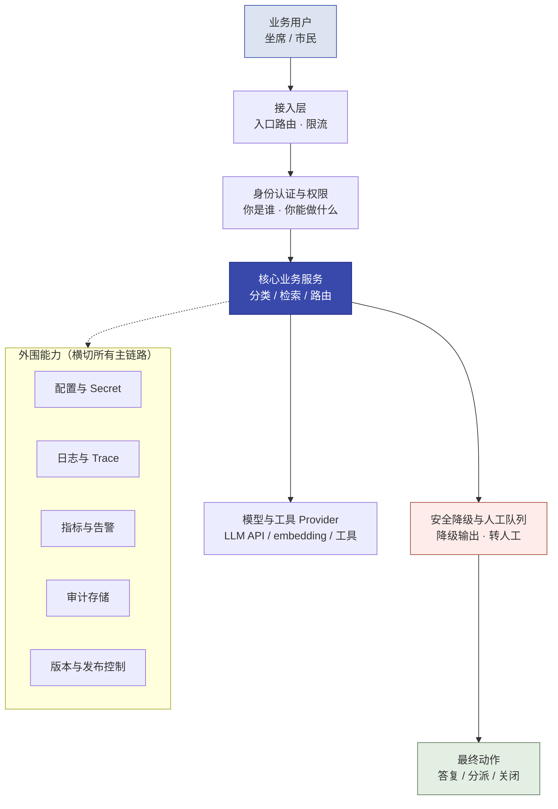

# 第 14 章  Delta 工作法：Build、Scale 与工程化交付

> **本章定位：** 知识 + 演练单元 · Delta 侧生产化——把第 8/10/12 章的一个 Demo，从"演示可行"推进到"可配置、可追溯、可恢复、可发布、可观察、可交接"的可运营系统。它承接第 13 章的生产底座决策，为第 15 章的价值判断提供工程证据。
> **本章产出：** 你能区分 Prototype、Build 与工程 Scale 所需证据；看懂一张完整的生产目标架构；用九维 Build Readiness Gate 识别生产差距；讲清并可验证"可配置可追溯 / 可失败可恢复 / 可观察可判断 / 可发布可回退"四组核心能力；对性能、容量与成本形成判断；建立身份到供应链的 AI 安全边界；通过跨组接管证明工程 Scale；并完成一次从分类 Demo 到可运营服务的贯穿实验。
> **建议读者：** Delta（施工主力必读）；Echo 需理解"工程证据"长什么样（第 15/16 章会引用）。
> **前置：** 第 7 章（gstack 与四条工程纪律）、第 8/10/12 章任一个 Demo（默认第 8 章分类器）、第 13 章（生产底座，可选先读）。
> **适配说明：** 默认实验对象为 **第 8 章诉求分类器**（业务简单、依赖少，便于注入故障与版本变化）；进阶可选第 12 章路由工作流（增加 HITL 恢复、工具幂等）。**精确安装与运行命令待实验环境复核后以随书资源包为准——本章只定目标、证据与验收，不写死命令。**

---

## 本章导学

- **学习目标（能力导向 7 项）：**
  1. 区分 Prototype、Build 与工程 Scale 的目标和证据，说出西岭三个 Demo 当前分别处于哪个阶段；
  2. 使用 Build Readiness Gate 识别生产差距（九维，每维有对应的正文与证据）；
  3. 建立可配置、可追溯的运行基础（配置/Secret/版本/审计，回答"一次结果能否还原到当时版本与决策上下文"）；
  4. 设计并验证可失败、可降级、可恢复的系统（错误分类、超时、重试、退避、熔断、降级、幂等、补偿、人工兜底）；
  5. 建立可观察、可告警、可判断的运行体系（日志、Trace、指标、SLI/SLO/Error Budget、告警、事故响应、漂移）；
  6. 完成安全发布、灰度、联动回滚与权限验证（六类版本、五层安全、最小权限）；
  7. 通过跨组接管与跨 Demo 复用证明工程 Scale 与能力回注（含业务本体可执行性验证）。
- **前置知识：** 第 7 章（gstack 八环节、SPEC、四条工程纪律）、第 8/10/12 章（至少一个可运行 Demo）、第 13 章（私有化形态与选型，进阶）。
- **章节地图：** 第 13 章回答"底座部署在哪、模型怎么适配"；本章回答"**系统怎样接得住**"（工程 Scale）；第 15 章回答"组织为什么愿意接"（业务 Scale，Echo 主导）；第 16 章全团队作出最终交付决策。**本章的每个生产差距与接管证据，都是 15/16 章"能上生产吗、能交给客户吗"的底气。**

> **一句话记住本章：** Prototype 证明能做，Build 证明能稳定运行，工程 Scale 证明客户技术团队能接管——**Delta 让系统接得住**；而"接得住"不是一张检查清单，是一条"发现差距 → 加护栏 → 注入故障 → 观察告警 → 灰度发布 → 执行回滚 → 交给另一组接管 → 抽象可复用能力"的连续施工线。

---

# 第一层　建立生产化认知

## 14.1 Prototype、Build 与工程 Scale 的证据边界

不同阶段回答不同问题，**证据逐级升级，不能跨级使用**：

| 阶段 | 核心问题 | 进入条件 | 通过证据（退出条件） | 反例（拿低阶证据当高阶结论） |
|------|---------|---------|---------------------|---------------------------|
| **Prototype** | 方案能不能成立 | 有任务书与样例数据 | 功能 Demo、小样本验证达标 | 25 条样本全对 → 宣称"能上生产" |
| **Build** | 系统能不能稳定、安全地运行 | Prototype 通过；有生产差距清单 | 测试、异常恢复、权限、版本与回滚均实测 | Demo 能演示 → 宣称"生产可用" |
| **工程 Scale** | 客户技术团队能不能持续运营 | Build 通过；有运行手册与监控 | 跨组接管演练通过；监控告警闭环 | 原作者能跑 → 宣称"客户能接管" |

> **核心结论：Prototype 证明能做，Build 证明能稳定运行，工程 Scale 证明客户技术团队能够接管。** 每一阶段的"通过"都要有上一阶段的全套证据，证据不足就退回补（呼应第 3 章 Stage Gate 与止损规则：连续不过就降范围或终止）。

**西岭三个 Demo 当前处于哪个阶段（教学起点）：**
- **诉求分类器（第 8 章）**：Prototype 已达标（盲测准确率、转人工率、演示级声明）——**本章的贯穿对象**，从 Prototype 起步走完整条生产化线；
- **政策问答 RAG（第 10 章）**：Prototype 已达标（双指标 + 库外拒答）——本章进阶场景，生产化时要额外处理**索引版本与重建**；
- **工单分级工作流（第 12 章）**：Prototype 已达标（路由正确率 + 敏感件零漏判）——进阶场景，生产化时要额外处理 **HITL 暂停恢复与工具幂等**。

---

## 14.2 从 Demo 到生产服务：目标架构

在看任何单项之前，先建立一张**目标生产架构**——为什么配置、日志、权限、告警各自存在、如何拼成整体（这是全章各小节的"地图"）：


*图 14-1：分类 Demo 生产化后的目标架构——主链路 + 横切外围能力（本节是 14.4–14.10 的组装图）*

- **主链路**：用户请求 → 接入限流 → 身份权限 → 业务服务 → 模型/工具 Provider → 降级与人工队列 → 最终动作；
- **横切外围**：配置与 Secret（14.4）、日志与 Trace（14.6）、指标与告警（14.6/14.8）、审计（14.4/14.9）、版本与发布（14.7）。

> 读后面各节时都回到这张图问一句："这项机制挂在主链路的哪一段、由哪个外围能力承载、谁在什么条件下接管（转人工还是降级）？"——这就是把"知识点"变成"系统"的方法。

---

## 14.3 Build Readiness Gate：九维生产准备地图

Build 不是"把 Demo 打包上线"，而是对着**九个维度**逐项核"当前状态 → 生产差距 → 修复动作 → 责任人 → 完成证据 → 未通过处理"（**Build Readiness Gate，教材提炼**）。它是全章地图：每个维度对应后续正文，读到后面就知道"这一维该做什么、怎么做才算过"：

| # | 维度 | 正文 | 通过证据的要点 |
|---|------|------|--------------|
| 1 | 功能与数据 | 14.4/14.11 | 功能按 SPEC 完整；开发/盲测数据隔离、可追溯 |
| 2 | 配置与密钥 | 14.4 | 配置与代码分离；Secret 不进源码/日志/仓库 |
| 3 | 性能与容量 | 14.8 | 延迟、吞吐、并发达目标；容量结论注明假设与余量 |
| 4 | 稳定性与降级 | 14.5 | 超时/重试/熔断/降级实测生效 |
| 5 | 权限与安全 | 14.9 | 最小权限、越权拒绝、输入校验 |
| 6 | 日志、审计与指标 | 14.6 | 发生了什么 / 谁做了什么决定 / 现在运行得怎么样 |
| 7 | 发布、灰度与回滚 | 14.7 | 六类版本可追溯；灰度可切换；联动回滚可执行 |
| 8 | 运维与交接 | 14.10 | 监控告警、运行手册、跨组接管 |
| 9 | 业务本体可执行性 | 14.11 | 对象有数据来源、关系可维护、动作有接口、权限可验证 |

> [!CAUTION] **Gate 不是打分表演。** "当前状态：能跑；差距：无"不算数——每一格都要有证据（日志、指标、故障注入记录、接管演练记录）。"未通过"是可接受结果：它指明下一轮修什么（呼应第 3 章止损规则）。

---

# 第二层　讲透四项生产核心能力

## 14.4 可配置、可追溯

> **核心问题：一次线上结果，能否还原到当时使用的完整版本与决策上下文？**

**业务场景**：用户投诉"同一个问题为什么昨天一个说法、今天另一个"。如果系统只记录模型名，不记录 Prompt、配置、数据版本，这单就无法追责、无法复现。

**概念与机制：**
- **配置来源与优先级**：默认值 → 环境变量 → 配置文件 →（可选）运行时覆盖；同一参数的"最终生效值"必须可查；
- **环境分离**：开发 / 测试 / 生产配置分离，生产 Secret 永不进开发环境；
- **Secret 管理**：API Key / 口令只走环境变量或密钥管理；**支持轮换**（换了 Key 旧配置立即失效并告警），绝不写进源码、日志与仓库；
- **缺配置安全失败**：删掉必需配置后启动，系统应**拒绝启动并给出明确错误**，而不是带着错误配置"看起来正常"地跑；
- **六类版本**：代码、模型/provider、Prompt、配置、数据集、索引（RAG）——每次线上结果都能回答"这六样当时各是什么版本"。

**权重表（配置加载的常见权衡）：**

| 方案 | 优点 | 代价 |
|------|------|------|
| 命令行参数 | 简单、进程级隔离 | 多实例难同步、难审计 |
| 环境变量 | 容器/平台标准、不进仓库 | 数量多时难以管理 |
| 配置文件 + 版本控制 | 可追溯、可回滚 | 需防止把 Secret 一起入库 |
| 配置中心（Consul/etcd 等） | 集中管理、动态刷新 | 引入新组件，进阶选做 |

**审计（不可篡改的基本思路）：** 关键决策（转人工、改配置、批准/驳回）追加**只增不改**的审计记录（写入后不允许覆盖），记录"谁、何时、哪个版本、做了什么决定、依据什么输入"。日志脱敏：**不得记录明文个人信息与密钥**。

**西岭示例（分类器）：** `.env` 放模型 Key；`config.yaml`（入库、可版本化）放类别清单、阈值、覆盖比例；每次请求日志带 `app_version + prompt_version + data_version`。

> [!IMPORTANT] **可追溯性 = 审计链 + 版本绑定 + 日志脱敏三者同时成立。** 少一个，"能还原"就是空话。

**反模式：** Prompt 换了一版不改版本号，半年后无法回答"当时用的哪版提示词"；把 Secret 写进 `requirements.txt` 注释里；删除配置后系统静默降级运行。

**动手（核心必做）：** 配置与 Secret 分离；记录并给每次请求打上三类版本标识；删除必需配置验证"拒绝启动"；追加一条关键决策的审计记录并验证其不可被普通流程覆盖。

**验收证据：** 仓库无明文 Secret；请求日志能还原"代码+Prompt+配置+数据"版本；删配置后启动失败且报错信息不含密钥内容。

**迁移（换成 RAG / 路由工作流）：** RAG 多一维"索引版本"与重建时间戳；路由工作流多一维"HITL 审批版本"（审批规则改了要能追溯）。

---

## 14.5 可失败、可恢复

> **核心问题：依赖失败时，系统能否进入一个可预测、可解释、可恢复的状态？**

**业务场景**：模型 API 超时、被限流、返回 500 或非法 JSON——如果应用"无限重试"或"失败即报错"，会把一次瞬时故障放大成整体不可用。

**错误分类（先答"这个错误该不该重试"，再谈怎么重试）：**

| 故障 | 是否重试 | 处理建议 |
|------|---------|---------|
| 网络瞬时超时 | 可以，有限次 | 指数退避后重试，受总超时限制 |
| 429 限流 | 可以，延迟重试 | 尊重 `Retry-After` 与服务端限流提示，先退避（[限流处理参考](https://cli.nylas.com/guides/email-api-429-rate-limit-fix)） |
| 500 服务异常 | 视场景，有限次 | 超过阈值后熔断与降级 |
| 401 / 403 鉴权失败 | **不应自动重试** | 检查配置与权限，重试只会放大错误 |
| 请求参数错误（4xx 业务错） | **不应重试** | 立即失败并修正输入 |
| 返回结构非法 | 可有限重试一次 | 仍失败则安全降级或转人工 |

**机制原理：**
- **超时（timeout）**：为每次外部调用设上限（如 10–30s），超过即按失败处理——不给"永远挂起"留空间；
- **有限重试 + 指数退避 + 随机抖动**：重试次数有上限（如 2–3 次），间隔按 `base × 2^n` 增长并**加随机抖动**，避免大量客户端同时重试形成"重试风暴"（[AWS Bedrock 重试与退避](https://repost.aws/ja/knowledge-center/bedrock-retry-exponential-backoff-api)、[AWS SDK 重试策略](https://docs.aws.amazon.com/sdk-for-swift/latest/developer-guide/using-retry.html)）；
- **熔断（Circuit Breaker）三态**：连续失败达到阈值 → **Closed（闭合，正常放行）→ Open（打开，快速失败，不再调用）→ Half-Open（半开，放少量探测流量）**，成功即回 Closed、继续失败回 Open（[Circuit Breaker Pattern](https://iasa-global.github.io/btabok/circuit_breaker.html)）；
- **降级与人工兜底**：失败 → 有限重试 → 熔断 → **安全降级**（只读 / 简化回答 / 缓存兜底）→ **转人工**——永远不越过"转人工"这条线，也**禁止失败时编造答案或默认自动处理**；
- **幂等与补偿**：有副作用的动作（创建工单、分派部门、发通知、扣款）**必须幂等**——客户端带**幂等键（Idempotency Key）**，服务端按键去重，重试不会重复执行（[Stripe：幂等请求](https://edge-docs.stripe.com/api/idempotent_requests)）；跨多步操作用**补偿（Saga：已成功的步骤逐个回滚/补偿）**保证一致（[Saga 模式](https://www.freecodecamp.org/news/the-saga-pattern-in-node-js-roll-back-distributed-transactions-across-microservices)）。

**西岭示例（分类器 + 路由化）：** 模型调用超时 → 重试 2 次（退避+抖动）→ 连续 5 次失败熔断 30s → 降级"拿不准的转人工"；"分派工单"动作带幂等键，重试不产生第二张工单。

**反模式（案例）：**
- **无限重试放故障**：模型服务变慢 → 应用不断重试 → 请求放大 → 服务更慢 → 全量堆积（重试必须有次数上限、退避、抖动和总超时）；
- **重复执行副作用**：工单分派接口超时，系统不知第一次是否成功，重试后同一工单分派两次（必须有幂等键/状态确认/补偿）。

**动手（核心必做）：** 故障注入（超时 / 429 / 500 / 断字段 / 连续失败）逐类验证：哪些重试、哪些不重试；观察熔断三态切换与恢复探测；给一个有副作用的动作加幂等键并验证重试不重复。

**验收证据：** 错误分类表与实测一致；熔断器有开放/闭合/半开三态与恢复探测；重试后无重复分派/重复通知；失败路径最终落在"降级或转人工"，没有编造答案。

**迁移：** RAG 的 provider 换成 embedding/检索服务（注意批量大小与限流）；路由工作流的工具调用要配置超时、幂等键与失败→转人工（进阶选做：中断恢复，见 14.10）。

---

## 14.6 可观察、可判断

> **核心问题：怎样判断系统处于健康、退化还是失控状态？**

**业务场景**：上线后没人看数字，事故发生在"没监控到"而不是"没发生"。可观察性 = **日志（发生了什么）+ Trace（一次请求经历了什么）+ 指标（现在跑得怎么样）+ 告警（谁该知道）**，四件事别混为一谈。

**日志与 Trace：**
- **日志**：`request_id`、请求时间、处理结果、延迟、异常类型、模型/Prompt/配置版本、是否转人工；不记明文敏感数据；
- **Trace**：一次 AI 请求要经历 输入 → 分类/检索 → 模型调用 → 工具调用 → 人工审核 → 最终动作，用 **`trace_id`（贯穿整次请求）+ `span_id`（单个步骤）+ 步骤耗时与调用结果**还原完整链路（[OpenTelemetry Tracing](https://raw.githubusercontent.com/open-telemetry/opentelemetry-specification/aa41e75d25720a8579d45a5696d393e580a722a6/specification/tracing-api.md)、[上下文传播](https://main--opentelemetry.netlify.app/docs/concepts/context-propagation/)）。

**四类指标体系：**

| 指标类型 | 示例 |
|---|---|
| 系统指标 | 延迟（P50/P95/P99）、错误率、吞吐、资源占用 |
| 模型指标 | 解析失败率、拒答率、转人工率、质量抽检得分 |
| 业务指标 | 类别分布、处理时长、返工率 |
| 成本指标 | token 数、单请求成本、日/月预算 |

**SLI / SLO / SLA / Error Budget（教材提炼，概念源自 Google SRE）：**

| 概念 | 含义 | 示例 |
|---|---|---|
| **SLI**（Service Level Indicator） | 实际测量的服务指标 | 最近 7 天请求成功率 |
| **SLO**（Service Level Objective） | 团队内部的期望目标 | 成功率 ≥ 99.5% |
| **SLA**（Service Level Agreement） | 对客户作出的承诺 | 是否写入合同需另行确认 |
| **Error Budget** | 目标窗口内允许的失败量 | 一个月允许 4.3 分钟不可用（99.99% 时） |

> [!IMPORTANT] **SLO 是工程治理工具，不是对外合同。** 演示环境里跑出的短时 99.9% 不能直接写成客户 SLA；把 SLA 写进合同涉及法务与商业决策，须另行确认（[Google Cloud：Error Budget 经验](https://cloud.google.com/blog/products/gcp/understanding-error-budget-overspend-cre-life-lessons)、[SLO/SLI/Error Budget](https://raw.githubusercontent.com/sujeet-pro/sujeet.pro/refs/heads/main/content/articles/slos-slis-error-budgets/README.md)）。

**告警与事故响应：** 至少三类告警——错误率持续超阈值、P95 延迟异常、转人工率/拒答率/类别分布漂移。**告警必须有责任人**：接收人、响应时限、处置动作、复盘记录。没有责任人的告警不构成有效运营机制（案例：错误率告警已触发，但没人接收、没有处置动作）。

**漂移（进阶）：** 数据漂移（线上分布 vs 评估分布）与模型漂移（拒答率/转人工率持续上升）是质量的前哨；RAG 的场景要监控"索引更新后检索命中率变化"。

**动手（核心必做）：** 结构化日志 + `request_id`；指标采集（延迟、错误率、转人工率）；至少真实触发一次告警并记录完整事故响应（接收人/响应时间/排查/处置/复盘）。

**验收证据：** 能凭 `request_id` 串起一次请求的日志与调用链；指标面板可见；告警真实触发过且有处置记录；运行中的 SLI 与 SLO 明示目标窗口口径。

**迁移：** RAG 加"索引版本"与重建耗时指标；路由工作流加"HITL 审批延迟"与"转人工积压数"指标。

---

## 14.7 可发布、可回退

> **核心问题：新版本如何安全进入生产，出现退化后如何回到已知稳定状态？**

**业务场景**：改了一个 Prompt 就上线，结果质量下降——"回滚"却只回滚了代码，原来的问题依旧存在。

**六类版本与联动：** 上线/回滚必须同时考虑：**代码、模型/provider、Prompt、配置、数据集、索引（RAG）**——只回滚其中一样，其余不一样的版本组合可能继续异常（见反模式）。

**灰度策略（轻量即可，不要求 K8s）：**

| 策略 | 做法 | 适用 |
|------|------|------|
| **双配置/双进程切换** | 同时维护 v1/v2 配置或进程，按比例分流量 | 本实验默认 |
| **金丝雀（Canary）** | 新版本先接 5%–10% 请求，观察后再放大 | 数据与质量敏感的升级 |
| **蓝绿（Blue-Green）** | 双环境整体切换，回滚=切回旧环境 | 代价高但回滚最快 |
| **滚动（Rolling）** | 分批替换实例 | 多实例场景（进阶） |

**发布 Gate：** 灰度前确认——新版本有版本号与差异说明；比较指标口径固定（质量/延迟/成本）；定义"退化"的量化判据（如准确率下降 X%、转人工率跃升）；回滚预案已写清（回滚哪个版本、索引要不要重建）。

**西岭示例（分类器）：** 保存稳定版 v1（代码+Prompt+阈值+数据版本）；修改阈值得到 v2；灰度 10% 请求；比较分类准确率、转人工率、延迟与成本；人为制造 v2 退化（如把阈值改坏）；观察告警 → 执行回滚 → 验证 v1 恢复。

**反模式（案例）：**
- **Prompt 更新无法追责**：用户投诉同一问题前后结果不同，系统只记录模型名、没记 Prompt 与配置版本；
- **RAG 回滚只回代码**：代码回到 v1，索引还是 v2，结果继续异常——回滚必须代码、模型、Prompt、配置、数据、索引联动。

**动手（核心必做）：** 完成一次 v1→v2 灰度、一次人为退化的告警触发与一次真实回滚，留下版本清单与回滚记录。

**验收证据：** 六类版本均可追溯；灰度流量可调；回滚后 v1 行为恢复；回滚记录含"回滚了什么、为什么、之后如何防复发"。

**迁移：** RAG 的回滚必须包含"索引回滚或重建"；路由工作流的回滚要确认 HITL 审批规则版本一致。

---

# 第三层　讲清工程 Scale

## 14.8 性能、容量与成本

> **核心问题：平均流量能跑 ≠ 峰值流量能接住；模型服务能响应 ≠ 人工审核队列不会积压。**

**业务场景**：演示时 10 条请求流畅，上线后早高峰 200 并发——如果只在"平均流量"上测试，峰值一来就雪崩。

**工作负载画像（先画画像，再谈容量）：** 平均请求量、峰值请求量、请求长度（token）、业务高峰时段、同步还是异步、人工审核比例。

**关键指标：** P50 / P95 / P99 延迟、吞吐量（每秒请求数）、并发数、超时率、队列等待时间、单请求成本（token × 单价）、人工审核队列长度。

**容量判断框架（教材提炼）：**

```text
峰值业务量
× 单请求资源消耗（token / embedding 批量 / 推理时长）
× 峰值与故障安全余量（如 1.5–2×）
→ 服务容量（模型吞吐）与人工容量（审核队列）
```

**模型服务限流：** 模型/工具 Provider 有并发与速率上限（如 RPM/TPM）；超出会得到 429——容量规划要以**限流上限**为硬约束，而不是理想吞吐。**token 长度**直接影响延迟与成本：上下文越长，单请求越慢越贵（同时把输入裁剪到必要长度，也是成本工程）。

**人工审核队列容量：** 转人工率 × 请求量 = 每小时进人工队列的件数；人工容量 < 进队量 → 积压 → 应调整自动化边界或增加审核人力（数据来自 14.6 的转人工率指标）。

**实验（进阶选做）：** 对分类器做小规模压测：并发上升时延迟如何变化；Provider 限流如何表现（429/退避）；把人工兜底比例调高观察队列是否积压；降级策略能否保护系统。**所有结论注明"仅本次环境与样本"。**

**验收证据：** 容量结论含假设（并发、token 长度、余量）与实测（或明确的"待实测"标注）；没有把单机样例外推为生产容量保证。

**迁移：** RAG 的容量还要看索引规模与 embedding 批量；路由工作流还要看工具调用次数与 HITL 队列。

---

## 14.9 权限、安全与治理

> **核心问题：模型有工具调用能力 ≠ 模型有权执行所有动作。**

**业务场景**：Agent 能调"查部门"工具，不等于它有权"改配置/发消息"。AI 系统的安全不是一张角色矩阵，而是五层框架（教材提炼，参考 [OWASP Top 10 for LLM Applications](https://raw.githubusercontent.com/Twodragon0/claudesec/82f8f3dffcdf1625c755551c0f1b486713b2eb69/docs/ai/llm-top10-2025.md) 的注入/敏感信息/过度授权等条目）：

| 层 | 核心 | 典型做法 |
|----|------|---------|
| **身份与权限** | 谁能访问、配置、审批 | 最小权限、RBAC、越权实测拒绝并留审计 |
| **数据安全** | 数据分类分级、脱敏、出域控制 | PII 脱敏、日志不记明文、数据不出域（第 13 章） |
| **模型安全** | 输入校验、注入、输出检查 | Prompt Injection 检测、系统提示隔离、输出风险校验 |
| **工具安全** | 白名单、参数校验、高风险动作确认 | 只给必要工具、参数校验、写操作需二次确认 |
| **供应链安全** | 依赖、镜像、模型权重来源、哈希、漏洞 | 锁定依赖版本、校验权重来源与哈希、镜像扫描 |

**最小权限与可见性演示（必做实验）：** 角色矩阵（普通用户 / 人工审核员 / 系统管理员 / 审计员），然后用**普通用户身份调用管理功能**验证：请求被拒、拒绝进审计、不泄露敏感配置——"理论上不能"不算数，**实测拒绝才算**。

**反模式：** 把 Agent 的"工具调用能力"当成"授权"；越权只写矩阵不实测；日志把个人信息原样落盘；模型权重来源不明直接上线。

**验收证据：** 越权实测拒绝且进审计；任务负载的模型输出经风险校验；依赖与权重来源可溯源。

**迁移：** RAG 的注入面在"文档内容进提示词"（控制检索源与输出）；路由工作流的注入面在"工单文本"（输入校验）与"工具参数"（参数校验）。

---

## 14.10 运行责任、客户接管与 FDE 撤出

> **核心问题：客户技术团队不依赖原作者也能运行——才说明具备工程 Scale 条件。**

**运行责任（RACI，教材提炼）：** 明确 谁负责（Responsible）/ 谁批准（Accountable）/ 咨询（Consulted）/ 知会（Informed）。

| 事项 | 客户技术团队 | 客户业务方 | FDE |
|------|------------|-----------|-----|
| 日常监控与值班 | R | C | C（过渡期） |
| 配置与版本变更审批 | A | I | C |
| 人工升级处理 | R | A（责任边界） | I |
| 事故响应 | R（一线） | I | C（直至撤出） |
| 长期调参 / 能力回注 | C | I | R（FDE 侧） |

**运行手册（Runbook）至少说明：** 启动/停止/健康检查；日志与指标位置；常见故障处理；配置修改流程；版本切换与回滚；人工升级条件；责任人与升级路径。**文档是否有效，由接管者而不是作者判断。**

**值班、变更与恢复：** 定义告警接收人、响应时限、升级路径；变更要审批并留版本；**RTO（恢复时间目标：出事后多快恢复）与 RPO（恢复点目标：最多丢多少数据）** 是基本的恢复目标概念（[RTO vs RPO](https://www.ncontracts.com/nsight-blog/rto-vs-rpo-for-business-continuity)）——本实验只要求"会区分并给一组合理值"，不要求实现集群（备份与恢复因场景而异）。

**跨组接管演练（压轴验收）：**

> **接管组不能询问原作者，只能依据运行手册完成系统启动、故障定位、版本回滚和服务恢复。**


*图 14-2：原团队能运行 ≠ 客户团队能接管——手册的检验标准是"离开原作者"*

**FDE 撤出条件：** 客户技术 owner 明确；日常监控、人工升级、版本变更审批的负责人确定；接管演练通过；已知问题清单交接完成；**撤出后的反馈与能力回注机制**（新需求仍能回流到 FDE 侧，见 14.11）约定清楚。

**反模式（案例）：** 接管组无法启动——原作者认为 README 已完整，但接管组不知道 `.env` 从哪来、数据怎么初始化、健康检查是什么、回滚入口在哪；告警触发但无人负责。

**验收证据：** 接管组仅凭手册完成启动、定位一个预设故障、回滚并恢复；RACI 表各方签字确认；撤出条件逐条勾选。

**迁移：** RAG 的接管手册要含"索引重建流程"；路由工作流的要含"HITL 暂停恢复与审批规则"。

---

## 14.11 业务本体工程验证与工程能力回注

> **先看清边界（P0-8 知识前置）：** 完整"本体论"知识在第 15 章 15.7 展开（六类元素、西岭最小本体、四层回注模型）。**本章只需知道这些**——对象类型（业务世界有什么）、属性（对象什么特征）、关系（对象怎么关联）、状态（对象处于哪一阶段）、动作（能做什么）、治理（谁能做）——但**不判断抽象是否正确**：那是第 15 章 Echo 的职责。本章只验证一件事：**已有的对象、关系和动作，能否真正映射到数据、接口、权限与状态**。

**业务本体的九项工程验证（逐项要有证据，不写"应该行"）：**

| # | 验证项 | 要求 |
|---|--------|------|
| 1 | 数据映射 | 每个对象属性都有稳定数据来源（表 / 接口 / 规则） |
| 2 | 身份与主键 | 对象如何唯一识别、如何避免重复对象 |
| 3 | 关系维护 | 关系来自直接字段、规则计算还是人工确认 |
| 4 | 状态一致性 | 状态变化有合法路径、并发冲突有控制 |
| 5 | 动作接口 | 每个动作有真实 API、函数或人工流程 |
| 6 | 权限与审计 | 谁能执行动作；失败与拒绝留痕 |
| 7 | 幂等与回滚 | 动作重试不产生重复分派/通知/写入 |
| 8 | 版本兼容 | 属性、关系、动作变化不破坏已有应用 |
| 9 | 跨 Demo 复用 | 至少一个对象或动作模型在第二个 Demo 上复用验证 |

> [!CAUTION]
> **三级区分（结论必须分别称呼）：** **概念本体**（只完成对象与关系设计）≠ **可执行本体**（完成数据映射、动作接口与权限）≠ **已验证回注能力**（可执行本体已在第二场景复用）。没有完成映射与接口验证前，不得把画出来的对象关系图称为"平台能力"（对应 Build Readiness Gate 第 9 维）。

**工程能力回注（Delta 侧）：** 配置加载模块、provider 适配层、日志与审计组件、重试与熔断组件、健康检查、版本清单、告警规则、运行手册模板——**至少选择一个工程机制在第二个 Demo 上完成冒烟复用**，证明它不是"只适用于分类器的定制实现"（这正是"碎石路 → 铺装公路"在工程侧的版本；业务语义侧的抽象与回注价值判断在第 15 章 15.7）。

**验收证据：** 九项验证表有实测记录；明确区分了概念/可执行/已验证三级；至少一个工程机制在第二 Demo 冒烟通过。

---

# 第四层　贯穿式生产化实验

## 14.12 从分类 Demo 到可运营服务（贯穿实验）

> 不再把"必做实验"零散放在每节末尾——把 14.4–14.11 的所有动作组织成**一条连续施工线**，默认对象为第 8 章分类器。每个阶段做完都回到 14.3 的记录表更新"当前状态"。

### 阶段一：建立原型基线
1. 运行第 8 章分类器；2. 记录当前代码 / 模型 / Prompt / 数据版本；3. 跑固定基线样本；4. 记录功能、延迟、错误、转人工情况；5. 填写 Build Readiness 初始状态（九维各标"现状/差距"）。

### 阶段二：增加生产护栏（核心必做）
- 配置与 Secret 分离（14.4）；结构化日志带版本标识（14.4）；超时 + 有限重试 + 安全降级（14.5）；简单权限控制 + 越权实测 + 审计记录（14.9/14.4）。

### 阶段三：增加运行证据（核心必做）
- 指标采集（延迟/错误率/转人工率）、`request_id` 串链、SLI/SLO 目标、至少一条告警规则（14.6）；版本标识与成本统计（14.4/14.8）。

### 阶段四：发布和恢复（核心必做）
1. 保存稳定版 v1；2. 修改 Prompt 或阈值得 v2；3. 小流量灰度；4. 比较质量/延迟/成本；5. 人为制造 v2 退化；6. 触发告警；7. 执行回滚；8. 验证 v1 恢复（14.7）。

### 阶段五：交接（核心必做）
1. 写运行手册（14.10）；2. 接管组不询问原作者完成启动；3. 定位一个预设故障；4. 完成回滚与恢复；5. 记录手册缺口并修订。

### 阶段六：工程回注（必做）+ 本体验证（可分级）
1. 选择一个通用工程机制；2. 接入 RAG 或路由工作流；3. 完成最小冒烟测试；4. 记录需要调整的配置与代码；5. 判断它是客户定制、回注候选还是已验证复用能力（14.11）。进阶：为分类器挑 2–3 个核心对象按 14.11 九项做可执行本体映射。

**核心必做 vs 进阶选做（分层，避免全员浅尝辄止）：**

| 层级 | 内容 |
|------|------|
| **核心必做（全员）** | 配置/Secret、结构化日志与版本标识、超时/有限重试/安全降级、基础指标与告警、v1/v2 灰度与回滚、运行手册、跨组接管、一个工程机制跨 Demo 冒烟 |
| **进阶选做** | 完整熔断器三态、分布式 Trace、SLO 与 Error Budget、RBAC 矩阵、幂等与补偿、容量压测、漂移检测、可执行本体映射、跨 Demo 组件复用 |

**实验完成的验收（回到本章导学 7 项目标逐条勾选）：**
- [ ] 能说出三个 Demo 各处于什么阶段、证据是否跨级；
- [ ] 九维 Gate 每维都有现状与差距记录；
- [ ] 请求日志可还原"代码+Prompt+配置+数据"版本；审计无明文敏感数据；
- [ ] 故障注入后重试/降级/熔断/幂等行为符合错误分类表；失败不编答案；
- [ ] 指标面板可见，至少一次告警真实触发并复盘；
- [ ] 完成一次灰度与一次真实联动回滚；
- [ ] 越权实测被拒并留审计；五层安全各有一项落地；
- [ ] 接管组仅凭手册完成启动、定位、回滚、恢复；
- [ ] 对象/关系/动作映射有数据来源与接口证据（或明确标注"概念级"）；
- [ ] 至少一个工程机制在第二个 Demo 冒烟复用；
- [ ] 所有实测结论标注"仅本次环境与样本"，无外推为生产保证。

> **建议课时：** 全章约 5–6 小时（一个教学日）：第一层认知 60 分钟（14.1–14.3）；四组核心能力 120 分钟（14.4–14.7）；工程 Scale 90 分钟（14.8–14.11）；贯穿实验与接管 60–90 分钟（14.12）。具体以班型调整。

---

## 反模式与红线

- **把 Prototype 证据当 Build 结论。** 25 条样本全对 ≠ 能上生产；Demo 能演示 ≠ 生产可用（14.1）。
- **Build Readiness Gate 走过场。** 每一格都要证据；"未通过"是可接受结果，假装通过才是事故（14.3）。
- **无限重试 / 失败编答案 / 默认自动处理。** 失败 → 有限重试 → 熔断 → 安全降级 → 转人工，禁止伪造成功（14.5）。
- **重试重复副作用。** 分派、通知等动作必须有幂等键或补偿，重试不重复执行（14.5）。
- **只记模型名不记版本。** 无法还原"当时的 Prompt/配置/数据"等于没有追溯（14.4）。
- **回滚只回代码。** 代码、模型、Prompt、配置、数据、索引要联动回滚（14.7）。
- **平均流量当容量。** 峰值、限流上限、人工审核队列容量都要算（14.8）。
- **把工具调用能力当授权。** 模型能调工具 ≠ 有权执行动作；越权实测拒绝才算（14.9）。
- **告警没有责任人。** 无接收人、无时限、无处置动作的告警不构成运营机制（14.6）。
- **作者说手册完整不算数。** 交接是否有效由接管者判定（14.10）。
- **把概念图当可执行本体。** 未完成映射/接口/权限验证之前，只能叫"概念本体"（14.11）。
- **把演示数字写成 SLA / 生产保证。** SLO 是内部治理目标；所有实测结论标注"仅本次环境与样本"（14.6/14.8）。

> [!IMPORTANT] **本章红线落地：** 生产工程的每条断言都要**实测证据**（日志、指标、故障注入、回滚、接管演练），并**明确标注"仅本次环境与样本"，不外推为普遍生产保证**——与第 7 章纪律四（数据与评测证据独立、可追溯、可复现）、第 3 章 Stage Gate（凭通过证据过关）一脉相承。

---

## 本章小结

- **三阶段证据边界**：Prototype 证明能做 → Build 证明能稳定运行 → 工程 Scale 证明客户能接管，证据不跨级（14.1）。
- **目标架构**：主链路（接入→身份→业务服务→Provider→降级/人工）+ 横切外围（配置、日志 Trace、指标告警、审计、版本）——所有机制在图上各就其位（14.2）。
- **九维 Gate**：功能数据 / 配置密钥 / 性能容量 / 稳定性 / 权限安全 / 日志审计指标 / 发布回滚 / 运维交接 / 业务本体可执行性（14.3）。
- **四组核心能力**：可配置可追溯（六类版本 + 审计链，14.4）、可失败可恢复（错误分类、退避抖动、熔断三态、幂等补偿，14.5）、可观察可判断（日志/Trace/四类指标/SLI-SLO/告警/漂移，14.6）、可发布可回退（灰度 + 联动回滚，14.7）。
- **工程 Scale 三块**：性能容量成本（峰值≠平均、限流硬约束、人工队列，14.8）、五层安全（身份/数据/模型/工具/供应链，14.9）、运行责任与接管（RACI、Runbook、RTO/RPO、跨组接管、撤出条件，14.10）。
- **本体验证与工程回注**：只验证映射不判断抽象；概念/可执行/已验证三级区分；至少一个工程机制跨 Demo 复用（14.11）。
- **贯穿实验**：一条线走完 基线→护栏→证据→发布恢复→交接→回注（14.12），核心必做 + 进阶选做分层。
- **证据纪律**：所有实测结论标注"仅本次环境与样本"；Gate 不过就是"未通过"，绝不假装通过。

---

## 练习与思考

- **基础：** 默写九维 Gate；默写错误分类表（哪些重试、哪些不重试）；默写"日志/Trace/指标"的区别与 SLI/SLO/Error Budget 定义；说出跨组接管的验收标准。
- **进阶：** 为你负责的 Demo 走一遍 14.12 阶段二—四（护栏、证据、发布回滚），用 14.3 表记录每维的现状/差距/证据；设计一次故障注入（超时 / 429 / 断字段）说明预期行为与验收——不写具体命令。
- **挑战（迁移练习）：** 把"重试与熔断组件"或"日志与审计组件"接入 RAG 或路由工作流做最小冒烟；为一个副作用工具写幂等设计（幂等键 / 状态确认 / 补偿三选一）；按 14.11 九项为分类器选 2–3 个核心对象做"可执行本体映射"判断，并写 5 分钟"生产差距陈述"（能证明什么、不能证明什么、下一 Gate 是什么——这份陈述是第 15/16 章的工程证据起点）。

## 在线全书

- 见在线全书 https://www.cloudzun.com/fde-course/（第 16 章 AI FDE 落地 · Delta 技术与场景）——生产化、部署、可观测性与工程回注的落地扩展。
- 见在线全书 https://www.cloudzun.com/fde-course/（Phase 4 Scale）——Scale 阶段方法论全貌。
- 下一章：**本书第 15 章 Echo 工作法：价值落地、组织采纳与能力回注**（用本章的工程证据，回答"值不值得用、组织愿不愿意接"）。