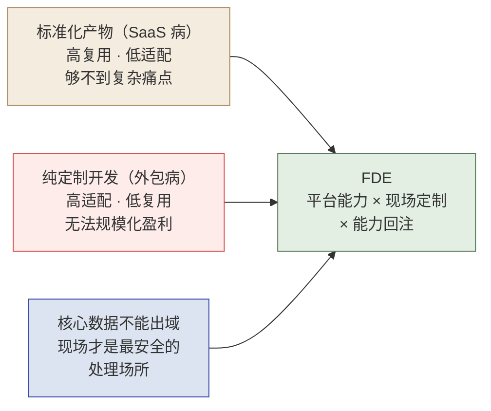
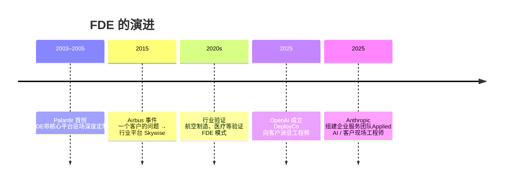
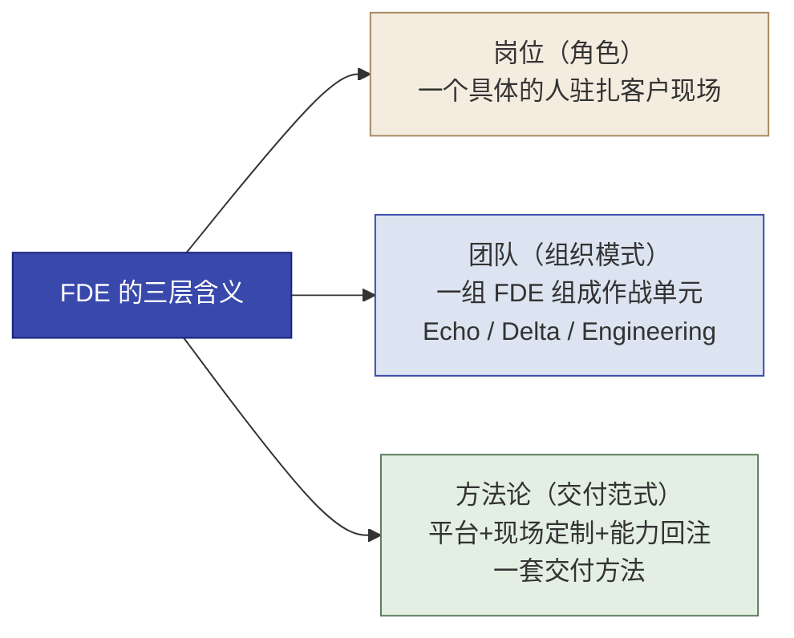
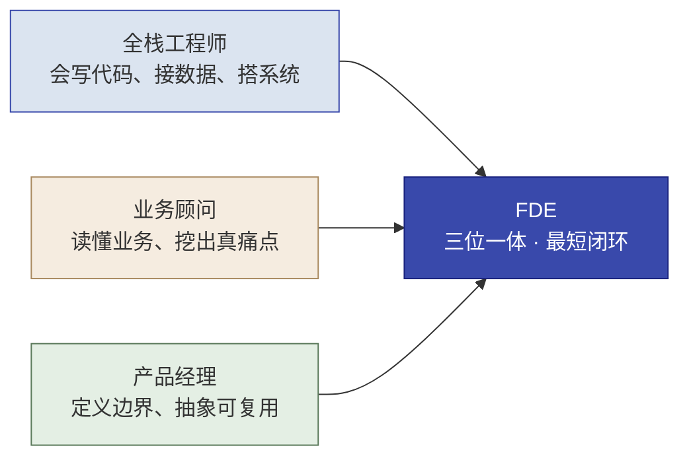
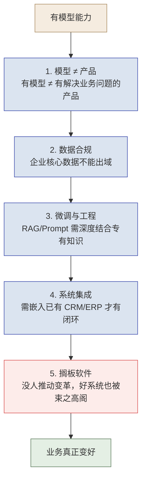

# 第 1 章  FDE 是什么

> **本章定位：** 全书认知第一课——先立住"FDE 到底是谁、为什么它会产生"
> **本章产出：** 你能讲清 FDE 是**为哪三重结构性矛盾而生**；说出 FDE 的定义与三层含义（岗位/团队/方法论）；区分 FDE 的三重角色；用"卖人力 vs 卖能力"标准区分 FDE 与外包/咨询；说出 AI 落地五大鸿沟为何指向 FDE。
> **建议读者：** 零基础起步者必读。本章不假设任何前置知识。
> **本章在全书中的位置：** 第 1 讲"是什么"（what），第 2 讲"为什么成立"（why），第 3 讲"怎么工作"（how）。读完前三章，你将握住全书的认知骨架；从第 4 章 Echo/Delta 与第 6 章实操起，你会亲自动手实践这套方法论。

---

## 本章导学

- **学习目标：**
  1. 讲清 FDE 产生于哪三重结构性矛盾；
  2. 说出 FDE 的定义、一句箴言与三层含义（岗位 / 团队 / 方法论）；
  3. 讲清 FDE"三重角色"为何必须融合，并守住"工程师身份是内核"；
  4. 用"从卖人力到卖能力"标准区分 FDE 与外包 / 咨询；
  5. 说出 AI 时代大模型落地的五大鸿沟，并解释它们为什么指向 FDE。
- **前置知识：** 无。
- **章节地图：** 本书教你"怎么练 FDE"。本章是**认知起点（what）**：第 2 章回答"为什么需要它"（why），第 3 章给出"它怎么工作"（how），第 4 章讲由谁（Echo/Delta）执行，第 6 章起动手做。

> **一句话记住本章：** FDE 是把公司核心平台深度定制部署到客户现场、再把通用能力反哺回平台的角色——它为"标准化够不到、定制做不大、数据出不了域"这三重矛盾而生，本质是从"卖人力"到"卖能力"。

---

## 1.1 一个结构性矛盾：FDE 为谁而生

企业最难得啃的痛点，从来不是"缺个现成软件"，而是——**现成软件永远差那么一点**。更麻烦的是，越是核心业务，这个"差一点"越是绕不开。FDE 就是为了这个普遍困境而生的。它来自三重彼此缠绕的矛盾：

*图 1-1：FDE 为三重结构性矛盾而生*

1. **标准化产物（SaaS 病）**：一套标准软件服务所有客户，复用率 100%，但客户的复杂痛点它够不到——客户必须削足适履去适应软件。**高复用、低适配。**
2. **纯定制开发（外包病）**：完全按客户需求定制，适配度极高，但每个项目从头造轮子、几乎零复用，无法规模化盈利。**高适配、低复用。**
3. **核心数据不能出域**：越是 To B / To G 的核心业务，数据越敏感，往往"不能出政务外网/企业内网"，系统必须私有化部署在客户现场——而现场，正是最需要专业能力、却最没人管的地方。

> [!IMPORTANT]
> **FDE 是这三重矛盾的"同时解法"，不是三选一。** 它既要"标准平台的复用"（保盈利），又要"现场定制的适配"（保效果），还要"就地处理数据"（保合规）。这正是 FDE 与"驻场外包/实施/售后"最本质的区别——**它解决的是一道商业模式与合规的结构性难题，不是"产品没装好"的交付问题。** 搞错了这个起点，后面所有关于 FDE 的理解都会跑偏。

---

## 1.2 定义与起源：Palantir 怎么回答

### 1.2.1 一个激进的决定

面对上面的结构性矛盾，**Palantir** 做了一个激进的决定：**不是造一个更通用的标准产品，也不是陷入纯定制，而是把工程师——带着公司的核心平台能力——直接派驻到客户现场，做着深度的定制部署。**

这个角色被命名为 **Forward Deployed Engineer**（前沿部署工程师，简称 **FDE**）。

> 与常见的"驻场开发"不同，FDE 是**带着核心平台去现场**的：在产品底座（数据引擎、通用组件）之上，针对客户特定的业务场景做深度定制、快速拉通、证明价值，再把其中反复出现的通用需求**抽象、反哺回平台**。这套"现场定制 → 平台回注"的闭环，是整个 FDE 模式的命脉。

> **一句箴言（Palantir 业界常见概括）：**
> > **"FDEs are the glue between our products and our customers."**
> > （FDE 是连接"我们的产品"与"我们的客户"之间的胶水。）
>
> > [!NOTE]
> > **归属说明：** 这句话是业界对 Palantir FDE 角色的**概括性描述**，非官方逐字引文。Palantir 官方 FDSE 招聘 JD 的可溯源表述是：*"embedding talented engineers directly with our customers to tackle their most pressing challenges head-on"*（把有才华的工程师直接派驻到客户身边，正面解决他们最紧迫的挑战）。引用请以官方 JD 口径为准。

**"胶水"比喻的关键：** 产品是标准化的，客户需求是按各自现场环境生长的——中间的缝隙、错位、接口，就是 FDE 的战场。FDE 不是坐在办公室写代码的人，也不是站在台上做演示的人，而是出现在客户现场、面对真实混乱的数据、和真实用户一起把系统做到能用的人。

> **身边的理解——"水电工"比喻：** 装修时设计图有了、材料（产品/模型）也买了，但没有水电工把线路接通、让水流到每个龙头，装修就永远停在图纸上。FDE 做的事情，就是把"AI 的水电"接通到客户真实现场。

### 1.2.2 时间线：从 Palantir 到行业共识

FDE 不是 Palantir 一家的冷门模式，而是正在成为整个 AI 行业的共识：

*图 1-2：FDE 从 Palantir 走向 AI 行业共识*

> [!NOTE]
> **来源与时效性：** 本图为行业演进示意。Airbus 案例与 Skywise 平台见 [Palantir 官网案例页](https://www.palantir.com/impact/airbus/) 与 [Palantir–Airbus 合作概述 PDF](https://www.palantir.com/assets/xrfr7uokpv1b/7uEHPTEM0MkKtBFcx2zh63/9d75da5b76439717ac95135b5012479e/Palantir-Airbus-Partnership_Overview.pdf)；OpenAI DeployCo（约 40 亿美元部署单元）、Anthropic 企业服务等属行业快讯级事件（[36氪报道](https://www.36kr.com/p/3806126900191491)、[行业综述](https://tech.yahoo.com/ai/articles/why-big-ai-companies-embedding-153431936.html)），信息截至 2026 年，引用前请以最新官方新闻为准。本书对 Palantir 财务数据的引用另有专门声明（见第 2 章 2.4）。

> **延伸阅读：** 想读 FDE 完整历史脉络、其三重角色与"工程师是内核"的更充分论证，见 FDE 101 https://www.cloudzun.com/fde-course/（第 1 章 FDE 是什么）。Palantir 平台体系（Gotham/Foundry/AIP）与本章关联较弱，见 FDE 101（第 3 章 Palantir 的平台与 FDE 体系）。

---

## 1.3 三层含义：岗位 · 团队 · 方法论

FDE 这个词在不同语境下指三种不同层级。理解这三层，是避免误解的前提——它类似 **DevOps**，既是一种岗位，也是一种协作文化，还是一种方法论。

*图 1-3：FDE 的三层含义——岗位 / 团队 / 方法论*

| 层级 | 是什么 | 一句话 | 回答的关键问题 |
|------|--------|--------|----------------|
| **岗位** | 一种角色定位 | 一个具体的人，驻扎客户现场，串联产品与客户 | 我做的是不是 FDE 的活？ |
| **团队** | 一种组织模式 | 一组 FDE 组成"特种作战单元"（Echo / Delta / Engineering 分工） | 我们团队怎么搭？ |
| **方法论** | 一种交付范式 | 一整套"把非标痛点变成平台能力"的做事方法 | 项目该怎么推进？ |

> [!IMPORTANT]
> **本书的主线安排：** 第 4 章专门展开"团队"这一层——Echo（业务策略）靠想、Delta（技术执行）靠做。而"方法论"这一层是全书正文的核心：从第 3 章的交付四阶段，到各章的 SOP 与实操，都是方法论的具体落地。所以"三层含义"不是停留在概念，而是贯穿全书的骨架。

> [!NOTE]
> **先分清两个概念再往下：** **1.3 的三层含义，讲的是"FDE 这个词"的三种组织层次**（岗位 / 团队 / 方法论）；**1.4 的三重角色，讲的是"FDE 这个人"要融合的三种专业角色**（工程师 / 业务顾问 / 产品经理）。一个是词的层级，一个是人的能力，别混成一件事。

---

## 1.4 三重角色融合：全栈工程师 × 业务顾问 × 产品经理

FDE 不是单一技能的工程师，而是把三种角色"三位一体"地压在一个岗位上，形成最短闭环：

*图 1-4：FDE 三重角色融合——工程师 × 业务顾问 × 产品经理*

| 角色成分 | 对应能力 | 为什么 FDE 必须有 |
|---------|---------|------------------|
| **全栈工程师** | 写代码、接数据、搭系统 | 要在客户现场真正"做出来"，而不是只写方案 |
| **业务顾问** | 读懂客户业务、挖出真痛点 | 客户真实需求往往藏在模糊表达背后 |
| **产品经理** | 定义问题边界、把非标抽象成可复用 | 让"现场定制"能反哺回平台，驱动飞轮 |

> [!TIP]
> **三者的结合带来"最短闭环"。** FDE 一个人/一个小队就能走完"发现问题 → 定义问题 → 做出方案 → 落地验证"的完整闭环，**不需要在售前、实施、交付之间反复交接、反复翻译**——翻译损耗最小。这也是第 2 章"为何 FDE＋平台比传统外包更省"的组织学基础。

> [!IMPORTANT]
> **"方法论是形，工程师是神"——三重角色融合 ≠ 让 FDE 变咨询顾问。**
> FDE 能成立，正因为它是一群能写生产级代码的**真工程师**，而不是只会画方案、讲道理的顾问。如果把 FDE 方法论交给不会写代码的角色去落地，它就会退化成 PPT 咨询。FDECore 用一个词点透了 FDE 的引擎：**"人肉反向传播"**——平台的通用能力，像训练模型一样靠一个个种子项目反复喂反馈、逐轮收敛。这套机制能运转的前提，恰恰是现场有一群真刀真枪写代码的工程师。
>
> **需要澄清的一点：** 三位一体是"FDE 团队"的整体能力画像，而非要求每个 FDE 个人都是全能选手。Palantir 实际组织通过 Delta（技术执行）+ Echo（业务策略）+ 后方平台工程的分工实现三合一——Echo 负责业务顾问维度、Delta 负责工程师执行、后方负责产品抽象。详见第 4 章分工。

---

## 1.5 FDE ≠ 外包 ≠ 咨询：核心分野是"从卖人力到卖能力"

这是全章最重要的判断标准。外包、咨询、FDE 都在"帮助客户"，但本质不同：

| 维度 | 驻场外包 | 传统咨询 | **FDE** |
|------|---------|---------|--------|
| **交付物** | 客户定制的孤立系统 | 建议方案 / 报告 | 运行在生产环境的定制化系统集成 |
| **能力/IP 最终归属** | 归客户，公司无法复用 | 归咨询公司的方法论 | **回注到己方平台，越做越强** |
| **对己方意义** | 赚人天差价（卖人力） | 赚洞察费（卖洞见） | **完善平台、驱动规模化（卖能力）** |

> **一句话判断标准：** 判断一个团队干的是不是真 FDE——**问自己：这个项目做完，你们公司是只赚了这一次人天费，还是公司整体能力（可复用平台）增长了？**
> - **卖人力**：每单按人天计价，做完就散，能力不沉淀，边际成本不下降。
> - **卖能力**：前线把经验、通用模块回注进平台，一次投入、长期复用，越做越省。

> [!NOTE]
> **两类读者的落点。** "卖人力 → 卖能力"的判断，对两类团队同样适用：
> - **乙方 / 独立服务商**：靠能力沉淀向外部客户卖出更高价值、驱动跨客户复用与规模化——"卖能力"即平台资产化、更高毛利。
> - **甲方内部服务交付团队（如银行总行科技部）**：不做"给业务部门的写码外包"，而是把方法、组件沉淀成**内部可复用的能力中台**，让一次交付复用到多个分行 / 多条业务线、缩短交付周期、证明自身价值（避免被外部采购或收编替代）。
>
> 后文中的"客户"一词，可相应理解为"外部客户"或"内部被服务的业务部门"。

> [!CAUTION]
> **FDE 最危险的地方，是它极易"退化"回外包。** 二者在真实现场几乎肉眼难辨——都是派工程师驻场、都在写贴合客户的代码。差异不在"当下做什么"，而在"**做完之后往哪走**"：是把通用经验抽象、沉淀回平台（FDE），还是写完就留在客户那里（外包）。销售与交付压力（工期紧、急着签单）最容易让 FDE 悄悄退化成外包——**如果连续几个项目下来平台毫无增长、每个新项目仍重复造轮子，那它已经不是 FDE，而是一支昂贵的驻场外包队。** 第 2 章 2.5 会给一份"教材诊断量表"，用 8 条可勾选项帮你辨清。

> **延伸阅读：** "卖人力→卖能力"的经济学模型、能力回注飞轮，见 FDE 101 https://www.cloudzun.com/fde-course/（第 2 章 为什么需要 FDE；第 13 章 中国云服务商的 FDE 实践图谱）。

---

## 1.6 AI 时代的 FDE 复兴：大模型落地的五大鸿沟

过去十年，AI 的主要销售方式是"API / 模型授权"——把模型当原材料卖出去。但企业客户真正缺的不是"有没有 AI"，而是"AI 落不落地"。从"有模型"到"业务真正变好"，中间隔着五道鸿沟：

*图 1-5：从"有模型"到"业务变好"要跨过的五道鸿沟（自上而下逐层跨越）*

| # | 鸿沟 | 是什么 | 典型症状 |
|---|------|--------|---------|
| 1 | **模型 ≠ 产品** | 有模型能力 ≠ 有解决业务问题的产品 | 模型很聪明，但不知为客户解决什么 |
| 2 | **数据合规** | 客户数据不能随便给公有云/外部模型 | 政企"数据不出域"，公有云大模型免谈 |
| 3 | **微调与工程** | 想把模型调成"懂领域/懂客户" | RAG/需检索增强、Prompt 需结合专有知识 |
| 4 | **系统集成** | 要嵌入客户已有 CRM/ERP/业务流 | 装个断点软件没用，要融进真实流程 |
| 5 | **搁板软件（Shelfware）** | 系统做出来却没人用 / 用不起来——指购买/上线后被长期闲置、从未真正产生价值的软件资产 | "演示惊艳、生产翻车""上线即搁板" |

> [!IMPORTANT]
> **这五道鸿沟没有一道是"再多几层模型能力"能解决的——它们全是落地、连接、变革问题。** 这正是 FDE 为什么在 AI 时代反而更稀缺：**模型负责"写得快"，FDE 负责"知道该写什么、写了有没有人用、用起来有没有价值"。** AI 没有让 FDE 过时，反而放大了它最不可替代的价值——判断力与业务理解。

> **延伸阅读：** AI 如何重塑 FDE、甲方共识与业务对齐，见 FDE 101 https://www.cloudzun.com/fde-course/（第 15 章 AI FDE 落地：Echo 共识与对齐）。

---

## 1.7 经典案例：FDE 到底做了什么

> 下面用两个案例，把"FDE 做了什么"从抽象定义落到真实场景。完整案例集（含 BP、财富 500 强、美国陆军等）见 FDE 101 https://www.cloudzun.com/fde-course/（第 4 章 Palantir 经典案例集）。

### 案例一：一个批次零件被卡住，受影响飞机如何瞬间浮出来？

> **场景：** 制造/供应链里，一个批次紧固件在海关被卡住了。问题是——这批零件用在哪些飞机上？哪些飞机总装会被拖累？

传统方式想回答这个问题非常吃力：要跨零件表、工位表、机身表、订单表做多次 JOIN，写极复杂的数据查询才能回溯血缘关系。**等算清楚，总装线往往已经停了。**

FDE 在现场做的事，不是去写更多、更复杂的查询脚本，而是**先把客户"业务实体之间的关系"建成一张可操作的网**：飞机、机尾号、紧固件、装配工位、质检员，以及它们之间的连线——"这个紧固件装配于这个工位""这个工位属于这架飞机""这个质检员检验这个工位"。一旦这张"业务对象关系网"建成，当"某批次紧固件被卡住"这个事件发生时，系统就能像触电一样**瞬间联动**，直接把受影响的飞机全部标红——因为它清楚"这批零件 → 装配的工位 → 归属的飞机"里每一段关系，无需临时联表查询。

**与 FDE 的关联：** 这个案例展示了 FDE 最核心的价值——**把客户"看不见的业务连带关系"，变成"一秒钟就能决策"的现场能力。** 它贵不在"算得快"，而在"把业务的真实结构（对象与关系）翻译成了可操作的数字结构"。**FDE 交付的不是一个报表，而是一种"遇到突发，组织当场就能反应"的能力。**（这也是"业务对象关系建模 / 本体层"这类平台能力最终要落到现场去建、去用的原因——它必须贴近真实业务才建得出来。）

> **业务语义的起点：** FDE 的价值不仅是连接数据，还要把客户的**业务对象、关系和可执行动作**建成统一模型——这正是能力回注中"业务语义层"的雏形（第 3 章 3.5 总览、第 15 章 15.7 展开）。

### 案例二：Airbus（空中客车）——一个客户的问题，变成一个行业的平台

> **关键数字：** A350 客机增产 33%；后续演化为 Skywise 行业平台

2015 年，Airbus 需要紧急将 A350 增产 33%，但生产过程涉及 500 万个零件、数百个团队、分布在多国生产线，排产/零件/工单/质检数据散落各系统。

Palantir 的 FDE 驻场后接入数据，建立制造全生命周期统一视图，最终实现 33% 增产。**但故事没有结束**——FDE 在驻场中发现：Airbus 的数据碎片化、供应链不透明、排产靠经验，不是一家的痛点，是**航空制造业的通用痛点**。他们把发现反馈给产品团队，产品团队基于前线洞察，把内部部署升级为面向全行业的 **Skywise** 平台。

**与 FDE 的关联：** 这是 FDE"反馈闭环"（能力回注）的终极展示——**先在一个客户解决具体问题，识别可复用模式，反馈成行业平台。** FDE 不是做完项目就收工——他们在前线发现的模式，可以催生一个行业标准。**这正是"从卖人力到卖能力"的活例子。**

> **案例来源：** 本案例关键数字（A350 增产 33% 等）引自 [Palantir 官网 "Impact | Airbus and Skywise"](https://www.palantir.com/impact/airbus/) 及 [Palantir–Airbus 合作概述 PDF](https://www.palantir.com/assets/xrfr7uokpv1b/7uEHPTEM0MkKtBFcx2zh63/9d75da5b76439717ac95135b5012479e/Palantir-Airbus-Partnership_Overview.pdf)，信息截至 2026 年；官网页面数字可能更新，引用前请以原文为准。

---

## 反模式与红线

> 每章都设"反模式"一节——告诉你这件事**最容易被做错成什么样**。

- **把 FDE 当成"能写代码的驻场售前 / 实施 / 售后"。** FDE 不是解决"软件装不好、没人教"的交付问题，而是解决"平台×现场×回注"的结构性难题。只看"把产品装起来、用起来"，就不是 FDE。
- **把 FDE 当"驻场程序员"。** 派个人去客户那写代码，但公司能力一点不长——这是披着 FDE 皮的外包（呼应 1.5）。
- **以为 FDE = 项目经理 / 协调者。** 协调加中间层是"加成本"，FDE 是"扛事并落地"——两者本质不同。
- **以为 FDE 是咨询顾问。** 方法论是形、工程师是神（呼应 1.4）：FDE 内核是能写生产级代码的真工程师，只会画方案的"FDE"是咨询。
- **以为 AI 让 FDE 过时。** 恰恰相反，AI 吃掉的是 FDE 里最可标准化、最重复的部分，反而放大了判断力与业务理解的稀缺价值（呼应 1.6）。

> 🔺 **本书红线（第一次出现）：能力必须回注、平台必须增长。** 这是判断"真 FDE vs 外包"的最后一条底线——它既是战略，也是第 2 章"能力回注飞轮"的伦理内核。

---

## 本章小结

- FDE **为三重结构性矛盾而生**：标准化够不到（SaaS 病）、定制做不大（外包病）、数据不能出域——这是商业模式与合规的结构性难题，而非单纯的产品交付问题。
- FDE 是 Palantir 首创：**把工程师带核心平台驻场、做深度定制部署、再把通用能力反哺回平台**，是连接产品与客户的"胶水"。
- 它有**三层含义**：岗位 / 团队 / 方法论。
- 它融合**三种角色**：全栈工程师 × 业务顾问 × 产品经理，实现最短闭环；**方法论是形、工程师是神**。
- 区分 FDE 与外包/咨询的**核心标准**：从"卖人力"到"卖能力"——做完项目，公司平台能力有没有增长。
- AI 时代 FDE 因**五大鸿沟**（模型≠产品 / 合规 / 微调工程 / 集成 / 搁板）而复兴。

**动手自检（对本节，问自己）：**
- [ ] 我能说清 FDE 是为哪三重矛盾而生的吗？为什么它不是"售后/实施"？
- [ ] 我能说出 FDE 的定义、胶水箴言与三层含义吗？
- [ ] 我能讲清"方法论是形、工程师是神"，并区分三重角色吗？
- [ ] 我能用"卖人力 vs 卖能力"标准，判断一个岗位是不是真 FDE 吗？
- [ ] 我能说出 AI 落地的五大鸿沟，并解释为什么每个都不是纯模型问题吗？

---

## 练习与思考

- **基础：** 用自己的话复述 FDE 是为哪三重矛盾而生；列出三层含义。
- **进阶：** 从招聘网站找一个"实施工程师 / 解决方案工程师 / 驻场开发"岗位 JD，分析它属于 FDE 还是外包/咨询，写明判断依据。
- **挑战（迁移练习）：** 结合你自己所在（或熟悉的）企业，指出一个"可能正在卖人力而非卖能力"的真实场景，写一段 3 句建议，说明它该怎么做才算真 FDE 交付。

---

## 延伸阅读

- 若想系统了解 FDE 的方法论全貌（四阶段 SOP、角色体系、中国落地），见 FDE 101 **https://www.cloudzun.com/fde-course/**，本书不再重复展开。
- 本章可延伸的章节：第 1 章（FDE 是什么）、第 3 章（Palantir 平台与 FDE 体系）、第 4 章（Palantir 经典案例集）、第 15 章（AI FDE 落地：Echo 共识与对齐）。
