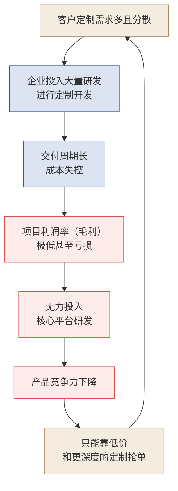
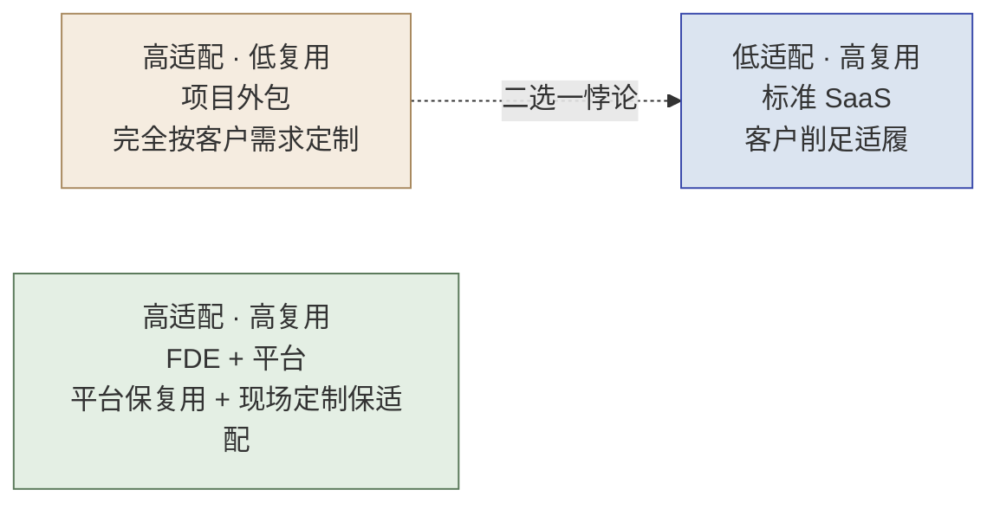
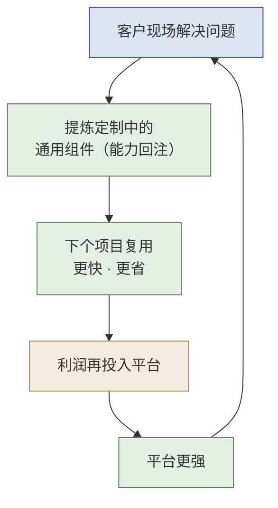
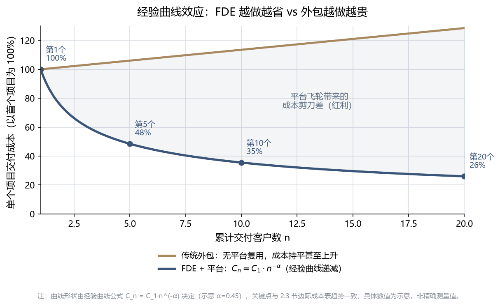
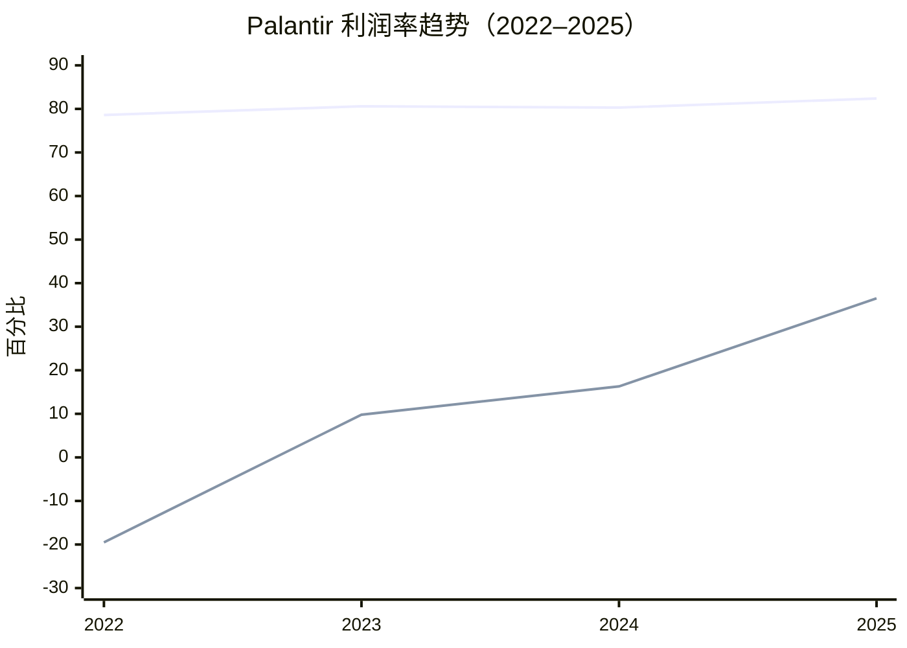

# 第 2 章  为什么需要 FDE

> **本章定位：** 全书认知第二课——用经济学证明 FDE 模式成立
> **本章产出：** 你能画出传统项目制的"死亡螺旋"并说出为什么它是结构性的；能对比四种交付模式、说清 FDE 如何"既要适配又要复用"；能用"能力回注飞轮 + 经验曲线"解释 FDE 为什么"越做越省"；能给出一组 Palantir 财务证据；能用 8 条教材诊断量表鉴别真伪 FDE。
> **建议读者：** 决策层、技术负责人、任何想知道"FDE 为什么值得"的人。

---

## 本章导学

- **学习目标：**
  1. 描述传统项目制的"死亡螺旋"，并解释为何它是"结构性"而非"管理不善"；
  2. 对比 SaaS / 咨询 / 外包 / FDE+平台四种交付模式，说清 FDE"既要适配又要复用"；
  3. 用"能力回注飞轮 + 经验曲线（Cₙ = C₁ × n⁻ᵅ）"解释 FDE"越做越省"；
  4. 记忆一组 Palantir 财务数据（毛利率 50%→82.4%、净利率转正、NRR）佐证模式；
  5. 用 8 条教材诊断量表鉴别"真伪 FDE"。
- **前置知识：** 第 1 章（FDE 定义、"卖人力 vs 卖能力"判断标准）。
- **章节地图：** 第 1 章讲"FDE 是谁"，本章回答"为什么需要/为什么它能赢"，第 3 章进入"怎么工作"的方法论。认知价值是理解一切后续内容的前提。

> **一句话记住本章：** 传统项目制因"每单从零造轮子"而越做越亏（死亡螺旋）；FDE+平台因"定制能力被回注、边际成本递减"而越做越省（能力回注飞轮）。

---

## 2.1 死亡螺旋：传统项目制的结构性困境

### 2.1.1 一个自我强化的恶性循环

很多 To B / To G 服务商陷入一个熟悉的恶性循环。顺着箭头走一圈，你就看到了"局部理性、全局自杀"：

*图 2-1：项目制交付陷入"需求分散→定制→亏损→无力投平台"的自我强化死亡螺旋*

### 2.1.2 为什么是"结构性"而非"管理不善"？

很多陷入这个循环的公司，第一反应是"我们项目管得不够好"——于是加强 PMO、压缩工期、精细核算人天。但这些努力往往只能延缓、无法逆转下滑，**因为问题不在执行层，而在结构层**。逐环拆解这条螺旋，每一步都是"局部理性、全局自杀"：

1. **需求分散 → 定制开发：** 客户的需求真实且合理，销售为了签单必须接。局部看，接单是对的。
2. **定制开发 → 周期长、成本失控：** 每个项目从头造轮子，没有可复用资产，成本随项目数**线性甚至超线性**增长。
3. **成本失控 → 毛利极低甚至亏损：** 为了中标又不得不压价，利润被两头挤压。
4. **无利润 → 无力投入平台研发：** 这是**最致命的一环**。没有利润，就没有钱投入到能"一次开发、多次复用"的核心平台上——而平台恰恰是唯一能打破线性成本的东西。
5. **无平台 → 产品竞争力下降 → 只能更低价、更深定制抢单：** 于是回到第 1 步，每绕一圈，定制更重、毛利更薄、离平台更远。

> [!CAUTION]
> **死亡螺旋最残酷之处，在于它是自我强化的。**
> 越是缺钱，越不敢投平台；越不投平台，就越只能靠人力堆定制；越堆定制，就越缺钱。这是一个正反馈恶性循环——**单靠"更努力地做项目"永远走不出去，因为你越努力，螺旋转得越快。** 唯一的出路是从结构上切断某一环：要么容忍短期亏损、强行投入平台（Palantir 的选择），要么改变交付模式本身。

### 2.1.3 一个痛感场景（一线读者大概似曾相识）

> 团队刚交付完 A 客户的定制系统，B 客户来了几乎一样的需求。因为 A 的代码写死了字段和流程，几乎无法复用，只能推倒重来。于是同一类问题，团队解决了两遍、收了两份人天钱，却没沉淀出任何资产。第三个类似客户来时，团队依然要从零开始。**收入在增长，但公司什么都没积累下来——这就是项目制的本质陷阱：用规模换收入，却换不来资产。**

FDE 模式则致力于把这条恶性螺旋**反转为正向飞轮**（见 2.3）：在现场解决问题的同时，把定制代码提炼为通用组件；下一个类似项目复用这些组件，部署更快、成本更低；成本下降带来的利润再投入研发更强大的平台。

---

## 2.2 四种交付模式全景对比

要理解 FDE 模式的独特定位，最好把它放到四种主流交付模式的坐标系里对照：

| 维度 | 标准 SaaS | 传统咨询 | 项目外包 / 定制 | **FDE + 平台** |
| :--- | :--- | :--- | :--- | :--- |
| **客户适配度** | 低（客户需改变流程适应软件） | 高（定制化方案） | 极高（完全按需开发） | **高（平台底座 + 现场定制集成）** |
| **研发复用率** | 极高（100% 同一套代码） | 中（复用分析框架） | 极低（每个项目从头造轮子） | **高（平台约 70% + 定制回注约 30%，教学假设）** |
| **边际成本趋势** | 趋近于零 | 线性增加（依赖高级人头） | 线性增加（依赖开发人头） | **先高后低、经验曲线式递减** |
| **毛利率趋势** | 高且稳定（70–90%） | 稳定（40–60%） | 低且脆弱（10–30%） | **从低到高（成熟期 80%+）** |
| **商业模式** | 纯订阅制 | 咨询服务费 | 人天计费或固定项目费 | **高价值许可费（平台授权 + 首期部署）** |

> [!NOTE]
> 上表行业毛利区间（SaaS 70–90%、咨询 40–60%、外包 10–30%）为**行业经验口径（教材教学假设）**，非精确统计或统一标准；"约 70% 平台 + 约 30% 现场定制"的比例同样为**教材教学假设（示意）**，用于解释"高适配 × 高复用"的结构，不构成实测数据。对外引用请注明"教材教学假设 / 经验区间"。

### 这张表最反直觉的一行：适配度 vs 复用率

在传统认知里，"适配度"和"复用率"是**天然矛盾的一对**——绝大多数公司只能在对角线上二选一：

*图 2-2：FDE 如何同时拿到"适配度"与"复用率"两条好处*

- **标准 SaaS**：一套代码服务所有客户，复用率 100%，但客户必须削足适履地适应软件（高复用、低适配）。
- **项目外包**：完全按客户需求定制，适配度极高，但每个项目从头造轮子，几乎零复用（高适配、低复用）。

而 **FDE + 平台模式**试图同时拿到对角线的两端——用"**平台底座（保复用）＋ 现场定制集成（保适配）**"的分层结构破解这个矛盾：

- **底层约 70% 靠平台（教学假设，示意）**：数据引擎、本体层、通用组件是标准化的、跨客户复用的——贡献复用率；
- **上层约 30% 靠 FDE 现场定制（教学假设，示意）**：贴合每个客户的具体流程、数据、界面——贡献适配度；
- **而且这 30% 不是白写的**：其中的通用部分会被**回注**为平台能力，让下一个客户的"70% 平台"变成"75%、80%"——**复用率本身是动态上升的**（上述比例均为教学假设下的示意数字）。

> [!TIP]
> **一句话抓住四种模式的本质：**
> - **SaaS** 卖"标准品"——边际成本趋零，但触达不了复杂痛点。
> - **咨询** 卖"洞见"——交付 PPT 和方法论，但不落地为可运行系统。
> - **外包** 卖"人天"——完全定制，但公司什么资产都沉淀不下来。
> - **FDE+平台** 卖"能力"——平台底座保复用 + 现场定制保适配，定制再回注平台。

---

## 2.3 能力回注飞轮与经验曲线：FDE 为什么"越做越省"

### 2.3.1 正向飞轮（把死亡螺旋反转）

FDE 模式把死亡螺旋反转为正向飞轮：

*图 2-3：能力回注飞轮——把死亡螺旋反转为正向飞轮（自上而下成环）*

飞轮的逻辑是：**每个客户新的经验/模式被抽象、回注进平台，下一个客户就能复用，从而更快、更省、平台更强。**

> **回注资产的种类（教材提炼）：** 回注资产不仅包括代码组件，也包括**对象模型、关系模型、动作模式和治理规则**——业务语义同样是可回注、可复用的资产（第 15 章 15.5 展开）。

> [!IMPORTANT]
> **飞轮真正"转"的是两个维度同步推进，而不是单纯"多接项目"：**
> - **价值维度**：交付给客户的结果价值，是否越来越大？（客户真的在用、真的因此变好、真的愿意为此增购）
> - **杠杆维度**：产品杠杆，是否让 FDE 交付这些结果变得越来越容易——**代码越少、时间越短**？（平台/组件被回注得越多越通用，下一个同类交付就越轻）
>
> **两个维度缺一不可：** 只盯价值不盯杠杆，公司退回"每次人力硬扛"的外包；只盯杠杆不盯价值，回注变成"为抽象而抽象"。**只有当"结果价值越来越大"和"交付越来越容易"同步推进时，飞轮才算真的转起来。**

### 2.3.2 经验曲线：FDE 越做越省的经济学规律

能力回注带来一个朴素但有力的规律——**经验曲线效应（Experience Curve Effect）**，其公式为：

$$
C_n = C_1 \times n^{-\alpha}
$$

其中：

- $C_n$：交付第 $n$ 个客户的部署成本
- $C_1$：交付第 1 个客户的极高初始成本（此时 FDE 需要大量写非标代码）
- $n$：累计客户交付数量
- $\alpha$：学习率参数，由 FDE 团队将非标经验抽象回注给核心平台的速度决定

把这个公式画成曲线，就能一眼看清 FDE 与传统外包的分野——**同样是做项目，一个越做越省，一个越做越贵**：

上图中，FDE 的成本随累计交付数 $n$ 按 $n^{-\alpha}$ 快速下坠（靛蓝凸降曲线），而传统外包因缺乏平台复用、每单从头再来，成本始终持平甚至因复杂度上升而抬头（琥珀上行曲线）。两条线之间不断张开的"剪刀差"，就是平台飞轮沉淀带来的**成本红利**——它随项目数增加而越拉越大。下面的数据表，正是这条曲线在几个关键节点上的具体展开：

**边际成本递减效应示例：**

| 项目次序 | 现场所需 FDE 人数 | 实施周期 | 核心平台覆盖度 | 现场定制代码量 | 项目级利润率（示意） |
| :--- | :--- | :--- | :--- | :--- | :--- |
| 第 1 个项目 | 5 人 | 6 个月 | 40% | 60% | -20%（战略亏损） |
| 第 5 个项目 | 3 人 | 3 个月 | 60% | 40% | +35% |
| 第 10 个项目 | 1.5 人 | 1 个月 | 80% | 20% | +65% |
| 第 20 个项目 | 1 人 | 2 周 | 95% | 5% | +85% |

> **表图对照：** 上表四行与图中四个标注节点一一对应（第 1 个 = 高成本起步 → 第 20 个 = 个位数成本），读表时可回看图理解"成本下坠"的趋势。曲线与表格数值均为**示意**，非精确测量。

> [!NOTE]
> **口径说明：** 上表为**示意性**的单项目核算（把 FDE 现场人力成本计入后，某个项目自身的盈亏）——它会随定制代码占比下降而由负转正，用来解释经验曲线的机理。这与 2.4 节 Palantir **公司整体毛利率**（软件毛利率，通常不为负）是两个不同口径，请勿混淆：项目级利润会因重人力投入而为负，公司软件毛利率一般不会。

### 2.3.3 两种"勇气"的承接反转（懂阶段才守得住）

FDE 组织要清楚自己处在飞轮哪个阶段，因为它决定了接单逻辑：

| 阶段 | 稀缺资源 | 逻辑 | 智慧 |
|------|---------|------|------|
| **启动期（约前 5 个）** | 行业 Know-how | **种子逻辑**：广撒种、赌通用性 | **敢于为通用性亏钱**（抢种子客户默默数据） |
| **成熟期** | FDE 交付带宽 | **杠杆逻辑**：精挑选、收割红利 | **敢于为通用性拒单**（避孤岛需求，防稀释资产） |

> **一句话：启动期的智慧是"敢于为通用性亏钱"，成熟期的智慧是"敢于为通用性拒单"。** 前者怕错过种子，后者怕稀释资产。一个健康的 FDE 组织必须同时具备这两种看似矛盾的勇气，并清醒知道自己在飞轮的哪个阶段。

> [!NOTE]
> **乙方为什么愿意做投入更重的 FDE 模式？——切换成本。**
> 一旦客户的业务逻辑被固化进系统、工作流真正跑起来，客户便几乎无法迁移——换系统意味着业务逻辑、数据血缘、习惯、流程依赖全要重来，代价远高于采购价。这种"落地生根"的锁定效应，让 FDE 模式的公司拥有了**类似公用事业的商业稳定性**，同时又**兼具软件公司的毛利**。外包恰恰相反：卖一次性人力，人走价值走。**稳定性与毛利兼得，才是"卖能力"真正打动乙方经营者的商业理由。**

---

## 2.4 Palantir 财务证据：从"低毛利外包"到"高盈利平台"

> [!NOTE]
> **来源与时效性声明：** 本节数据引自 Palantir（NASDAQ: PLTR）公开财报（[S-1/A 备案，2020-09-14](https://capedge.com/filing/1321655/0001193125-20-244936/PLTR-S1A)，以及历年 10-K / 年报，[FY2025 年报文档](https://www.metatrader.com/zh/symbols/nasdaq/pltr/documents/216706-annual-report-fy2025)），**截至 FY2025，信息截至 2026 年 8 月**。汇总口径可参考 [vcpscanner：Palantir 2018–2025 收入与净利历史](https://vcpscanner.com/stock/pltr/financials)、[valueinvesting.io：Palantir 毛利率历史](https://valueinvesting.io/PLTR/metric/gross-margin) 等第三方财务汇总站。表中数值均为约数，精确口径请以各财年 10-K / 年报原文为准；财务数据会随时间更新，引用前请以最新财报复核。

Palantir 早年因投入大量 FDE 在客户现场，曾被讥讽为"一家伪装成 SaaS 的低毛利外包公司"。但随着飞轮转动，其财务数据实现惊人反转，分两个阶段发生——**先是毛利率爬升，再是盈利能力质变**。

### 第一阶段（2018–2022）：毛利率证明"这不是外包"

| 财年 | 整体毛利率 | 核心驱动因素 |
| :--- | :--- | :--- |
| 2018 | ~50% | Apollo 部署平台尚未成熟，FDE 纯靠人力堆叠整合异构数据 |
| 2020 | 68% | Foundry 平台组件化加速，Apollo 实现自动化跨网部署 |
| 2022 | 78.6% | 行业本体论（Ontology）大规模复用，新增客户实施周期大幅缩短 |

毛利率从 50% 爬到 ~80%，已足以反驳"外包论"——外包毛利率通常只有 10–30%（见 2.2 对比表）。

> \* 表注：2018 年毛利率（~50%）为 S-1 备案口径约数，各第三方汇总站因服务 / 非服务收入口径拆分不同略有出入，精确值请以 Palantir S-1/A 原文（2020-09-14 备案）为准。

### 第二阶段（2023–2025）：毛利率见顶后，飞轮威力转移到"盈利能力"

到 2023 年后，毛利率稳定在 80% 出头的高平台，不再是看点。真正体现飞轮成熟的是**经营利润率与净利率的转正与飙升**——这标志着平台复用带来的规模效应终于压过了 FDE 的人力投入成本：

| 财年 | 整体毛利率 | 经营利润率 | 净利率 | 营收（亿美元） | 营收增速 |
| :--- | :--- | :--- | :--- | :--- | :--- |
| 2022 | 78.6% | -8.5% | -19.5% | 19.1 | +23.6% |
| 2023 | 80.6% | +5.4% | +9.8%（首次转正） | 22.3 | +16.7% |
| 2024 | 80.3% | +10.8% | +16.3% | 28.7 | +28.8% |
| 2025 | 82.4% | **+31.6%** | **+36.5%** | 44.8 | **+56.2%** |

*图 2-5：毛利率见顶 → 净利率转正飙升（示意）*

> [!NOTE]
> **图解说明：** 2022 年净利率为 -19.5%（负值），此处把 Y 轴下限放宽到 **-30%** 以完整展示该亏损点（避免负值被截断渲染异常）；重点观察 **2023 年净利率首次转正后持续爬升**的趋势。

**这张表最反直觉、也最有说服力的一点是：** 2024→2025 年，Palantir 营收增速不降反升（+28.8%→+56.2%），同时经营利润率翻了近三倍（10.8%→31.6%）。一家体量已达数十亿美元的公司还同时实现"增长加速 + 利润率飙升"，与飞轮进入成熟期的典型特征一致——**平台底座沉淀得越厚，新增收入边际成本越低，于是规模越大反而越赚钱。**

> [!CAUTION]
> **相关 ≠ 因果：** 上述财务趋势只能说明 Palantir 的财务表现**与"平台复用带动利润率上升"假说一致**，不能单凭财务数据证明"FDE 模式导致了利润率提升"——真实因果还需结合产品复用指标、成本结构与组织事实综合判断。对外引用时请勿表述为"财务数据证明 FDE 有效"。

**除了毛利/净利，还有两组数据与"落地生根、卖能力"的判断相互印证：**

- **净收入留存率（NRR）**——"从 1 个用例扩展到 N 个"的硬证据。NRR 衡量老客户今年比去年多付多少钱，>100% 说明老客户在持续增购。Palantir FY2021 总体 NRR 达 **131%**，FY2022 为 115%，2024 年回升至 ~118%。这组数字佐证了 FDE"先用快赢切入、再横向复制"的扩张逻辑。

> [!NOTE]
> **NRR 口径提示：** 各财年 NRR 数字取自当年财报 / 投资者信函披露（汇总口径可参考 [ycharts：PLTR Net Dollar Retention Rate](https://ycharts.com/indicators/palantir_technologies_pltr_net_dollar_retention_rate)），Palantir 曾对 NRR 的统计口径做过调整，跨期数值并非严格可比；涉及跨年对比或对外引用前，请以最新年度财报披露口径为准。
- **单客户产出持续走高**——规模化不是堆客户数，而是做深单客户。Top 20 客户近 12 个月平均收入由 2024 年约 6460 万美元升至 2025 年约 9390 万美元（财报披露约数）。

> [!IMPORTANT]
> **对 To B / To G 技术服务商的启示：** 早期容忍较低毛利率、敢于向客户现场派驻顶尖人才（FDE），是获取行业 Know-how 和核心数据的必经之路。只要建立"现场定制 → 平台抽象"的坚实反馈管道，后期规模化盈利水到渠成。Palantir 用了约七年（2018 的 50% 毛利、亏损 → 2025 的 82% 毛利、36% 净利率）走完这条路——**飞轮启动慢，但一旦转起来，回报呈非线性（幂律式）增长。**

---

## 2.5 教材诊断量表：8 条鉴别真伪 FDE

> 本节把 1.5 节的本质辨析，变成一份可勾选的**教材诊断量表**——你不再需要凭感觉判断"对方是不是真 FDE"，而是照着量表逐项核验。

> [!NOTE]
> **本量表为教材提炼的教学工具**（非行业标准认证），用于课堂辨析与自检；对外做正式判断时，请结合合同条款、考核与汇报线等一手证据。

**先看三档判定——核心看"做完项目留下什么"：**

| 维度 | 外包 | 项目制 | **真 FDE** |
| :--- | :--- | :--- | :--- |
| **做完项目留下什么** | 只留给客户一个孤立系统 | 带回一些经验，但无法复用（留在个人身上） | **去掉客户信息后，把通用经验沉淀为可复用模板 / Skill / 平台能力** |

> 一句话：**外包留系统、项目制留经验（不可复用）、FDE 留可复用的平台能力。** 判断真伪，就看"项目结束、人离开现场之后，公司手里留下了什么"。

**8 条鉴别项（真 FDE 应尽量满足）：**
- [ ] **1. 交付结束后，公司能力是否增长？**——不只是客户受益，而是"公司"这个主体的可复用能力变强了。
- [ ] **2. 是否有能力回注动作？**——识别 → 抽象 → 集成 → 验证，形成闭环。
- [ ] **3. 是否按价值而非人头计费？**——报价挂钩结果/KPI，而非人天（Time & Material）。人天计费从考核上就会把 FDE 逼回外包。
- [ ] **4. FDE 是否汇报给产品线而非销售？**——汇报线决定行为；汇报给销售会被"签单压力"裹挟成一次性外包。
- [ ] **5. 定制代码是否被抽象为可复用组件？**——不是写完就留客户那里，而是通用部分抽离、回注。
- [ ] **6. 是否沉淀了 Playbook / SOP？**——把"这次怎么做的"固化成可复用方法文档。
- [ ] **7. 离开现场后系统是否仍能自运营？**——客户离开 FDE 后系统照常运转，说明交付物是"能力"而非"人"。
- [ ] **8. 人才是否是真工程师（能写生产级代码）而非咨询顾问？**——FDE 内核是工程师身份。

> [!CAUTION]
> **这张量表不是"全或无"的考试，而是一把诊断尺。** 现实中可能满足 6 条、卡在 1 条。卡住的那条，往往就是它正向外包退化的位置（尤其 3、4 两条考核/汇报线，是退化最快入口）。

> [!TIP]
> **给甲方的判读阈值（可操作版）：** 8 条中勾选 ≥6 条，且 **1、2、3、4 四条硬指标必须勾选**，才可认定为"真 FDE 倾向"。若硬指标缺任何一条（尤其 3 按价值计费、4 汇报产品线），无论其余几条如何，都应视为"高退化风险"——签约前优先核验这两条，因为它们是考核/汇报线层面的结构性保证，后天很难补齐。

---

## 2.6 对读者意味着什么（承上启下）

到这里，本章完成了它的任务——**立住"卖人力→卖能力"这条贯穿全书的主线**：

- **死亡螺旋**解释了旧模式为什么走不通；
- **四种模式对比**标出了 FDE 的独特位置（适配 × 复用两全）；
- **能力回注飞轮 + 经验曲线**证明"越做越省"；
- **Palantir 财务数据**把逻辑落成数字；
- **教材诊断量表**给了你识别真伪的尺子。

而"飞轮怎么落地"——**能力回注四步法（识别→抽象→集成→验证）、四阶段交付流程、Gate 纪律**，正是第 3 章及以后要展开的"最佳实践"。下一章，我们就进入 FDE 怎么干活。

---

## 反模式与红线

- **只见"人天计费"、不见能力沉淀。** 按人天/人头计费，从考核机制上就把 FDE 逼回外包——报价要挂钩结果/KPI。
- **把"多接项目"当成"飞轮转起来了"。** 飞轮需要"价值 + 杠杆"双维度，单纯堆项目数会退回人力硬扛。
- **真假 FDE 快速判读：** 项目结束、人离开现场后，公司留下什么？**外包留系统、项目制留经验、FDE 留可复用的平台能力。**
- **启动期不敢为通用性亏钱，或成熟期不敢为通用性拒单。** 阶段判断错误会错失种子或稀释资产。

> 🔺 **本书红线（延续第 1 章）：能力必须回注、平台必须增长。** 这是本章"飞轮"与"教材诊断量表"共同守护的底线——它既是商业模式，也是 FDE 的伦理内核。

---

## 本章小结

- 传统项目制的**死亡螺旋**是结构性、自我强化的——"越努力螺旋转得越快"，只能从结构上切断。
- 四种模式：**SaaS 卖标准品、咨询卖洞见、外包卖人天、FDE 卖能力**。
- FDE"越做越省"靠**能力回注飞轮 + 经验曲线（Cₙ = C₁ × n⁻ᵅ）**：定制回注平台，边际成本幂律递减。
- 财务佐证：Palantir 毛利率 50%→82.4%、净利率 2023 年首次转正、2025 年达 36.5%、NRR>100%、单客户收入走高（趋势与"平台复用假说"一致，不构成因果证明）。
- 一句判定：**外包留系统、项目制留经验（不可复用）、FDE 留可复用的平台能力。**

**动手自检：**
- [ ] 我能画出死亡螺旋的正反馈环并指出断点吗？
- [ ] 我能讲清"适配度 × 复用率"为何通常矛盾、FDE 如何同时拿到两端吗？
- [ ] 我能用"价值 + 杠杆"双维度解释什么是"真的飞轮"吗？
- [ ] 我能说出"外包 / 项目制 / FDE 做完项目各留下什么"吗？

---

## 练习与思考

- **基础：** 默写四种交付模式及各自的毛利率/复用率特征；画出死亡螺旋闭环。
- **进阶：** 用"能力回注飞轮"分析一个你熟悉的、陷入"用规模换收入"的失败项目，指出它卡在哪一环节、缺了哪一维。
- **挑战（迁移练习）：** 为一家外包公司设计"卖人力 → 卖能力"的转型路径——需要什么组织/考核/平台投入，启动期敢为什么亏钱、成熟期敢为什么拒单。

---

## 在线全书（延伸阅读）

- 想读"卖人力→卖能力"更完整的经济学论证、中国云厂商"类 FDE"实践与转型路线图，见在线全书 **https://www.cloudzun.com/fde-course/**。
- 本章可延伸的章节：第 2 章（为什么需要 FDE）、第 13 章（中国云服务商的 FDE 实践图谱）、第 14 章（中国区 FDE 转型的五大挑战与应对）。
