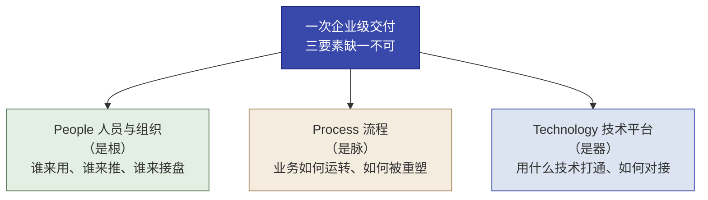
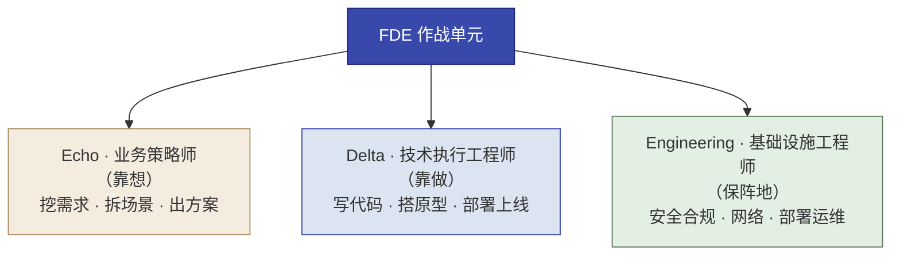
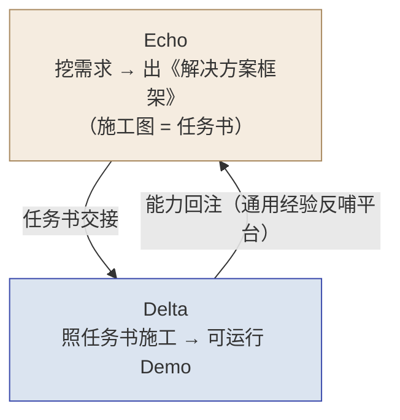
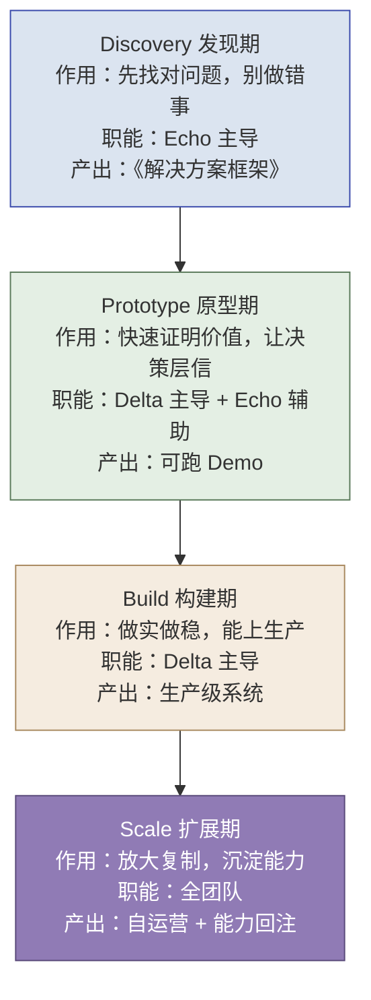
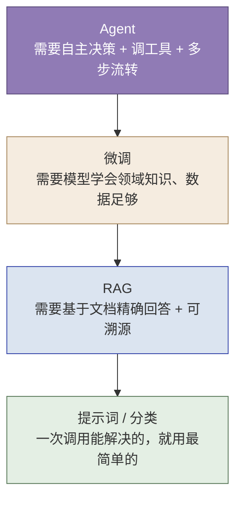
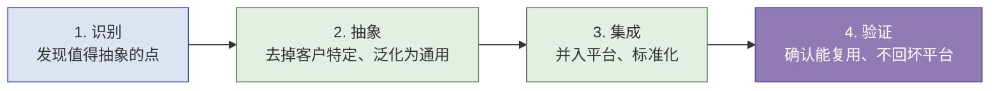
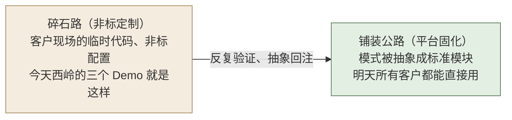
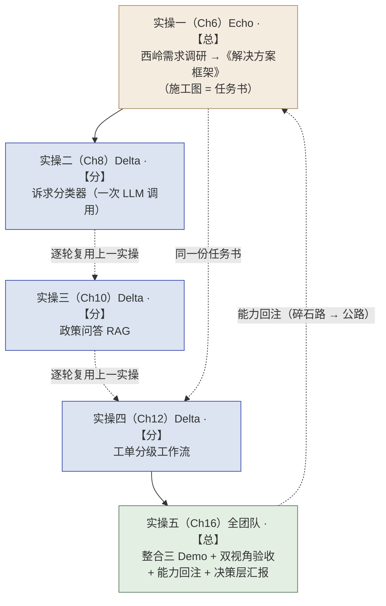

# 第 3 章  FDE 交付方法论：四阶段与能力回注

> **本章定位：** 全书骨架——一次企业级交付从"人、流程、技术"三个维度看是什么样，以及本书的实验设计如何带你把这套方法论走一遍
> **本章产出：** 你能用 PPT（People / Process / Technology）框架理解交付的三个维度；说清 People 维度的两侧（客户侧与己方侧），尤其是 **Echo / Delta 的角色定义、分工与协作模式**（本书核心）；知道四阶段交付的概念与各阶段的 **Stage Gate 六要素**；掌握技术选型原则（LLM 能力金字塔）与能力回注四步法；了解本书五个实操的"总分总"实验设计。
> **建议读者：** 所有学员必读——本章是全书的地图，也是进入实操前的总纲。

---

## 本章导学

- **学习目标：**
  1. 用 PPT（People / Process / Technology）框架理解企业级交付的三个维度，并说出"People 是根、Process 是脉、Technology 是器"；
  2. 说清 People 维度的两侧：客户侧（干系人、冠军用户、变革推动）与己方侧（Echo / Delta / Engineering 作战单元），**特别是 Echo 与 Delta 的定义、分工与协作模式**；
  3. 知道四阶段交付（Discovery→Prototype→Build→Scale）的概念与各阶段定位；
  4. 说清四阶段各自的 **Stage Gate 六要素**（输入条件 / 核心活动 / 必交付物 / 通过证据 / 未通过动作 / 主责与协同）与止损规则；
  5. 掌握技术选型原则（LLM 能力金字塔，"从最简单开始"）与能力回注四步法；
  6. 了解本书五个实操的"总分总"实验设计。
- **前置知识：** 第 1 章（FDE 定义）、第 2 章（能力回注飞轮、经验曲线）。
- **章节地图：** 第 1–2 章讲"是谁、为什么"，本章回答"怎么干活"——从三个维度给出交付的完整图景。第 4 章专章展开 Echo/Delta 分工，第 5 章起进入 Discovery 方法，第 6 章起五个实操把本章的设计走一遍。

> **一句话记住本章：** 一次交付 = **人（People）** 决定它会不会被用起来、**流程（Process）** 决定它怎么推进、**技术（Technology）** 决定它用什么实现——本书的实验设计，就是让 Echo 定方向、Delta 逐级施工、全团队收口地走完这套方法论；而每一阶段的"过了没有、凭什么过"，由 **Stage Gate** 把关。

---

## 3.1 一次企业级交付：三个维度 PPT 框架

一次成功的 AI/系统交付，绝不只是"部署一套软件"。它本质上是对客户组织在三个维度上的同步改造——经典框架 **People–Process–Technology（人员·流程·技术，简称 PPT）**：

*图 3-1：PPT 三要素——People 是根、Process 是脉、Technology 是器*

| 维度 | 含义 | 在 FDE 语境下的具体所指 |
|------|------|------------------------|
| **People（人员与组织）** | 谁来用、谁来推、谁来接盘 | 客户侧的决策者、冠军用户、终端用户、自运营团队；以及 FDE 己方团队配置 |
| **Process（流程）** | 业务如何运转、如何被重塑 | 业务流程诊断、审批链路重塑、新旧流程切换与采纳；以及 FDE 自身交付 SOP |
| **Technology（技术平台）** | 用什么技术打通、如何对接 | 技术选型（LLM 能力金字塔）、工具链、私有化/信创部署 |

> [!IMPORTANT]
> **PPT 三者缺一不可，且以 People 为先。**
> - 只上 Technology 不改 Process、不带 People，系统必然沦为"搁板软件"（买了没人用）。
> - 只谈 Process 改造却无 Technology 支撑，是纸上谈兵的咨询 PPT。
> - **People 是根、Process 是脉、Technology 是器——顺序不可颠倒。** 这就是为什么 FDE 在 Discovery 初期把时间花在"听客户说话"（People/Process），而非"开发功能"（Technology）（但也允许时间盒技术验证，见第 5 章 5.1）。
>
> 注意：这里的"PPT"是 People–Process–Technology 的缩写，与演示文稿"PPT"无关。
>
> 本章接下来按这个顺序展开：**先讲 People（3.2，本书重点）→ 再讲 Process（3.3）→ 后讲 Technology（3.4）**。

---

## 3.2 People 维度：谁来交付、谁被服务（本书重点）

> **People 是根**：流程和技术都有章可循，唯独"人"的问题最不可控——它决定一个系统是"被用起来"还是"变成搁板软件"。People 维度要解决的，是**交付两侧的人**：客户侧（谁用、谁推、谁接盘）与己方侧（由谁交付、怎么协作）。

### 3.2.1 客户侧：系统被谁用、谁推动、谁接盘

- **干系人管理**：交付要面对不同层级的干系人——决策者（要"值不值"）、使用者（要"好不好用、会不会抢饭碗"）、技术层（要"安全、少改造"）、监管层（要"合规、可追责"）——**不同层说不同话**（第 5 章干系人地图 SOP1、第 6 章实操一详细演练）。
- **冠军用户**：头三天就要找到最支持你、最懂业务、能帮你推动的人——他是项目在客户内部的"自己人"（第 5 章 SOP1）。
- **变革推动**：系统上线后最大的风险不是技术，而是"没人用"。判断"没人用"要从三步诊断：**门槛**（好不好上手）→ **动机**（用它对用户有什么好处）→ **信任**（用户信不信它可靠）——第 16 章实操五专门演练。

### 3.2.2 己方侧：作战单元（Echo / Delta / Engineering）

一次 FDE 交付由一个"特种作战单元"承担，本书的核心主线就是其中两个主角——**Echo（业务策略）与 Delta（技术执行）**：

*图 3-2：作战单元三角色——Echo 靠想、Delta 靠做、Engineering 保阵地*

**Echo（业务策略师 / Deployment Strategist）——靠想：** 业务专家与"产品侦探"。不写代码，挖真需求、拆场景、做选型，最终产出**《解决方案框架》**——它就是交给 Delta 的"施工图 / 任务书"。

**Delta（技术执行工程师 / FDSE）——靠做：** 驻扎客户现场的"全栈特种兵"。照任务书把方案翻译成能跑的 Demo / 系统，并把通用经验**能力回注**回平台。

> **本章只立分工骨架。** 关于 Echo / Delta 的**深层能力画像、完整职责矩阵、日常时间分配、站位自测，以及"战位职责 vs 个人能力"的辨析**，见第 4 章专项展开（4.2.1、4.3、4.4、4.5）。

**协作模式（本书最重要的分工关系）：**

*图 3-3：Echo / Delta 协作——Echo 定方向出施工图，Delta 照图施工并回注*

- **分工解耦**：Echo 管"做什么、为什么"，Delta 管"怎么做、做出来"——各守其位，避免"需求没挖清就写代码"或"施工中反复改需求边界"。
- **战斗力整合**：两者同处一个作战单元、目标一致，产出通过《解决方案框架》无缝交接——既避免"一人干全程"的不可复制，也避免"跨团队甩锅交接"的翻译损耗。
- **分工哲学（AI 时代）**：**人能判断、AI 能执行**。Echo 的判断（哪些是真问题、值不值得做）AI 替不了；Delta 的执行（重复、可标准化的部分）AI 系统性地替人干，人在 checkpoint 把关。
- **两种训练模式（本书设计）**：Echo 侧实操用**头脑风暴（全程不用 AI）**练判断力；Delta 侧实操用 **opencode + gstack（AI 施工）** 练施工力。

> [!IMPORTANT]
> **Echo 与 Delta 是本书的主线，第 4 章专章展开**（含角色定位游戏、能力画像、四阶段中的角色协作）。本章先立住这条分工骨架——读后面任何实操时，先问："这一步该由 Echo 还是 Delta 主导？"

### 3.2.3 Engineering：基础设施保障

- **职责**：安全合规、网络配置、部署运维等"脏活累活"，让 Echo 和 Delta 能专注业务与施工。
- 本书课程中主要由讲师环境兜底，不是教学主线；实战中它是作战单元不可缺少的第三角。

---

## 3.3 Process 维度：四阶段交付与 Stage Gate

> **Process 是脉**——它回答"项目怎么推进"。业界对 FDE 式交付的通用提炼是**四阶段**：**Discovery（发现）→ Prototype（原型）→ Build（构建）→ Scale（扩展）**。四阶段之间不是"话赶话"地往下走，而是由 **Stage Gate（阶段门禁）** 把关——每过一个阶段，都要拿"通过证据"过一道检查，过不了就返回、补证据、降范围或终止（3.3.2）。

*图 3-4：四阶段漏斗——发现→原型→构建→扩展（每两个阶段之间有一个 Stage Gate）*

| 阶段 | 一句话 | 核心任务 |
|------|--------|---------|
| **Discovery 发现** | 先找对问题 | 穿透模糊需求，验证数据与价值，找对要解决的真问题 |
| **Prototype 原型** | 快速证明 | 用最小代价做出可跑原型，让决策者看到价值 |
| **Build 构建** | 做实做稳 | 从原型走向生产级：集成、质量、合规、上线 |
| **Scale 扩展** | 放大复制 | 跨部门推广、客户自运营、能力回注平台 |

> [!NOTE]
> **术语说明：** **Discovery→Prototype→Build→Scale** 是业界对 FDE 式交付的**通用提炼**（对"从 0 到 1 的单项目交付"最直观），并非 Palantir 的官方术语。本书用它作教学骨架，重在"可执行"，而非"权威认证"。**Stage Gate** 一词同样为业界通用工程管理实践，本书作教材提炼运用（清晰标明"教材提炼"，见 3.3.2 末注）。
>
> **三个维度 × 四阶段：** 每个阶段都同时有 People / Process / Technology 的工作（如 Discovery 的 People = 干系人地图，Technology = 数据盘点）。本书后续实操就是选四阶段中的关键片段来练。

### 3.3.1 一个项目走四阶段：以西岭市民服务平台为例

> 抽象的四阶段，落到一个真实项目上是什么样？下面以西岭市民服务平台为例，把每个环节的**作用**（为什么需要它）、**职能**（由谁主导）走一遍。本书的五个实操（3.6）就是这条线的浓缩版。**每一阶段"过了没有"的完整判定要素见 3.3.2 的 Gate 总纲；角色主导权的完整矩阵见第 4 章 4.6，本节只标注每一阶段的主导方。**

*图 3-5：西岭项目走四阶段——各环节的作用、职能与产出*

**1. Discovery 发现期——先找对问题，别做错事**

- **项目里发生什么**：陈主任撂下一句"用 AI 把这一整套都智能化了"。Echo 进驻后初期**不以功能开发为目标**（不写业务代码，允许半天级时间盒技术验证，见第 5 章 5.1）：走访陈主任（决策层）、坐席组长小王（操作层）、信息中心李工（技术层）、市数据局（监管层），摸清真实痛点——分派靠人工且老分错、政策答不准、简单复杂诉求混着办；盘数据——政策库是 5 份格式杂乱的文档、错分率没有任何统计；挖风险——数据不出域是红线、坐席怕被替代、ROI 说不清。
- **作用**：如果跳过这一步直接做，可能把方案做在错误地基上（比如不知道"数据不出域"，选了公有云方案，整个项目白做）。
- **职能**：**Echo 主导**，产出**《解决方案框架》**——把"整套智能化"拆成三个子场景（诉求分类 / 政策问答 / 工单分流），为每个场景选定技术路线，定施工优先级。
- **本书对应**：第 5 章方法、第 6 章实操一。

**2. Prototype 原型期——快速证明价值，让决策层信**

- **项目里发生什么**：照《解决方案框架》的任务书，Delta 用最快速度把三个场景做成能跑的 Demo——诉求分类器、政策问答 RAG、工单分级工作流，各配一个 Streamlit 验证面板。
- **作用**：Discovery 只产生了"纸上的方案"；决策层（陈主任）需要**亲眼看到价值**才愿意继续投入——"用最小代价证明最大价值"，而不是花三个月做出完整系统才发现没人要。
- **职能**：**Delta 主导**（施工），**Echo 辅助**（讲 Demo、对齐验收口径：准确率多少算达标、什么算转人工）。产出**可跑 Demo + 验收记录**。
- **本书对应**：第 8/10/12 章实操二三四（本书原型期就是三个实操）。

**3. Build 构建期——做实做稳，能上生产**

- **项目里发生什么**：Demo 验证可行后，把原型打磨成生产级系统——接入真实数据管道、补齐安全与合规（数据不出域 → 本地化部署）、代码审查、性能与可靠性测试、用户培训。
- **作用**：Demo 是"能演示"，生产是"能天天用、出了事有人负责"。中间差的是工程化：性能、安全、合规、运维、回滚预案——这是 FDE 与"演示级 Demo"的分水岭。
- **职能**：**Delta 主导**（工程实现），Echo 跟进需求不跑偏。产出**生产级系统 + 质量报告**。
- **本书对应**：第 16 章实操五演练"MVP 达标 ≠ 生产可用"的差距评估（本书以评估为主，完整 Build 在真实项目中进行）。

**4. Scale 扩展期——放大复制，沉淀能力**

- **项目里发生什么**：系统在坐席团队跑通后，向更多业务部门推广；培训"自运营"（客户离开 FDE 也能自己维护）；更关键的是——**能力回注**：把"诉求分类器"抽象成"通用文本分类组件"、"政策问答"抽象成"可溯源知识库问答组件"，回注到平台，让下一个客户直接复用。
- **作用**：单个项目做完不算 FDE，**能力沉淀回平台、下个项目更省**才是"卖能力"（呼应第 2 章飞轮）。Scale 是飞轮的一圈。
- **职能**：**全团队**（Echo 推变革、Delta 做回注与生产评估）。产出**自运营交接 + 能力回注清单**。
- **本书对应**：第 16 章实操五（能力回注是"碎石路 → 铺装公路"的核心环节）。

> **一句话记住四阶段的职能分工：** **Discovery 靠 Echo 找对问题，Prototype 靠 Delta 快速证明，Build 靠 Delta 做实做稳，Scale 靠全团队放大与回注。** 本书五个实操，正是把这条线浓缩着走一遍。

> **延伸阅读：** 四阶段完整 SOP 0–9 与每阶段模板，见在线全书 https://www.cloudzun.com/fde-course/（第 5–9 章：Phase 1 Discovery 至 Phase 4 Scale 与能力回注方法论）。

### 3.3.2 四阶段 Stage Gate 总纲（教材提炼）

> 每个阶段"做完没做完、能不能进下一阶段"，不能靠感觉，要靠 **Gate（门禁检查）**。本书统一用六要素描述每个 Gate：**输入条件 / 核心活动 / 必交付物 / 通过证据 / 未通过动作 / 主责与协同**。下表是四阶段的 Gate 总纲——第 5 章 5.8 会把 Discovery Gate 落到可操作的检查清单（教材提炼的工程管理实践，非行业标准认证）。

**Discovery Gate——能不能开始做原型：**

| 要素 | 内容 |
|---|---|
| 输入条件 | 已立项 / 客户授权；有边界内可接触的干系人与数据入口 |
| 核心活动 | 干系人访谈与跟班观察、数据资产盘点、失败模式扫描、快赢筛选、场景拆解与选型 |
| 必交付物 | 干系人地图 + 痛点清单 + 数据资产清单 + 快赢评分表 +《解决方案框架》 |
| 通过证据 | 决策者认可方向；冠军用户到位；数据已验证可得；每个选型能讲清"为什么是它、为什么不用更复杂的"；四条红线（尤其数据不出域）已写入方案；基线数字有来源或明确标注"待核实" |
| 未通过动作 | 缺证据 → 补证据后再过；范围过大 → 砍场景降级；无快赢场景 → 重筛或建议终止 |
| 主责与协同 | Echo 主导；Delta 补技术可行性；客户：决策者 + 业务骨干确认 |

**Prototype Gate——能不能投入真实生产化：**

| 要素 | 内容 |
|---|---|
| 输入条件 | Discovery Gate 通过；《解决方案框架》任务书明确；开发集与盲测集数据就绪 |
| 核心活动 | 按"从最简单开始"做可跑 Demo；用外部给定的测试数据评测；按红线式口径验收（准确率、可追溯、零漏判） |
| 必交付物 | 可跑 Demo + 测试记录 + 验收记录（含盲测集结果）+ 能力回注候选清单 |
| 通过证据 | 达成验收口径（如分类准确率达标、RAG 答案可溯源、敏感件零漏判）；决策层见过 Demo 并认可价值 |
| 未通过动作 | 定位失败原因（数据 / 提示词 / 边界）→ 限定次数内迭代 → 仍不达标则回到 Discovery 重估场景或砍掉 |
| 主责与协同 | Delta 主导；Echo 辅助讲 Demo、对齐验收口径 |

**Build Gate——能不能上线 / 交给客户：**

| 要素 | 内容 |
|---|---|
| 输入条件 | Prototype Gate 通过；真实数据接入获批；生产环境与合规边界明确 |
| 核心活动 | 生产化纵切：性能/安全/合规、部署、日志与监控、灰度与回滚预案、用户培训 |
| 必交付物 | 生产级系统 + 质量报告（性能 / 安全 / 合规清单）+ 运行手册 |
| 通过证据 | 上线验收通过；数据不出域等红线合规；压测与回滚演练通过；用户具备自运营能力 |
| 未通过动作 | 差距清单逐项修复 → 有条件放行（降级方案）→ 或回退 Prototype 补做 |
| 主责与协同 | Delta 主导 + Engineering 保障；Echo 跟进需求不跑偏；客户 IT / 安全部门联验 |

**Scale Gate——能不能退出 / 宣告交付完成：**

| 要素 | 内容 |
|---|---|
| 输入条件 | Build 上线稳定；客户自运营团队到位 |
| 核心活动 | 跨部门推广与变革推动；培训与交接；能力回注（识别 → 抽象 → 集成 → 验证） |
| 必交付物 | 自运营交接文档 + 能力回注清单（含第二客户 / 第二数据集复用验证）+ 项目复盘 |
| 通过证据 | 客户在 FDE 撤离后能自运营；至少一个回注候选通过复用验证；飞轮指标（复用率上升）有记录 |
| 未通过动作 | 回注验证不过 → 暂缓回注（不污染平台）；交接不达标 → 延长陪跑期 |
| 主责与协同 | 全团队；Echo 推变革；Delta 做回注与生产评估；客户运营负责人接盘 |

> [!CAUTION]
> **止损规则（Gate 的"刹车"）：** 任一阶段连续两次 Gate 未通过（或已投入超出预算上限仍无通过证据），必须触发**止损评审**——降范围、换方案或终止，并把教训记入复盘。Gate 不是为了"卡进度"，而是防止"做错了还往下走"。

> [!NOTE]
> **教材提炼声明：** 本 Gate 六要素框架为本书**教材提炼**的工程管理实践（源自业界 Stage Gate / 里程碑评审的通用做法），并非 Palantir 官方术语或行业标准认证。落地时可按组织现有评审制度裁剪。

---

## 3.4 Technology 维度：技术选型与工具

> **Technology 是器**——它回答"用什么技术打通、如何对接"。FDE 技术决策的核心原则是**"从最简单开始"**：能用一次调用解决的，就不上复杂架构。技术维度要解决的，是"选什么、用什么、部署在哪"三个问题：

### 3.4.1 选什么——LLM 能力金字塔

*图 3-6：LLM 能力金字塔——从最简单开始，仅必要时升级*

| 层级 | 何时用 | 为什么排在它上面那层之下 |
|------|--------|------------------------|
| **提示词 / 分类** | 一次 LLM 调用能解决（归类、抽取、简单问答） | 最简单，能用就不用更复杂的 |
| **RAG** | 需要"基于文档精确回答 + 可溯源" | 轻量（只需检索增强），比微调简单得多 |
| **微调** | 需要模型"学会"领域知识、且数据足够 | 重（要训练、难更新、不可溯源），放在 RAG 之上 |
| **Agent** | 需要"自主决策 + 调工具 + 多步流转" | 最复杂，放在最上 |

> [!NOTE]
> **金字塔不是"单线升级"路线，而是"从最简单开始"的选型排序。** 提示词、RAG、微调、Workflow/Agent 解决的是**不同维度**的问题（外部知识、来源引用、行为固化、自动化路径），可以**组合**使用——例如"RAG + 固定工作流""分类 + RAG 兜底"。不要把金字塔误读成"必须逐级攀登"。判断哪个维度该上、哪些可以组合，见第 5 章 5.7.2 的**技术决策矩阵**。

> **层级顺序的判断依据（为什么 RAG 在微调之下）：** RAG 只需"重建索引"即可跟上内容更新（如政策文件常更新），且答案天生带来源引用；微调一次更新就要重新训练、且答案无法溯源。**能用 RAG 解决的就不微调，能用一次调用解决的就不 RAG——从最简单开始。**
>
> （第 5 章给出完整选型决策树与决策矩阵；第 8/10/12 章实操逐级体验：分类器 → RAG → Agent）

> [!NOTE]
> **图 3-6 是全书首发总览**，呈现"能力层级与交付复杂度"的全貌。该金字塔后续会从不同视角复用：**第 5 章图 5-2** 给它一层"Echo 业务视角"（标注各层的业务适用边界与成本/风险权重）；**第 7 章图 7-2** 再给一层"Delta 工程视角"（标注各层的技术栈与代码量）。读后面那两张图时，可回看本图保持整体框架。

### 3.4.2 用什么——工具链

- 本书实操统一使用：**opencode**（AI Coding Agent）+ **gstack**（八环节工程工作流）+ **Streamlit**（验证面板）+ **DeepSeek**（大模型 API）+ 向量库（RAG 用）。
- 工具链服务于工程纪律：**测试数据外部给定、启动提示词信息块、驱动指令执行纪律**（第 7 章专章，第 8/10/12 章落实）。

### 3.4.3 部署在哪——数据不出域与合规

- 政企场景的第一约束是**数据不出域**：核心数据不能上公有云，必须本地/私有化部署（第 1 章五大鸿沟之一；第 6 章实操一把它写进方案框架）。
- 生产环境还要考虑信创、备案等合规红线（第 16 章实操五演练"公网验证 → 本地回填"的工程决策）。

> **Technology 是器、Process 是脉、People 是根——顺序不可颠倒。** 技术选型永远服务于业务价值，而不是反过来为了"炫技"上复杂架构。

---

## 3.5 能力回注与迭代哲学

### 3.5.1 能力回注四步法

能力回注是第 2 章"飞轮"的操作引擎。每次客户定制开发中的新能力，都要被评估是否有通用价值——有则提炼、集成，让所有后续项目受益：

*图 3-7：能力回注四步法——识别 → 抽象 → 集成 → 验证*

1. **识别**——发现值得抽象的点（多个客户有类同需求 / 有行业普遍性 / 可抽象为通用能力）。
2. **抽象**——把定制逻辑解耦成通用组件，去掉客户特定信息（如"住建/人社"→ 可配置的类别清单）。
3. **集成**——并入平台，标准化为可配置组件（类别清单做成配置项，不写死在代码里）。
4. **验证**——确认真能复用、且不回坏平台质量。

> **四步法 × 本体建模（总览，教材提炼）：** 本体建模是"业务语义回注"的结构化载体——它不改变四步法，而是为"抽象、集成、验证"提供对象、关系、动作与治理边界明确的业务模型：

| 能力回注步骤 | 本体建模动作 | 西岭示例 |
|------|-----------|---------|
| **识别** | 找出反复出现的业务名词、关系、状态和动作 | 诉求、政策、部门、工单、分派、升级 |
| **抽象** | 去掉客户专名，形成对象 / 关系 / 动作类型 | "西岭住建局" →"责任部门" |
| **集成** | 映射数据源、接口、权限与工作流 | 工单表 → 工单对象；路由接口 → 分派动作 |
| **验证** | 在第二场景验证复用 | 企业员工服务台 |

> 详细展开见 **第 15 章 15.7（能力回注的联合决策：业务通用性 × 工程复用性）**；第 14 章 14.10.1 给出"业务本体的工程验证"。

> **判断标准（识别这一步）：** 值不值得回注？看两点——**通用性**（几个客户有类同需求）与**实现成本**。用优先级矩阵：

| | 通用性高（5+ 客户） | 通用性中（2–4 客户） | 通用性低（1 客户） |
|:---:|:-:|:-:|:-:|
| **实现成本低** | P0 立即做 | P1 尽快做 | P3 观察 |
| **实现成本中** | P1 尽快做 | P2 计划做 | 不做 |
| **实现成本高** | P2 计划做 | P3 观察 | 不做 |

> **一句话：** 值得回注 = "多个客户都要 / 可抽象为通用能力"；低通用 + 高成本的需求留作一次项目定制，**别硬塞进平台**——那会污染"铺装公路"。

### 3.5.2 碎石路 → 铺装公路（能力回注的最佳隐喻）

*图 3-8：碎石路 → 铺装公路——今天客户 A 的定制，明天所有客户的标准能力*

> **核心理念：** 今天客户 A 的定制代码（碎石路）→ 明天平台的一个配置项（铺装公路）→ 后天所有客户的标准能力。但要**拒绝过早标准化**——在一个客户身上还没跑通就急着抽象，只会做出"搁板软件"。

### 3.5.3 两条作战纪律

- **五次部署法则**：Playbook（打法等最佳实践）不能在还没积累足够样本时写死——**约 5 个客户之前，不要过早固化"我们就是这么干的"**。先用真实交付反复验证，再沉淀为可复用 SOP。
- **负荷管理**：一段时期只重点攻坚 **1–2 个大客户**（FDE 带宽有限），避免同时铺太多、每个都做不深。

---

## 3.6 本书的实验设计：五个实操的总分总

> 到这里，三个维度（People / Process / Technology）、四阶段 Gate 与能力回注都已讲清。剩下一个问题是：**本书的实操怎么带你把这套方法论走一遍？** 答案是——**五个实操，形成"总分总"闭环**：

*图 3-9：本书实验设计——五个实操的"总分总"闭环*

**这个设计对应三个维度与四阶段：**

| 实操 | 章节 | 角色 | 模式 | 对应维度/阶段 |
|------|------|------|------|--------------|
| **实操一：需求调研 →《解决方案框架》** | Ch6 | **Echo** | 头脑风暴（不用 AI） | People（干系人/冠军用户）+ Process（Discovery） |
| **实操二：诉求分类器** | Ch8 | **Delta** | AI 施工 | Technology（分类/一次调用）+ Process（Prototype） |
| **实操三：政策问答 RAG** | Ch10 | **Delta** | AI 施工 | Technology（RAG）+ Process（Prototype） |
| **实操四：工单分级工作流** | Ch12 | **Delta** | AI 施工 | Technology（Workflow）+ Process（Prototype） |
| **实操五：全团队交付与汇报** | Ch16 | **全团队** | 头脑风暴 + 汇报 | People（变革推动）+ 能力回注 + Scale 收口 |

**五个实操的设计意图：**
- **总（实操一）**：Echo 把模糊需求拆成三个子场景、出《解决方案框架》——它是后续所有实操的**任务书**，练"判断力"（不用 AI）。
- **分（实操二三四）**：Delta 照同一份任务书做三个 Demo，**坡度递增**（分类器 → RAG → 工作流），逐轮复用上一实操的 AGENTS.md/retro.md——练"施工力"（用 opencode + gstack，人在 checkpoint 把关）。
- **总（实操五）**：全团队把三个 Demo 整合、双视角验收（Echo 验需求满足、Delta 验生产差距）、**能力回注**（碎石路→铺装公路）、对决策层汇报——回到"总"，并使能力回注再喂回飞轮。
- **三条红线贯穿**：数据不出域（实操一/五）、答案可追溯（实操三）、敏感件零漏判（实操四）——每个实操都按"红线式验收口径"把关。

> [!IMPORTANT]
> **读后续章节的方法：** 每遇到一个实操，先问自己两句话：**"它对应四阶段的哪个环节？该由 Echo 还是 Delta 主导？它的 Gate 凭据是什么？"** 答案都在本章这张图与 3.3.2 的 Gate 总纲里。

---

## 反模式与红线

- **跳过"先找对问题"直接做。** 地基拆错了后面全白做——这是 FDE 最常见也最致命的翻车（第 6 章实操一整个就是练"别急着动手"）。
- **把 Demo 当交付、把演示当生产。** MVP 达标 ≠ 生产可用（性能/安全/合规/数据差距，第 16 章实操五专门练）。
- **没有门禁、靠"感觉"推进。** 阶段之间没有 Gate，或 Gate 只是走形式——做错了还往下走，是项目失控的开始（3.3.2 止损规则就是为了踩刹车）。
- **Echo 抢 Delta 的活（或反之）。** 需求没挖清就急着写代码，或施工阶段反复改需求边界——分工解耦就要各守其位（第 4 章）。
- **过早标准化 / 为抽象而抽象。** 一个客户没跑通就急着回注平台 → 搁板软件（呼应第 2 章反模式）。
- **能力回注"识别"判错。** 把低通用、高成本的定制硬塞进平台，会污染"铺装公路"——这类留作一次性交付。
- **五个客户前就写死 Playbook。** 那是把还没验证的经验提前固化，会让后面所有项目一起走偏。

> 🔺 **本书红线（延续）：交付完整闭环 = 需求满足 + 生产可用 + 能力回注三者都在。** 缺一项都不算 FDE 式交付完成（本书第 16 章收口）。

---

## 本章小结

- 一次交付 = **People（人）** 决定会不会被用起来、**Process（流程）** 决定怎么推进、**Technology（技术）** 决定用什么实现——**People 是根、Process 是脉、Technology 是器**。
- **People 维度（本书重点）**：客户侧（干系人/冠军用户/变革推动）+ 己方侧（**Echo 靠想、Delta 靠做、Engineering 保阵地**）；Echo 出《解决方案框架》交任务书，Delta 照图施工并能力回注——**人能判断、AI 能执行**（角色细节见第 4 章）。
- **Process 维度**：四阶段（Discovery→Prototype→Build→Scale），每阶段由 **Stage Gate** 把关——六要素为输入条件 / 核心活动 / 必交付物 / 通过证据 / 未通过动作 / 主责与协同，连续两次不过触发止损评审。
- **Technology 维度**：LLM 能力金字塔（提示词/分类 → RAG → 微调 → Agent，"从最简单开始"，且各技术维度可组合，见 5.7.2 决策矩阵）+ 工具链 + 数据不出域。
- **能力回注**：识别 → 抽象 → 集成 → 验证；碎石路 → 铺装公路；拒绝过早标准化。
- **本书实验设计**：五个实操"总分总"——Echo 定方向（实操一）→ Delta 逐级施工（实操二三四）→ 全团队收口（实操五）。

**动手自检：**
- [ ] 我能说出 PPT 三要素及"People 是根"的原因吗？
- [ ] 我能说清 Echo 与 Delta 的定义、分工与协作模式吗（谁出任务书、谁施工、谁回注）？
- [ ] 我能说出四阶段及各自一句口诀吗？
- [ ] 我能说出任一阶段的 Gate 六要素与止损规则吗？
- [ ] 我能用"从最简单开始"解释"为什么 RAG 在微调之下"吗？知道金字塔不是单线升级吗？
- [ ] 我能说出能力回注四步法与五个实操的总分总结构吗？

---

## 练习与思考

- **基础：** 说出 PPT 三要素；默写能力回注四步法；默写四阶段各自的 Gate"通过证据"各一条。
- **进阶：** 用"Echo/Delta 分工"分析第 6 章实操一（Echo 主导）到第 8 章实操二（Delta 主导）的交接——任务书里应该包含哪些信息，才能让 Delta 不重开讨论直接施工？判断这次交接的"Gate 通过证据"是什么。
- **挑战（迁移练习）：** 结合你自己所在（或熟悉的）企业，为它设计一套"总分总"交付演练——三个"分"子场景各练什么技术坡度、谁来主导、怎么验收；再为它的四阶段各写一条"未通过动作"，验证你的止损逻辑是否具体可执行。

---

## 在线全书（延伸阅读）

- 想读四阶段全部 SOP 0–9、每阶段完整模板、Gate"未通过/回滚/止损"运行规则，见在线全书 **https://www.cloudzun.com/fde-course/**。
- 本章可延伸的章节：第 5 章（Phase 1 Discovery）、第 6 章（Phase 2 Prototype）、第 7 章（Phase 3 Build）、第 8 章（Phase 4 Scale）、第 9 章（能力回注方法论）。