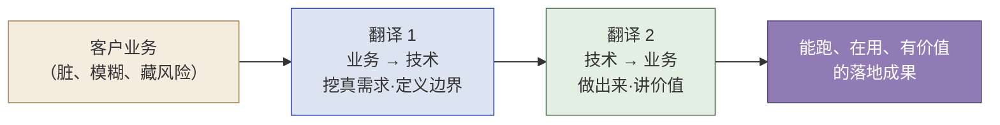
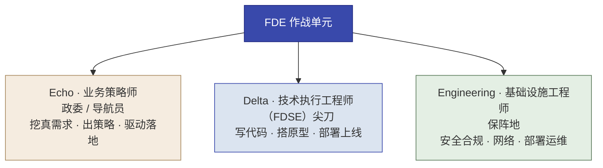
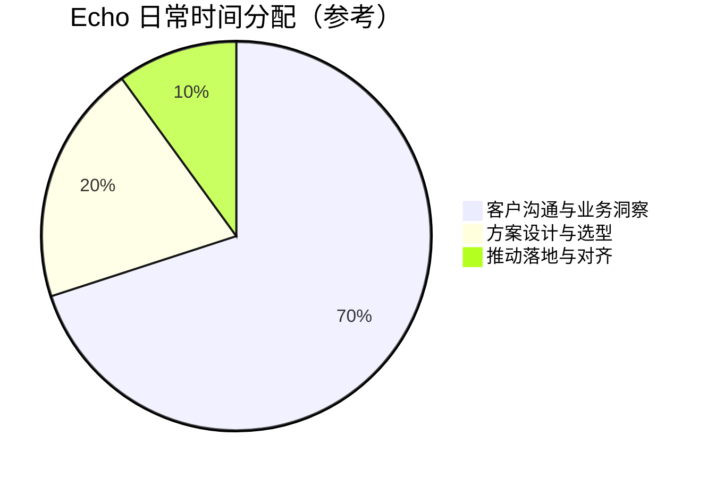
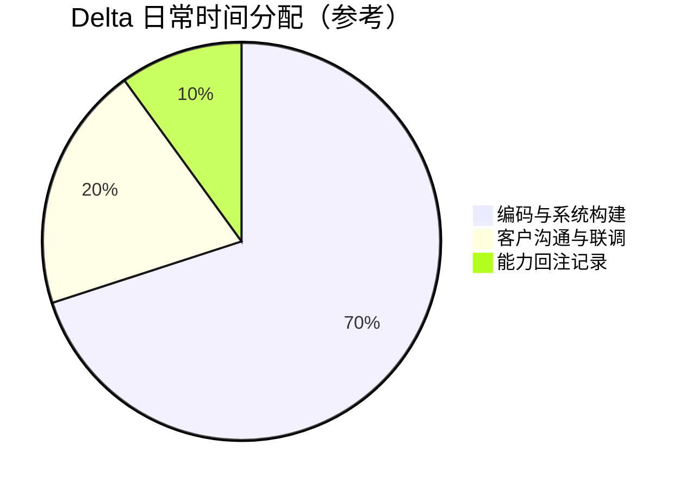
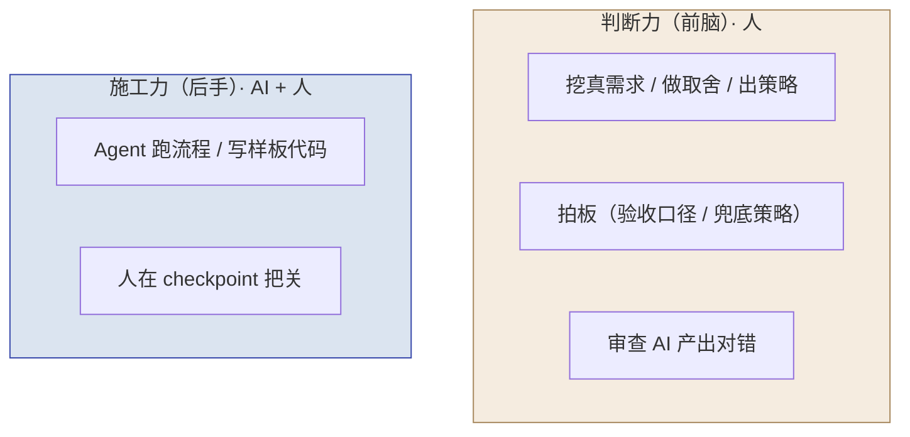
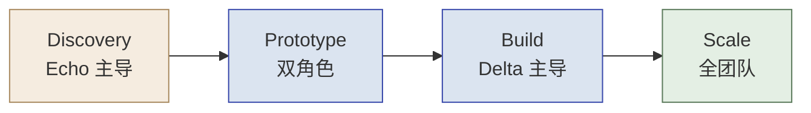

# 第 4 章  Echo 与 Delta：作战单元的分工与协作

> **本章定位：** 全书第二主线的起点——确立"双角色"分工
> **本章产出：** 你能说清为什么要双角色；能区分作战单元三角色（Echo / Delta / Engineering）及各自战位；说出 Echo 与 Delta 的职责、能力画像、时间分配；区分**"战位职责"与"个人能力"**（T 型），不把角色分工误当人格标签；讲清"人能判断、AI 能执行"的分工哲学；知道四阶段里谁主导谁配合；通过角色定位练习认领自己的战位。
> **建议读者：** 所有学员——本章确立你在这套课程里"扮演谁"。
> **前置：** 第 1–3 章（尤其第 3 章 3.2 的 Echo/Delta 分工骨架）。第 4 章在此基础上深入展开并认领战位。

---

## 本章导学

- **学习目标：**
  1. 用"翻译损耗"解释为什么 FDE 需要双角色分工；
  2. 区分作战单元三角色：Delta（技术执行）、Echo（业务策略）、Engineering（基础设施保障）；
  3. 区分**"战位职责"**（本轮交付中谁对什么负责，随阶段迁移）与**"个人能力"**（T 型发展），避免把角色倾向误写成固定人格或岗位标签；
  4. 描述 Echo 与 Delta 的职责、能力画像、日常时间分配；
  5. 讲清"人能判断、AI 能执行"的分工哲学与两种训练模式；
  6. 知道四阶段里谁主导、谁配合；通过定位练习认领战位。
- **前置知识：** 第 1–3 章（FDE 定义、飞轮、四阶段）。**特别是第 3 章 3.2 已给出 Echo/Delta 的分工骨架——本章在此基础上深入展开，并做角色定位游戏。**
- **章节地图：** 第 3 章讲了"怎么干活"的方法论，本章确立**由谁来执行**：Echo（靠想）负责前半（需求→施工图，Ch5/6），Delta（靠做）负责后半（施工→Demo，Ch7–12），Ch16 全团队收口。

> **一句话记住本章：** Echo 靠想、Delta 靠做；人能判断、AI 能执行。**角色是"战位"不是"标签"**——战位随阶段迁移，个人能力按 T 型培养。

---

## 4.1 为什么需要双角色：翻译损耗

为什么 FDE 不干脆让一个人干完全程？为什么不让两类人各干各的、中间靠交接？

**答案的关键是"翻译损耗"。** 一次交付要经历两段翻译：**业务 → 技术**（理解需求、转成方案），再 **技术 → 业务**（做成系统、讲给客户）。每一次在"懂业务的人"和"懂技术的人"之间交接，都是一次损耗：


*图 4-1：一次交付经历两段翻译——交接越多，损耗越大*

- 若一个人**又懂业务又懂技术又能写**，翻译损耗最小——但现实中单项全能的"超人"太少、不可复制；
- 若**业务归业务、技术归技术**，靠开会交接，翻译损耗最大——需求必然在流转中失真。

**FDE 的解法是"分工解耦 × 战斗力整合"：** 把两端拆成两个高度专精的角色（Echo 管业务端、Delta 管技术端），但他们**同处一个作战单元、深度协作、目标一致**——解耦的是分工，整合的是战斗力。这样既避免了"一人干全程"的不可复制，又避免了"跨团队甩锅交接"的损耗。

---

## 4.2 作战单元三角色：阵型

> **承接第 3 章 3.2：** 第 3 章已用"Echo 靠想、Delta 靠做、Engineering 保阵地"的职能视角画过三角色（图 3-2）。本节换一个视角——**战场比喻**（尖刀 / 政委 / 保阵地），并给出三者更完整的对照。两个视角是同一件事的两面。

一次 FDE 交付由一个"特种作战单元"承担。Palantir 前线编制是**三角色**：


*图 4-2：作战单元三角色——Delta 是尖刀、Echo 是政委/导航员、Engineering 保阵地*

| 角色 | 别称 | 定位（战场比喻） | 一句话 |
|------|------|----------------|--------|
| **Delta** | 技术执行工程师（FDSE） | 尖刀 | 手上沾泥，把方案翻译成能跑的代码 |
| **Echo** | 业务策略师（Deployment Strategist） | 政委 / 导航员 | 不写代码，但挖真需求、出策略、做取舍 |
| **Engineering** | 基础设施工程师（SRE 等） | 保阵地 | 负责安全合规、网络配置、部署运维等脏活累活 |

> [!NOTE]
> **"三角色"与"五角色"：** 本书用**前线三角色**（Echo / Delta / Engineering）作教学主线，够用——其中 Engineering 在本书课程里主要由讲师环境兜底，重点是 Echo 与 Delta 这对双主角。若想了解更完整的编制（在三角色之外纳入"平台工程师 / FDE 负责人"），见 FDE 101 https://www.cloudzun.com/fde-course/（第 10 章 FDE 角色体系、第 12 章 FDE 人才培养与知识管理）。

### 4.2.1 战位职责 vs 个人能力：别把分工当标签

三角色讲的是**组织分工（战位）**，不是**个人人格**。两个概念必须分开：

| 概念 | 回答什么问题 | 会变化吗 | 例子（西岭） |
|------|-------------|---------|-------------|
| **战位职责** | 本轮交付中，谁对什么负责 | **随阶段迁移**（先 Echo、后 Delta、收尾全团队） | Discovery 战位 = Echo；Prototype 战位 = Delta |
| **个人能力** | 我有什么、缺什么 | 长期培养（T 型） | 偏 Echo 的人补工程技术短板 |

- **战位职责**：角色是"岗位分工"——Echo 对"定义问题"负责、Delta 对"做出来并回注"负责。同一个交付里可以换人站岗，战位跟着项目阶段走（完整矩阵见 4.6）。
- **个人能力**：个人要不要具备跨角色协作的 **T 型能力**——横线（Echo 与 Delta 两侧能力都要够宽：能听懂业务、也能看懂代码），竖线（某一项要够深，作为立身之本）。

> [!IMPORTANT]
> **把角色倾向误写成"固定人格"是最常见的教学误区。** "测出偏 Echo"只说明你当前更愿意把精力放在"想清楚"，不说明你"不是做事的料"，更不代表你不能练成 T 型。本章角色定位游戏的产出落在**"本轮交付我负责什么 + 我往哪补"**，而不是"我是哪类人"。

---

## 4.3 Echo 深度：业务策略师（Deployment Strategist）

> **承接第 3 章 3.2：** 第 3 章已给 Echo 一句话定位（靠想、出《解决方案框架》）。本节给出全量深度——职责、时间分配、能力画像、与客户经理的本质区别。

> **战略定义：** 业务专家与"产品侦探"。不写代码，但必须看穿客户嘴上说的"伪需求"与实际面临的"真痛点"之间的鸿沟。

**核心职责（5 条）：**

| # | Echo 职责 | 做什么 |
|---|----------|--------|
| 1 | 干系人管理 | 绘制干系人地图，理清"谁说了算、谁会挡路" |
| 2 | 痛点识别 | 深入一线，识别具有高价值 ROI 的业务场景 |
| 3 | 场景规划 | 拆解模糊大需求，定义 MVP 边界，规划交付路线图 |
| 4 | 技术选型 | 用"能力金字塔"为每个场景选对技术路线 |
| 5 | 落地推动 | 推动客户组织采纳与变革，撬动"快赢" |


*图 4-3：Echo 把时间主要花在"听、想、推"上*

**能力画像：** 业务理解、沟通、产品思维、学习敏捷度**极强**；技术深度**中等**（够用于与技术层对话、做选型判断）。

> [!CAUTION]
> **Echo ≠ 客户经理 / 售前。** 三条本质区别缺一不可：
> - **懂技术**（能判断技术可行性，不是只谈业务）；
> - **定义问题**（不是只记录需求，而是重构问题并做取舍）；
> - **对落地负责**（不只签单，而是对"业务真变好"负责）。
> 且 Echo 的汇报线**隔离**——定义问题，但不背签单与定价指标（否则会被签单压力裹挟成售前）。

---

## 4.4 Delta 深度：技术执行工程师（FDSE）

> **承接第 3 章 3.2：** 第 3 章已给 Delta 一句话定位（靠做、把施工图做成 Demo 并回注）。本节给出全量深度——职责、时间分配、能力画像、与"只会写码"的本质区别。

> **战略定义：** 驻扎客户现场的"全栈特种兵"。不仅是代码编写者，更是技术与业务现实碰撞最前沿的解题者。

**核心职责（5 条）：**

| # | Delta 职责 | 做什么 |
|---|-----------|--------|
| 1 | 数据管道 | 端到端搭建数据管道与清洗 |
| 2 | 原型开发 | 高价值场景的原型应用开发迭代 |
| 3 | 系统集成 | 异构系统集成、底层技术难题攻坚 |
| 4 | 能力回注 | 识别定制代码共性，向平台回注（Feedback Loop） |
| 5 | 工程落地 | 代码审查、测试、部署、上生产 |


*图 4-4：Delta 的 70/20/10 时间分配*

**能力画像：** 技术实现、工程稳定性、调试排查**极强**；业务理解**中等**（够用于听懂 Echo 的需求、判断技术可行性）。

> [!CAUTION]
> **Delta ≠ "只会写码的程序员"。** 要能理解业务约束、参与技术可行性判断，并**主动做能力回注**——不做回注，Delta 就退化成外包（呼应第 2 章"卖人力 vs 卖能力"）。

### Echo vs Delta 对照

| 维度 | Echo | Delta |
|------|------|-------|
| 主战场 | 商务、共识、需求、策略 | 代码、原型、工程、回注 |
| 核心工具 | 脑子、嘴、白板 | 手、opencode、gstack |
| 训练什么 | 判断力（前脑） | 施工力（后手） |
| 主导实操 | Ch6 需求调研、Ch16 汇报 | Ch8/10/12 三个 Demo 施工、Ch16 技术评估 |
| 靠什么完成交付 | 挖真需求、出施工图 | 把施工图做成能跑的 Demo |

---

## 4.5 分工哲学：人能判断、AI 能执行

这是全书最重要的分工观念，它回答"角色为什么这么分工"、也回答"在 AI 时代分工怎么变"：

> **在 AI 时代，FDE 分工的核心是：人能判断，AI 能执行——不是"AI 越强、人越省事"。**


*图 4-5：人能判断、AI 能执行——两种能力缺一不可*

- **Echo 的活（挖需求、做取舍、出策略）AI 替不了**——AI 可以帮你访谈转写、痛点聚类、尽调速读，但"哪个才是真问题、值不值得做、怎么跟决策层讲"必须靠人的判断力。
- **Delta 的活（重复、可标准化的部分）AI 系统性地替你干**——让 Agent 跑流程、写样板代码，你在 checkpoint 把关。但"什么是对、哪里会出事"仍要人审定。

> 由此引出本书的**两种训练模式**：
> - **判断型实操（Ch6 实操一、Ch16 实操五）关键判断不用 AI**——AI 只能辅助整理/润色/扮演红队，判断力替不了；
> - **AI 施工品类（Ch8/10/12）用 opencode + gstack**——训练施工力，让 Agent 跑、人在 checkpoint 把关。
>
> 两者缺一不可——**"人会判断、AI 会执行"，是 FDE 交付的核心引擎，也是本书要练成的两种能力。**

---

## 4.6 四阶段中的角色协作

不同阶段，谁主导、谁配合是不同的。下面这张矩阵告诉你"在项目每个阶段，Echo/Delta 各干什么"（这也是 4.2.1"战位随阶段迁移"的完整展开）：

| 阶段 | 主导 | Echo | Delta | 阶段产出 |
|------|------|------|-------|---------|
| **Discovery 发现** | **Echo 主导** | 挖痛点、理干系人、拆场景、选型 | 补技术可行性判断（数据够不够、能不能做） | 《解决方案框架》 |
| **Prototype 原型** | **双角色** | 定义 MVP、讲 Demo、拿决策 | 快速做出可跑原型 | 可跑原型 / Demo |
| **Build 构建** | **Delta 主导** | 验收需求是否满足、推采纳 | 集成、测试、合规、上线 | 生产级系统 |
| **Scale 扩展** | **全团队** | 推变革、讲价值、铺扁平 | 自运营、能力回注、评估生产 | 自运营交接 + 回注 |


*图 4-6：四阶段主导权变化——先 Echo、后 Delta、收尾全团队*

> **协作节奏：** Discovery 靠 Echo 挖对问题；Prototype 双角色一起证明价值；Build 靠 Delta 做实做稳；Scale 全团队推广 + 回注。Echo 从"挖需求"到"验收 + 讲价值"，Delta 从"判断可行性"到"主导施工 + 回注"——**角色不是静止的，而是随阶段迁移**（这正是 4.2.1 说的"战位职责"）。

---

## 实战演练：角色定位（本章实操）

> **目标：** 认领你的战位，明确你偏 Echo 还是偏 Delta，以及它在后续实操里主导的范围。
> **建议工作量：** 15–20 分钟（单测）/ 30 分钟（组内 + 情境判断讨论）。
> **重要前提（呼应 4.2.1）：** 本演练判断的是**战位倾向**，不是人格测验；结果只决定"谁主导哪一步"，不代表你只能干一种活。

### 玩法一：Echo / Delta 倾向自测（个体）

下面 8 题，凭第一直觉选 A / B。统计 A（策略向）与 B（工程向）的数量：

1. 客户说"我想要个智能一点的系统"。你第一反应：**A** 他到底想解决什么业务痛点？ / **B** 用什么技术栈最快做出来？
2. 面对一个大需求，你更享受：**A** 拆成几件该做的事、排优先级 / **B** 把其中一件真正做到能跑。
3. 项目过半，你最担心：**A** 我们做的可能不是客户真正要的 / **B** 系统上生产会扛不住。
4. 团队争论选型，你更关心：**A** 这技术能不能讲得陈主任听得懂 / **B** 这技术在当前数据条件下能不能落地。
5. 你更愿意把时间花在：**A** 和干系人聊、画干系人地图 / **B** 调通数据管道、修 bug。
6. 定验收标准，你更看重：**A** 它解决了客户哪个痛点、价值怎么衡量 / **B** 它的准确率/性能/可用性。
7. 拿到脏需求材料，你更愿意：**A** 读透、找出客户没说破的风险 / **B** 直接转成给 AI 的启动提示词。
8. 交付完成后，你更在意：**A** 客户真的在用、业务真变好了 / **B** 系统稳不稳、能不能上生产。

**判读：** A 多偏 **Echo（策略型）**，B 多偏 **Delta（工程型）**，接近则**双栖型**。

> **A/B 两选项无优劣、无高低之分**，也不代表能力好坏——它只是判断你更愿意把精力放在"想清楚"还是"做出来"，两者对 FDE 都必要。
> **这是战位倾向判断，不是人格测验。** FDE 是"T 型人才"——横线（Echo/Delta 两种能力都要宽）尽量铺，竖线（某一项要深）要有立足点。本测试只决定"谁主导哪一步"，不代表你只能干一种（再读一遍 4.2.1）。

### 玩法二：情境判断（组内，可选）

把下面情境卡发给各组，判断"该由哪个角色主导"并讨论分歧：

| # | 情境 | 该谁主导 | 讨论点 |
|---|------|---------|--------|
| 1 | 客户说"把一整套都智能化了"，信息很散 | **Echo** | 为什么不先写代码？Discovery 初期该干嘛？ |
| 2 | 已定好场景 A：诉求自动分类，要出可跑 Demo | **Delta** | 为什么施工主导权在 Delta？Echo 还跟不跟？ |
| 3 | 政策文件更新，RAG 答案可能过时、要重建索引 | **Delta**（需 Echo 确认业务口径） | 谁判断"哪些文件该重灌"？业务归 Echo，工程归 Delta |
| 4 | 工单路由工作流快上线，但发现"敏感件可能漏判" | **Echo + Delta 协作** | 自动化边界是业务决策（Echo），落地与验证是工程（Delta） |
| 5 | 项目快交，要判断"需求满足了吗、能上生产吗" | **全团队** | 双视角互补，缺一不可（第 16 章） |

> **情境卡判断的是"该谁站岗"（战位），不是评估你个人像谁。** 每组讨论结束都问一句："这个决策点落在 Echo 还是 Delta 的战位上？交接给对方时需要带什么证据？"

### 本演练产出物（放学习档案）

```
定位记录/
├── 自测结果.txt        # 你的 A/B 倾向，判读为 Echo/Delta/双栖（战位起点，非人格标签）
├── 战位声明.md         # 一、本轮交付职责边界：我在后续实操中主站哪个战位、负责什么、和谁交接
│                        #   - Echo型：Ch6/15 主导需求调研与汇报（战位=Echo）
│                        #   - Delta型：Ch8/10/12 主导施工与代码审查（战位=Delta）
│                        #   - 双栖型：做黏合剂 + 记录员，补两边短板
│                        # 二、T 型发展计划：横线（我要补的另一侧能力）+ 竖线（我的立足点与具体练法）
└── 能力短板清单.md      # 偏 Echo 记"工程短板"，偏 Delta 记"业务短板"
```

> **配套交互素材：** 训练营提供了角色定位游戏的交互 HTML（定位测评 + 结果页给分工建议），与玩法一同源，可用于组内快速分组。

---

## 反模式与红线

- **Echo 抢了 Delta 的活（或反之）。** 需求没挖清就急着写代码，或施工阶段还反复改需求边界——角色解耦就要各守其位。
- **把"AI 施工"当成"跳过判断"。** 让 Agent 一把梭、不设 checkpoint，或用 AI 堆方案代替自己思考——分工哲学要求"人能判断、AI 能执行"，不是相反。
- **把位置测试当"标签"贴死。** 定位只是起点（4.2.1：战位 ≠ 人格）；别因为测出偏 Echo 就不碰代码、或偏 Delta 就不碰业务——FDE 要 T 型发展。
- **Delta 不做能力回注。** 那会退化成外包（呼应第 1/2 章红线）。

> 🔺 **本书红线（本处正式落地）：人能判断、AI 能执行。** 这是贯穿全书的第四条红线，它决定了后续每个实操该不该用 AI、谁主导、谁把关。

---

## 本章小结

- 作战单元**三角色**：Delta（尖刀）、Echo（政委/导航员）、Engineering（保阵地）。
- **战位 ≠ 人格（4.2.1）**：战位职责随阶段迁移（4.6），个人能力按 T 型培养（横宽竖深）——别把分工当标签。
- **Echo（业务策略师）**靠想：挖真需求、拆场景、出施工图；**Delta（技术执行）**靠做：把施工图做成能跑的 Demo 并回注能力。
- 分工哲学：**人能判断、AI 能执行** → 头脑风暴品类不用 AI（练判断），AI 施工品类用 Agent 跑流程、人在 checkpoint 把关（练施工）。
- 四阶段主导权：**Discovery Echo 主导 → Prototype 双角色 → Build Delta 主导 → Scale 全团队**。

**动手自检：**
- [ ] 我能说出三角色及各自的"战场"比喻吗？
- [ ] 我能区分"战位职责"与"个人能力"，并用一句话解释"为什么不能把角色当标签"吗？
- [ ] 我能对照 Echo / Delta 的职责、能力画像、时间分配吗？
- [ ] 我能用"人能判断、AI 能执行"解释"为什么头脑风暴不用 AI、施工用 AI"吗？
- [ ] 我知道四阶段里各阶段该由谁主导吗？明确了自己的战位与本轮职责边界吗？

---

## 练习与思考

- **基础：** 默写三角色定位；区分"战位职责"与"个人能力"；说出 Echo 与 Delta 各自的 3 条核心职责。
- **进阶：** 完成玩法一自测并写《战位声明》（含"本轮交付职责边界 + T 型发展计划"两栏）；针对情境卡 4（敏感件漏判）说明 Echo 和 Delta 各自的判断点。
- **挑战（迁移练习）：** 为你熟悉的一个真实项目，画出它的"Echo / Delta 战位分工表"——如果它没有明确双角色，指出由此导致的交付风险；再为团队里两名成员各写一条"T 型发展建议"（横线补什么、竖线立什么）。

---

## 延伸阅读

- 想读五角色完整编制、四阶段中的角色漂移、人才培养与 HR 落地（面试题、职级双轨、Playbook 沉淀），见 FDE 101 **https://www.cloudzun.com/fde-course/**。
- 本章可延伸的章节：第 10 章（FDE 角色体系）、第 11 章（四阶段中的角色协作）、第 12 章（FDE 人才培养与知识管理）、第 15 章（AI FDE 落地：Echo 共识与对齐）。