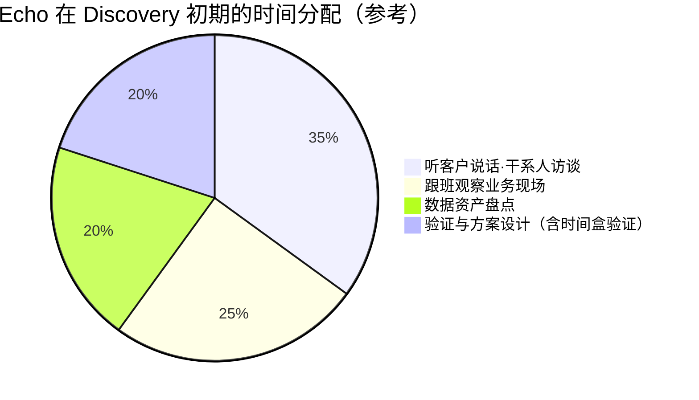
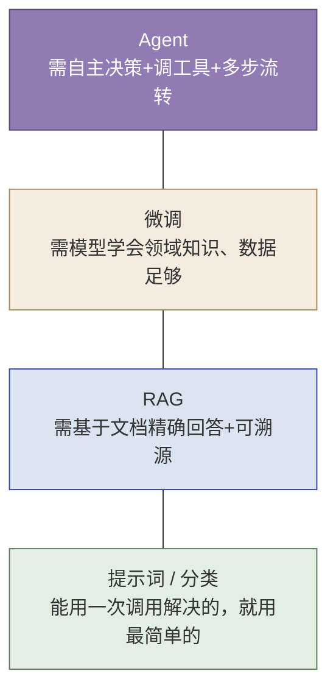
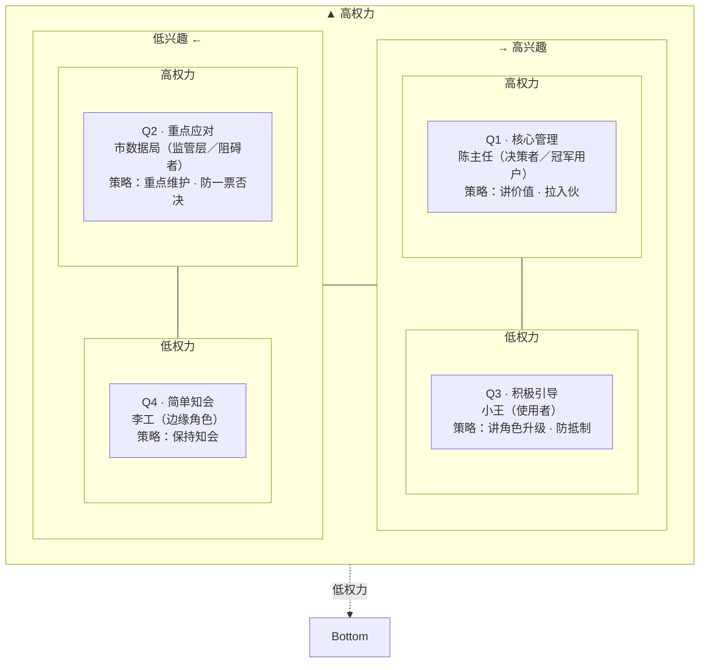
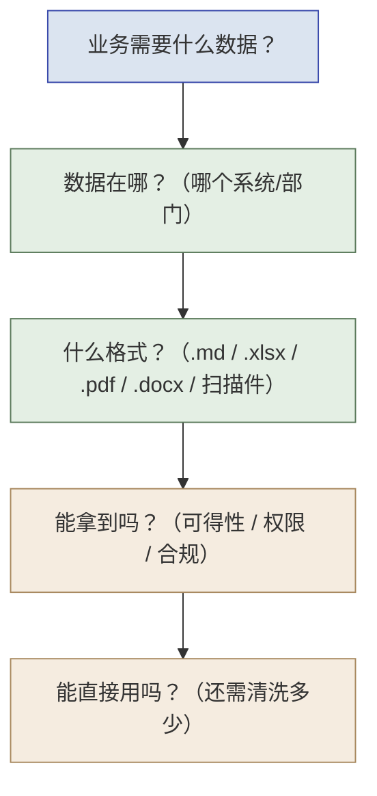
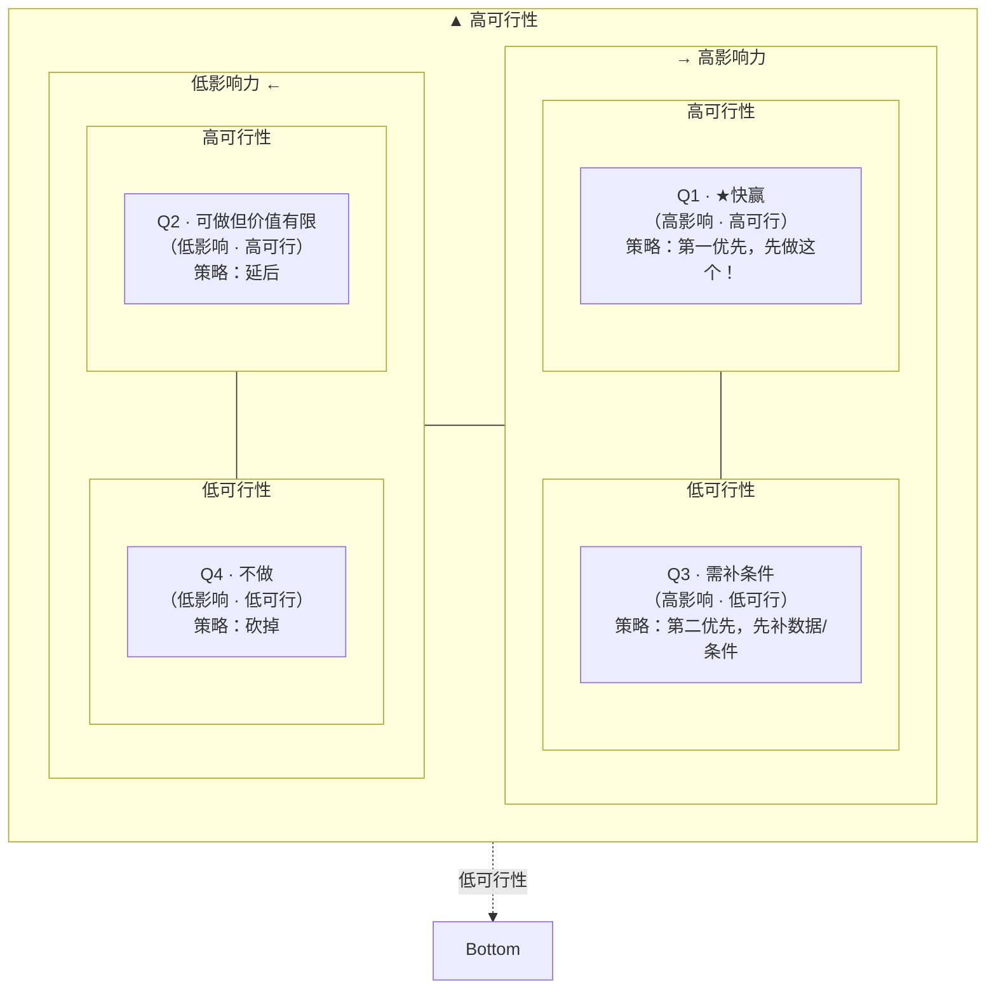
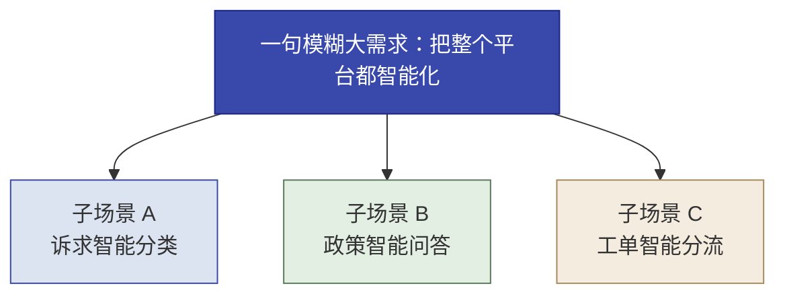
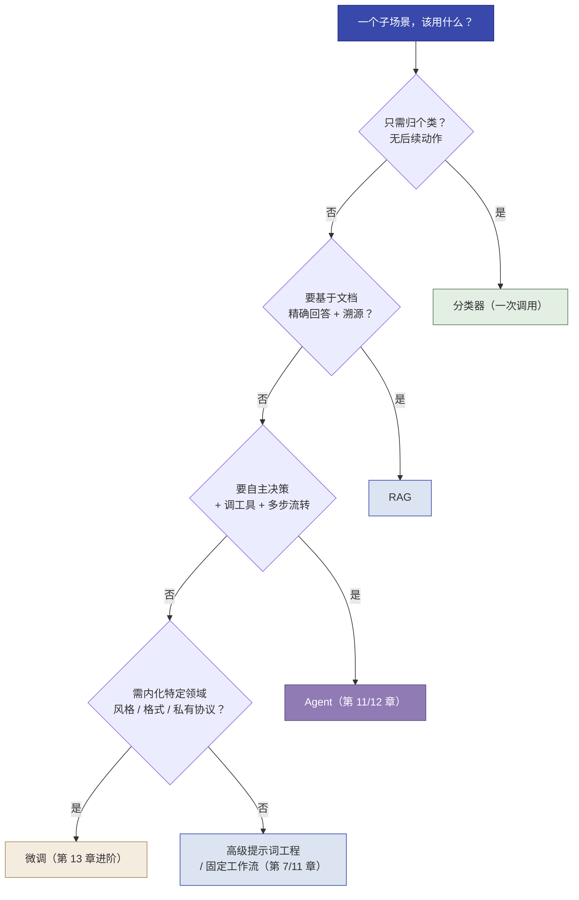

# 第 5 章  Echo 工作法 · Discovery

> **本章定位：** Echo 侧方法论的"知识底座"——教你 Echo 在项目里具体怎么干活
> **本章产出：** 你能说出"Discovery 初期不以功能开发为目标"的原则、原因与**时间盒技术验证**的边界；熟练使用三个思维脚手架（失败模式 / 决策链 / 能力金字塔）；独立完成三个 SOP（干系人地图 / 数据资产盘点 / 快赢筛选），每个 SOP 都知道**输入 / 完成判据 / 异常应对**；完成"场景拆解 + 选型三问 + 技术决策矩阵"；能独立产出一页纸《解决方案框架》（格式见 5.8.2）；用 **Discovery Gate** 六要素核验自己能否进入 Prototype；了解 AI 如何辅助 Discovery。
> **建议读者：** 偏 Echo 者精读，偏 Delta 者也需理解（要在施工时看懂 Echo 的方案框架怎么来的）。
> **前置：** 第 3 章（Discovery 在四阶段的位置、Discovery Gate 总纲 3.3.2）、第 4 章（Echo 角色）。第 6 章实操一将直接应用本章方法。

---

## 本章导学

- **学习目标：**
  1. 说出"Discovery 初期不以功能开发为目标"的原则及为什么，并说清时间盒技术验证的允许边界；
  2. 掌握三个思维脚手架：四类失败模式 / 四层决策链 / LLM 能力金字塔；
  3. 应用三个 SOP：干系人地图（SOP1）、数据资产盘点（SOP2）、快赢筛选（SOP3）——每个 SOP 能说出**输入、步骤、输出、完成判据、异常与示例**；
  4. 用快赢评分量表（1–5 分 + 判断依据）排序候选场景；
  5. 完成"场景拆解 + 技术选型三问 + 技术决策矩阵"，为一个场景给出选型理由；
  6. 产出《解决方案框架》——它就是 Delta 的施工图；用 Discovery Gate 六要素自检。
- **前置知识：** 第 3 章（四阶段、Gate 总纲）、第 4 章（Echo 角色）。
- **章节地图：** 本章是理论，**第 6 章实操一（西岭需求调研）马上用**——两者是"知识 → 动手"的一对；第 3 章 3.3.2 的 Gate 总纲在本章 5.8 落到 Discovery 的可操作核验。

> **一句话记住本章：** Echo 靠想——Discovery 初期不以功能开发为目标（允许时间盒技术验证），用三个脚手架把"客户嘴上说的需求"挖成"真正值得做的真问题"，再用三个 SOP 与 Gate 核验，产出一份能让 Delta 照着施工的《解决方案框架》。

---

## 5.1 核心原则：Discovery 初期不以功能开发为目标

Echo 进驻客户后的第一原则：

> **Discovery 初期不以功能开发为目标——先听客户说话，成为内行人。**

为什么不是先动手？因为（呼应第 3 章 PPT 框架）**People 是根、Process 是脉、Technology 是器——顺序不可颠倒。** 一上来就奔着"做出功能"去，你会在没搞清"客户到底要解决什么、谁在用、数据行不行"之前，就把方案做在错误的地基上。

**"不以功能开发为目标" ≠ "完全不碰技术"。** Echo 允许做**时间盒（time-boxed）技术验证**：对"数据到底能不能拿到、格式能解析到什么程度、API 连通性、样例数据走一遍要多久"这类**只有到现场才能确认的不确定项**，用半天级时间盒快速验证，把验证结果当作 Discovery 的发现来支撑选型，而不是投入功能开发。

| 维度 | 允许（时间盒技术验证） | 不允许（功能开发） |
|---|---|---|
| 做法 | 连一次 API、跑通 1 条样例、解析 1 份文档、查字段可得性 | 写业务代码、搭界面、做完整数据管线 |
| 目的 | 消除"数据/技术不可行"的不确定性，支撑选型判断 | 交付可用的功能 |
| 时间盒 | 单次半天以内，累计不超过 Discovery 工作量的 20% | 无时间盒（应留到 Prototype） |

> **判断标准：** 验证产出的是**"判断依据"**，不是**"可用功能"**。如果一项工作能让"该选 RAG 还是微调""数据够不够做"更确定，就值得做；如果只是"先做着，反正以后用得上"，那属于功能开发，留到 Prototype 阶段。

Echo 在 Discovery 初期的时间，大致这样分配：


*图 5-1：Echo 在 Discovery 初期把时间花在听懂业务上（含时间盒技术验证）*

> **这也是与 Delta 的根本分工：** Echo 的第一任务是把问题"定义对"，而不是"动手做"。判断错再快的施工也是白费——第 6 章实操一整个就是在练"别急着动手"。

---

## 5.2 三个思维脚手架（贯穿全书的判断工具）

头脑风暴 / 诊断不是"随便聊聊"，而是用三个脚手架让讨论有结构、有产出。它们是 Echo 的核心知识，也是第 6 章实操一的骨架。

### 脚手架一：四类失败模式（挖风险）

AI 项目翻车不是偶然，是模式。客户不会主动说"我们这有风险"——你要自己从材料里读出来：

| 模式 | 一句话 | 典型症状 |
|------|--------|---------|
| **数据不可用** | 数据拿不齐、拿不干净 | 格式杂乱、字段缺失、数据未必拿得齐 |
| **业务不配合** | 用系统的人抵制 | 担心被替代、消极使用、不录入 |
| **合规卡住** | 法规/监管一票否决 | 数据不出域、算法需可解释、有兜底要求 |
| **ROI 说不清** | 算不清投入产出 | 没统计过基线的"现状数据"是拍脑袋 |

**用它的方法：** 对项目材料逐条问"这属于哪一类失败模式"——尤其停在"哪个区最空"时：**空区往往是全组集体盲区**（多数组会漏"业务不配合"或"ROI 说不清"这类非技术风险）。

### 脚手架二：四层决策链（理干系人）

对不同层级的人，要说不同的话。把干系人按四层排开，每层关心什么、该对他说什么：

| 层级 | 核心关切 | 你该对他说什么 |
|------|---------|--------------|
| **决策层** | 值不值、能不能拿去汇报 | ROI 和成效 |
| **操作层** | 会不会抢我饭碗、好不好用 | 角色升级——从"分派员"变"审核员" |
| **技术层** | 数据安全、对接工作量 | 本地部署、少动现有系统 |
| **监管层** | 合规、数据安全、算法可解释 | 数据不出域、算法可解释、有兜底 |

**用它的方法：** 画权力 × 兴趣坐标，把关键干系人（含"刁钻"的：平时低兴趣、出事高权力的监管层）定位进去，为每人写一句沟通策略。

### 脚手架三：LLM 四层能力金字塔（选型）

拆完场景，每个子场景该用什么技术？遵循**"从最简单开始"——能用简单的，就不上复杂的**：


*图 5-2：LLM 四层能力金字塔——从最简单开始*

**用它的方法：** 对每个子场景问"该用哪一层、为什么是它、为什么不是更复杂的那层"。**新手最容易"什么都想上 Agent"，要拉回"从最简单开始"。**（金字塔不是"单线升级"路线，各维度可组合——判断哪个维度该上，见 5.7.2 技术决策矩阵。）

---

## 5.3 SOP1：干系人地图

> **目标**：搞清楚"谁说了算、谁会挡路、对谁说什么话"。

- **输入**：项目材料（需求原文、组织架构、干系人名单初稿）；客户允许接触的人员范围。
- **步骤**：
  1. 列出干系人清单（决策者 / 影响者 / 使用者 / 阻碍者 / 冠军用户候选）；
  2. 用**权力（纵）× 兴趣（横）**两维定位到四个象限（见下图表 5-1）；
  3. 为每个关键干系人写一句沟通策略；**头三天锁定冠军用户**。

用 **权力（纵轴）× 兴趣（横轴）** 两个维度，把干系人分进四个象限——每个象限对应一种对待策略。下图是它的可视化（以本书西岭案例的角色落位）：


*图 5-3：权力（纵轴）× 兴趣（横轴）——干系人四象限（西岭案例落位）*

> **坐标轴的读法：** 纵轴是"权力高低"（说了算不算），横轴是"兴趣高低"（想不想参与推动）。沿纵轴从上往下 = 权力从高到低；沿横轴从左往右 = 兴趣从低到高。四象限的详细策略对照见下表：

| 兴趣 ＼ 权力 | **高兴趣**（想参与、想推动） | **低兴趣**（平时不参与） |
|---|---|---|
| **高权力**（说了算） | **决策者 / 冠军用户**：核心对象，讲价值、拉入伙 | **监管层 / 阻碍者**：重点维护，防"一票否决" |
| **低权力**（管不了） | **使用者**：预防抵制，讲"角色升级" | **边缘**：保持知会即可 |

*表 5-1：权力 × 兴趣坐标——干系人的四个象限及对应策略*

**读法（"对谁说什么话"）：**
- **高权力 · 高兴趣** —— 最值得投入的对象：可能是决策者（讲 ROI 和成效），也可能是**冠军用户**（最支持你、能帮你推动项目的人）；
- **高权力 · 低兴趣** —— "平时不看你、出事定生死"（如监管层）：平时少打扰，但涉及红线必须主动上报、防一票否决；
- **低权力 · 高兴趣** —— 天天用系统的人（操作层）：最怕被替代，要讲"角色升级"，预防消极抵制；
- **低权力 · 低兴趣** —— 边缘角色：保持知会即可，不必投入太多精力。

- **输出（底稿）**：干系人清单 + 权力×兴趣图 + 每人一句话沟通策略。
- **完成判据**：四象限都有明确落位；五类干系人（决策者 / 影响者 / 使用者 / 阻碍者 / 冠军用户）都能点出名字；对每个关键干系人能答"该对他说什么"。
- **异常与应对**：名单不全 → 通过跟班观察与访谈补全；监管层信息不足 → 查公开制度文件 + 安排一次正式访谈；客户不愿透露组织关系 → 先按"角色"占位（如"信息中心负责人"）画结构，边访谈边填名字。
- **示例（西岭）**：决策层陈主任（高权力·高兴趣）、监管层市数据局（高权力·低兴趣）、操作层坐席组长小王（低权力·高兴趣）、技术层信息中心李工（低权力·低兴趣/中性）。实操一（Ch6）会画出这张图。

---

## 5.4 痛点诊断

- **目的**：挖出真正值得解决的痛点。
- **做法**：
  1. **结构化访谈**：按角色列问题，深挖"你每天最头疼的事"；
  2. **跟班观察**：到现场看业务怎么流转——**"眼睛看到的比嘴上说的更真实"**。
- **分类**：把痛点分到四类：

| 痛点类型 | 指什么 | 例子 |
|---------|--------|------|
| **流程** | 业务流程低效、返工 | 简单/复杂诉求混着走同一套流程 |
| **数据** | 数据拿不齐、不可用 | 政策库 md/pdf/docx 混杂、格式杂乱 |
| **决策** | 判断/分派靠人、易错 | 坐席老分错部门、拍脑袋估错分率 |
| **协作** | 跨部门信息孤岛 | 工单 / 市民信息 / 政策库分属多套系统 |

- **底稿**：痛点清单 + 分类矩阵。
- **完成判据**：每条痛点都有原始证据（访谈引述 / 观察记录 / 数据样例），不凭印象；至少覆盖四类中的两类以上；能说出每条痛点"影响谁、多频繁、代价多大"。
- **异常与应对**：访谈对象回避真实问题 → 换跟班观察校准；痛点太多无法收敛 → 按"高频 × 高代价"先筛 Top 5；证据不足 → 回到现场补一次跟班。

**顺带收集"候选业务语义"（不做最终建模）：** 访谈与跟班时记下四类观察，作为后续本体建模的输入（第 15 章 15.7 展开）：

- 客户**反复提到的业务对象**（诉求、政策、工单、部门……）；
- **哪些对象之间的关系**决定业务结果（诉求依据哪条政策、工单归哪个部门）；
- **哪些动作由谁执行**（分类、分派、升级、审批）；
- **哪些状态变化需要审批**（转人工、驳回、关闭）。

> [!NOTE]
> Discovery 阶段**只收集候选语义，不完成最终本体**——对象边界、关系与动作的正确性要等数据与流程验证后再定（第 14 章 14.9 工程验证、第 15 章 15.7 建模）。

---

## 5.5 SOP2：数据资产盘点

> **目标**：验证"数据行不行"——AI 项目最常死在数据上。

- **输入**：已拆解的子场景清单（5.7 有初稿即可）；每个场景"业务需要什么数据"的问题清单。
- **步骤**：**"业务牵引"逆向盘点**——先想清楚业务需要哪些数据，再倒查这些数据在哪、格式如何、能否拿到：


*图 5-4：数据资产盘点的"业务牵引逆向"流程*

**常见陷阱：**

| 陷阱 | 说明 |
|------|------|
| 数据"纸面上有、实际拿不到" | 图表有清单，但权限/合规拿不出 |
| 格式杂乱 | PDF/Word/扫描件需大量清洗 |
| 口径对不上 | 字段定义与业务口径不一致 |

- **输出（底稿）**：数据资产清单 + 可得性评估（能拿 / 有条件 / 拿不到）+ 需清洗度。
- **完成判据**：每个子场景所需数据字段都有出处与格式；每项标了可得性并写明原因；至少有一次到系统 / 部门核实（不凭"纸面有"）；基线数字（如错分率）有统计来源，或明确标注"待核实"。
- **异常与应对**：数据拿不到 → 记录原因（权限 / 合规），作为"数据不可用"失败模式的证据，回头影响选型与范围；格式杂乱 → 用 1 份样例做解析验证并估算清洗量；口径对不上 → 列字段口径对照表，找业务骨干确认。
- **示例（西岭）**：政策库是 5 份混合格式文档（3 个 .md + 1 个 .docx + 1 个 .pdf），李工明说"数据未必拿得齐、格式杂乱"——这是"数据不可用"风险的地基；诉求错分率没有统计 → 基线数字列为"待核实"，方案里必须安排现场抽样统计。

---

## 5.6 SOP3：快赢场景筛选

> **目标**：从所有候选里选出"先做哪个"。

- **输入**：候选场景清单（来自痛点诊断与场景拆解）；每个场景的影响与可行性初步材料。
- **步骤**：
  1. 用下表**评分量表**对每个候选场景逐项打分（1–5 分）；
  2. **每项分值必须写判断依据**（数字、事实或访谈引述，不允许"凭感觉"）；
  3. 按总分排序，圈出**快赢**（高影响 × 高可行）。


*图 5-5：影响力 × 可行性矩阵——找出"快赢"场景（坐标图画法，与干系人地图一致）*

> **坐标轴的读法：** 纵轴是"可行性高低"（数据、技术、合规、周期上好不好做），横轴是"影响力高低"（领导关不关心、业务获得感强不强、覆盖大不大）。沿纵轴从上往下 = 可行性从高到低；沿横轴从左往右 = 影响力从低到高。四象限策略对照见下表：

| 影响力 ＼ 可行性 | **高影响力** | **低影响力** |
|---|---|---|
| **高可行性** | **快赢（Q1）**：第一优先，先做这个 | **可做但价值有限（Q2）**：延后，有余力再排 |
| **低可行性** | **需补条件（Q3）**：第二优先，先补数据 / 条件 | **不做（Q4）**：砍掉，不投入 |

*表 5-2：影响力 × 可行性矩阵——四象限策略对照*

**快赢评分量表（影响力 × 可行性，每项 1–5 分，必须附依据）：**

| 维度 | 评分项 | 1 分 | 3 分 | 5 分 |
|---|---|---|---|---|
| **影响力** | 领导关注 | 无人关心 | 一个部门主任关心 | 决策者点名要 |
| | 群众 / 业务获得感 | 无感 | 部分受益 | 高频、强痛点 |
| | 覆盖规模 | 单点 | 一个部门 | 跨部门 / 全流程 |
| **可行性** | 数据 | 拿不到 | 有条件（需申请/清洗） | 已在手 |
| | 技术复杂度 | 高（微调 / Agent） | 中（RAG） | 低（一次 LLM 调用） |
| | 合规 | 有红线风险 | 需评审 | 无新增风险 |
| | 周期 | >1 个月 | 2–4 周 | ≤2 周 |

- **输出（底稿）**：候选场景评分表（含每项依据）+ 按总分排序 + 快赢结论。
- **完成判据**：每个候选场景六个评分项都有 1–5 分与一句依据；排序与快赢结论能讲清理由；快赢场景不依赖"还没到位的数据"。
- **异常与应对**：多个场景同分 → 用"决策者最关心 + 群众获得感最强"口径破同分；评分缺依据 → 回到现场补证据（基线数字、样例、访谈引述）；高影响低可行 → 标注"需先补数据/条件"，不硬排第一。
- **示例（西岭）**：三个场景（诉求分类 / 政策问答 / 工单分流）中，**诉求分类是"快赢"**——技术最简（一次调用）、数据在收件记录里、陈主任最关心件量，得分最高，他在实操一选了它第一个施工；政策问答次之（依赖政策库解析，数据中等）；工单分流排后（涉及跨部门流程，需先对齐部门职责库）。

---

## 5.7 场景拆解与技术选型

### 5.7.1 把大需求拆成子场景

客户给的一句模糊大需求（如"把这一整套都智能化了"）往往裹着三四个需求。Echo 的工作是把它拆开：


*图 5-6：把"模糊大需求"拆成可施工的子场景*

每个子场景要记清三件事：**1. 解决的什么问题 2. 用户是谁 3. 成功怎么衡量**（成功衡量必须落到可数指标，如"分类准确率 ≥95%""政策问答可追溯率 6/6"——这决定后续 Prototype 的验收口径）。

### 5.7.2 技术选型三问 + 技术决策矩阵

对每个子场景，先用"三问"定技术路线：

> **Q1 能不能用最简单的一层？**（一次调用分类？）
> **Q2 需不需要"基于文档精确回答 + 溯源"？**（→ RAG？还是微调？）
> **Q3 需不需要"自主决策 + 调工具 + 多步流转"？**（→ Agent？）

用一张决策树串起来（对照能力金字塔）：


*图 5-7：技术选型决策树——从最简单开始，仅必要时升级*

> **决策树 q3 的"否"注意别误导向微调：** Q1/Q2/Q3 全都不满足，说明这个子场景既不需要分类、也不需要检索、更不靠多步决策——它**并不必然要微调**。是否"学会"某个**特定领域风格 / 格式 / 私有协议**（q4）才是微调的判据；否则用**高级提示词工程 / 固定工作流**（复杂 Prompt 链、固定流程、摘要提取等都归此类）即可。

**技术决策矩阵（与金字塔互补；金字塔管"选型排序"，矩阵管"维度判断与组合"）：**

| 判断问题（按顺序逐条问） | 是 → | 否 → |
|---|---|---|
| 需要外部领域知识（文档 / 知识库）？ | RAG | 继续下一问 |
| 答案需要来源引用、可溯源？ | RAG（必需） | 继续下一问 |
| 需要稳定改变模型行为（风格 / 格式 / 私有协议）？ | 微调（数据足够时） | 继续下一问 |
| 需要调用工具、多步决策？ | Agent / Workflow | 继续下一问 |
| 流程路径是否可枚举（预编排）？ | 固定工作流（Agentic Workflow） | 动态 Agent |
| 需要人工审批 / 兜底环节？ | 加 HITL 节点（不改变主选型） | 全自动 |

> **矩阵读法：** 六问逐条判断，多个"是"可以叠加组合（典型组合：**RAG + 固定工作流 + HITL 人工兜底**）。每次选型都要能讲清"为什么是它、为什么不用更复杂的、它与哪些维度组合、人工兜底在哪"。

> **选型口诀（源自能力金字塔）：从最简单开始，能用简单的就不上复杂的；但该上复杂时（文档溯源→RAG、决策循环→Agent）也要果断。**

> **本课程实例（西岭选型理由）：**
> - **场景 A 诉求分类** → 分类器（一次调用，无需多步决策）——不用 Agent；
> - **场景 B 政策问答** → RAG（需要"基于文档回答 + 可溯源"，且政策常更新、一次重训一次、无法溯源）——不用微调；组合：**RAG + 库外拒答兜底**；
> - **场景 C 工单分流** → 工作流（预编排三路路由 + 工具调用 + 敏感件转人工 HITL）——不是分类器，因为分流后还要"做事"（自动答复/转人工）（详见第 11–12 章对 Workflow / Agent 的定义）。

---

## 5.8 Discovery Gate 与《解决方案框架》

### 5.8.1 Discovery Gate：六要素核验

离开 Discovery 进入 Prototype 前，按第 3 章 3.3.2 的 Gate 总纲做六要素核验：

| Gate 要素 | 本阶段内容 |
|---|---|
| **输入条件** | 已立项 / 客户授权；可接触干系人与数据入口 |
| **核心活动** | 干系人地图（5.3）、痛点诊断（5.4）、数据盘点（5.5）、快赢筛选（5.6）、场景拆解与选型（5.7） |
| **必交付物** | 干系人地图 + 痛点清单 + 数据资产清单 + 快赢评分表 +《解决方案框架》（5.8.2） |
| **通过证据** | 决策者认可方向；冠军用户到位；数据已验证可得；每个选型能讲清"为什么是它"；四条红线（尤其数据不出域）已写入方案；基线数字有来源或标注"待核实" |
| **未通过动作** | 缺证据 → 补证据再过；范围过大 → 砍场景降级；无快赢 → 重筛或建议终止 |
| **主责与协同** | Echo 主导；Delta 补技术可行性；客户：决策者 + 业务骨干确认 |

**快速自检（通过证据的轻量版）：**
- [ ] **决策者认可**：决策层知道并认可这个方向，且认可它的价值（能讲清"值不值得做"）？
- [ ] **冠军用户到位**：有人愿意深度参与、帮助推动？
- [ ] **数据已验证**：所需数据可拿到、可用？
- [ ] **"黑话"复述**：能把客户业务"黑话"复述出来了吗？（听懂了内行话）

### 5.8.2 《解决方案框架》模板（Echo 的最终产出）

```
# 《解决方案框架》
## 一、需求拆解
| 场景 | 解决的问题 | 目标用户 | 成功怎么衡量 |
## 二、技术选型
| 场景 | 选型 | 为什么是它 | 为什么不用更复杂的 |
## 三、施工优先级
- 第一优先（快赢）：场景__，理由
- 第二 / 第三：...
## 四、四类风险与应对
| 风险类型 | 本项目具体风险 | 初步应对 |
## 五、数据不出域方案（一句话）
```

> **这份《解决方案框架》就是 Echo 交给 Delta 的"施工图/任务书"**——第 6 章实操一就是产出它的地方，第 8/10/12 章的 Delta 施工照着它做。
>
> **完整成品样例不随正文公布**——它是第 6 章实操一的产出，公布出来等于直接给答案；讲师可在实操一验收后组织讲评对标。

> **延伸阅读：** Discovery 更完整的 SOP 与工作底稿（访谈提纲、跟班记录、数据清单模板等），见在线全书 https://www.cloudzun.com/fde-course/（第 5 章 Phase 1 Discovery）。

---

## 5.9 AI 辅助 Discovery（提效，但判断在人）

AI 时代 Echo 也可以借力，但要守住一条铁律：

> [!CAUTION]
> **"AI 洞察只是'子弹'，不是'结论'。"** 用 LLM 大提速访谈解析 / 痛点聚类 / 尽调速读，但 AI 归纳出的结论**必须回到现场做人工确认**——否则会把 LLM 的"看似合理"误当成客户真话。

| AI 辅助 | 它为你做什么 | 你（人）要验证什么 |
|--------|-------------|------------------|
| 访谈/纪要结构化 | 自动转写、去噪、抽关键实体与痛点 | 结论与真实现场是否一致 |
| 痛点聚类与初筛 | 聚类高频痛点、量化出现频率 | 高频 ≠ 重要，用业务判断筛 |
| 尽调资料速读 | RAG 秒答制度文档里的卡点 | 找业务骨干核对"黑话复核" |

> **实践边界：** Ch6 实操一（求判断力）和 Ch16 实操五（求表达力）**全程禁用 AI**——训练的是 FDE 最不可替代的判断力；真实项目里当然可用 AI 提效，但那是在你已经具备判断力之后。

---

## 反模式与红线

- **一上来就套模板 / 用 AI 堆产出代替判断。** Discovery 训练的是判断力；AI 一键生成"完美方案"掩盖的恰是 FDE 不可替代的能力。
- **把"不以功能开发为目标"误解为"完全不碰技术"。** 时间盒技术验证是被鼓励的——它的产出是"判断依据"，不是"可用功能"（5.1 的允许/不允许表）。
- **跳过"先独立、后碰撞"。** 头脑风暴一上来就开口讨论，会被声量大的人带偏；先每人独立写判断，才能暴露真实分歧（Ch6 实操一专门练）。
- **把"拍脑袋的数字"当依据。** 基线的"现状数据"（如错分率）若没统计，是整个 ROI 方案的地基——**哪些数字必须先核实，要列清楚**；快赢评分每项都必须附依据，不允许"凭感觉"打分（5.6）。
- **SOP 做完没有判据。** 干系人地图画了、数据盘了，却说不出"这步算没算完成"——每个 SOP 必须过一遍完成判据（5.3/5.5/5.6）。
- **对决策层讲技术黑话。** Echo 汇报要用客户听得懂的业务语言，能让陈主任直接拿去市里汇报。
- **把"高风险高复杂度"当场就上。** 什么都想上 Agent / 微调——从最简单开始（能力金字塔 + 决策树 + 决策矩阵）。

> 🔺 **本书红线（首次在方法层落地）：数据不出域** 是政务 AI 的关键选型约束——Echo 在 Discovery 就必须把它作为设计约束写入方案（《解决方案框架》第五节），而非施工期才发现。本条红线在 Ch6 实操一将亲手落地。

---

## 本章小结

- Echo 第一原则：**Discovery 初期不以功能开发为目标，成为内行人**（People 先于 Technology）；**允许时间盒技术验证**（产出判断依据，不产出功能）。
- **三个脚手架**：四类失败模式（挖风险）/ 四层决策链（理干系人）/ LLM 能力金字塔（选型，"从最简单开始"，维度可组合）。
- **三个 SOP（统一六段式：输入—步骤—输出—完成判据—异常—示例）**：干系人地图（找冠军用户）/ 数据资产盘点（业务牵引逆向，基线数字标"待核实"）/ 快赢筛选（1–5 分评分量表 + 依据）。
- **选型**：用"三问 + 决策树 + 技术决策矩阵"决出 分类/RAG/微调/Agent/工作流，并讲清理由与组合。
- 产出《解决方案框架》（场景+选型+优先级+风险+数据不出域）——即 Delta 的施工图，格式见 5.8.2；正文不公布成品样例（避免直接给出第 6 章实操一的答案）。
- **Discovery Gate**：六要素核验（输入/活动/交付物/证据/未通过动作/主责），过关才进 Prototype。

**动手自检：**
- [ ] 我能说出三个脚手架分别解决什么问题吗？
- [ ] 我能用四类失败模式，对任意一个项目材料"挖风险"吗？
- [ ] 我能画出干系人权力×兴趣图并定位五类人吗？
- [ ] 我能说出三个 SOP 各自的输入、完成判据与常见异常吗？
- [ ] 我能用快赢评分量表给候选场景打分并附依据吗？
- [ ] 我能对一个场景做"选型 + 理由 + 为什么不用更复杂的 + 组合判据"吗？
- [ ] 我能独立写出《解决方案框架》五个部分，并说清每部分各装什么内容吗？

---

## 练习与思考

- **基础：** 默写三个脚手架；说出三个 SOP 的输入/输出/完成判据各一条；默写 Discovery Gate 六要素。
- **进阶：** 用"数据不出域"约束，为一个政务场景回答"技术选型三问 + 决策矩阵"，写明选型理由；再为快赢评分表补一个"依据缺失"的场景，练习把它转成"待核实"清单。
- **挑战（迁移练习）：** 挑一个你熟悉的真实模糊需求（一句话），用本章工具拆成子场景并做选型，产出一页纸《解决方案框架》初稿，并用 5.8.1 Gate 六要素逐项自检——指出你缺哪条通过证据、打算怎么补。

---

## 在线全书（延伸阅读）

- 想读 Discovery 的完整 SOP 与工作底稿、访谈提纲、数据清单模板，见在线全书 **https://www.cloudzun.com/fde-course/**。
- 本章直接相关章节：第 5 章（Phase 1 Discovery）；第 16 章（AI FDE 落地：Delta 技术与场景，含 AI 辅助四阶段）。