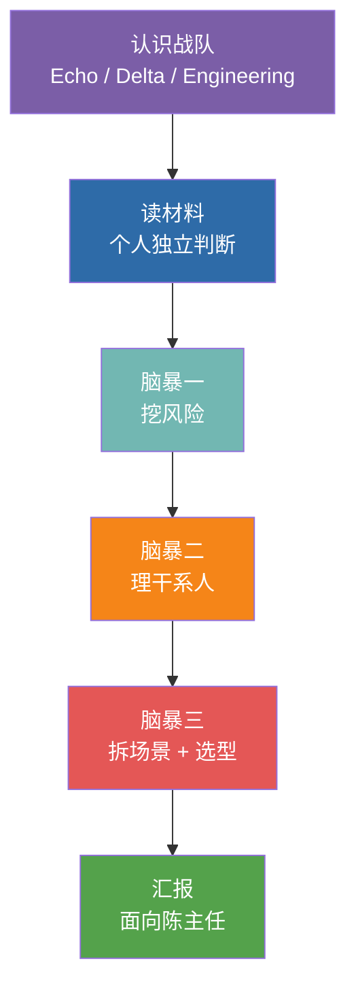

# 第 6 章  实操一 · 西岭需求调研 →《解决方案框架》

> **本章定位：** 实操单元 · **角色 = Echo** · Discovery 阶段 · 模式 = **头脑风暴（关键判断不用 AI）**
> **本章产出：** 一份**《解决方案框架》**（三场景 + 选型 + 优先级 + 风险应对 + 数据不出域方案）+ 150 字业务语言汇报话术。它就是本书后续所有 Delta 实操的"施工任务书"。
> **前置：** 第 5 章（三个脚手架、SOP、选型）、第 4 章（Echo/Delta 定位与分工）。第 6 章实操一将直接应用第 5 章的方法。
> **实验手册：** 客户需求材料、解决方案框架模板、头脑风暴脚本与参考话术见《实验手册》`labs/source-client-requirements.md`、`labs/lab1-requirements-brainstorm.md`——本实操正文只保留"方法与验收"，执行细节以手册为准。

---

## 本章导学

- **学习目标：**
  1. 扮演 Echo，把"一句模糊大需求"拆成几个能落地的子场景；
  2. 用三个脚手架（失败模式 / 决策链 / 能力金字塔）完成挖风险、理干系人、选型；
  3. 挖出客户没说破的四类风险（数据 / 业务 / 合规 / ROI）；
  4. 产出一份可让 Delta 照做施工的《解决方案框架》，并用 ≤150 字业务语言向决策层汇报。
- **前置知识：** 第 5 章（三个脚手架、SOP、选型）、第 4 章（Echo/Delta 定位与分工）。
- **章节地图：** 这是 Discovery 的实操落地（第 3 章四阶段的第一阶段）。产出《解决方案框架》→ 交给第 8/10/12 章 Delta 施工。

> **一句话记住本实操：** **Echo 靠想、Delta 靠做。** 这一步训练的是判断力不是产出力——所以**关键判断不用 AI**（AI 只允许辅助整理与润色，判断与取舍必须自己来）。材料里埋了四类能翻车的风险，客户不会主动说，你得自己读出来。

---

## 实操概述

你所在的 FDE 团队被派驻到**西岭市民服务平台**。平台中心的陈主任撂下一句话——"用 AI 把这一整套都智能化了"——然后就等着你们给方案，他下个月还要去市里汇报。

这一句"整套智能化"，就是你拿到的全部正式需求。作为团队里的 **Echo**，你的任务是：

1. **把一句模糊的大需求，拆成几个能落地的子场景**——地基拆错了后面全白做；
2. **为每个子场景选对技术路线**——什么该用分类、什么该用 RAG、什么该用 Agent；
3. **挖出客户没说破的风险**——数据、业务、合规、ROI 四类失败模式，材料里都埋了线索；
4. **产出一份"解决方案框架"**——它就是实操二三四的施工任务书，也是实操五汇报的底稿。

> **顺带收集候选业务语义**（业务对象 / 关系 / 动作，观察点见第 5 章 5.4）：只收集、不做最终本体——它们是第 15 章 15.7 业务语义回注的输入。

### 为什么这一步不用 AI？

这是本实操最重要的设计——**它和 Echo 的角色定位是绑死的**：

> Echo 的定义：**"部署策略师，业务专家、产品侦探。不写代码，但能看穿客户嘴上说的需求和真正的痛点之间的差距。"**

Echo 的核心工具从来不是键盘，是**脑子和嘴**。一上来就靠 AI 追问、AI 拆场景、AI 选型，你训练的是"会用 AI"，掩盖掉的恰恰是 FDE 最不可替代的能力——**从脏材料里挖真需求、在争论中暴露盲区、凭判断力做取舍**。这些，AI 替不了你。

| 阶段 | 角色 | 工具 | 训练什么 |
|------|------|------|---------|
| **实操一** | Echo | 脑子 + 白板 + 便签 | **判断力**（前脑） |
| 实操二三四 | Delta | opencode + AI | **施工力**（后手） |

你会亲身体会到"Echo 靠想、Delta 靠做"的分工——这正是 FDE 团队协作的精髓。


*图 6-1：本实操六个环节流程*

---

## 知识背景：三个思维脚手架

头脑风暴不是"随便聊聊"。你们要用三个思维框架作为研讨的脚手架，让讨论有结构、有产出。

### 脚手架一：四类失败模式（挖风险用）

AI 项目翻车不是偶然，是模式。客户不会主动说"我们这有个风险"——你得自己从材料里读出来：

| 模式 | 一句话 | 本项目材料里的线索 |
|------|--------|------------------|
| **数据不可用** | 数据拿不齐、拿不干净 | 李工："政策库 PDF/Word/扫描件格式杂乱""数据未必拿得齐" |
| **业务不配合** | 用系统的人抵制 | 小王："你们 AI 上来是不是就不需要我们了" |
| **合规卡住** | 法规/监管一票否决 | 李工："数据不出政务外网是红线"；市数据局"一票叫停" |
| **ROI 说不清** | 算不清投入产出 | 陈主任："得让我知道值不值"；错分率"没人统计过" |

### 脚手架二：四层决策链（理干系人用）

对不同层级的人，要说不同的话：

| 层级 | 本项目角色 | 核心关切 | 你该对他说什么 |
|------|-----------|---------|--------------|
| 决策层 | 陈主任 | 值不值、能不能拿去汇报 | ROI 和成效 |
| 操作层 | 坐席组长小王 | 会不会抢我饭碗、好不好用 | 角色升级——从"分派员"变"审核员" |
| 技术层 | 信息中心李工 | 数据安全、对接工作量 | 本地部署、不出外网、少动现有系统 |
| 监管层 | 市数据局 | 合规、数据安全 | 数据不出域、算法可解释、有兜底 |

### 脚手架三：LLM 四层能力金字塔（选型用）

拆完场景，每个子场景该用什么技术？遵循"从最简单开始"——**能用简单的，就不上复杂的**：

```text
        Agent          ← 需要"自主决策 + 调工具 + 多步流转"时才用
       ───────
        微调            ← 需要模型"学会"领域知识、且数据量足够时才用
      ─────────
        RAG            ← 需要"基于文档精确回答 + 可溯源"时用
    ─────────────
     提示词/分类        ← 能用一次调用解决的，就用最简单的
   ─────────────────
```

---

## 任务书：客户需求材料（读材料三问）

> 客户方（西岭市民服务平台）交给你的"原始需求"见《实验手册》**`labs/source-client-requirements.md`**：一半是会议纪要、一半是各方吐槽，信息散、口径乱、还藏着没说破的风险。它不是规整的需求文档——它就是真实项目里你会拿到的样子。
>
> **你的任务不是照单全收，而是像 Echo 一样把真需求挖出来。** 读材料时带着三个问题：
> 1. 陈主任说的"整套智能化"，**实际上是几件事**？
> 2. 对照四类失败模式，这个项目**最可能死在哪一类**？材料里哪句话是线索？
> 3. 哪些"现状数据"是**完全没支撑的拍脑袋数字**？哪些是硬约束（红线）？

（材料全文、走访原始记录与现状数据表见 `labs/source-client-requirements.md`。）

---

## 演练流程（六个环节）

> **铁律：先独立、后碰撞。** 每一步都先用个人独立判断打底，再全组讨论——一上来就开口会被声量大的人带偏。

### 环节 1 · 破冰与分工（约 10 分钟）

- **偏 Echo 的同学**主导——牵头讨论、把控节奏、执笔方案框架；**偏 Delta 的同学**配合——重点补"技术可行性判断"；**双栖型**做黏合剂与记录。
- 本实操虽由 Echo 主导，但**全组都要出声**——头脑风暴最怕一个人说、其他人点头。

**✅ 检查点：** 每人知道自己的定位倾向；明确谁主导、谁配合、谁记录。

### 环节 2 · 独立判断（约 10 分钟）

**每人在便签上写下（每个问题一张便签）：**
1. 陈主任说的"整套智能化"，你觉得**实际上是几件事**？分别是什么？
2. 对照四类失败模式，这个项目**最可能死在哪一类**上？为什么？
3. 材料里，**哪个人的话最值得警惕**？谁的态度可能让项目推不动？
4. 有一个"现状数据"是完全没支撑、纯拍脑袋的——是哪个？它为什么危险？

> **自查追问 #1：** 客户说错分率"十个有一两个"，但这是小王拍脑袋的，没有任何统计。如果你把整个 ROI 方案建立在"错分率 18%"上，到汇报时陈主任问"你这数据哪来的"——你怎么办？**哪些数字，你必须先去核实、而不是直接拿来用？**

**✅ 检查点：** 每人写了 ≥4 张便签；这一步**没有人说话**——纯独立思考。

### 环节 3 · 头脑风暴一：挖风险（约 15 分钟）

用**脚手架一：四类失败模式**做研讨骨架。玩法：便签墙 + 四象限——每人把第 2 题便签贴到对应区并说明理由；全组看着这面墙讨论：哪个区最空（往往是被忽略的盲区）？有没有同一风险被贴到不同区（分歧点最值钱）？材料里还有哪些"话里有话"没挖出来？

> **自查追问 #2：** 小王那句"你们 AI 上来是不是就不需要我们了"，是随口抱怨，还是能让整个项目失败的信号？如果 40 个坐席都消极使用——你的分类器准确率再高，有意义吗？**这个风险属于哪一类失败模式？光靠技术能解决吗？**

**✅ 产出：** 白板上"风险墙"一张，四类失败模式各至少 1 条本项目风险。**✅ 检查点：** 四个区都有便签；讨论了 ≥1 个"判断有分歧"的风险；发现 ≥1 个独立思考时没人想到的风险。

### 环节 4 · 头脑风暴二：理干系人（约 12 分钟）

用**脚手架二：四层决策链**做研讨骨架。玩法：画"权力 × 兴趣"坐标图，把陈主任、小王、李工、市数据局贴上去并**边贴边吵**。重点讨论两个"刁钻"干系人：
- **市数据局**：平时不管你（低兴趣），但出事能一票叫停（高权力）——这种"平时不看你、出事定生死"的人，怎么管？
- **小王**：权力不高，但他和 40 个坐席的消极抵制能让系统"没人用"。对他，你打算说什么？

> **自查追问 #3：** 如果只给你 5 分钟，向陈主任和小王各汇报一次——你对两个人说的话，能一样吗？陈主任要听"值不值、能不能拿去汇报"，小王要听"会不会丢饭碗"。**同一个方案，你怎么翻译成两套话术？**

**✅ 产出：** 干系人图 + 每个人的一句话沟通策略。**✅ 检查点：** 四人都定位到象限；市数据局被识别为"低兴趣高权力"并有专门策略；小王的策略是"角色升级"而非"效率替代"。

### 环节 5 · 头脑风暴三：拆场景 + 选型（约 25 分钟）

这是本实操的**核心产出**。用**脚手架三：能力金字塔**做研讨骨架。

**Step 1 · 拆子场景：** 回到第 1 题便签，把"整套智能化"拆成一张表（应该能拆出三个）：场景 | 要解决的问题 | 用户。
**Step 2 · 为每个场景选技术路线：** 对照能力金字塔，遵循"从最简单开始"，每场景辩清楚三件事：选**哪一层**（分类 / RAG / 微调 / Agent）？**为什么是它**？**为什么不是更复杂的那层**？
**Step 3 · 定施工优先级：** 用"快赢原则"——先做能最快见效、风险最低、最能打动陈主任的。

> **自查追问 #4：** 场景 B（政策问答）——为什么用 RAG，不用微调？政策文件经常更新，微调一次就要重训一次，而且答案无法溯源。RAG 只需重建索引、且天生带来源引用。**你能把这个选型理由，用陈主任听得懂的话讲出来吗？**
> **自查追问 #5：** 哪个是"快赢"场景——能最快做出可演示效果、且不依赖那些还没到位的数据？陈主任下月就要汇报，你第一个交给他看的应该是哪个？为什么？

**✅ 产出：** 完整的解决方案框架（三场景 + 选型理由 + 优先级，照模板填，模板见《实验手册》`labs/lab1-requirements-brainstorm.md` 附录）。**✅ 检查点：** 大需求被拆成三个独立可施工的子场景；每场景有选型+理由+"为什么不用更复杂的"；定出快赢场景与施工顺序。

### 环节 6 · 汇报（面向陈主任，约 8 分钟）

用 **150 字以内、全业务语言**向陈主任汇报。**禁用词汇**：算法、模型、RAG、Agent、embedding、向量、API、微调。推选一名组员扮陈主任、一名组员做汇报，其他组员挑刺。自检：陈主任没有技术背景能听懂吗？说清"整套智能化"分几步做了吗？提到数据不出域了吗？让他知道"先看到什么、大概多久"了吗？

> **参考话术先自己写，再对照《实验手册》`labs/lab1-requirements-brainstorm.md` 环节 6**——别还没开口就看答案。

**✅ 检查点：** 汇报 ≤150 字、全业务语言、无技术词；讲清三个子场景与先做哪个；提到数据不出域。

### 环节 7 ·（可选）用 AI 当"红队"挑战你们的结论

头脑风暴出结论后，如果时间允许，可以打开 opencode 让 AI 挑一次刺——但这是"验证"，不是"代替你思考"：把解决方案框架贴进去，请 AI 扮演挑剔的评审专家指出漏掉的风险、拆错的场景、选型站不住脚的地方；对比 AI 的挑战与你们的结论（哪些点到了盲区、哪些是 AI 不懂政务在瞎说）。这一步让学员体会——**AI 是好用的"陪练"，判断对错的还是你**，也为实操二三四"用 AI 施工"埋下伏笔。

---

## 产出物清单（交付物）

每组产出（白板拍照 + 一份填好的模板）：

```
实操一-方案框架/
├── 风险墙.jpg               # 头脑风暴一：四类失败模式风险墙（拍照）
├── 干系人图.jpg             # 头脑风暴二：权力×兴趣图（拍照）
├── 解决方案框架.md          # ★核心产出：三场景 + 选型 + 优先级（模板见 labs/lab1 附录）
└── 汇报话术.txt            # 150 字全业务语言方案汇报
```

> **★《解决方案框架》是本实操最重要的产出**——它是实操二三四的施工任务书。请务必写清楚，因为**下一步就是你（作为 Delta）照着它施工。**

## 完成标准（DoD）

- [ ] 完成 Echo/Delta 定位并做了组内分工
- [ ] 每人独立写了 ≥4 张判断便签（先独立后碰撞）
- [ ] 风险墙：四类失败模式各至少 1 条本项目具体风险
- [ ] 干系人图：四层决策链全覆盖，市数据局和小王策略正确
- [ ] **解决方案框架**：三场景 + 各自选型理由 + 施工优先级（照模板）
- [ ] 150 字全业务语言汇报，讲清方案且无技术黑话
- [ ] 5 个自查追问全部在组内讨论过

> （解决方案框架模板、自查追问汇总、讲师引导要点见《实验手册》`labs/lab1-requirements-brainstorm.md` 附录。）

---

## 反模式与红线（本实操学习点）

- **照单全收客户需求。** 材料是"会议纪要 + 吐槽"的样子，客户不会主动说真痛点——你要自己挖。
- **让 AI 替你思考。** 关键判断（挖风险 / 拆场景 / 选型 / 取舍）不用 AI——AI 只允许辅助整理与润色；让 AI 替你做这些，你练的是"会用 AI"，掩盖了 FDE 最不可替代的能力。
- **跳过"先独立、后碰撞"。** 直接讨论会被声量大的人带偏。
- **把"拍脑袋数据"当 ROI 地基。** 错分率 18% 必须先去核实。
- **对陈主任讲技术黑话。** 汇报禁用算法/模型/RAG 等词——他要能拿去向市里汇报。

> 🔺 **本书红线（亲手落地）：数据不出域。** 本章你已亲手把"数据不出域"作为设计约束写进《解决方案框架》第五节——这是政务 AI 的第一条红线，也是判断你是否真听懂客户的关键。

---

## 本章小结

- Echo 的核心产出是一份**《解决方案框架》**——它就是 Delta 的施工图，也是本项目"从需求到交付"的枢纽。
- 全程训练**判断力**（关键判断不用 AI）：挖风险（失败模式）、理干系人（决策链）、拆场景选型（能力金字塔）。
- 你已把"模糊大需求"拆成三个子场景（分类 / 问答 / 路由），并为后续施工定了技术路线与优先级。

**动手自检：**
- [ ] 我能用 ≤150 字、无技术黑话向一个外行讲清我的方案吗？
- [ ] 我的方案框架里，三个场景都有"选型 + 理由 + 为什么不用更复杂的"吗？
- [ ] 我的四项风险（数据/业务/合规/ROI）都有具体应对吗？
- [ ] 我的方案明确写了"数据不出域"并给了落地思路吗？

---

## 练习与思考

- **基础：** 复述项目里三个子场景、各自的用户与成功衡量；说出四类失败模式在本项目的具体体现。
- **进阶：** 用"权力 × 兴趣"坐标解释市数据局为何必须"主动预审"，写一段你要对它说的话。
- **挑战（迁移练习）：** 用同一套流程，为"你们本地一个业务部门"重做一次 Discovery（自选一句模糊需求），产出一页纸方案框架。

---

## 在线全书（延伸阅读）

- 本实操的客户需求材料、解决方案框架模板、头脑风暴脚本与参考话术，见《实验手册》`labs/source-client-requirements.md`、`labs/lab1-requirements-brainstorm.md`（与训练营"实操一"同源）。
- 若想读 Echo 更完整的 Discovery SOP 与工作底稿，见在线全书 **https://www.cloudzun.com/fde-course/**（第 5 章 Phase 1 Discovery）。
- 下一章将切换为 **Delta 视角**：第 8 章实操二·诉求分类器（场景 A）将照着这份《解决方案框架》施工。