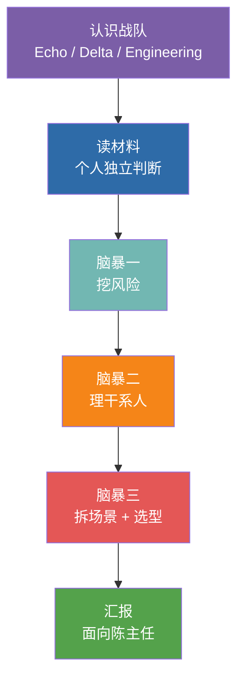

# 第 6 章  实操一 · 西岭需求调研 →《解决方案框架》

> **本章定位：** 实操单元 · **角色 = Echo** · Discovery 阶段 · 模式 = **头脑风暴（不使用 AI）**
> **本章产出：** 一份**《解决方案框架》**（三场景 + 选型 + 优先级 + 风险应对 + 数据不出域方案）+ 150 字业务语言汇报话术。它就是本书后续所有 Delta 实操的"施工任务书"。
> **前置：** 第 5 章（三个脚手架、SOP、选型）、第 4 章（Echo/Delta 定位与分工）。第 6 章实操一将直接应用第 5 章的方法。

---

## 本章导学

- **学习目标：**
  1. 扮演 Echo，把"一句模糊大需求"拆成几个能落地的子场景；
  2. 用三个脚手架（失败模式 / 决策链 / 能力金字塔）完成挖风险、理干系人、选型；
  3. 挖出客户没说破的四类风险（数据 / 业务 / 合规 / ROI）；
  4. 产出一份可让 Delta 照做施工的《解决方案框架》，并用 ≤150 字业务语言向决策层汇报。
- **前置知识：** 第 5 章（三个脚手架、SOP、选型）、第 4 章（Echo/Delta 定位与分工）。
- **章节地图：** 这是 Discovery 的实操落地（第 3 章四阶段的第一阶段）。产出《解决方案框架》→ 交给第 8/10/12 章 Delta 施工。

> **一句话记住本实操：** **Echo 靠想、Delta 靠做。** 这一步训练的是判断力不是产出力——所以**全程不用 AI**。材料里埋了四类能翻车的风险，客户不会主动说，你得自己读出来。

---

## 实操概述

你所在的 FDE 团队被派驻到**西岭市民服务平台**。平台中心的陈主任撂下一句话——"用 AI 把这一整套都智能化了"——然后就等着你们给方案，他下个月还要去市里汇报。

这一句"整套智能化"，就是你拿到的全部正式需求。作为团队里的 **Echo**，你的任务是：

1. **把一句模糊的大需求，拆成几个能落地的子场景**——地基拆错了后面全白做；
2. **为每个子场景选对技术路线**——什么该用分类、什么该用 RAG、什么该用 Agent；
3. **挖出客户没说破的风险**——数据、业务、合规、ROI 四类失败模式，材料里都埋了线索；
4. **产出一份"解决方案框架"**——它就是实操二三四的施工任务书，也是实操五汇报的底稿。

> **顺带收集候选业务语义**（业务对象 / 关系 / 动作，观察点见第 5 章 5.4）：只收集、不做最终本体——它们是第 15 章 15.4 业务语义回注的输入。

### 为什么这一步不用 AI？

这是本实操最重要的设计——**它和 Echo 的角色定位是绑死的**：

> Echo 的定义：**"部署策略师，业务专家、产品侦探。不写代码，但能看穿客户嘴上说的需求和真正的痛点之间的差距。"**

Echo 的核心工具从来不是键盘，是**脑子和嘴**。一上来就靠 AI 追问、AI 拆场景、AI 选型，你训练的是"会用 AI"，掩盖掉的恰恰是 FDE 最不可替代的能力——**从脏材料里挖真需求、在争论中暴露盲区、凭判断力做取舍**。这些，AI 替不了你。

| 阶段 | 角色 | 工具 | 训练什么 |
|------|------|------|---------|
| **实操一** | Echo | 脑子 + 白板 + 便签 | **判断力**（前脑） |
| 实操二三四 | Delta | opencode + AI | **施工力**（后手） |

你会亲身体会到"Echo 靠想、Delta 靠做"的分工——这正是 FDE 团队协作的精髓。


*图 6-1：本实操六个环节流程*

---

## 知识背景：三个思维脚手架

头脑风暴不是"随便聊聊"。你们要用三个思维框架作为研讨的脚手架，让讨论有结构、有产出。

### 脚手架一：四类失败模式（挖风险用）

AI 项目翻车不是偶然，是模式。客户不会主动说"我们这有个风险"——你得自己从材料里读出来：

| 模式 | 一句话 | 本项目材料里的线索 |
|------|--------|------------------|
| **数据不可用** | 数据拿不齐、拿不干净 | 李工："政策库 PDF/Word/扫描件格式杂乱""数据未必拿得齐" |
| **业务不配合** | 用系统的人抵制 | 小王："你们 AI 上来是不是就不需要我们了" |
| **合规卡住** | 法规/监管一票否决 | 李工："数据不出政务外网是红线"；市数据局"一票叫停" |
| **ROI 说不清** | 算不清投入产出 | 陈主任："得让我知道值不值"；错分率"没人统计过" |

### 脚手架二：四层决策链（理干系人用）

对不同层级的人，要说不同的话：

| 层级 | 本项目角色 | 核心关切 | 你该对他说什么 |
|------|-----------|---------|--------------|
| 决策层 | 陈主任 | 值不值、能不能拿去汇报 | ROI 和成效 |
| 操作层 | 坐席组长小王 | 会不会抢我饭碗、好不好用 | 角色升级——从"分派员"变"审核员" |
| 技术层 | 信息中心李工 | 数据安全、对接工作量 | 本地部署、不出外网、少动现有系统 |
| 监管层 | 市数据局 | 合规、数据安全 | 数据不出域、算法可解释、有兜底 |

### 脚手架三：LLM 四层能力金字塔（选型用）

拆完场景，每个子场景该用什么技术？遵循"从最简单开始"——**能用简单的，就不上复杂的**：

```text
        Agent          ← 需要"自主决策 + 调工具 + 多步流转"时才用
       ───────
        微调            ← 需要模型"学会"领域知识、且数据量足够时才用
      ─────────
        RAG            ← 需要"基于文档精确回答 + 可溯源"时用
    ─────────────
     提示词/分类        ← 能用一次调用解决的，就用最简单的
   ─────────────────
```

---

## 任务书：客户需求材料

> 这是客户方（西岭市民服务平台）交给你的"原始需求"。它不是一份规整的需求文档——它就是真实项目里你会拿到的样子：一半是会议纪要、一半是各方吐槽，信息散、口径乱、还藏着没说破的风险。
>
> **你的任务不是照单全收，而是像 Echo 一样把真需求挖出来。**

### 一、项目怎么来的

西岭市民服务平台是全市统一的政务诉求受理入口，前几年把原来几十条部门服务渠道整合到了一起，市民现在可以打电话、用 App、发小程序提交各种诉求——从"我家门口路灯不亮"到"社保怎么转移接续"，什么都有。

平台上线两年，话务量涨得很快。上个月平台中心的**陈主任**在市里的数字政府推进会上被点了名：别的委办局都在"拥抱 AI"，我们平台天天上万个诉求还在靠人工硬扛。会后陈主任把承建方（就是你们）叫过来，撂下一句话：

> **"我们这个市民服务平台，每天上万个诉求，坐席分派分不过来还老分错；市民问政策坐席也答不准；简单的问题和复杂的问题混着办效率低。你们能不能用 AI 把这一整套都智能化了？我下个月要去市里汇报，得有个说法。"**

这就是你拿到的全部"正式需求"。剩下的，都是你在后续走访中零零散散听来的。

### 二、走访中听到的（未整理的原始记录）

**📞 平台中心 · 陈主任（项目决策人）**
> "我要的不多，就是让这个平台'聪明'起来……钱的事……项目预算得我去争取，但你们先得让我知道这东西到底值不值。我去市里汇报，领导肯定问'投这么多钱能省多少、能带来什么'，你不能让我在台上答不上来。至于具体怎么做，那是你们专业的事。反正我要的是能拿得出手、能见效的东西，别整那些花里胡哨最后没人用的。"

**🎧 一线坐席 · 组长小王（每天用系统的人）**
> "分派？分派是最头疼的。市民一通电话过来，说的话又急又乱，我们得判断这事该转给哪个部门——住建、人社、市监、城管、交通……四十多个部门，新来的坐席根本记不全，老坐席也经常拿不准。转错了市民那头就白等，过两天又打回来投诉，我们两头挨骂。错分到底多少？没人专门统计过……我拍脑袋估，十个里头有一两个是转错或者转不下去的吧。反正返工不少。"
> "还有市民问政策，什么'我这种情况能不能领补贴'……政策文件一大堆，还老更新，我们哪背得下来。答错了也是我们担责任。"
> "说句心里话……你们这 AI 上来，是不是就不需要我们这些人了？我们这些老坐席，就靠这点经验吃饭。"

**💻 信息中心 · 李工（管系统和数据的人）**
> "数据？市民的诉求内容、个人信息，这些都是敏感数据。按上头的政务数据管理规定，这些数据**不能出政务外网**，云上那些公有的大模型服务想都别想，必须本地部署。这条是红线，没得商量。"
> "而且我们这平台底下不是一套系统。工单是一套，市民信息是另一套，政策库又散在各个部门自己的网站和文件夹里，格式还都不一样——有 PDF、有 Word、有的干脆是扫描件。你们要的数据，未必都能拿得齐、拿得干净。"
> "对接的活儿最好别太重，我们信息中心就这么几个人，天天救火，实在没精力配合你们做大改造。"

**🏛️ 市数据局（没直接参与，但绕不开）**
> （走访中李工提醒你）"这种涉及市民数据的 AI 应用，市数据局那边是要过合规的。他们平时不太管我们具体做什么，但真要出了数据泄露或者算法乱来的事，他们一票就能把项目叫停。这道关，你们方案里最好提前想到。"

### 三、一些零散的现状数据（走访拼凑，未必准确）

| 你听到的说法 | 来源 | 可靠度 |
|------------|------|--------|
| 日均诉求量"上万件"，高峰期分派积压 | 陈主任、小王 | 平台后台有数，但没人给过你 |
| 涉及 40+ 委办局的分派 | 小王 | 部门列表有，但分类标准是坐席口口相传 |
| 错分率"十个有一两个" | 小王拍脑袋 | **无任何统计支撑** |
| 政策文件"一大堆、老更新" | 小王 | 具体多少份、多久更新，不知道 |
| 简单咨询和复杂投诉走同一套流程 | 小王 | 属实，但"简单/复杂"无明确界定 |
| 数据不出政务外网 | 李工 | **硬约束，法规要求** |
| 政策库格式杂乱（PDF/Word/扫描件） | 李工 | 属实 |

---

## 演练流程（六个环节）

> **铁律：先独立、后碰撞。** 每一步都先用个人独立判断打底，再全组讨论——一上来就开口会被声量大的人带偏。

### 环节 1 · 破冰与分工（约 10 分钟）

- **偏 Echo 的同学**：本实操**主导**——牵头讨论、把控节奏、执笔写方案框架。
- **偏 Delta 的同学**：本实操**配合**——重点补"技术可行性判断"（哪些需求技术上根本做不了、数据够不够），并在实操二三四主导施工。
- **双栖型同学**：做黏合剂 + 记录员，负责把便签贴上白板、整理结论。

> 本实操虽由 Echo 主导，但**全组都要出声**——头脑风暴最怕一个人说、其他人点头。

**✅ 检查点：**
- [ ] 每人知道自己的定位倾向（偏 Echo / 偏 Delta / 双栖）
- [ ] 明确了谁主导、谁配合、谁记录

### 环节 2 · 独立判断（约 10 分钟）

> **头脑风暴的铁律：先独立、后碰撞。** 如果一上来就开口讨论，声音大的人会带偏全组。所以先每人闷头想，把判断写在便签上。

**每人在便签上写下（每个问题一张便签）：**
1. 陈主任说的"整套智能化"，你觉得**实际上是几件事**？分别是什么？
2. 对照四类失败模式，这个项目**最可能死在哪一类**上？为什么？
3. 材料里，**哪个人的话最值得警惕**？谁的态度可能让项目推不动？
4. 有一个"现状数据"是完全没支撑、纯拍脑袋的——是哪个？它为什么危险？

> **自查追问 #1：** 客户说错分率"十个有一两个"，但这是小王拍脑袋的，没有任何统计。如果你把整个 ROI 方案建立在"错分率 18%"上，到汇报时陈主任问"你这数据哪来的"——你怎么办？**哪些数字，你必须先去核实、而不是直接拿来用？**

**✅ 检查点：**
- [ ] 每人写了至少 4 张便签（对应 4 个问题）
- [ ] 这一步**没有人说话**——纯独立思考

### 环节 3 · 头脑风暴一：挖风险（约 15 分钟）

> 用**脚手架一：四类失败模式**做研讨骨架。目标：把客户没说破的风险，全组一起挖出来。

**玩法：便签墙 + 四象限**
1. 在白板上画四个区：**数据不可用 / 业务不配合 / 合规卡住 / ROI 说不清**；
2. 每人把自己第 2 题的便签贴到对应区，**边贴边说一句理由**；
3. 全组看着这面墙讨论：
   - 四个区**是不是都被贴到了**？哪个区最空？（空的区往往是被全组忽略的盲区）
   - 有没有**同一个风险被贴到不同区**？为什么大家判断不一样？（分歧点最值钱）
   - 材料里还有哪些"话里有话"没被挖出来？

> **自查追问 #2：** 小王那句"你们 AI 上来是不是就不需要我们了"，是随口抱怨，还是能让整个项目失败的信号？如果 40 个坐席都消极使用——你的分类器准确率再高，有意义吗？**这个风险属于哪一类失败模式？光靠技术能解决吗？**

**✅ 产出：** 白板上一面"风险墙"，四类失败模式各至少 1 条本项目的具体风险。

**✅ 检查点：**
- [ ] 四类失败模式区都有便签
- [ ] 全组讨论了至少 1 个"判断有分歧"的风险
- [ ] 发现了至少 1 个独立思考时没人想到的风险

### 环节 4 · 头脑风暴二：理干系人（约 12 分钟）

> 用**脚手架二：四层决策链**做研讨骨架。目标：搞清楚"谁说了算、谁会挡路、对谁说什么话"。

**玩法：画一张干系人权力×兴趣图**
1. 在白板上画一个坐标：横轴"兴趣高低"，纵轴"权力高低"；
2. 把四个人贴上去：陈主任、小王、李工、市数据局。**边贴边吵**——他们各自在哪个象限？
3. 重点讨论两个"刁钻"干系人：
   - **市数据局**：平时不管你（低兴趣），但出事能一票叫停（高权力）。这种"平时不看你、出事定生死"的人，怎么管？
   - **小王**：权力不高，但他和 40 个坐席的消极抵制能让系统"没人用"。对他，你打算说什么？

> **自查追问 #3：** 如果只给你 5 分钟，向陈主任和小王各汇报一次——你对两个人说的话，能一样吗？陈主任要听"值不值、能不能拿去汇报"，小王要听"会不会丢饭碗"。**同一个方案，你怎么翻译成两套话术？**

**✅ 产出：** 一张干系人权力×兴趣图 + 每个人的一句话沟通策略。

**✅ 检查点：**
- [ ] 四个干系人都定位到象限里
- [ ] 市数据局被识别为"低兴趣高权力"并有专门策略
- [ ] 小王的策略是"角色升级"而非"效率替代"

### 环节 5 · 头脑风暴三：拆场景 + 选型（约 25 分钟）

> 这是本实操的**核心产出**。用**脚手架三：能力金字塔**做研讨骨架。前面挖的风险、理的干系人，都是为这一步服务。

**Step 1 · 拆子场景：** 回到第 1 题的便签。全组对齐：陈主任的"整套智能化"，到底是几件独立的事？把它拆成一张表贴上白板（应该能拆出三个）：

| 子场景 | 要解决的问题 | 用户 |
|--------|------------|------|
| 场景 A | ？ | ？ |
| 场景 B | ？ | ？ |
| 场景 C | ？ | ？ |

**Step 2 · 为每个场景选技术路线：** 对照能力金字塔，遵循"从最简单开始"，全组辩论每个场景该用什么、**不该用什么**。每个场景要辩清楚三件事，写上白板：
- 选**哪一层**（分类 / RAG / 微调 / Agent）？
- **为什么是它**？
- **为什么不是更复杂的那层**（为什么 A 不用 Agent、B 不用微调、C 不用简单分类器）？

> **自查追问 #4：** 场景 B（政策问答）——为什么用 RAG，不用微调？政策文件经常更新，微调一次就要重训一次，而且答案无法溯源（市民问"依据是哪条"你答不上来）。RAG 只需重建索引、且天生带来源引用。**你能把这个选型理由，用陈主任听得懂的话讲出来吗？**

**Step 3 · 定施工优先级：** 三个场景先做哪个？用"快赢原则"——**先做能最快见效、风险最低、最能打动陈主任的**。

> **自查追问 #5：** 哪个是"快赢"场景——能最快做出可演示效果、且不依赖那些还没到位的数据？陈主任下月就要汇报，你第一个交给他看的应该是哪个？为什么？

**✅ 产出：** 完整的解决方案框架（三场景 + 选型理由 + 优先级），照下方模板填。

**✅ 检查点：**
- [ ] 大需求被拆成三个独立可施工的子场景
- [ ] 每个场景有选型 + 理由 + "为什么不用更复杂的"
- [ ] 定出了快赢场景和施工顺序

### 环节 6 · 汇报（面向陈主任，约 8 分钟）

用 **150 字以内、全业务语言**，向陈主任汇报方案框架。**禁用词汇**：算法、模型、RAG、Agent、embedding、向量、API、微调。

推选一名组员扮陈主任、一名组员做汇报，其他组员挑刺。自检：
- 陈主任没有技术背景，能听懂吗？
- 说清了"整套智能化"要分几步做吗？
- 提到了数据不出域（他去市里会被问）吗？
- 让他知道"先看到什么、大概多久"了吗？

> **参考话术（先自己写，再看）：**
> "陈主任，您说的'整套智能化'，我们拆成了三件事：先做诉求自动分派，让坐席不再靠人工猜该转哪个部门；再做政策智能问答，市民问政策系统直接给答案还标明出处；最后做工单智能分流，简单的自动办、复杂的转人工。我们建议先从分派做起——最快见效、也最好衡量成效。全程数据不出咱们政务网，符合规定。"

**✅ 检查点：**
- [ ] 汇报 ≤ 150 字，全业务语言，无技术词汇
- [ ] 讲清了三个子场景和先做哪个
- [ ] 提到了数据不出域

### 环节 7 ·（可选）用 AI 当"红队"挑战你们的结论（附加环节）

> 这是**可选**环节。头脑风暴出结论后，如果时间允许，可以打开 opencode 让 AI 挑一次刺——但这是"验证"，不是"代替你思考"。

在 opencode 中，把你们的解决方案框架贴进去，输入：

```
以下是我们对一个政务 AI 项目的解决方案框架。请扮演一个挑剔的评审专家，
指出我们可能漏掉的风险、拆错的场景、或选型上站不住脚的地方。
【粘贴你们的解决方案框架】
```

对比 AI 的挑战和你们的结论：
- AI 有没有点出你们没想到的盲区？
- AI 的质疑，哪些是对的，哪些是它不懂政务场景在瞎说？

> **这一步的意义：** 让学员体会——AI 是好用的"陪练"，但判断对错的还是你。这也为实操二三四"用 AI 施工"埋下伏笔。

---

## 产出物清单（交付物）

每组产出（白板拍照 + 一份填好的模板）：

```
实操一-方案框架/
├── 风险墙.jpg               # 头脑风暴一：四类失败模式风险墙（拍照）
├── 干系人图.jpg             # 头脑风暴二：权力×兴趣图（拍照）
├── 解决方案框架.md          # ★核心产出：三场景 + 选型 + 优先级（模板见下）
└── 汇报话术.txt            # 150 字全业务语言方案汇报
```

> **★《解决方案框架》是本实操最重要的产出**——它是实操二三四的施工任务书。请务必写清楚，因为**下一步就是你（作为 Delta）照着它施工。**

## 完成标准（DoD）

- [ ] 完成 Echo/Delta 定位并做了组内分工
- [ ] 每人独立写了 ≥4 张判断便签（先独立后碰撞）
- [ ] 风险墙：四类失败模式各至少 1 条本项目具体风险
- [ ] 干系人图：四层决策链全覆盖，市数据局和小王策略正确
- [ ] **解决方案框架**：三场景 + 各自选型理由 + 施工优先级（照模板）
- [ ] 150 字全业务语言汇报，讲清方案且无技术黑话
- [ ] 5 个自查追问全部在组内讨论过

## 附录 A：《解决方案框架》模板

```markdown
# 西岭市民服务平台 AI 智能化 · 解决方案框架

## 一、需求拆解
| 场景 | 解决的问题 | 目标用户 | 成功怎么衡量 |
|------|-----------|---------|------------|
| A 诉求智能分类 | ... | 坐席 | 错分率下降 |
| B 政策智能问答 | ... | 坐席/市民 | 答复准确、可溯源 |
| C 工单智能分级 | ... | 坐席/系统 | 简单件自动化率 |

## 二、技术选型
| 场景 | 选型 | 为什么是它 | 为什么不用更复杂的 |
|------|------|-----------|------------------|
| A | 文本分类 | ... | 不用 Agent：无需多步决策 |
| B | RAG | ... | 不用微调：文件常更新、需溯源 |
| C | Agent | ... | 不用分类器：需调工具+分流决策 |

## 三、施工优先级
- 第一优先（快赢）：场景__，理由：...
- 第二：场景__
- 第三：场景__

## 四、四类风险与应对
| 风险类型 | 本项目具体风险 | 初步应对 |
|---------|--------------|---------|
| 数据不可用 | ... | ... |
| 业务不配合 | ... | ... |
| 合规卡住 | ... | ... |
| ROI 说不清 | ... | ... |

## 五、数据不出域方案（一句话）
...
```

## 附录 B：自查追问汇总

| # | 环节 | 追问 |
|---|------|------|
| 1 | 独立判断 | 错分率是拍脑袋的——哪些数字你必须先核实？ |
| 2 | 挖风险 | 坐席"抢饭碗"是能让项目失败的信号吗？光靠技术能解决吗？ |
| 3 | 理干系人 | 对陈主任和小王，同一方案怎么翻译成两套话术？ |
| 4 | 选型 | 场景B为什么用RAG不用微调？怎么讲给陈主任听？ |
| 5 | 优先级 | 哪个是快赢场景？第一个该给陈主任看哪个？ |

## 附录 C：讲师引导要点

- **环节 2 独立判断**是关键，别让学员跳过直接讨论——先独立后碰撞才能暴露真实分歧。
- **风险墙哪个区最空**，往往就是全组的集体盲区，讲师可重点点拨（多数组会漏"业务不配合"或"ROI 说不清"这类非技术风险）。
- **选型环节**注意纠偏：新手容易"什么都想上 Agent"，要拉回"从最简单开始"。
- **可选 AI 红队环节**：时间紧可跳过；时间够则重点引导"AI 说的哪些对、哪些在瞎说"，为实操二三四做铺垫。

---

## 反模式与红线（本实操学习点）

- **照单全收客户需求。** 材料是"会议纪要 + 吐槽"的样子，客户不会主动说真痛点——你要自己挖。
- **一上来用 AI。** 本实操全程禁用 AI：训练的是判断力。让 AI 帮你追问、拆场景、选型，你练的是"会用 AI"，掩盖了 FDE 最不可替代的能力。
- **跳过"先独立、后碰撞"。** 直接讨论会被声量大的人带偏。
- **把"拍脑袋数据"当 ROI 地基。** 错分率 18% 必须先去核实。
- **对陈主任讲技术黑话。** 汇报禁用算法/模型/RAG 等词——他要能拿去向市里汇报。

> 🔺 **本书红线（亲手落地）：数据不出域。** 本章你已亲手把"数据不出域"作为设计约束写进《解决方案框架》第五节——这是政务 AI 的第一条红线，也是判断你是否真听懂客户的关键。

---

## 本章小结

- Echo 的核心产出是一份**《解决方案框架》**——它就是 Delta 的施工图，也是本项目"从需求到交付"的枢纽。
- 全程训练**判断力**（不用 AI）：挖风险（失败模式）、理干系人（决策链）、拆场景选型（能力金字塔）。
- 你已把"模糊大需求"拆成三个子场景（分类 / 问答 / 路由），并为后续施工定了技术路线与优先级。

**动手自检：**
- [ ] 我能用 ≤150 字、无技术黑话向一个外行讲清我的方案吗？
- [ ] 我的方案框架里，三个场景都有"选型 + 理由 + 为什么不用更复杂的"吗？
- [ ] 我的四项风险（数据/业务/合规/ROI）都有具体应对吗？
- [ ] 我的方案明确写了"数据不出域"并给了落地思路吗？

---

## 练习与思考

- **基础：** 复述项目里三个子场景、各自的用户与成功衡量；说出四类失败模式在本项目的具体体现。
- **进阶：** 用"权力 × 兴趣"坐标解释市数据局为何必须"主动预审"，写一段你要对它说的话。
- **挑战（迁移练习）：** 用同一套流程，为"你们本地一个业务部门"重做一次 Discovery（自选一句模糊需求），产出一页纸方案框架。

---

## 在线全书（延伸阅读）

- 本实操客户需求材料、解决方案框架模板、头脑风暴脚本，见随书资源包（与训练营"实操一"同源）。
- 若想读 Echo 更完整的 Discovery SOP 与工作底稿，见在线全书 **https://www.cloudzun.com/fde-course/**（第 5 章 Phase 1 Discovery）。
- 下一章将切换为 **Delta 视角**：第 8 章实操二·诉求分类器（场景 A）将照着这份《解决方案框架》施工。
