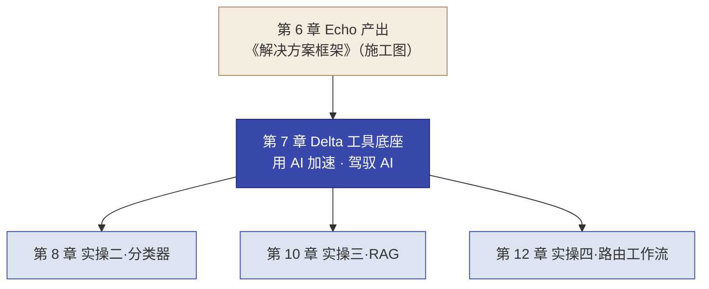
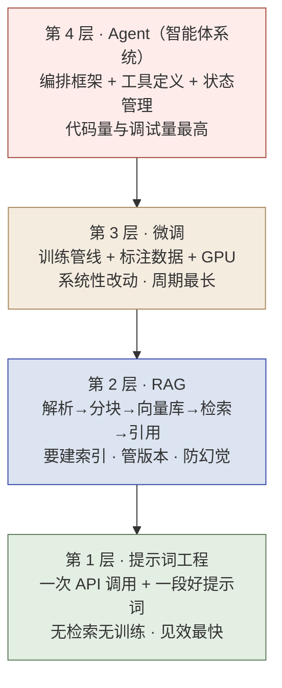
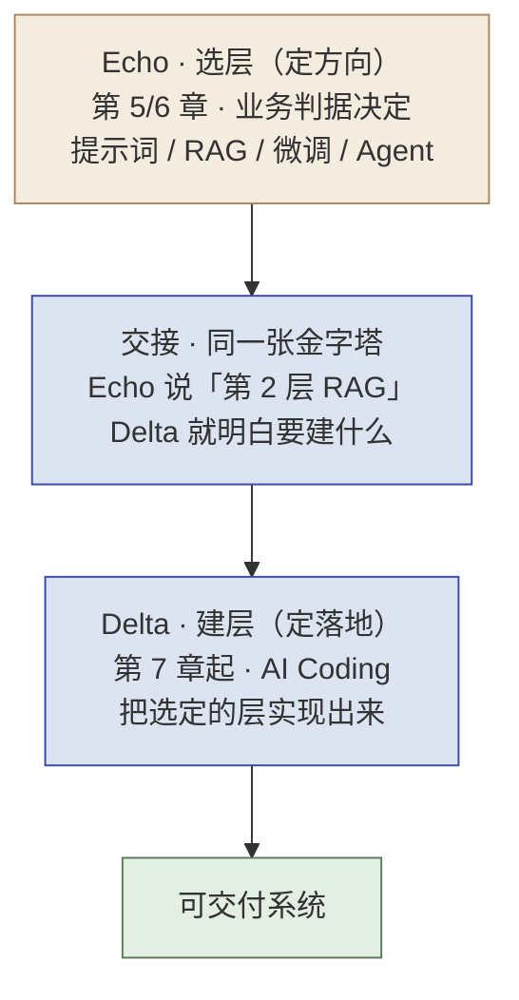
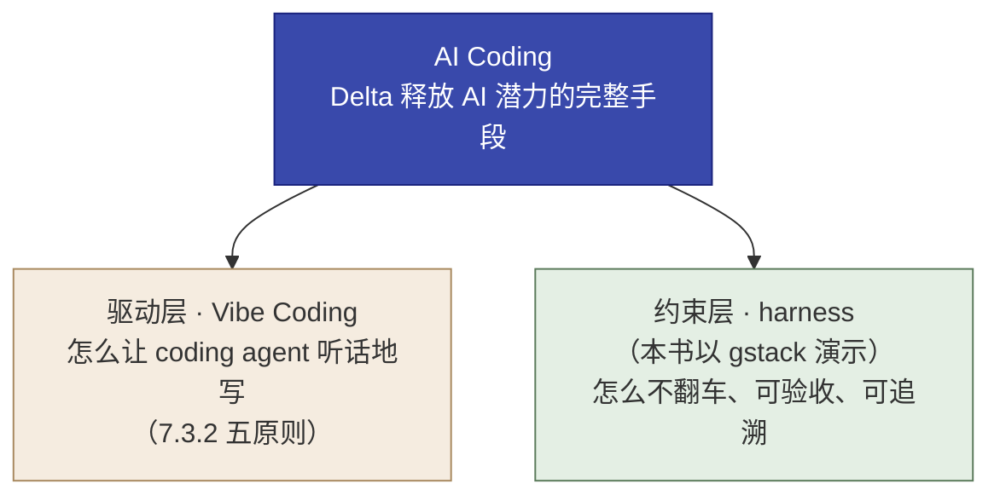
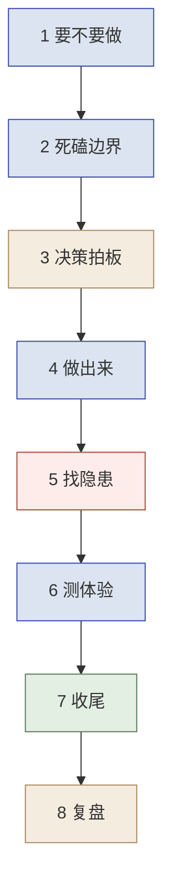

# 第 7 章  Delta 工作法 · AI Coding 与工程纪律

> **本章定位：** 知识 + 工具单元 · Delta 侧方法，同时是第 7–12 章的**认知与工具公共底座**（接续第 6 章《解决方案框架》施工图，进入 Delta 施工）。**本章主线：Delta 用 AI Coding（coding agent × harness，本书以 gstack 演示）把 Echo 选定的技术层落地为可交付系统。**
> **本章产出：** 你能说出 FDE 为什么需要 AI、Delta 如何用 AI 加速并驾驭 AI；用 LLM 四层级金字塔给客户场景选对技术层（模型选型与私有化部署见第 13 章 13.1 / 13.2）；掌握 **AI Coding 的两半**——Vibe Coding 五原则（驱动层）与 harness 约束层（本书以 gstack 演示）——及 AI Coding 工具选型；会用 gstack 八环节 + SPEC 驱动 + **四条工程纪律**推进一次开发迭代；知道 15 分钟最小 gstack 演练怎么走；知道动态信息（模型 / 硬件在 13.5、工具 / 价格在 7.3.3 / 7.3.4、harness 生态与环境在 7.6）统一去哪里查。
> **建议读者：** Delta（施工主力必读）与 Echo（选型需双角色共识）均适用。
> **前置：** 第 4 章（Echo/Delta 分工哲学）、第 6 章（已产出《解决方案框架》——交付给 Delta 的施工图）。
> **适配说明：** 本书以 opencode + gstack 为默认演示（训练营同款）；主流 AI Coding 工具（Claude Code、Codex 及国内 WorkBuddy/Qoder/Trae 等）通常可替换，理解流程纪律比死记命令更本质。**模型 / 硬件动态数据见第 13 章 13.5 速查；AI Coding 工具与订阅价格见 7.3.3 / 7.3.4 表格，harness 生态与环境见 7.6 速查**，信息截至 **2026 年 8 月**，落地前以各厂商官方资料复核。

---

## 本章导学

- **学习目标：**
  1. 说出 FDE 为什么需要 AI（三个产能瓶颈），以及 Delta／Echo 为何都要具备"获得 AI 赋能 + 驾驭 AI"的视野；
  2. 用 Delta 视角的金字塔（7.2）看懂"**选定之后每一层要建什么、代价多大**"（选层主导在 Echo，见第 5 章 5.7）；
  3. 说出 **AI Coding 的两半**（Vibe Coding 驱动 × harness 约束，本书以 gstack 演示）与 AI Coding 工具选型逻辑（工具清单与价格见 7.3.3 / 7.3.4）；
  4. 按 gstack 八环节 + SPEC 驱动 + **四条工程纪律**推进一次迭代，说出每环节人的职责；
  5. 完成 15 分钟最小 gstack 演练，并说出"数据与评测证据独立、可追溯、可复现"（纪律四）的要求。
- **前置知识：** 第 4 章（人能判断、AI 能执行）、第 5 章（能力金字塔/选型）、第 6 章（解决方案框架）。
- **章节地图：** 第 6 章 Echo 出《解决方案框架》(施工图) → **本章（工具底座）** → 第 8/10/12 章 Delta 逐章施工。本章是第 8/10/12 三个施工实操共享的方法论。


*图 7-1：本章是第 8/10/12 章三个施工实操共享的工具底座*

> **阅读路线提示：** 主线必学 = 7.1 → 7.2 → 7.3.1 → 7.3.2 → 7.4 → 7.5（含 7.4.5 演练）；**动态速查** = 7.6（harness 生态 / 环境；模型与硬件速查见第 13 章 13.5、工具价格见 7.3.3 / 7.3.4，随官方资料更新，不是考点，知道去哪查即可）。

---

## 7.1 为什么 FDE 需要 AI：主动拥抱、更要会驾驭

> 本书第 4 章确立了分工哲学：**人能判断、AI 能执行**。本章把它落到 Delta 侧——不只是"用 AI 加快写代码"，而是理解**FDE 在 AI 时代为什么必须主动采用 AI，又为什么必须能驾驭 AI**。

### 7.1.1 先把 FDE 放回 PPT 与四阶段

一次交付三要素 **PPT（People–Process–Technology）**：People 是根、Process 是脉、**Technology 是器**。Delta 的 AI 干活能力，正是 **Technology（器）** 这一维在当前 AI 时代的重写——工具变了，但判断在人不变。

再看交付的四阶段（Discovery → Prototype → Build → Scale）。Delta 的主导段落在 **Prototype（双角色）→ Build（主导）→ Scale（自运营 + 回注）**，也就是"把施工图做成能跑的 Demo、系统，并沉淀回注"。**AI 赋能 Delta，本质是赋能这三个阶段的产能。**

### 7.1.2 Delta 的价值从哪来

Delta（对标 Palantir Delta / FDSE，技术执行工程师）是驻扎客户现场的"全栈特种兵"。它的价值不是"写了多少行代码"，而是三者的乘积：

**交付速度 × 交付质量 × 可复用性（能力回注）**

日常时间分配（参考，承前）：**70% 编码与系统构建 / 20% 客户沟通与联调 / 10% 能力回注记录**。其中最后的 10% 不是可选项——不做回注，Delta 就退化成"会写码的外包"（呼应第 1、2 章的"卖人力 vs 卖能力"）。

### 7.1.3 FDE 项目的高质量卡在哪：Technology 维度的三个产能瓶颈

"客户要在有限时间内做出高质量、能复制的东西"，卡在三个结构性瓶颈上：

| 瓶颈 | 现象 | 若不解决 |
|------|------|---------|
| **时间瓶颈** | 客户现场时间有限，Prototype/Build 两段要几周内从零做出"可演示 + 能上生产的最小系统" | 传统手写来不及，Demo 难产 |
| **广度瓶颈** | 一个 Delta 要覆盖数据管道、后端、前端、AI 集成、部署，人力不可能全栈精通 | 团队依赖极少数"全能手"，不可复制 |
| **复用瓶颈** | 能力回注四步法（识别→抽象→集成→验证）要求把"本次经验"变成"下次可复用资产" | 纯手工做识别与抽象，成本高，易退化回"卖人力" |

> 这三者都落在 PPT 的 **Technology（器）** 维度，集中在四阶段的 **Prototype/Build** 段——恰是 Delta 的主战场。

### 7.1.4 立两个方向，避免两种偏差

面对 AI，FDE 容易滑向两个极端：

- **偏差一「AI 万能论」**：以为有了 AI，就不再需要懂业务、懂现场的工程师。**错。** AI 解决"写得快"，不解决"知道该写什么、写出来有没有人用"——而后者正是 FDE 的核心价值。
- **偏差二「AI 与己无关」**：以为 FDE 的活（数据管道、异构集成、现场推动）AI 碰不到。**错。** AI 正系统性地吃掉 FDE 工作里**最可标准化、最重复**的部分。

> **结论：** AI 放大 FDE 的"复合能力"——让懂业务的人写代码更快、让写代码的人更快理解业务。它不改变 FDE 的定位（把非标痛点转化为平台能力），但**重新定义产能瓶颈**。这也就是本章的主旋律：**主动采用 AI，同时驾驭 AI。**

### 7.1.5 角色演变：Delta／Echo 都要"获得 AI 赋能 + 驾驭 AI"

在 AI 时代，FDE 的工作从"写每一行代码"转向"**写关键的代码 + 编排 AI 干重复的活 + 把关 AI 的产出**"——这正是第 4 章"人能判断、AI 能执行"在施工侧的具体化。

| 能力 | 谁负责 | 内容 |
|------|--------|------|
| **判断（前脑）** | 人 | 挖真需求、做取舍、定验收口径、审查 AI 产出对错、拍板 |
| **执行（后手）** | AI + 人在 checkpoint 把关 | AI 跑流程、写样板代码、做重复任务；人审定方向与质量 |

- **对 Delta（本章主体）**：既要有"**获得 AI 赋能**"的能力（会用 coding agent 交付），也要有"**驾驭 AI**"的能力（懂选型、能防翻车、守质量闭环）。
- **对 Echo（点到，呼应第 5/6 章）**：获得 AI 赋能与驾驭 AI 同样重要——Echo 用 AI 做访谈分析、痛点聚类、方案速读提速，同时要审 AI 洞察是不是"真痛点"，不被 AI 的"看似合理"带偏。Echo 侧重"判断"，但也要会用 AI 工具提效。

> **由此引出本书的两种训练模式**（承第 4 章）：Echo 侧判断型实操（Ch6/Ch16）**关键判断不用 AI**（AI 仅可辅助整理/润色/红队），练判断力；Delta 侧实操（Ch8/10/12）用 opencode + gstack，练施工力。**"人会判断、AI 会执行"是 FDE 交付的核心引擎**，本章教 Delta 如何驾驭这一引擎。

**接力叙事：Echo 定方向 → Delta 定落地。** 第 5/6 章 Echo 用 LLM 能力金字塔为每个场景"选层"（该用提示词、RAG 还是 Agent——这是**方向**决策）；Delta 从本章开始"建层"——用 **AI Coding** 把选定的那一层真正建出来（这是**落地**方式）。"人能判断、AI 能执行"落到施工侧，就是这一棒接力：**方向由 Echo 的判断力定死，落地由 Delta 的 AI Coding 完成**；而金字塔既是分工的**分界线**（Echo 选、Delta 建），也是协作的**契合点**（双方对着同一张图说话，交接零损耗）。

**反模式预告：** 把"用 AI"当"让 AI 全自动"（见 7.5 纪律三）；把 AI 当万能、或与己无关（见 7.1.4）。

---

## 7.2 LLM 能力四层级金字塔：Echo 选层、Delta 建层

Echo 已在第 5/6 章用金字塔为每个场景"**选层**"（该用哪一层 AI，方向已定，业务判据见第 5 章 5.7）；Delta 的"**建层**"从这里开始——把选定的那一层实现出来。本节的 **Delta 视角金字塔**回答两件事：每一层要建什么、代价多大（图 7-2），以及"从最简单开始"对施工的含义。

### 7.2.1 Delta 视角的四层级金字塔


*图 7-2：LLM 四层级能力金字塔——Delta 视角：每一层要建什么、代价多大*
（本图与图 5-2 互补：**图 5-2 由 Echo 用业务判据回答"该不该用这层"**，本图回答"**选定之后 Delta 要建什么、付出什么代价**"；使用优先级永远是"从第 1 层开始"。）

### 7.2.2 逐层：工程形态与代价

| 层级 | 实现形态（Delta 要建什么） | 工程代价 | 验收方式 |
|------|--------------------------|---------|---------|
| **1 提示词工程** | 一次 LLM 调用 + 一段好提示词（含 7 项信息块） | 最低：无检索、无训练、无索引 | 分类 / 抽取准确率（第 8 章） |
| **2 RAG** | 解析→分块→向量化→向量库→检索→来源引用 | 中：要建索引、管版本、防"检索不到就编" | 答案准确率 + 来源可追溯率双指标（第 9/10 章） |
| **3 微调** | 训练管线：标注数据 + GPU + 训练/评测迭代 | 高：系统性改动，数据与算力门槛（13.2/13.3） | 评估集指标 + 领域行为稳定性（第 13 章） |
| **4 Agent（智能体系统）** | 编排框架（如 LangGraph）+ 工具定义 + 状态与权限管理 | 最高：调用次数不定、失败点多、需 HITL 兜底 | 端到端轨迹 + 敏感件零漏判（第 11/12 章） |

> **选层判据不在这里重复：** 该用哪一层是业务判断（Echo 视角），见第 5 章 5.7 的选型三问与决策矩阵；本表只讲"选定之后 Delta 怎么建、代价多大"。另外注意：**本章 7.5 说的"coding agent"是帮你写代码的开发工具；上表第 4 层的"Agent（智能体系统）"是要交付给客户的技术方案——同名不同物，别混淆。**

### 7.2.3 "从最简单开始"的施工含义

> **能用提示词解决的不上 RAG，能用 RAG 解决的不微调，能用 Workflow 实现的不上 Agent。** 对施工者（Delta）这条纪律意味着：**先做最小验证**——用最小 Demo 确认"简单的那层够不够"；升级必须带**证据**（哪里不够：溯源缺失？准确率不达标？需要多步决策？量化差距），而不是"感觉不够"。FDE 的价值不是堆技术复杂度，而是**用最低复杂度交付客户需要的价值**。

这点在后续章节反复出现：第 8 章分类器走提示词（第 1 层）、第 9–10 章 RAG（第 2 层）、第 11–12 章 Agent（第 4 层）——实操坡度 = 金字塔逐层实践，但每次都先问"更简单的那层够不够"。

> **金字塔 = Echo 与 Delta 的分界线与契合点：** Echo 在第 5 章用金字塔"选层"（业务判据，定方向），Delta 在本章起"建层"（工程实现，定落地）——分工以金字塔为界；但双方对着**同一张金字塔**说话：Echo 说"场景 B 用第 2 层 RAG"，Delta 就明白要建"解析→分块→向量库→检索→引用"管线。**选层与建层，是同一张图的两半。**


*图 7-3：接力——Echo 选层定方向，Delta 建层定落地，金字塔是交接接口*

---

## 7.3 AI Coding：Vibe Coding 驱动 × harness 工程约束

执行要靠 coding agent 承载。把"AI Coding"拆成两半：

- **驱动层 · Vibe Coding（7.3.2）**：怎么跟 coding agent 说话——从"手写每一行"转向"描述意图 + 审查判断"（vibe coding 一词由 **Karpathy 于 2025 年 2 月提出**，[IBM 主题介绍](https://www.ibm.com/cn-zh/think/topics/vibe-coding)）。它解决"**怎么让 coding agent 听话地写**"。
- **约束层 · harness（7.4 / 7.5）**：把 AI 开发焊进工程流水线——受控执行、八环节、SPEC、四条纪律。它解决"**写了之后怎么不翻车、可验收、可追溯**"。

**为什么 Vibe Coding 要升级成 AI Coding？** 光有驱动层、没有约束层，就是"裸 vibe"——coding agent 写代码很快，但没有 SPEC 和测试纪律，交付不可验收、不可追溯，翻车概率高（7.5 的四条纪律就是防这个）。**AI Coding = Vibe Coding（驱动） + harness（约束，本书以 gstack 演示）**，两个合起来，才是 Delta 释放 AI 潜力的完整手段。


*图 7-4：AI Coding 的两半——驱动层（Vibe Coding）× 约束层（harness，本书以 gstack 演示）*

### 7.3.1 coding agent：定义、分类与共性

coding agent（AI 编码代理）是驱动层的载体——**你把意图描述给它，它写代码、跑测试、改文件，你在旁边审查把关**（怎么驱动它见 7.3.2 Vibe Coding 五原则）。先分清两个概念，别混成一类：

| 概念 | 是什么 | 例子 |
|------|--------|------|
| **coding agent（工具类）** | 一类 AI 编码工具：厂商绑定或独立开源，纯 coding 或全能型 | Claude Code、Codex、opencode；Trae、Qoder、WorkBuddy |
| **harness（方法/产品类）** | 把 coding agent 的产出约束进受控工程流程（流水线、护栏） | gstack（本书演示）、OpenSpec、LangGraph |

**coding agent 怎么分类：**
- **按归属**：厂商绑定（Claude Code 属 Anthropic、Codex 属 OpenAI）vs **独立开源**（opencode：模型无关、不绑定大模型厂商）；
- **按能力侧重**：纯 coding（Codex、CodeGeeX）vs **全能型**（编程 + 办公双线：Trae、WorkBuddy、千问办公）；
- **按形态**：CLI agent（Claude Code、opencode）／ IDE 助手（Trae、Qoder）／ 平台智能体（WorkBuddy、千问办公）。

**共性（海内外都一样）：** 无论厂商绑定还是独立开源、无论纯 coding 还是全能型，coding agent **除了本身能力，都通过"技能 / 插件（Skills / Plugins）"获得增强能力**——Anthropic 于 2025 年 10 月发布 Agent Skills 开放标准（SKILL.md：技能目录 + 按需加载，[官方博客](https://claude.com/blog/skills)），Claude Code 首发，Codex、opencode、Gemini CLI 等陆续支持；国产工具也各有插件 / 技能生态（具体工具见 7.3.3 / 7.3.4）。

### 7.3.2 Vibe Coding 五原则

| 原则 | 核心 | 反例 |
|------|------|------|
| **描述意图** | 说你要什么结果，不说怎么实现 | "调用 xxx 库的 chat 接口"——你在替 AI 做技术决策 |
| **给足上下文** | 显式给项目背景、技术栈、约束 | "帮我写个数据导入脚本"——AI 不知道你的 schema |
| **分步迭代** | 框架→核心→辅助，每步验证 | 一次描述整个系统，出错重来代价大 |
| **逐行审查** | 读懂 AI 生成的每一行，找逻辑/安全/边界 | "大概看懂了"——不是把责任交给 AI |
| **用 AI 解释** | 看不懂就让 AI 解释，这是最快学习路径 | "不敢改"——AI 时代的障碍消失了 |

> 最关键的是**逐行审查**与**描述意图**——它们共同保证"是人在驾驭 AI，不是 AI 替人做主"。

### 7.3.3 海外 coding agent

| 工具 | 定位 | 关键能力 | 订阅（动态，以官网为准） |
|------|------|------|------|
| **Claude Code** | Anthropic 官方 Agentic CLI | 终端自主编码；Skills/Subagents/Auto Mode；MCP；可叠 gstack | $20 / $100 / $200 三档 |
| **Codex / Codex CLI** | OpenAI coding agent 产品族 | 云沙箱改码跑测提 PR、Automations、Subagents | Free / $8 / $20 / $100 档位 |
| **opencode** | **独立开源终端 agent**（sst 团队） | **模型无关**：可接任意模型提供商；本地运行；支持 Skills；可叠 gstack | 免费开源 |

> **绑定 vs 中立：** Claude Code / Codex 绑定各自厂商模型生态（Anthropic / OpenAI）；**opencode 独立开源、与大模型厂商不绑定（模型无关）**——本书默认演示选 opencode，正是看中它的中立性 + 可接国产 / 本地模型（呼应"数据不出域"红线）。价格截至 2026-08（[Claude Code Pricing](https://www.morphllm.com/claude-code-pricing)、[Codex Pricing](https://www.morphllm.com/codex-pricing)），订阅结构会变，落地前以官方页为准。**工具清单与最新定价以官网为准（海外见本表，国内见 7.3.4）。**

### 7.3.4 国内 AI Coding 工具生态

国内工具的共同主张是**模型国产化 + 企业内网 + 数据不出域**——正好呼应本书四条红线中的"数据不出域"，也补上了海外工具"境外服务/合规"的短板。

| 工具 | 定位 | 关键能力 | 生态 / 订阅（价格，动态） |
|------|------|---------|--------------------------|
| **Trae（字节）** | 全能型（编程 + 办公双线） | IDE 助手 + 智能体；国内直连可用 | 免费版 0元/月 / 速通 Pro 99元/月 / 速通 Ultra 699元/月 |
| **Qoder（阿里）** | 编程为主 | 代码补全 / 对话 / 智能体 | 社区版免费 / 专业版 59元/月 / 旗舰版 559元/月 |
| **WorkBuddy（腾讯）** | 办公为主 + 编程 | 办公智能体 + 代码能力 | 体验版免费 / 标准版 99元/月 / 旗舰版 999元/月 |
| **CodeGeeX 系（智谱）** | 编程 | 代码补全 / 生成（开源系） | 个人免费；Coding Plan Pro 149元/月起 |
| **千问办公 / 豆包办公** | 办公线 | 文档 / 表格 / 工作流智能体 | 千问高级会员 19元/月；豆包标准版 68元/月 |

> **价格为各档位代表值，信息截至 2026-08（公开渠道）；各厂商会不定期调价 / 促销，落地前以各产品官网实时显示为准**；[办公智能体赛道各厂商已完成排兵布阵（2026-08 行业分析）](https://finance.eastmoney.com/a/202608123839168388.html)。

### 7.3.5 怎么选工具

1. **能否连境外服务？** 不能/内网 → 国产工具或自部署开源；能 → Claude Code / Codex / opencode 也可用。
2. **编程为主还是办公为主？** 编程 → CLI agent / IDE 助手；办公 → 千问办公 / 豆包办公 / WorkBuddy。
3. **数据合规要求？** 内网/不出域 → 国产 + 自部署开源模型。

> **工具是手段，纪律是根本。** 无论你用 Claude Code、Codex、opencode，还是 WorkBuddy/Qoder/Trae，"描述意图 → AI 执行 → 人把关 → 质量闭环"这套纪律不变——这正是 7.4 / 7.5 要建立的。

---

## 7.4 harness：从理念到 gstack 实现

coding agent 解决"怎么写"，harness 解决"怎么不翻车"。

### 7.4.1 harness 理念：把 AI 执行约束进工程流程

harness（AI 开发工程化流水线 / 护栏）是把 coding agent 的产出约束进受控工程流程的方法与产品——它规定 AI 写出来的东西**怎么被验证、怎么被记录、怎么被人把关**。没有 harness，coding agent 只是"写代码很快"（裸 vibe）；有了 harness，才谈得上可验收、可追溯、可交接。

**为什么需要它（三个翻车点，对应 7.5 四条纪律）：**
- coding agent 可能**自己出题自己考**（自己造测试数据）→ 需要外部给定测试集；
- coding agent 可能**自由发挥**（脑补场景、发明验收口径）→ 需要 SPEC 写死边界；
- coding agent 可能**一把梭**（一口气跑完才汇报）→ 需要一环一停、人拍板。

**通用原则（产品无关，任何 harness 都应满足）：**
- **受控执行**：环节化推进，每环节停下给人审查；
- **外部验证**：测试与评测数据外部给定，不让 AI 自己定义成功；
- **可追溯**：每环节产出落盘（文件、版本、决策记录）；
- **人机回环**：拍板点（验收口径、兜底策略）由人决策。

harness 是当前 AI 工程的主流方向，不是本书自造的概念——Anthropic 于 2025 年 11 月发布《Effective Harnesses for Long-Running Agents》，系统化论述长期运行代理的 harness 设计（状态持久化、检查点、重试 / 幂等、中断恢复）；OpenAI、微软（Magentic-One）、DeepSeek（Agent Harness）等头部厂商都在押注这一层（[中文综述：全网最详细 Agent Harness 综述](https://hub.baai.ac.cn/view/55145)、[Harness 工程 SOTA 综述（英文）](https://github.com/swift-institute/Research/blob/main/agent-harness-engineering-state-of-the-art.md)）。

### 7.4.2 SPEC 驱动：harness 的通用规范

任何 harness 的第一条通用规范：**动手 build 之前，先写死一份规格（SPEC）**，build 阶段不再重复讨论技术参数，只严格按 SPEC 实现。SPEC 是"代码的压缩表示"——把意图写死，AI 才不会自由发挥（Spec-Driven Development，SDD；OpenSpec 等工具即此思路，与具体产品无关）。

一份好 SPEC 要死磕清楚：
- **边界（No-Go）**：明确"本阶段刻意不做的事"——防止 coding agent 自由发挥；
- **数据模型**：输入/输出的形状、字段、类型；
- **验收口径**：什么样算成功（如"准确率 ≥85%"可量化指标）——防止 coding agent 自己发明验收。

> **为什么先写规格？** build 不重复技术参数，能避免 coding agent 在施工中反复问、反复改方向。SPEC 写死了，build 就是执行——这正是"施工力"和"随意写代码"的区别。

### 7.4.3 工程流水线：harness 的通用骨架

第二条通用规范：**把质量闭环组织成环节化流水线**——每个环节有明确产出、人在每环节把关。环节怎么划分与工具无关，任何 harness 都围绕同一套骨架：


*图 7-5：工程流水线的通用骨架——八环节，一环一停，人在每环节把关*

| 环节 | 干什么 | 你的角色（人的判断不可替代） |
|------|--------|--------------------------|
| **1 要不要做** | 想清楚该不该做、确认需求和范围 | **提问者**（答疑数据/口径） |
| **2 死磕边界** | 死磕成精确规格：失败模式、No-Go、数据模型、验收口径 | **追问者**（审查 No-Go 具体吗） |
| **3 决策拍板** | 暴露"两可决策"供你拍板（只列选项，不替你决定） | **决策者**（真的拍板） |
| **4 做出来** | 按 SPEC 实现，每模块即测 | 审查者（抽查没偏离 No-Go） |
| **5 找隐患** | 找"能跑但会出事"的隐患，P0–P3 分级 | 审查者（确认 P0/P1 修复） |
| **6 测体验** | 真实跑核心流程 + 边界输入 | 验收者 |
| **7 收尾** | 版本号 + CHANGELOG + README + commit | 收尾者（确认 .env 未入库） |
| **8 复盘** | 复盘：做得好/摩擦/未覆盖测试/改进行动项 | 复盘者 |

**三个关键原则：**
- **人的角色每环节不同**，但任何环节人的判断都不可替代。
- **每环节产出都是文件**（需求记录 / SPEC.md / 决策记录 / 代码 / review.md / qa-report.md / 版本与 CHANGELOG / retro.md）——可追溯、可复用（也是第 8/10/12 章"逐轮复用上一轮 AGENTS.md/retro.md"的基础）。
- **不必所有改动都走全流程**——判断标准：**做错代价大不大、会不会被别人用、会不会长期存在**。会被坐席长期使用的系统 → 走完整流程。

> **来源声明（教材提炼）：** 这套八环节骨架是本书训练营**基于 gstack（Garry Tan 开源）命令链提炼、结合自身实践磨合**的教材框架——它符合 harness 的通用规范（受控执行、外部验证、可追溯、人机回环），在实践中有效，但**不是 Palantir 或其他大厂的官方流程**（Palantir 的交付方法论见 **FDE-101** https://www.cloudzun.com/fde-course/（第 5–9 章：四阶段与能力回注方法论））。落地时按团队现有流程裁剪即可，不必照搬环节名称。

### 7.4.4 gstack：harness 的一个开源实现

本书演示的工具是 **gstack**——Garry Tan（YC CEO）开源的 AI 开发工作流框架，官方口径是"**23 个 opinionated tools**"（[GitHub: garrytan/gstack](https://github.com/garrytan/gstack)，把单次 AI 会话扩成"虚拟团队流水线"）。**gstack 只是 harness 类里的一个具体开源实现**——就像 opencode 只是 coding agent 类里的一个工具：gstack 并不代表整个 harness 类别。本书教学统一用 opencode + gstack 演示，是为了"一套能跑通"；实践中 coding agent 与 harness 的选型（甚至自建流水线）可以很灵活——纪律（7.5）比工具更重要。

**gstack 把通用八环节落成命令**（本书沿用训练营的**八环节提炼**——注意："八环节"是对官方 23 tools 主干命令链的教材归纳，非官方编号；落地以官方仓库为准）：

| 环节（通用） | gstack 命令 |
|------|------|
| 1 要不要做 | `/office-hours` |
| 2 死磕边界 | `/spec` |
| 3 决策拍板 | `/autoplan` |
| 4 做出来 | 自然语言（build） |
| 5 找隐患 | `/review` |
| 6 测体验 | `/qa` |
| 7 收尾 | `/ship` |
| 8 复盘 | `/retro` |

**gstack 支持跨 agent 运行**——官方提供接入不同 host（agent）的机制，Claude Code、Codex、opencode 等都可作为 host 跑同一套 gstack 流程；这是 harness"方法不绑定工具"的另一面。

### 7.4.5 最小 gstack 演练：15 分钟可选动手

> 目的不是产出真实系统，而是**把八环节的节奏"跑一遍手感"**——尤其体会"一环一停、拍板点列选项"为什么能防失控。

- **素材**：任意一个小微任务即可（如"写一个读取 CSV 并输出分类计数的脚本"）。
- **压缩走查**：
  1. **office-hours（1 分钟）**：只问 2 个边界问题（输入文件从哪来、输出给谁用）；
  2. **spec（5 分钟）**：写下 No-Go（"不做界面、不处理异常文件"）+ 验收口径（"对 10 行样例输出正确计数"），3 行以内；
  3. **build（7 分钟）**：让 coding agent 实现最简版本，逐行读一遍它给的代码；
  4. **retro（2 分钟）**：一句话复盘（哪里摩擦最大、下次怎么补）。
- **演练要求**：刻意练习"走完一环停下汇报、获许可再流转"；**15 分钟到点即停**，没走完的环节写进 retro 即可。
- **环境未就绪的替代**：用"纸上推演版"——在便签上写出每个环节该产出什么文件、谁拍板，同样能建立节奏感，不阻塞主线（完整环境命令见 7.6.2）。

---

## 7.5 四条工程纪律：驾驭 AI Coding，防止翻车

AI Coding（coding agent × harness，本书以 gstack 演示）是 Delta 释放 AI 潜力的手段，但**驾驭不当就会翻车**——翻车的不是 coding agent 工具，而是"裸 vibe、全自动一把梭、自己出题自己考、跳过 SPEC"这类**驾驭方式失当**。四条纪律把"驾驭 AI Coding"落到实处——质量闭环不被 AI 的"自洽"击穿；它们在第 8/10/12 章逐章落实。

### 纪律一 · 测试数据必须外部给定

把固定的测试数据直接写进启动提示词、让 coding agent 落盘成 CSV，并明确"**不得自行改动或重新生成**"。**防止 coding agent 自己出题自己考**——否则验收无意义。

### 纪律二 · 启动提示词写清"信息块"，不留白让 coding agent 猜

一份高质量启动提示词要包含这 7 项，每项给出确定内容：

| # | 信息块 | 为什么必须有 |
|---|--------|------------|
| 1 | 背景与角色 | 缺了，coding agent 自己脑补客户和场景 |
| 2 | 要做什么 | 缺了，coding agent 发明错误的接口 |
| 3 | 输入输出 | 缺了，无法验收 |
| 4 | 技术选型（含理由） | 缺了，coding agent 可能又问你要不要用 RAG |
| 5 | 数据现状 + 测试集 | 缺了，coding agent 可能走传统 ML 死路 |
| 6 | 验收口径 | 缺了，coding agent 自己发明一套验收 |
| 7 | 约束与边界 | 缺了，coding agent 自由发挥 |

> **写启动提示词的本质**：假设一个完全不熟悉项目的人来接手，他需要知道什么才能"不重开讨论、直接开干"？——场景的边界、数据、选型理由、验收口径都要写死。**coding agent 是最"难伺候的新人"，不是会猜的专家。**

### 纪律三 · 驱动指令把流程纪律"焊"进 coding agent 执行

注入启动提示词时，明确要求 coding agent 按 gstack 八环节逐步执行、**禁止全自动**（走完一环必须停下汇报、获你明确许可才流转）、**拍板点列选项等你选**、环节产出文件落盘、从 office-hours 开始。参考驱动指令：

```text
/office-hours
我是一名 FDE 团队（Delta 角色），需要启动【场景】的施工。
【粘贴你的启动提示词，含 7 项信息块】
请按 gstack 标准开发流程执行，严格遵守：
1. 依次走完 8 个环节：office-hours → spec → autoplan → build → review
   → qa → ship → retro，顺序不跳、不简化；
2. 每个环节产出对应文件，落盘当前目录；
3. 禁止全自动：走完一环先停下汇报，获许可再流转；
4. 拍板点（验收口径/门槛/兜底）列出选项与利弊，等我选择；
5. 现在从 office-hours 开始。
```

> **为什么"一环一停、拍板点列选项"如此关键？** 如果让 coding agent 一口气把 8 环节全跑完、代码写完了才告诉你，你就失去了所有**中途纠偏**的机会，只能事后全盘检查。真实 FDE 项目里，让 AI"一小步一确认"不是效率低，而是**把失控风险控制住**。

### 纪律四 · 数据与评测证据必须独立、可追溯、可复现

纪律一保证了"外部给测试集"，但还不够——**整条数据与评测链路的证据都要独立、可追溯、可复现**，否则验收数字没有可信度：

| 维度 | 要求 |
|------|------|
| **来源与授权** | 数据从哪来、有无授权记录（政策文档出处、标注人的依据），不凭"不知道哪来的文件" |
| **标签规范** | 标注规则成文、检查一致性（多人标注时记录一致性），不能"各标各的" |
| **开发/盲测隔离** | 调 Prompt、阈值、规则**只用开发集**；验收集（盲测集）在 Prompt 冻结后才使用，标签由讲师或评分脚本持有 |
| **版本与血缘** | 数据集带版本号、生成脚本、改动记录（对应 gstack"每环节产出文件落盘"） |
| **评测污染** | 评测集不得出现在训练、提示词或检索上下文中——coding agent 不能"见过答案" |
| **漂移与回流** | 上线后记录线上分布与评测分布的差异，设计反馈回流路径 |

> **反模式：** 把"开发集调出的结果"当"最终验收结果"上报；偷偷改了测试数据却说没改；评测文件没有版本、说不清谁改过——这些都会让验收失去意义（第 8/10/12 章将用"盲测集验收"把这条纪律落地）。

---

> **实操四B（Lab4B）的工程纪律（预告）：** 无编号附加高级实验"西岭市民服务协同 Agent"同样基于 gstack，但它**从头构建独立项目、不复制第 8/10/12 章代码**；复用的是上一轮沉淀的**知识、数据与工具契约**（`classify_request` / `search_policy` / `query_department`）。实验五条纪律：1）独立项目、承接知识不承接代码；2）先做 MVP 核心轨迹——至少两条不同任务走不同路径、信息不足会追问、敏感会交还给人；3）不一步到位（工具冲突、故障注入、复杂评分、生产级安全放迭代挑战）；4）界面达毕业展示标准（不得以未设计的默认 Streamlit 页交付）；5）gstack 一环一停、每环有产出。课程中实操四B 不要求全员必做（可课后完成），手册见《实验手册》`labs/lab4b-cooperative-agent.md`。

## 7.6 动态速查与环境

> 本节是**动态速查**，不是主线必学——正文需要时知道"去哪查"即可。所有条目信息截至 **2026 年 8 月**，均标注来源；**型号、价格、配置会持续变化，落地前请以各厂商官方资料复核。** 本表由编写组随版本维护（对应"信息截至 YYYY 年 MM 月"标注纪律）。
>
> **来源纪律（教材要求）：** 速查条目的型号、参数与许可证**必须**以厂商官方页（模型卡 / 官方文档 / 开源仓库）为准，媒体与聚合站只作线索。本表来源已全部换为官方页；"信息截至 2026-08"标注不替代发布前对官方最新页的复核。

### 7.6.1 工具与 harness 生态速查

**coding agent 工具清单与价格见 7.3.3 / 7.3.4 表格**（各档位代表值，落地前以各产品官网实时显示为准）。

> **harness 工具生态（约束层，非订阅制，随官方资料维护）：** gstack（Garry Tan 开源，工作流流水线，[GitHub: garrytan/gstack](https://github.com/garrytan/gstack)）· OpenSpec（Spec-Driven 开发）· LangGraph（编排框架）· Magentic-One（微软开源通用代理 harness）· DeepSeek Agent Harness（开源）· Harness.io（企业平台：AI 安全流水线）。本书以 gstack 演示（7.4.4）；各条目以官方发布为准（信息截至 2026-08）。

> **工具是手段，纪律是根本**（正文 7.3.5 / 7.4 / 7.5）：换工具不换纪律；本节只负责任何时候都能查到"当下有哪些可选项"。

### 7.6.2 环境与工程

- **版本锁定**：随书资源包提供 `resources/environment/requirements-lock.txt`（依赖锁定清单，随资源包交付）；
- **环境自检**：`resources/environment/environment-check.md`——安装、启动、验收前先跑自检；
- **排障**：`resources/environment/troubleshooting.md`——常见报错与处理；
- **方法论**：命令是手段，**验收与排障的判断逻辑在 7.5 四条纪律**（外部测试集、信息块、驱动指令、数据与评测证据）；
- **说明**：资源包随实操资源轮次补齐；在书到货前，学员可用 7.4.5 的"纸上推演版"先练节奏。

---

## 反模式与红线

- **让 coding agent"全自动"一把梭、不设 checkpoint。** 你会失去所有中途纠偏机会（7.5 纪律三）。
- **coding agent 自己出题自己考。** 测试数据要外部给定，不能让它自己造（纪律一）。
- **把开发集当验收集。** 调参只用开发集，验收用盲测集；"开发集调出来的数字"不是最终验收数字（纪律四）。
- **把决策权丢给 AI（"你看着办"）。** 拍板点必须你决——只有你掌握第 6 章定的验收口径。
- **跳过 SPEC 直接 build。** 会退化成"随意写代码"，coding agent 反复改方向、无法验收。
- **裸 vibe、不上 harness。** 只用 coding agent 聊天式写码、不走 gstack 八环节与 SPEC，交付不可验收、不可追溯——"从最简单开始"不等于"从最随意开始"（7.4 / 7.5）。
- **把 .env / API key 提交进版本库。** API key 走环境变量、不硬编码、不入库。
- **忽略"数据不出域"硬上公网 API。** 政企客户数据不能出域时，要本地私有化部署（第 13 章 13.2）。
- **过度堆技术层。** 能提示词却上 RAG/Agent（智能体系统），违背"从最简单开始"（7.2.3）。
- **把"待核验"当正文。** 动态型号、价格、参数一律查 7.3.3 / 7.3.4 / 13.5 速查（标注"信息截至 2026-08，以官方资料复核"），不把未核实数字写进交付物。

> **本书红线（技术侧落地）：答案可追溯、敏感件零漏判** 都要在 SPEC 的验收口径里写死（第 9、11 章分别展开），否则 Delta 施工做不出符合政务红线的系统。

---

## 本章小结

- **FDE 为什么需要 AI**：Technology 维度的三个产能瓶颈（时间/广度/复用）→ AI 放大复合能力；**主动采用 + 驾驭 AI**，Delta/Echo 都需要。
- **分工不变**：人能判断、AI 能执行；**Echo 定方向（选层）、Delta 定落地（建层）**——同一张金字塔，分工以它为界、协作以它为契合点。
- **选层**：LLM 四层级金字塔（提示词→RAG→微调→Agent），"从最简单开始"；选层判据见第 5 章 5.7（Echo 视角），本章只讲"选定后怎么建、代价多大"。
- **选模型/部署**：模型选型与私有化部署见第 13 章（进阶选读），动态速查见 13.5——本章主线不展开。
- **工具**：**AI Coding 两半**——Vibe Coding 五原则（驱动层）+ harness 约束层（本书以 gstack 演示，见 7.4.4）+ 工具选型三问；**工具清单与价格见 7.3.3 / 7.3.4**。
- **流程**：gstack 八环节 + SPEC 驱动 + **15 分钟最小演练（7.4.5）**。
- **四条工程纪律**：外部测试集 / 7 项信息块 / 驱动指令焊进 coding agent / **数据与评测证据独立、可追溯、可复现**（防止"驾驭 AI Coding 不当"翻车）。
- **动态速查**：模型 / 硬件见第 13 章 13.5，AI Coding 工具 / 价格见 7.3.3 / 7.3.4，harness 生态 / 环境见 7.6，信息截至 2026-08，以官方资料复核。

**动手自检：**

- [ ] 我能说出三个产能瓶颈与"主动采用 + 驾驭 AI"的道理吗？
- [ ] 我能用 Delta 视角的金字塔（7.2）说出"选定之后每一层要建什么、代价多大"吗？
- [ ] 我知道模型 / 硬件动态速查在哪查（第 13 章 13.5）吗？
- [ ] 我能默写 gstack 八环节、说出每环人的角色、懂为什么一环一停吗？
- [ ] 我能把一段需求写成含 7 项信息块 + 三条纪律的启动提示词吗？
- [ ] 我能说出纪律四的要求（数据与评测证据独立、可追溯、可复现），并指出"开发集当验收集"为什么错吗？
- [ ] 我知道动态型号、价格、工具清单去哪查（7.3.3 / 7.3.4 / 13.5），并会看它的"信息截至 + 来源"标注吗？

---

## 练习与思考

- **基础：** 默写 LLM 四层级与每层工程代价；默写 gstack 八环节与命令；列出启动提示词 7 项信息块；默写四条工程纪律。
- **进阶：** 用 7.4.5 的 15 分钟演练（或纸上推演版）走一遍最小 gstack 并写一份 retro；把第 6 章你产出的场景 A（诉求分类）写成一份含 7 项信息块 + 三条纪律的启动提示词；写一条"评测污染"反例并给出纠偏做法。
- **挑战（迁移练习）：** 1. 说明"如果 coding agent 不落地测试集、自己编数据"对一个分类系统验收如何失效，并写出纠偏指令；2. 给你负责的验收设计"开发集 / 盲测集"的拆分与版本管理方案（对应纪律四：来源、标签、隔离、血缘、污染、回流各写一条）；3. 给定"数据不能出内网"的政企项目，按第 13 章 13.1 / 13.2 与 13.5 速查给出模型选型与本地部署（算力路线分层、量化档、几卡）的初步方案，并注明哪些数字需在落地前以官方资料复核。

---

## 延伸阅读

- 见 **FDE-101** https://www.cloudzun.com/fde-course/（第 16 章 AI FDE 落地：Delta 技术与场景）——AI 辅助四阶段、本土技术栈与私有化部署的完整展开。
- 见 **FDE-101** https://www.cloudzun.com/fde-course/（第 15 章 AI FDE 落地：Echo 共识与对齐）——"两种偏差"与 AI 重塑 FDE 的全景。
- **下一章：** 本书 **第 8 章实操二 · 诉求智能分类器**（把本章方法第一次施工到西岭场景 A）。

---

> **动态信息口径：** 本章动态型号、硬件、价格与工具数据统一在 **7.3.3 / 7.3.4（工具与价格）、7.6（harness 生态与环境）与第 13 章 13.5（模型 / 硬件）** 维护，信息截至 **2026 年 8 月**；表中每项均标注来源，落地前请以各厂商官方资料复核（正文不保留"待核验"字样）。


