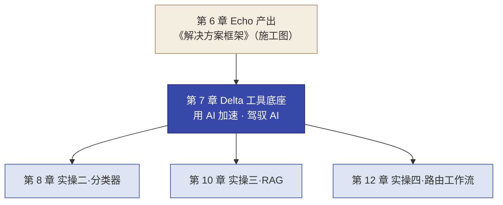
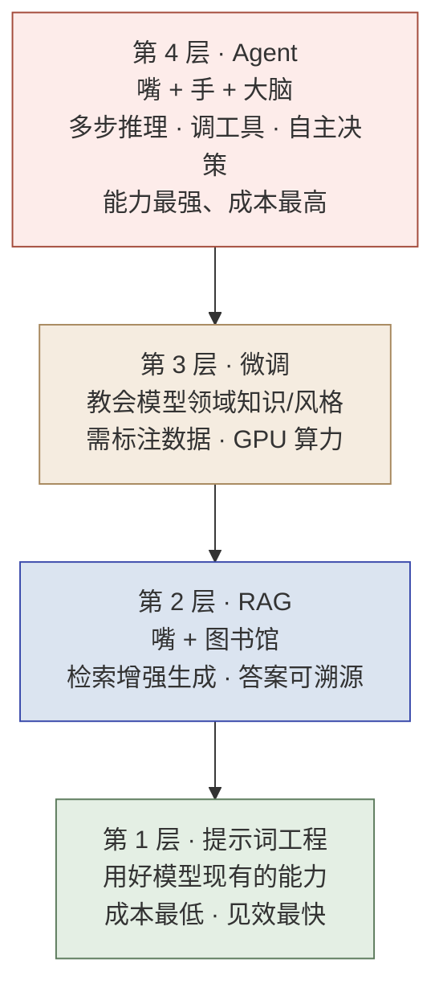

# 第 7 章  Delta 工作法 · Vibe Coding 与工程纪律

> **本章定位：** 知识 + 工具单元 · Delta 侧方法，同时是第 7–12 章的**认知与工具公共底座**（接续第 6 章《解决方案框架》施工图，进入 Delta 施工）。
> **本章产出：** 你能说出 FDE 为什么需要 AI、Delta 如何用 AI 加速并驾驭 AI；用 LLM 四层级金字塔 + 选型三要素给客户场景选对技术层与模型；理解企业级本地部署与"数据不出域"的关系；掌握 Vibe Coding 五原则与 AI Coding 工具选型；会用 gstack 八环节 + SPEC 驱动 + **四条工程纪律**推进一次开发迭代；知道 15 分钟最小 gstack 演练怎么走；知道动态信息（模型 / 硬件 / 工具 / 价格）统一去哪里查（**7.8 动态速查**）。
> **建议读者：** Delta（施工主力必读）与 Echo（选型需双角色共识）均适用。
> **前置：** 第 4 章（Echo/Delta 分工哲学）、第 6 章（已产出《解决方案框架》——交付给 Delta 的施工图）。
> **适配说明：** 本书以 opencode + gstack 为默认演示（训练营同款）；主流 AI Coding 工具（Claude Code、Codex 及国内 WorkBuddy/Qoder/Trae 等）通常可替换，理解流程纪律比死记命令更本质。**本章动态数据（模型、硬件、价格、工具清单）统一集中在 7.8 动态速查**，信息截至 **2026 年 8 月**，落地前以各厂商官方资料复核。

---

## 本章导学

- **学习目标：**
  1. 说出 FDE 为什么需要 AI（三个产能瓶颈），以及 Delta／Echo 为何都要具备"获得 AI 赋能 + 驾驭 AI"的视野；
  2. 用 LLM 四层级金字塔 + 选型三要素，给客户场景选"最简单且够用"的技术层与模型；
  3. 区分企业级本地部署（数据不出域）与原型验证，理解其硬件量级与量化取舍（动态型号与配置见 7.8）；
  4. 说出 Vibe Coding 五原则与 AI Coding 工具选型逻辑（最新工具清单与订阅价格见 7.8）；
  5. 按 gstack 八环节 + SPEC 驱动 + **四条工程纪律**推进一次迭代，说出每环节人的职责；
  6. 完成 15 分钟最小 gstack 演练，并说出"数据与评测证据独立、可追溯、可复现"（纪律四）的要求。
- **前置知识：** 第 4 章（人能判断、AI 能执行）、第 5 章（能力金字塔/选型）、第 6 章（解决方案框架）。
- **章节地图：** 第 6 章 Echo 出《解决方案框架》(施工图) → **本章（工具底座）** → 第 8/10/12 章 Delta 逐章施工。本章是第 8/10/12 三个施工实操共享的方法论。


*图 7-1：本章是第 8/10/12 章三个施工实操共享的工具底座*

> **阅读路线提示：** 主线必学 = 7.1 → 7.2 → 7.5.1 → 7.6 → 7.7（含 7.6.4 演练）；**进阶选读** = 7.4（本地部署硬件规范）与显存细节；**动态速查** = 7.8（模型 / 硬件 / 工具 / 价格，随官方资料更新，不是考点，知道去哪查即可）。

---

## 7.1 为什么 FDE 需要 AI：主动拥抱、更要会驾驭

> 本书第 4 章确立了分工哲学：**人能判断、AI 能执行**。本章把它落到 Delta 侧——不只是"用 AI 加快写代码"，而是理解**FDE 在 AI 时代为什么必须主动采用 AI，又为什么必须能驾驭 AI**。这一节是整个第 7–12 章的论证根基：后面的技术选层、模型选型、部署、工具、流程、纪律，都是对它的展开。

### 7.1.1 先把 FDE 放回 PPT 与四阶段

回顾第 3 章的一次交付三要素 **PPT（People–Process–Technology）**：People 是根、Process 是脉、**Technology 是器**。本章讲的"怎么用 AI 干活"，正是 **Technology("器")** 这一维在当前 AI 时代的重写——工具变了，但 People 是根、判断在人，这一条不变。

再看交付的四阶段（Discovery → Prototype → Build → Scale）。Delta 的主导段落在 **Prototype（双角色）→ Build（主导）→ Scale（自运营 + 回注）**，也就是"把施工图做成能跑的 Demo、系统，并沉淀回注"。**AI 赋能 Delta，本质是赋能这三个阶段的产能。**

### 7.1.2 Delta 的价值从哪来

Delta（对标 Palantir Delta / FDSE，技术执行工程师）是驻扎客户现场的"全栈特种兵"。它的价值不是"写了多少行代码"，而是三者的乘积：

**交付速度 × 交付质量 × 可复用性（能力回注）**

日常时间分配（参考，承前）：**70% 编码与系统构建 / 20% 客户沟通与联调 / 10% 能力回注记录**。其中最后的 10% 不是可选项——不做回注，Delta 就退化成"会写码的外包"（呼应第 1、2 章的"卖人力 vs 卖能力"）。

### 7.1.3 FDE 项目的高质量卡在哪：Technology 维度的三个产能瓶颈

把"客户要在有限时间内做出高质量、能复制的东西"翻译成三个结构性瓶颈——这正是"为什么需要 AI"的根源，也是"AI 与己无关"偏差的破法：

| 瓶颈 | 现象 | 若不解决 |
|------|------|---------|
| **时间瓶颈** | 客户现场时间有限，Prototype/Build 两段要几周内从零做出"可演示 + 能上生产的最小系统" | 传统手写来不及，Demo 难产 |
| **广度瓶颈** | 一个 Delta 要覆盖数据管道、后端、前端、AI 集成、部署，人力不可能全栈精通 | 团队依赖极少数"全能手"，不可复制 |
| **复用瓶颈** | 能力回注四步法（识别→抽象→集成→验证）要求把"本次经验"变成"下次可复用资产" | 纯手工做识别与抽象，成本高，易退化回"卖人力" |

> 这三者都落在 PPT 的 **Technology（器）** 维度，集中在四阶段的 **Prototype/Build** 段——恰是 Delta 的主战场。

### 7.1.4 立两个方向，避免两种偏差

面对 AI，FDE 容易滑向两个极端（对齐 AI FDE 落地方法论）：

- **偏差一「AI 万能论」**：以为有了 AI，就不再需要懂业务、懂现场的工程师。**错。** AI 解决"写得快"，不解决"知道该写什么、写出来有没有人用"——而后者正是 FDE 的核心价值。
- **偏差二「AI 与己无关」**：以为 FDE 的活（数据管道、异构集成、现场推动）AI 碰不到。**错。** AI 正系统性地吃掉 FDE 工作里**最可标准化、最重复**的部分。

> **结论：** AI 放大 FDE 的"复合能力"——让懂业务的人写代码更快、让写代码的人更快理解业务。它不改变 FDE 的定位（把非标痛点转化为平台能力），但**重新定义产能瓶颈**。这也就是本章的主旋律：**主动采用 AI，同时驾驭 AI。**

### 7.1.5 角色演变：Delta／Echo 都要"获得 AI 赋能 + 驾驭 AI"

在 AI 时代，FDE 的工作从"写每一行代码"转向"**写关键的代码 + 编排 AI 干重复的活 + 把关 AI 的产出**"——这正是第 4 章"人能判断、AI 能执行"在施工侧的具体化。

| 能力 | 谁负责 | 内容 |
|------|--------|------|
| **判断（前脑）** | 人 | 挖真需求、做取舍、定验收口径、审查 AI 产出对错、拍板 |
| **执行（后手）** | AI + 人在 checkpoint 把关 | AI 跑流程、写样板代码、做重复任务；人审定方向与质量 |

- **对 Delta（本章主体）**：既要有"**获得 AI 赋能**"的能力（会用 code agent 交付），也要有"**驾驭 AI**"的能力（懂选型、能防翻车、守质量闭环）。
- **对 Echo（点到，呼应第 5/6 章）**：获得 AI 赋能与驾驭 AI 同样重要——Echo 用 AI 做访谈分析、痛点聚类、方案速读提速，同时要审 AI 洞察是不是"真痛点"，不被 AI 的"看似合理"带偏。Echo 侧重"判断"，但也要会用 AI 工具提效。

> **由此引出本书的两种训练模式**（承第 4 章）：Echo 侧判断型实操（Ch6/Ch16）**关键判断不用 AI**（AI 仅可辅助整理/润色/红队），练判断力；Delta 侧实操（Ch8/10/12）用 opencode + gstack，练施工力。**"人会判断、AI 会执行"是 FDE 交付的核心引擎**，本章教 Delta 如何驾驭这一引擎。

**反模式预告：** 把"用 AI"当"让 AI 全自动"（见 7.6/7.7 纪律三）；把 AI 当万能、或与己无关（见 7.1.4）。

---

## 7.2 LLM 能力四层级金字塔：该用哪一层 AI

承接 7.1"人负责判断"，Delta 接到的第一个判断是：**这个需求该用哪一层的 AI 能力。** 本书统一用 **LLM 四层级能力金字塔**（承第 5 章）来分层。

### 7.2.1 四层级金字塔


*图 7-2：LLM 四层级能力金字塔——从简单到复杂、从低成本到高能力*
（注：本图自下而上为能力层示意；使用优先级永远是"从第 1 层开始"。）

### 7.2.2 逐层：何时用、何时不要用

| 层级 | 什么时候用 | 什么时候**不要**用 |
|------|-----------|------------------|
| **1 提示词工程** | 任务是模式匹配、信息提取、改写，不需要外部知识 | 知识不在模型训练数据里、且需要精确引用来源 → 升到 RAG |
| **2 RAG** | 知识固定、有文档、需要溯源（如政策库） | 知识是隐性判断（如写作风格、专业套路）→ 考虑微调 |
| **3 微调** | 需要模型稳定输出特定风格/领域术语，且有足够标注数据 | 有现成文档能做 RAG，或数据过少 → 回到提示词或 RAG |
| **4 Agent** | 任务需要多步推理、工具调用、条件分支 | 步骤是固定的可枚举流程 → 用 Workflow，不上 Agent |

### 7.2.3 "从最简单开始"纪律

> **能用提示词解决的不上 RAG，能用 RAG 解决的不微调，能用 Workflow 实现的不上 Agent。** FDE 的价值不是堆技术复杂度，而是**用最低复杂度交付客户需要的价值。**

这点在后续章节反复出现：第 8 章分类器走提示词（第 1 层）、第 9–10 章 RAG（第 2 层）、第 11–12 章 Agent（第 4 层）——坡度逐级升级，但每次都先问"更简单的那层够不够"。

---

## 7.3 模型格局与选型三要素：选哪个模型、用 API 还是本地

> 💡 **进阶 / 选读（可跳过，不影响主线）：** 本节与 7.4 属于"模型格局 + 企业级本地部署"的**进阶内容**，服务于选型细节与私有化落地；**具体的在售型号、许可证、硬件配置与价格属于动态数据，统一在 7.8 速查**，正文只保留稳定结论。若你只想尽快上手施工，可直接跳到 **7.5（Vibe Coding 原则）**，沿主线一口气读完：**为什么用 AI → Vibe Coding 原则 → gstack 八环节 → 四条工程纪律**，回头再补读本节即可。

承接 7.1"判断"，选完"层"（7.2），下一步是判断**选哪个具体模型、跑在 API 还是本地**——两个长期成立的结论：

### 7.3.1 国内开源可本地，海外闭源只 API

- **海外前沿模型（Anthropic、OpenAI 等）普遍只开放 API、不可本地私有化**——"数据不出域"场景下无法使用；
- **国内开源权重模型（DeepSeek、Qwen、GLM、Kimi 等主流系列）可本地部署**——中国政企"数据不出域"时的主要路线。

> 这正是第 7.4 节的意义：**能不能本地化，是"数据不出域"红线在模型选型上的第一道分水岭。** 具体在售型号、参数规模、许可证与上下文长度见 **7.8.1 动态速查**（信息截至 2026-08，以各厂商官方页为准）。

### 7.3.2 模型迭代快：以官方资料为准

模型名称、参数、上下文、许可证**每季度都在变**，正文不列举具体型号（避免一出版就过期）。需要时统一查 **7.8.1 速查表**；表内引用的数字都标注了来源与"信息截至 2026 年 8 月，落地前以官方资料复核"。

### 7.3.3 选型三要素

| 要素 | 判断维度 | 落到什么决策 |
|------|---------|-------------|
| **1. 任务复杂度** | 深度推理 vs 模式匹配 | 深度推理→思考/大模型档；模式匹配→小模型/非思考档 |
| **2. 数据敏感度** | 能否上云 API vs 必须本地 | 不能出域→本地私有化→需开源权重 |
| **3. 部署约束** | 显存/成本/国产芯片/引擎 | 决定用哪家权重、什么档位、什么引擎 |

> 三要素一句话：**任务复杂度决定"用多大/要不要思考"，数据敏感度决定"上云还是私有化"，部署约束决定"用哪家权重、什么引擎"**——三者共同收敛到"模型 + 部署形态"的组合。

---

## 7.4 本地部署底座与"数据不出域"：企业级硬件规范

> 💡 **进阶 / 选读（可与主线分离）：** 本节是"企业级本地部署硬件"的展开，服务于私有化落地细节；主线读者可先跳读 7.4.1 的量级结论，遇到私有化项目再回读。

承接 7.1"判断"的部署约束，当数据敏感度判出"不能上云"，"跑在哪"就必须落到本地。**这是"数据不出域"红线在技术侧的落地**（政务/金融/国企硬约束：PIPL、数据跨境规定等要求政企数据不出域）。

### 7.4.1 企业级 vs 原型：别用家用卡想企业交付

模型在哪个硬件上跑，分三个量级。**企业交付的主体是"器"级的服务器/一体机，不是一张家用显卡**：

| 量级 | 硬件形态 | 用途 |
|------|------------|------|
| 原型/学习 | 单卡消费级；或云端 API | PoC 先验证"AI 可行"，不是交付主体 |
| **企业私有化（数据不出域默认）** | **一体机 或 1~2 台 8 卡服务器** | 政企机房/私有化主力 |
| 省市/集团级 | 万卡智算集群 | 智算中心形态，非单项目默认 |

### 7.4.2 企业级硬件：英伟达 vs 昇腾两条栈

| 栈 | 代表硬件 | 关键规格（以官方为准） | 适用 |
|----|------------|------|------|
| **英伟达栈** | **B300（Blackwell Ultra）** | 单卡 **288GB HBM3e**（其余规格以 NVIDIA 官方页为准） | 大规模/多卡集群，性能与生态占优 |
| **昇腾栈** | **昇腾 910C**（当前国产算力主力） | 按型号；MindIE 推理引擎 | 信创/政企"数据不出域"默认；国产原生适配 |

> **昇腾 910C 是当前国产算力的中流砥柱**（信息截至 2026 年 8 月）：[粤港澳大湾区首个"国芯训国模"昇腾万卡智算集群已上线，部署 **11,520 张昇腾 910C**（来源：广东省科技厅公告）](http://gdstc.gd.gov.cn/kjzx_n/gdkj_n/content/mpost_4924300.html)；910C 已被字节跳动、中国电信等头部厂商规模采用（[Omdia 分析转述](https://xueqiu.com/1855261132/368119001)），出货量持续放量。昇腾 950 系列为下一代方向，但 910C 目前凭借成熟生态与产能仍是存量主力。
>
> **政企默认做法：** 涉密/高合规场景走**全私有化一体机**；一般政企走"私有化核心 + 云 API 补充"的混合形态。信创环境默认**昇腾路线**（国产芯片 910C + 麒麟 OS + 国产数据库栈）。

### 7.4.3 显存规划：从模型反推要几卡

**显存规划公式（🔶教材提炼）**：FP16 权重约"每 10 亿参数 2GB"；FP8 减半，NVFP4/INT4 再减半。据此，权重体积 ≈（参数量 ÷ 10 亿）× 2GB ÷ 量化档位折算，再除以单卡显存即可估出所需卡数；同时要为 KV cache、激活与运行时缓冲留出余量（这是粗略下界，不是精确配置）。

> **判读要点（示例口径，非在售配置）：** 以 "288GB 单卡 × 8 卡 ≈ 2TB 级单节点" 为参考量级：万亿参数级模型（如 Kimi K3 的 2.8T，NVFP4 权重体积约 1.4TB）才有机会压进单节点；更重的生产级吞吐需求再考虑多节点。**具体在售配置与部署示例见 7.8.1，落地一律以厂商部署文档核验。**

### 7.4.4 模型服务化与推理引擎（企业做法）

| 引擎 | 角色 | 说明 |
|------|------|------|
| **vLLM** | 开源主流推理引擎 | 生产高吞吐、Continuous batching、OpenAI 兼容 API |
| **TensorRT-LLM** | 英伟达编译优化 | 针对英伟达硬件优化，极致延迟/吞吐 |
| **Triton / Triton-Dynamo** | 统一推理网关层 | 多模型统一部署、调度 |
| **MindIE** | 昇腾 910C 默认推理引擎 | 国产算力上的标准方案 |

**多卡并行口诀（企业做法）**：单机内**张量并行**（吃 NVLink 带宽）；跨节点用**流水线并行 / 数据并行**；MoE 模型走**专家并行**。生产部署一般用 K8s + GPU Operator 调度，配健康检查与网关（Higress/API7 等）。

### 7.4.5 量化取舍

- **生产默认 FP8 / NVFP4**（显存减半甚至减半再减半，精度损失小）。
- **INT4 慎用**：仅供逼近硬件极限时考虑，必须按评测结果定档，不推荐进生产。
- 目标：让"万亿参数级"也能塞进 8 卡单节点（如 2.8T 级模型用 NVFP4 权重体积约 1.6TB）。

---

## 7.5 Vibe Coding 五原则与 AI Coding 工具生态

承接 7.1"AI 负责执行"，执行要用某个 code agent / 工具承载。本节讲"**用什么工具、怎么驱动**"——即 Vibe Coding（vibe coding：**Karpathy 于 2025 年 2 月提出**，从"手写每一行"转向"描述意图 + 审查判断"，[IBM 主题介绍](https://www.ibm.com/cn-zh/think/topics/vibe-coding)）。

### 7.5.1 Vibe Coding 五原则

| 原则 | 核心 | 反例 |
|------|------|------|
| **描述意图** | 说你要什么结果，不说怎么实现 | "调用 xxx 库的 chat 接口"——你在替 AI 做技术决策 |
| **给足上下文** | 显式给项目背景、技术栈、约束 | "帮我写个数据导入脚本"——AI 不知道你的 schema |
| **分步迭代** | 框架→核心→辅助，每步验证 | 一次描述整个系统，出错重来代价大 |
| **逐行审查** | 读懂 AI 生成的每一行，找逻辑/安全/边界 | "大概看懂了"——不是把责任交给 AI |
| **用 AI 解释** | 看不懂就让 AI 解释，这是最快学习路径 | "不敢改"——AI 时代的障碍消失了 |

> 最关键的是**逐行审查**与**描述意图**——它们共同保证"是人在驾驭 AI，不是 AI 替人做主"。

### 7.5.2 两大专门 code agent（海外）

| 工具 | 定位 | 关键能力 | 订阅（动态，见 7.8.2） |
|------|------|------|------|
| **Claude Code** | Anthropic 官方 Agentic CLI | 终端自主编码；Skills/Subagents/Auto Mode；MCP；可叠 gstack | $20 / $100 / $200 三档 |
| **Codex / Codex CLI** | OpenAI code agent 产品族 | 云沙箱改码跑测提 PR、Automations、Subagents | Free / $8 / $20 / $100 档位 |

> 价格截至 2026-08（[Claude Code Pricing](https://www.morphllm.com/claude-code-pricing)、[Codex Pricing](https://www.morphllm.com/codex-pricing)），订阅结构会变，落地前以官方页为准。**工具清单与最新定价统一在 7.8.2 速查。**

### 7.5.3 国内 AI Coding 工具生态（编程 + 办公双线）

国内工具的共同主张是**模型国产化 + 企业内网 + 数据不出域**——正好呼应本书四条红线中的"数据不出域"，也补上了海外工具"境外服务/合规"的短板。代表厂商：腾讯（WorkBuddy）、阿里（Qoder / 千问办公）、字节（Trae / 豆包办公）、百度（Comate / 文心快码）、智谱（CodeGeeX 系）——[办公智能体赛道各厂商已完成排兵布阵（2026-08 行业分析）](https://finance.eastmoney.com/a/202608123839168388.html)。**具体产品形态与定价属动态数据，以各厂商官方发布为准（7.8.2 速查）。**

### 7.5.4 怎么选工具（选型三问）

1. **能否连境外服务？** 不能/内网 → 国产工具或自部署开源；能 → Claude Code/Codex 也可用。
2. **编程为主还是办公为主？** 编程 → CLI agent / IDE 助手；办公 → 千问办公 / 豆包办公 / WorkBuddy。
3. **数据合规要求？** 内网/不出域 → 国产 + 自部署开源模型。

> **工具是手段，纪律是根本。** 无论你用 Claude Code、Codex，还是 WorkBuddy/Qoder/TRAE，"描述意图 → AI 执行 → 人把关 → 质量闭环"这套纪律不变——这正是 7.6 / 7.7 要建立的。

---

## 7.6 gstack 工作流与 SPEC 驱动开发：把四步骨架组织成流水线

承接 7.1，把"描述意图 → AI 执行 → 人判断把关 → 质量闭环"落成一套可执行的流水线，并用 SPEC 把"意图"写死。

### 7.6.1 gstack 是什么

**gstack** 是 Garry Tan（YC CEO）开源的 AI 开发工作流框架。官方口径是"**23 个 opinionated tools**"（[GitHub: garnet-labs/gstack](https://github.com/garnet-labs/gstack)，把单次 AI 会话扩成"虚拟团队流水线"）。本书沿用训练营的**八环节提炼**——**注意："八环节"是对官方 23 tools 主干命令链的教材归纳，非官方编号；落地以官方仓库为准。**

### 7.6.2 八环节流水线

```text
office-hours → spec → autoplan → build → review → qa → ship → retro
（要不要做）   （死磕边界）  （决策拍板） （做出来） （找隐患） （测体验） （收尾） （复盘）
```

| 环节 | 命令 | 干什么 | 你的角色（人的判断不可替代） |
|------|------|--------|--------------------------|
| **office-hours** | `/office-hours` | 想清楚该不该做、确认需求和范围 | **提问者**（答疑数据/口径） |
| **spec** | `/spec` | 死磕成精确规格：失败模式、No-Go、数据模型、验收口径 | **追问者**（审查 No-Go 具体吗） |
| **autoplan** | `/autoplan` | 暴露"两可决策"供你拍板（只列选项，不替你决定） | **决策者**（真的拍板） |
| **build** | 自然语言 | 按 SPEC 实现，每模块即测 | 审查者（抽查没偏离 No-Go） |
| **review** | `/review` | 找"能跑但会出事"的隐患，P0–P3 分级 | 审查者（确认 P0/P1 修复） |
| **qa** | `/qa` | 真实跑核心流程 + 边界输入 | 验收者 |
| **ship** | `/ship` | 版本号 + CHANGELOG + README + commit | 收尾者（确认 .env 未入库） |
| **retro** | `/retro` | 复盘：做得好/摩擦/未覆盖测试/改进行动项 | 复盘者 |

**三个关键原则：**
- **人的角色每环节不同**，但任何环节人的判断都不可替代。
- **每环节产出都是文件**（office-hours 记录 / SPEC.md / 决策记录 / 代码 / review.md / qa-report.md / 版本与 CHANGELOG / retro.md）——可追溯、可复用（也是第 8/10/12 章"逐轮复用上一轮 AGENTS.md/retro.md"的基础）。
- **不必所有改动都走全流程**——判断标准：**做错代价大不大、会不会被别人用、会不会长期存在**。会被坐席长期使用的系统 → 走完整流程。

### 7.6.3 SPEC 驱动：先写规格再动手

**SPEC 驱动**是 Delta 的核心工程纪律：动手 **build** 之前，先写死一份规格（SPEC），build 阶段不再重复讨论技术参数，只严格按 SPEC 实现。

一份好 SPEC 要死磕清楚：
- **边界（No-Go）**：明确"本阶段刻意不做的事"——防止 Agent 自由发挥；
- **数据模型**：输入/输出的形状、字段、类型；
- **验收口径**：什么样算成功（如"准确率 ≥85%"可量化指标）——防止 Agent 自己发明验收。

> **为什么先写规格？** build 不重复技术参数，能避免 Agent 在施工中反复问、反复改方向。SPEC 写死了，build 就是执行——这正是"施工力"和"随意写代码"的区别。

### 7.6.4 最小 gstack 演练（15 分钟，可选动手）

> 目的不是产出真实系统，而是**把八环节的节奏"跑一遍手感"**——尤其体会"一环一停、拍板点列选项"为什么能防失控。

- **素材**：任意一个小微任务即可（如"写一个读取 CSV 并输出分类计数的脚本"）。
- **压缩走查**：
  1. **office-hours（1 分钟）**：只问 2 个边界问题（输入文件从哪来、输出给谁用）；
  2. **spec（5 分钟）**：写下 No-Go（"不做界面、不处理异常文件"）+ 验收口径（"对 10 行样例输出正确计数"），3 行以内；
  3. **build（7 分钟）**：让 Agent 实现最简版本，逐行读一遍它给的代码；
  4. **retro（2 分钟）**：一句话复盘（哪里摩擦最大、下次怎么补）。
- **演练要求**：刻意练习"走完一环停下汇报、获许可再流转"；**15 分钟到点即停**，没走完的环节写进 retro 即可。
- **环境未就绪的替代**：用"纸上推演版"——在便签上写出每个环节该产出什么文件、谁拍板，同样能建立节奏感，不阻塞主线（完整环境命令见 7.8.3）。

---

## 7.7 防 Agent 翻车的四条工程纪律：守住质量闭环

承接 7.1"人能判断、AI 能执行"，但 AI 执行会"翻车"。**四条纪律保证"驾驭 AI"落到实处——质量闭环不被 AI 的"自洽"击穿。** 这四条在第 8/10/12 章逐章落实。

### 纪律一 · 测试数据必须外部给定

把固定的测试数据直接写进启动提示词、让 Agent 落盘成 CSV，并明确"**不得自行改动或重新生成**"。**防止 Agent 自己出题自己考**——否则验收无意义。

### 纪律二 · 启动提示词写清"信息块"，不留白让 Agent 猜

一份高质量启动提示词要包含这 7 项，每项给出确定内容：

| # | 信息块 | 为什么必须有 |
|---|--------|------------|
| 1 | 背景与角色 | 缺了，Agent 自己脑补客户和场景 |
| 2 | 要做什么 | 缺了，Agent 发明错误的接口 |
| 3 | 输入输出 | 缺了，无法验收 |
| 4 | 技术选型（含理由） | 缺了，Agent 可能又问你要不要用 RAG |
| 5 | 数据现状 + 测试集 | 缺了，Agent 可能走传统 ML 死路 |
| 6 | 验收口径 | 缺了，Agent 自己发明一套验收 |
| 7 | 约束与边界 | 缺了，Agent 自由发挥 |

> **写启动提示词的本质**：假设一个完全不熟悉项目的人来接手，他需要知道什么才能"不重开讨论、直接开干"？——场景的边界、数据、选型理由、验收口径都要写死。Agent 是最"难伺候的新人"，不是会猜的专家。

### 纪律三 · 驱动指令把流程纪律"焊"进 Agent 执行

注入启动提示词时，明确要求 Agent 按 gstack 八环节逐步执行、**禁止全自动**（走完一环必须停下汇报、获你明确许可才流转）、**拍板点列选项等你选**、环节产出文件落盘、从 office-hours 开始。参考驱动指令：

```
/office-hours
我是一名 FDE 团队（Delta 角色），需要启动【场景】的施工。
【粘贴你的启动提示词，含 7 项信息块】
请按 gstack 标准开发流程执行，严格遵守：
1. 依次走完 8 个环节：office-hours → spec → autoplan → build → review
   → qa → ship → retro，顺序不跳、不简化；
2. 每个环节产出对应文件，落盘当前目录；
3. 禁止全自动：走完一环先停下汇报，获许可再流转；
4. 拍板点（验收口径/门槛/兜底）列出选项与利弊，等我选择；
5. 现在从 office-hours 开始。
```

> **为什么"一环一停、拍板点列选项"如此关键？** 如果让 Agent 一口气把 8 环节全跑完、代码写完了才告诉你，你就失去了所有**中途纠偏**的机会，只能事后全盘检查。真实 FDE 项目里，让 AI"一小步一确认"不是效率低，而是**把失控风险控制住**。

### 纪律四 · 数据与评测证据必须独立、可追溯、可复现

纪律一保证了"外部给测试集"，但还不够——**整条数据与评测链路的证据都要独立、可追溯、可复现**，否则验收数字没有可信度：

| 维度 | 要求 |
|------|------|
| **来源与授权** | 数据从哪来、有无授权记录（政策文档出处、标注人的依据），不凭"不知道哪来的文件" |
| **标签规范** | 标注规则成文、检查一致性（多人标注时记录一致性），不能"各标各的" |
| **开发/盲测隔离** | 调 Prompt、阈值、规则**只用开发集**；验收集（盲测集）在 Prompt 冻结后才使用，标签由讲师或评分脚本持有 |
| **版本与血缘** | 数据集带版本号、生成脚本、改动记录（对应 gstack"每环节产出文件落盘"） |
| **评测污染** | 评测集不得出现在训练、提示词或检索上下文中——Agent 不能"见过答案" |
| **漂移与回流** | 上线后记录线上分布与评测分布的差异，设计反馈回流路径 |

> **反模式：** 把"开发集调出的结果"当"最终验收结果"上报；偷偷改了测试数据却说没改；评测文件没有版本、说不清谁改过——这些都会让验收失去意义（第 8/10/12 章将用"盲测集验收"把这条纪律落地）。

---

> **实操四B（Lab4B）的工程纪律（预告）：** 无编号附加高级实验"西岭市民服务协同 Agent"同样基于 gstack，但它**从头构建独立项目、不复制第 8/10/12 章代码**；复用的是上一轮沉淀的**知识、数据与工具契约**（`classify_request` / `search_policy` / `query_department`）。实验五条纪律：① 独立项目、承接知识不承接代码；② 先做 MVP 核心轨迹——至少两条不同任务走不同路径、信息不足会追问、敏感会交还给人；③ 不一步到位（工具冲突、故障注入、复杂评分、生产级安全放迭代挑战）；④ 界面达毕业展示标准（不得以未设计的默认 Streamlit 页交付）；⑤ gstack 一环一停、每环有产出。课程中实操四B 不要求全员必做（可课后完成），手册见《实验手册》`labs/lab4b-cooperative-agent.md`。

## 7.8 动态速查与环境（附录式，随官方资料维护）

> 本节是**动态速查**，不是主线必学——正文需要时知道"去哪查"即可。所有条目信息截至 **2026 年 8 月**，均标注来源；**型号、价格、配置会持续变化，落地前请以各厂商官方资料复核。** 本表由编写组随版本维护（对应"信息截至 YYYY 年 MM 月"标注纪律）。

### 7.8.1 模型与硬件速查（截至 2026-08）

| 系列 | 代表型号 | 规格（官方口径） | 许可证 / 本地化 | 来源 |
|------|---------|----------------|----------------|------|
| **DeepSeek** | V4 | 1.6T MoE、1M 上下文（V4 系列其他分档以官方发布为准） | 开源、可本地 | [NYU 上海编译](http://rits.shanghai.nyu.edu/ai/deepseek-releases-v4-open-source-1-6t-moe-with-1m-context/)、[apidog](https://apidog.com/blog/what-is-deepseek-v4/) |
| **Kimi** | K3 | 2.8T MoE（首个该规模开源） | 开源（协议以官方发布为准） | [搜狐](https://www.sohu.com/a/1055634931_393071)、[新浪财经](https://finance.sina.cn/2026-07-28/detail-inikimei2619100.d.html) |
| **GLM** | GLM-4.7 / GLM-5.2 | 参数以官方发布为准 | 开源 + API | [智谱官方文档](https://docs.bigmodel.cn/cn/guide/models/text/glm-4.7)、[百科条目](https://baike.baidu.com/item/GLM-5.2/68604922) |
| **Qwen** | Qwen3.8-2.4T-A95B | 2.4T MoE、激活 95B、原生 256K | 27B 档 Apache 2.0；**旗舰 Max 有许可限制** | [IT 之家](https://m.ithome.com/html/989001.htm) |
| **Claude** | Opus 5 / Sonnet 5 | 闭源前沿档位 | 仅 API，不可本地（Fable/Haiku 档未见可靠公开来源，未列） | [apifox 报道](https://apifox.com/apiskills/claude-opus-5-vs-sonnet-5-ni-dao-di-xu-yao-na-kuan-mo-xing/) |
| **OpenAI** | GPT-5.6 系列 | 闭源前沿档位 | 仅 API | [至顶网](https://ai.zhiding.cn/2026/0710/3192889.shtml) |

**硬件速查：**

| 硬件 | 关键规格（以官方为准） | 用途 | 来源 |
|------|----------------------|------|------|
| **NVIDIA B300**（Blackwell Ultra） | 单卡 **288GB HBM3e**；其余规格（带宽、CUDA 版本等）以 NVIDIA 官方页为准 | 大规模/多卡集群 | [vast.ai 规格文](https://vast.ai/article/everything-you-need-to-know-about-the-nvidia-blackwell-ultra-b300) |
| **昇腾 910C** | 当前国产算力主力；大湾区万卡集群 **11,520 张**已上线 | 信创 / 数据不出域默认 | [广东省科技厅](http://gdstc.gd.gov.cn/kjzx_n/gdkj_n/content/mpost_4924300.html)、[中国电子报](http://m.chinaaet.com/article/3000178874) |

**部署配置示例（🔶教材提炼，示例口径，非在售配置；落地以厂商部署文档核验）：**

| 模型档位 | 权重体积估算（NVFP4 约每 1T 参数 0.5TB） | 示例配置 |
|---------|---------------------------------------|---------|
| 2.8T 级（对标 Kimi K3） | ≈1.4TB | 单节点 8 卡（288GB 级）参考 |
| 1.6T 级（对标 DeepSeek V4） | ≈0.8TB | 单节点 8 卡参考；生产级吞吐再评估多节点 |
| 百 B 级 | ≈0.1–0.3TB | 单卡或双卡即可起实验 |

### 7.8.2 工具与订阅速查（截至 2026-08）

| 工具 | 订阅 | 来源 |
|------|------|------|
| **Claude Code** | Pro $20 / Max $100 / $200 | [morphllm](https://www.morphllm.com/claude-code-pricing) |
| **Codex** | Free / Go $8 / Plus $20 / Pro $100 | [morphllm](https://www.morphllm.com/codex-pricing) |
| **国内工具** | WorkBuddy（腾讯）、Qoder / 千问办公（阿里）、Trae / 豆包办公（字节）、Comate / 文心快码（百度）、CodeGeeX 系（智谱）——产品形态与定价以各厂商官方发布为准 | [腾讯云开发者社区](https://cloud.tencent.com.cn/developer/article/2702543)、[行业分析](https://finance.eastmoney.com/a/202608123839168388.html) |

> **工具是手段，纪律是根本**（正文 7.5.4 / 7.6 / 7.7）：换工具不换纪律；本节只负责任何时候都能查到"当下有哪些可选项"。

### 7.8.3 环境与工程（安装 / 启动 / 验收 / 排障）

- **版本锁定**：随书资源包提供 `resources/environment/requirements-lock.txt`（依赖锁定清单，随资源包交付）；
- **环境自检**：`resources/environment/environment-check.md`——安装、启动、验收前先跑自检；
- **排障**：`resources/environment/troubleshooting.md`——常见报错与处理；
- **方法论**：命令是手段，**验收与排障的判断逻辑在 7.7 四条纪律**（外部测试集、信息块、驱动指令、数据与评测证据）；
- **说明**：资源包随实操资源轮次补齐；在书到货前，学员可用 7.6.4 的"纸上推演版"先练节奏。

---

## 反模式与红线

- **让 Agent"全自动"一把梭、不设 checkpoint。** 你会失去所有中途纠偏机会（7.7 纪律三）。
- **Agent 自己出题自己考。** 测试数据要外部给定，不能让它自己造（纪律一）。
- **把开发集当验收集。** 调参只用开发集，验收用盲测集；"开发集调出来的数字"不是最终验收数字（纪律四）。
- **把决策权丢给 AI（"你看着办"）。** 拍板点必须你决——只有你掌握第 6 章定的验收口径。
- **跳过 SPEC 直接 build。** 会退化成"随意写代码"，Agent 反复改方向、无法验收。
- **把 .env / API key 提交进版本库。** API key 走环境变量、不硬编码、不入库。
- **忽略"数据不出域"硬上公网 API。** 政企客户数据不能出域时，要本地私有化部署（7.4）。
- **过度堆技术层。** 能提示词却上 RAG/Agent，违背"从最简单开始"（7.2.3）。
- **把"待核验"当正文。** 动态型号、价格、参数一律查 7.8 速查（标注"信息截至 2026-08，以官方资料复核"），不把未核实数字写进交付物。

> **本书红线（技术侧落地）：答案可追溯、敏感件零漏判** 都要在 SPEC 的验收口径里写死（第 9、11 章分别展开），否则 Delta 施工做不出符合政务红线的系统。

---

## 本章小结

- **FDE 为什么需要 AI**：Technology 维度的三个产能瓶颈（时间/广度/复用）→ AI 放大复合能力；**主动采用 + 驾驭 AI**，Delta/Echo 都需要。
- **分工不变**：人能判断、AI 能执行；FDE 从"写每行代码"转向"写关键代码 + 编排 AI + 把关产出"。
- **选层**：LLM 四层级金字塔（提示词→RAG→微调→Agent），"从最简单开始"。
- **选模型/部署**：国内开源可本地、海外闭源只 API；选型三要素（复杂度/数据敏感度/部署约束）；企业级本地部署按量级选型（B300 英伟达 / 昇腾 910C 双栈），显存按公式从模型反推，量化默认 FP8/NVFP4。
- **工具**：Vibe Coding 五原则 + 工具选型三问；**最新工具与订阅价格查 7.8 速查**。
- **流程**：gstack 八环节 + SPEC 驱动 + **15 分钟最小演练（7.6.4）**。
- **四条工程纪律**：外部测试集 / 7 项信息块 / 驱动指令焊进 Agent / **数据与评测证据独立、可追溯、可复现**。
- **动态速查**：7.8 集中维护模型、硬件、工具、价格与环境命令，信息截至 2026-08，以官方资料复核。

**动手自检：**
- [ ] 我能说出三个产能瓶颈与"主动采用 + 驾驭 AI"的道理吗？
- [ ] 我能用四层级金字塔 + 选型三要素给场景选层选模型吗？
- [ ] 我能说清企业级（B300/昇腾）本地部署的量级脑补与显存估算公式吗？
- [ ] 我能默写 gstack 八环节、说出每环人的角色、懂为什么一环一停吗？
- [ ] 我能把一段需求写成含 7 项信息块 + 三条纪律的启动提示词吗？
- [ ] 我能说出纪律四的要求（数据与评测证据独立、可追溯、可复现），并指出"开发集当验收集"为什么错吗？
- [ ] 我知道动态型号、价格、工具清单去哪查（7.8），并会看它的"信息截至 + 来源"标注吗？

---

## 练习与思考

- **基础：** 默写 LLM 四层级与选型三要素；默写 gstack 八环节与命令；列出启动提示词 7 项信息块；默写四条工程纪律。
- **进阶：** 用 7.6.4 的 15 分钟演练（或纸上推演版）走一遍最小 gstack 并写一份 retro；把第 6 章你产出的场景 A（诉求分类）写成一份含 7 项信息块 + 三条纪律的启动提示词；写一条"评测污染"反例并给出纠偏做法。
- **挑战（迁移练习）：** 1. 说明"如果 Agent 不落地测试集、自己编数据"对一个分类系统验收如何失效，并写出纠偏指令；2. 给你负责的验收设计"开发集 / 盲测集"的拆分与版本管理方案（对应纪律四：来源、标签、隔离、血缘、污染、回流各写一条）；3. 给定"数据不能出内网"的政企项目，按 7.8 速查给出模型选型与本地部署（双栈、量化档、几卡）的初步方案，并注明哪些数字需在落地前以官方资料复核。

---

## 在线全书（延伸阅读）

- 见在线全书 https://www.cloudzun.com/fde-course/（AI FDE 落地 · Delta 技术与场景）——AI 辅助四阶段、本土技术栈与私有化部署的完整展开。
- 见在线全书 https://www.cloudzun.com/fde-course/（AI FDE 落地 · Echo 共识与对齐）——"两种偏差"与 AI 重塑 FDE 的全景。
- **下一章：** 本书 **第 8 章实操二 · 诉求智能分类器**（把本章方法第一次施工到西岭场景 A）。

---

> **动态信息口径：** 本章动态型号、硬件、价格与工具数据统一在 **7.8 动态速查** 维护，信息截至 **2026 年 8 月**；表中每项均标注来源，落地前请以各厂商官方资料复核（正文不保留"待核验"字样）。