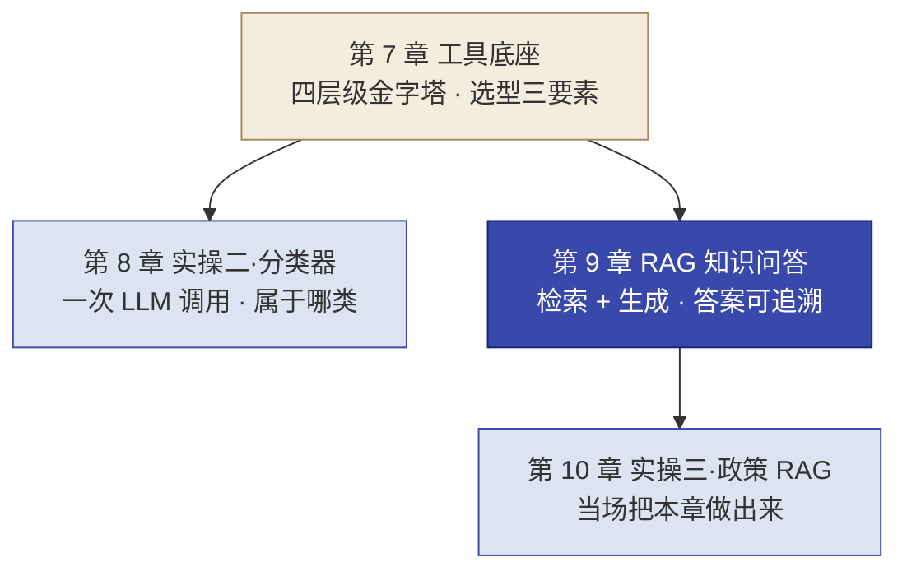
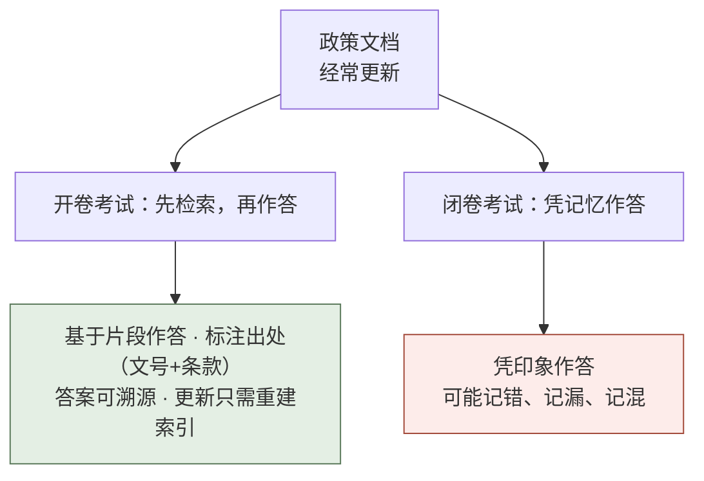
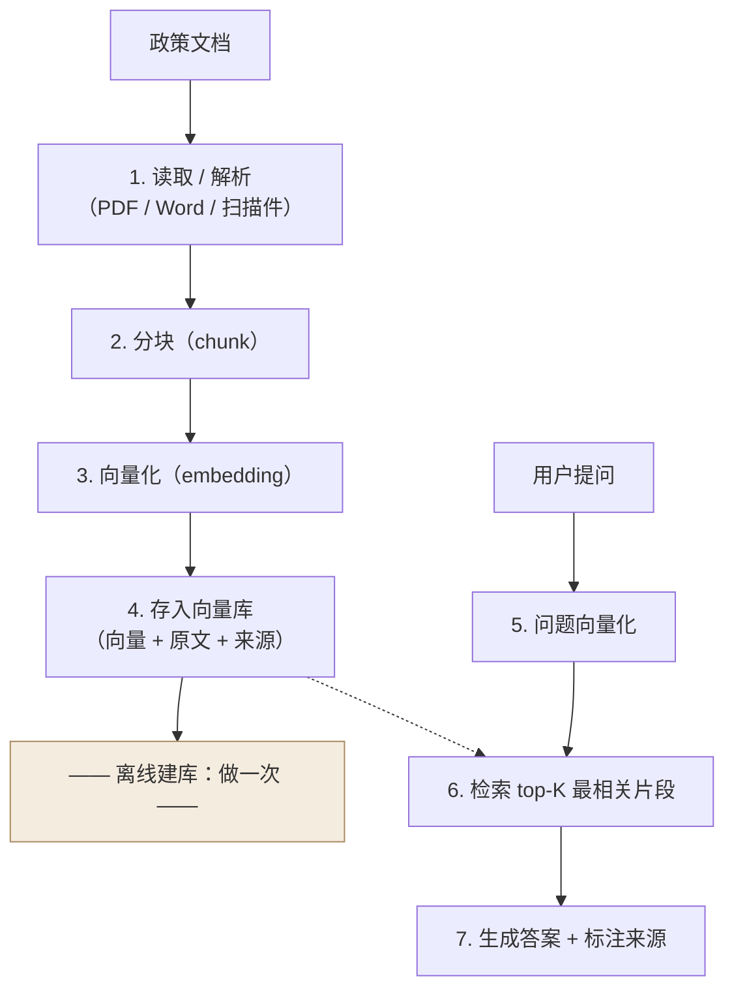
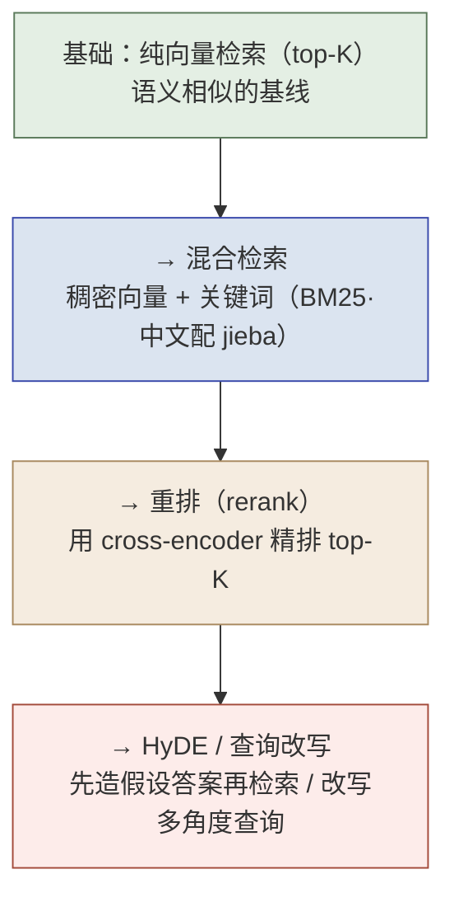
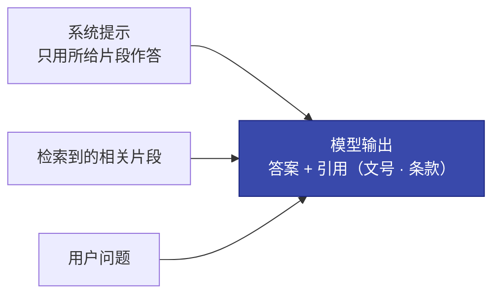

# 第 9 章  RAG 知识问答：答案可追溯

> **本章定位：** 知识单元 · Delta 技术方法（对准实操三），把第 7 章 LLM 四层级金字塔的第 2 层（RAG）讲透，并落地本书四条红线里的"**答案可追溯**"。
> **本章产出：** 你能说清 RAG 是什么、为什么超长上下文取代不了它；画出 RAG 核心链路并说出每步的输入/输出/常见坑；判断一个知识问答场景该用 RAG / 超长上下文 / 微调 / 纯关键词 / 提示词；掌握解析、分块、向量化、向量库、检索增强的选型与参数判读；理解"答案准确率 + 来源可追溯率"双指标为何是政务 AI 的准入门槛，并会用**检索与生成分开评估 + 固定评估配置 + 库外问题**落地验收；完成 20–30 分钟**最小 RAG 预实验**。
> **建议读者：** Delta（施工主力必读，直接用于实操三）与 Echo（选型判断需双角色共识）均适用。
> **前置：** 第 7 章（四层级金字塔 7.2、选型三要素 7.3、数据不出域 7.4）、第 8 章（一次 LLM 调用 = 分类器）。
> **适配说明：** 技术选型与数据信息截至 **2026 年 8 月**；技术栈迭代快，落地前按各家官方最新文档与定价页复核。

---

## 本章导学

- **学习目标：**
  1. 用"开卷考试"类比讲清 RAG 的核心思想，并说清为什么 1M 超长上下文也取代不了它；
  2. 画出 RAG 核心链路（解析→分块→向量化→向量库→检索→生成 + 来源引用），说出每步输入、输出与常见坑；
  3. 判断一个场景该用 RAG / 超长上下文 / 微调 / 纯关键词 / 提示词（对照第 7 章"从最简单开始"）；
  4. 对文档解析、分块、Embedding、向量库、检索增强做除选型与参数判读；
  5. 理解并会用"答案准确率 + 来源可追溯率"双指标验收 RAG 系统，并落地**检索与生成分开评估、固定评估配置、外部给定库外问题**；
  6. 完成 20–30 分钟最小 RAG 预实验（9.10），把链路每一步亲手走一遍。
- **前置知识：** 第 7 章（四层级金字塔：RAG 在分类之上、微调之下，见图 7-2）、第 8 章（一次 LLM 调用能做什么）、第 5 章（能力金字塔与选型）。
- **章节地图：** 第 8 章分类器是"一次 LLM 调用"，只是识别"属于哪类"；从本章起的 RAG 是"**检索 + 生成**"——先找到相关政策片段，再基于片段作答并标注来源。这是坡度的明显升级，也正好落在四层级金字塔第 2 层。

*图 9-1：本章位置——RAG 是第 8 章"一次调用"到第 10 章"政策问答"之间的方法底座*

---

## 9.1 RAG 是什么：为什么超长上下文也取代不了它

### 9.1.1 开卷考试的类比

RAG（Retrieval-Augmented Generation，检索增强生成）的核心思想一句话：**"考试时翻开书找答案，而不是把书背进脑子。"**

普通大语言模型（LLM, Large Language Model）凭"记忆"回答问题，难点在于：遇到**经常更新**的内容（政策、法规、业务手册、产品手册），模型训练时的"记忆"很可能已经过时，甚至本身就有错漏。RAG 的做法是：先把相关资料切好存进索引，用户提问时**先检索出最相关的片段，再基于这些片段生成答案，并标注出处**。

*图 9-2：RAG 是"开卷考试"——先检索相关内容，再基于内容作答，答案可溯源*

### 9.1.2 RAG 解决的三个问题

把"开卷考试"落成工程语言，RAG 同时解决三类问题：

| 问题 | 现象 | RAG 的解法 |
| :--- | :--- | :--- |
| **记忆漂移** | 政策一更新，模型凭旧记忆答错 | 答案来自最新索引库的数据，更新内容只需重建索引，不用重新训练 |
| **成本** | 每次把整本手册塞进上下文，token 贵且响应慢 | 只检索出与问题最相关的一小段放进提示词，成本与延迟可控 |
| **可追溯** | 答非所问或答错时，没人知道依据是什么 | 答案强制带出处（文号 + 条款号），可核对、可免责 |

> [!IMPORTANT] **"答案可追溯"是政务 AI 的准入门槛。** 市民问政策，AI 答错了，坐席和平台要负责。如果答案能做到"某政策 第X条"，市民可核对，坐席也能说"这是按文件规定来的"。来源引用不是锦上添花，而是政务 AI 上线的硬门槛。（呼应第 6 章李工"免得坐席背锅"。）

### 9.1.3 为什么 1M 超长上下文也取代不了 RAG

截至 2026 年 8 月，主流模型普遍支持很长的上下文，为什么还要 RAG？从三个维度看：

- **聚焦**：上下文再长，模型在超长文本里也容易"注意力分散"——在长文档中间位置的片段尤其容易被忽略（业界称为 Lost in the Middle 现象）。RAG 先精准切出相关片段，等于帮模型划重点，命中更稳。
- **成本**：长上下文按 token 计费，塞进全文的开销随文档量线性上涨；RAG 每次只带相关片段，成本低、响应快。
- **可追溯**：超长上下文是"把全文给你、你看着答"，答案从哪条依据来仍不透明；RAG 的检索步骤天然锁定"哪几段支撑了这个答案"，溯源更直接。

> **结论：** 超长上下文解决的是"能读多少"的问题，RAG 解决的是"读哪几段、答得有依据"的问题。政务知识问答要的是后者，所以 RAG 仍是这一场景的主力，而不是被 1M 上下文取代。

### 9.1.4 选型边界：这层工具该用哪一种

一个知识问答场景该用哪一层技术，对照第 7 章四层级金字塔"从最简单开始"来选：

| 方案 | 核心机制 | 何时适用 | 政策问答为何这样选 |
| :--- | :--- | :--- | :--- |
| **RAG** | 检索相关片段 → 基于片段生成 + 引用 | 文档常更新、答案需溯源 | ✅ 政策常更新，RAG 只需重建索引；答案天生带引用 |
| **超长上下文** | 一次塞入全文，靠模型阅读 | 单份长文档、要全局理解且不需逐条溯源 | ❌ 每次带全文成本高、溯源弱、长文易失焦 |
| **微调** | 让模型"学会"固定领域知识 | 模型需内化领域风格、且具备标注数据与算力 | ❌ 政策一更新就要重训；答案仍无法溯源；易幻觉 |
| **纯关键词搜索** | 问句里的字面词去匹配文档 | 查编号、查专有名词这种精确匹配 | ❌ "外地户口能交社保吗"与"灵活就业人员参保条件"有语义鸿沟，字面匹配不上 |
| **提示词 / 一次调用** | 直接用模型现有能力 | 只是判断类别、简答、摘要 | ❌ 政策问答要输出"一段话 + 来源"，不是一句话分类 |

> [!TIP] **选型判读记一句话：** 文档**常更新 + 答案要溯源** → 用 RAG；**固定领域 + 有数据算力** → 才考虑微调；**精确词匹配** → 关键词；**单纯分类** → 一次调用。先从最简单、最够用的那层起步（呼应 7.2"从最简单开始"）。

---

## 9.2 RAG 核心链路：从文档到可溯源的答案

一条完整的 RAG 链路分为**离线建库**与**在线问答**两段。

- **离线建库（做一次）**：解析文档 → 分块 → 向量化 → 存入向量库。政策更新时，只需对更新部分重跑这一段（重建索引）。
- **在线问答（做多次）**：问题向量化 → 检索最相关片段 → 组装提示词 → 模型生成答案并标注来源。

*图 9-3：RAG 核心链路——上半段离线建索引一次，下半段在线问答多次，虚线示离线库为线上检索提供底库*

链路每一步各有明确的输入、输出与常见坑（见下表），后面 9.3–9.9 逐段展开。

| 步骤 | 输入 | 输出 | 一句话作用 | 常见坑 |
| :--- | :--- | :--- | :--- | :--- |
| 1. 解析 | 政策文档（PDF/Word/扫描件） | 可检索的纯文本 / 结构化内容 | 把"纸"变成文字 | 扫描件不出字、表格被切乱 |
| 2. 分块 | 长文本 | 若干语义片段（chunk） | 决定"一个答案对应哪几段" | 块太小截断信息、太大检索不准 |
| 3. 向量化 | 片段文字 | 片段向量 | 让语义相近的文字在数字空间"靠近" | 中文用错 embedding 模型，语义鸿沟大 |
| 4. 存库 | 片段向量 + 原文 + 来源 | 可检索向量库 | 同时存"向量 + 原文"，溯源靠原文 | 只存向量丢原文，来源就没了 |
| 5. 问题向量化 | 用户问题 | 问题向量 | 把问题放到与片段同维空间 | 分词/语义与库不一致 |
| 6. 检索 | 问题向量 | top-K 最相关片段 | 找出支撑答案的依据 | K 太小漏、K 太大噪 |
| 7. 生成 + 引用 | 系统提示 + 片段 + 问题 | 答案 + 出处 | 限定只用片段应答、并标来源 | 模型越出片段自由发挥 = 幻觉 |

> [!CAUTION] **全章纪律：检索不到不能编。** 如果检索到的片段不足以支撑答案，模型应明确说"未检索到、无法回答"，而不是凭空编一段。这条纪律会写进第 10 章实操三的 SPEC 与 DoD（呼应 7.6 gstack 的测试外部给定纪律），并在 9.9.5 里用**外部给定的库外问题**来验收。

---

## 9.3 文档解析：把"纸"变成可检索的文字

### 9.3.1 为什么要专门做解析

很多"文档"并非纯文本：PDF 有版式、有分段页眉页脚，Word 里有表格，纸质文件要 OCR（OCR, Optical Character Recognition，光学字符识别）转文字。直接硬切原文会得到"夹着版面噪声、表格错乱"的碎片，检索和问答都会受影响。所以 RAG 第一步是**把各种格式归一到结构化、可检索的文字**。

### 9.3.2 解析器选型

截至 2026 年 8 月，主流开源/托管解析器如下（版本以官方发布为准）：

| 解析器 | 定位 | 版本 / 许可 | 何时用 |
| :--- | :--- | :--- | :--- |
| **Docling**（IBM） | 开源文档转换库，统一转为结构化文档（含布局 / 表格 / 阅读顺序，可导出 Markdown / JSON） | 现行主线 · MIT 许可（截至 2026-08，以官方仓库为准） | 混合格式、含表格与复杂版式的常用首选 |
| **LlamaParse**（LlamaIndex） | 托管式解析云服务（PDF/PPT/扫描件），面向索引即用 | 闭源 API | 不想自建解析、接受托管时 |
| **Unstructured** | 开源 + 托管，按元素（标题/段落/表格）切分，与 LangChain 生态耦合深 | Apache-2.0 | 已在 LangChain 生态、要代码级控制分界时 |
| **PyMuPDF** | 轻量底层 PDF 文字提取，无版面理解，速度快 | 开源 + 商业双许可 | 纯文本 PDF、作兜底预处理 |

### 9.3.3 中文扫描件的注意点

纸质文件必须先 OCR。Docling 内置多套 OCR 引擎（如 Tesseract、EasyOCR），**中文效果取决于所选引擎对中文的支持**。落地前务必**用自己那批扫描件实测**，而不是只看宣传。混合格式场景常见做法：规范电子件用 Docling 直接解析，扫描件走 OCR 后再归一化。

> [!TIP] **解析判读：** 西岭场景是"5 份混合格式政策文档"（md / pdf / docx，含杂乱格式），这正好考验解析与分块（对应第 10 章）。归纳起来：**混合格式+表格复杂 → Docling；扫图居多 → 先 OCR 实测；纯文本 → 轻量打底。**

---

## 9.4 分块：决定检索命中精度的粒度

### 9.4.1 分块要"自包含、不过大不过小"

分块（chunking）是把长文档切成语义完整的小段。切得好不好，直接影响"检索能否命中、命中后能否答全"：

- **块太小**：关键信息被切断——检索到了，但片段不含完整答案；
- **块太大**：一段里塞了太多无关内容——检索不精准，模型也容易跑偏。

### 9.4.2 固定长度分块的参数起点

最常用的基线方案是固定长度 + 重叠：

- **chunk_size（块长）**：常见起点 **256–1024 token**；中文场景实践经验常用 **512–1024**。
- **overlap（重叠）**：相邻块之间重叠 **10%–20%**，避免语义正好被切断在边界上。

> 这些是经验起点值，不是万能最优。最优值因语料与检索器而异，落地时在第 10 章用"建索引抽查"验证调参。

### 9.4.3 两条调整方向

拿到实测结果后再微调：

| 症状 | 判定 | 调整方向 |
| :--- | :--- | :--- |
| 检索命中但**回答不完整** | 块太小，切断了完整答案 | 增大 chunk_size / overlap |
| **检索不精准**、常带无关内容 | 块太大，噪声多 | 缩小 chunk_size |

### 9.4.4 进阶分块：语义分块 / 父子文档 / 上下文检索

当固定长度不够用时，可以按需升级（从简单到进阶）：

| 策略 | 解决什么问题 | 关键做法 |
| :--- | :--- | :--- |
| **语义分块** | 按主题/段落语义边界切，减少"一句话被拦腰斩断" | 依标题、主题、段落划分而非固定 token 数 |
| **父子文档** | 小片嵌入提高召回精度，命中后再取父级大块供模型读 | 小片用来检索，命中后回取其所属大块给模型 |
| **上下文检索（Contextual Retrieval）** | chunk 脱离文档语境导致召回失败，先给它补一段"在文档中的位置/主题" | 嵌入前用一个小模型为每块补写上下文（有成本），Anthropic 官方基准显示检索失败率显著下降 |

> **说明：** 上下文检索的数据由厂商官方发布于 2024-09，年限较早，具体数字落地前以其官方工程博客最新版本为准（https://www.anthropic.com/engineering）。

---

## 9.5 向量化（Embedding）：把文字变成可比较的向量

### 9.5.1 什么是 Embedding

Embedding（嵌入）把一段文字映射成一个高维数字向量，并保证**语义相近的文字在向量空间里距离更近**。有了它，"比较两段文字像不像"就变成"比较两个向量的相似度"（常用余弦相似度）。

这一机制正是解决"语义鸿沟"的关键：**"外地户口能交社保吗"与"灵活就业人员参保条件"字面上几乎不重合，但因为语义接近，向量距离很近，能被适配的 embedding 模型抓出来**——而纯关键词搜索在这里就失效了（对照 9.1.4 的选型边界）。

### 9.5.2 中文 Embedding 选型

中文场景截至 2026 年 8 月的两个主流选择：

| 维度 | **BGE-M3**（BAAI） | **Qwen3-Embedding**（阿里） |
| :--- | :--- | :--- |
| 向量维度 | 1024 维 | 0.6B → 1024 维；4B → 2560 维；8B → 4096 维 |
| 最大输入长度 | 8192 token | 32k token |
| 能力 | 同时输出稠密 + 稀疏 + 多向量三重表示，支持"同索引三路检索" | 支持 Matryoshka 维度压缩；4B/8B 支持稠密 + 稀疏双输出 |
| 部署 | MIT 许可，可本地自部署（满足"数据不出域"） | 开源权重，可本地或走托管 |

> **注意：** 以上为截至 2026-08 的官方口径，Embedding 系列仍在迭代（官方博客显示含多模态新方向），落地前以各家官方仓库/博客最新版本为准。
> **托管选择：** 不想自建的，走国内托管（如硅基流动 SiliconFlow 提供 BGE / Qwen3-Embedding / Reranker API）；**具体单价随定价页实时变动，落地前查官方定价页**。

### 9.5.3 选 embedding 模型的落地判读

- **要"数据不出域"** → 选可本地部署的中文模型（如 BGE-M3，MIT 可自建），对应第 7 章 7.4 的私有化底座；
- **要语义靠近**（问答、长文档）→ 选强语义的 embedding，而不是简单的词向量；
- **要精确词命中**（编号、专名）→ embedding 只做语义召回，精确匹配交给 mixed retrieval 里的关键词通道（见 9.7）。

---

## 9.6 向量库：存"向量 + 原文"，支持相似度检索

### 9.6.1 向量库要存三样东西

向量库不只是存"向量"。一次检索命中后，模型要读的是**可读的原文片段**，而不是一串数字；来源追溯也要回取原文。所以每个条目至少存：

- **向量**：用于相似度检索；
- **原文片段**：命中后给模型读、给答案做依据；
- **来源元数据**：文号、条款号、页号、文档名——溯源全靠它。

> [!IMPORTANT] **只存向量、丢原文，溯源就断了。** 从 9.1.2 的三大问题看，向量解决"找得准"，原文与来源解决"答得可追溯"。二者缺一不可。

### 9.6.2 向量库选型

| 维度 | **Chroma** | **Milvus** | **pgvector** |
| :--- | :--- | :--- | :--- |
| 定位 | 嵌入式向量库，Python 原生，本地文件持久化 | 分布式、云原生独立向量数据库 | PostgreSQL 扩展 |
| 部署 | 进程内 / 轻量服务，开箱即用 | 单机 Docker 或集群（K8s） | 随 Postgres 部署（含云 RDS） |
| 适用规模 | PoC / 中小规模（万级–百万级内） | 生产、大规模（亿级向量为常见基准对象） | 百万级内、数据本就在 Postgres |
| 混合检索 | 以稠密为主 | 原生支持稠密 + 稀疏 + 混合检索 | 稠密向量 + SQL/全文可拼混合 |
| 何时用 | **PoC 首选**，上手成本最低 | 生产、规模上量后 | 不想引入新组件、数据已在 Postgres |

### 9.6.3 "从最简单开始"的取舍

PoC 与原型阶段（第 10 章就是）用 **Chroma** 开箱即用即可；等数据规模、并发、混合检索要求上来，再迁 **Milvus** 或 pgvector。不要一上来就搭分布式（呼应 7.2"从最简单开始"）。

---

## 9.7 检索与召回增强：从 top-K 到混合检索、重排、HyDE

### 9.7.1 基础：top-K 向量检索

在线问答时，把问题向量化后在向量库中取相似度最高的 **top-K** 个片段。K 的取值有两难的均衡：**K 太小漏掉相关片段，K 太大混入噪声**，需按场景权衡（通常从几到十几起步）。

### 9.7.2 三段递进增强

基础检索不理想时，按"先解决漏、再解决排序、再解决表达不对齐"的顺序逐段加，每一步都有明确触发条件与成本，**不是默认全上**：

*图 9-4：检索增强三段递进——先治"召回漏"，再治"排序差"，最后治"查询与文档措辞不对齐"*

| 阶段 | 解决什么问题 | 何时值得上 | 成本 / 注意 |
| :--- | :--- | :--- | :--- |
| 基础向量检索 | 语义相似召回 | 语料规整、查询与文档用词接近 | 基线方案，先做它 |
| **混合检索** | "召回漏"——dense 漏掉的精确词（编号、专名）由 BM25 兜住 | 语料含编号、产品名、中文专名时显著提升 | 融合常用 RRF；中文配 jieba 分词 BM25 |
| **重排（rerank）** | "排序差"——向量粗召回后再精排 | 已做混合召回、对首屏精度敏感时 | 对 top-K 逐对推理，延迟/成本可控；中文可用 BGE Reranker / Qwen3-Reranker |
| **HyDE / 查询改写** | "查询与文档措辞不对齐"——查询过短或口语化 | 检索为空或召回极差、查询是问句口语时 | HyDE 先生成"假设答案文档"再 embedding 检索；改写可多角度扩展子查询再融合 |

> [!TIP] **从最简单开始（呼应 7.2）：** 先用基础 top-K 验证；明确漏了精确词再加混合检索；首屏精度不够再加重排；查询表达确实对不上，才考虑 HyDE/改写。每一层都先确认"问题确实存在"，再决定是否加。

> [!CAUTION]
> **中文混合检索必须显式配置 jieba 分词——这是"能不能跑通"的硬细节。** BM25 是"按词统计词频"的关键词检索，对中文若不先加载 jieba 分词器（如在 `bm25s`/`rank_bm25` 构建索引前用 `jieba.analyse` 分词），一整句话会被当成一个"词"，导致精确词命中失效、混合检索退化为近似纯向量。落地时务必在**建立关键词索引之前**显式配置 jieba，并用带编号/专名的测试数据抽检命中效果。

---

## 9.8 生成 + 来源引用：把"答案可追溯"做成硬指标

### 9.8.1 提示词如何组装

检索到片段后，提示词由三部分拼成：**系统提示限定"只用所给片段作答，不要凭记忆补充" + 检索到的片段 + 用户问题**。这一步要让模型"只做转述与组织，不做自由发挥"。

*图 9-5：生成阶段提示词组装——模型输入被限定为"系统约束 + 片段 + 问题"，输出带出处*

### 9.8.2 引用格式与"检索不到不能编"

- **引用格式**：答案要能对上"哪份文件、哪条"，例如"依据《XX 办法》（文号）第 X 条"。这是"来源引用"落地的抓手，也是第 10 章 DoD 的检查点。
- **检索不到不能编**：若检索片段不足以支撑答案，模型应回答"未检索到、无法回答"，绝不凭空编造条文（复习 9.2 纪律）。

> [!IMPORTANT] **红线「答案可追溯」落此处：** 这一节就是红线从"口号"到"硬指标"的桥。先有"检索到的片段 + 原文 + 来源元数据"（9.2–9.6），再有"只用片段作答 + 强制引用 + 检索不到不编"（本节），最后才有第 10 章可量化的双指标验收。

### 9.8.3 更新即重建索引，而不是重新训练

政策更新时，RAG 只需对更新文档重跑**离线建库**（解析→分块→向量化→入库），模型本身不用重新训练。这是 RAG 相对微调在政务常更新场景下的核心优势——印证了 9.1.4 的选型判断。

---

## 9.9 评估与生产化：双指标验收

### 9.9.1 为什么 RAG 要专门评估

一条 RAG 答案要正确，其实要过三道关：**检索**得准（找对片段）、**生成**得对（转述正确）、**引用**得对（出处对应）。只看"最终答案像不像对的"不够——答案对但引用张冠李戴，审不了；答案错但引用全对，也没意义。因此要分维度评估。

### 9.9.2 RAGAS 三指标

RAGAS 是目前常用的开源 RAG 评估框架（截至 2026-08，[版本以官方发布为准](https://data.safetycli.com/packages/pypi/ragas/)）。其核心指标与我们关心的口径对应如下：

| RAGAS 指标 | 衡量什么 | 对应本书双指标 |
| :--- | :--- | :--- |
| **Faithfulness（忠实度）** | 答案里的每个论断是否都能由检索到的上下文支撑（防幻觉） | **答案准确率**（答案没跑出依据乱编） |
| **Context Precision（上下文精确度）** | 检索到的上下文中，相关片段是否排在前（检索排序质量） | **来源可追溯率**（命中的是否真是支撑片段） |
| **Answer Relevancy（答案相关性）** | 答案与问题是否切题（是否答非所问） | **答案准确率**（切题也是准确的一部分） |

### 9.9.3 本书的双指标验收口径

透视到政务交付，把上面的技术指标收敛成两个可量化的验收口径（也是第 10 章实操三的 DoD）：

- **答案准确率**：抽查答案，判断每一条结论是否正确、切题、没有幻觉；
- **来源可追溯率**：抽查答案，判断**每条关键论断是否都带了对的出处**（文号 + 条款），且出处与答案内容能对上。

> [!CAUTION] **验收只看"答案对不对"、不看"引用准不准"，是政务 RAG 最常见的失效点。** 双指标都必须过线，"答对但引错"同样不验收（呼应 9.1.2 的免责论证）。

### 9.9.4 生产化要点：建索引三问

上线前用"建索引三问"（教材提炼）系统性自查，把断点找出来：

1. **解析**：这份文档（含扫描/表格/混合格式）解析出来可读、结构未被切乱吗？
2. **分块**：chunk 自包含、粒度合适吗？回答不完整还是检索不精准？（对应 9.4.3 调参方向）
3. **检索索引**：向量库所用的 embedding 维度与模型一致吗？top-K、过滤、来源元数据配好了吗？

> 这三问是教材框架，其内核（解析质量、分块粒度、检索/向量索引配置）与 9.3–9.7 的行业实践一致。逐问验证通过，再进入生产化（含模型选型、并发、成本，见第 7 章）。

### 9.9.5 评估怎么落地：检索与生成分开评估 + 固定配置 + 库外问题

双指标是"最终口径"，但**答案错了不等于生成错，更可能是检索没找对**。落地评估要分三件事：

**1. 检索与生成分开评估（先定位，再修）：**

| 评估对象 | 看什么 | 对应"修哪里" |
| :--- | :--- | :--- |
| **检索侧** | 对每条验证题，相关片段是否真的出现在 top-K（命中率 / Recall@K） | 找不找得对 → 调分块 / embedding / 混合检索 / 重排（9.4–9.7） |
| **生成侧** | 给定"正确的片段"，答案是否忠实、切题、无幻觉（对照 9.9.2 三指标） | 答得对不对 → 调提示词组装 / 模型（9.8） |
| **引用侧** | 每条关键论断是否带了对的出处，出处与内容能对上 | 引用准不准 → 调引用格式与强制规则（9.8.2） |

> 排错口诀（教材提炼）：**"先问找没找对，再问答没答对，最后问引没引对"**——检索空/错时去调检索，不要盲目改生成提示词。

**2. 固定评估配置（结果可比的前提）：** 用 LLM-as-judge 打分时，**评估 prompt、模型、参数必须固定**，否则"换了个模型分数就变了"，结果不可比、不可复现（呼应第 7 章纪律四）。建议：

- **固定 evaluator prompt**（评估你评判的标准问题为模板，如："逐条判断答案是否仅由给定片段支持（是/否+原因）；标注每条关键论断的出处是否正确"）；评估用温度 `0`、固定模型名与版本；
- **人工复核规则**：LLM 打分只作初筛，**抽检 ≥20% 由人工复核**；LLM 与人工结论冲突时以人工为准并记录。

**3. 库外问题（外部给定，验收含拒答）：** 只测"库内问答"会漏掉最危险的幻觉场景。**库外问题（知识库中不存在答案的问题）由讲师/评分脚本外部给定**，验收口径为：模型应回答"未检索到、无法回答"，**不得编造**——库外拒答是"答案可追溯"红线的另一面（对应 9.2 纪律与 9.9.3 双指标之外的第 3 个检查项）。

---

## 9.10 最小 RAG 预实验（可选动手，20–30 分钟）

> 目的不是搭一个完整系统，而是**把 9.2 的链路亲手走一遍**，建立"每一环节输入什么、输出什么、坏了什么表现"的手感。不引入向量库也可以做——用**内存中的余弦相似度**即可。

- **素材（自拟即可，不依赖第 10 章素材）**：手写 3–5 段政策式片段（每段 100–200 字，各带文号 / 条款），另写 1 个**库外问题**。
- **步骤**：
  1. 解析与分块：把每段按"条款"切成 4–8 个 chunk（就当"结构规整的文档"）；
  2. 向量化：任选一个 embedding（本地 BGE-M3 或托管 API，联系 9.5.2）；
  3. 检索：对 2 个库内问题各取 top-1/top-2，对 1 个库外问题看检索结果；
  4. 组装与生成：按 9.8.1 组装提示词，让模型"只用片段作答 + 标注文号条款"；
  5. 自评：用 9.9.5 的三步定位法——**先看检索命中没，再看生成忠不忠实，最后看引用对不对；库外问题必须拒答**。
- **验收（你自己的 DoD）**：库内 2 题都命中相关片段、答案有正确出处；库外 1 题模型拒答不编；你能说清"如果答案错了，是检索、生成还是引用的问题"。

> **提示：** 这一步**不剧透第 10 章**——用的全是自拟片段；第 10 章你会用真实政策文档 + 完整 gstack 把同一套链路做成可验收的系统。

---

## 反模式与红线

- **让模型凭记忆答题、不检索文档。** 那不是 RAG，又回到"把书背进脑子"，政策一更新就会答错（对应 9.1.1）。
- **答不给出来源。** 政务 AI 若不能溯源（哪份文件、哪条），坐席无法免责——违反"答案可追溯"红线（对应 9.8.2）。
- **只塞全文、不做检索（退化为超长上下文）。** 成本高、溯源弱、长文易失焦，是"超长上下文取代 RAG"的误判（对应 9.1.3）。
- **选错层：想直接上微调 / 用纯关键词。** 政策常更新需溯源 → RAG；语义匹配 → 不能用纯关键词（对应 9.1.4）。
- **检索不到还硬编。** 片段不足时应答"未检索到、无法回答"，绝不凭空造条文（对应 9.2 纪律）。
- **验证只看"答案对不对"、不看"引用准不准"。** 验收要用双指标：答案准确率 + 来源可追溯率（对应 9.9.3）。
- **只评生成、不评检索。** 答案错了先分侧定位——"先问找没找对，再问答没答对"（对应 9.9.5-1）。
- **评估配置不固定。** 换模型 / 换 evaluator prompt 分数就变，结果不可比、不可复现（对应 9.9.5-2，呼应第 7 章纪律四）。
- **不测库外问题。** 只测库内问答会漏掉最危险的幻觉场景——库外必须拒答（对应 9.9.5-3）。

> [!CAUTION] **红线本处落地：答案可追溯。** 本章为知识章，但"答案必须带来源引用、检索不到不能编、双指标验收、库外拒答"这套口径，会在第 10 章实操三的 SPEC 与 DoD 里强制写死（承接 7.6 gstack 纪律），并直接呼应导读页四条红线。

---

## 本章小结

- **RAG 是什么**：开卷考试——先检索相关片段，再基于片段作答并标注出处；它同时解决记忆漂移、成本、可追溯三问题。
- **为什么超长上下文取代不了它**：聚焦（避免失焦/Lost in the Middle）、成本、可追溯三维都不如 RAG。
- **核心链路**：解析 → 分块 → 向量化 → 向量库 → 检索 → 生成 + 来源引用（离线建库一次、在线问答多次）。
- **选型**：常更新需溯源 → RAG；固定领域有数据 → 微调；精确词 → 关键词；单纯分类 → 一次调用；先最简单。
- **关键参数**：分块起点 512–1024 token + 10–20% 重叠；top-K 太少漏、太多噪；检索增强按"漏→序→表达"逐段加、不全上。
- **政务命门**：答案可追溯是政务 AI 准入门槛，验收用"答案准确率 + 来源可追溯率"双指标，检索不到不能编。
- **评估落地**：检索 / 生成 / 引用**分开定位**；evaluator prompt、模型、参数**固定**并配人工抽检；**库外问题外部给定、必须拒答**。
- **最小预实验（9.10）**：20–30 分钟把链路亲手走一遍，不依赖第 10 章素材。

**动手自检：**
- [ ] 我能用"开卷考试"给一个外行讲清 RAG 吗？
- [ ] 我能画出 RAG 核心链路并说出每步输入/输出/常见坑吗？
- [ ] 我能说清"为什么政策问答用 RAG，不用超长上下文 / 微调 / 纯关键词"吗？
- [ ] 我能解释分块参数两个方向的调整（回答不完整→增大；检索不精准→缩小）吗？
- [ ] 我能说清"为什么验收必须有来源可追溯率这一个指标"吗？
- [ ] 我能用"先找没找对、再答没答对、后引没引对"给一条错答案排错吗？
- [ ] 我能说清评估配置为什么要固定、库外问题为什么要测吗？

---

## 练习与思考

- **基础：** 默写 RAG 核心链路（离线/在线两段）；列出分块与检索的四个常见坑；默写 9.9.5 的三步定位法。
- **进阶：** 给定"外地户口能在西岭交社保吗"，说明一次 RAG 问答里分块→检索→组装→生成+引用分别做了什么，并指出纯关键词为何失败、重排在这里是否必要；再用 9.10 的最小预实验走一遍并写 3 行自评。
- **挑战（迁移练习）：** 为一份每季度更新的业务手册设计 RAG 方案：说明"更新时只需重建索引、不用改模型"如何落地，并预设两处数据漂移 / 解析失效风险与排查方法（可套用 9.9.4 建索引三问）；再为它设计"检索 / 生成 / 引用分开评估 + 库外拒答"的验收方案（固定 evaluator prompt 与人工抽检比例，参照 9.9.5）。

## 延伸阅读

- 见 **FDE-101** https://www.cloudzun.com/fde-course/（第 16 章 AI FDE 落地 · Delta 技术与场景）——RAG 检索与向量库的落地选型深读。
- 见 **FDE-101** https://www.cloudzun.com/fde-course/（第 15 章 AI FDE 落地 · Echo 共识与对齐）——AI 能力如何与 FDE 判断力对齐的扩展。
- 下一章：**本书第 10 章实操三 · 政策法规 RAG 问答系统**——把本章当场做出来，练"答案可追溯"双指标。