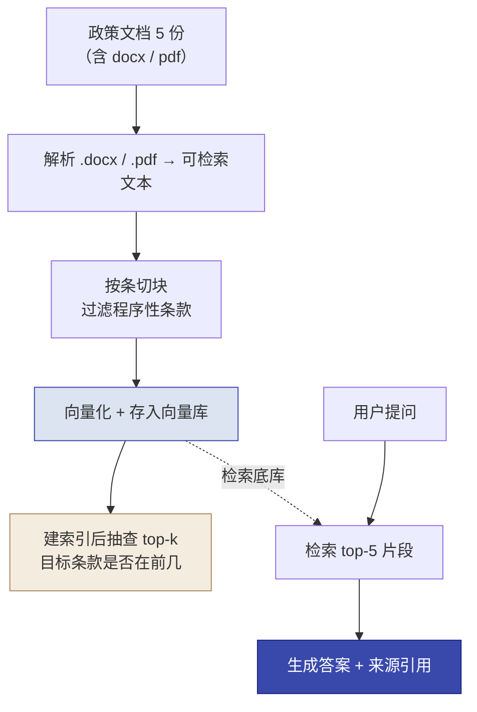

# 第 10 章  实操三 · 政策法规 RAG 问答系统（场景 B）

> **本章定位：** 实操单元 · **角色 = Delta** · Prototype 阶段 · 模式 = **AI 施工**（opencode + gstack）· **场景 B**
> **本章产出：** 一个可运行的**政务政策问答系统**（市民/坐席输入政策问题→检索政策库→生成**带来源引用**的回答）+ Streamlit 对话界面 + 一轮完整 gstack 交付件。
> **承接：** 第 6 章《解决方案框架》场景 B；第 8 章实操二成果；第 9 章 RAG 方法。
> **延伸阅读：** 本书第 9 章（RAG 知识底座：9.1 开卷考试、9.2 核心链路、9.9 双指标验收）。
> **实验手册：** Q&A 验证集、启动提示词参考答案、gstack 安装速查、灵魂追问与讲师要点见《实验手册》**`labs/lab3-policy-rag.md`**；政策文档素材见 `labs/lab3-policy-docs/`——本实操正文只保留"方法与验收"。

---

## 本章导学

- **学习目标：**
  1. 复用实操二练熟的"启动提示词 → gstack 八环节 → checkpoint 把关"工作流；
  2. 施工 RAG：读懂政策文档（含 docx/pdf 解析）→ 分块 → 向量化 → 检索 → 生成 + 来源引用；
  3. 把"**答案可追溯**"作为政务命门落地为**双指标验收**（答案准确率 + 来源可追溯率）；
  4. 掌握 RAG 特有的几个决策点：切块策略、top-K、检索不到兜底、建索引后抽查。
- **前置知识：** 第 9 章（RAG 链路与选型）、第 8 章（施工工作流）、第 6 章（西岭场景 B）。
- **章节地图：** 本章是 Delta 侧**第二个**施工实操（坡度第二级：检索 + 生成）。坡度递增：分类器（一把梭）→ RAG（检索+生成）。

---

## 实战演练

### 知识背景（呼应第 9 章）

> **这一轮在 Ch9 坐标系里的位置：**
> - **开卷考试（9.1）**：本实操落在四层级金字塔第 2 层 RAG——先检索政策片段，再基于片段作答并标注来源；不用微调（政策常更新、需溯源、易幻觉）、不用纯关键词搜索（语义鸿沟）。
> - **核心链路（9.2）**：离线建库（解析→分块→向量化→存库）做一次，在线问答（检索→生成 + 引用）做多次；政策更新只需重建索引，不用改模型。
> - **双指标（9.9.3）**：答案准确率 + 来源可追溯率，是政务 AI 的准入门槛——答必须带出处、检索不到不能编。
> - **从最简单开始（9.6.3 / 9.7.3）**：本实操用基础向量检索（Chroma + top-K），不堆叠混合检索 / 重排；当评估发现某类查询持续差，才按 9.7 逐段升级。
> - **数据不出域（7.4）**：本实操 embedding 走 API（如硅基流动 bge-m3）的前提，是实操二已确认本项目数据可出域；若数据不能出域，应切到本地向量库与本地 embedding（第 7 章 7.4 的私有化路径）。
> - **最小工具契约（供后续复用）**：本实操的检索能力将被封装为 **`search_policy`** 工具——**输入**：用户问题；**输出**：带来源的证据片段列表。每个证据带**来源元数据**：`source_file`（原始文件）/ `normalized_file`（归一化文本）/ `article`（条款）/ `excerpt`（摘要），供"来源可追溯"与 **实操四B** 复用，并守住"无证据不回答"的底线。元数据字段现在建好，后面建索引、答引用、做本体（15.7）都不用返工。

### 任务书（来自第 6 章方案框架 · 场景 B）

> 打开第 6 章《解决方案框架》场景 B："政务政策知识问答——让市民问政策，系统直接给答案，还得告诉他是哪份文件、哪条规定的，免得坐席背锅。"
>
> **技术方案（已在实操一定）：** RAG（不是微调、不是纯关键词搜索）——政策文件会更新、答案必须可溯源、不能凭模型记忆瞎答。技术栈：opencode + gstack + DeepSeek + 向量库 + Streamlit。

### 课前准备

- [ ] opencode、gstack 已装（实操二装过，可复用）
- [ ] DeepSeek API key 已配置
- [ ] **向量库 + embedding 依赖已装**（见下方环境准备）
- [ ] 已通读第 6 章《解决方案框架》场景 B 部分
- [ ] 已查看实操二的《AGENTS.md》和《retro.md》（交接经验）
- [ ] 政策文档素材在手（`labs/lab3-policy-docs/`，5 份混合格式）
- [ ] 创建本实操目录 `实操三-政策问答/`

**环境准备（向量库 + embedding）：** RAG 比分类器多了两样东西——向量库和 embedding 模型。让 Agent 帮你装（含：清华镜像 pip、GitHub ghfast 代理、独立 venv、装 chromadb、配置 embedding API（如硅基流动 bge-m3）写进 .env）。**验证标准：装完必须实际跑一行 import + 调用，确认返回向量维度**——`pip list` 显示"已安装"可能是假象（环境变量泄漏加载到残缺包），务必实测。

> **embedding 两条路：** 本实操用 **API 优先**（如硅基流动 bge-m3）——免运维、验证快；本地跑要下载 2GB+ 模型和 torch、机器差会卡死。若 API 不可用再降级本地。

**政策文档（`labs/lab3-policy-docs/`）：**

| 文件 | 格式 | 内容 |
|------|------|------|
| 社保参保政策.md | Markdown | 6章27条 |
| 医保报销政策.md | Markdown | 7章28条 |
| 保障性住房政策.md | Markdown | 7章27条 |
| 户籍迁移政策.docx | **Word** | 7章23条 |
| 就业创业补贴政策.pdf | **PDF** | 6章33条 |

> `.docx` 和 `.pdf` 要先做**格式解析**（转成可检索文本）再分块向量化。政策文档是素材目录下的真实文件，**施工时让 Agent 从该目录读取，不让 Agent 自己编政策内容**。

---

### 演练流程

#### 环节 1 · 写启动提示词（★本轮核心）

> **这不是让 AI 干的活，是你（Delta）的活。** 流程和实操二一样，但你这次有了经验，且场景 B 的 7 项信息内容不同。对照第 6 章方案框架场景 B 填：

| # | 信息块 | 本场景内容 |
|---|--------|-----------|
| 1 | 背景与角色 | "我是 FDE 团队的 Delta，施工场景 B：政务政策问答" |
| 2 | 要做什么 | "政务政策知识问答系统，基于政策文件回答市民咨询" |
| 3 | 输入输出 | "输入一个政策问题，输出：回答 + 来源引用（哪份文件、哪一条）" |
| 4 | 技术选型（含理由） | "已选型 RAG，不用微调（政策常更新、需溯源）、不用纯关键词搜索（语义鸿沟）" |
| 5 | 数据现状 | "政策库在 Lab3-policy-docs/（5 份混合格式）+ Q&A 验证集；政策会更新，需重建索引" |
| 6 | 验收口径 | "答案准确率 ≥80% + 来源可追溯率 ≥90%（双指标）" |
| 7 | 约束与边界 | "答案必须带来源引用，不能凭模型记忆瞎答；API key 走环境变量" |

**Step 1 写出 7 项信息 + 政策文档路径 + Q&A 验证集；Step 2 用自查问题审查（同实操二 7 个自查）；Step 3 附上 Q&A 验证集（6 条，让 Agent 落盘 `tests/qa_pairs.csv`）。**（Q&A 验证集全文与启动提示词参考答案见《实验手册》`labs/lab3-policy-rag.md` 附录 D。）

> **本阶段最容易漏的两处：**
> - **数据现状写"政策会更新，需重建索引"**——漏了 Agent 可能不做索引更新机制；
> - **验收口径写"来源可追溯率"这个指标**——漏了 Agent 只优化答案对错、不重视引用（可溯源是政务命门）。
>
> **验证集设计（教学点）：验证集问题不要设计得太宽。** 一个宽问题往往覆盖多个条款（如"外地户口能交社保吗"同时涉及稳定就业/灵活就业两条），单条款锚定必然歧义。**拆细**（稳定就业→第15条、灵活就业→第16条）能同时提升验收稳定性和教学清晰度。

#### 环节 2 · 注入并跟进八环节

注入：把启动提示词灌进 `/office-hours` + 附驱动指令（同实操二：环节产出落盘、禁止全自动、拍板点列选项——完整写法见《实验手册》`labs/lab3-policy-rag.md`）。

**跟进八环节，你的把关点（相比实操二，新增 RAG 特有的检查）：**

| 环节 | Agent 会做什么 | 你的 checkpoint |
|------|--------------|----------------|
| office-hours | 追问数据、口径、溯源 | 回答文档/口径问题；确认"值得做" |
| spec | 死磕 No-Go、数据模型、验收口径 | "答案必须带来源"写进 SPEC了吗 |
| autoplan | 暴露 RAG 决策等你拍板 | **真的拍板**：切块策略、top-K、检索不到怎么办 |
| build | 文档→分块→向量化→检索→生成 | 文档来自 Lab3-policy-docs、非 Agent 编；5 份都读全（含 docx/pdf）；**建索引后抽查检索（见下）** |
| review | 两遍检查，P0–P3 | 修 P0/P1；API key 没硬编码；embedding 无硬编码模型名 |
| qa | 真实跑 + 边界 | 用 Q&A 验证集测；双指标达标 |
| ship | 版本+CHANGELOG+README+commit | .env 未入库 |
| retro | 复盘四点 | 摩擦写具体；有行动项 |

**施工阶段必做的一个验证动作——建索引后抽查检索：**


*图 10-1：本实操施工主链路——离线建索引 + 在线问答，建索引后先抽查 top-k 再验收*

> 这条"建索引后抽查"是 RAG 施工最容易被跳过的动作，详见下方决策点 5。

**关键决策点（RAG 特有，Agent 停下时你要拍板）：**

1. **切块策略**：政策文档天然按「条」组织，**推荐按条切块**（正则匹配行首"第X条"，每条一块，条款号随块保留）——引用粒度天然对齐"第X条"，与验证集零转换。固定长度切块会一次塞好几条政策、切断条款号，不推荐。**注意程序性条款**（"本政策由XX负责解释/自XX起施行/有效期"）对所有问题都呈中等相似度、相互高度相似，会污染检索——**建索引时建议过滤**。
2. **检索数量（top-K）**：太少答案不全、太多噪声大——实测 **top-5 配合程序性条款过滤**效果稳定。
3. **检索不到怎么办**：**绝不能编**——应明确说"政策库中未找到，建议咨询人工"。相似度阈值只是"进生成的门槛"，检索到相似度不高的片段进了生成后，**拒答靠提示词约束模型判断兜底**——两层防线，验收各测一条（准备 1–2 条库外问题实测拒答）。
4. **来源引用格式**：要显示"文件名 + 条款号"——这是政务可溯源的底线。
5. **建索引后必须抽查检索**：建完索引，对每条验证集问题输出 top-k 排名，人工扫一眼目标条款在不在前几。**不抽查直接验收，目标条款可能被程序性条款挤掉，首轮必 FAIL、白花几十分钟**——这是 RAG 施工最实用的经验。

> **自查追问：** Agent 在 autoplan 问"检索不到时模型怎么回答"——你不能说"你看着办"。为什么？因为 **政务场景，编造政策答案是事故**（坐席/平台要负责）。你必须拍板"检索不到必须明说，不能编"。这个决策 AI 不知道严重性，只有你知道。

#### 环节 3 · 验收与收尾

**Step 1 核对交付物：**

```
实操三-政策问答/
├── 01-office-hours.md
├── SPEC.md                   # 含失败模式 + No-Go + 数据模型 + 验收口径
├── SPEC-决策记录.md           # autoplan 拍板记录
├── docs/                     # 政策库（从 Lab3-policy-docs/ 读取）
├── src/                      # 分块/向量化/检索/生成模块
├── streamlit_app.py          # 对话界面
├── tests/qa_pairs.csv        # Q&A 验证集
├── review.md / qa-report.md
├── VERSION / CHANGELOG.md / README.md
└── retro.md
```

**Step 2 验收口径（双指标）：**

| 指标 | 要求 | 判定机制 |
|------|------|---------|
| **答案准确率** | ≥80% | 让 LLM 语义评判：对照 expected_answer 判"一致/不一致" |
| **来源可追溯率** | ≥90% | 严格比对：引用的"文件名+条款号"与 expected_source 一致才算对（条款号归一化：'第16条'/'第十六条'都算 16；漏引/错引/不符都算未达标） |

> **为什么"答案对但来源错"也要扣分？** 政务命门是可溯源——答案对了、来源引错了，等于让市民去核对一个不存在的文件，比不答更糟。
>
> **统计提示：** 6 条验证集上，"可追溯率≥90%" 意味着最多只能错 1 条（5/6≈83% 就挂了）。对"差一条就不过"的线要有心理预期。

**Step 3 模拟向小王演示：**
- 用她听得懂的话讲（别说"RAG""向量检索"）；
- 演示一个"带来源引用"的回答——"系统答完还告诉市民哪份文件哪一条，你可以去核对"；
- 呼应她"答错政策担责任"的顾虑——"政策答错责任能追溯到文件，不用你背锅"。

> **自查追问：** 向小王演示时，为什么"来源引用"是最好的切入点？——因为她最怕"答错政策被追责"。**来源引用把"AI 答错了谁负责"从"坐席背锅"变成"按文件来、有据可查"。** 这正是场景 B 的核心价值。

**Step 4 写"演示级验收声明"（DoD）：**
> "本项目使用 5 份政策文档 + 6 条 Q&A 验证集，属**演示级验收**——结论仅证明方案在给定政策库和样本上可行，不宣称覆盖全部政策或达到生产可用。"

> **自查追问：** 为什么必须写这句？政务场景夸大更危险——**说"覆盖全部政策"而实际没有，市民按错误信息办事，责任是平台扛。**

#### 环节 4 · 复盘沉淀

- 看 Agent 的 retro；追加：**更新 AGENTS.md**（RAG 特有坑：程序性条款过滤、拒答两层防线）+ **改进交接**（下一轮场景 C Agent 开工前先看这条经验）。

---

### 产出物清单 & 验收标准（DoD）

**交付物：** 见环节 3 Step 1 文件树。

**验收标准（DoD）：**
- [ ] 启动提示词含 7 项信息块 + 政策文档 + Q&A 验证集 + 双指标验收口径
- [ ] Agent 按 gstack 八环节跑完，每环节有产出文件
- [ ] RAG 决策点都拍了板（切块策略 / top-K / 检索不到兜底 / 来源格式）
- [ ] "答案必须带来源"写进 SPEC；**建索引后抽查检索**（目标条款在前几）
- [ ] 5 份政策文档都读全（含 docx/pdf 解析），来自 Lab3-policy-docs、非编造
- [ ] 双指标达标（准确率 ≥80% + 可追溯率 ≥90%），拒答（库外问题）实测过
- [ ] .env 未入库，P0/P1 已修复
- [ ] 向小王演示"来源引用 = 责任可追溯"
- [ ] 写了"演示级验收声明"
- [ ] retro 更新了 AGENTS.md 与交接行动项

> （gstack 安装速查见 `labs/lab3-policy-rag.md` 附录 A；Q&A 验证集与启动提示词参考答案见附录 D；灵魂追问与讲师要点见附录 B/C。）

---

## 反模式与红线（本实操学习点）

- **不指定政策文档来源、让 Agent 自己编政策。** 内容必须来自 Lab3-policy-docs，不得编造。
- **retro 不抽查检索直接验收。** 目标条款可能被程序性条款挤掉 → 首轮必 FAIL。
- **只优化答案准确率、忽视来源可追溯。** 政务场景来源错误比答案错误更糟。
- **检索不到让模型编造。** 必须说"未找到，建议咨询人工"——编造政策是事故。
- **验证集设计得太宽（单条款锚定歧义）。** 拆细能提升验收稳定性与教学清晰度。

> [!IMPORTANT] **红线本处落地：答案可追溯。** 本章你亲手把"答案必须带来源 + 检索不到不能编 + 双指标验收"写进 SPEC 与 DoD——这是政务 AI 的准入门槛，也是导读页四条红线的本处闭环。

---

## 本章小结

- RAG 施工链路：读取（含 docx/pdf 解析）→ 分块 → 向量化 → 检索 → 生成 + 来源引用。
- **Gstack 流程复用**实操二，新增 RAG 特有决策点：切块策略、top-K、检索不到兜底、建索引抽查。
- **政务命门 = 答案可追溯**：双指标验收（答案 ≥80% + 来源可追溯 ≥90%），"检索不到不能编"是底线。
- 演示级验收声明 + 向小王讲"来源引用=责任可追溯"。
- **本体贡献**：建立"诉求—政策条款—政策文件"的依据关系（业务本体的输入，见第 15 章 15.7）。

**动手自检：**
- [ ] 我能独立写含 RAG 特有信息（政策文档 + QA 验证集 + 双指标）的启动提示词吗？
- [ ] 我能说清"为什么按条切块、为什么要过滤程序性条款"吗？
- [ ] 我能说清"检索不到为什么不能编、两层防线是什么"吗？
- [ ] 我能说清"为什么答案对但来源错也要扣分"吗？

---

## 练习与思考

- **基础：** 默写 RAG 施工链路；说出实操二/三的核心区别（一次调用 vs 检索+生成）。
- **进阶：** 用"拆细验证集"原则，把"外地户口能在西岭交社保吗"拆成两条，说明各锚定哪个条款、为什么更稳。
- **挑战（迁移练习/升级路径）：** 想对齐完整版 RAG 工程可按需升级——①**混合检索 + 重排序**（bge-m3 hybrid + bge-reranker-v2-m3，召回 top-100→top-10）；②**RAGAS 三维评估**（忠实度/上下文精度/回答相关性替代/补充双指标）；③**生产化**（ACL 元数据、增量更新而非全量重建）。说明每项该在"什么时候发现问题再上"，而非一开始堆砌。

---

## 在线全书

- 见在线全书 https://www.cloudzun.com/fde-course/（第 16 章 AI FDE 落地 · Delta 技术与场景）——向量库（Chroma/Milvus）、embedding（bge-m3）、本土 RAG 技术栈的落地方案。
- **实验手册：** 政策文档（`labs/lab3-policy-docs/`）、Q&A 验证集、启动提示词参考答案见《实验手册》`labs/lab3-policy-rag.md`（与训练营"实操三"同源）。
- **下一章：** 本书 **第 11 章 Agent 系统设计**（坡度第三级：决策循环 + 自动化边界）。