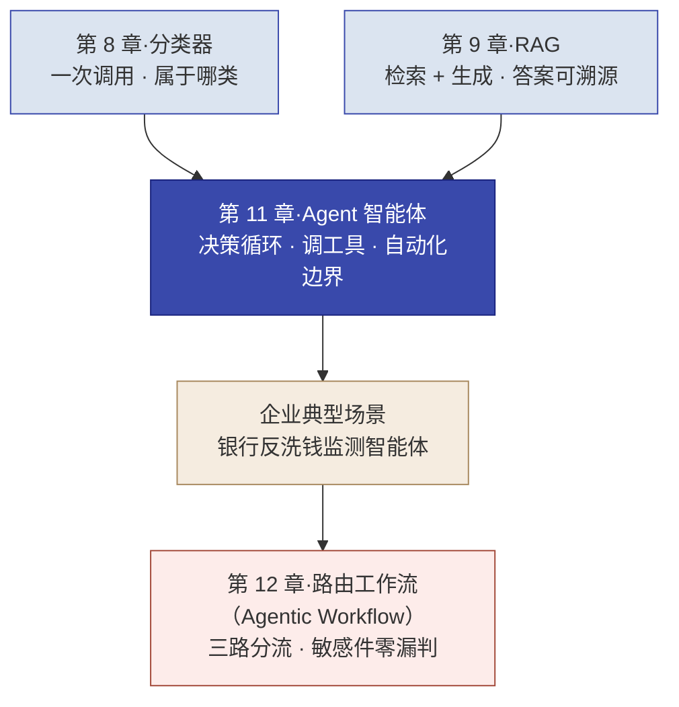
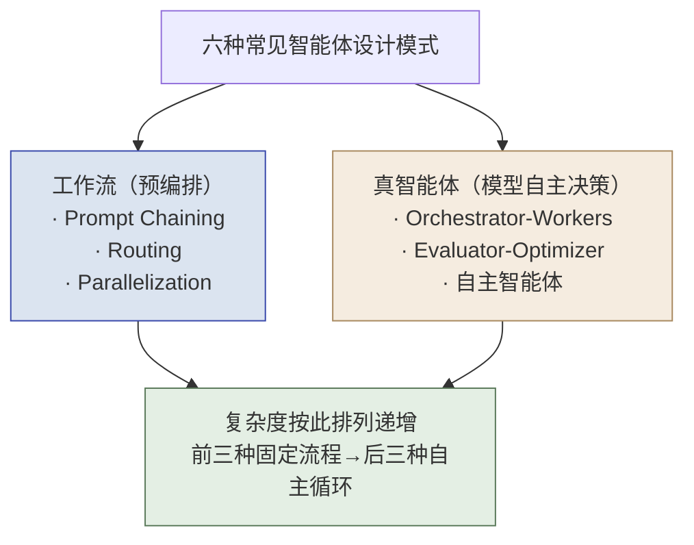
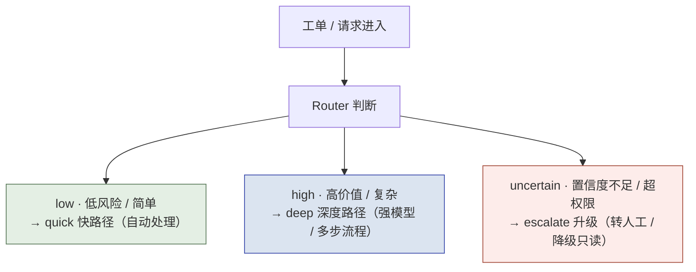
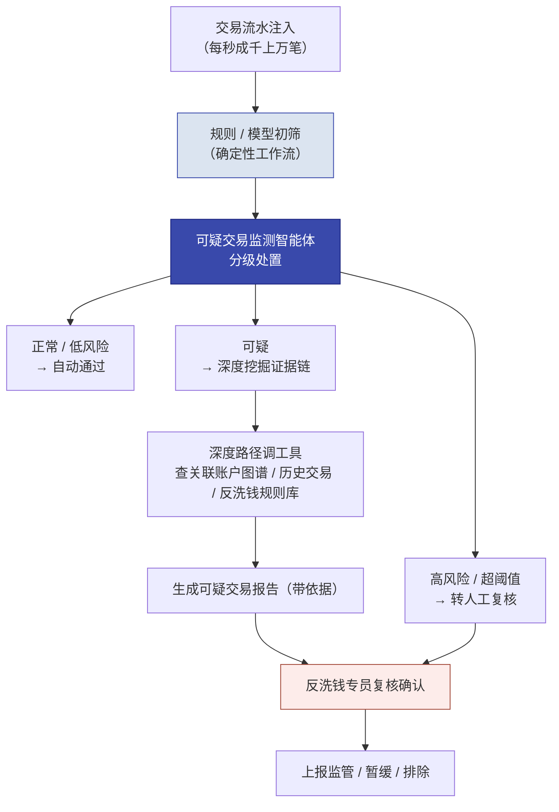

# 第 11 章  Agent 系统设计：自动化边界

> **本章定位：** 知识单元 · Delta / 方案设计方法（对准实操四），把第 7 章 LLM 四层级金字塔的第 4 层（Agent / 智能体）讲透，并落地本书四条红线里的"**敏感件零漏判**"。
> **本章产出：** 你能说清智能体（Agent）是什么、为什么是"输出之后还要继续做事"；分清 **Workflow / Agentic Workflow / Agent** 三种口径；区分智能体与工作流、理解编排工作流的工具，看懂六种常见设计模式（含"预定义/动态 × 单轮/闭环"二维判断）；用一个企业级真实场景（银行反洗钱可疑交易监测）看懂"工作流 + 智能体 + 人机回环"如何落地；掌握三路分流、假阳性/假阴性权衡、LangGraph 与 MCP、工具设计与**工具调用工程化（超时/重试/幂等/审计/降级）**与三层安全护栏，并把**自动化边界**做成 FDE 的核心业务决策。
> **建议读者：** Delta（施工主力必读，直接用于实操四）与 Echo（自动化边界的业务判断需双角色共识）均适用。
> **前置：** 第 7 章（四层级金字塔 7.2、选型三要素 7.3）、第 8 章（一次调用 = 分类）、第 9 章（检索 + 生成 = RAG）。
> **适配说明：** 版本与数据信息截至 **2026 年 8 月**；技术栈迭代快，落地前按各家官方最新文档复核。

---

## 本章导学

- **学习目标：**
  1. 给出智能体（Agent）一个明确的定义，说清它与普通 LLM、RAG、**工作流（Workflow）与智能体工作流（Agentic Workflow）**的本质差异（自主性 + 决策循环）；
  2. 理解工作流（Workflow）概念与编排工作流的工具（Dify / Coze / LangGraph），说清平台与框架该用哪个；
  3. 识别六种 Agentic 设计模式，用"预定义/动态路径 × 单轮/闭环迭代"二维判断给模式归类，讲清"工单分级为什么用 Routing 不用 Orchestrator-Workers"；
  4. 用一个企业级场景看懂"工作流 + 智能体 + 人机回环"的长相，以及四条红线如何落地（含"给定验证集召回率 100%"的零漏判口径）；
  5. 讲清 Router 三路分流与假阳性/假阴性的权衡，落地"敏感件宁可多升级、不可漏"；
  6. 掌握 LangGraph 与 MCP 的工程机制、工具设计与**工具调用工程化（超时/重试/幂等/审计/降级）**、三层安全护栏；
  7. 把"什么该自动化、什么必须留给人"按三问框架做成本文里的业务决策。
- **前置知识：** 第 8 章（分类器：一次调用）、第 9 章（RAG：检索 + 生成）、第 7 章（四层级金字塔，智能体在最高层）。
- **章节地图：** 第 8/9 章是"给定输入→生成输出"（分类一个类、RAG 带来源的回答）；从本章起的智能体是"**输出之后还要继续做事**"——根据中间结果调工具、多步流转、自主决策。本章既有实验视角（对准第 12 章实操四），也把它放到企业真实场景里看；你是先看清"业界怎么用智能体"，再回到实验里亲手做一个。

*图 11-1：本章位置——智能体是"输出之后还要去做事"的最高能力层，先看企业场景再看实操四*

---

## 11.1 Agent 是什么：智能体与决策循环

### 11.1.1 一个明确的中文名与定义

**中文名**：Agent 在中文里尚无统一的权威译名，业界普遍称"**智能体**"，也有人叫"智能代理""AI 代理"。本书统一采用"智能体"（agent）。

**定义**：智能体是一种在目标驱动下**自主运转**的 LLM 系统——它能感知输入与环境，规划下一步，调用外部工具执行动作，观察结果，并据此修正决策，循环直至任务完成。它与普通调用最本质的三个特征是：

1. **目标驱动**：接到的是"把事情完成"的目标，而不是"回答这一句"；
2. **能调用工具 / 与环境交互**：读写数据、调接口、执行动作，不止动嘴；
3. **能根据中间结果自主决策**：看到结果后决定下一步，而不是一次性吐完答案。

> 通俗但准确的口径：普通 LLM 是"会说话"，RAG 是"会查资料再说话"，智能体则是"**会干活，并且会用干活的结果继续改良地干活**"。
>
> **提前说清三个词（完整辨析见 11.3.4）：** 本书严格区分 **工作流（Workflow，流程写死）**、**智能体工作流（Agentic Workflow，路径预编排、节点由 LLM 决策）**、**智能体（Agent，自主决策循环，路径不可穷举）**——第 12 章的工单三路路由按严格定义属于 Agentic Workflow，广义业界也常称其为 Agent，本书采用教材口径（见 11.3.4）。

### 11.1.2 三档能力对比

用一张表把三档放一起：

| 层 | 比喻 | 能力 |
| :--- | :--- | :--- |
| **普通 LLM** | 嘴 | 只会说话——你问它答它 |
| **RAG** | 嘴 + 图书馆 | 查资料再说话——从知识库检索增强回答 |
| **Agent（智能体）** | 嘴 + 手 + 大脑 | 查资料、调工具、做决策——根据中间结果决定下一步 |

### 11.1.3 决策循环：智能体的本质

智能体的本质是一个**循环**，而不是一次调用：

- **观察**：拿到输入（一个工单、一笔交易、一个任务）。
- **思考**：判断当前情况属于哪类、下一步做什么。
- **行动**：调用工具、查数据、生成处置意见。
- **再看结果**：决定直接交付、继续处理，还是升级人工。

以工单分级为例：智能体判断"这是跨部门诉求"后不会停下，而是继续——查部门职责库 → 生成深度处理意见 → 决定要不要转人工。这就是"决策循环"。

| 维度 | 单次 LLM 调用 | 工作流（预编排） | 智能体（自主循环） |
| :--- | :--- | :--- | :--- |
| 可控性 | 最高（单步、可预测） | 高（流程固定，决策点可审查） | 低（模型自主决策，路径不可穷举） |
| 成本 | 基准（1 次调用） | 中（多次调用，次数固定） | 高（调用次数不定，含规划 / 反思 / 重试） |
| 延迟 | 最低 | 中（串行步骤叠加） | 最高（多轮往返 + 工具执行） |
| 失败模式 | 单点幻觉 / 格式错误 | 步骤固定，失败点可定位 | 级联失败、循环空转、越权动作 |
| 适用场景 | 分类、抽取、生成等单步任务 | 固定流程的文档处理、检索后生成 | 开放任务、多工具编排、环境交互 |

> **口径说明（信息截至 2026-08）：** 各方普遍认同"智能体比单次调用更贵、更慢"，但**"成本 2-10 倍"不是官方数据**——它源自一项"多智能体 vs 单智能体"的研究语境，并非"智能体 vs 单次调用"的通用倍数。本书不引用具体倍数，只采用官方定性：智能体复杂度的代价是**更高成本、更多失败点、更长延迟**。

---

## 11.2 适用边界："从最简单开始"

对照第 7 章"从最简单开始"纪律，选该用哪一层：

| 方案 | 关键判断 | 何时用 |
| :--- | :--- | :--- |
| 分类器（一次调用） | 输入 → 一个类别，贴完标签就结束 | 只需"归类"，无需后续动作 |
| RAG | 先检索再生成，答案可溯源 | 需"基于文档精确回答 + 可溯源"，无需多步动作 |
| **工作流 / Agentic Workflow** | 固定可枚举的步骤序列（部分节点可由 LLM 决策） | 步骤确定、路径可枚举，不需要模型自主规划循环 |
| **智能体** | 输出之后还要继续"做事"（调工具 / 多步流转 / 决策） | 需要"自主决策 + 调工具 + 多步流转"且路径不可预写 |

> **核心纪律（呼应第 5 章与 7.2）：** 从最简单的方案开始，仅在必要时增加复杂度——**这可能意味着根本不要构建智能体系统**。分类器够用就别上 RAG，RAG 够用就别上工作流，能用固定工作流（含 Agentic Workflow）就别上自主智能体。智能体是复杂度的最后一级，不是默认选项。

---

## 11.3 工作流、编排工具与六种设计模式

### 11.3.1 工作流（Workflow）的概念

在正式讲设计模式之前，先看清"工作流"这条路，因为**六种模式的前三种本质就是工作流**。

工作流（Workflow）是把一条业务处理步骤**固定下来、按预先写好的顺序执行**：每一步做什么是确定的，程序或模型只是依次完成。它的特点是**可控、可预测、失败点可定位**。典型例子：文档审核流程——抽文档 → 抽关键字段 → 校验格式 → 归档，四步依序跑完。

与智能体的区别一句话：**工作流的"下一步"是写死的，智能体的"下一步"是模型自己决定的。**

### 11.3.2 编排工作流的工具

现实中"编排工作流 + 挂局部智能体"有两条主流路线：

| 工具 | 形态 | 适合谁 / 何种复杂度 | 特点（截至 2026-08） |
| :--- | :--- | :--- | :--- |
| **Dify** | 开源低代码 / 可视化编排平台 | 业务与工程协同、快速搭"工作流 + 局部智能体" | 拖拽搭工作流，内置多模型，可接 MCP；版本以官方发布为准 |
| **Coze（扣子）** | 低代码智能体平台 | 快速搭建、弱化代码、工具市场丰富 | 支持本地 + 云端智能体协同，可接入开源 Agent（如 Claude Code 等）；版本以官方发布为准 |
| **LangGraph** | 代码级编排框架 | 复杂、可编程、要深度定制的生产逻辑 | 用代码描述节点与条件边，精细控制状态与生命周期；版本以官方发布为准 |

> **判读：** 业务要参与配置、要几天内上线、逻辑不算非常复杂 → 先考虑平台（Dify / Coze）；逻辑复杂、要深度定制、要精细控制状态与错误处理 → 用代码框架（LangGraph）。两条路不是互斥，越来越多企业用**平台搭骨架 + 代码框架做复杂节点**。

### 11.3.3 六种模式全景

| 模式 | 是什么 | 何时用 | 何时不要用 | 复杂度 |
| :--- | :--- | :--- | :--- | :--- |
| **Prompt Chaining**（提示链） | 任务拆成固定步骤串行，前步输出喂后步 | 流程固定、可分解、可逐步调试 | 需动态分支或反馈 | 低 |
| **Routing**（路由） | 分类输入并导向专门处理分支 | 任务分几类、每类处理逻辑固定且分类可靠 | 类别边界模糊、分类不可靠 | 低 |
| **Parallelization**（并行化） | 并行执行多个独立子任务后汇总 | 子任务独立、可并行 | 子任务间有强依赖 | 中 |
| **Orchestrator-Workers**（编排者-工人） | 中央编排者动态拆解任务、分派给工人、汇总结果 | 子任务数量/类型动态变化、无法预写死 | 子任务固定且少——直接写流程更简单 | 高 |
| **Evaluator-Optimizer**（评估-优化） | 生成器产出 → 评估器评判 → 不达标回炉 | 有明确质量标准、迭代能明显改善 | 评判标准模糊、单轮生成已够好 | 中 |
| **自主智能体**（Autonomous Agent） | 模型自主规划、调工具、观察、循环直至完成 | 开放探索、大量工具与环境交互 | 有简单固定流程可替代时 | 高 |

### 11.3.4 工作流类 vs 真智能体：术语三分（教材口径）

六种模式里，前三种（提示链 / 路由 / 并行化）属于**工作流**——流程是**预编排**的，模型在每个固定步骤内做出应答；从 **Orchestrator-Workers** 开始才属于**真智能体**——模型自主决定下一步调谁、要不要拆任务。

不过"预编排"里有两种情况需要分开，本书统一用三分口径（**与第 12 章一致**）：

| 术语 | 定义 | 例子 |
| :--- | :--- | :--- |
| **工作流（Workflow）** | 步骤与判断都预先写死，LLM 只做固定步骤内的单点应答 | 抽字段 → 校验 → 归档；规则初筛 |
| **智能体工作流（Agentic Workflow）** | **路径预编排（可枚举）**，但若干节点由 LLM 决策（分类、抽取、选择分支） | **三路路由（Routing）**：LLM 判档 → 固定分支动作 |
| **智能体（Agent）** | 模型自主规划、调工具、观察、循环，路径不可穷举 | 开放探索、多工具动态编排 |

> [!NOTE]
> **为什么第 12 章的"路由"要叫 Agentic Workflow 而不是 Agent？** 它的主体流程是 `State → 判档 Node → Conditional Edge → 固定分支动作`——**分支是预先枚举的**，模型只在"判档"节点做决策，没有自主规划循环。按本书严格定义它属于 **Agentic Workflow（LLM 驱动的预编排路由工作流）**；广义业界（含部分厂商宣传）常把这类系统也称为"Agent"，本书教材口径不采用广义说法（避免把"预编排工作流"误写成"自主智能体"）。若坚持称 Agent，主体实操需补上动态工具选择、基于工具结果再决策、最大迭代次数、持久化中断与人工恢复等能力。

*图 11-2：六种模式分成工作流与真智能体两类，复杂度逐级递增*

### 11.3.5 工单分级为什么用 Routing 就够

第 12 章实操四的工单分级：任务天然分三档（咨询 / 跨部门 / 敏感），每档处理逻辑固定。**用 Routing 就够，不需要 Orchestrator-Workers 那种会"自我分解任务"的动态编排**——不为 6 类工单搭一个最贵最慢的复杂智能体，这是 FDE"从最简单开始"的判断（呼应 11.2，且口径上它是 **Agentic Workflow**，见 11.3.4）。

> **一个企业事实（呼应本章视野）：** 生产里**绝大多数"智能体系统"其实是"工作流 / Agentic Workflow + 局部智能体"的混合**——固定流程由工作流承担，少数需要判断/调工具的节点放一个小智能体，而不是整套都是几十个自主智能体来回奔跑。11.5 的银行反洗钱场景会完整演示这种混合形态。

### 11.3.6 六种模式的二维判断：预定义/动态路径 × 单轮/闭环迭代

六种模式除了"按复杂度排队"，更实用的归类是**二维判断**——看"路径能不能预先写死"和"要不要多轮迭代"：

| | 路径：预定义（可枚举） | 路径：动态（拆解不可预写） |
| :--- | :--- | :--- |
| **迭代：单轮（一次完成）** | **Prompt Chaining**、**Routing**、**Parallelization** | **Orchestrator-Workers**（一次分派汇总，可迭代但主形态单轮） |
| **迭代：闭环（循环至达标/完成）** | **Evaluator-Optimizer**（固定"生成→评估→回炉"环） | **自主智能体**（观察-思考-行动循环） |

> **读法：** 先问"路径能不能预写死"——能 → 工作流类（前三种），不能 → 真智能体类（后两种 + 自主智能体）；再问"要不要闭环迭代"——决定是否需要 eval 环节或循环上限。**工单路由是"预定义路径 × 单轮"**，所以连闭环都不需要，更验证了 11.3.5"用 Routing 就够"。

### 11.3.7 从 Routing Workflow 到受控 Agentic Loop（实操四B）

第 12 章（实操四）是"预定义路径 × 单轮"的路由工作流；当"路径不再能预先枚举"时，就进入**受控 Agentic Loop**——由**无编号实操四B（Lab4B）**承担（不进入五个编号实操，作为高级附加实验）。两者的边界用"下一步由谁决定"来切：

| 维度 | 第 12 章 · 路由工作流（Routing Workflow） | 实操四B · 受控协同 Agent（Lab4B） |
|---|---|---|
| 下一步 | 预先写定：State → 判档 → 条件边 → 固定分支动作 | 按目标 + 当前状态动态选择 |
| 工具 | 固定调用 `check_department` | 从多个工具中按需选择（分类 / 查政策 / 查部门） |
| 观察后重规划 | 无（一次判断到位） | 有：工具结果（如信息冲突）可触发换工具或重新判断 |
| 信息不足 | 固定转人工 | **主动追问**（`ask_clarification`）后再继续 |
| 人工介入 | 敏感件固定转人工 | `request_human_review`（配合 interrupt + resume 真暂停—恢复） |
| 停止条件 | 分支到达即结束 | 完成条件满足即结束；达到最大步数 / 触及风险边界即暂停或停止 |

> **说明：** 实操四B 从头构建独立项目、不复制第 12 章代码，但复用本章的 LangGraph、工具设计和 HITL 概念（手册见《实验手册》`labs/lab4b-cooperative-agent.md`，不要求全员必做）。判断"该用工作流还是 Agentic Loop"的方法就是二维判断：**路径可枚举 → 路由工作流；路径不可枚举或需反复观察 → 受控 Agent**。

---

## 11.4 Routing：三路分流设计

### 11.4.1 Router 模式

Routing（路由）把一个输入分类后导向**专门的处理分支**——每类用不同的提示词、工具或子流程。它是工作流里最常被用到的一种（**口径：Agentic Workflow**，见 11.3.4），典型场景就是客服路由（一般咨询→技术 / 计费 / 投诉等不同分支）。

### 11.4.2 三路分流：low→quick / high→deep / uncertain→escalate

把 Router 落到"按价值与风险分级"上，是一种实用骨架（教材提炼，支撑资料见 mcp-agent Router 与 OpenClaw Model Router）：

*图 11-3：Router 三路分流——简单走快路径、复杂走深度路径、不确定升级人工*

> **一句话定位：** 上图主体流程是**预编排路由工作流（Agentic Workflow）**——`输入 → LLM 判档 → 条件边 → 固定分支动作`，模型只在判档节点做决策（口径见 11.3.4）。

### 11.4.3 工单分级的落地

第 12 章实操四的三档，正是三路分流的政务版本：

| 档位 | 对应 | 处理方式 |
| :--- | :--- | :--- |
| **咨询类**（简单） | low → quick | **自动答复**——模式固定、风险低，该自动化 |
| **跨部门类**（复杂） | high → deep | **深度处理 + 调工具**——AI 查部门职责库、生成处理意见，人可介入 |
| **敏感类**（投诉 / 举报 / 重大） | uncertain → escalate | **必须转人工**——政务安全底线；**验收口径：给定验证集召回率 100%，生产目标为零漏判** |

---

## 11.5 企业里智能体的典型场景：银行反洗钱可疑交易监测

> 前几节的分流、模式、边界看起来还停留在"判工单档"的维度。这一节用一个**真金白银、合规高压**的企业级场景——银行反洗钱可疑交易监测，把前面讲的东西拼起来，也解释为什么会选它：**它同时踩响四条红线、天然是三路分流 + 工作流 + 人机回环的形态，最贴合本书"乙方 + 银行科技部"的两类读者。**

### 11.5.1 为什么看这个场景

反洗钱（AML, Anti-Money Laundering）监测是银行必须合规完成的硬任务：每天海量交易，要找出其中可能"洗钱"的可疑交易并上报监管。特点恰好是：

- **数据敏感**：金融数据不能出域，必须内部部署（红线"数据不出域"）；
- **错过后果严重**：可疑交易漏报是合规事故，代价极高；
- **判断有依据要求**：上报要讲清"为什么可疑"（红线"答案可追溯"）；
- **必须人机回环**：拍板上报/暂缓只能由反洗钱专员负责，AI 只能"建议"（红线"人能判断、AI 能执行"）。

### 11.5.2 它长什么样：数据流转

*图 11-4：银行反洗钱可疑交易监测智能体——初筛走确定性工作流，分级处置用智能体，高风险转人复核*

### 11.5.3 为什么它是"工作流 + 智能体"的混合

对照 11.3.2/11.3.5，这个场景是混合形态的教科书案例：

- **前置规则引擎初筛**＝确定性**工作流**：把明显正常/明显可疑的先过滤掉，速度快、成本低、可解释；
- **细分处置与证据挖掘**＝**局部智能体**：对"灰色地带"交易，用智能体判断该深挖什么、调哪些工具、怎么组织证据链；
- **高风险转人工**＝**人机回环**：复核、上报、暂缓永远由反洗钱专员拍板。

> **关键认知：** 这里看不到"一个聪明的智能体把一切都办完"。恰恰相反——**工作流承载确定性、智能体承担灵活判断、人守住最后决定权**。这正是"从最简单开始"（11.2）在企业级张力的体现：能确定就写死，需要判断才放智能体，涉险必留人。

### 11.5.4 四条红线如何落地

| 红线 | 在此场景的落地 |
| :--- | :--- |
| **数据不出域** | 金融数据隔离部署在内部网段，模型走私有化（呼应 7.4 本地部署） |
| **答案可追溯** | 可疑交易报告带依据：命中哪条规则、哪些交易/账户/关联图谱命中、来源可查 |
| **敏感件零漏判** | 可疑交易**漏报是合规事故**，宁可多报升级复核，不可漏；**验收口径：给定验证集召回率 100%，生产目标为零漏判** |
| **人能判断、AI 能执行** | 复核、上报、暂缓由反洗钱专员决定，智能体只能"建议"（人机回环） |

### 11.5.5 FDE 在这里的价值：能力回注

对 FDE 来说，这个场景最能说明"为什么不是外包做一次就完"：

- **识别（能力回注第一步）**：从"这家银行的反洗钱监测逻辑"里，去掉"这家行的交易字段、客户名单、具体阈值"这些客户特定内容，剩下的是"**规则初筛 → 分级处置 → 证据挖掘 → 人机回环上报**"这套通用机制；
- **抽象 → 集成 → 验证**：把机制做成可配置的风险监测智能体（规则、阈值、黑名单做成配置项），换一家银行、甚至换一个行业（如保险理赔欺诈监测）即可复用。

这就是第 3 章能力回注与第 15 章"碎石路 → 铺装公路"在企业级智能体上的具象——**FDE 交付的不只是"这一家的反洗钱系统"，而是一条能被下一个客户复用的"公路"。**

---

## 11.6 假阳性与假阴性：自动化边界的权衡

### 11.6.1 两个出错方向

把任何东西自动化，都可能错在两个方向：

| 概念 | 在智能体自动化中的含义 | 代价 |
| :--- | :--- | :--- |
| **假阳性（FP, False Positive）** | 不该打断时打断：正常交易被误判可疑、频繁转人工 | 信任流失、效率下降、"狼来了"效应 |
| **假阴性（FN, False Negative）** | 该拦时没拦：可疑交易漏报、越权动作放行 | 真实事故、数据损失、合规风险 |

> 反洗钱场景里，**假阴性（漏掉一笔真可疑交易）的代价远高于假阳性（多转人工复核一次）**——这正是上一节"宁可多升级、不可漏"的来源。

### 11.6.2 实测证据（信息截至 2026 年 8 月）

- **假阳性端**：有开发者复盘自己的审批门控，"11 个拦截里有 9 个是误报（把自己当成错误拦下）"——高误报率会让门控失去意义，用户开始机械点同意。
- **假阴性端**：人类在环的监督测试显示，人类审核者**放行了约 1/3 的危险智能体请求**——即使是人在环，也不能保证万无一失。

> 这两组证据都说明同一件事：**"靠直觉定自动化边界"不可靠**，必须在方案层面把"漏判的代价"显式算清。

### 11.6.3 政务敏感件铁律：宁多升级，不可漏

在政务敏感件（以及银行反洗钱这类合规场景）上，两个方向的代价严重不对称：

- **假阴性（投诉没升级、隐患没上报、可疑交易漏报）**：没人处理，可能酿成事故，代价极高；
- **假阳性（普通件多转一次人工）**：成本略高，但**有人兜底**，代价低。

因此铁律是：**"宁可多升级，不可漏"——敏感件验收口径为"给定验证集召回率 100%"，生产目标为零漏判。** 这既是成本矩阵的核心（呼应第 8 章成本矩阵），也是"人能判断、AI 能执行"（第 4 章）在自动化边界上的具体化。

> [!NOTE]
> **"零漏判"的准确表述：** 泛泛说"零漏判"不可验证。教材口径是**两步**：1. **给定验证集**（讲师/评分脚本持有的盲测集，含敏感件样本）上**召回率 = 100%**（一条不漏）——这是可以验收的；2. 生产环境目标为零漏判——这是持续监控的运营目标，靠"漏判上报 + 复盘回灌"逼近，而非一句承诺。

---

## 11.7 智能体工程底座：LangGraph 与 MCP

### 11.7.1 LangGraph：把"决策循环"画成图

LangGraph 是当前常用的智能体编排框架（截至 2026-08，版本以官方发布为准）。它用"图"描述智能体的决策循环，也常被当作 11.3.2 里代码级编排的代表：

| 机制 | 说明 |
| :--- | :--- |
| **State / Node / Conditional Edge** | StateGraph 用共享状态驱动；Node 是处理单元；普通边按顺序执行，Conditional Edge 按条件分支（如路由到不同节点） |
| **Checkpointing（持久化）** | 每次节点执行后把状态写入检查点，**按 `thread_id` 隔离会话**；支持断点恢复、时间旅行（回放） |
| **interrupt()（人机回环）** | 在图中"暂停、把控制权交给人类、收集输入后从断点继续"——HITL 的关键机制；恢复时**从已持久化的检查点继续**，已执行节点的结果不丢失 |
| **幂等性 / 副作用防护** | **框架不自动保证幂等**：恢复不会自动重放已执行节点，但副作用节点（发消息、改数据、调外部工具）是否重复执行取决于你的实现——需要自己用**幂等键 / 事务 / 补偿机制**保证（工具侧见 11.8.3） |
| **节点级 timeout / retry** | 为每个节点设超时与重试策略，避免在某个步骤卡死 |

> [!WARNING]
> **课前环境避坑（LangGraph 版本核验）：** `langgraph` 包**没有 `__version__` 属性**，直接访问 `langgraph.__version__` 会报错；应改用 `importlib.metadata.version('langgraph')` 核验已装版本。另外 LangGraph 只依赖 `langchain-core`，**不自带** `openai` / `pandas` / `streamlit`——只装上它会在使用时抛 `ModuleNotFoundError`，需按实际任务一并安装。

> **对第 12 章（路由工作流）：** 它是把"判断 → 查部门职责库 → 生成意见 → 转人工"编排成一张图；**固定转人工分支**即可承载敏感件兜底；`interrupt()` 的"暂停—接收人工输入—从断点恢复"在**实操四B（Lab4B）**真正实现（配合 `thread_id` 持久化，而非一次性输出）。

### 11.7.2 MCP：标准化工具接入协议

MCP（Model Context Protocol，模型上下文协议）是为了解决"每个工具一种接入方式"而生的**标准化协议**，核心是三个原语：

- **Tools**：可执行函数，模型决定是否调用；
- **Resources**：可读数据 / 上下文（文件、数据库记录、API 数据）；
- **Prompts**：可复用的提示模板。

截至 2026-08 最新规范为 **2026-07-28 版**（“问世以来最大更新”，提出"无状态核心"方向，[IT 之家报道](https://www.ithome.com/0/983/102.htm)、[Anthropic 官方博客](https://claude.com/blog/bringing-mcp-2026-07-28-to-claude)）。它对 FDE 的意义在于：**工具接入标准化后，同一套工具能被不同模型、不同智能体框架复用，是能力回注（第 3 章四步法）在工具层的落点。**

---

## 11.8 工具设计与国产模型注意点

### 11.8.1 工具定义的质量直接决定准确率

智能体的准确率**很大程度取决于工具定义质量**。设计一个工具（如"查部门职责库"）的原则：

- **描述具体，包含示例用法**——让智能体知道"什么场景该调它"；
- **写清何时用、何时不用**——避免误调；
- **参数命名直观**——用 `keyword` 而非 `text`；
- **边界情况写清楚**——查不到返回空列表而非报错；
- **传入必要上下文**——传工单全文而非单个关键词，避免丢上下文。

> 把工具描述当成"**写给一个初级工程师看的接口文档**"来写——描述越清楚，智能体调得越准。

### 11.8.2 国产模型 Tool Calling 的注意点

国产模型普遍兼容 OpenAI 的工具调用格式，但细节各家不同，落地前需逐模型核对（信息截至 2026-08）：

- **strict schema**：DeepSeek 官方 Tool Calls 文档新增 `strict-beta` schema 路径与"支持的 JSON Schema 子集规则"（该条目为第三方转述，官方原文需按官方文档复核）。
- **thinking 模式回传**：DeepSeek 思考模式下，assistant 消息含 `reasoning_content`（思维链）；**多轮工具调用时需把含 reasoning_content 的 assistant 消息一并回传**，否则上下文会丢失。

> [!TIP] **判读：** 若计划用国产模型做智能体，先把"工具调用成功率、strict 支持、思考内容回传"这三项在官方文档和实测里过一遍，再决定工具 schema 怎么落地。

### 11.8.3 工具调用工程化：超时、重试、幂等、审计、降级

工具"定义得好"只是第一步，**调用得稳**是第二条命脉。一个生产级工具调用要有五件套：

| 机制 | 要求 | 反例 |
| :--- | :--- | :--- |
| **超时（timeout）** | 每个工具调用设超时上限（如 10–30s），超过即按失败处理 | 调外部 API 卡死，整个智能体挂起 |
| **重试（retry）** | 失败自动重试**有限次数**（如 2 次）+ 退避；超过上限进入降级 | 无限重试把故障放大成雪崩 |
| **幂等（idempotency）** | **有副作用的工具**（发消息、改数据、扣款）必须带幂等键 / 事务 / 补偿——同一请求执行两次结果一致 | 断点恢复后重复提交、重复告警、重复扣款 |
| **审计（audit）** | 每次调用的入参、出参、耗时、由哪个模型决策触发，全部留日志 | 出事后无法复盘"谁让它干的" |
| **降级（degradation）** | 失败 → 重试 → **降级**（只读兜底 / 简化应答）→ **转人工兜底**；宁降级不硬撑 | 工具失败时装作成功、给用户错误结果 |

> [!CAUTION] **工具失败时"假装成功"是智能体工程最常见的翻车。** 兜底顺序是**失败 → 有限重试 → 降级（只读 / 简化）→ 转人工**，永远不要越过"转人工"这道线——尤其敏感路径（呼应 11.6.3 的"宁可多升级"与 11.9 三层护栏）。第 12 章路由工作流用固定转人工分支即可；**实操四B（Lab4B）**才把 `interrupt()`、持久化 `thread_id` 与工具超时/重试/降级纳入必做。

---

## 11.9 智能体安全与三层护栏

### 11.9.1 三层护栏框架

| 层 | 内容 | 典型做法 |
| :--- | :--- | :--- |
| **输入过滤** | 防注入、去敏、输入校验 | prompt injection 检测、PII 脱敏、输入校验、限流 |
| **行为约束** | 最小权限、工具白名单、审批门控 | 只给工作所需的最少工具权限，不给人发邮件 / 改数据的工具；越权自动拒绝 |
| **输出审查** | 校验输出、发布前复核、留审计日志 | 关键输出的风险校验、人工复核点、全链路可追溯（含 11.8.3 的工具审计日志） |

### 11.9.2 真实事故提醒

智能体失控不是科幻，已有真实案例（信息截至 2026 年 8 月）：

- **"9 秒删库"**：某 AI 编程代理把生产数据库当 bug 修复删掉，9 秒清空、**约 30 小时无法恢复**（[36氪报道](https://www.36kr.com/p/3786089052314628)、[搜狐转载](https://m.sohu.com/a/1016392488_115128/)）；
- **未授权交易**：某 Operator 代理在安全协议下仍执行了未经授权的交易；
- **人类监督漏检**：人类审核者放行了约 1/3 的危险智能体请求——"人在环"不是免死金牌。

> [!CAUTION] **结论：** 权限最小化 + 审批门控 + 人机回环是智能体安全的基石；把"关键/敏感路径必须暂停等人工"设计进流程，而不是依赖模型"自觉"。

### 11.9.3 人机回环（HITL）

人机回环（Human-in-the-Loop）指**关键/敏感决策路径必须能暂停、等待人工确认**。对政务与金融场景，凡是影响真金白银、安全、合规的路径，智能体只能"建议"不能"拍板"——这是第 4 章"人能判断、AI 能执行"在智能体侧的落地（11.5 反洗钱场景的高风险复核就是它）。

---

## 11.10 自动化边界：FDE 方案设计的核心业务决策

### 11.10.1 为什么这是业务决策而不是技术问题

"什么该自动化、什么必须留给人"不是"AI 能做多少"的问题，而是"**一旦出错代价多大、谁能负责**"的问题。AI 不知道"投诉没升级"在政务场景、或"可疑交易漏报"在反洗钱场景有多重，只有掌握业务干系人与后果的你（参考第 5 章干系人地图）能拍板。所以这个边界必须由 FDE 在方案层面定死，而不是让技术或模型自己顺手决定。

### 11.10.2 判断三问

给"该不该自动化某一步"设一个框架：

1. **模式是否固定？** 固定、重复、低风险 → 可自动化；
2. **出错代价多大？** 影响真金白银 / 安全 / 合规 → 必须留人工确认环；
3. **能否设计兜底？** 拿不准就异常返回、能兜底到人工 → 就不怕自动。

### 11.10.3 落到工单分级

对第 12 章：咨询件自动化（模式固定、风险低）、跨部门件半自动（AI 分析 + 人可介入）、敏感件**必须转人工**（政务安全底线；**给定验证集召回率 100%，生产目标为零漏判**）。这套边界判断，就是你要在实操四 SPEC 里**写死**的决策（呼应 7.6 gstack 的 SPEC 纪律），路由工作流用固定"转人工"分支即可，真正的中断—恢复由**实操四B** 实现（呼应 11.7.1）。而当你把同样的三问放到反洗钱场景（11.5），得到的边界几乎一模一样——**好的自动化边界判断，跨行业是通用的。**

---

## 反模式与红线

- **什么都想上智能体。** 分类 / RAG / 工作流（含 Agentic Workflow）够用就别上——智能体是复杂度最高的一级，"从最简单开始"（对照 11.2、11.3.6）。
- **把"预编排工作流"吹成"自主 Agent"。** 分支可枚举的就叫 Agentic Workflow，别拿"Agent"名词给自己加戏（对照 11.3.4）。
- **把自动化边界当纯技术问题甩给 AI。** "敏感件要不要转人工"是业务 / 安全决策，必须你拍板（对照 11.10）。
- **敏感件漏判（假阴性）。** 政务与金融场景假阴性代价远高于假阳性——验收口径"给定验证集召回率 100%"，宁多升级，不可漏（对照 11.6）。
- **工具定义随意、调用无工程化。** 描述不清、参数晦涩、无超时/重试/幂等/审计/降级，智能体准确率与稳定性直接崩（对照 11.8）。
- **工具失败时装成功。** 失败应走"重试→降级→转人工"，不能越级硬撑（对照 11.8.3）。
- **无兜底。** LLM 返回异常、解析失败时默认自动处理，会绕过人工安全线——应兜底到"转人工"（对照 11.6、11.9）。
- **把智能体当"万能自动机"。** 生产里智能体大多是"工作流 + 局部智能体 + 人机回环"的混合，不是几百个自主智能体（对照 11.3.5、11.5.3）。

> [!IMPORTANT] **红线本处落地：敏感件零漏判。** 本章的知识（假阴性代价、自动化边界、人机回环、"给定验证集召回率 100%"口径）就是第 12 章实操四"宁可多升级、不可漏"的理论依据，也是导读页四条红线本处闭环——且这套判断在银行反洗钱场景同样成立。

---

## 本章小结

- **智能体（Agent）定义**：目标驱动、能调工具/与环境交互、能根据中间结果自主决策的 LLM 系统；中文普遍叫"智能体"，核心是**决策循环**。
- **术语三分**：**工作流（流程写死）→ Agentic Workflow（路径预编排、节点 LLM 决策，如 Routing）→ Agent（自主循环、路径不可穷举）**；第 12 章路由按教材口径属 Agentic Workflow。
- **工作流 vs 智能体**：工作流"下一步写死"，智能体"下一步自主决定"；多数企业系统是"工作流/Agentic Workflow + 局部智能体"混合。
- **编排工具**：平台（Dify / Coze）适合快速搭 + 业务参与；代码框架（LangGraph）适合复杂可编程逻辑（版本以官方发布为准）。
- **六种模式**：提示链 / Routing / 并行化（工作流类）+ 编排者-工人 / 评估-优化 / 自主智能体（真智能体类）；二维判断 = 预定义/动态路径 × 单轮/闭环迭代。
- **Router 三路分流**：low→quick / high→deep / uncertain→escalate。
- **企业场景**：银行反洗钱监测智能体演示了"工作流 + 智能体 + 人机回环"与四条红线落地，以及能力回注价值。
- **FP/FN 权衡**：政务/金融敏感件上假阴性代价 ≫ 假阳性，铁律"宁可多升级、不可漏"，验收口径"给定验证集召回率 100%"。
- **工程底座**：LangGraph（State/Node/Conditional Edge、`thread_id` 持久化、interrupt 断点恢复、幂等需自建、timeout/retry）+ MCP（Tools/Resources/Prompts，2026-07-28 规范转向无状态核心）。
- **工具工程化五件套**：超时 / 重试 / 幂等 / 审计 / 降级（失败→重试→降级→转人工）。
- **安全三层护栏**：输入过滤 / 行为约束 / 输出审查 + 人机回环。
- **自动化边界是业务决策**：三问框架（模式固定？出错代价？能否兜底？），跨行业通用。

**动手自检：**
- [ ] 我能给"智能体（Agent）"下一个明确定义，并区分它、工作流、Agentic Workflow、单次调用吗？
- [ ] 我能用"预定义/动态 × 单轮/闭环"二维判断给六种模式归类吗？
- [ ] 我能说清 Dify / Coze（平台）与 LangGraph（代码框架）各该在何时用吗？
- [ ] 我能说清"为什么工单分级用 Routing（Agentic Workflow）不用 Orchestrator-Workers"吗？
- [ ] 我能用银行反洗钱场景讲清"工作流 + 智能体 + 人机回环 + 四条红线"吗？
- [ ] 我能解释"假阴性 vs 假阳性"在政务/金融敏感件上的权衡，以及"给定验证集召回率 100%"的口径吗？
- [ ] 我能说清工具调用五件套（超时/重试/幂等/审计/降级）与"不假装成功"的兜底顺序吗？
- [ ] 我能说清"自动化边界为什么是业务决策、三问框架是什么"吗？

---

## 练习与思考

- **基础：** 默写智能体的定义与三个特征；画出工作流 / Agentic Workflow / 智能体在"下一步谁决定"上的差别；默写六种模式并各举一个适用场景；默写工具调用五件套。
- **进阶：** 为"工单分级"写一份自动化边界说明——三类分别为什么自动化 / 半自动 / 转人工，并写明假阴性兜底策略（含"给定验证集召回率 100%"的验收写法）；再用同样的三问，为一笔反洗钱可疑交易判断"该不该转人工复核"；为一个副作用工具写一段幂等设计（幂等键 / 事务 / 补偿三选一）。
- **挑战（迁移练习）：** 选一个你熟悉的行业场景（如保险理赔、供应链异常、企业客服工单），设计一个"带人机回环的智能体"：说明用工作流还是框架编排、三路分流怎么分（并按 11.3.6 判定它的"预定义/动态 × 单轮/闭环"）、四条红线如何落地（零漏判写书验证集口径）、工具五件套与三层护栏怎么落、能力回注怎么落。

## 延伸阅读

- 见 FDE 101 https://www.cloudzun.com/fde-course/（第 15 章 AI FDE 落地 · Echo 共识与对齐）——AI 能力与判断力边界如何对齐的扩展。
- 见 FDE 101 https://www.cloudzun.com/fde-course/（第 16 章 AI FDE 落地 · Delta 技术与场景）——国产智能体平台（Dify / Coze / 阿里云百炼）等的落地选型。
- 下一章：**本书第 12 章实操四 · 工单智能分级路由工作流**——把 Routing（Agentic Workflow）模式 + 敏感件零漏判当场做出来；真正的受控 Agent 见**无编号实操四B（Lab4B）**。