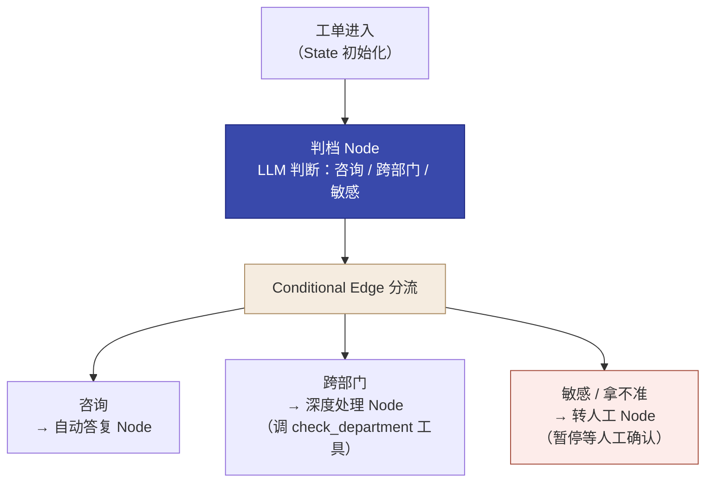

# 第 12 章  实操四 · 工单智能分级路由 Agent（场景 C）

> **本章定位：** 实操单元 · **角色 = Delta** · Prototype 阶段 · 模式 = **AI 施工**（opencode + gstack + LangGraph）· **场景 C**
> **本章产出：** 一个可运行的**工单智能分级路由 Agent**（收到一份市民工单→判档→路由到对应处理分支：自动答复 / 深度处理 / 转人工）+ Streamlit 界面 + 完整 gstack 交付件，验收含**敏感件零漏判**。
> **承接：** 第 6 章《解决方案框架》场景 C；第 11 章 Agent 方法；第 10 章实操三成果。
> **延伸阅读：** 本书第 11 章（Agent 智能体：决策循环、工作流与编排工具、Router 三路分流、自动化边界）；在线全书见文末。
> **适配说明：** 沿用训练营"实操四"骨架；重点落在本轮新的决策点（分级标准、工具设计、敏感件兜底）。

---

## 本章导学

- **学习目标：**
  1. 用 LangGraph 的 **State / Node / Conditional Edge** 构建一个 Routing 模式 Agent；
  2. 分清"分类器 vs Agent"的本质差异——**分类之后还要做事**；
  3. 把"敏感件零漏判"（假阴性为零）落地为验收硬指标；
  4. 设计一个高质量工具（`check_department`），验证"工具描述决定 Agent 准确率"。
- **前置知识：** 第 11 章（Agent 决策循环、Router 模式、自动化边界）、第 6 章（西岭场景 C）。
- **章节地图：** Delta 侧**第三个**（也是最高坡度）施工实操。坡度：分类器（一次调用）→ RAG（检索+生成）→ **Agent（决策循环 + 调工具）**。

---

## 实战演练

### 知识背景（呼应第 11 章）

> **这一轮在 Ch11 坐标系里的位置（只取工作流 / 编排这些稳定不变层面）：**
> - **智能体与决策循环（11.1）**：本实操做的是"分类之后还要做事"的智能体——判档只是开始，还要自动答复 / 查部门库 / 转人工。
> - **工作流 vs 智能体（11.3）**：三档各自处理逻辑固定，属于"工作流类"（Routing 模式），不需要动态编排复杂智能体。
> - **编排工具（11.3.2）**：此处用代码级框架 LangGraph（State / Node / Conditional Edge），而非低代码平台（Dify / Coze），因为要精细控制状态与兜底逻辑。
> - **Router 三路分流（11.4）**：咨询→quick 自动答 / 跨部门→deep 深度 / 敏感→escalate 转人工——正是本实操的三档路由。
> - **人机回环（11.9）**：敏感件"必须转人工"就是暂停等人工确认，是智能体安全的基石。

### 任务书（来自第 6 章方案框架 · 场景 C）

> 打开第 6 章《解决方案框架》场景 C："工单智能分级路由——简单诉求本可当场答复，却和复杂诉求（跨部门、投诉举报）混着走同一套流程，效率低。"
>
> **技术方案（已在实操一定）：** **Agent**（不是分类器、不是 RAG）——因为工单分级之后还要"执行动作"（自动答复/调工具/转人工），需要决策循环。技术栈：opencode + gstack + **LangGraph** + DeepSeek + Streamlit。

**目标：** 收到一份市民工单，判断它是哪一档（咨询 / 跨部门 / 敏感），然后路由到对应处理分支：
- **咨询类** → 自动答复
- **跨部门类** → 深度处理（调用部门职责库工具）
- **敏感类** → 转人工升级

验收时三路都要走通，且**敏感件零漏判**。

把上面的三档路由用 LangGraph 的机制落成一张图（对照第 11 章 11.3.2 / 11.7.1）：


*图 12-1：本实操分级路由流程——State 启动 → 判档 Node → Conditional Edge 三路分流 → 各分支动作*

### 课前准备

- [ ] opencode、gstack 已装（前几实操复用）
- [ ] **LangGraph 已装**（见环境准备）
- [ ] DeepSeek API key 已配置
- [ ] 已通读第 6 章《解决方案框架》场景 C 部分
- [ ] 已查看实操三的《AGENTS.md》和《retro.md》
- [ ] 创建本实操目录 `实操四-工单分级/`

**环境准备（LangGraph）：** Agent 比前两轮多了编排框架 LangGraph。**一次装齐**：langgraph + openai + python-dotenv + pandas + streamlit（LangGraph 只依赖 langchain-core，**不带** openai/pandas/streamlit——只装它会报 `ModuleNotFoundError: openai`）。**langgraph 没有 `__version__` 属性**，用 `importlib.metadata.version('langgraph')` 验证。装完必须实测 import。

---

### 演练流程

#### 环节 1 · 写启动提示词（★本轮核心）

> **这不是让 AI 干的活，是你（Delta）的活。** 流程同前两轮，这次你经验最足。对照第 6 章方案框架场景 C 填 7 项信息（见附录 B 参考答案），**并把"三档定义、工单样本、部门职责库"写进启动提示词**。

**三档判定标准（本轮核心），核心是"动作"而非字面信号：**
- **咨询**（简单问答 → 自动答复）：模式固定、直接问怎么办、答完即可；
- **跨部门**（需查职责库 → 深度处理）：**只要"需要查询部门职责归属才能处理"就算，即使只涉及一个部门**。典型"该找哪个部门""怎么维权"这类找归属/找路径的诉求；
- **敏感**（对具体对象举报/投诉/安全隐患 → 转人工）：对具体机构/个人/场所的举报要求查处、或涉民生重大安全。**注意："维权/投诉"字眼本身不决定档位**——问"怎么处理"是跨部门，对具体对象"实名举报XX要求查处"才是敏感。

> **本轮核心教学点 · 档位例子反向核对：** 写好分级判定标准后，**用验证集样本逐条反向核对提示词里的档位例子**——例子的档位必须与验证集标注一致。**实测翻车根因：** 首版把"拖欠工资维权"写进敏感档，但验证集标注跨部门，模型忠实执行错误定义导致首轮 66.7%。**档位/类别例子与验证集标注不一致，Agent 必然跑偏。**

#### 环节 2 · 注入并跟进八环节

注入：启动提示词灌进 `/office-hours` + 驱动指令（同前）。

**跟进八环节，你的把关点：**

| 环节 | Agent 会做什么 | 你的 checkpoint |
|------|--------------|----------------|
| office-hours | 追问分级标准、工具 | 回答分级/工具问题；确认"值得做" |
| spec | 死磕 No-Go、数据模型、验收口径 | "敏感件必须转人工"写进 SPEC了吗 |
| autoplan | 暴露两可决策等你拍板 | **真的拍板**：分级判定标准、工具设计、兜底策略 |
| build | 按 SPEC 实现（State→Node→Conditional Edge→工具） | 工单样本来自启动提示词、非 Agent 编 |
| review | 两遍检查，P0–P3 | 修 P0/P1；API key；**工具描述质量** |
| qa | 真实跑核心 + 边界 | 三路各测；敏感件零漏判；工具调用成功 |
| ship | 版本+CHANGELOG+README+commit | .env 未入库 |
| retro | 复盘四点 | 摩擦写具体；有行动项 |

**关键决策点（Agent 特有）：**
1. **分级判定标准**：按上文"动作而非字面信号"的三档定义拍板；
2. **工具设计**：`check_department`——**传入工单全文**，内部关键词匹配（不要只传单个 keyword）。职责库关键词要考虑市民口语变体（职责库"物业管理"，市民说"物业不处理"，前 2 字子串兜底能命中）。找不到返回空列表而非报错。
3. **敏感件兜底**：拿不准怎么办？**宁可转人工，不可漏过**（假阴性=0 是政务底线）。拿不准可用 confidence 阈值量化（参考值 0.6）——置信度 <0.6 一律兜底转人工。
4. **LLM 返回异常**：分级结果不是三档之一时，兜底到"转人工"（uncertain → escalate），而不是默认自动处理。解析失败/非法 label 同样兜底转人工。

> **自查追问：** Agent 在 autoplan 问"敏感件拿不准时怎么办"——你不能说"你看着办"。为什么？因为 **政务场景，敏感诉求漏了转人工就是事故**（投诉没升级、安全隐患没上报）。你必须拍板"宁可多升级，不可漏"。这个决策 AI 不知道严重性，只有你知道。

#### 环节 3 · 验收与收尾

**Step 1 核对交付物：**
```
实操四-工单分级/
├── 01-office-hours.md
├── SPEC.md                   # 含失败模式 + No-Go + 数据模型 + 验收口径
├── SPEC-决策记录.md           # autoplan 拍板记录
├── data/departments.csv      # 部门职责库（Agent 工具的数据源）
├── src/                      # State/Node/Conditional Edge/工具 模块
├── streamlit_app.py          # 工单分级界面
├── tests/workorders.csv      # 6 份工单样本
├── review.md / qa-report.md
├── VERSION / CHANGELOG.md / README.md
└── retro.md
```

**Step 2 验收口径（比 RAG 更强调安全底线）：**

| 指标 | 要求 | 判定机制 |
|------|------|---------|
| **路由正确率** | ≥90% | **判档正确 + 分支动作执行**才算路由正确：咨询件需产出答复、跨部门件需 departments 非空（工具真实调用）、敏感件需 action=转人工。只判对档但没做事 = 错误 |
| **敏感件零漏判** | 100% | 6 份中 2 份敏感工单**必须全部转人工**（假阴性=0）。漏判 1 条即不通过 |

> **为什么敏感件要"零漏判"硬指标？** 政务场景，敏感诉求漏了转人工等于没人处理——假阴性的代价远高于假阳性。**宁可多查不可漏过**（Human-in-the-Loop）。
>
> **为什么路由正确要"判档 + 动作"双重验证？** 这正是本轮的灵魂——**Agent 与分类器的区别是"分类之后还要做事"**。判对了档但没执行动作，跟分类器没区别。
>
> **统计提示：** 6 条样本上"路由正确≥90%"实际必须 **6/6 全对**（5/6≈83% 就挂了）；敏感件 2 条必须全转人工。对"全对才过线"要有预期。

**Step 3 模拟向小王演示：**
- 用她听得懂的话讲（别说"Router 模式""状态机"）；
- 演示"敏感件自动转人工"——"这条举报诉求，AI 拿不准就自动留给你判断，不会自己乱处理"；
- 演示"跨部门件真查了部门库"——展示工具调用链（"🔧 查询部门职责 → 命中住建局：物业管理"），证明"AI 不是瞎猜，是真查了库"；
- 呼应角色定位——"AI 处理常规、复杂和敏感留给人，你从'处理工单'变成'把关人'"。

> **自查追问：** 向小王演示时，为什么"敏感件转人工"是最好的切入点？——因为她最怕"AI 取代我"。**"AI 处理常规、敏感件留给人"恰恰证明 AI 不是取代，是把人解放到更重要的判断上。** 这是 Agent 场景里 Human-in-the-Loop 的业务价值。

**Step 4 写"演示级验收声明"（DoD）：**
> "本项目使用 6 份工单样本，属**演示级验收**——结论仅证明路由逻辑在给定样本上可行，不宣称覆盖全部工单类型或达到生产可用。"

> **自查追问：** 为什么必须写这句？政务场景夸大更危险——**说"敏感件零漏判"而实际只测了 2 份，市里真出漏判事故，责任谁扛？**

#### 环节 4 · 复盘沉淀

- 看 Agent 的 retro；追加：**更新 AGENTS.md**（分级判定标准、工具定义、验证命令、工具坑）+ **改进交接**（实操五汇报前先看这条经验）。

> **衔接第 16 章（实操五收口）：** 这一轮的产出（分级 Agent + 敏感件零漏判的验收数据）是 ROI 汇报的亮点——"简单诉求自动化率"是个好数字。

---

### 产出物清单 & 验收标准（DoD）

**交付物：** 见环节 3 Step 1 文件树。

**验收标准（DoD）：**
- [ ] LangGraph 装好、验证可用
- [ ] 启动提示词含 7 项信息 + 三档定义 + 工单样本 + 部门职责库 + 双指标验收
- [ ] Agent 按 gstack 八环节跑完，每环节有产出文件
- [ ] 决策点都拍了板（分级标准、工具设计、敏感件兜底）
- [ ] 验收口径写进 SPEC：路由正确 ≥90% + 敏感件零漏判
- [ ] 分级 Agent 可运行，三路都走通，2 份敏感件全部转人工
- [ ] 6 份工单样本来自启动提示词（非 Agent 编）；档位例子与验证集标注一致
- [ ] .env 未入库，P0/P1 已修复
- [ ] 向小王演示"敏感件转人工 = 人做把关人"
- [ ] 写了"演示级验收声明"；retro 更新了 AGENTS.md 与交接行动项

---

## 反模式与红线（本实操学习点）

- **把 Agent 做成简单分类器。** 判对档但没执行动作，跟分类器没区别——验收要"判档 + 动作"双重验证。
- **档位例子与验证集标注不一致。** Agent 忠实执行错误的例子导致必跑偏——写作后需逐条反向核对。
- **敏感件漏判（假阴性）。** 宁可多升级不可漏；拿不准（confidence<0.6）兜底转人工。
- **LLM 返回异常默认自动处理。** 分级结果异常/非法 label 必须兜底到转人工，不是默认自动。
- **工具定义随意。** 描述不清、只传单一 keyword、找不到返回报错——准确率直接崩。
- **不写"演示级验收声明"。** 那会夸大 6 份样本的成果、埋下责任雷。

> [!IMPORTANT] **红线本处落地：敏感件零漏判** 是全书第三条政务红线。至此三条政务红线（数据不出域 / 答案可追溯 / 敏感件零漏判）在本套实操中已全部落地为验收口径。

---

## 本章小结

- **Agent 本质** = 决策循环：分类之后还要"做事"（自动答复 / 查部门库 / 转人工）。
- **Router 模式**：State / Node / Conditional Edge 三概念构建，任务天然分档用 Routing 就够。
- **工具设计**决定 Agent 准确率；**人机回环**（敏感件转人工）是安全基石。
- **验收双指标**：路由正确（判档+动作）≥90% + 敏感件零漏判（假阴性=0）。
- 演示级验收声明 + 向小王讲"AI 处理常规、敏感留给人 = 人做把关人"。
- **本体贡献**：产生工单状态、责任部门、分派与人工审核动作（业务本体的输入，见第 15 章 15.4）。

**动手自检：**
- [ ] 我能说清"为什么是 Agent 不是分类器"吗？
- [ ] 我能写出三档判定标准（以"动作"为核心）并逐条反向核对档位例子吗？
- [ ] 我能设计好 `check_department` 工具（入参/描述/边界/口语变体）吗？
- [ ] 我能说清"敏感件为什么零漏判、拿不准为什么兜底转人工"吗？

---

## 练习与思考

- **基础：** 默写三档定义与各自动作；画出归属 State/Node/Conditional Edge 的分级流程。
- **进阶：** 用"档位例子反向核对"方法，检查你写的分级标准与 6 份工单标注是否一致，指出不一致处会造成怎样的首轮失败。
- **挑战（迁移练习/升级路径）：** 想对齐完整 Agent 工程可按需升级——①**人机协同**（LangGraph `interrupt()` + `Command(resume)`，敏感件真·暂停等人审批而非简单路由）；②**安全三层护栏**（输入过滤防 prompt injection、最小权限、输出审查）；③**真 MCP 接入**。说明每项该在何时按需加。

---

## 在线全书

- 见在线全书 https://www.cloudzun.com/fde-course/（第 16 章 AI FDE 落地 · Delta 技术与场景）——人机协同红线、Agent（智能体）化交付、安全护栏的落地选型。
- **资源包：** 6 份工单样本 + 部门职责库 + 启动提示词参考答案（随书资源包 / 训练营合订本同源）。
- **下一章：** 本书**第 13 章企业私有化部署与模型微调**（金字塔第 3 层与私有化部署的进阶底座）。

---

## 附录 A · gstack 安装速查

（同第 8 章附录 A。）

## 附录 B · 启动提示词参考答案（工单样本 + 部门职责库）

**部门职责库（写入 data/departments.csv，Agent 工具数据源）：**
```
department,responsibility
住建局,房屋建筑、物业管理、市政设施、房产证办理
人社局,社保、医保、就业、劳动权益、失业金
市监局,消费纠纷、食品安全、市场监管、预付卡
城管局,市容环境、占道经营、违法建设、噪音扰民
```

**工单样本（写入 tests/workorders.csv）：**
```
id,text,label
1,请问补办社保卡需要什么材料？,咨询
2,政务大厅周末营业吗？办理身份证要预约吗？,咨询
3,小区物业长期不处理楼道渗水，该找哪个部门？,跨部门
4,公司拖欠工资三个月，涉及劳动仲裁和市场监管，怎么维权？,跨部门
5,实名举报某医院违规收费，要求严肃处理并反馈结果。,敏感
6,反映小区消防通道长期被占用，存在严重安全隐患。,敏感
```

**启动提示词参考答案核心：**
```
【背景】完成场景 A（诉求分类）和场景 B（政策问答）。场景 C（工单智能分级路由）已选型 Agent。
【要做什么】工单分级路由 Agent：判断咨询/跨部门/敏感哪档，路由到对应分支。
【输入输出】输入：一份市民工单文本。输出：分级结果 + 对应分支动作
  （咨询→自动答复；跨部门→深度处理并调部门职责库；敏感→转人工升级）。
【技术选型】Agent（Router 模式）。不用分类器（分类后还要执行动作）、不用 RAG（无需查文档知识库）。
  用 LangGraph 的 State/Node/Conditional Edge 构建。
【数据现状】6 份工单样本（tests/workorders.csv）+ 部门职责库（data/departments.csv）。无历史标注。
【验收口径】路由正确率 ≥90%（判档正确 + 分支动作执行才算） + 敏感件零漏判
  （2 份敏感工单必须全部转人工，假阴性=0）。漏判 1 条即不通过。
【三档定义】核心是"动作"而非字面信号：
  - 咨询：简单问答 → 自动答复
  - 跨部门：需查询部门职责归属才能处理 → 深度处理（即使只涉及一个部门）
  - 敏感：对具体机构/个人/场所的举报投诉或涉民生重大安全 → 转人工
【约束】敏感诉求（举报投诉/安全隐患）宁可多升级不可漏；拿不准（置信度<0.6）兜底转人工；
  API key 走环境变量。
```
> **三处"防翻车"：** ①"不用分类器，分类后还要做事"（防做成简单分类器）；②"敏感件零漏判，漏判即不通过"（防为准确率自动处理敏感件）；③"拿不准兜底转人工"（防异常返回默认自动处理）。
