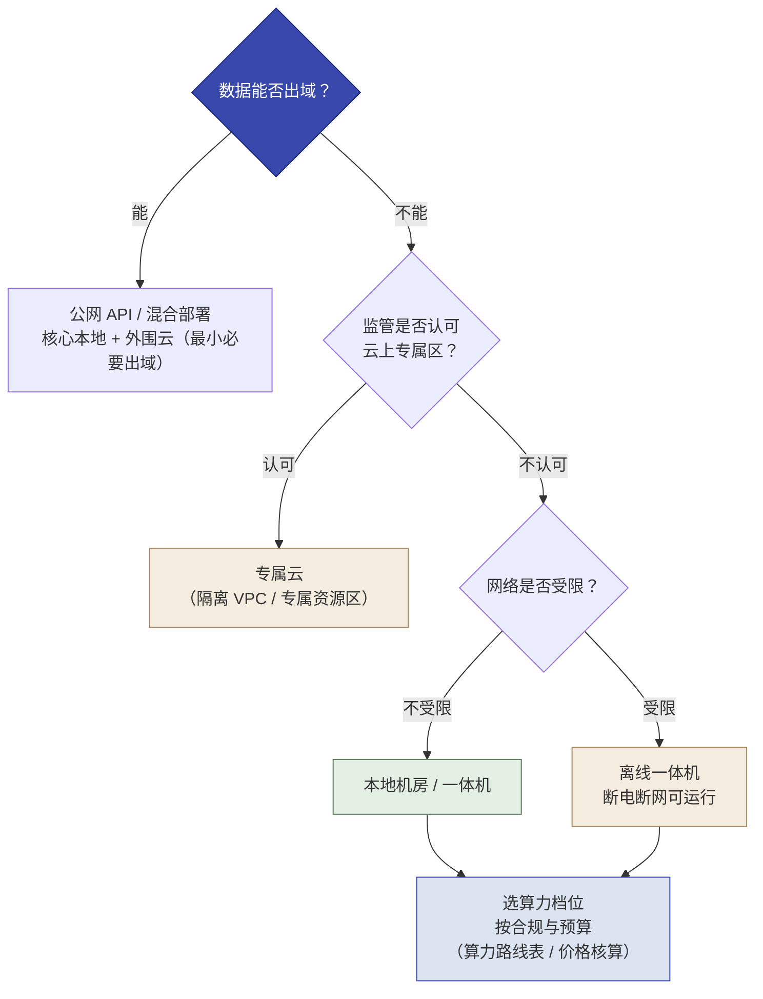
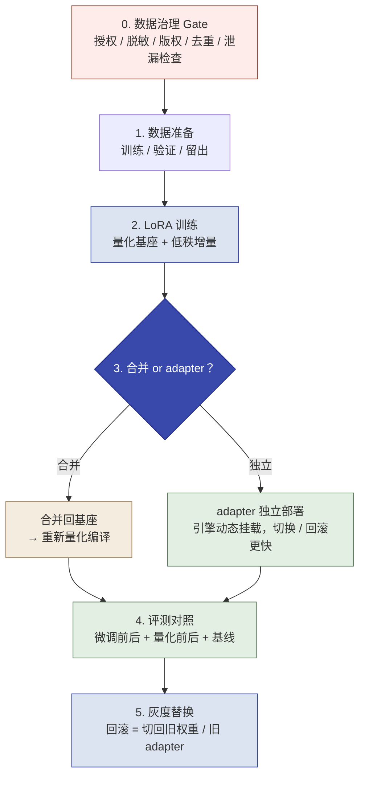
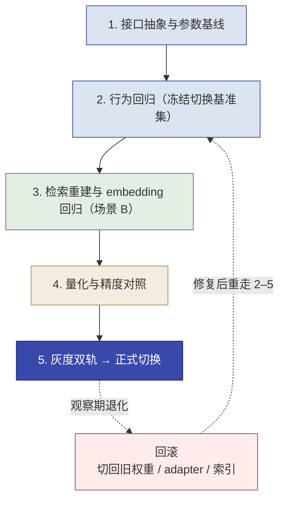

# 第 13 章  从公网到本地：私有化部署与模型微调

> **本章定位：** 知识单元 · 进阶选读，补上 LLM 四层级金字塔的**第 3 层（微调）**——先落地"数据不出域"的工程底座（模型选型 + 私有化部署），再讲微调（最后一公里），最后收口于"公网 → 本地回填"。
>
> **建议读者：** Delta（施工判断主力）为主，Echo 参与"要不要微调"的选型共识。
>
> **前置：** 第 7 章（四层级金字塔）、第 9/10 章（RAG，作对照）。
>
> **阅读方式：** 本章是副线选读，不是五个实操里的一环。**主线必读**——为什么本地部署、怎么选型、部署形态与安全边界、微调判断与成本、公网 → 本地切换与回归；**进阶选读**——硬件深水、微调方法细节、小模型实验。型号与价格会持续变化，落地前以厂商官方资料复核。

---

**本章学习目标：**

1. 说清"为什么需要本地"与"怎么选型"：合规要求 → 选型三问 → 部署形态与算力档位；
2. 说清"先 RAG 后微调、微调是最后一公里"的判断逻辑，以及 RAG 与微调的分工（事实性 vs 行为性）；
3. 区分 LoRA、QLoRA、全参 SFT 三种方法，说出企业默认路径与各自硬件量级；
4. 复述一次微调的标准流程及其纪律（数据治理 Gate → 数据 → LoRA → 部署 → 量化 → 评测 → 灰度）；
5. 为"公网 → 本地/微调"切换做适配与回归：接口 / 行为 / 质量三层面、冻结基准集、灰度双轨与回滚；
6. 用判断清单判断"该不该微调"，落地"数据不出域"红线；在小模型上完成一次 QLoRA 实验（可选）。

## 13.1 为什么在本地部署 + 怎么选型：合规与能力双驱动

### 13.1.1 合规红线：为什么真实数据必须留在本地

政企客户部署大模型，第一步不是比模型能力，而是回答"**真实数据能不能出域、模型行为能不能被监管**"。三条合规红线决定了答案：

**红线一 · 数据不能出域。** 《数据安全法》《个人信息保护法》与数据出境安全评估规定，重要数据、政务数据与个人信息**不得随意出境或交给第三方**。公网 API（尤其境外模型服务）意味着把客户数据交给第三方处理——在政务与金融场景直接违规。**含义**：真实数据只能留在获批安全域内（本地机房 / 授权专属云），模型必须能部署在这个安全域里。

**红线二 · 算法要备案、行为要可解释。** 《生成式人工智能服务管理暂行办法》（网信办等七部门令第 15 号，[官方文本](https://www.gov.cn/gongbao/2023/issue_10666/202308/content_6900864.html)）要求对外提供生成式 AI 服务须履行**算法备案与安全评估**；配套的《生成式人工智能服务安全基本要求》（全国网安标委 TC260-003，[全文](http://www.whwx.gov.cn/zcfg/zcwj/202511/t20251111_2675219.shtml)、[解读](https://www.tc260.org.cn/portal/article/105/20240319163446)）进一步要求**语料安全、模型安全、服务安全**并配套上线前评估。**含义**：模型的训练数据、输出行为要能说清、可审计；依赖"黑盒"闭源服务，备案与评估时说不清。

**红线三 · 自主可控。** 信创要求与政采大模型"安全采购指南"（如 [广东政采](https://czt.gd.gov.cn/zfcg/content/post_4759170.html)）要求关键行业**模型、权重、算力可自管**；实际政采项目普遍要求"模型上线前检测、语料安全检测、安全运营保障"（如[政务智算采购项目](https://www.cgwenjian.com/view/file/202603200001688531?wd=)）。**含义**：模型与权重掌握在自己手里，不能依赖不可控的外部服务。

> **必要性小结：** 三条红线不是"本地更好"的技术偏好，而是**合规的硬要求**——公网 API（尤其境外）在"数据不出域、算法可解释、自主可控"三个维度都过不了关，**本地 / 私有化部署是政企场景的必要条件**。（注：是否"必须不出域"取决于数据分类分级、法规、行业监管、合同与组织制度的综合判断；本案例把它定为项目红线。）

### 13.1.2 选型三问：在合规前提下把模型落到本地

红线确定了"**要不要**本地"，选型三问解决"**能不能落地**（第二问）、**选哪个模型**（第三问）"：

**第一问 · 数据能不能出域（安全合规，决定要不要本地）**

- 数据敏感度分级：**完全虚构 / 脱敏的教学数据**可走公网 API 验证；**真实客户数据**（政务、金融、个人信息）不能出域 → 必须本地部署；
- 依据：TC260-003 语料安全、个保法、数据出境评估。**不能出域就没有选择——直接进本地路线。**

**第二问 · 能不能本地部署（部署可控，决定本地化可行性）**

- 三个子条件**合起来**才算"能"：
    1. **权重可得**：模型权重公开可获取（开源权重）——只开放 API 的闭源模型做不到本地化；
    2. **算力与许可满足**：本地算力（英伟达 / 昇腾）跑得起所选档位；许可证允许自部署（如 Apache-2.0 / MIT）；
    3. **自主可控**：权重、版本、运维在自己手里（信创要求）。
- **三者缺一不可**：有开源权重但没算力（跑不动）、有算力但权重闭源（拿不到）、权重算力都有但许可禁止自部署——都不能算"能本地部署"。

**第三问 · 选哪个档位（能力适配，决定选什么模型）**

- 任务复杂度定档：深度推理 → 思考 / 大模型档；模式匹配 → 小模型档（对照"从最简单开始"）；
- 用评测基准与业务指标验证：公开基准做初筛，最终用你的业务数据实测（准确率 / 可追溯率等）；
- 再叠加部署约束定规格：显存、成本、国产芯片、推理引擎。

> **可行性小结：** 三条红线之内，本地部署是**可行**的完整链路——**数据不能出域（第一问）→ 开源权重 + 算力 + 许可满足（第二问）→ 按任务选档（第三问）→ 部署形态与硬件规格**。具体在售型号、许可证、上下文长度与价格属动态数据，以厂商官方资料为准。

### 13.1.3 经济性动因：烧不起公网 API，转而在本地运行

合规红线之外，还有一种**纯基于成本**的考量：公网 API 按 token 计费，调用量一大、上下文一长，月账单涨得飞快——有些客户"烧不起"，转而把模型放到本地跑。

| 维度 | 公网 API | 本地部署 |
| :--- | :--- | :--- |
| 成本形态 | 随调用量**线性增长**（按 token 计费） | **固定投入为主 + 低边际成本**（GPU 折旧 / 租赁 + 电费 + 运维） |
| 低调用量 | 便宜（API 划算） | 不划算（GPU 利用率低，折旧照付） |
| 高调用量 / 长上下文 / 批量 | 月成本随调用量涨到数十万元级 | GPU 摊薄后月成本可低一个量级 |

> **提醒：**
>
> 1. 本地不总是更便宜——先算调用量与利用率，再决定；
> 2. "省钱"与"合规"是两个独立动因——合规红线是"必须本地"，成本是"划算本地"；两者可叠加，但**不要用成本论证替代合规论证**。

---

## 13.2 私有化部署：形态、算力路线与硬件规范

> [!IMPORTANT]
> **"出域"要拆开说（全书统一口径）：** "数据出域"不是一个词，至少区分六种情形——1）出本地设备；2）出客户内网；3）上公有云；4）向第三方处理者提供；5）跨境；6）出组织批准的安全域。它们的合规要求完全不同，**不得笼统称为同一个"出域"**。西岭案例统一口径：1）课堂**教学模拟数据**（完全虚构、脱敏、无真实个人信息）可在课堂批准环境调用公网服务；2）所模拟的**真实政务数据**未经确认不得进入公网服务；3）**真实客户数据**必须在 Discovery 中按数据分类分级、法律法规、行业监管、合同、组织制度和审批结果确定处理边界。

### 13.2.1 私有化 ≠ 只能放客户本地机房

"数据不出域"落到部署形态，**不只是"买台机器放客户机房"一种选择**。按数据敏感度与组织制度，常见四种形态：

| 形态 | 是什么 | 适合谁 | 与"不出域"的关系 |
| :--- | :--- | :--- | :--- |
| **本地机房** | 自建服务器 / 通用一体机部署在客户自有机房或园区 | 涉密、高合规、无云依赖 | 数据与权重物理隔离在客户可控网络内 |
| **专属云（隔离 VPC / 专属资源区）** | 云厂商在客户专属 VPC / 资源隔离区内运行，租户级隔离 | 一般政企、运维能力强、可接受云上专属区 | 逻辑隔离 + 合规边界按云租户划（需确认监管认可） |
| **离线一体机** | 一体化交付、**断电断网仍可运行**的强隔离形态 | 现场网络受限、极端隔离场景 | 强隔离、弱联网 |
| **混合部署** | 核心数据与模型在本地，外围（如不敏感工具链）走云 API | 多数政企的现实形态 | 突出"最小必要出域"，明确边界清单 |

> **落地判读：** "私有化"是**数据不出域的工程实现**，选哪种形态取决于**监管要求、网络条件与运维能力**，不是"只能本地机房"。涉密高合规 → 本地机房 / 一体机；一般政企 → 专属云或混合；网络受限 → 离线一体机。

### 13.2.2 算力路线：合规可得性优先的分层选择

算力路线不是"二选一"，而是**在"合规可得性"前提下按规模与预算分层选**——先问"哪些硬件能合规买到"，再看性能与成本：

| 路线 | 代表硬件 | 可得性 / 合规 | 适用 |
| :--- | :--- | :--- | :--- |
| **国产信创路线** | 昇腾 910C / Atlas 800 | **合规可得**（信创默认，政企首选） | 数据不出域、合规优先；涉密 / 高合规走全私有化一体机 |
| **性价比路线** | RTX 4090 / 5090、4× RTX 6000 Ada | 消费 / 专业卡，正规渠道可得（留意出口管制） | 中小规模、开发 / 中低频本地 |
| **吞吐路线** | 单张 AMD MI300X | 非英伟达禁运范围，可采购 | 高吞吐、省钱替代 API |
| **旗舰路线（仅参照）** | B300（Blackwell Ultra） | **禁运：官方渠道不可得，非正规渠道有合规风险**——本书不推荐 | 大规模集群（合规环境之外，仅作生态参照） |

> **昇腾 910C 是当前国产算力的中流砥柱**：[粤港澳大湾区首个"国芯训国模"昇腾万卡智算集群已上线，部署 **11,520 张昇腾 910C**（来源：广东省科技厅公告）](http://gdstc.gd.gov.cn/kjzx_n/gdkj_n/content/mpost_4924300.html)；910C 已被字节跳动、中国电信等头部厂商规模采用（[Omdia 分析转述](https://xueqiu.com/1855261132/368119001)），出货量持续放量。昇腾 950 系列为下一代方向，但 910C 目前凭借成熟生态与产能仍是存量主力。

> **为什么 B300 不推荐（仅作参照）：** 受美国对华禁运，B300 官方渠道不可得；**走非正规渠道价格翻倍（≈1400 万/台，渠道报价、无官方公开来源，仅作风险提示）且本身有合规风险**，价格核算也显示自建 B300 整机多数场景打不平。本书推荐的算力路线一律**合规可得**——信创昇腾、消费 / 专业 NVIDIA 卡、AMD MI300X 均为正规渠道可获取。

> **政企默认做法：** 涉密 / 高合规走全私有化一体机（昇腾）；一般政企走"私有化核心 + 云 API 补充"混合形态；信创环境默认**昇腾路线**（国产芯片 910C + 麒麟 OS + 国产数据库栈）。选型三问中，"数据能不能出域、监管认不认可云上专属区"直接决定选哪种形态与算力档位。


*图 13-1：私有化形态决策树——先问"数据能否出域"，再定形态；算力档位按合规与预算选*

> **读法：** 第一问永远是"数据能否出域"（红线）；能 → 公网 / 混合；不能 → 先看监管是否认可云上专属区（专属云），不被认可再看网络是否受限（本地 / 离线一体机），最后**按合规与预算选算力档位**——合规优先选昇腾（信创默认），中小规模选消费 / 专业 NVIDIA 卡，高吞吐选 AMD MI300X。

### 13.2.3 一体化 / 训推一体机 / 集群三档选型

| 形态 | 典型硬件 | 适用边界 |
| :--- | :--- | :--- |
| 消费级"工作站"（非交付形态） | RTX 4090 24GB 等 | 7B 级 QLoRA 实验、PoC；**不是政企交付主体，只在原型验证阶段提一句** |
| 专业工作站 / 桌面一体机 | DGX Station 等 | 团队级开发、私有化小规模训练/微调 |
| **8 卡服务器 / 训推一体机** | 昇腾训推一体机、8 卡专业卡服务器（如 8× RTX 6000 Ada） | **政企私有化主力**：推理 + LoRA 微调共用一台（禁运型号如 B300 整机不可得，本书不推荐） |
| **企业集群** | 8×80GB 机群 / Atlas 800T A2 / Atlas 900 A3 | 全参 70B+ / 大批量 LoRA，多项目共享算力池 |
| 智算中心（万卡级，政企租用） | 万卡昇腾/英伟达集群 | 大模型预训练/大规模后训练，政企以算力券方式租用 |

> **企业交付的主体是"器"级的服务器/一体机，不是一张家用显卡**（原型验证用单卡/云端 API 即可，不构成交付形态）；边界口诀：**"能在一台 8 卡服务器里完成的（LoRA / QLoRA）就在一台里完成；要跨多台的（全参 70B+/大量数据）才上集群；万卡集群是平台级投资，不是单项目采购。"**

### 13.2.4 显存规划与量化取舍：从模型反推要几卡

**先讲量化（它直接决定显存需求）。** 模型权重与激活默认用高精度浮点（FP16 / BF16，每参数 2 字节）存储与计算。**量化（Quantization）把权重 / 激活压缩到更低的位宽**——FP8 每参数 1 字节、INT4 / FP4 每参数 0.5 字节——显存按比例下降、推理更快，代价是精度损失；训练好的权重有冗余与分布集中，低比特近似通常保留绝大部分能力（GPTQ / AWQ / GGUF 等量化方法即此思路）。

| 位宽 | 每参数 | 权重体积（每 10 亿参数） | 精度损失 | 定位 |
| :--- | :--- | :--- | :--- | :--- |
| **FP16 / BF16** | 2 字节 | 2GB | 无（基线） | 全精度基线，评测对照用 |
| **FP8 / INT8** | 1 字节 | 1GB | 很小 | **生产默认**（精度损失小、显存减半） |
| **INT4 / FP4（NVFP4）** | 0.5 字节 | 0.5GB | 明显 | 逼近硬件极限时才用，必须评测定档 |

> 注：**W4A16**（权重 4-bit、激活 16-bit）是混合量化——只压权重不压激活，是 INT4 的一种稳妥形态（如 4× RTX 6000 Ada 跑 V4.1-Flash 的 W4A16 ≈159GB 即此）。

**再算显存（由三部分组成**，主流框架与厂商一致的口径，[HuggingFace 显存估算器](https://huggingface.co/spaces/hf-accelerate/model-memory-usage)、[vLLM 官方显存文档](https://docs.vllm.ai/projects/vllm-omni/en/stable/configuration/gpu_memory_utilization/)、[阿里云 PAI 估算指南](https://www.alibabacloud.com/help/zh/pai/product-overview/estimation-of-the-required-video-memory-for-the-model)）：

1. **权重**：参数量 × 每参数字节（上表）；
2. **KV cache**：随上下文长度、并发 batch、层数与注意力头数增长——长上下文 + 高并发时可能占显存大头（vLLM 提供专门的显存分配与计算公式）；
3. **激活与运行时**：前向计算与推理框架自身的缓冲，另计。

**估算步骤（粗略下界）：** 总显存 ≈ 权重体积 + KV cache + 激活余量；所需卡数 = 总显存 ÷ 单卡显存。以 700 亿参数模型为例，各量化档的权重体积与所需卡数如下（**与上方档位表逐行对齐**，未含 KV cache 余量）：

| 位宽 | 700 亿参数权重体积 | 80GB 单卡 | 48GB 单卡 |
| :--- | :--- | :--- | :--- |
| **FP16 / BF16** | ≈ 140GB | ≥ 2 卡 | ≥ 3 卡 |
| **FP8 / INT8** | ≈ 70GB | ≥ 1 卡 | ≥ 2 卡 |
| **INT4 / FP4** | ≈ 35GB | ≥ 1 卡 | ≥ 1 卡 |

量化一档（FP8）卡数大致减半；再降一档（INT4），多数规模单卡即可装下。

**量到哪一档（选型三步）：** 量化位宽每降一档 → **显存减半 + 吞吐提升 + 精度风险上升**，三步定档：

1. **显存够不够**：权重体积能否装进可用显存——不够才需要量化；
2. **精度敏不敏感**：任务越依赖精确数字 / 条款引用（政务分类、RAG 答案），量化越要保守（FP8 起步）；生成式 / 摘要类可更激进；
3. **必须评测定档**：量化前后在同一基准集上对照（准确率 / 可追溯率等），低于验收线就升一档（INT4 → FP8 → FP16）——**生产默认 FP8 / NVFP4，INT4 慎用**。

> **判读要点（按公式计算，非在售配置）：** 万亿参数级 MoE（如 2.8T 总参）NVFP4 权重体积 ≈ 2.8T × 0.5 字节 ≈ **1.4TB**，才有机会压进"288GB × 8 ≈ 2TB 级单节点"；更重的生产级吞吐需求再考虑多节点。**落地一律以厂商部署文档核验。**

> **示例（V4.1-Flash 高性价比档位）：** RTX 4090（24GB）靠 AWQ 等极低比特量化才装得下；RTX 5090（32GB）用 4-bit 量化流畅运行；4× RTX 6000 Ada（192GB）用 W4A16（≈159GB）留出余量——**"选哪档硬件"和"量到哪档"是同一个决策的两面**。

### 13.2.5 模型服务化与推理引擎：企业做法

**模型服务化是什么。** 把本地模型"跑起来"只是第一步——生产要的是**把模型包装成可并发服务的 API**（OpenAI 兼容格式），让业务系统像调接口一样调用，同时扛住并发、控制延迟与吞吐。服务化 = 推理引擎（怎么高效跑）+ 部署形态（怎么对外服务）。

**推理引擎选型**（引擎决定"同一张卡能服务多少并发、多快"）：

| 引擎 | 角色 | 关键机制 | 何时用 |
| :--- | :--- | :--- | :--- |
| **vLLM** | 开源主流推理引擎 | Continuous batching、PagedAttention、Prefix Caching、OpenAI 兼容 API | **生产默认首选**（吞吐高、生态全、接入快） |
| **TensorRT-LLM** | 英伟达编译优化 | 图编译 + 算子融合，极致延迟 / 吞吐 | 英伟达硬件上追求极致性能时 |
| **Triton / Triton-Dynamo** | 统一推理网关层 | 多模型统一部署、调度、版本管理 | 多个模型 / 多框架统一服务时 |
| **MindIE** | 昇腾 910C 默认推理引擎 | 昇腾软硬协同优化 | 国产昇腾栈 |

**三个关键机制（为什么 vLLM 这类引擎能"同卡多并发"）：**

1. **Continuous batching（连续批处理）**：请求动态拼批、先完成先出——GPU 不空等，吞吐大幅提升；
2. **PagedAttention / KV cache 分页管理**：把 KV cache 按页分配，显存利用率高，长上下文 + 高并发也能装下；
3. **Prefix Caching（前缀缓存）**：相同前缀（如 RAG 里重复的指令模板、政策片段）只算一次——政务 RAG 场景命中率高，成本下降明显。

**多卡并行策略**（模型大过单卡显存、或要更高吞吐时）：

- **张量并行（TP）**：单机内把一层切成多卡（吃 NVLink 带宽）——单机首选；
- **流水线并行（PP）**：跨节点按层分段——模型大、单节点放不下时；
- **数据并行（DP）**：多副本各处理一批请求——吞吐优先、模型可单卡装下时；
- **专家并行（EP）**：MoE 模型按专家分卡——V4.1-Flash 这类 MoE 模型的专项优化。

**生产部署要点：**

- **调度与弹性**：K8s + GPU Operator 管理 GPU 资源（调度、显存分配、故障重启）；
- **入口网关**：Higress / API7 等做路由、限流、鉴权、灰度；
- **健康检查与监控**：延迟、吞吐（QPS）、显存占用、并发数的监控告警；
- **多副本与灰度**：多副本扛并发，新模型版本先灰度再全量。

> **呼应：** 引擎与并行策略决定了"同一档硬件能服务多少调用"（价格核算里的吞吐上限就来自这里）；服务化跑稳了，"公网 → 本地回填"才有承载基础。

### 13.2.6 高性价比档位与价格核算：以 V4.1-Flash 为例

**先看模型：** DeepSeek V4.1-Flash 的 MoE 架构配合量化（INT4 / FP8 / W4A16）能把显存需求大幅压低——**不必上 B300 整机，消费级到专业级显卡就能本地跑**。按预算与并发从低到高：

| 档位 | 核心硬件 | 参考成本 | 关键配置 / 性能 | 适合场景 |
| :--- | :--- | :--- | :--- | :--- |
| 极致性价比 | 单张 RTX 4090（24GB） | ≈ 0.5–0.8 万 | AWQ 等极低比特量化；个人体验 / 轻量开发 | 个人开发者、预算有限 |
| 消费级甜点 | 单张 RTX 5090（32GB） | ≈ 2–3 万 | 4-bit 量化流畅运行，可处理 50 万 token 长上下文 | 个人 / 独立开发者 |
| 均衡之选 | 4× RTX 6000 Ada（48GB） | ≈ 21 万（[5.3 万/张](https://m.diy52.com/vga/202607159692.html)） | TP=4 张量并行，总显存 192GB，W4A16 ≈159GB，实测 115–133 tokens/s | 小型团队、中等并发 |
| 企业级入门 | 单张 AMD MI300X（192GB） | ≈ 10 万/卡（[八卡模组 79.8 万，按八卡均摊 ≈10 万/卡](https://post.smzdm.com/p/aqr0ndrv/)，单卡零买可能更高） | 未量化全量加载，实测 ≈2699 tokens/s；注意 ROCm 生态 | 追求吞吐的企业 |
| 国产化 | 华为 Atlas 800 服务器 | ≈ 120–140 万（[硬件选型指南](https://www.cnblogs.com/skyseraph/p/21109151)） | 昇腾软硬协同，百万级成本替代集群 | 数据合规 / 国产化政企 |

> **读法与来源口径：** "参考成本"一律为**购置价**——单卡按每张卡价、多卡组合按整机（含服务器与配套）渠道价；上表价格来自公开选型资料与渠道页面（媒体/聚合站只作线索，落地以厂商或集成商正式报价为准）。

**价格核算（示意估算，非报价；落地以官方定价与自身核算为准）。** 先把三个可复算的前提列清楚：

1. **汇率 1 USD ≈ 7.1 CNY**——仅用于换算官方美元报价，落地按当期汇率；
2. **每次请求 70% 输入 + 30% 输出 tokens**，其中**输入按缓存命中率 50% 加权**（这两个比例为示意取值，实际须用自身线上分布替换）；
3. **每"次"调用 ≈ 334 tokens**——用于把"tokens/日"换算成"次/日"；该值可由本表 4×6000 Ada 的实测吞吐反推：133 tokens/s × 86400 秒 ÷ 34,400 次/日（其满负荷调用上限）≈ 334 tokens/次。**注意：结论以 tokens/日为基准，与 tokens/次 的取值无关；只有"次/日"一列随该假设同比变化。**

**基准一 · API 对比价（2026-09，[DeepSeek 官方定价页](https://api-docs.deepseek.com/quick_start/pricing)，税前美元价）。** 当前在售模型为 **DeepSeek-V4.1-Flash**（旧名 `deepseek-v4-flash` 已退役、请求由 V4.1-Flash 承接并按 Flash 价计费）：缓存命中 $0.003（低峰）/ $0.006（高峰）、未命中 $0.15 / $0.30、输出 $0.60 / $1.20（每百万 tokens），**低峰价 = 高峰价的一半**。折算公式：

```text
输入加权单价 =（缓存命中单价 + 缓存未命中单价）÷ 2      # 命中率 50%
输出单价     = 官方输出价 × 7.1
混合单价     = 0.7 × 输入加权单价 + 0.3 × 输出单价
```

| 时段 | 输入加权单价（命中 50%） | 输出单价 | 混合单价 = 0.7×输入 + 0.3×输出 |
| :--- | :--- | :--- | :--- |
| 低峰 | $0.0765 → **≈ ¥0.54/百万** | $0.60 → **≈ ¥4.26/百万** | 0.7×0.54+0.3×4.26 = **≈ ¥1.66/百万 tokens** |
| 高峰 | $0.153 → **≈ ¥1.09/百万** | $1.20 → **≈ ¥8.52/百万** | 0.7×1.09+0.3×8.52 = **≈ ¥3.32/百万 tokens** |

**基准二 · 本地月成本：本地月成本 = 购置价 ÷ 36 个月（直线折旧）+ 电费 + 运维。** 电费按**满载功耗 = 台数 × 单卡功耗 × 730 小时 × 0.7 元/kWh × 1.3（PUE 系数）**估算：

| 档位 | 购置价 | 折旧/月 | 电费/月（按上式） | 运维/月 | 本地月成本 |
| :--- | :--- | :--- | :--- | :--- | :--- |
| 均衡（4×6000 Ada） | ≈ 21 万（4 卡整机） | 21 万÷36 ≈ **¥5,833** | 4×300×730×0.7×1.3 ≈ **¥797** | ≈ 0（经验口径） | 合计 ¥6,630 → 取整 **≈ ¥6,500/月** |
| 企业级（MI300X） | ≈ 10 万（单卡） | 10 万÷36 ≈ **¥2,778** | 1×750×730×0.7×1.3 ≈ **¥498** | ≈ 0（经验口径） | 合计 ¥3,276 → 取整 **≈ ¥3,200/月** |

**打平点 = 本地月成本 ÷ 混合单价**，换算链：**÷ 混合单价 → 百万 tokens/月 → ×100 万 = tokens/月 → ÷30 = tokens/日 → ÷334 = 次/日**（月按 30 天计）：

| 档位 | 本地月成本 | 打平需求（低峰 / 高峰） | 满负荷 24 小时产能 | 结论 |
| :--- | :--- | :--- | :--- | :--- |
| **均衡（4×6000 Ada）** | ≈ ¥6,500/月 | 低峰 6500÷1.66 = 3916 百万/月 = 39.2 亿 tokens/月 **÷30 ≈ 1.31 亿 tokens/日 ≈ 39.2 万次/日**；高峰 6500÷3.32 = 1958 百万/月 = 19.6 亿 tokens/月 **÷30 ≈ 6,500 万 tokens/日 ≈ 19.5 万次/日** | 115–133 tokens/s × 86400 ≈ **1,000–1,150 万 tokens/日 ≈ 3.0–3.4 万次/日** | **吞吐是瓶颈**：满负荷产能只有低峰打平需求的约 **1/11–1/13（差约一个数量级）**、高峰口径的约 **1/5.7–1/6.5**——适合中低频本地 / 私有化（合规诉求），不适合"省钱替代 API" |
| **企业级（MI300X）** | ≈ ¥3,200/月 | 低峰 3200÷1.66 = 1928 百万/月 = 19.3 亿 tokens/月 **÷30 ≈ 6,400 万 tokens/日 ≈ 19.2 万次/日**；高峰 3200÷3.32 = 964 百万/月 = 9.6 亿 tokens/月 **÷30 ≈ 3,200 万 tokens/日 ≈ 9.6 万次/日** | 2699 tokens/s × 86400 ≈ **2.33 亿 tokens/日 ≈ 69.7 万次/日** | **吞吐足够**：满负荷产能约为低峰打平需求的 **3.6 倍**、高峰的 **7.3 倍**——"省钱替代 API"的相对可行档（前提：ROCm 适配、未量化全量加载） |

> **结论（2026 年 9 月口径）：** 1. V4.1-Flash 的现行报价比预期便宜 → 打平需求整体上移，本地更难凭"省钱"胜出；2. 均衡档的瓶颈**不是成本而是吞吐**——满负荷 24 小时的产能也满足不了打平所需调用量（**低峰口径差约一个数量级、高峰口径差约 6 倍**）；3. "省钱替代 API"的现实档位是 **MI300X 这类高吞吐 + 大显存单卡**，而非多卡组合或 B300 整机（注意：上表 MI300X 按八卡模组均摊的保守单价核算，若单卡实际购置价更高，打平需求会同比上升，但其产能仍有余量）；4. 个人档（4090 / 5090）吞吐更低，仅开发 / 体验用；5. **国产 Atlas 800 走合规路线而非省钱路线**。

**算成本别只算一个静态打平点：**

- **算力利用率**：能否始终满负荷？利用率 50% → 同样固定成本只服务一半调用量，**打平需求翻倍**（上表"打平需求"为需求侧估算，"满负荷产能"为供给侧上限，实际要按真实利用率把需求进一步上调）；
- **分摊模式**：多业务 / 多客户共享底座（算力池 / 统一部署）摊薄固定成本；需求波动大时云 GPU 按小时租更灵活（弹性但单价高）；
- **软硬件维护**：模型每季度更新要重新部署、GPU 故障 / 驱动 / 安全补丁 / 备份高可用——运维成本常被低估（上表按"客户自有团队承担、未单列"处理，若外包运维须另加）；
- **折旧与残值**：GPU 36 个月残值约 30–40%，可回收部分投入（真实折旧低于账面）。

> **真实案例：** "烧不起 API → 转本地"在企业知识工作、路由降本中有真实实践（[免推理 token 费](https://c3.unu.edu/blog/do-we-need-premium-ai-for-every-question)、[路由降本：简单任务走本地](https://kronaxis.co.uk/blog/llm-routing-cost-savings)、[GLM 部署真实账单拆解](https://cloud.tencent.com.cn/developer/article/2697477?policyId=1004)）。具体 API 定价与 GPU 成本属动态数据，以官方定价页为准。

---

## 13.3 微调：判断、方法与成本

### 13.3.1 什么时候才轮到微调

**为什么微调在"从最简单开始"里靠后。** 回到四层级金字塔（图 7-1）和使用纪律"**从第一层开始**"：提示词 → RAG → 微调 → 智能体。微调排在第 3 层，意味着它**不该是第一个想到的手段**。原因不只是成本，而是它是一次**系统性改动**：

- **RAG** 只动"检索哪段知识喂给模型"，模型权重不变，改知识标库即可、可回滚、可溯源；
- **微调** 会**改变模型的输出行为**——全参 SFT 直接修改基座权重，LoRA 则冻结基座、只训练独立增量参数（行为同样改变，但权重结构不同）；改完要重新评测，走合并路径还需重新量化编译，有模型退化风险，回滚成本高。

因为改动面大，所以它天然排在"最后一公里"——只有更简单的层（提示词 / RAG）确实覆盖不了时，才轮到微调。

**RAG 与微调的分工：事实性 vs 行为性。**

| 维度 | RAG | 微调（LoRA 级） |
| :--- | :--- | :--- |
| 擅长解决 | **事实 / 知识**：答案可溯源、内容更新只需重建索引 | **行为 / 格式 / 风格 / 私有协议**：固定输出格式、行业话术、工具调用习惯 |
| 不擅长 | 改变模型的表达行为或固定格式 | 注入"新事实"（微调不擅长让模型记住你没提供的数据） |
| 改动 | 只改知识库，不碰权重 | 改权重，需评测量化回滚 |
| 定位 | 骨架，先做 | 收尾，最后一公里 |

> 两者是**互补**，不是替代。绝大多数"知识问答"需求用 RAG 就够；只有 RAG 覆盖不了的**行为类**问题（比如"输出必须是固定的工单三段式""必须用某行业的约定话术"），才轮到微调。
>
> [!CAUTION] 注意：这只是默认分工，不是绝对规律
> 微调也能部分注入"行为化的事实"（把固定话术和少量事实一起固化），RAG 也能通过提示词约束输出模板。判断标准始终是**"改哪一层代价最小、最可回滚"**，而不是机械套用"事实归 RAG、行为归微调"。

**判断入口。** 以一个政企场景为例：政策问答里"答案对"靠 RAG（事实）；而"回答必须按固定模板，且每份报告都要带文号引用格式"这种**格式与行为**要求，如果关 RAG 怎么做都做不到位，才会考虑用 LoRA 让模型"学会"这个输出习惯。判断的最短路径是：**先用提示词 + RAG 试；评测卡在"行为 / 格式"这类模型权重要改才能解决的节点上，再谈微调。**

**判断清单（落地勾选）。** 拿到一个"要不要微调"的问题，按清单逐条核对：

- [ ] **先试过更简单的层吗？** 提示词调优、RAG 都试过且评测过？（没有就回去，别直接上微调）
- [ ] **问题是不是"行为 / 格式 / 风格"类？** 是事实/知识类问题 → 该用 RAG，不是微调；
- [ ] **数据治理 Gate 过关了吗？** 授权、脱敏、版权、去重、血缘、删除、泄漏检查（评测集没进训练）都过了？
- [ ] **数据够不够好？** LoRA 也需几百~几千条高质量领域数据；数据质量差，微调效果很差；
- [ ] **有没有固定评测集？** 没有评测集就微调 = 无法判断是否退化；
- [ ] **能不能接受回滚成本？** 微调是系统性改动，需量化编译 + 灰度 + 可回滚预案。

> **反例（最容易犯）：** "感觉领域问题就该微调"直接上 LoRA——RAG 明明能解决的事实性问题也去微调，既违背"从最简单开始"，又凭空多承担评测/编译/回滚成本。微调不是"显得专业"的手段。

### 13.3.2 三种微调方法：LoRA、QLoRA 与全参 SFT

| 方法 | 原理 | 关键 |
| :--- | :--- | :--- |
| **LoRA**（低秩适配） | 冻结原权重，只训练注入的低秩增量矩阵 | 显存明显低于全参（仍高于推理）；几百~几千条领域数据即可见效 |
| **QLoRA** | 4-bit 量化基座 + LoRA | 显存再降，单卡可跑更大模型；代价是训练慢、极端量化有质量损失 |
| **全参 SFT** | 更新全部权重 | 需同时存权重+梯度+优化器状态，显存≈权重 4~6 倍（下界）；通常数万~百万条数据才值 |

> **标准术语规范：** LoRA（Low-Rank Adaptation，低秩适配）、QLoRA（4-bit 量化基座 + LoRA）、全参 SFT（Full-parameter Supervised Fine-Tuning）。这是把"微调"讲清楚的三把尺子。

### 13.3.3 硬件与成本量级：在售配置怎么选

**为什么微调比推理吃显存（原理前置）。** 同一个模型，服务推理花钱少、做微调花钱多，关键在显存（"显存≈权重体积"只是粗略下界）：

- **推理**：需放**权重 + KV cache + 激活 + 运行时缓冲 + 并发余量**——并发上去后显存明显高于权重体积；
- **全参微调**：还要同时存**梯度 + 优化器状态**（Adam 约 3–4× 权重开销），显存≈权重的 4~6 倍（下界，实际更高）；
- **LoRA 级微调**：原权重冻结，但训练时仍有激活、梯度和低秩增量的优化器状态——显存**低于全参、明显高于纯推理**，并非"接近推理"。

> 这也是"能用同一台 8 卡服务器微调"和"要上集群"的物理分界所在：**推理可单节点，全参微调常常要跨多机**；大显存单卡（如 192–288GB 级）会把分界抬高——很多 LoRA / QLoRA 微调单节点甚至单卡就能做。

**在售配置怎么选。** 具体到"要买什么、微调一次花多少"，下表落到**同一批在售硬件**上（成本口径一致：参考成本一律为购置价，单卡按每张卡价、多卡组合按整机渠道价；动态数据以官方核价为准）：

| 在售配置 | 参考购置成本 | 能跑的微调（模型量级 × 方法） | 单次微调成本量级 |
| :--- | :--- | :--- | :--- |
| 单张 RTX 4090（24GB） | ≈ 0.5–0.8 万 | 7B 级 QLoRA（小时~天级） | 千元级 |
| 单张 RTX 5090（32GB） | ≈ 2–3 万 | 7B 级 LoRA / 更大模型 QLoRA | 千元级 ~ 数千元级 |
| 4× RTX 6000 Ada（192GB） | ≈ 21 万 | 70B 级 QLoRA / LoRA（单节点，天级） | 数千元级 |
| 单张 AMD MI300X（192GB） | ≈ 10 万/卡（八卡模组均摊） | 70B 级 LoRA（未量化全量加载） | 数千元级 |
| 华为 Atlas 800（昇腾 910C） | ≈ 120–140 万 | 信创训推一体；政企合规微调 | 数千元 ~ 数万元 |
| B300 8 卡整机（仅参照，禁运不可得、本书不推荐） | ≈ 700 万起 | 全参 SFT | 数万元 ~ 数十万元 |

**单次微调成本怎么算（示意演算，非报价）。** 单次费用 = **人力 + 折旧 + 电费**（三者口径与"本地月成本"一致，运维另按固定预算计、不摊入单次），大头在人力：

- **人力**：数据准备 + 训练盯守 + 评测对照，**1–2 人天起**——这是"千元级"的主因；
- **折旧**：购置成本 ÷ **36 个月** × 占用天数——如 21 万的 4×6000 Ada 跑一次 2 天 ≈ 21 万 ÷ 36 ÷ 30 × 2 ≈ 400 元；
- **电费**：单卡约 300W × 时长 × 电价——2 天 4 卡约几十元，可忽略。

> **示例：** 4× RTX 6000 Ada 微调 70B（LoRA，单节点 2 天）≈ 人力数千元 + 折旧约 400 元 + 电费几十元 ≈ **数千元级**。同一台机平时跑推理、需要时切微调，是政企常见做法——**硬件是买来"既跑推理也跑微调"的，不是为一次微调单买的**。

> **决策口诀（价格与容量为动态数据，容量规划示例非无条件默认）：** 企业微调的默认路径是 **"量化基座 + LoRA / QLoRA"**：7B 级用单卡（4090 / 5090），70B 级用 4×6000 Ada 或 MI300X 单节点即可；**全参 SFT 主要出现在上游厂商/专项后训练，企业交付一般不采用**。决策先问 **"LoRA 够不够"**、再问"要不要全参"——LoRA 是"千元~数千元级"的事，全参 SFT 是"数万~数十万元级"的事，差一个数量级；**硬件采购额（如 4×6000 Ada ≈21 万）远高于一次 LoRA 微调（数千元），所以不是"为微调买硬件"，而是"买来既跑推理也跑微调"**。任何容量结论都必须**列全条件再下判断**：模型规模 + 精度/量化 + 上下文长度 + 并发/QPS + 延迟 SLA + KV cache + 冗余 + 推理引擎 + 任务质量门槛；落地前以 LLaMA-Factory/框架的显存实测与官方模型卡为准。

---

### 13.3.4 一次微调的典型流程

企业微调通常走一条标准流程：

| 步骤 | 做法 | 工具/框架 |
| :--- | :--- | :--- |
| **0. 数据治理 Gate** | 进微调前的第一关：授权 / 隐私脱敏 / 版权 / 去重 / 血缘与版本 / 删除可达 / 泄漏检查（见下文"数据治理 Gate"） | 内部数据管道 |
| **1. 数据准备** | 领域语料清洗、构造"指令-回答"、划分训练/验证/留出集；企业常从 RAG 阶段沉淀的问答对直接复用 | 内部数据管道 / LLaMA-Factory 数据格式 |
| **2. LoRA 训练** | 加载量化基座 + LoRA 增量，按量级单节点或单卡跑；MoE 注意 expert 路由与 LoRA 作用层 | **LLaMA-Factory**（统一微调框架，[昇腾生态已有社区验证](https://docs.vllm.ai/projects/ascend/en/v0.11.0/community/user_stories/llamafactory.html)） |
| **3. 合并 / 导出** | 两条路径二选一：**（a）合并回基座 → 重新量化编译**（经典路径，推理引擎统一）；**（b）adapter 独立部署**（推理引擎原生支持多 adapter 动态挂载，无需合并与重量化，切换/回滚更快）。两路分叉见下方"图 13-2" | LLaMA-Factory 合并导出；vLLM LoRA 模块等 |
| **4. 量化编译** | 若走合并路径，自训权重转 FP8/NVFP4 再上生产；注意 FP8 KV Cache 精度验证 | NVIDIA ModelOpt 等 |
| **5. 评测** | **基准对照**：固定评测集（业务指标 + 通用能力）——**微调前后、量化前后、与基线 RAG/提示词方案**三组对比，确认没有整体退化 | 内部评测框架 |
| **6. 灰度替换** | 新模型先灰度替换旧模型，守卫 SLA 与回滚预案（回滚 = 切回旧权重 / 旧 adapter） | vLLM / SGLang + 网关灰度 |

> [!CAUTION]
> **微调的工程纪律：** 1. 走**合并路径**时，LoRA 合并后权重变了，推理引擎侧需**重新量化/编译再上生产**；走 **adapter 独立部署路径**则无需合并重量化，但需确认引擎对多 adapter 的支持；2. 上线前必须做**基准对比评测**（微调后模型不能整体退化）；3. **保留可回滚的旧版本**（权重或 adapter）。微调是系统性改动，做错一次代价高于 RAG。
>
> **衔接：** 微调完把新模型放进生产，就是"模型切换"——这里的灰度与回滚纪律，到"公网 → 本地"切换时原样沿用（再加上接口与行为层面的适配回归）。


*图 13-2：一次微调的七步流程——第 3 步在"合并回基座"与"adapter 独立部署"间分叉*

**数据治理 Gate：进微调前的第一关。** 微调会**把数据烙进模型权重**——因此训练数据比评测数据更要用治理 Gate 把关（要求：数据与评测证据独立、可追溯、可复现）：

| 检查项 | 要求 |
| :--- | :--- |
| **授权** | 数据来源有授权记录（客户数据用于训练是否在合同/制度范围内） |
| **隐私与脱敏** | 个人信息、敏感信息先脱敏/去标识，训练样本不得带真实个人信息 |
| **版权** | 不直接用未授权的第三方内容（书籍、竞品文档）充当训练语料 |
| **去重** | 重复样本去重，避免某类样本被过度加权 |
| **血缘与版本** | 数据集带来源、版本号、生成脚本与改动记录 |
| **删除可达** | 数据应可删除/可剔除（客户撤回授权时能重新训练替换） |
| **泄漏检查** | **评测集 / 盲测集不得进入训练语料**——否则评测是"开卷考试的答案被背过"，数字全部失真 |

> [!CAUTION] 反模式
> 把验证集顺手加进训练集"提升效果"——这是微调项目最常见的自我欺骗，等于自己出题自己考。

### 13.3.5 红线呼应：数据不出域

私有化部署 + 微调，本质上就是"数据不出域"红线的正向落地：

| 红线 | 本处落地 |
| :--- | :--- |
| **数据不出域** | 敏感/合规数据只能放在合规域内（本地机房 / 专属云 / 离线一体机 / 混合）——模型权重与微调数据不出政务/企业边界，走信创昇腾或合规可得的算力私有化 |
| **人能判断、AI 能执行** | "值不值得微调、评测是否达标、要不要回滚"由人拍板；微调工具（LLaMA-Factory）只是执行的"后手" |
| （关联）**答案可追溯** | 若微调后仍需溯源，注意微调不擅长"给出可溯源的新事实"——事实类仍靠 RAG |

> 第 16 章实操五收口时，"模拟数据边界 + 本地回填"的工程决策，其背后的"本地回填怎么做"，落到本章就是"私有化形态选型 + 如需再微调 + 切换适配"。**数据不出域不是口号，在这里变成"选哪种部署形态、买什么档位的硬件、走不走私有化微调"的具体选择。**

### 13.3.6 小模型 QLoRA 实验：24GB 单卡可选动手

> 目的不是"微调出多强的旗舰模型"，而是**把微调的流程在常见硬件上完整走一遍**——重点练训练数据、评测对照、回滚三个动作。**不追旗舰。**

- **硬件要求**：24GB 单卡即够（RTX 4090 级；无卡可用托管 GPU 或云端实例）。
- **模型与数据**：任选 7B 级开源模型（如 Qwen 系 / GLM 系小档）；用自己构造的 **200–500 条"指令-回答"**（如"把政策问题改写成标准三段式答复"），按 8:1:1 划训练/验证/留出。
- **执行**：用 LLaMA-Factory 跑 QLoRA（4-bit 基座 + LoRA），训练 1–2 个 epoch，记录显存占用与训练时长——**观察"显存 > 纯推理、远小于全参"**。
- **评测对照**：同一份固定评测集，对比**微调前 / 微调后**的输出（格式是否符合预期、通用能力是否退化）——这是微调流程"评测对照"一步的最小版。
- **回滚**：训练前保留原权重（或只保留 adapter 增量），证明"删掉 adapter 就能回到原模型"——体会"微调可回滚"的安全线。
- **进阶衔接（可选）**：把微调后的模型当作"本地回填"候选，跑一次切换基准回归（同 Prompt 双模型对比），体会"换了模型要重新验收"。
- **自检（DoD）**：1. 训练数据过了数据治理 Gate（至少隐私与泄漏检查）；2. 有微调前后对比记录；3. 能演示回滚；4. 能说出"这次微调对了什么、没对什么、值不值得上生产"。

---

## 13.4 模型切换适配：从公网验证到本地回填

前三个实操产出的三个 Demo（以及**实操四B** 的多工具协同 Agent）都是基于**公网模型 API**（课堂完全虚构 / 脱敏教学数据）验证成立的。当真实数据不能出域时，模型切到**本地部署 / 微调后的模型**；实操四B 真实部署时，**每个工具的数据源、对话状态与人工审核记录都必须留在批准安全域内**，不因"工具多"而放松数据域。问题是：**之前验证过的功能，切换之后是否还成立？**

答案：**功能会漂移，切换必须做适配与回归，而不是换一个 base_url 就完事。** 三个 Demo 的验收口径——A 分类准确率（自信区 ≥85%）+ 转人工率、B 双指标（答案准确率 + 来源可追溯率） + 库外拒答、C 路由正确率 + 敏感件零漏判——在切换后必须**重新验证成立**，才允许宣告"本地回填完成"（这个结论是"公网验证 → 本地回填"证据链的核心）。

### 13.4.1 为什么必须适配：三个层面

**接口层。** 本地推理引擎（vLLM、MindIE 等）通常提供 OpenAI 兼容端点（[vLLM 官方文档](https://docs.vllm.ai/en/v0.22.0/serving/online_serving/)），应用层可以只改 `base_url` 就"看起来能跑"——但隐藏的差异常在别处：

- **请求超时与重试**：本地并发池有限，429 / 超时行为不同于公网 API；
- **参数通道**：temperature / max_tokens / top_p 的语义与上限；
- **并发与限流**：本地服务的 RPM / TPM 由部署容量决定（[社区实践：供应商切换检查清单](https://github.com/XidaoApi/llm-provider-migration-checklist)）。

> 如果引擎不提供兼容层、或走的是自定义协议（如昇腾 MindIE 的某些原生接口），就要**自建 provider 适配层**——统一"模型无关"的调用接口，这本身是工程回注候选（一次适配，换模型不再改业务代码）。
>
> **西岭例：** 课堂里 Streamlit + DeepSeek SDK 切到本地 vLLM 端点，通常改 base_url 即可跑通，但"跑通"只是起点——真正的适配在下面两层。

**行为层。** 不同模型对同样的 Prompt、同样的输出要求，表现出不同的行为：

- **指令遵循与 Prompt 兼容性**：长 system prompt、few-shot 示例在不同模型上的效果不一样；公网模型上"压得住"的提示词，本地或微调模型可能纪律变弱；
- **输出格式稳定性**：JSON / 结构化输出是 AI 落地的硬依赖——不同模型的 JSON schema 遵循能力差异很大，解析失败率要单独测，而不是只看"内容对不对"；
- **工具调用（function calling）**：schema 兼容性、`thinking` 内容是否要回传、多轮工具调用的消息历史格式——这些在换模型后最容易悄悄坏掉；
- **采样与上下文**：temperature 的作用范围、tokenizer 不同导致的 max_tokens 换算与上下文长度预算变化（也会影响分块参数）。

**质量层。** 行为之外还有质量漂移：

- **量化漂移**：本地模型常走 FP8 / NVFP4 / INT4。FP8 通常损失很小，NVFP4 更明显，INT4 必须按评测定档——量化后的输出质量必须与公网基线在同一基准上对照；
- **embedding 更换（场景 B）**：公网 embedding 换成本地 BGE-M3，向量维度、相似度分布、top-K 阈值都变了——**必须重建索引**，并重新回归"检索命中 + 库外拒答"；
- **微调模型的行为漂移**：微调（即使只是 LoRA）会改变输出风格与话术，甚至轻微改变分类边界；合并部署 vs adapter 独立部署在推理时表现也可能有差异。

### 13.4.2 适配五步：从接口抽象到灰度回滚


*图 13-3：模型切换适配五步——顺序不跳、退化可回退（虚线为失败回退路径）*

**第 1 步 · 接口抽象与参数基线。** 用 OpenAI 兼容 API 作切换抽象层（或自建 provider 适配层）；记录两套参数基线（temperature / max_tokens / 超时 / 重试）的差异并统一到业务配置。为什么：接口通了只是"能调通"，参数语义不同会让同一套业务配置在新模型上行为漂移。西岭例：本地端点的重试与退避策略应沿用既有工程纪律，避免"切了模型后开始无限重试"。验收证据：同一请求在两套端点上的参数对照表。

**第 2 步 · 行为回归（冻结"切换基准集"）。** 切换前冻结一份**切换基准集**（评测证据独立、可追溯、可复现）。**基准集的来源按场景就位**：场景 A 用 25 条测试集（外部给定、含演示级声明，验收线为自信区 ≥85%）；场景 B/C 用 6 条验证集（小样本下门槛退化为"6/6 全对"）。切换后同一批样本重测：先测**格式与工具**（输出格式符合率、JSON 解析成功率、工具调用成功率），再测**业务指标**（分类准确率、RAG 双指标与拒答、路由正确率与零漏判）。为什么先测格式后测业务：格式坏了，业务指标无从谈起。西岭例：A 场景 25 条测试集按 85% 线重跑、B/C 场景 6 条验证集按 6/6 口径重跑。验收证据：同一基准集 × 两个模型的对比表（含样本环境标注）。

**第 3 步 · 检索重建与 embedding 回归（场景 B）。** 换 embedding 后**重建索引**（解析→分块→向量化→入库全链路重跑），并回归：检索命中率、双指标、**库外拒答**——库外问题是最容易在"换模型 / 换 embedding"时退化的（旧阈值在新向量空间里可能放行）。西岭例：B 场景政策库重建后，抽查 3 条库内 + 2 条库外。验收证据：重建记录 + 检索/拒答回归报告。

**第 4 步 · 量化与精度对照。** FP8 / NVFP4 / INT4 在同一基准集上对照公网基线；**低于验收线时按顺序调整**：先调 Prompt → 再调阈值 / top-K → 换更高量化档 → 换更大底座 → 最后才考虑微调。为什么量化对照单独列一步：量化是"看不见的精度损失"，不对照等于赌。西岭例：A 场景 NVFP4 下准确率跌破本项目验收线（场景 A 为自信区 ≥85%）→ 升 FP8 复测。验收证据：量化档 × 指标对照表。

**第 5 步 · 灰度双轨 → 正式切换 → 回滚。** 新旧并行或**影子流量**对比线上指标（[社区实践：影子流量与金丝雀评估](https://futureagi.com/blog/llm-eval-shadow-traffic-canary-2026/)），观察转人工率、拒答率、类别分布、延迟、成本；观察期通过后正式切换；**回滚 = 切回旧权重 / 旧 adapter / 旧索引**。为什么必须双轨：基准集回归覆盖不了线上分布，线上观察是最后一关。西岭例：C 场景敏感件转人工率在观察期不变，才切全量。验收证据：观察期指标记录 + 回滚预案演练记录。

### 13.4.3 三场景适配对照

| 场景 | 切换前已验证（公网） | 切换后必验（本地部署 / 量化 / 微调任一形态） | 适配动作 | 常见坑 |
| :--- | :--- | :--- | :--- | :--- |
| **A 诉求分类** | 分类准确率、转人工率、演示级声明 | 同口径重跑（同一测试集） | Prompt 重写、温度/阈值参数基线、量化档选择 | 只改 base_url 不看格式漂移；量化后不对照 |
| **B 政策问答 RAG** | 双指标、库外拒答、建索引抽查 | 双指标 + 库外拒答 + 检索命中 | **换 embedding → 重建索引**、top-K/阈值回归、分块长度（tokenizer 不同） | 只换 embedding 不重建索引；拒答回归漏测 |
| **C 工单分级路由** | 路由正确率、敏感件零漏判、HITL | 路由正确率 + 零漏判 + 工具调用 | function calling schema、thinking 回传、HITL 恢复路径 | 工具调用 schema 不兼容；多轮消息历史格式变化 |

### 13.4.4 决策依据与切换 Gate

**何时必须切 / 何时可缓：** 数据不能出域的政务红线场景 → **必切**（红线无豁免）；数据已脱敏且经审批可在公网使用的模拟/公开场景 → 可暂缓切换（对应课内模拟数据的边界）。

**三种切换路径的适配深度（决定"怎么切"）：**

| 切法 | 适配工作量 | 行为差异 | 适用 |
| :--- | :--- | :--- | :--- |
| 换基座模型（不经微调） | 最轻 | 最大（指令遵循、格式、工具调用都要重验） | 本地有更合适的底座时 |
| 同基座只量化 | 轻 | 主要是质量差异（量化漂移） | 同底座换量化档 |
| 同基座微调（LoRA） | 较重 | 最可控（行为按需固化） | 需固定格式/话术，但要过数据治理 Gate 与回归 |

决策顺序：**先试最轻的切法，不过验收再升级。**

**权衡维度（决策时逐项打分，而不是只看"合规"一票）：**

| 维度 | 公网 API | 本地部署/微调 |
| :--- | :--- | :--- |
| 数据安全 | 出域（需审批/脱敏） | 不出域（合规默认） |
| 成本结构 | 按量付费，无首期硬件投入 | 硬件/折旧 + 电费，长期边际低 |
| 延迟 | 网络往返，受供应商波动 | 内网低延迟，但受本地容量限制 |
| 功能 | 模型能力强、更新快 | 依赖所选底座与量化/微调质量 |
| 运维 | 供应商承担 | 客户/FDE 自运维 |

**切换 Gate 五项（全部通过才"本地回填完成"）：**

- [ ] 切换基准集回归全过（格式 + 业务指标，含输出格式/工具调用专项）；
- [ ] B 场景检索重建 + 库外拒答回归通过；
- [ ] 量化对照达标（不低于公网基线且满足验收线）；
- [ ] 灰度双轨观察期关键指标无回退（转人工率、拒答率、类别分布、延迟、成本）；
- [ ] 回滚预案就绪（旧权重 / adapter / 索引版本可一键恢复）。

**联动纪律：** 切换属于**模型版本变更**——本处需要同步记录版本的**六类对象**是：代码、模型/权重、adapter、Prompt、配置、数据/索引（每类都带版本标识与改动记录）；**切换必须通知 Echo** 同步价值口径与成本，并纳入第 16 章的"公网验证 → 本地回填"证据链。

---

## 13.5 动态速查：模型与硬件

> 本节是**动态速查**，不是主线必学——正文需要时知道"去哪查"即可。**型号、价格、配置会持续变化，落地前请以各厂商官方资料复核。** 本表由编写组随版本维护。
>
> **来源纪律：** 速查条目的型号、参数与许可证**必须**以厂商官方页（模型卡 / 官方文档 / 开源仓库）为准，媒体与聚合站只作线索。本表来源均为官方页，发布前仍须对官方最新页复核。

### 13.5.1 模型速查

| 系列 | 代表型号 | 规格（官方口径） | 许可证 / 本地化 | 来源 |
|------|---------|----------------|----------------|------|
| **DeepSeek** | V4.1-Flash | 552B MoE；输入 8B / 输出 16B 激活参数；1M 上下文（官方发布口径） | 开源权重、可本地 | [DeepSeek 官方定价页（现行在售：`deepseek-flash` = V4.1-Flash）](https://api-docs.deepseek.com/quick_start/pricing)、[官方发布说明](https://api-docs.deepseek.com/news/news260910) |
| （同上） | V4.1 系列说明 | 量化（INT4 / FP8 / W4A16）后消费级到专业卡可本地跑；旧名 `deepseek-v4-flash` 仍可调用，但对应模型**已退役**，请求由 V4.1-Flash 承接并按 Flash 价计费 | 开源、可本地 | 官方 API 报价（2026-09）：命中 $0.003–0.006 / 未命中 $0.15–0.30 / 输出 $0.60–1.20 每百万 tokens（低峰为高峰半价） |
| **Kimi** | K3 | 2.8T MoE（首个该规模开源） | 开源（协议以官方发布为准） | [GitHub · MoonshotAI/Kimi-K3（官方开源仓库）](https://github.com/MoonshotAI/Kimi-K3) |
| **GLM** | GLM-5.3 / GLM-5.2 / GLM-4.7 | 参数以官方发布为准；GLM-4.7 上下文 200K、最大输出 128K（官方文档口径） | 开源 + API | [智谱官方文档 · GLM-5.3](https://docs.bigmodel.cn/cn/guide/models/text/glm-5.3)、[GLM-4.7](https://docs.bigmodel.cn/cn/guide/models/text/glm-4.7) |
| **Qwen** | Qwen3.8-2.4T-A95B | 2.4T MoE、激活 95B、原生 256K | 27B 档 Apache 2.0（以模型卡为准）；**旗舰 Max 有许可限制**（[模型卡](https://huggingface.co/Qwen/Qwen3.8-2.4T-A95B) License 字段为 `qwen3.8-max`） | [HuggingFace 官方模型卡 Qwen3.8-2.4T-A95B](https://huggingface.co/Qwen/Qwen3.8-2.4T-A95B) |
| **BAAI** | BGE-M3 | 多语言 embedding（本地向量库默认） | 开源（MIT）、可自建 | [HuggingFace 官方模型卡 BAAI/bge-m3](https://huggingface.co/BAAI/bge-m3) |
| **Claude** | Opus 5 / Sonnet 5 | 闭源前沿档位 | 仅 API，不可本地（Fable/Haiku 档未见可靠公开来源，未列） | [Anthropic 官方 Release Notes](https://support.claude.com/en/articles/12138966-release-notes) |
| **OpenAI** | GPT-5.6 系列 | 闭源前沿档位 | 仅 API | [OpenAI 官方 Model Release Notes](https://help.openai.com/en/articles/9624314-model-release-notes) |

### 13.5.2 硬件速查

| 硬件 | 关键规格（以官方为准） | 用途 | 来源 |
|------|----------------------|------|------|
| **NVIDIA RTX 4090** | 24GB GDDR6X，消费旗舰 | 7B 级 QLoRA 实验 / 轻量本地推理 | [NVIDIA 官方 40 系列页](https://www.nvidia.com/en-us/geforce/graphics-cards/40-series/rtx-4090/) |
| **NVIDIA RTX 5090** | 32GB GDDR7，消费旗舰 | 4-bit 量化流畅跑大模型 / 7B 级 LoRA | [NVIDIA 官方 50 系列页](https://www.nvidia.com/en-us/geforce/graphics-cards/50-series/rtx-5090/) |
| **NVIDIA RTX 6000 Ada** | 单卡 48GB GDDR6，专业卡 | 4 卡张量并行（TP=4）共 192GB；70B 级 LoRA / QLoRA 与中频推理 | [NVIDIA 官方产品页](https://www.nvidia.com/en-us/products/workstations/rtx-6000/) |
| **AMD Instinct MI300X** | 单卡 192GB HBM3 | 未量化全量加载大模型；高吞吐"省钱替代 API" | [AMD 官方文档](https://instinct.docs.amd.com/projects/system-acceptance/en/latest/_sources/gpus/mi300x.md) |
| **华为 Atlas 800**（昇腾 910C） | 昇腾 910C 训推一体服务器 | 信创 / 数据不出域默认，训推一体 | [华为昇腾官网](https://www.hiascend.com/) |
| **NVIDIA B300**（Blackwell Ultra） | 单卡 **288GB HBM3e**；其余规格（带宽、CUDA 版本等）以 NVIDIA 官方页为准 | 大规模/多卡集群（仅参照，禁运不可得） | [NVIDIA 官方 DGX B300 文档](https://docs.nvidia.com/dgx/dgxb300-user-guide/introduction-to-dgxb300.html) |
| **昇腾 910C** | 当前国产算力主力；大湾区万卡集群 **11,520 张**已上线 | 信创 / 数据不出域默认 | [广东省科技厅](http://gdstc.gd.gov.cn/kjzx_n/gdkj_n/content/mpost_4924300.html)、[中国电子报](http://m.chinaaet.com/article/3000178874) |

### 13.5.3 部署配置示例

> **说明：** 容量规划示例，非在售报价；具体在售配置与价格以厂商部署文档核验。

| 模型档位 | 权重体积估算（NVFP4 约每 1T 参数 0.5TB） | 示例配置 |
|---------|---------------------------------------|---------|
| 2.8T 级（对标 Kimi K3） | ≈1.4TB | 单节点 8 卡（288GB 级）参考 |
| 1.6T 级（对标 DeepSeek V4-Pro，1.6T MoE / 49B 激活） | ≈0.8TB | 单节点 8 卡参考；生产级吞吐再评估多节点 |
| 百 B 级 | ≈0.1–0.3TB | 单卡或双卡即可起实验 |

---

## 反模式与红线

- **事实类问题也去微调。** RAG 能解决的知识/事实问题，微调不擅长也不该上——违背"从最简单开始"。
- **私有化只想到"本地机房"。** 专属云（隔离 VPC）、离线一体机、混合部署都是合法形态，选型看监管、网络与运维。
- **显存只算权重。** 推理还有 KV cache/激活/缓冲/并发余量，微调还有梯度与优化器——"显存≈权重"只是粗略下界。
- **"LoRA 显存接近推理"的错觉。** LoRA 训练仍有激活、梯度与优化器开销，显存介于推理与全参之间。
- **adapter 一律合并重量化。** adapter 可独立部署（引擎动态挂载），合并只是其中一条路径。
- **没有评测集就微调。** 无法判断是否退化，属系统性盲改。
- **拿消费级显卡当企业交付。** 4090 只够 7B 级 QLoRA 实验，不是政企交付形态。
- **全参 SFT 当作默认。** 绝大多数政企微调 = LoRA / QLoRA；全参是少数，成本量级差一个数量级。
- **忽略量化与回滚。** 合并路径必须重新量化编译、留可回滚旧版本。
- **绕开数据治理 Gate。** 训练数据授权不清、含隐私或评测集——微调会把这些问题烙进权重。
- **绕开数据不出域。** 敏感数据必须私有化部署，微调数据也不出域。
- **把"切模型"当"换 base_url"。** 公网 → 本地切换要做接口 / 行为 / 质量三层适配与回归，三个 Demo 原验收口径必须重验。

> [!IMPORTANT]
> **红线本处落地：数据不出域。** 本章把"私有化部署（形态选型）+ 是否微调（数据治理 Gate）"讲成具体工程决策，正是导读页第一条红线在"能训练/能改造模型"层面的兑现——敏感场景下，连"微调"也要在不违反合规边界的环境内完成。

---

## 本章小结

- **最后一公里**：先提示词 + RAG，评测卡在行为 / 格式类节点才谈微调；RAG 管事实、微调管行为是**默认分工、非绝对规律**，互补非替代。
- **私有化形态**：本地机房 / 一体机、专属云（隔离 VPC）、离线一体机、混合部署；算力路线按合规可得性分层——信创昇腾（默认）、性价比 NVIDIA、吞吐 MI300X，B300 仅参照（禁运）。
- **显存口径**：推理 = 权重 + KV cache + 激活 + 缓冲 + 并发余量；全参再加梯度与优化器（≈4~6× 权重）；**LoRA 介于两者之间，不是"接近推理"**。
- **三种方法**：LoRA（千元~数千元级）/ QLoRA（4-bit+LoRA）/ 全参 SFT（数万~数十万元级，少数）；企业默认 LoRA。
- **一次流程**：数据治理 Gate → 数据 → LoRA → 合并或 adapter 独立部署 → 量化编译 → 评测对照 → 灰度替换，配基准对比与回滚。
- **数据治理 Gate**：授权 / 脱敏 / 版权 / 去重 / 血缘版本 / 删除 / 泄漏检查（评测集不得进训练）。
- **判断清单**：先简单层 / 行为类才微调 / 数据治理 Gate / 数据质量 / 固定评测 / 可回滚。
- **切换适配**：公网 → 本地/微调切换必须过接口 / 行为 / 质量三层适配；冻结切换基准集、量化对照、灰度双轨与回滚，三场景验收口径不变（A 自信区 ≥85%、B/C 6 条验证集 6/6 口径）。
- **小模型实验**：7B 级 QLoRA 在 24GB 单卡可跑，重点练数据、评测对照、回滚，不追旗舰。
- **红线**：数据不出域 → 私有化部署 + 微调在合规边界内完成；人能判断 AI 能执行 → 拍板在人在。

**动手自检：**

- [ ] 我能说清"先 RAG 后微调、微调是最后一公里"吗？
- [ ] 我能说出私有化四种形态并判断"为什么不是只能本地机房"吗？
- [ ] 我能区分 LoRA / QLoRA / 全参 SFT，并说出企业默认路径吗？
- [ ] 我能说出"显存≈权重只是粗略下界、LoRA 不等于接近推理"吗？
- [ ] 我能复述一次微调的流程（含数据治理 Gate、adapter 双路径、基准对比）与工程纪律吗？
- [ ] 我能用成本量级 + 判断清单回答"要不要微调"吗？
- [ ] 我能说出公网 → 本地切换的三个适配层面与切换基准集，并知道三场景原验收口径不变吗？
- [ ] （可选）我能在一个 7B 模型上完成 QLoRA 实验并演示回滚吗？

---

## 练习与思考

- **基础：** 默写 RAG vs 微调的分工（事实性 vs 行为性，并说明"为什么只是默认分工"）；列出三种微调方法及各自硬件/成本量级；默写数据治理 Gate 七项检查；说出公网 → 本地切换的三个适配层面。
- **进阶：** 某客户要求"报告必须按固定模板输出、每份带文号引用格式"，且数据不能出域——按本章流程说明：先用什么、评测卡在哪、怎样用 LoRA 私有化落地、合并路径与 adapter 路径各适合什么场景、如何量化与回滚；若这是从公网模型切回本地，说明切换基准集怎么准备、先测什么。
- **挑战（迁移练习）：** 为一个"本地政务问答 + 强格式要求"的场景做一次技术决策：给出私有化形态选型（本地机房 / 专属云 / 混合）、算力栈（按合规可得性分层选择）、是否需要微调（过一遍判断清单，含数据治理 Gate）、成本量级，以及如何服务第 16 章收口的"本地回填"；若有条件，用小模型实验验证一次"格式行为"是否真的只能靠微调解决。

## 延伸阅读

- 见 **FDE-101** https://www.cloudzun.com/fde-course/（第 16 章 AI FDE 落地：Delta 技术与场景）——本地部署、私有化选型与信创落地扩展。
- 见 **FDE-101** https://www.cloudzun.com/fde-course/（第 13 章 中国云服务商的 FDE 实践图谱）——中国云厂商私有化算力与落地图谱。
- 下一章：**Delta 生产化 · 工程 Scale：生产落地与客户接管**（把 Demo 接入客户真实环境，完成生产准入、客户接管与工程回注）。
