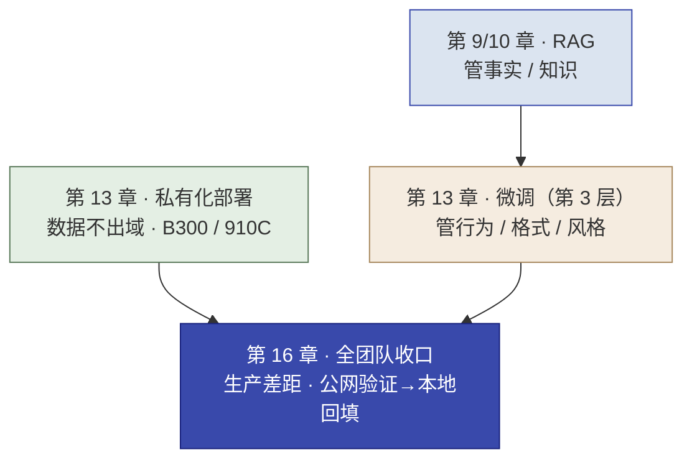
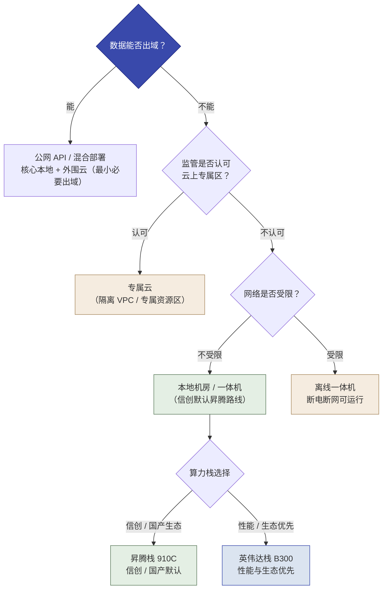
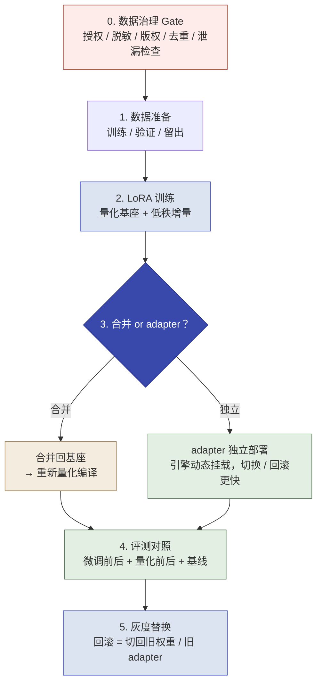
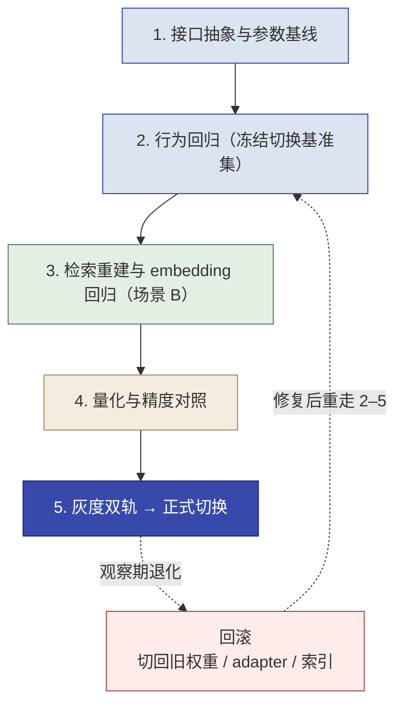

# 第 13 章  企业私有化部署与模型微调

> **本章定位：** 知识单元 · 进阶选读，承接第 7 章 LLM 四层级金字塔的第 3 层（微调），并深化第 7 章 7.4 的企业级本地部署。它解决两个常常被问的问题：**"项目要数据不出域，模型到底怎么私有化部署？"** 以及 **"RAG 不够用时，要不要微调、微调要花多少硬件与钱？"**
> **本章产出：** 你能说清"先 RAG 后微调、微调是最后一公里"；判断一个"行为/格式/风格类"问题是否值得上微调；看懂私有化部署的形态（本地机房 / 专属云 / 离线一体机 / 混合）与两条算力路线（英伟达 B300 / 昇腾 910C）、推理 vs 微调的硬件差异（含显存粗略下界）；掌握 LoRA / QLoRA / 全参 SFT 三种方法、一次微调的典型流程与**数据治理 Gate**、成本量级，并能完成一个**小模型 QLoRA 实验**；说清**从公网验证到本地回填**要做哪些适配与回归（13.7）；把"数据不出域"落地为工程决策。
> **建议读者：** Delta（施工判断主力）为主，Echo 参与"要不要微调"的选型共识。
> **前置：** 第 7 章（四层级金字塔 7.2、企业级本地部署 7.4、选型三要素 7.3、动态速查 7.8）、第 9/10 章（RAG，作对照）。
> **定位说明：** 本章**不是五个实操里的一环**，而是一条副线选读：时机判断（如"何时把本地微调补进生产回填"）在第 16 章实操五收口时参考，切模型时的适配与回归见 13.7。数据信息截至 **2026 年 8 月**，动态型号与价格联动 **7.8 速查**，落地前以各厂商官方资料复核。

---

## 本章导学

- **学习目标：**
  1. 说清"先 RAG 后微调、微调是最后一公里"的判断逻辑，以及 RAG 与微调的分工（事实性 vs 行为性，默认分工而非绝对规律）；
  2. 看懂私有化部署的四种形态（本地机房 / 专属云 / 离线一体机 / 混合）与两条算力路线（B300 / 910C）、"推理 vs 微调"的硬件差异（显存为粗略下界）；
  3. 区分 LoRA、QLoRA、全参 SFT 三种微调方法，说出企业默认路径与各自硬件量级；
  4. 复述一次微调的标准流程（数据治理 Gate → 数据 → LoRA → 合并或 adapter 独立部署 → 量化编译 → 评测对照 → 灰度替换）及其纪律；
  5. 说清微调的成本量级，用"先问 LoRA 够不够、再问要不要全参"做决策；
  6. 用一份判断清单判断"该不该微调"，并落地"数据不出域"红线；在小模型上完成一次 QLoRA 实验（可选动手）；
  7. 为"公网 → 本地/微调"切换做适配与回归（13.7）：接口/行为/质量三层面、冻结切换基准集、量化对照、灰度双轨与回滚。
- **前置知识：** 第 7 章四层级金字塔（微调在第 3 层，见 7.2 / 图 7-2）、7.4 本地部署硬件栈、7.8 动态速查、9.1/10 章 RAG。
- **章节地图：** 前几章讲的是金字塔第 1 层（提示词 / 分类）、第 2 层（RAG）、第 4 层（智能体）；本章补上**第 3 层（微调）**，并回答它背后的"私有化部署"工程。它作为进阶选读，帮助你处理"数据不出域 + 行为类需求"这类只能用私有化 + 微调解决的场景。13.7 承接第 8/10/12 章的公网 Demo：合规后切本地/微调模型，要过三层适配与回归才能宣告"本地回填完成"。

*图 13-1：本章是金字塔第 3 层与私有化部署的补全，为第 16 章收口的"本地回填"当技术底座*

---

## 13.1 先看清"最后一公里"：什么时候才轮得到微调

### 13.1.1 为什么微调在"从最简单开始"里靠后

回到第 7 章的四层级金字塔（图 7-2）和使用纪律"**从第一层开始**"：提示词 → RAG → 微调 → 智能体。微调排在第 3 层，意味着它**不该是第一个想到的手段**。原因不只是成本，而是它是一次**系统性改动**：

- **RAG** 只动"检索哪段知识喂给模型"，模型权重不变，改知识标库即可、可回滚、可溯源；
- **微调** 会**改变模型本身的权重**，改完要重新评测、重新量化编译、有模型退化风险，回滚成本高。

因为改动面大，所以它天然排在"最后一公里"——只有更简单的层（提示词 / RAG）确实覆盖不了时，才轮到微调。

### 13.1.2 RAG 与微调的分工：事实性 vs 行为性

| 维度 | RAG | 微调（LoRA 级） |
| :--- | :--- | :--- |
| 擅长解决 | **事实 / 知识**：答案可溯源、内容更新只需重建索引 | **行为 / 格式 / 风格 / 私有协议**：固定输出格式、行业话术、工具调用习惯 |
| 不擅长 | 改变模型的表达行为或固定格式 | 注入"新事实"（微调不擅长让模型记住你没提供的数据） |
| 改动 | 只改知识库，不碰权重 | 改权重，需评测量化回滚 |
| 定位 | 骨架，先做 | 收尾，最后一公里 |

> 两者是**互补**，不是替代。绝大多数"知识问答"需求用 RAG 就够（这也是第 10 章选 RAG、不选微调的原因）；只有 RAG 覆盖不了的**行为类**问题（比如"输出必须是固定的工单三段式""必须用某行业的约定话术"），才轮到微调。
>
> **注意：这只是默认分工，不是绝对规律。** 微调也能部分注入"行为化的事实"（把固定话术和少量事实一起固化），RAG 也能通过提示词约束输出模板。判断标准始终是**"改哪一层代价最小、最可回滚"**，而不是机械套用"事实归 RAG、行为归微调"。

### 13.1.3 判断入口：RAG 覆盖不了"行为类"才谈微调

以一个政企场景为例：政策问答里"答案对"靠 RAG（事实）；而"回答必须按固定模板，且每份报告都要带文号引用格式"这种**格式与行为**要求，如果关 RAG 怎么做都做不到位，才会考虑用 LoRA 让模型"学会"这个输出习惯。判断的最短路径是：**先用提示词 + RAG 试；评测卡在"行为/格式"这类模型权重要改才能解决的节点上，再谈微调。**

---

## 13.2 私有化部署的形态与两条算力路线

### 13.2.1 私有化 ≠ 只能放客户本地机房

"数据不出域"落到部署形态，**不只是"买台机器放客户机房"一种选择**。按数据敏感度与组织制度，常见四种形态：

| 形态 | 是什么 | 适合谁 | 与"不出域"的关系 |
| :--- | :--- | :--- | :--- |
| **本地机房 / 一体机** | 硬件部署在客户自有机房/园区 | 涉密、高合规、无云依赖 | 数据与权重物理隔离在客户可控网络内 |
| **专属云（隔离 VPC / 专属资源区）** | 云厂商在客户专属 VPC / 资源隔离区内运行，租户级隔离 | 一般政企、运维能力强、可接受云上专属区 | 逻辑隔离 + 合规边界按云租户划（需确认监管认可） |
| **离线一体机** | 一体化交付、断电断网仍可运行 | 现场网络受限、极端隔离场景 | 强隔离、弱联网 |
| **混合部署** | 核心数据与模型在本地，外围（如不敏感工具链）走云 API | 多数政企的现实形态 | 突出"最小必要出域"，明确边界清单 |

> **落地判读：** "私有化"是**数据不出域的工程实现**，选哪种形态取决于**监管要求、网络条件与运维能力**，不是"只能本地机房"。涉密高合规 → 本地机房/一体机；一般政企 → 专属云或混合；网络受限 → 离线一体机。（决策三要素同第 7 章 7.3：任务复杂度 / 数据敏感度 / 部署约束。）

### 13.2.2 两条算力路线：英伟达 B300 栈 vs 昇腾 910C 栈

| 栈 | 代表硬件 | 关键规格（以官方为准） | 适用 |
| :--- | :--- | :--- | :--- |
| **英伟达栈** | **B300（Blackwell Ultra）** | 单卡 **288GB HBM3e**（其余规格见 7.8 速查 / NVIDIA 官方页） | 大规模/多卡集群，性能与生态占优 |
| **昇腾栈** | **昇腾 910C**（当前国产算力主力）+ MindIE 引擎 | 按型号（见 7.8 速查） | 信创/政企"数据不出域"默认，国产原生适配 |

> 政企默认做法（呼应 7.4）：涉密/高合规走全私有化一体机；一般政企走"私有化核心 + 云 API 补充"混合形态；信创环境默认昇腾路线。决策三要素同第 7 章 7.3——其中"数据能不能出域、监管认不认可云上专属区"直接决定选哪种形态与算力栈。

*图 13-2：私有化形态与算力决策树——先问"数据能否出域"，再定形态与算力栈*

> **读法：** 第一问永远是"数据能否出域"（红线）；能 → 公网 / 混合；不能 → 先看监管是否认可云上专属区（专属云），不被认可再看网络是否受限（本地 / 离线一体机），最后按信创或性能偏好选算力栈（决策三要素同 7.3）。

### 13.2.3 推理 vs 微调的硬件差异：微调显存远大于推理

同一个模型，**服务推理花钱少、做微调花钱多**。关键在显存，但要注意**"显存≈权重体积"只是粗略下界**：

- **推理**：需要放**权重 + KV cache + 激活 + 运行时缓冲 + 并发余量**——并发上去后显存占用明显高于权重体积；"显存≈权重体积"只是启动级粗略下界；
- **全参微调**：还要同时存**梯度 + 优化器状态**（Adam 约 3–4× 权重开销），显存≈权重的 4~6 倍（下界，实际更高）；
- **LoRA 级微调**：原权重冻结，但**训练时仍有激活、梯度和低秩增量的优化器状态**——显存**低于全参、明显高于纯推理**，并非"接近推理"。只有把优化器状态省掉（如部分量化 / 冻结策略）才更接近，那属于工程优化而非默认情形。

> 这就是为什么"能用同一台 8 卡服务器微调"和"要上集群"的物理分界很大：**推理可单节点，全参微调常常要跨多机。** B300 的 288GB 单卡大显存让这个分界抬高了——很多 LoRA/QLoRA 微调现在单节点甚至单卡就能做。

### 13.2.4 一体化 / 训推一体机 / 集群三档选型

| 形态 | 典型硬件 | 适用边界 |
| :--- | :--- | :--- |
| 消费级"工作站"（非交付形态） | RTX 4090 24GB 等 | 7B 级 QLoRA 实验、PoC；**不是政企交付主体，只在原型一卷点一句** |
| 专业工作站 / 桌面一体机 | DGX Station 等 | 团队级开发、私有化小规模训练/微调 |
| **8 卡服务器 / 训推一体机** | B300 整机、昇腾训推一体机 | **政企私有化主力**：推理 + LoRA 微调共用一台 |
| **企业集群** | 8×80GB 机群 / Atlas 800T A2 / Atlas 900 A3 | 全参 70B+ / 大批量 LoRA，多项目共享算力池 |
| 智算中心（万卡级，政企租用） | 万卡昇腾/英伟达集群 | 大模型预训练/大规模后训练，政企以算力券方式租用 |

> 边界口诀（教材提炼）：**"能在一台 8 卡服务器里完成的（LoRA/QLoRA）就在一台里完成；要跨多台的（全参 70B+/大量数据）才上集群；万卡集群是平台级投资，不是单项目采购。"**

---

## 13.3 三种微调方法：LoRA、QLoRA 与全参 SFT

### 13.3.1 三种方法

| 方法 | 原理 | 关键 |
| :--- | :--- | :--- |
| **LoRA**（低秩适配） | 冻结原权重，只训练注入的低秩增量矩阵 | 显存明显低于全参（仍高于推理，见 13.2.3）；几百~几千条领域数据即可见效 |
| **QLoRA** | 4-bit 量化基座 + LoRA | 显存再降，单卡可跑更大模型；代价是训练慢、极端量化有质量损失 |
| **全参 SFT** | 更新全部权重 | 需同时存权重+梯度+优化器状态，显存≈权重 4~6 倍（下界）；通常数万~百万条数据才值 |

> **标准术语规范（教材标注）：** LoRA（Low-Rank Adaptation，低秩适配）、QLoRA（4-bit 量化基座 + LoRA）、全参 SFT（Full-parameter Supervised Fine-Tuning）。这是把"微调"讲清楚的三把尺子。

### 13.3.2 微调硬件量级（示例口径，非在售配置）

具体到"哪个模型要几块卡"，取决于模型规模、量化档、框架实现与显存实测——**不再逐模型列卡数**（动态清单见第 7 章 7.8 速查；落地以模型官方部署文档与 LLaMA-Factory 实测为准）。只给决策用的量级：

| 模型量级 | QLoRA | LoRA | 全参 SFT |
| :--- | :--- | :--- | :--- |
| 十 B 级（7B–70B） | 单卡（24–80GB）即可起步 | 单卡/双卡可跑 | 8 卡或集群 |
| 百 B 级 | 双卡 ~ 单节点 | 单节点 8 卡 | 多节点（集群） |
| 万亿参数级 | 单节点起（显存吃紧） | 单节点 8 卡可选 | 不建议常规全参（需大规模集群） |

> **教材落点（信息截至 2026-08）：** 企业微调的默认路径是 **"量化基座 + LoRA/QLoRA"**：十 B~百 B 级用单卡到单节点，万亿参数级用 8 卡单节点起步；**全参 SFT 只在上游厂商/专项后训练才出现，企业交付基本不碰。** "几卡"是公式量级推演，落地前以 LLaMA-Factory/框架的显存实测与官方模型卡为准。

---

## 13.4 一次微调的典型流程

企业微调通常走一条标准流程（教材提炼，各环节工具与事实有官方来源）：

| 步骤 | 做法 | 工具/框架 |
| :--- | :--- | :--- |
| **0. 数据治理 Gate** | 进微调前的第一关：授权 / 隐私脱敏 / 版权 / 去重 / 血缘与版本 / 删除可达 / 泄漏检查（见 13.4.1） | 内部数据管道 |
| **1. 数据准备** | 领域语料清洗、构造"指令-回答"、划分训练/验证/留出集；企业常从 RAG 阶段沉淀的问答对直接复用 | 内部数据管道 / LLaMA-Factory 数据格式 |
| **2. LoRA 训练** | 加载量化基座 + LoRA 增量，按量级单节点或单卡跑；MoE 注意 expert 路由与 LoRA 作用层 | **LLaMA-Factory**（统一微调框架，[昇腾生态已有社区验证](https://docs.vllm.ai/projects/ascend/en/v0.11.0/community/user_stories/llamafactory.html)） |
| **3. 合并 / 导出** | 两条路径二选一：**（a）合并回基座 → 重新量化编译**（经典路径，推理引擎统一）；**（b）adapter 独立部署**（推理引擎原生支持多 adapter 动态挂载，无需合并与重量化，切换/回滚更快） | LLaMA-Factory 合并导出；vLLM LoRA 模块等 |
| **4. 量化编译** | 若走合并路径，自训权重转 FP8/NVFP4 再上生产；注意 FP8 KV Cache 精度验证 | NVIDIA ModelOpt 等 |
| **5. 评测** | **基准对照**：固定评测集（业务指标 + 通用能力）——**微调前后、量化前后、与基线 RAG/提示词方案**三组对比，确认没有整体退化 | 内部评测框架 |
| **6. 灰度替换** | 新模型先灰度替换旧模型，守卫 SLA 与回滚预案（回滚 = 切回旧权重 / 旧 adapter） | vLLM / SGLang + 网关灰度 |

> [!CAUTION] **微调的工程纪律（呼应第 7 章四条工程纪律）：** 1. 走**合并路径**时，LoRA 合并后权重变了，推理引擎侧需**重新量化/编译再上生产**；走 **adapter 独立部署路径**则无需合并重量化，但需确认引擎对多 adapter 的支持；2. 上线前必须做**基准对比评测**（微调后模型不能整体退化）；3. **保留可回滚的旧版本**（权重或 adapter）。微调是系统性改动，做错一次代价高于 RAG。
>
> **衔接 13.7：** 微调完把新模型放进生产，就是"模型切换"——这里的灰度与回滚纪律，到 13.7 的"公网 → 本地"切换时原样沿用（再加上接口与行为层面的适配回归）。

*图 13-3：一次微调的七步流程——第 3 步在"合并回基座"与"adapter 独立部署"间分叉*

### 13.4.1 数据治理 Gate：进微调前的第一关

微调会**把数据烙进模型权重**——因此训练数据比评测数据更要用治理 Gate 把关（呼应第 7 章纪律四"数据与评测证据独立、可追溯、可复现"）：

| 检查项 | 要求 |
| :--- | :--- |
| **授权** | 数据来源有授权记录（客户数据用于训练是否在合同/制度范围内） |
| **隐私与脱敏** | 个人信息、敏感信息先脱敏/去标识，训练样本不得带真实个人信息 |
| **版权** | 不直接用未授权的第三方内容（书籍、竞品文档）充当训练语料 |
| **去重** | 重复样本去重，避免某类样本被过度加权 |
| **血缘与版本** | 数据集带来源、版本号、生成脚本与改动记录 |
| **删除可达** | 数据应可删除/可剔除（客户撤回授权时能重新训练替换） |
| **泄漏检查** | **评测集 / 盲测集不得进入训练语料**——否则评测是"开卷考试的答案被背过"，数字全部失真 |

> **反模式：** 把验证集顺手加进训练集"提升效果"——这是微调项目最常见的自我欺骗，等于自己出题自己考（呼应第 7 章纪律一/四）。

---

## 13.5 成本量级与决策

| 场景 | 费用量级（人民币 / 次，信息截至 2026-08） | 备注 |
| :--- | :--- | :--- |
| 7B 级 LoRA/QLoRA（单卡，小时~天级） | **千元级 ~ 数千元级** | 自有硬件电费/折旧 + 人力 |
| 70B 级 LoRA（8 卡，天级） | **数千元 ~ 数万元级** | 同上 |
| 70B 全参 SFT（8 卡集群 × 数天） | **数万元 ~ 数十万元级** | 行业普遍量级，无官方定价 |
| 硬件采购视角 | B300 8 卡整机：**约 700 万元/台起步、供货紧张（2026 年行情，价格较去年底近乎翻倍，[快科技](https://m.mydrivers.com/newsview/1119716.html)、[C114](https://www.c114.net.cn/ainews/79642.html)）**；昇腾训推一体机**价格定位较高、随配置差异大**（[云从科技表述](https://news.sina.cn/j_uc.d.html?docid=nafmtrx8823451)） | ⚠️ 价格随行情波动大，落地前核价 |

> [!TIP] **决策口诀（教材提炼）：** **LoRA 是"千元~万元级"的事，全参 SFT 是"数万~数十万元级"的事；企业决策先问"LoRA 够不够"，再问"要不要全参"。** 8 卡整机的采购额通常远高于一次 LoRA 微调的成本——所以很多企业是"同一台 8 卡机既跑推理、也跑 LoRA 微调"。

---

## 13.6 该不该微调：判断清单 + 红线呼应（落脚点）

### 13.6.1 判断清单

拿到一个"要不要微调"的问题，按清单逐条核对：

- [ ] **先试过更简单的层吗？** 提示词调优、RAG 都试过且评测过？（没有就回去，别直接上微调）
- [ ] **问题是不是"行为/格式/风格"类？** 是事实/知识类问题 → 该用 RAG，不是微调；
- [ ] **数据治理 Gate 过关了吗？** 授权、脱敏、版权、去重、血缘、删除、泄漏检查（评测集没进训练）都过了？（见 13.4.1）
- [ ] **数据够不够好？** LoRA 也需几百~几千条高质量领域数据；数据质量差，微调效果很差；
- [ ] **有没有固定评测集？** 没有评测集就微调 = 无法判断是否退化；
- [ ] **能不能接受回滚成本？** 微调是系统性改动，需量化编译 + 灰度 + 可回滚预案。

> **反例（最容易犯）：** "感觉领域问题就该微调"直接上 LoRA——RAG 明明能解决的事实性问题也去微调，既违背"从最简单开始"（7.2），又凭空多承担评测/编译/回滚成本。微调不是"显得专业"的手段。

### 13.6.2 红线呼应：数据不出域

私有化部署 + 微调，本质上就是"数据不出域"红线的正向落地：

| 红线 | 本处落地 |
| :--- | :--- |
| **数据不出域** | 敏感/合规数据只能放在合规域内（本地机房 / 专属云 / 离线一体机 / 混合，见 13.2.1）——模型权重与微调数据不出政务/企业边界，走 B300 或昇腾 910C 私有化 |
| **人能判断、AI 能执行** | "值不值得微调、评测是否达标、要不要回滚"由人拍板；微调工具（LLaMA-Factory）只是执行的"后手" |
| （关联）**答案可追溯** | 若微调后仍需溯源，注意微调不擅长"给出可溯源的新事实"——事实类仍靠 RAG |

> 第 16 章实操五收口时，"公网验证 → 本地回填"的工程决策，其背后的"本地回填怎么做"，落到本章就是"私有化形态选型 + 如需再微调 + 切换适配（13.7）"。**数据不出域不是口号，在这里变成"选哪种部署形态、买什么档位的硬件、走不走私有化微调"的具体选择。**

---

## 13.7 模型切换适配：从公网验证到本地回填

> **场景：** 第 8、10、12 章的三个 Demo 都是基于**公网模型 API**（课堂模拟数据）验证成立的。当合规要求"数据不出域"时，模型切到**本地部署 / 微调后的模型**（13.2 形态与算力、13.3 方法）。问题是：**之前验证过的功能，切换之后是否还成立？**

> [!IMPORTANT]
> **答案：功能会漂移，切换必须做适配与回归，而不是换一个 base_url 就完事。** 三个 Demo 的验收口径——A 分类准确率 + 转人工率、B 双指标（答案准确率 + 来源可追溯） + 库外拒答、C 路由正确率 + 敏感件零漏判——在切换后必须**重新验证成立**，才允许宣告"本地回填完成"（这个结论会成为 14.5 切换 Gate 与 15/16 章"公网验证 → 本地回填"证据的核心）。

### 13.7.1 为什么必须适配：三个层面

**接口层。** 本地推理引擎（vLLM、MindIE 等）通常提供 OpenAI 兼容端点（[vLLM 官方文档](https://docs.vllm.ai/en/v0.22.0/serving/online_serving/)），应用层可以只改 `base_url` 就"看起来能跑"——但隐藏的差异常在别处：请求超时与重试策略（本地并发池有限，429/超时行为不同于公网 API）、参数通道（temperature / max_tokens / top_p 的语义与上限）、并发与限流（本地服务的 RPM/TPM 由部署容量决定，[社区实践：供应商切换检查清单](https://github.com/XidaoApi/llm-provider-migration-checklist)）。如果引擎不提供兼容层、或走的是自定义协议（如昇腾 MindIE 的某些原生接口），就要**自建 provider 适配层**——统一"模型无关"的调用接口，这本身是 14.9 的工程回注候选（一次适配，换模型不再改业务代码）。西岭例：课堂里 Streamlit + DeepSeek SDK 切到本地 vLLM 端点，通常改 base_url 即可跑通，但"跑通"只是起点——真正的适配在下面两层。

**行为层。** 不同模型对同样的 Prompt、同样的输出要求，表现出不同的行为：
- **指令遵循与 Prompt 兼容性**：长 system prompt、few-shot 示例在不同模型上的效果不一样；公网模型上"压得住"的提示词，本地或微调模型可能纪律变弱；
- **输出格式稳定性**：JSON / 结构化输出是 AI 落地的硬依赖——不同模型的 JSON schema 遵循能力差异很大，解析失败率要单独测，而不是只看"内容对不对"；
- **工具调用（function calling）**：schema 兼容性、`thinking` 内容是否要回传（11.8.2 的 DeepSeek reasoning_content 案例）、多轮工具调用的消息历史格式——这些在换模型后最容易悄悄坏掉；
- **采样与上下文**：temperature 的作用范围、tokenizer 不同导致的 max_tokens 换算与上下文长度预算变化（也会影响 9 章分块参数）。

**质量层。** 行为之外还有质量漂移：
- **量化漂移**：本地模型常走 FP8 / NVFP4 / INT4（13.4 第 4 步量化编译）。FP8 通常损失很小，NVFP4 更明显，INT4 必须按评测定档——量化后的输出质量必须与公网基线在同一基准上对照；
- **embedding 更换（场景 B）**：公网 embedding 换成本地 BGE-M3，向量维度、相似度分布、top-K 阈值都变了——**必须重建索引**，并重新回归"检索命中 + 库外拒答"；
- **微调模型的行为漂移**：微调（即使只是 LoRA）会改变输出风格与话术，甚至轻微改变分类边界；合并部署 vs adapter 独立部署（13.4）在推理时表现也可能有差异。

### 13.7.2 适配五步：从接口抽象到灰度回滚

*图 13-4：模型切换适配五步——顺序不跳、退化可回退（虚线为失败回退路径）*

**第 1 步 · 接口抽象与参数基线。** 用 OpenAI 兼容 API 作切换抽象层（或自建 provider 适配层）；记录两套参数基线（temperature / max_tokens / 超时 / 重试）的差异并统一到业务配置。为什么：接口通了只是"能调通"，参数语义不同会让同一套业务配置在新模型上行为漂移。西岭例：本地端点的重试与退避策略应沿用 7 章纪律，避免"切了模型后开始无限重试"。验收证据：同一请求在两套端点上的参数对照表。

**第 2 步 · 行为回归（冻结"切换基准集"）。** 切换前冻结一份**切换基准集**（与第 7 章纪律四一致：评测证据独立、可追溯、可复现），切换后同一批样本重测：先测**格式与工具**（输出格式符合率、JSON 解析成功率、工具调用成功率），再测**业务指标**（分类准确率、RAG 双指标与拒答、路由正确率与零漏判）。为什么先测格式后测业务：格式坏了，业务指标无从谈起。西岭例：A 场景 25 条盲测样本 + 6/6 全对口径在切换后重跑。验收证据：同一基准集 × 两个模型的对比表（含样本环境标注）。

**第 3 步 · 检索重建与 embedding 回归（场景 B）。** 换 embedding 后**重建索引**（解析→分块→向量化→入库全链路重跑，9 章），并回归：检索命中率、双指标、**库外拒答**——库外问题是最容易在"换模型/换 embedding"时退化的（旧阈值在新向量空间里可能放行）。西岭例：B 场景政策库重建后，抽查 3 条库内 + 2 条库外。验收证据：重建记录 + 检索/拒答回归报告。

**第 4 步 · 量化与精度对照。** FP8 / NVFP4 / INT4 在同一基准集上对照公网基线；**低于验收线时按顺序调整**：先调 Prompt → 再调阈值 / top-K → 换更高量化档 → 换更大底座 → 最后才考虑微调（13.6 判断清单）。为什么量化对照单独列一步：量化是"看不见的精度损失"，不对照等于赌。西岭例：A 场景 NVFP4 下准确率跌破 95% → 升 FP8 复测。验收证据：量化档 × 指标对照表。

**第 5 步 · 灰度双轨 → 正式切换 → 回滚。** 新旧并行或**影子流量**对比线上指标（[社区实践：影子流量与金丝雀评估](https://futureagi.com/blog/llm-eval-shadow-traffic-canary-2026/)），观察转人工率、拒答率、类别分布、延迟、成本；观察期通过后正式切换；**回滚 = 切回旧权重 / 旧 adapter / 旧索引**。为什么必须双轨：基准集回归覆盖不了线上分布，线上观察是最后一关。西岭例：C 场景敏感件转人工率在观察期不变，才切全量。验收证据：观察期指标记录 + 回滚预案演练记录。

### 13.7.3 三场景适配对照

| 场景 | 切换前已验证（公网） | 切换后必验（本地/微调） | 适配动作 | 常见坑 |
|---|---|---|---|---|
| **A 诉求分类** | 分类准确率、转人工率、演示级声明 | 同口径重跑（同一盲测集） | Prompt 重写、温度/阈值参数基线、量化档选择 | 只改 base_url 不看格式漂移；量化后不对照 |
| **B 政策问答 RAG** | 双指标、库外拒答、建索引抽查 | 双指标 + 库外拒答 + 检索命中 | **换 embedding → 重建索引**、top-K/阈值回归、分块长度（tokenizer 不同） | 只换 embedding 不重建索引；拒答回归漏测 |
| **C 工单分级路由** | 路由正确率、敏感件零漏判、HITL | 路由正确率 + 零漏判 + 工具调用 | function calling schema、thinking 回传、HITL 恢复路径 | 工具调用 schema 不兼容；多轮消息历史格式变化 |

### 13.7.4 决策依据与切换 Gate

**何时必须切 / 何时可缓：** 数据不能出域的政务红线场景 → **必切**，无讨论余地（13.6.2）；数据已脱敏且经审批可在公网使用的模拟/公开场景 → 可暂缓切换（对应课内模拟数据的边界，8 章开头口径）。

**权衡维度（决策时逐项打分，而不是只看"合规"一票）：**

| 维度 | 公网 API | 本地部署/微调 |
|---|---|---|
| 数据安全 | 出域（需审批/脱敏） | 不出域（合规默认） |
| 成本结构 | 按量付费，无首期硬件投入 | 硬件/折旧 + 电费，长期边际低 |
| 延迟 | 网络往返，受供应商波动 | 内网低延迟，但受本地容量限制 |
| 功能 | 模型能力强、更新快 | 依赖所选底座与量化/微调质量 |
| 运维 | 供应商承担 | 客户/FDE 自运维（14.8 交接） |

**切换 Gate 五项（全部通过才"本地回填完成"）：**
- [ ] 切换基准集回归全过（格式 + 业务指标，含输出格式/工具调用专项）；
- [ ] B 场景检索重建 + 库外拒答回归通过；
- [ ] 量化对照达标（不低于公网基线且满足验收线）；
- [ ] 灰度双轨观察期关键指标无回退（转人工率、拒答率、类别分布、延迟、成本）；
- [ ] 回滚预案就绪（旧权重 / adapter / 索引版本可一键恢复）。

**联动纪律：** 切换即"六类版本"中的**模型版本变更**——代码、模型/权重、adapter、Prompt、配置、数据/索引全部记录版本（14.7 联动回滚）；**切换必须通知 Echo** 同步价值口径与成本（15.3），并纳入 14.5 Gate 与 16 章的"公网验证 → 本地回填"证据链。

### 13.7.5 反模式

- **只改 base_url 就上线。** 接口通了 ≠ 行为与质量同步成立——不回归必翻车。
- **切换前后各测一套"更好使"的样本。** 违反第 7 章纪律四，结果不可比、不可复现。
- **量化后不对照。** "FP8 能跑"不等于"解码质量没掉"——同一基准集对比是底线。
- **忽略输出格式与工具调用。** JSON 解析失败率、function calling schema 兼容要单独测，不是"内容对就行"。
- **RAG 只换 embedding 不重建索引。** 维度/阈值失配后检索与拒答都会悄悄退化。
- **切换不通知 Echo。** 验收口径、成本、延迟变化必须同步价值判断（15.3），不是纯技术动作。
- **没有回滚。** 旧权重 / adapter / 索引版本都要保留——"回填失败可回退"是底线（13.4 纪律）。
- **一次性全量切换。** 跳过灰度双轨观察，等线上出事才发现。

### 13.7.6 练手任务与验收

**任务（课堂可做的最小版）：** 选 A 场景，准备一份 20 题基准集；分别用**公网 API 与本地引擎（或本地小模型）**跑同一 Prompt，逐条比对：输出格式符合率、分类准确率、转人工判定一致性；记录两套端点与模型版本。有余力则做 B 场景：同一批文档分别在两套 embedding 下建索引，对比检索命中与库外拒答。
**验收证据：** 对比表（模型 × 指标 × 样本环境标注）、版本记录、切换 Gate 五项勾选。所有结论注明"仅本次环境与样本"。

### 13.7.7 迁移问题

- **"三种切"的适配深度不同：** 换基座模型（不经微调）适配最轻但行为差异最大；同基座只量化适配更轻（主要是质量差异）；同基座微调（LoRA）行为最可控，但要过 Data Gate 与回归（13.4.1/13.6）。决策顺序：先试最轻的切法，不过验收再升级。
- **切到第二客户：** 这份"适配清单 + provider 适配层 + 切换基准集"本身就是可回注的工程资产——provider 适配层进 14.9 工程回注候选，基准集做法进第 7 章纪律四的案例。

## 13.8 小模型 QLoRA 实验（可选动手：24GB 单卡可跑）

> 目的不是"微调出多强的旗舰模型"，而是**把 13.4 的流程在常见硬件上完整走一遍**——重点练训练数据、评测对照、回滚三个动作（呼应 13.6.1 判断清单）。**不追旗舰。**

- **硬件要求**：24GB 单卡即够（RTX 4090 级；无卡可用托管 GPU 或云端实例）。
- **模型与数据**：任选 7B 级开源模型（如 Qwen 系 / GLM 系小档，见 7.8 速查）；用自己构造的 **200–500 条"指令-回答"**（如"把政策问题改写成标准三段式答复"），按 8:1:1 划训练/验证/留出。
- **执行**：用 LLaMA-Factory 跑 QLoRA（4-bit 基座 + LoRA），训练 1–2 个 epoch，记录显存占用与训练时长——**观察"显存 > 纯推理、远小于全参"（对照 13.2.3）**。
- **评测对照**：同一份固定评测集，对比**微调前 / 微调后**的输出（格式是否符合预期、通用能力是否退化）——这是 13.4 步骤 5 的最小版。
- **回滚**：训练前保留原权重（或只保留 adapter 增量），证明"删掉 adapter 就能回到原模型"——体会"微调可回滚"的安全线。
- **进阶衔接（可选）**：把微调后的模型当作"本地回填"候选，按 13.7 跑一次切换基准回归（同 Prompt 双模型对比），体会"换了模型要重新验收"。
- **自检（DoD）**：1. 训练数据过了数据治理 Gate（至少隐私与泄漏检查）；2. 有微调前后对比记录；3. 能演示回滚；4. 能说出"这次微调对了什么、没对什么、值不值得上生产"。

---

## 反模式与红线

- **事实类问题也去微调。** RAG 能解决的知识/事实问题，微调不擅长也不该上——违背"从最简单开始"（对照 13.1.2）。
- **私有化只想到"本地机房"。** 专属云（隔离 VPC）、离线一体机、混合部署都是合法形态，选型看监管、网络与运维（对照 13.2.1）。
- **显存只算权重。** 推理还有 KV cache/激活/缓冲/并发余量，微调还有梯度与优化器——"显存≈权重"只是粗略下界（对照 13.2.3）。
- **"LoRA 显存接近推理"的错觉。** LoRA 训练仍有激活、梯度与优化器开销，显存介于推理与全参之间（对照 13.2.3）。
- **adapter 一律合并重量化。** adapter 可独立部署（引擎动态挂载），合并只是其中一条路径（对照 13.4 第 3 步）。
- **没有评测集就微调。** 无法判断是否退化，属系统性盲改（对照 13.4 纪律、13.4.1 泄漏检查）。
- **拿消费级显卡当企业交付。** 4090 只够 7B 级 QLoRA 实验，不是政企交付形态（对照 13.2.4，呼应 7.4.1）。
- **全参 SFT 当作默认。** 绝大多数政企微调 = LoRA/QLoRA；全参是少数，成本量级差一个数量级（对照 13.3/13.5）。
- **忽略量化与回滚。** 合并路径必须重新量化编译、留可回滚旧版本（对照 13.4）。
- **绕开数据治理 Gate。** 训练数据授权不清、含隐私或评测集——微调会把这些问题烙进权重（对照 13.4.1）。
- **绕开数据不出域。** 敏感数据必须私有化部署，微调数据也不出域（对照 13.6.2）。
- **把"切模型"当"换 base_url"。** 公网 → 本地切换要做接口 / 行为 / 质量三层适配与回归，三个 Demo 原验收口径必须重验（对照 13.7）。

> [!IMPORTANT] **红线本处落地：数据不出域。** 本章把"私有化部署（形态选型）+ 是否微调（Data Gate）"讲成具体工程决策，正是导读页第一条红线在"能训练/能改造模型"层面的兑现——敏感场景下，连"微调"也要在不违反合规边界的环境内完成。

---

## 本章小结

- **最后一公里**：先提示词 + RAG，评测卡在行为/格式类节点才谈微调；RAG 管事实、微调管行为是**默认分工、非绝对规律**，互补非替代。
- **私有化形态**：本地机房 / 一体机、专属云（隔离 VPC）、离线一体机、混合部署；两条算力路线 B300（英伟达栈）/ 昇腾 910C（信创默认）。
- **显存口径**：推理 = 权重 + KV cache + 激活 + 缓冲 + 并发余量；全参再加梯度与优化器（≈4~6× 权重）；**LoRA 介于两者之间，不是"接近推理"**。
- **三种方法**：LoRA（千元级）/ QLoRA（4-bit+LoRA）/ 全参 SFT（万~十万级，少数）；企业默认 LoRA。
- **一次流程**：数据治理 Gate → 数据 → LoRA → 合并或 adapter 独立部署 → 量化编译 → 评测对照 → 灰度替换，配基准对比与回滚。
- **数据治理 Gate**：授权 / 脱敏 / 版权 / 去重 / 血缘版本 / 删除 / 泄漏检查（评测集不得进训练）。
- **判断清单**：先简单层 / 行为类才微调 / Data Gate / 数据质量 / 固定评测 / 可回滚。
- **切换适配（13.7）**：公网 → 本地/微调切换必须过接口 / 行为 / 质量三层适配；冻结切换基准集、量化对照、灰度双轨与回滚，三场景验收口径不变。
- **小模型实验（13.8）**：7B 级 QLoRA 在 24GB 单卡可跑，重点练数据、评测对照、回滚，不追旗舰。
- **红线**：数据不出域 → 私有化部署 + 微调在合规边界内完成；人能判断 AI 能执行 → 拍板在人在。

**动手自检：**
- [ ] 我能说清"先 RAG 后微调、微调是最后一公里"吗？
- [ ] 我能说出私有化四种形态并判断"为什么不是只能本地机房"吗？
- [ ] 我能区分 LoRA / QLoRA / 全参 SFT，并说出企业默认路径吗？
- [ ] 我能说出"显存≈权重只是粗略下界、LoRA 不等于接近推理"吗？
- [ ] 我能复述一次微调的流程（含数据治理 Gate、adapter 双路径、基准对比）与工程纪律吗？
- [ ] 我能用成本量级 + 判断清单回答"要不要微调"吗？
- [ ] 我能说出公网 → 本地切换的三个适配层面与切换基准集，并知道三场景原验收口径不变吗（13.7）？
- [ ] （可选）我能在一个 7B 模型上完成 QLoRA 实验并演示回滚吗？

---

## 练习与思考

- **基础：** 默写 RAG vs 微调的分工（事实性 vs 行为性，并说明"为什么只是默认分工"）；列出三种微调方法及各自硬件/成本量级；默写数据治理 Gate 七项检查；说出公网 → 本地切换的三个适配层面（13.7）。
- **进阶：** 某客户要求"报告必须按固定模板输出、每份带文号引用格式"，且数据不能出域——按本章流程说明：先用什么、评测卡在哪、怎样用 LoRA 私有化落地、合并路径与 adapter 路径各适合什么场景、如何量化与回滚；若这是从公网模型切回本地，按 13.7 说明切换基准集怎么准备、先测什么。
- **挑战（迁移练习）：** 为一个"本地政务问答 + 强格式要求"的场景做一次技术决策：给出私有化形态选型（本地机房 / 专属云 / 混合）、算力栈（B300 还是昇腾）、是否需要微调（过一遍 13.6.1 清单，含 Data Gate）、成本量级，以及如何服务第 16 章收口的"本地回填"；若有条件，用 13.8 的小模型实验验证一次"格式行为"是否真的只能靠微调解决。

## 在线全书

- 见在线全书 https://www.cloudzun.com/fde-course/（第 16 章 AI FDE 落地 · Delta 技术与场景）——本地部署、私有化选型与信创落地扩展。
- 见在线全书 https://www.cloudzun.com/fde-course/（第 13 章 中国云服务商的 FDE 实践图谱）——中国云厂商私有化算力与落地图谱。
- 下一章：**本书第 14 章 Delta 工作法：生产落地、客户接管与能力回注**（把 Demo 接入客户真实环境，完成生产准入、客户接管与能力回注）。