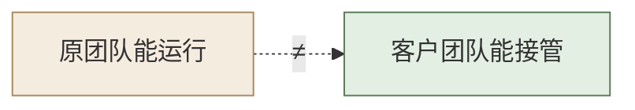

# 第 14 章  Delta 工作法：Build、Scale 与工程化交付

> **本章定位：** 知识 + 演练单元 · Delta 侧生产化实战（新增章）——把第 8/10/12 章的一个 Demo，从"演示可行"推进到"可运行、可观察、可恢复、可交接"的工程状态。它承接第 13 章的生产底座决策，为第 15 章的价值落地提供工程证据。
> **本章产出：** 你能区分 Prototype、Build 与工程 Scale 所需证据；用 Build Readiness Gate 识别生产差距；完成配置/密钥、日志/审计/指标、超时/重试/熔断/降级、权限与最小权限、版本/灰度/回滚、监控告警与运行手册的建设与验证；通过跨组接管演练；识别并验证至少一个可跨 Demo 复用的工程机制。
> **建议读者：** Delta（施工主力必读）；Echo 需理解"工程证据"长什么样（第 15/16 章会引用）。
> **前置：** 第 7 章（gstack 与四条工程纪律）、第 8/10/12 章任一个实操 Demo（默认第 8 章分类器）、第 13 章（生产技术底座决策，可选先读）。
> **适配说明：** 本章是 Delta 侧生产化单元，默认实验对象为**第 8 章诉求分类器**（业务简单、环境依赖少，便于模拟超时/错误/版本变化）；进阶可换第 12 章路由工作流（增加工具失败、人工审批、状态持久化、幂等、权限与审计）。**精确安装与运行命令待实验环境复核后，以随书资源包为准（本节只定目标、证据与验收，不写死命令）**。

---

## 本章导学

- **学习目标：** 完成本章后，你应能够：
  1. 区分 Prototype、Build 与工程 Scale 所需证据；
  2. 使用 Build Readiness Gate 识别生产差距（九维度 + 统一判断格式，含业务本体可执行性）；
  3. 完成配置与密钥管理，并验证"缺配置时安全失败"；
  4. 建设日志、审计与指标，并实际运行样本查看指标；
  5. 用故障注入设计并验证超时、重试、熔断与安全降级；
  6. 建立权限与最小权限模型，并验证越权被拒且留下审计；
  7. 管理代码、模型、Prompt、配置、数据与索引版本，完成一次灰度与一次回滚；
  8. 建立监控告警并至少真实触发一次告警，完成事故响应记录；
  9. 编写运行手册，通过跨组接管演练验证其有效性；
  10. 识别可跨 Demo 复用的工程机制，并在第二个 Demo 上完成最小复用验证。
- **前置知识：** 第 7 章（gstack 八环节、SPEC、四条工程纪律）、第 8/10/12 章（至少一个可运行 Demo）、第 13 章（私有化形态与选型，进阶）。
- **章节地图：** 第 13 章回答"底座部署在哪、模型怎么适配"；本章回答"**系统怎样接得住**"（工程 Scale）；第 15 章回答"组织为什么愿意接"（业务 Scale，Echo 主导）；第 16 章全团队作出最终交付决策。本章的每个生产差距与接管证据，都是 15/16 章"能上生产吗、能交给客户吗"的底气。

> **一句话记住本章：** Prototype 证明能做，Build 证明能稳定运行，工程 Scale 证明客户技术团队能接管——**Delta 让系统接得住。**

---

## 14.1 Prototype、Build 与工程 Scale 的证据边界

不同阶段回答不同问题，证据也随之升级，不能混着用：

| 阶段 | 核心问题 | 判断依据 | 反例（把低阶证据当高阶结论） |
|------|---------|---------|---------------------------|
| **Prototype** | 方案能不能成立 | 功能 Demo、小样本验证 | 25 条样本全对 → 宣称"能上生产" |
| **Build** | 系统能不能稳定、安全地运行 | 测试、异常恢复、权限、版本与回滚 | Demo 能演示 → 宣称"生产可用" |
| **工程 Scale** | 客户技术团队能不能持续运营 | 监控、告警、运行手册与接管演练 | 原作者能跑 → 宣称"客户能接管" |

> **核心结论：Prototype 证明能做，Build 证明能稳定运行，工程 Scale 证明客户技术团队能够接管。** 三者证据层层递进，缺一级就不能进入下一阶段的承诺（呼应第 3 章 Stage Gate：每阶段有过 Gate，凭据是"通过证据"）。

---

## 14.2 Build Readiness Gate：九个生产准备维度

Build 不是"把 Demo 打包上线"，而是对着九个维度逐项核"当前状态 → 生产差距 → 修复动作 → 责任人 → 完成证据"。**Build Readiness Gate（教材提炼）**：

| # | 维度 | 核的是什么 |
|---|------|-----------|
| 1 | 功能与数据 | 功能是否按 SPEC 完整；训练/开发/盲测数据是否隔离、可追溯 |
| 2 | 配置与密钥 | 配置与代码分离；Secret 不进源码/日志/仓库 |
| 3 | 性能与容量 | 并发、延迟、吞吐是否达到目标；容量结论是否注明假设与余量 |
| 4 | 稳定性与降级 | 超时、重试、熔断、安全降级是否生效（14.5） |
| 5 | 权限与安全 | 最小权限、越权拒绝、输入校验（14.6） |
| 6 | 日志、审计与指标 | "发生了什么 / 谁在何时做了什么决定 / 现在运行得怎么样"（14.4） |
| 7 | 发布、灰度与回滚 | 版本可追溯，灰度可切换，回滚可执行（14.7） |
| 8 | 运维与交接 | 监控告警、运行手册、接管演练（14.8 / 14.9） |
| 9 | **业务本体可执行性** | 对象有数据来源、关系可维护、动作有接口、权限可验证（14.10.1）；**未通过 → 降级为"概念模型"，不得宣称已形成平台能力** |

**统一判断格式（每个维度都按这个格式写）：**

```text
当前状态
→ 生产差距
→ 修复动作
→ 责任人
→ 完成证据
→ 未通过时的处理（补做 / 降级放行 / 回退——不得假装通过）
```

> [!CAUTION] **Gate 不是打分表演。** 写出"当前状态：能跑；差距：无"不算数——每一格都要有证据（日志、指标、测试记录、接管演练记录）。"未通过"是可接受的结果：它指明下一轮修什么（呼应第 3 章止损规则：连续不过就要降范围或终止）。

---

## 14.3 配置与密钥管理

生产系统的第一道纪律：**配置与代码分离，密钥永不入库。**

- 配置与代码分离；开发 / 测试 / 生产环境配置分离；
- Secret（API Key、口令、证书）**不进入源码、日志和版本库**，走环境变量或密钥管理；
- 模型、provider、Prompt、阈值等**业务参数可配置**（不硬编码在代码里）；
- **缺少必需配置时安全失败**：宁可拒绝启动并给出明确错误，也不带着错误配置继续跑。

> **实验（必做）：** 删除一项必要配置（如模型 API Key）后启动系统——验证系统**拒绝启动、报错信息明确且不泄露密钥内容**，而不是带错运行"看起来正常"。

---

## 14.4 日志、审计与指标

三件事别混为一谈：

| 概念 | 回答的问题 | 例子 |
|------|-----------|------|
| **日志（Log）** | 系统发生了什么 | 一次请求从进入到返回的全过程 |
| **审计（Audit）** | 谁在何时、用哪个版本、做了什么决定 | 管理员改了阈值；审核员批准了某条转人工 |
| **指标（Metric）** | 系统现在运行得怎么样 | 错误率、P95 延迟、转人工率 |

**日志至少包含：** `request_id`、请求时间、处理结果、延迟、异常类型、模型 / Prompt / 配置版本、是否转人工。**不得记录明文个人信息和密钥。**

**指标至少包含：** 请求量、成功率 / 错误率、P50 / P95 延迟、模型调用失败率、转人工率或拒答率、类别分布、token 或调用成本、场景质量指标。

> [!IMPORTANT] **必须实际运行样本并查看指标，不能只交设计说明。** 看不到数字的"日志系统"等于没做——把指标打出来、截图或导出成报告，才算完成（呼应第 7 章纪律四：证据要可追溯、可复现）。

---

## 14.5 超时、重试、熔断与降级

外部依赖（模型 API、工具、数据库）一定会出问题，关键是**出问题时的行为可预期**。用**故障注入**覆盖：API 超时、429 限流、500 服务错误、JSON 字段缺失、连续失败。

系统行为遵循一条链：

```text
短暂故障 → 有限次数重试
连续故障 → 熔断或暂停调用
不可恢复故障 → 安全降级或转人工
```

必须明确并写进配置：**最大重试次数、退避策略、总超时时间、熔断触发条件、恢复条件、降级输出**。

> [!CAUTION] **禁止无限重试，也禁止失败时编造答案或默认自动处理。** 模型调用失败时不能"编一段看起来对的回答"糊弄过去；工具失败时按 11.8.3 的兜底顺序：**失败 → 有限重试 → 降级（只读 / 简化）→ 转人工**，永远不越过"转人工"这条线。

---

## 14.6 权限与最小权限

把"谁能干什么"写成矩阵，并**实际验证越权被拒**：

| 角色 | 允许操作 | 禁止操作 |
|------|---------|---------|
| 普通业务用户 | 提交请求、查看本次结果 | 修改 Prompt、阈值和模型配置 |
| 人工审核员 | 处理人工升级、查看审核记录 | 修改代码、删除审计记录 |
| 系统管理员 | 修改配置、查看全量指标 | 绕过审计修改历史记录 |
| 审计人员 | 只读查看审计记录 | 执行业务操作和修改配置 |

> **实验（必做）：** 用普通用户身份调用管理功能，验证：请求被拒绝；拒绝行为进入审计日志；响应不泄露敏感配置。**"理论上不能"不算数，实测拒绝才算。**

---

## 14.7 版本、灰度与回滚

统一管理六类版本：**代码、模型 / provider、Prompt、配置、数据集、索引（RAG 场景）**——任何一次"回滚"都必须能说清"回滚到哪个版本"。

轻量实验流程（不引入 Kubernetes；可用双配置、双进程或测试脚本完成——教学重点是发布纪律，不是基础设施平台）：

```text
1. 运行稳定版 v1
2. 创建修改后的 v2
3. 将少部分测试请求分配给 v2（灰度）
4. 比较质量、延迟和成本
5. 人为制造 v2 退化
6. 执行回滚
7. 验证 v1 恢复
```

> **实验（必做）：** 完成一次灰度（v2 承接少量流量）与一次真实回滚（v2 故障 → 切回 v1 → 验证恢复），并留下版本清单与回滚记录。

---

## 14.8 监控告警与事故响应

至少建立三类告警：

1. **错误率持续超过阈值**（如连续 N 分钟 > X%）；
2. **P95 延迟异常**；
3. **转人工率 / 拒答率 / 类别分布异常**（业务口径漂移的早期信号）。

> **实验（必做）：** 实际触发至少一次告警，并记录：告警接收人、响应时间、排查过程、是否回滚、恢复验证、事故复盘。**没有真实触发过的告警规则，等于没有告警。**

---

## 14.9 运行手册与客户技术团队接管

运行手册是"客户技术团队唯一能依赖的文档"（呼应 14.1"工程 Scale 证明客户能接管"）。至少说明：启动 / 停止 / 健康检查；日志与指标位置；常见故障处理；配置修改流程；版本切换与回滚；人工升级条件；责任人与升级路径。

**跨组接管演练（本实验的压轴）：**

> **接管组不能询问原作者，只能依据运行手册完成系统启动、故障定位、版本回滚和服务恢复。**


*图 14-1：原团队能运行 ≠ 客户团队能接管——手册的检验标准是"离开原作者"*

> [!IMPORTANT] **"客户技术团队不依赖原作者也能运行，才说明具备工程 Scale 条件。"** 手册写得再全，没被一个不知情的人照着跑通，都是未验证的假设。

---

## 14.10 工程能力回注（Delta 侧）

本章只讨论 **Delta 侧的工程回注**（能力回注两条路径之一：工程能力回注 vs 业务语义回注，见 15.5.2；第 15 章判断业务通用性，本章负责工程可执行性）。典型候选：

- 配置加载模块（环境分离、缺配置安全失败）；
- provider 适配层（换模型 / 换厂商不改业务代码）；
- 日志与审计组件；
- 重试与熔断组件（退避、熔断参数可配置）；
- 健康检查；版本清单；告警规则；运行手册模板。

> **实验（必做）：** **至少选择一个工程机制在第二个 Demo 上复用**，证明它不是"只适用于分类器的定制实现"——例如把"重试与熔断组件"接进第 10 章 RAG 或第 12 章路由 Demo，跑一次冒烟验证。（这正是"碎石路 → 铺装公路"在工程侧的版本，呼应第 11 章 11.8.3 工具工程化。）

### 14.10.1 业务本体的工程验证

> 业务对象、关系、动作与权限的**设计是否正确**由第 15 章判断（业务语义回注，15.5）；本节只负责**验证它们能否真正进入系统**——把"概念本体"升级为"可执行本体"（教材提炼，思路见 Build Readiness Gate 第 9 项）。

**九项工程验证（逐项要有证据，不写"应该行"）：**

| # | 验证项 | 要求 |
|---|--------|------|
| 1 | 数据映射 | 每个对象属性都能找到稳定数据来源（表 / 接口 / 规则） |
| 2 | 身份与主键 | 对象如何唯一识别、如何避免重复对象（诉求编号、工单编号） |
| 3 | 关系维护 | 关系来自直接字段、规则计算还是人工确认，写清维护方式 |
| 4 | 状态一致性 | 状态变化有合法路径，并发冲突有控制（状态机可配置） |
| 5 | 动作接口 | 每个动作有真实 API、函数或人工流程，而非只有动词清单 |
| 6 | 权限与审计 | 谁能执行动作；失败与拒绝是否留痕 |
| 7 | 幂等与回滚 | 动作重试不造成重复分派、重复通知或重复写入（呼应 11.8.3） |
| 8 | 版本兼容 | 属性、关系与动作变化不破坏已有应用 |
| 9 | 跨 Demo 复用 | **至少一个对象或动作模型在第二个 Demo 复用验证** |

> [!CAUTION]
> **三级区分（结论必须分别称呼）：** **概念本体**（只完成对象与关系设计）≠ **可执行本体**（完成数据映射、动作接口与权限）≠ **已验证回注能力**（可执行本体已在第二场景复用）。没有完成映射与接口验证前，不得把画出来的对象关系图称为"平台能力"（对应 Build Readiness Gate 第 9 项"未通过 → 降级为概念模型"）。

---

## 反模式与红线

- **把 Prototype 证据当 Build 结论。** 25 条样本全对 ≠ 能上生产；Demo 能演示 ≠ 生产可用（呼应 14.1）。
- **Build Readiness Gate 走过场。** 每一格都要证据；"未通过"是可接受结果，假装通过才是事故（呼应 14.2、第 3 章 Gate）。
- **Secret 入库 / 进日志。** 环境变量 + 密钥管理；缺配置要安全失败，不带错运行（14.3）。
- **日志审计指标三合一糊着写。** 区分"发生了什么 / 谁做了什么决定 / 现在怎么样"，明文敏感数据一律不记（14.4）。
- **无限重试 / 失败编答案 / 默认自动处理。** 兜底顺序：失败 → 有限重试 → 熔断 → 安全降级 → 转人工（14.5、呼应 11.8.3）。
- **权限只写矩阵不实测。** 越权拒绝要真实发生、进审计、不泄露配置（14.6）。
- **只有版本号没有回滚。** 灰度与回滚必须真实做一遍（14.7）。
- **告警规则没触发过。** 至少要真实拉起一次告警并复盘（14.8）。
- **手册没人照着跑过。** 原团队能运行 ≠ 客户团队能接管；跨组接管演练是验收线（14.9）。
- **工程机制只在一个 Demo 里"成立"。** 至少一个组件要在第二个 Demo 复用验证，才算工程回注（14.10）。
- **把概念图当可执行本体。** 未完成数据映射、动作接口与权限验证前，只能叫"概念本体"；画了对象关系图 ≠ 平台能力（14.10.1）。

> [!IMPORTANT] **本章红线落地：** 生产工程的每条断言都要**实测证据**（日志、指标、故障注入、回滚、接管演练），并**明确标注"仅本次环境与样本"，不外推为普遍生产保证**——这与第 7 章纪律四（数据与评测证据独立、可追溯、可复现）、第 3 章 Stage Gate（凭通过证据过关）一脉相承。

---

## 本章小结

- **三阶段证据边界**：Prototype 证明能做 → Build 证明能稳定运行 → 工程 Scale 证明客户能接管。
- **Build Readiness Gate**：九维度（功能数据 / 配置密钥 / 性能容量 / 稳定性 / 权限 / 日志审计指标 / 发布回滚 / 运维交接 / **业务本体可执行性**），统一"现状→差距→动作→责任人→证据→未通过处理"格式。
- **九类生产能力**：配置密钥（缺配置安全失败）、日志审计指标三分、超时重试熔断降级、最小权限实测、六类版本 + 灰度回滚、三类告警 + 事故复盘、运行手册 + 跨组接管、工程机制跨 Demo 复用验证、**业务本体工程验证（14.10.1：数据映射 / 身份主键 / 关系维护 / 状态一致性 / 动作接口 / 权限审计 / 幂等回滚 / 版本兼容 / 跨 Demo 复用）**。
- **工程 Scale 判据**：客户技术团队不依赖原作者也能运行——手册是唯一依赖，接管演练是验收线。
- **证据纪律**：所有实测结论标注"仅本次环境与样本"；Gate 不过就是"未通过"，绝不假装通过。

**动手自检（对照 14.2 九维度）：**
- [ ] 配置与密钥分离，仓库 / 日志 / 交付环境无明文 Secret；缺配置时系统拒绝启动
- [ ] 请求日志含 `request_id` 与版本信息；审计日志不记明文敏感数据；指标可实际查看
- [ ] 超时、429、500、字段缺失、连续失败均已故障注入测试；有限重试、熔断、安全降级生效
- [ ] 普通用户调用管理功能被拒、拒绝进审计、不泄露配置
- [ ] 代码 / 模型 / Prompt / 配置 / 数据 / 索引版本可追溯；完成一次灰度与一次真实回滚
- [ ] 至少一类告警被真实触发并有完整事故响应记录
- [ ] 接管组仅凭运行手册完成启动、定位、回滚与恢复
- [ ] 至少一个工程机制在第二个 Demo 上完成复用验证
- [ ] 核心对象有数据来源、关系可维护、动作有接口、权限可验证——**分得清概念本体 / 可执行本体 / 已验证回注能力**
- [ ] 所有实测结论均标注"仅本次环境与样本"

> **建议课时：** 全章约 5–6 小时（一个教学日）：三阶段与 Gate 45 分钟；配置/日志/指标/权限 60 分钟；故障注入与降级 60 分钟；版本灰度回滚 60 分钟；监控告警与运行手册 45 分钟；跨组接管演练 45 分钟；复盘与工程回注 30 分钟。

---

## 练习与思考

- **基础：** 默写 Build Readiness Gate 九维度；默写"日志 / 审计 / 指标"的区别；默写失败兜底链（失败 → 重试 → 熔断 → 降级 → 转人工）；说出概念本体 / 可执行本体 / 已验证回注能力的区别。
- **进阶：** 给你负责的 Demo 写一张 Build Readiness Gate 表（任选 3 个维度走完"现状→差距→动作→责任人→证据"）；设计一次故障注入（选一种故障：超时 / 429 / 断字段），说明预期行为与验收方法——不写具体命令。
- **挑战（迁移练习）：** 为你的 Demo 挑 2–3 个核心业务对象，按 14.10.1 验证"数据来源 / 身份主键 / 动作接口 / 权限留痕"四项，判断它属于概念本体还是可执行本体；再把"重试与熔断组件"或"日志与审计组件"接到另一个 Demo 做最小复用冒烟验证并记录结果；写一份 5 分钟"生产差距陈述"（当前系统能证明什么、不能证明什么、下一个 Gate 是什么——这份陈述将是第 15/16 章的工程证据起点）。

## 在线全书

- 见在线全书 https://www.cloudzun.com/fde-course/（第 16 章 AI FDE 落地 · Delta 技术与场景）——生产化、部署与工程回注的落地扩展。
- 见在线全书 https://www.cloudzun.com/fde-course/（第 8 章 Phase 4 Scale）——Scale 阶段方法论全貌。
- 下一章：**本书第 15 章全程总览 · 价值落地与能力回注**（用本章的工程证据，回答"值不值得用、组织愿不愿意接"）。