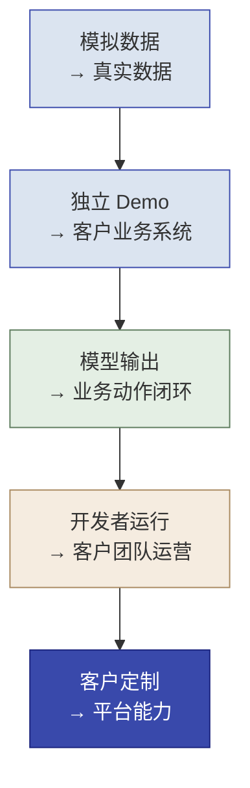

# 第 14 章  Delta 生产化 · 工程 Scale：生产落地与客户接管

> **本章定位：** Delta 侧生产落地单元，处在四阶段交付的 **Build 收口 + Scale 阶段**（坐标见第 3 章 3.3，角色分工见第 4 章 4.6）：承接第 8、10、12 章 Prototype 的 Demo，Delta 在此完成**生产评估、自运营交接、能力回注**三类职责。它不系统教授通用 DevOps 或 SRE，而是训练 FDE 如何把 Demo **接入客户真实数据、系统、流程和责任边界**，完成生产准入、客户接管与能力回注。以客户现场"最后一公里"为主线，通用运维内容只作为生产准入证据出现。
>
> **本章产出：** 你能用五个转换看清"Demo → 客户环境"的全貌；验证原型进入真实环境后数据、系统、业务、责任四类假设是否成立；把模型输出接入真实业务动作与人工兜底闭环；用 FDE 生产准入 Gate（八项）判断是否具备上线条件；应对客户现场变化并知道何时返回 Prototype / Discovery 或停止；完成客户自运营、接管演练与 FDE 撤出；识别并验证可回注的工程机制与业务本体。
>
> **建议读者：** Delta（精读）；Echo（需理解——14.6 的现场变化往往要 Echo 回来判断业务边界）；全团队。
>
> **前置：** 第 7 章（gstack 与四条工程纪律）、第 8/10/12 章（至少一个 Demo，默认第 8 章分类器）、第 13 章（生产底座，可选）、第 5 章（干系人与数据盘点）。
>
> **适配说明：** 默认实验对象为**第 8 章诉求分类器**；进阶可选第 12 章路由工作流。执行环境为"**模拟客户环境**"（见 14.10），不要求搭建完整生产基础设施。**精确安装与运行命令见随书资源包 `resources/environment/` 与《实验手册》对应章节——本章只定目标、证据与验收。**
>
> **本章属性：** **必做贯穿任务 + 知识支持**——不是编号实操，但须产出**模拟生产准入、接管、撤出与工程回注证据**（八项 Gate 差距、接管演练、回滚、回注候选），供第 16 章综合评审；计入团队与个人评价（评价量规见 `resources/certification/`）。

---

## 本章导学

- **学习目标（6 项）：**
    1. 区分 Prototype、FDE Build 与 FDE Scale，以及普通技术 Build / Scale 与 FDE 的区别；
    2. 验证 Demo 进入客户现场后的**数据、流程、系统和责任**假设；
    3. 将模型输出接入真实业务动作和人工兜底，形成闭环；
    4. 使用 FDE 生产准入 Gate 判断是否具备上线条件（八项，允许"有条件通过/继续试点/返回"）；
    5. 完成客户自运营与接管演练，明确 FDE 撤出条件（客户依赖下降 = 完成标志）；
    6. 识别并验证可回注的业务本体与工程机制（第二场景复用）。
- **前置知识：** 第 7 章（SPEC、gstack、数据与评测纪律）、第 8/10/12 章（三个 Demo 与验收）、第 5 章（数据盘点、干系人）。
- **章节地图：** 第 13 章回答"底座部署在哪、模型怎么适配"；本章回答"**系统怎样进得了客户现场、客户怎样接得住**"；第 15 章（Echo）回答"组织为什么愿意接、价值成不成立"；第 16 章用本章 Gate 结果做最终决策。

> **一句话主线：FDE 的 Build 是把原型嵌入客户真实业务；FDE 的 Scale 是让客户能够自行运营，并把可复用能力带回平台。**
>
> **Delta 在 Scale 阶段的三项职责（对照第 4 章 4.6 矩阵）：** 1. **生产评估**——真实环境持续验证假设与指标（14.2 / 14.5）；2. **自运营交接**——运行手册、接管演练、FDE 撤出（14.8）；3. **能力回注**——工程机制与业务本体的第二场景验证（14.9）。Echo 在 Scale 负责业务价值与组织采纳（第 15 章），Engineering 承接平台级运维深水区（14.7）。
>
> **本章回答三个问题：** 1. Demo 进入客户真实环境后，原来的假设是否仍然成立？2. 客户团队能否在不依赖原作者的情况下使用、处理异常和继续运营？3. 现场形成的哪些业务结构和工程机制值得回注平台？

---

## 14.1 从 Prototype 到客户环境：五个关键转换

全章地图是五个转换——每一节都是其中一个转换的展开：**转换 1–3 完成 Build**（把原型嵌入真实业务，14.1.1–14.1.3），**转换 4–5 属于 Scale 阶段**（客户自运营 + 能力回注，14.1.4–14.1.5，即 Delta 在 Scale 的两项核心职责）：


*图 14-1：FDE Build / Scale 的五个关键转换（自上而下，每个转换都有一组假设要验证）*

> **五个转换缺一不可：** 只完成前两个是"把 Demo 接到客户系统"，没有"业务动作闭环"和"客户能运营"，Build 并没有完成；第四个不完成，Scale 没有发生；第五个不做，公司退回"卖人力"。

### 14.1.1 模拟数据 → 真实数据

**客户现场问题：** 原型测试集是自己造的，字段干净、类别齐全；客户真实数据有缺失、有历史脏值、格式不一致，分布和原型假设对不上。

**FDE 判断：** 数据分布差异是否影响验收指标？真实数据能否在目标安全域内使用？谁对数据负责、数据更新如何通知？

**协作边界：** 数据权限、安全域判定（涉及数据分类分级，见 14.2）与客户数据团队确认，Delta 不自行取用客户核心库。

**西岭例子：** 原型里诉求文本规整；真实受理库里夹杂扫描件、方言、空白字段——分类指标能否复现要先验证，不能直接沿用演示数字。

**反模式：** 用原型测试集指标冒充真实数据验证——没有真实样本的"接入"不成立。

**轻量操作 / 验收：** 拿到一份"与原测试集格式不同"的客户真实格式数据，记录字段差异与指标变化；证据 = 数据样例 + 字段映射 + 差异清单。

### 14.1.2 独立 Demo → 客户业务系统

**客户现场问题：** Demo 是独立进程、本地入口；客户有口径不一的多套系统（受理、工单、知识库），"哪个是真账本"必须问清楚。

**FDE 判断：** Demo 的入口在哪（谁把什么交给它）；要调用哪些现有系统；哪个系统是**事实来源**（见 14.3）；结果写回哪里；用户用旧账号还是新账号；对接失败时业务如何继续。

**协作边界：** 联调测试数据、沙箱/测试环境向客户 IT 申请；Delta 不擅自改客户生产接口。

**西岭例子：** 分类器判断出"住建"后，要调用模拟工单接口把工单写回——不是"弹个标签看一眼"。

**反模式：** 只把 Demo 部署到一台服务器就宣称"接入"——没有入口、没有写回、没有事实来源，等于没接。

**验收：** 端到端演示：输入 → 判断 → 写回 → 可查；证据 = 接口联调记录 + 状态回写可验证。

### 14.1.3 模型输出 → 业务动作闭环

**客户现场问题：** 模型给出"这是住建类"不等于"工单真的分派给了住建局"。

**FDE 判断：** 输出经过哪些业务规则、权限判断、人工确认，落到哪个系统动作，动作结果写回哪里，失败时停在哪儿、谁继续处理：

```text
输入来自哪里
→ 模型或规则做什么判断
→ 谁确认这个判断
→ 调用哪个业务动作
→ 动作结果写回哪里
→ 失败时停在哪里
→ 谁继续处理
```

> **模型给出结果不等于业务动作已经完成；输出没有进入真实流程，就还没有完成 Build。**

**反模式（案例二）：** 分类器判断正确，但工单接口超时、工单没有真正分派——"模型指标正确 ≠ 业务闭环完成"。

**验收：** 一次完整动作链可走通且可回查（含失败路径）。

### 14.1.4 开发者运行 → 客户团队运营

**客户现场问题：** 系统上线后改阈值、看日志、处理异常都找原 Delta——客户离不开原作者。

**FDE 判断：** 谁启动/停止服务、谁处理失败请求、谁维护知识与规则、谁批准配置变更、谁解释指标变化、谁承担最终责任（见 14.8 六类 owner）。

**输出：** 运行与业务说明（不是只有技术 README）——客户照着能操作、能排障、能发起变更审批。

**反模式（案例五）：** "客户离不开原作者"不是 Scale 成功；**客户能够自运营才是**。

### 14.1.5 客户定制 → 平台能力

**客户现场问题：** 分类代码能复制到下一个项目，但"住建/人社/市监/城管"完全不可复用。

**FDE 判断：** 哪些内容只能留在客户域内（数据、专属政策、部门名称）；哪些对象/关系/动作与工程机制具有通用性；如何避免客户专属逻辑污染公共平台；如何用第二场景验证复用（见 14.9）。

**反模式（案例六）：** 代码可复用 ≠ 业务语义可复用——回注要区分客户内容、通用对象结构、通用工程机制。

---

## 14.2 真实环境适配：验证原型假设

> **FDE Build 最关键的问题：Prototype 成立时依赖的假设，进入客户真实环境后还有多少成立？** 用"原型假设核验表"逐条过：

| 原型假设 | 客户现场证据 | 是否成立 | 不成立的影响 | 调整动作 |
|---|---|---|---|---|
| 数据可得、口径一致 | 真实样本 + 字段映射 | 是/否 | 指标失真或范围收窄 | 换数据源 / 回 Prototype |
| 接口稳定、可写回 | 联调记录 | 是/否 | 无法闭合动作 | 降级人工 / 换集成方式 |
| 业务规则有正式口径 | 业务方确认 | 是/否 | 自动判断不可信 | 收窄自动化边界 |
| 责任边界清楚 | 责任人确认 | 是/否 | 不敢上线 | 补《谁负责》 |

**数据假设。** 核验：数据是否真实存在；字段含义是否一致；数据质量能否支撑当前方案；是否及时更新；是否可在目标**安全域**内使用——这涉及数据分类分级与"数据不出域"红线（参考《数据安全法》确立的数据分类分级保护制度，[中伦解读](https://www.zhonglun.com/research/articles/8527.html)、[数据安全法简评](http://www.zz-iplaw.com.cn/CN/10441-11332.aspx)，教材表述）；以及原型测试集是否代表真实业务分布。最常被跳过的是最后一条：原型测试集是自己造的，指标必然"好看"，真实分布一换数字就要重测。

**系统假设。** 核验：接口是否存在且稳定；认证方式是否允许接入；调用频率限制是多少；是否支持结果写回；旧系统是否兼容；是否有测试环境或沙箱。反模式：对着客户提供的接口文档自以为"能接"，结果认证不开放、没有沙箱、写回受限——联调一次就暴露。验收证据：至少一次真实环境（或模拟环境）联调记录。

**业务假设。** 核验：业务规则是否有正式口径；人工兜底是否有人承接；原有流程是否允许改变；业务人员是否接受新的职责；验收指标是否仍被业务方认可。**这一假设最容易被技术视角漏掉，却最影响能不能上线**——Echo 参与确认（呼应第 5 章干系人）。

**责任假设。** 核验：谁对模型输出负责、谁处理错误和申诉、谁批准高风险动作、谁维护数据/政策/部门规则、谁承担系统运行责任。责任不确定的自动化等于"没人负责的自动决策"，属于最危险的生产缺口（衔接 14.8 RACI 与 14.10 撤出条件）。

> [!IMPORTANT]
> **假设核验不是走过场。** 四类假设任何一条"不成立"都有对应的调整动作（换数据源 / 收窄边界 / 返回 Prototype），而不是硬着头皮上线再补救。
---

## 14.3 数据接入与业务语义对齐

> FDE Build 的核心工作之一，**不是通用数据工程，而是"业务语义对齐 + 找到事实来源"**。

**找到事实来源（Single Source of Truth）。**

对每个关键数据明确：哪个系统是**唯一事实来源**；是否存在多个冲突来源；谁能解释字段含义；数据延迟多长；数据错误由谁修复。概念与来源锚定参考[主数据 / 事实来源](https://www.sap.com/latvia/products/data-cloud/master-data-governance/what-is-mdm.html)、[MDM 说明](https://www.thoughtspot.com/data-trends/data-science/master-data-management)（教材提炼）。

**案例一（字段语义不一致）：** 工单系统的"类别"表示责任部门，数据平台的"类别"表示事件性质——Delta 只按字段名对接，分类结果会写入错误位置。**数据接入首先是业务语义对齐，不是接口调用。**

**对齐业务术语。**

同一概念在多个系统里常有不同名字——"诉求 / 案件 / 事件 / 工单"是否同一对象；"责任部门 / 承办部门"是否同义；"已处理 / 已办结 / 已关闭"是否同一状态。**Delta 不能自行猜测，应与 Echo、业务人员和系统负责人共同确认。**

**识别对象、关系、状态和动作（为回注收集候选）。**

为后续业务本体回注（14.9）收集：核心业务对象、对象属性、对象之间的关系、生命周期与状态、可以执行的业务动作、动作的权限与审批条件。**本节只完成业务语义对齐与候选收集；完整的业务通用性判断由第 15 章完成。**

---

## 14.4 从模型结果到业务闭环

三个 Demo 的 Build，完成标准都不是"输出正确"，而是**输出进入真实流程并闭合动作**：

| Demo | Prototype 结果 | 进入客户环境后必须闭合的动作 |
|---|---|---|
| **诉求分类器** | 输出分类标签 | 写回工单、低置信度进入人工队列、人工修正结果回流 |
| **政策 RAG** | 输出答案和来源 | 引用可打开原文、文档版本可核对、政策更新后重建并重新验证 |
| **路由工作流** | 输出处理分支 | 调用真实工具、进入审批、动作结果回写、失败可恢复 |
| **实操四B 协同 Agent**（无编号） | 输出动态轨迹 | 多轮状态与对话上下文、追问与人工暂停（interrupt+resume）、工具调用记录、工单草稿与状态回写（真实部署时全部留在批准安全域内） |

> **闭环程度递进：** 三个单点 MVP 各自闭合"一次动作"，实操四B（Lab4B）闭合"一条动态轨迹"（选工具 → 观察 → 追问 / 暂停 → 收束或转人工）。第 16 章对两者**分别验收**（第一层三场景、第二层实操四B）；有代码基础的学员可用实操四B 做综合毕业项目，继承三类闭环能力并新增多轮状态、追问与真暂停（进阶路径见 7.5 的实操四B 纪律与《实验手册》`labs/lab4b-cooperative-agent.md`）。

**业务动作链。**

统一检查（见 14.1.3 的动作链）：输入来源 → 判断 → 确认 → 动作 → 写回 → 失败停在哪 → 谁继续。

**人工兜底不是一个标签。**

"转人工"只有满足以下条件才算真实闭环：有明确接收队列、有负责人、有处理时限、人工可以看到必要上下文、审核结果能够回写、未处理任务会告警、后续可用于评测与改进。

**案例三（转人工没有接收人）：** 系统输出"转人工"，但没有人工队列、负责人和处理时限——**人工兜底必须进入真实流程，不能只是一个标签。**

**状态回写与事实一致性。**

明确：哪个系统保存最终状态；重复请求是否造成重复动作（幂等，见 14.7）；写回失败如何恢复；人工修改与 AI 建议冲突时以谁为准；审计链是否保留。

---

## 14.5 FDE 生产准入 Gate

把九维 Build Readiness Gate 收敛为**八项 FDE 生产准入条件**（教材提炼，Gate 结果要能喂给第 16 章作 Go/No-Go 输入；对照第 3 章 3.3.2 Stage Gate 总纲——**本表是 Build Gate 的工程侧展开**，判断"能否上线交给客户"；14.8 的撤出条件再喂给 **Scale Gate**，判断"能否宣告交付完成"）：

| Gate | 核心问题 | 通过证据 |
|---|---|---|
| **数据接入** | 真实数据可用且责任清楚吗 | 数据样本、字段映射、质量报告 |
| **系统集成** | 输入、动作和状态回写接通了吗 | 接口联调记录、端到端演示 |
| **权限责任** | 谁能看、谁能改、谁批准清楚吗 | 权限矩阵、越权拒绝、责任确认 |
| **异常兜底** | 外部依赖失败后业务还能继续吗 | 故障演练、人工队列、恢复记录 |
| **过程追溯** | 能还原一次业务判断和动作吗 | 日志、审计、版本标识 |
| **发布回退** | 新版本退化时能恢复吗 | 灰度记录、回滚验证 |
| **客户接管** | 客户团队能独立运行吗 | 运行手册、接管演练 |
| **回注准备** | 能区分客户专属与通用能力吗 | 回注候选、隔离说明、复用证据 |

**判断格式（每项都按此写）：**

```text
当前状态
→ 客户现场证据
→ 未关闭风险
→ 修复或降级动作
→ 责任人
→ 是否允许进入下一阶段
```

**Gate 结果允许：** 通过 / 有条件通过 / 继续试点 / 返回 Prototype / 返回 Discovery / 停止。**不得为了按计划上线把"未通过"写成"基本通过"。**

> [!CAUTION]
> **Gate 是给客户的承诺底线。** "未通过"是正常结果，掩盖风险才是失败；每个"有条件通过"必须写清条件、责任人、截止时间与下一个 Gate（第 16 章据此决策）。

---

## 14.6 客户现场的异常与变更

> 本节讲 **FDE 现场变化**，不是通用错误码——现场变化才是 FDE 工作的常态。

**常见现场变化。**

客户字段或接口改变；部门职责调整；政策文件更新；验收口径变化；客户临时扩大范围；一线人员拒绝使用；原系统接口不稳定；合规要求提高；客户负责人更换；人工审核容量不足。

**处理分级（Delta 不默认继续加代码）。**

| 处理方式 | 适用情况 |
|---|---|
| 临时修复 | 紧急恢复，不改变业务边界 |
| 配置调整 | 变化属于已设计的配置范围（类别清单、阈值、部门映射做成配置项） |
| 通用组件修改 | 多场景存在同类需求，值得工程回注 |
| 返回 Prototype | 技术方案或指标需要重新验证 |
| 返回 Discovery | 业务问题、用户或价值假设发生变化 |
| 停止 | 风险、成本或价值已不成立 |

**案例四（部门职责调整）：** 客户把一类事项从住建调到城管——如果逻辑写死在 Prompt 和代码里，修改困难且无法追溯；应优先通过**配置与业务模型**处理；超出原问题边界时返回 Discovery。

**变更不能绕过 Echo。**

以下情况必须重新让 Echo 参与判断：客户改变目标用户、业务成功标准变化、自动化边界扩大、人工责任发生变化、方案影响新的监管要求、原快赢场景不再有价值。**这体现 Echo 与 Delta 在 Build 阶段并非完全割裂。**

---

## 14.7 生产保障：FDE 必须会判断，但不必包办实现

> 配置、日志、重试、权限、回滚、监控仍然重要，但本章中它们是**生产准入证据**，不是课程主体。深水区实现（熔断器实现、监控平台搭建、分布式 Trace、Kubernetes、高可用集群、完整 SLO 方法、RTO/RPO 深入、供应链清单）**移入附录与资源包**，正文只留判断、验收与协作边界。**这些深水区若客户没有现成平台，由 Engineering（第 3 章 3.2.3）或客户平台团队承接，Delta 只定义准入条件与协作接口，不自行建设一套。**

**配置与密钥。**

FDE 必须确认：配置与代码分离；Secret 不进源码、日志和交付包；环境之间不误用配置；缺配置时安全失败。**底层密钥平台由客户安全或平台团队负责时，FDE 明确接口与责任即可，不自行建设一套密钥系统。**

**日志、审计与指标。**

FDE 必须确认系统能回答：发生了什么；谁作出了什么操作；当时使用什么模型、Prompt、配置和数据版本；系统现在是否异常。**具体监控平台可由客户既有系统承载。**

**超时、重试与安全降级。**

FDE 必须定义业务行为：失败后是否重试；重试是否造成重复业务动作（**有副作用的动作要幂等**——幂等键 / 状态确认 / 补偿三选一）；何时停止自动处理；何时进入人工；谁处理积压任务（衔接 14.4 人工队列容量）。

> **反模式：** 工单分派接口超时，系统不知道第一次是否成功，重试把同一工单分派两次——涉及外部动作时必须设计幂等键、状态确认或补偿。

**权限与动作边界。**

FDE 必须确认：模型可以**建议**什么、可以**执行**什么、哪些动作必须人工批准、哪些动作不得自动执行、操作是否可追责。**"模型有工具调用能力 ≠ 模型有权执行所有动作。"**

**灰度、回滚与监控。**

FDE 必须要求：新版本先小范围验证；退化后可切回稳定版本；关键业务指标和异常可见；告警有负责人和处置动作（呼应 13.4.2 灰度双轨与 13.4.4 联动回滚纪律）。**具体发布平台和监控工具不作为本章主线教学内容。**

---

## 14.8 客户自运营与 FDE 撤出

> **Scale 的完成标志不是"FDE 一直驻场保证系统运行"，而是客户对日常运营的依赖逐步下降。**

**客户自运营需要哪些角色。**

至少明确：业务 owner、技术 owner、数据 owner、人工审核负责人、安全与合规负责人、事故升级联系人（责任矩阵可用 RACI——谁负责 / 谁批准 / 咨询 / 知会，[RACI 说明](https://www.iapm.net/en/blog/successfully-analysing-and-presenting-responsibilities-the-raci-matrix/)）。

**客户需要掌握哪些操作。**

启动和健康检查；查看业务与系统状态；处理人工任务；更新政策、标签或配置；处理常见故障；版本切换和回滚；发起变更审批。

**接管演练（保留并强化跨组接管）。**

> **接管组不能询问原作者，只能依据运行手册和交接材料完成启动、处理一个预设异常、确认业务状态并恢复服务。**

文档是否有效，由接管者而不是作者判断。

**FDE 撤出条件（逐条勾选）。**

- [ ] 客户 owner 已确认；
- [ ] 日常操作已培训；
- [ ] 常见故障可独立处理；
- [ ] 人工审核队列有人负责；
- [ ] 关键指标有人查看；
- [ ] 版本变更有审批流程；
- [ ] 支持边界和升级渠道已确认；
- [ ] 未关闭风险已书面接受；
- [ ] 客户在限定观察期内完成独立运行。

---

## 14.9 工程能力回注与业务本体

**两类回注对象。**

| 回注类型 | 典型内容 | 判断重点 |
|---|---|---|
| **工程能力** | 配置、provider 适配（13.4.1）、审计、失败兜底、健康检查、交接模板 | 能否跨 Demo 复用 |
| **业务语义候选** | 对象、关系、状态、动作和权限 | 能否跨客户解释和执行 |

**第 14 章负责工程可执行性，第 15 章负责业务通用性和价值判断。**

**Palantir Ontology 的参考意义。**

对象的属性描述业务世界有什么；关系描述对象如何关联；动作和函数描述业务可以做什么；权限与治理约束谁可以执行。**本书借鉴这种方法（教材提炼），不要求使用特定平台**（完整"本体论"知识在第 15 章 15.4）。

**本体工程验证（Delta 侧）。**

Delta 需要验证：对象属性有稳定数据来源；对象身份可唯一确认；关系有维护机制；状态变化有合法路径；动作有真实接口或人工流程；权限、审计和失败处理可验证；客户专属数据没有进入公共平台；**至少一个对象或动作模型在第二个场景复用**。

**成熟度区分。**

```text
概念本体    → 已定义对象、关系和动作
可执行本体  → 已映射数据、接口、权限和状态
已验证回注能力 → 已在第二场景完成复用验证
```

> [!CAUTION]
> **不得把一张对象关系图直接称为平台能力。** 未完成数据、动作、权限和第二场景验证，只能叫"概念模型"（对应 Gate 的"回注准备"维）。

---

## 14.10 贯穿实操：把一个 Demo 接入模拟客户环境

> 本实验不要求搭建完整生产基础设施，而是模拟 FDE 把 Demo 接入客户现场的全过程。**默认对象：第 8 章诉求分类器**（业务简单、依赖少、便于观察接入与接管）；进阶组可换第 12 章路由工作流。

**模拟客户环境应提供：** 一份与原测试集格式不同的"客户真实格式"数据；一个模拟工单接口；一个用户与角色清单；一个人工审核队列；一次字段变更；一次接口失败；一份客户接管要求；一个用于验证复用的第二场景。

**环节一 · 核验原型假设**：对比模拟与客户数据格式，找出字段/类别/质量差异，确认哪些原型指标不能直接沿用，更新方案边界（14.1.1/14.2）。

**环节二 · 接入客户数据和系统**：建立字段映射；调用模拟工单接口；把分类结果写回；记录事实来源与状态（14.1.2/14.3）。

**环节三 · 闭合人工兜底**：低置信度结果进人工队列；审核人员可查看上下文；审核结果写回；超时未处理产生提醒（14.1.3/14.4）。

**环节四 · 处理现场变化**：注入一类变化（新增部门类别 / 字段名称改变 / 模拟接口暂时失败 / 验收口径变化 / 合规要求提升），判断改配置、改通用组件、返回 Prototype、返回 Discovery 或停止（14.6）。

**环节五 · 完成生产准入评审**：按八项 Gate 逐项给出现场证据、未关闭风险、是否允许进入下一阶段、责任人与条件（14.5）。

**环节六 · 跨组接管**：接管组仅靠运行与业务说明完成——启动、处理一条正常诉求、处理一条人工审核诉求、处理一个接口异常、确认状态回写、恢复服务（14.8）。

**环节七 · 能力回注**：抽象一个工程机制 + 一个对象或动作模型；在第二场景尝试复用；记录需要修改的内容；判断属于客户定制、回注候选还是已验证能力（14.9）。

**实操最终认知：**

```text
Demo 能跑 ≠ 进入客户业务
进入客户业务 ≠ 客户能够接管
客户能够接管 ≠ 能力已经可以跨客户复用
```

**核心必做 vs 进阶选做（分层，避免全员浅做一遍通用运维）：**

| 层级 | 内容 |
|------|------|
| **核心必做（全员）** | 原型假设核验、客户数据字段映射、模拟业务接口接入与状态回写、人工兜底闭环、一次客户现场变化处理、FDE 生产准入 Gate、跨组接管、一个回注候选的第二场景验证 |
| **进阶选做** | 完整重试与熔断、Trace 与 SLO、角色权限系统、容量压测、灰度和自动回滚、漂移检测、RTO/RPO、可执行本体完整映射 |

**建议课时：** 全章约 5–6 小时（一个教学日，**其中核心必做约 3 学时，对应导读学时表**）：五个转换与假设核验 60 分钟；数据语义对齐与业务闭环 90 分钟；生产准入与现场变化 60 分钟；自运营接管与撤出 60 分钟；贯穿实操与接管 60–90 分钟。具体以班型调整。

---

## 反模式与红线

- **把 Build 理解成"把 Demo 部署到服务器"。** 没有真实数据、系统接口、业务动作和责任闭环，就没有完成 Build（14.1）。
- **只验模型输出，不验业务动作。** 分类正确但未写回、路由正确但未进入队列，都不算业务闭环（14.4）。
- **用技术补丁掩盖需求变化。** 目标用户、价值指标或责任边界变化时，应返回 Discovery，而不是继续加代码（14.6）。
- **把"转人工"写成一个标签。** 没有队列、负责人、时限和回写，就没有人工兜底（14.4）。
- **把客户现有平台工作全部揽给 FDE。** FDE 应定义准入条件和协作接口，不应取代客户的安全、运维和平台团队（14.7）。
- **把永久驻场当成 Scale。** 客户始终离不开原作者，说明交接失败（14.8）。
- **把客户内容回注公共平台。** 回注结构、动作和机制，不回注客户数据与专属政策（14.9）。
- **把对象关系图当平台能力。** 未完成数据、动作、权限和第二场景验证，只能称为概念模型（14.9）。
- **为了按计划上线而放宽 Gate。** 未通过是正常结果，掩盖风险才是失败（14.5）。

> [!IMPORTANT]
> **红线（贯穿）：** 数据不出域（14.2 安全域）、答案可追溯（14.4 RAG 引用与版本）、敏感件零漏判（14.4 人工兜底闭环）、人能判断 AI 能执行（14.7 动作边界）。所有实测结论标注"仅本次环境与样本"，不外推为生产普遍保证。

---

## 本章小结

- **Delta 在 Scale 的三项职责**：生产评估（14.2 / 14.5）、自运营交接（14.8）、能力回注（14.9）——Echo 管业务侧（第 15 章），Engineering 管运维深水区（14.7）。
- **五转换**：模拟数据→真实数据、独立 Demo→客户业务系统、模型输出→业务动作闭环、开发者运行→客户团队运营、客户定制→平台能力（14.1）。
- **假设核验**：数据、系统、业务、责任四类假设进入真实环境后逐条验证（14.2）。
- **语义对齐先于接口调用**：找事实来源、对齐业务术语、收集对象/关系/状态/动作候选（14.3）。
- **业务闭环**：输出必须进入动作链并闭合人工兜底与状态回写（14.4）。
- **八项生产准入 Gate**：数据接入/系统集成/权限责任/异常兜底/过程追溯/发布回退/客户接管/回注准备；允许通过/有条件/继续试点/返回/停止（14.5）。
- **现场变化**：优先配置与通用组件，超出边界返回 Prototype / Discovery 或停止；变更不绕过 Echo（14.6）。
- **生产保障是准入证据不是课程主体**：配置、日志、重试、权限、回滚、监控只讲判断与验收，深水区进附录（14.7）。
- **自运营与撤出**：六类 owner、接管演练、"客户依赖下降 = 完成标志"、撤出九条件（14.8）。
- **回注**：工程能力 + 业务语义两类；概念本体 → 可执行本体 → 已验证回注能力，第二场景验证（14.9）。
- **贯穿实操**：七环节模拟客户环境接入，核心必做 + 进阶选做分层（14.10）。

**动手自检（对照完成标准）：**

- [ ] 我能说清普通 Build / Scale 与 FDE Build / Scale 的区别吗？
- [ ] 我能用五个转换组织"Demo → 客户环境"的全景吗？
- [ ] 我的假设核验表四类假设都有证据与调整动作吗？
- [ ] 数据接入做了语义对齐（事实来源、术语、对象/关系/动作候选）吗？
- [ ] 模型输出到业务动作闭环了吗？转人工有队列/负责人/时限/回写吗？
- [ ] 八项 Gate 每项都有现场证据与未关闭风险吗？结果允许"返回/停止"吗？
- [ ] 现场变化我会分级处理，并判断何时要 Echo 回来吗？
- [ ] 客户能在不依赖我的情况下自运营吗？撤出条件逐条勾选了吗？
- [ ] 我区分了客户定制 / 回注候选 / 已验证能力，并在第二场景验证了吗？
- [ ] 所有结论都注明"仅本次环境与样本"了吗？

---

## 练习与思考

- **基础：** 默写五个转换；默写八项生产准入 Gate；说出"转人工闭环"的七要素；说出 FDE 撤出的三条关键条件。
- **进阶：** 为分类器填写一张"原型假设核验表"（数据/系统/业务/责任各一行，附现场证据与调整动作）；设计"备注：接口失败时业务如何继续"的降级方案（判断级，不写具体命令）。
- **挑战（迁移练习）：** 把本实验换到第 12 章路由工作流——说明它的"业务动作闭环"与人工兜底和分类器有何不同；再选一个工程机制 + 一个业务对象/动作模型，在"企业员工服务台"第二场景做最小复用验证并记录改动量。

## 延伸阅读

- 见 **FDE-101** https://www.cloudzun.com/fde-course/（第 8 章 Phase 4 Scale）——客户自运营、撤出交接、能力回注方法论的完整展开。
- 见 **FDE-101** https://www.cloudzun.com/fde-course/（第 16 章 AI FDE 落地：Delta 技术与场景）——生产化与工程回注的落地扩展（含通用运维深水区相关主题）。
- 下一章：**本书第 15 章 Echo 价值化 · 业务 Scale：价值落地、组织采纳与能力回注**（用本章的客户现场证据，回答"值不值得用、组织愿不愿意接"）。


