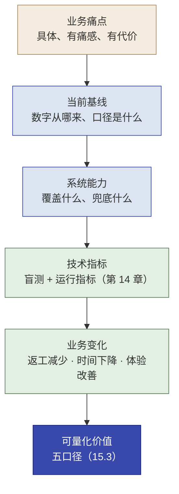
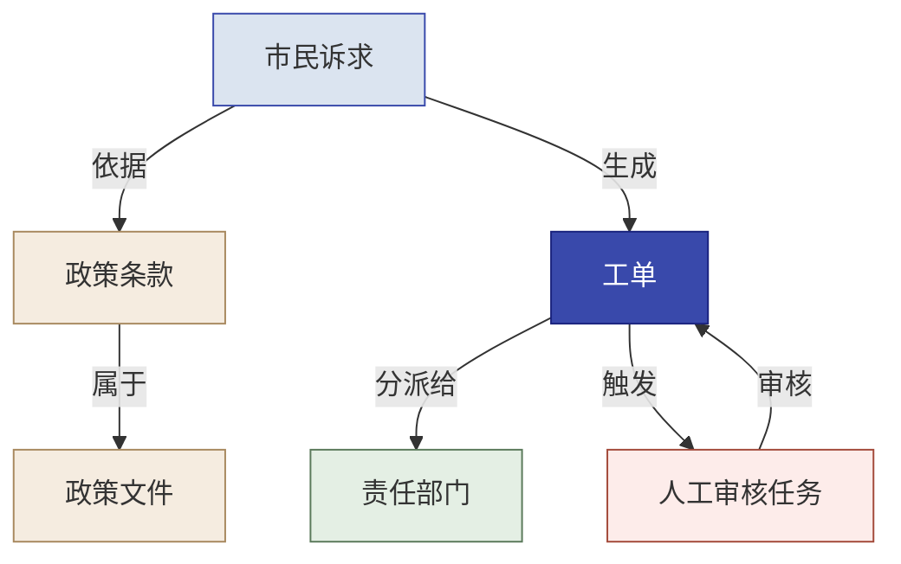

# 第 15 章  Echo 工作法：价值落地、组织采纳与能力回注

> **本章定位：** 知识章 · Echo 侧（业务 Scale）——承接第 14 章"系统接得住"的工程证据，回答"**组织为什么愿意接**"：系统是否真正解决业务问题、是否值得推广、客户组织是否愿意采用，以及哪些成果值得沉淀为平台能力。Echo 主导，Delta 提供工程证据。
> **本章产出：** 你能构建"价值证据链"并说清**年度价值 / 年净收益 / TCO / ROI / 投资回收期**五个口径；用**门槛 · 动机 · 信任**诊断并推动组织采用；给决策层 / 操作层 / 技术层 / 监管层各自适用的表达；设计**业务 Scale**（试点 → 采用 → 推广 → Gate）；与 Delta 共同完成**能力回注联合决策**（含业务语义本体）；并为第 16 章综合决策备好业务证据。
> **建议读者：** Echo（精读）；Delta（需理解——你的工程证据是本章一切承诺的底气）；全团队进入最后一个实操前必读。
> **前置：** 第 2 章（能力回注飞轮）、第 3 章（四阶段、能力回注四步法）、第 5 章（干系人地图、痛点诊断）、第 6/8/10/12 章（三个 Demo 与验收）、**第 14 章（工程运行、恢复与接管证据）**。

---

## 本章导学

- **学习目标：**
  1. 说清"工程验收通过 ≠ 业务价值成立；业务价值成立 ≠ 组织愿意采用"两个不等于；
  2. 沿"痛点 → 基线 → 能力 → 技术指标 → 业务变化 → 可量化价值"构建价值证据链，禁止把准确率直接换算成年省；
  3. 区分年度价值、年净收益、TCO、ROI 与投资回收期，给每个数字标记来源与假设；
  4. 用门槛 · 动机 · 信任诊断"推不动 / 没人用"，并给出对治动作（每项都指向第 14 章工程证据）；
  5. 为决策层 / 操作层 / 技术层 / 监管层设计不同表达（金字塔 + 双线话术）；
  6. 设计业务 Scale：种子用户 → 试点 → 采用复核 → 扩大范围 Gate → 停止条件；
  7. 完成能力回注联合决策：Echo 判业务通用性、Delta 证工程复用性，并用业务本体承载语义回注（15.7）。
- **前置知识：** 第 2 章飞轮、第 3 章四阶段与四步法、第 5 章干系人/痛点、第 14 章生产化证据、第 6/8/10/12 章三个 Demo。
- **章节地图：** 第 14 章（Delta）证明**系统接得住**（可运行、可恢复、可接管）；本章（Echo）证明**组织愿意接**（值不值得、推不推得动、铺不铺得开、回注什么）；第 16 章全团队综合业务、工程与风险证据，对每个场景作出 Go / Conditional Go / Continue Pilot / No-Go 决策。

> **一句话记住本章：** 第 14 章证明系统接得住，本章证明组织愿意接——用价值证据链算清"值多少"，用门槛·动机·信任推得动"谁用起来"，用试点→推广 Gate 铺得开，最后把技术与业务语义一起回注。

---

## 15.1 从"系统能运行"到"组织愿意采用"

第 14 章回答了"系统能否稳定运行、能否被客户技术团队接管"。但**工程验收通过，不等于业务价值已经成立**——监控指标再漂亮，也可能解决的不是客户真正的痛点；**业务价值成立，也不等于组织一定愿意采用**——系统再好，坐席怕被替代、管理层担心没人负责，照样用不起来。

| 尺度 | 核心问题 | 主导 | 证据 |
|------|---------|------|------|
| **工程 Scale**（第 14 章） | 系统能否稳定运行、监控、恢复并由客户技术团队接管 | Delta | 日志、指标、故障注入、回滚、接管演练 |
| **业务 Scale**（本章） | 组织是否愿意采用、推广，价值是否成立 | Echo | 价值证据链、采用反馈、业务指标、回注判断 |

> **两者共同构成完整 Scale：Delta 让系统接得住，Echo 让组织愿意接。** 本章所有判断必须建立在第 14 章的工程证据上，不能只给口头承诺（例如"能稳定运行"要说成"跨组接管演练通过、已触发并复盘过告警"）。

---

## 15.2 价值证据链：从技术指标到业务价值

客户问"这东西值多少钱"，答案不能从"准确率 95%"直接跳出来。**中间隔着一条证据链**：


*图 15-1：价值证据链——从业务痛点走到可量化价值（每一环都要有证据，不能跳）*

以诉求分类器为例，把每个环节填实：

```text
错分返工
→ 当前错分率和返工工时（基线数字，来源：抽样统计）
→ 自动分类 + 低置信度转人工（系统能力）
→ 盲测准确率、覆盖率、转人工率（第 8 章技术指标）
→ 返工减少、处理时间下降（业务变化，需现场复核）
→ 年度净收益和服务质量改善（可量化价值，15.3 口径）
```

> [!CAUTION]
> **禁止从"准确率达到某个数字"直接跳到"每年节省多少成本"。** 缺了"基线、覆盖比例、每单节省、人工兜底成本"任一环，数字就是编的（呼应第 7 章纪律四：证据独立、可追溯、可复现）。Echo 负责把链条两端接起来：需求满足 / 生产可用这一类**双视角验收**在 16 章实操五执行，本章承接其技术指标做价值换算。

---

## 15.3 价值口径：年度价值、净收益、TCO、ROI 与回收期

"价值"有五类口径，**不能混着叫"ROI"**：

```text
年度价值
= 效率收益 + 质量收益 + 风险避免收益

年净收益
= 年度价值 − 年运营增量成本

TCO
= 建设成本 + 运行成本 + 维护成本 + 人工审核成本

ROI
=（累计收益 − 总投入）/ 总投入

投资回收期
= 总投入 / 月净收益
```

- **年度价值**：一年"多得到"了什么（省时、少错、避险）；
- **年净收益**：从年度价值里扣掉为维持它而新增的运营成本（模型调用、算力、人工复核）；
- **TCO**：建设 + 运行 + 维护 + 人工审核的**总拥有成本**——比"一次性采购价"更能反映政务长期负担；
- **ROI**：累计收益相对总投入的倍数（**必须覆盖整个投资周期**，不是一年的数字）；
- **回收期**：总投入 ÷ 月净收益，回答"多久回本"。

**估算方法**：先问客户最想看到的变化，套对应公式（**教材提炼**，数值均为示意）——

| 价值类型 | 年价值公式 | 例子 |
|---------|-----------|------|
| **效率型**（省时间） | 年处理量 × AI 实际覆盖比例 × 平均每单节省工时 × 单位时间成本 | 每天 2000 条 × 60% 简单件 × 每条省 1.5 分钟 × 时薪 40 元 |
| **质量型**（少出错） | 年处理量 × 原错误率 × AI 后错误率降幅 × 单次错误损失 | 每年 50000 笔 × 漏检率 2%→0.3% × 单次损失 5000 元 |
| **收入型**（多赚钱） | 增量转化量 × 客单价 × 利润率 | 每月多接待 800 咨询 × 转化 10% × 客单价 2000 元 × 净利率 30% |

> [!IMPORTANT]
> **口径第一：只算"AI 真正覆盖的那部分"。** 诉求分类器只覆盖 60% 的简单件，另外 40% 的复杂/敏感件仍要人工——只能按 60% 算省下的人时。**按"全量 2000 条"还是"简单件 1200 条"算，数字能差近一倍——这就是口径不一致，是价值估算最常犯的错。**

**给区间，不给单点**（除基线外，参数都有"会动"的假设）——以效率型为例：

| 场景 | 简单件占比 | 每条节省 | 时薪 | 年价值 |
|------|-----------|---------|------|--------|
| 保守 | 45% | 1 分钟 | 35 元 | ≈ 14 万 |
| 基准 | 60% | 1.5 分钟 | 40 元 | ≈ 32 万 |
| 乐观 | 75% | 2 分钟 | 45 元 | ≈ 59 万 |

> 报给客户："最可能年省 32 万；即使效果打折（保守）也有十几万——可验证的经济可行性，不是拍脑袋。"再用"**上线后 N 周用真实运营数据出真数字**"收尾，而不是承诺单点。

**每个数字都要标来源：** `已实测 / 客户确认 / 教学假设 / 待验证`。对外汇报提供区间与假设，**不使用未经验证的单点承诺**；基线、覆盖率、转人工率等技术参数取自第 14 章的盲测与运行证据。

**书面锁口径。** 会后发一封邮件，列清价值类型、参数取值、计算口径与区间。这封邮件是三分钟换三个月的口径稳定——"我们刚才聊的"从此变成"我们共同确认的"。

> [!CAUTION]
> **锁口径这一步最容易跳过、代价最大。** 三个月后换了个负责人，翻出你的方案只看到"年省 32 万"，却不知道这是"简单件 60%"假设下算的——参数一变，数字无从验证。**算完就发那封锁定邮件，别省。**（第 16 章汇报同样遵守：给框架、给区间、不编数字。）

---

## 15.4 组织采用：门槛 · 动机 · 信任

"技术上做得到"不等于"组织里推得动"。AI 进一个组织，本质是权力结构与做事方式的一次再分配。**"推不动 / 没人用"永远是门槛、动机、信任三件里至少一件出了问题**——先诊断是哪一件，再对症给动作。每条动作都要能指到第 14 章的工程证据：

| 采用障碍 | 症状 | Echo 的策略 | Delta 提供的证据 |
|---------|------|------------|----------------|
| **门槛高**（不好上手） | 表单太多、要绕原流程、没人教；一线"还是自己写放心" | 简化流程、给默认值/模板、"一步走通"；现场走查配陪跑；种子用户先试用一个月并对比手工 vs 系统时长 | 运行稳定性、可一键启动、操作手册 |
| **动机弱**（对他没好处） | "跟我有什么关系""是不是要我多干活"；中层/骨干怕"不需要我了" | 讲清"角色升级"：从"每条都看"变成"只看 AI 拿不准的"；让他参与验收标准设定、给掌控感；把"他省下多少时间"量化展示 | 使用时长与工作量变化（15.6 的指标） |
| **信任低**（不可靠/没人负责） | "会不会又分错""出问题找谁" | 小范围试点、先拿真实数据说话；写清《谁负责》：关键决策人是最终负责人、AI 只给建议；数据不出域、出错可回滚；上线后定期给异常报告 | 审计、HITL、回滚报告、安全域证据 |

> [!TIP]
> **说服的关键不是讲道理，是改变他在项目里的"位置"和"安全感"。** 让关键的人参与定义验收标准、让当事人当"第一个用得着的人"、把责任边界写成一张纸——这三招比反复讲"AI 有多好"有效得多。这也正是第四条红线"人能判断、AI 能执行"的落地。

**遇到"高权力 + 低兴趣"的硬骨头（如监管层）：** 监管层"平时不看你、出事一票否决"——别频繁打扰，但关键节点（方案确认、上线审批）必须主动预审、主动上报。更省力的杠杆是**内部推手**：把要传达的信息做成"小抄"给他——领导问 ROI，他一开口就是"我们共同确认过参数，最保守也有十几万"；合规部问数据出域，他说得清"方案一开始就本地部署、数据不出内网"。

> **三条对治有顺序：先降门槛让人愿意试 → 再用动机让人持续用 → 用信任让人敢依赖。** 别一上来就让承诺满天飞——信任要靠小范围跑出的真实数字积累（呼应 15.6 的种子用户与试点）。

---

## 15.5 面向四类干系人的表达

算清了、也处理了阻力，最后是把价值**讲出来**。别讲技术，讲"对你意味着什么"。先判断"谁在听、他最关心什么、我该讲哪套"：

| 干系人 | 核心关切 | 主要证据 |
|--------|---------|---------|
| **决策层**（陈主任） | 值不值得、何时见效 | 年度价值、ROI、回收期、剩余风险 |
| **操作层**（小王） | 好不好用、是否增加负担 | 流程变化、人工兜底、实际采用反馈 |
| **技术层**（李工） | 能否维护、出问题怎么办 | 运行手册、监控、回滚和接管证据（第 14 章） |
| **监管层**（市数据局） | 数据、权限、责任和审计 | 安全域、权限矩阵、审计记录 |

> **金字塔结论句模板（一句话）：**
> "这套 **（系统名）** 上线后，**（核心价值·用数字）**；全程 **（约束，如数据不出域）**；需要你 **（一个他该做的具体动作）**。"

**示范一 · 对着陈主任（决策层 · 讲价值）：**

> "陈主任，我们把'整套智能化'拆成三件事，先做诉求自动分派。这块一年能帮你省下约 30 万的人工分派工时——算的是每天 2000 条里那 60% 的简单件，按你们坐席时薪 40 元估的，最保守也有十几万。全程数据不出政务网，符合规定。系统上线三个月后，我们用真实数据再给您出一份准确数字。您下个月去市里汇报，这块数字可以直接用。"

**示范二 · 对着市数据局（监管层 · 讲合规）：**

> "市数据局，这个项目我们一开始就把合规放第一位：数据不出政务外网，模型本地部署，流程不进公网；AI 只做辅助分类，关键决策由人来拍板，出错可回滚、可追责。算法口径和责任人界面，需要的话我可以把文档备好，请您审。"

**预演追问怎么接（都是前面几节的复用）：**
- **快赢**（先上哪个、什么时候见效）→ 回到第 6 章"快赢场景"：先上最快见效、风险最低的诉求分类，给"一个月看什么、三个月出真实数字"；
- **追责**（数据泄露谁负责）→ 回到 15.4 的《谁负责》：人是最终决策者、AI 只给建议；数据不出域、有兜底可回滚；
- **失业**（AI 会不会让我失业）→ 回到"角色升级"：机器干重复、人干判断、人在 checkpoint 把关——人的判断力成了不可替代的新价值。

---

## 15.6 业务 Scale：试点、采用与推广

价值成立不等于自动铺开。**业务 Scale 是有 Gate 的渐进过程**，不是"上线即全面推广"：

```text
小范围试点
→ 真实数据验证
→ 采用与业务指标复核
→ 扩大范围
→ 客户自运营
```

**每个环节要安排的事：**

- **种子用户**：接受度高的真用户先用一个周期，跑出"看得见的省"（呼应 15.4 门槛关）；
- **试点范围**：先圈一个部门/一类诉求，明确试点目标和时长；
- **培训计划**：操作层怎么上手、审核员怎么处理人工升级；
- **采用率与使用反馈**：谁在用、用得多不多、哪里卡住；
- **人工审核容量**：转人工件是否有足够的人消化（数据来自第 14 章指标）；
- **业务指标复核**：把 15.2 证据链里的"业务变化"一栏用真实运营数据填实；
- **扩大范围 Gate**：见下表；
- **暂停 / 停止条件**：什么情况下停止推广（如采用率持续不升、转人工率畸高、业务指标不达标）。

**扩大范围 Gate（进入下一批推广前核验）：**

| 检查项 | 通过证据 | 未通过时的动作 |
|--------|---------|--------------|
| 采用 | 种子用户持续使用，试点范围内采用率达到目标 | 回 15.4 补门槛/动机/信任，不扩大 |
| 价值 | 业务指标复核与 15.2 证据链一致，无夸大 | 修正价值口径或缩小范围继续验证 |
| 工程 | 运行稳定、告警闭环、客户团队能接管（第 14 章） | 不进入扩大范围，先补生产差距 |
| 容量 | 人工审核容量跟得上转人工量 | 调整自动化边界或增加人力 |

> **Echo 的表达必须建立在 Delta 已提供的工程证据上**——"能稳定运行"说成"跨组接管演练通过"、"不会漏"说成"给定验证集召回率 100%"（第 11 章口径），并给出 15.6 的监控指标（转人工率、拒答率、类别分布）作为前哨。

---

## 15.7 能力回注的联合决策：业务通用性 × 工程复用性

> 回注不是 Echo 或 Delta 单方的职责：**Echo 判断是否具有跨客户的业务价值，Delta 判断是否具备工程复用性、配置化能力和维护可行性，双方共同决定回注与优先级**（工程侧的落地与验证在第 14 章 14.9）。

### 15.7.1 四步法 + 三块拼图

对每个 Demo 逐条判断：**"能力去掉'西岭市民服务平台'这个壳，剩下的是什么？"**

| 能力回注四步 | 在三个 Demo 上怎么做 |
|-------------|---------------------|
| **1. 识别** | 哪些是西岭专属的"碎石路"（做完就扔）、哪些是别的客户也要的"能铺路" |
| **2. 抽象** | 把定制逻辑泛化成标准模块——把"类别清单"做成配置项，不写死在代码里 |
| **3. 集成** | 并入平台、标准化为可配置组件 |
| **4. 验证** | 确认真能复用、且不回坏平台质量 |

- **优先级矩阵**：用"通用性 × 实现成本"定 P0/P1/P2——P0 = 通用性高 + 成本低的"高杠杆项"（如"通用文本分类器"），别"什么都标 P0"，也别把"低通用 + 高成本"的定制硬塞进平台。
- **三块拼图（三个 Demo 回注的是不同的通用模式，合起来才是完整能力栈）：** 分类器答"是什么"（通用文本分类）；RAG 答"依据"（可溯源知识库问答）；Agent 答"怎么办"（分级路由 + 兜底）；以及三处都用的那个最通用的东西——**"拿不准就兜底转人工"（HITL）**，它同时是第四条红线的落地。

### 15.7.2 两条互补的回注路径

| 回注路径 | 回注什么 | 典型内容 | 主导角色 |
|---|---|---|---|
| **工程能力回注** | 可跨系统复用的技术机制 | 配置、日志、审计、provider 适配、重试熔断、健康检查、发布回滚 | Delta 主导（第 14 章 14.9） |
| **业务语义回注** | 对业务世界的稳定表达 | 对象、属性、关系、状态、动作、业务规则、权限边界 | Echo 主导抽象，Delta 验证实现 |

> 两条路径分别回答：工程能力回注——"这套技术机制能否在下一个系统复用？"；业务语义回注——"这套业务语言能否在下一个客户复用？"

### 15.7.3 本体论：从概念模型到操作型业务本体

只回注代码，下一个客户仍需重新理解业务世界。更深一层的回注，是把项目中反复出现的**业务对象、关系、状态、动作和治理约束**一起沉淀——这就要先看清"本体"这个概念从哪来。

**"本体论（Ontology）"有三层含义，别混成一层（教材提炼，溯源见下）：**

| 层次 | 是什么 | 与本书的关系 |
|------|--------|-------------|
| **哲学本体论**（存在论） | 研究"存在"本身：世界上有什么、如何分类 | 概念源头，不直接进入工程 |
| **知识表示层**（语义网 / 知识工程） | "对一个概念化（conceptualization）的显式说明"——用**类、属性、关系、实例**把某个领域描述成机器可处理的模型（[Gruber 1993 定义](https://tomgruber.org/writing/ontology-definition-2007.htm)，教材表述） | 给了"本体是共享、显式、可推理的概念模型"这一定义骨架 |
| **操作型业务本体**（本书 / Palantir Foundry） | 在对象、属性、关系之上，再纳入**状态、动作与权限治理**，让"能查询的模型"变成"能执行、能治理的模型" | 本章的六类元素（15.7.3）就落这一层 |

> **为什么先讲这三层？** 因为"本体建模"不是任何一家厂商的发明——它继承自知识表示工程的传统（语义网、RDF/OWL 时代的本体论，正是"知识图谱"的理论父辈）。教材沿用这一正统，把"本体"定位为**平台无关的业务语义建模方法**，Palantir Foundry 只是其中一种工程化实现。

**六类基础元素（教材提炼，其中对象/属性/关系/动作取自 Palantir Foundry 官方概念，教材为之追加"状态与治理"便于业务流程教学）：**

| 元素 | 回答的问题 | 西岭示例 |
|---|---|---|
| **对象类型** | 业务世界中有什么 | 市民诉求、政策文件、政策条款、责任部门、工单、人工审核任务 |
| **属性** | 对象具有什么特征 | 诉求类别、敏感等级、处理状态、政策文号、生效日期 |
| **关系类型** | 对象之间怎样关联 | 诉求引用政策条款、工单分派给部门、条款属于政策文件 |
| **状态** | 对象当前处于什么阶段 | 待分类、待分派、处理中、待人工审核、已关闭 |
| **动作类型** | 业务人员或系统可以做什么 | 分类诉求、查询依据、创建工单、分派部门、升级人工、关闭工单 |
| **权限与治理** | 谁可以查看、修改和执行 | 坐席可提交，审核员可批准，管理员可配置，审计员只读 |

> **教材定义（教材提炼，落在操作型业务本体一层）：** 本体建模，是把业务世界中稳定存在的**对象、属性、关系、状态、动作和治理约束**，组织成一套**人和系统都能共同理解、查询和执行的业务语言**。对照 Gruber 的通用定义，本书多加了"动作与治理"两维——因为回注的不只是"解释世界"，还有"在世界里做事并承担后果"。

**参考框架与边界（避免把产品当标准）：** [Palantir Foundry 的 Ontology](https://www.palantir.com/docs/foundry/ontology/overview/) 是业务语义建模的**代表性实现**——官方把对象类型、属性、关系类型、动作类型与函数组织成"组织的数字孪生"（[核心概念](https://www.palantir.com/docs/foundry/ontology/core-concepts/)、[Action Types](https://www.palantir.com/docs/foundry/action-types/overview/)）。**本书只借鉴其建模思想**：学员不需要 Foundry 账号，领域模型、知识图谱、业务对象层或自建语义层同样可以表达同类思想；具体产品操作只作延伸阅读，不进入必做实验。

**与静态知识图谱的区别（教材提炼，避免绝对化——知识图谱同样可承载规则与行为）：**

| 维度 | 静态知识图谱 | 操作型业务本体 |
|---|---|---|
| 主要关注 | 实体与关系 | 对象、关系、状态、动作与治理 |
| 能回答 | 什么与什么有关 | 当前发生了什么、接下来可以做什么 |
| 动作能力 | 通常不是核心 | 明确定义可执行动作 |
| 权限审计 | 视实现而定 | 应进入设计核心 |
| 在本书中的用途 | 辅助理解业务关系 | 承载可查询、可执行、可治理的回注能力 |

### 15.7.4 西岭最小业务本体：把三个 Demo 统一到同一业务世界

分类器、RAG 和路由工作流**不是三个互不相关的技术盒子**：分类器为"市民诉求"补充类别和置信度；RAG 建立"诉求—政策条款—政策文件"的依据关系；路由工作流根据诉求、工单和责任部门的状态执行分派、升级与人工审核。把它们统一建模，才可能把一次项目经验转化为下一座城市、下一类服务平台可复用的能力。

**对象类型与关键属性（对象边界来自真实业务身份与生命周期，不是数据库表改名）：**

| 对象类型 | 关键属性 | 数据来源 |
|---|---|---|
| 市民诉求 | 诉求编号、内容摘要、来源、类别、置信度、敏感等级 | 诉求受理系统 |
| 政策文件 | 文件名、文号、发布部门、生效日期、失效日期、版本 | 政策文档库 |
| 政策条款 | 条款号、正文、适用条件、所属政策 | 文档解析与 RAG 索引 |
| 责任部门 | 部门名称、职责范围、服务事项、联系方式 | 部门职责库 |
| 工单 | 工单编号、状态、优先级、责任部门、处理时限 | 工单系统 |
| 人工审核任务 | 触发原因、审核人、审核状态、审核结论 | 人工审核队列 |

**关系类型（谁来连、怎么连要可维护）：**

```text
市民诉求 → 依据 → 政策条款
政策条款 → 属于 → 政策文件
市民诉求 → 生成 → 工单
工单 → 分派给 → 责任部门
工单 → 触发 → 人工审核任务
责任部门 → 负责 → 事项类别
人工审核任务 → 审核 → 工单
```

**状态与动作（状态服务于真实决策，动作必须说明"谁在什么条件下可以对它做什么"）：**

```text
工单状态：待分类 → 待分派 → 处理中 → 待人工审核 → 已解决 / 已驳回 / 已关闭
动作类型：分类诉求 · 查询政策依据 · 创建工单 · 分派责任部门 · 升级人工审核 · 批准或驳回建议 · 修改处理状态 · 关闭工单
```


*图 15-2：西岭最小业务本体——对象、关系与人工审核闭环*

### 15.7.5 四层能力回注模型：回注什么、不回注什么

| 回注层 | 回注内容 | 西岭示例 | 是否适合公共回注 |
|---|---|---|---|
| **内容层** | 客户特定数据与知识 | 西岭政策文本、具体部门名称 | 通常否，保留在客户域内 |
| **语义层** | 可复用对象、属性、关系和状态 | 诉求、政策、部门、工单及其关系 | 经跨场景验证后可以 |
| **动作层** | 可复用业务动作和规则 | 分类、查依据、分派、升级、人工审批 | 经权限与接口验证后可以 |
| **治理层** | 权限、审计和责任边界 | 谁能看、谁能改、谁批准、如何追责 | 通用机制可回注，客户策略配置化 |

**不应回注：** 客户原始数据、个人信息与敏感实例、西岭具体政策文本、未经授权的客户业务规则、客户专属部门名称和人员信息、无法跨场景解释的临时代码。**可作回注候选：** "业务请求—依据—责任主体—工单—人工审核"的抽象结构、分类/查依据/分派/升级/审批等动作模式、对象级权限与审计机制、可配置的状态机与责任映射、与本体对象对齐的通用工程组件。

### 15.7.6 回注优先级（联合判断）

| 维度 | 核心问题 |
|---|---|
| 业务通用性 | 是否在多个客户或行业重复出现（Echo 判） |
| 语义稳定性 | 对象和关系是否长期稳定，而非临时流程 |
| 工程可实现性 | 是否有可靠数据、接口和状态来源（Delta 判） |
| 治理可落地性 | 权限、审计、责任和回滚是否清楚 |
| 复用收益 | 是否能明显降低下一次交付成本 |
| 回注风险 | 是否带入客户数据、知识产权或错误抽象 |

### 15.7.7 平台无关的本体回注练习 + 第二场景验证

> 全员必做，**不要求使用任何厂商平台**。学员需要：
> 1. 从西岭材料识别 4—6 个核心对象；2. 为每个对象定义必要属性；3. 定义对象之间的关系；4. 定义 3—5 个业务动作；5. 标明动作执行者、权限和人工审批条件；6. 区分客户专属内容与可回注语义；7. 用第二场景验证模型是否可复用。

**建议第二场景：企业员工服务台**

| 西岭市民服务 | 企业员工服务台 |
|---|---|
| 市民诉求 | 员工请求 |
| 政策文件 | 企业制度 |
| 责任部门 | 人力、IT、行政、财务 |
| 工单 | 服务请求单 |
| 市数据局 | 合规或信息安全部门 |

> **验证标准：** 如果只需替换对象实例、部门配置和内容数据，而不需要推倒"请求—依据—责任主体—工单—人工审核"结构，则说明该模型具有一定跨场景复用价值；若需要改对象/关系结构本身，就要回到 15.7.6 重新评估抽象是否过度（红线：不为了"通用"过度抽象，导致对象失去业务含义）。

> [!NOTE]
> **与四步法的关系：** 本体建模**不是能力回注的第五个步骤**，也不替代四步法——四步法规定回注过程（识别、抽象、集成、验证），本体建模为"抽象、集成、验证"提供对象、关系、动作和治理边界明确的**业务语义载体**（对应第 3 章 3.5 总览表与第 14 章 14.9 工程验证）。判断回注是否成立，关键不是是否画出一张对象关系图，而是**是否完成数据映射、动作执行和权限治理，并在第二场景中证明可复用**。

---

## 15.8 承上启下：为第 16 章准备"业务证据包"

第 16 章（实操五）将由全团队对三个场景分别作出 **Go / Conditional Go / Continue Pilot / No-Go** 决策。本章要交付的不是"我们做过什么"的总结，而是**每个决策背后的业务证据**。进入第 16 章前，你应该能回答（每一条都要有证据支撑）：

1. 哪个场景的价值证据最强？哪个仍需继续试点？
2. 哪些数字已实测、哪些只是教学假设或估算？
3. 组织采用的最大阻力是什么？对应动作落到谁？
4. 哪些能力值得回注（业务通用性 + 工程复用性都成立）？哪些只是"回注候选"？
5. 需要决策层批准什么资源、试点范围与下一步动作？
6. 哪些未关闭风险会导致 Conditional Go 或 No-Go？

**要带进 16 章的"业务证据包"：** 价值证据（15.2/15.3：证据链 + 五口径 + 数字来源标记）· 采用证据（15.4/15.6：门槛动机信任对策、试点与 Gate 记录）· 回注判断（15.7：两条路径候选 + 业务本体 + 已验证 / 待验证区分）· 风险与条件（未关闭风险、阻断条件、需要批准的事项）。

---

## 反模式与红线

- **从"准确率"直接跳到"年省多少"。** 缺基线、覆盖比例、每单节省、人工兜底成本任一环，数字就是编的（对应 15.2）。
- **把年度价值叫成 ROI。** 年度价值 ≠ 净收益 ≠ TCO ≠ ROI ≠ 回收期，五个口径分开算（对应 15.3）。
- **编单点数、不锁口径。** 报"省 2000 万"的单点、聊完不写锁定邮件——参数一变，数字全部失真（对应 15.3）。
- **只讲道理、不改变"位置"和"安全感"。** 参与定义验收标准、种子用户、一页《谁负责》比反复讲"AI 有多好"有效（对应 15.4）。
- **只对决策层说话。** 操作层、技术层、监管层各有核心关切与证据口径（对应 15.5）。
- **没有试点 Gate 就全量推广。** 业务 Scale 是"试点 → 复核 → 扩大"的渐进过程，有暂停/停止条件（对应 15.6）。
- **把"画了本体图"当"完成了回注"。** 静态对象关系图只是概念本体；未完成数据映射、动作接口与权限治理前，不得宣称"已铺成公路"（对应 15.7.4/15.7.7、第 14 章 14.9）。
- **回注客户内容。** 客户原始数据、专属政策文本、部门与人员信息不得回注公共平台——内容层留在客户域内，只回注语义/动作/治理层（对应 15.7.5）。
- **把本体当成某个厂商产品。** Palantir Ontology 是代表性实现而非唯一标准（对应 15.7.3）。
- **只练一种能力。** 偏 Echo 就不碰施工、偏 Delta 就不碰业务——别把第 4 章的位置测试当标签贴死，两种能力都要练。

> [!IMPORTANT]
> **红线重申（教科书四红线）：** 数据不出域 / 答案可追溯 / 敏感件零漏判 / 人能判断·AI 能执行。它们不是四句口号，而是你进入第 16 章时，每一份交付物（价值证据、采用证据、回注总结、汇报稿）都要回应的验收口径——**所有对外承诺都要能在第 14 章工程证据上落到点**。

---

## 本章小结

- **两个不等于**：工程验收通过 ≠ 业务价值成立；业务价值成立 ≠ 组织愿意采用（15.1）。
- **价值证据链**：痛点 → 基线 → 能力 → 技术指标 → 业务变化 → 可量化价值，禁止直跳（15.2）。
- **五口径分开**：年度价值 / 年净收益 / TCO / ROI / 回收期；只算 AI 真覆盖部分、给区间不给单点、每个数字标来源、书面锁口径（15.3）。
- **组织采用三关**：门槛（简化+种子用户）→ 动机（角色升级+参与验收标准）→ 信任（《谁负责》+试点真数据+回滚），每关都指向第 14 章证据（15.4）。
- **四类干系人表达**：决策层听价值、操作层听负担、技术层听接管、监管层听合规（15.5）。
- **业务 Scale**：试点 → 真实数据复核 → 扩大范围 Gate → 停止条件（15.6）。
- **能力回注联合决策**：Echo 判业务通用性、Delta 证工程复用性；两条路径（工程能力回注 / 业务语义回注）；本体为语义回注提供载体（15.7）。
- **卖人力 → 卖能力**：主线不变——判断力（Echo）× 施工力（Delta）两种能力合起来，才是完整 FDE（全文贯穿）。

**动手自检：**
- [ ] 我能沿"痛点→基线→能力→指标→变化→价值"走完一条证据链，且不把准确率直接换算成年省吗？
- [ ] 我能分清年度价值 / 净收益 / TCO / ROI / 回收期，并给每个数字标来源与假设吗？
- [ ] 我能做保守/基准/乐观三场景、给区间、书面锁口径吗？
- [ ] 我能用门槛·动机·信任诊断"推不动"，每条对策都指得到第 14 章证据吗？
- [ ] 我能给决策层 / 操作层 / 技术层 / 监管层各设计一套话术吗？
- [ ] 我能设计"试点 → 复核 → 扩大范围 Gate → 停止条件"吗？
- [ ] 我能区分两条回注路径、用六类元素画出西岭最小业务本体、并说清"什么不回注、什么可回注"吗？
- [ ] 我能为第 16 章备好"业务证据包"（价值 / 采用 / 回注 / 风险）吗？

---

## 练习与思考

- **基础：** 默写五口径公式；默写价值证据链六环；说出门槛·动机·信任各一条对策；说出六类本体元素。
- **进阶：** 为"诉求分类器"走一遍 15.2 证据链（补基线、覆盖比例、每单节省），用保守/基准/乐观给区间并标数字来源；再按 15.7.7 的 7 步为它做一个最小业务本体，用"企业员工服务台"做第二场景对照。
- **挑战（迁移练习 + 双线汇报）：** 为"政策问答 RAG"准备两版 5 分钟汇报——一版给看重 ROI 的决策层，一版给看重合规的监管层，用金字塔结构写出并注明两版取舍；再评判"诉求—条款—文件"依据关系能否作为跨场景回注候选（按 15.7.6 六维度打分并说明依据）；最后为它设计一个"试点 → 扩大"的业务 Scale 路径（种子用户、试点范围、复核指标、Gate 与停止条件各写一条）。

---

## 在线全书

- 见在线全书 https://www.cloudzun.com/fde-course/（Phase 4 Scale 与能力回注方法论）——业务 Scale、变革管理与价值量化的完整展开。
- 见在线全书 https://www.cloudzun.com/fde-course/（AI FDE 落地 · Echo 共识与对齐）——AI 能力与判断力边界如何对齐的扩展。
- 下一章：**本书第 16 章实操五 · 全团队交付与决策层汇报**——用本章的业务证据 + 第 14 章的工程证据，对三个场景作出 Go / Conditional Go / Continue Pilot / No-Go 决策。