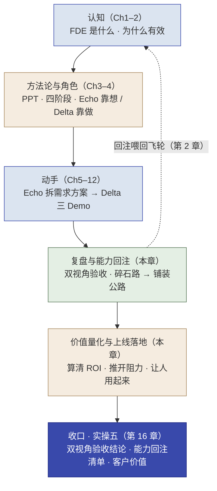
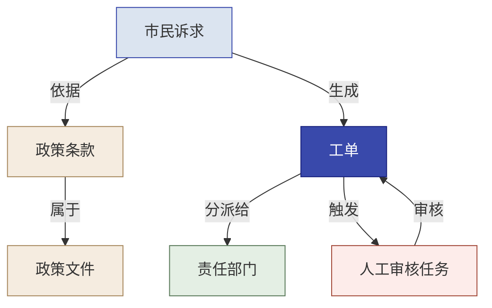

# 第 15 章  全程总览 · 价值落地与能力回注

> **本章定位：** 知识章（收束整合）· 五个实操的最后一次"实践经验"之前，把所有散装能力拼成一张完整交付闭环地图
> **本章产出：** 你会用一条主线串起全书 14 章；把"价值量化、价值表达、上线落地"练成 FDE 的"落地力"；用"复盘 + 能力回注"看懂三个 Demo 里真正可沉淀的东西；并明确下一步（第 16 章实操五）要用到的每一块能力。
> **建议读者：** 所有学员——进入最后一个实操前必读。
> **前置：** 全书（尤其第 2 章能力回注飞轮、第 3 章 PPT/四阶段/能力回注、第 4 章 Echo/Delta 分工、第 6/8/10/12 章实操、第 13 章微调）。

---

## 本章导学

- **学习目标：**
  1. 用一句话讲清全书主线（卖人力 → 卖能力），并用"图 15-1"把认知、方法、角色、实操、技术、红线拼成交付闭环；
  2. 掌握"价值量化与上线落地"三件套：ROI 对话五步、AI 阻力三来源与变革推动、"没人用"三步诊断；
  3. 学会"价值表达"：用金字塔结构 + 双线话术，对不同干系人讲清方案的价值与合规；
  4. 用"双视角验收 + 能力回注四步法"复盘三个 Demo，读懂"碎石路 → 铺装公路"与三块拼图；
  5. 区分**工程能力回注与业务语义回注**两条路径，用六类元素梳理西岭最小业务本体（15.5）；
  6. 知道自己进入第 16 章（实操五）要演练的每一件事，对应哪块能力。
- **前置知识：** 第 2 章能力回注飞轮、第 3 章四阶段与能力回注四步法、第 4 章 Echo/Delta 分工、第 6/8/10/12 章五个实操、第 13 章微调（进阶）。
- **章节地图：** 全书走到这里，认知、方法、角色、实操都已分章讲完。本章不做新实操，而是**站在高处把前面所有散装能力重新拼起来**——先讲"价值量化与上线落地"（补上此前只在实操五轻点过的最后一公里），再讲"复盘与能力回注"（把三个 Demo 沉淀成平台能力），最后快速串一遍主线与红线，把读者送进第 16 章实操五收口。

> **一句话记住本章：** 交付闭环不是"做出三个 Demo"就结束——还要**算清它的价值（ROI）、推开它被人接受的阻力、让它真的被用起来，最后把定制沉淀回平台**。这四件事合起来，才是"卖能力"而不是"卖人力"。

---

## 15.1 价值量化与上线落地

> 三个 Demo 都跑通了，客户问的第一句话往往是"**这东西到底值多少钱、什么时候能用、大家愿不愿意用**"。这一节回答的就是"从做出来，到用起来、算清楚、推得动"这最后一公里。它正是四阶段里 Scale（上线落地 / 变革推动）一环，也是第 16 章实操五"客户汇报"要演练的内容。

### 15.1.1 怎么算 ROI：三步套公式，把"效果好"变成"值多少钱"

ROI 不难算，难点是"**算对 + 让客户认**"。先给你能直接套的公式，再走一遍怎么当着客户的面把数字算出来。

**第 1 步 · 定价值类型，套对公式。** 先问客户"你最想看到的变化是什么"——省时间（效率型）、少出错（质量型）、还是多赚钱（收入型）。客户回答决定你套哪个公式（以下为**教材提炼**，数值均为示意）：

| 价值类型 | 年价值公式 | 一个能直接套的样子 |
|---------|-----------|------------------|
| **效率型**（省时间） | 年处理量 × AI 实际覆盖比例 × 平均每单节省工时 × 单位时间成本 | 每天 2000 条 × 60% 简单件 × 每条省 1.5 分钟 × 时薪 40 元 |
| **质量型**（少出错） | 年处理量 × 原错误率 × AI 后错误率降幅 × 单次错误损失 | 每年 50000 笔 × 漏检率 2%→0.3% × 单次损失 5000 元 |
| **收入型**（多赚钱） | 增量转化量 × 客单价 × 利润率 | 每月多接待 800 咨询 × 转化 10% × 客单价 2000 元 × 净利率 30% |

> [!IMPORTANT]
> **口径第一：只算"AI 真正覆盖的那部分"，别把人工必须做的也算进去。** 诉求分类器只覆盖"简单诉求自动分派"（比如 60%），另外 40% 的复杂/敏感件仍要人工——你只能按 60% 那部分算省下的人时。**按"全量 2000 条"算还是"简单件 1200 条"算，数字能差近一倍——这就是"口径不一致"，是 ROI 最常犯的错。**

**第 2 步 · 三步走一个完整的"当场算"示例（套效率型）：**

> 场景：诉求分类器。客户确认——每天 2000 条诉求，其中 60% 是简单件（1200 条）；坐席手工分派一条约 1.5 分钟；坐席时薪 40 元。
>
> 计算：每天 AI 覆盖 1200 条 × 1.5 分钟 = 1800 分钟 = **30 小时/天**；× 40 元/时 = **1200 元/天**；× 每月 22 个工作日 = **2.64 万/月**；× 12 个月 ≈ **年省约 31.7 万元**。
>
> 结论一句：**"诉求分类这块，一年帮你省下约 30 万的人工分派工时。"**

**第 3 步 · 给区间，不给单点（敏感性分析）。** 上一步的数字取决于几个"会动的参数"，别报单点，用三个场景给区间：

| 场景 | 简单件占比 | 每条节省 | 时薪 | 年价值 |
|------|-----------|---------|------|--------|
| 保守 | 45% | 1 分钟 | 35 元 | ≈ 14 万 |
| 基准 | 60% | 1.5 分钟 | 40 元 | ≈ 32 万 |
| 乐观 | 75% | 2 分钟 | 45 元 | ≈ 59 万 |

> 报给客户："最可能年省 32 万；即使效果打折（保守）也有十几万——**说明这项目在保守情况下也还是正的**，这是可验证的经济可行性。"然后用"**上线后 N 周用真实运营数据出真数字**"收尾，而不是承诺一个单点。

**最后 · 书面锁口径。** 会后发一封邮件，列清价值类型、参数取值、计算口径、ROI 区间。这封邮件是三分钟换三个月的口径稳定——**"我们刚才聊的"从此变成"我们共同确认的"**。

> [!CAUTION]
> **锁口径这一步最容易跳过、代价最大。** 三个月后换了个负责人，翻出你的方案只看到"预计年省 32 万"，却不知道这是"简单件 60%"假设下算的——口径一变，你无从验证。**算完就发那封五句话的锁定邮件，别省。**（这也是实操五"ROI 框架给框架、不编数字"的依据。）

### 15.1.2 有人阻止，到底怎么说服：三类阻力，用"设计"而非"说服"

"技术上做得到"不等于"组织里推得动"。AI 进一个组织，本质是权力结构与做事方式的一次再分配。**先听出（不是硬顶）对方是哪类阻力，再对症给动作和话术：**

| 阻力 | 他们真正担心 | 具体动作 | 你的一句话（可照说） |
|------|------------|---------|--------------------|
| **利益威胁**（中层/骨干） | "团队会不会缩编、我是不是就'不需要了'" | 把新角色摆到明处：让他参与**验收标准设定**、给掌控感；明确"判断力是你的新价值" | "过去你管着 5 个人分派；上线后你从'每条都看'变成'只看 AI 拿不准的'——判断力是你不可替代的新价值，不是被替代" |
| **习惯惯性**（一线） | "我还是自己写比较放心" | **种子用户示范**：挑 1 个接受度高的真用户先用一个月，把"他手工 vs 系统"的时长对比做给他看，让同事看到他的变化 | "你先把手动的做法留着，只在一个种子用户那儿试一个月——他用了再说，不看广告看疗效" |
| **信任缺失**（负责人/监管） | "AI 分错一单比人分错十单更扎眼，谁负责？" | 在设计阶段写清《谁负责》：关键决策**人是最终负责人、AI 只给建议**；数据不出域、有兜底；拿出同类客户上线 X 个月零安全事件 | "关键决策一定有人拍板、AI 只给建议；出错能回滚、责任有交代——你担心的'没人负责'在方案里就排除了" |

> [!TIP]
> **说服的关键不是讲道理，是改变他在项目里的"位置"和"安全感"。** 让关键的人参与定义验收标准、让当事人当"第一个用得着的人"、把责任边界写成一张纸——这三招比反复讲"AI 有多好"有效得多。这也正是第四条红线"**人能判断、AI 能执行**"的落地：让 AI 干重复，让人的判断力成为新价值。

**遇到"高权力 + 低兴趣"的硬骨头（如监管层）怎么办——干系人四象限 + 内部推手（第 5 章 SOP1 的工具拿来用）：** 用权力×兴趣定位所有人。监管层"平时不看你、出事一票否决"——别频繁打扰，但**关键节点（方案确认、上线审批）必须主动预审、主动上报**。更省力的杠杆是找**内部推手**——在你不在场时替你推动；你要做的不是"汇报进度"，是"**把要传达的信息做成小抄写给他**"：领导问 ROI 他一开口就是"我们共同确认过参数，最保守也有十几万"；合规部问数据出域他说得清"方案一开始就本地部署、数据不出内网"。

### 15.1.3 没人用，具体怎么改：门槛→动机→信任，逐条对治

先诊断再用措施——**"没人用"永远是门槛、动机、信任三件里至少一件出了问题**，找到是哪件，再逐条对治：

| 诊断 | 症状 | 具体改善措施 |
|------|------|------------|
| **门槛高**（不好上手） | 要填一堆表单、要绕开原流程、没人教 | 给默认值/模板减少空填；做到"一步走通"不绕系统；现场走查并配陪跑；把入口放回用户原来习惯的地方；砍掉非必要步骤 |
| **动机弱**（对他没好处） | "跟我有什么关系""是不是要我多干活" | 讲清"角色升级"对他个人意味着什么（省下的时间、从重复里解放）；把他的"省"量化展示（他手工 X 分钟 vs 系统 X 分钟）；给他署名/激励当示范者；先用种子用户跑出"看得见的省" |
| **信任低**（不可靠/没人负责） | "会不会又分错""出问题找谁" | 小范围试点再推广、先拿真实数据说话；交底《谁负责》+ 出错可回滚；让它"透明可查"（如 RAG 答案带出处、Agent 兜底转人工）；上线后定期给准确率/异常报告 |

> [!NOTE]
> **三条对治有顺序：先降门槛让人愿意试 → 再用动机让人持续用 → 用信任让人敢依赖。** 别一上来就让承诺满天飞——信任要靠小范围跑出的真实数字积累（呼应 15.1.2 的"种子用户"）。这套"门槛→动机→信任"也是实操五"双视角验收"里 Delta 视角"能不能上生产"的用人侧一问。

### 15.1.4 怎么把价值讲成客户听得懂的话：一句话模板 + 完整示范

上面算清了、也处理了阻力，最后是把价值**讲出来**。别讲技术，讲"对你意味着什么"。给两个能直接套的示范：

> **金字塔结论句模板（一句话）：**
> "这套 **（系统名）** 上线后，**（核心价值·用数字）**；全程 **（约束，如数据不出域）**；需要你 **（一个他该做的具体动作）**。"

**示范一 · 对着陈主任（决策层 · 讲价值）——约 150 字：**

> "陈主任，我们把'整套智能化'拆成三件事，先做诉求自动分派。这块一年能帮你省下约 30 万的人工分派工时——算的是每天 2000 条里那 60% 的简单件，按你们坐席时薪 40 元估的，最保守也有十几万。全程数据不出政务网，符合规定。系统上线三个月后，我们用真实数据再给您出一份准确数字。您下个月去市里汇报，这块数字可以直接用。"

**示范二 · 对着市数据局（监管层 · 讲合规）——同一方案，换语言：**

> "市数据局，这个项目我们一开始就把合规放第一位：数据不出政务外网，模型本地部署，流程不进公网；AI 只做辅助分类，关键决策由人来拍板，出错可回滚、可追责。算法口径和责任人界面，需要的话我可以把文档备好，请您审。"

> [!IMPORTANT]
> **为什么同一方案要讲两套话？因为对方最关心的事不同——陈主任要"值不值、能不能拿去汇报"，市数据局要"数据违不违规、出问题谁负责"。** 先判断"谁在听、他最关心什么、我该讲哪套"，再开口（呼应第 5 章四层决策链：决策层听 ROI、操作层听角色升级、技术层听对接、监管层听合规）。

**预演追问怎么接（都是上面几节的复用）：**
- **快赢**（先上哪个、什么时候见效）→ 回到实操一的"快赢场景"：先上最快见效、风险最低的诉求分类，给"一个月看什么、三个月出真实数字"。
- **追责**（数据泄露谁负责）→ 回到 15.1.2 的《谁负责》：人是最终决策者、AI 只给建议；数据不出域、有兜底可回滚。
- **失业**（AI 会不会让我失业）→ 回到"角色升级"：机器干重复、人干判断、人在 checkpoint 把关——人的判断力成了不可替代的新价值。

---

## 15.2 复盘与能力回注：把三个 Demo 沉淀成"公路"

> 第 15 章的关键一环。前面各章做完了三个 Demo（诉求分类 / 政策 RAG / 工单分级 Agent），本章把它们"复盘"一遍，再用能力回注判断"哪些能铺成给所有客户的能力"——这就是"碎石路 → 铺装公路"。

### 15.2.1 双视角验收：需求满足了吗？能上生产吗？

一个交付场景站在结束前，要用两个互补的视角各问一遍（对应第 4 章 Echo/Delta 分工）：

| 视角 | 问的问题 | 你要看的 |
|------|---------|---------|
| **Echo 视角** | 需求满足了吗？ | 当初《解决方案框架》里承诺的痛点 / 验收标准，真的解决了吗？（**验收达标 ≠ 需求满足**） |
| **Delta 视角** | 能上生产吗？ | 六个维度的差距：性能 / 可靠性 / 安全 / 合规 / 部署 / 数据（**MVP 达标 ≠ 生产可用**） |

> [!CAUTION]
> **两个"≠"是本章最难、最容易看漏的地方。** 分类器在 25 条测试样本上全对（验收达标），不等于解决了"真实平台每天上万件、分布噪声方言都不一样的诉求"（需求满足）。MVP 能演示，不等于生产能天天用、出了事有人负责（生产可用）。**中间差的，是一层层工程化与真实数据验证。**

**数据出域这一项必须单独交代：** 需求里"数据不出政务外网"是红线，而前几轮 Demo 用的是公网 LLM。这两件事要给出**明确的工程决策**，不能含糊带过：**分阶段——先用公网 LLM 跑通、验证价值与功能 → 确认后再回填本地部署**（这一步的技术底座就是第 13 章讲的私有化部署与微调）。这是 FDE 与"只做 Demo"的分水岭。

### 15.2.2 能力回注四步法：识别 → 抽象 → 集成 → 验证

第 2 章讲过能力回注飞轮——它靠这一步一步操作落地：


*图 15-1：一条主线把全书各章拼成"交付整合闭环"——认知→方法→动手→复盘回注→价值落地→实操五收口*

对每个 Demo 逐条判断：**"能力去掉'西岭市民服务平台'这个壳，剩下的是什么？"** 去掉客户特定的部分（市民/住建/人社），看剩下有没有通用价值：

| 能力回注四步 | 在三个 Demo 上怎么做 |
|-------------|---------------------|
| **① 识别** | 哪些是西岭专属的"碎石路"（做完就扔）、哪些是别的客户也要的"能铺路" |
| **② 抽象** | 把定制逻辑泛化成标准模块——把"类别清单"做成配置项，不写死在代码里 |
| **③ 集成** | 并入平台、标准化为可配置组件 |
| **④ 验证** | 确认真能复用、且不回坏平台质量 |

> **业务语义载体（15.5 展开）：** 四步法的每一步都可以落到本体建模上——识别找业务名词/关系/状态/动作，抽象成对象类型与关系类型（去掉"西岭住建局"这样的专名），集成映射数据源、接口与权限，验证在第二场景复用。它不改变四步法，只让"抽象、集成、验证"不流于文字总结。

- **优先级矩阵**：用"通用性 × 实现成本"给候选定 P0/P1/P2——**P0 = 通用性高 + 成本低的高杠杆项**（如"通用文本分类器"）。别"什么都标 P0"，也别把"低通用 + 高成本"的定制硬塞进平台（那会污染铺装公路）。
- **三块拼图（看懂三个 Demo 回注的是不同的通用模式，合起来才是完整能力栈）：**
  - **分类器**答"是什么"——通用文本分类；
  - **RAG**答"依据"——可溯源的知识库问答；
  - **Agent**答"怎么办"——分级路由 + 兜底；
  - 以及三处都用的那个最通用的东西——**"拿不准就兜底转人工"**（Human-in-the-Loop），它同时是第四条红线的落地。

> [!IMPORTANT]
> **复盘的意义不等于复述。** 复述是"我们把三个 Demo 做完了、各多少准确率"；复盘是"从这三个 Demo 里抽出了几条能铺给下一个客户的能力、分别落在哪块拼图"。后者才是把"西岭的定制（碎石路）"铺成"所有客户的能力（公路）"，才在真正转动第 2 章的飞轮。

---

## 15.3 主线与认知复盘（速览）

> 第 15 章不重讲每一章的细节——只把贯穿全书的那条线、两条能力、四个阶段和四条红线**收束到一张速览表**，供你在进入实操五前回看。

**一条主线：** 从"卖人力"到"卖能力"。做完一个项目，公司手里留下的是可复用的平台能力，而不是写完就散的定制代码（判断标准见第 1/2 章）。

**两种能力（Echo / Delta）：** **人能判断、AI 能执行**——Echo（靠想）挖真需求、做取舍、讲价值；Delta（靠做）让 Agent 施工、把关、回注。两种能力合起来，才是完整 FDE。

**四阶段：** Discovery（Echo 找对问题）→ Prototype（双角色快速证明）→ Build（Delta 做实做稳）→ Scale（全团队放大 + 回注）。

**四条红线（教科书体，贯穿全部实操）：**

| 红线 | 含义 | 在哪个环节落地 |
|------|------|--------------|
| **数据不出域** | 敏感/合规数据不离开设防网络 | 第 6 章写进方案、第 7/13 章本地部署、第 16 章"公网验证→本地回填" |
| **答案可追溯** | 答案必须带来源、能查证 | 第 9/10 章 RAG 双指标、"检索不到不能编" |
| **敏感件零漏判** | 宁可多升级，不可漏判 | 第 11/12 章 Agent 验收硬指标、兜底转人工 |
| **人能判断、AI 能执行** | 判断在人、执行在 AI | 第 4/7 章分工哲学、第 15/16 章 HITL 责任边界 |

---

## 15.4 承上启下：进入实操五（第 16 章）

到这里，你已经把前面的散装能力拼成了完整的地图。最后一个实操（第 16 章）不是做新功能，而是**把整条线收口成一份能汇报、能交付的成果**——它要演练的每一件事，本章都给了你对应的能力：

| 第 16 章实操五要演练的 | 你带着哪块能力进入 |
|-----------------------|------------------|
| 脑暴一 · 双视角验收（需求满足度 + 生产差距，含数据出域工程决策） | 15.2.1 |
| 脑暴二 · 能力回注（碎石路/能铺路、优先级、三块拼图） | 15.2.2 |
| 脑暴三 · 客户汇报（金字塔、ROI 框架、双线话术、预演追问） | 15.1.1 / 15.1.2 / 15.1.4 |
| 讲演收尾 · 三句话（双视角验收结论 / 能力回注清单 / 客户价值） | 15.2 + 15.1 的收束 |

**首尾呼应：** 这本书第 6 章实操一以"Echo 面对陈主任汇报方案"开篇，第 16 章实操五以"全团队面向决策层汇报成果"收尾——同样要讲得清、有数字、守合规。这中间的所有实操，都是在练"**会做**"；而到这里，你要练的是"**会说、能推、算得清**"——那才是从"做出来"到"真正被用起来、被认可"的那一步。

> [!NOTE]
> **为什么最后还要一个实操？** 因为判断力（Echo）和施工力（Delta）都练过了，但"把成果整合、复盘、回注、并且讲给决策层听"这套**收口能力**还没有练——它需要一次完整的团队演练才能落地。第 16 章就是补上这一环。

---

## 15.5 从项目资产到业务本体：能力回注的两条路径

> 15.2 讲了能力回注四步法（识别 → 抽象 → 集成 → 验证）。这一节回答一个更深的问题：**回注的"资产"到底是什么**——是把定制代码整理成通用组件，还是连"代码里隐含的业务世界"一起沉淀？

### 15.5.1 为什么仅回注代码还不够

能力回注不只是把代码整理成组件。更深一层的回注，是把项目中反复出现的**业务对象、关系、状态、动作和治理约束**沉淀为统一的业务语义模型。只回注代码，下一个客户仍需重新理解业务世界；把业务语义一起沉淀，下一个项目才能"换了客户数据、改了部门配置，结构直接复用"。

> **教材定义（教材提炼）：** 本体建模，是把业务世界中稳定存在的**对象、属性、关系、状态、动作和治理约束**，组织成一套**人和系统都能共同理解、查询和执行的业务语言**。

### 15.5.2 两条互补的回注路径

| 回注路径 | 回注什么 | 典型内容 | 主导角色 |
|---|---|---|---|
| **工程能力回注** | 可跨系统复用的技术机制 | 配置、日志、审计、provider 适配、重试熔断、健康检查、发布回滚 | Delta 主导 |
| **业务语义回注** | 对业务世界的稳定表达 | 对象、属性、关系、状态、动作、业务规则、权限边界 | Echo 主导抽象，Delta 验证实现 |

> 两条路径分别回答：**工程能力回注**——"这套技术机制能否在下一个系统复用？"；**业务语义回注**——"这套业务语言能否在下一个客户复用？"（工程回注的落地见第 14 章 14.10/14.10.1，本节负责业务语义这一条。）

### 15.5.3 六类基础元素与一个参考框架

**六类基础元素（教材提炼，其中对象/属性/关系/动作取自 Palantir Foundry 官方概念，教材为之追加"状态与治理"便于业务流程教学）：**

| 元素 | 回答的问题 | 西岭示例 |
|---|---|---|
| **对象类型** | 业务世界中有什么 | 市民诉求、政策文件、政策条款、责任部门、工单、人工审核任务 |
| **属性** | 对象具有什么特征 | 诉求类别、敏感等级、处理状态、政策文号、生效日期 |
| **关系类型** | 对象之间怎样关联 | 诉求引用政策条款、工单分派给部门、条款属于政策文件 |
| **状态** | 对象当前处于什么阶段 | 待分类、待分派、处理中、待人工审核、已关闭 |
| **动作类型** | 业务人员或系统可以做什么 | 分类诉求、查询依据、创建工单、分派部门、升级人工、关闭工单 |
| **权限与治理** | 谁可以查看、修改和执行 | 坐席可提交，审核员可批准，管理员可配置，审计员只读 |

**参考框架与边界（避免把产品当标准）：** [Palantir Foundry 的 Ontology](https://www.palantir.com/docs/foundry/ontology/overview/) 是业务语义建模的**代表性实现**——官方把组织的对象类型、属性、关系类型、动作类型与函数组织成"组织的数字孪生"（[核心概念](https://www.palantir.com/docs/foundry/ontology/core-concepts/)、[Action Types](https://www.palantir.com/docs/foundry/action-types/overview/)）。**本书只借鉴其建模思想**：学员不需要 Foundry 账号，领域模型、知识图谱、业务对象层或自建语义层同样可以表达同类思想；具体产品操作只作延伸阅读，不进入必做实验。

**与静态知识图谱的区别（教材提炼，避免绝对化——知识图谱同样可承载规则与行为）：**

| 维度 | 静态知识图谱 | 操作型业务本体 |
|---|---|---|
| 主要关注 | 实体与关系 | 对象、关系、状态、动作与治理 |
| 能回答 | 什么与什么有关 | 当前发生了什么、接下来可以做什么 |
| 动作能力 | 通常不是核心 | 明确定义可执行动作 |
| 权限审计 | 视实现而定 | 应进入设计核心 |
| 在本书中的用途 | 辅助理解业务关系 | 承载可查询、可执行、可治理的回注能力 |

### 15.5.4 西岭最小业务本体：把三个 Demo 统一到同一业务世界

分类器、RAG 和路由工作流**不是三个互不相关的技术盒子**：分类器为"市民诉求"补充类别和置信度；RAG 建立"诉求—政策条款—政策文件"的依据关系；路由工作流根据诉求、工单和责任部门的状态执行分派、升级与人工审核。把它们统一建模，才可能把一次项目经验转化为下一座城市、下一类服务平台可复用的能力。

**对象类型与关键属性（对象边界来自真实业务身份与生命周期，不是数据库表改名）：**

| 对象类型 | 关键属性 | 数据来源 |
|---|---|---|
| 市民诉求 | 诉求编号、内容摘要、来源、类别、置信度、敏感等级 | 诉求受理系统 |
| 政策文件 | 文件名、文号、发布部门、生效日期、失效日期、版本 | 政策文档库 |
| 政策条款 | 条款号、正文、适用条件、所属政策 | 文档解析与 RAG 索引 |
| 责任部门 | 部门名称、职责范围、服务事项、联系方式 | 部门职责库 |
| 工单 | 工单编号、状态、优先级、责任部门、处理时限 | 工单系统 |
| 人工审核任务 | 触发原因、审核人、审核状态、审核结论 | 人工审核队列 |

**关系类型（谁来连、怎么连要可维护）：**

```text
市民诉求 → 依据 → 政策条款
政策条款 → 属于 → 政策文件
市民诉求 → 生成 → 工单
工单 → 分派给 → 责任部门
工单 → 触发 → 人工审核任务
责任部门 → 负责 → 事项类别
人工审核任务 → 审核 → 工单
```

**状态与动作（状态服务于真实决策，动作必须说明"谁在什么条件下可以对它做什么"）：**

```text
工单状态：待分类 → 待分派 → 处理中 → 待人工审核 → 已解决 / 已驳回 / 已关闭
动作类型：分类诉求 · 查询政策依据 · 创建工单 · 分派责任部门 · 升级人工审核 · 批准或驳回建议 · 修改处理状态 · 关闭工单
```


*图 15-2：西岭最小业务本体——对象、关系与人工审核闭环*

### 15.5.5 四层能力回注模型：回注什么、不回注什么

| 回注层 | 回注内容 | 西岭示例 | 是否适合公共回注 |
|---|---|---|---|
| **内容层** | 客户特定数据与知识 | 西岭政策文本、具体部门名称 | 通常否，保留在客户域内 |
| **语义层** | 可复用对象、属性、关系和状态 | 诉求、政策、部门、工单及其关系 | 经跨场景验证后可以 |
| **动作层** | 可复用业务动作和规则 | 分类、查依据、分派、升级、人工审批 | 经权限与接口验证后可以 |
| **治理层** | 权限、审计和责任边界 | 谁能看、谁能改、谁批准、如何追责 | 通用机制可回注，客户策略配置化 |

**不应回注：** 客户原始数据、个人信息与敏感实例、西岭具体政策文本、未经授权的客户业务规则、客户专属部门名称和人员信息、无法跨场景解释的临时代码。**可作回注候选：** "业务请求—依据—责任主体—工单—人工审核"的抽象结构、分类/查依据/分派/升级/审批等动作模式、对象级权限与审计机制、可配置的状态机与责任映射、与本体对象对齐的通用工程组件。

### 15.5.6 回注优先级（业务语义版）

| 维度 | 核心问题 |
|---|---|
| 业务通用性 | 是否在多个客户或行业重复出现 |
| 语义稳定性 | 对象和关系是否长期稳定，而非临时流程 |
| 工程可实现性 | 是否有可靠数据、接口和状态来源 |
| 治理可落地性 | 权限、审计、责任和回滚是否清楚 |
| 复用收益 | 是否能明显降低下一次交付成本 |
| 回注风险 | 是否带入客户数据、知识产权或错误抽象 |

### 15.5.7 平台无关的本体回注练习 + 第二场景验证

> 全员必做，**不要求使用任何厂商平台**。学员需要：
> 1. 从西岭材料识别 4—6 个核心对象；2. 为每个对象定义必要属性；3. 定义对象之间的关系；4. 定义 3—5 个业务动作；5. 标明动作执行者、权限和人工审批条件；6. 区分客户专属内容与可回注语义；7. 用第二场景验证模型是否可复用。

**建议第二场景：企业员工服务台**

| 西岭市民服务 | 企业员工服务台 |
|---|---|
| 市民诉求 | 员工请求 |
| 政策文件 | 企业制度 |
| 责任部门 | 人力、IT、行政、财务 |
| 工单 | 服务请求单 |
| 市数据局 | 合规或信息安全部门 |

> **验证标准：** 如果只需替换对象实例、部门配置和内容数据，而不需要推倒"请求—依据—责任主体—工单—人工审核"结构，则说明该模型具有一定跨场景复用价值；若需要改对象/关系结构本身，就要回到 15.5.6 重新评估抽象是否过度（红线：不为了"通用"过度抽象，导致对象失去业务含义）。

> [!NOTE]
> **与四步法的关系：** 本体建模**不是能力回注的第五个步骤**，也不替代四步法——四步法规定回注过程（识别、抽象、集成、验证），本体建模为"抽象、集成、验证"提供对象、关系、动作和治理边界明确的**业务语义载体**（对应第 3 章 3.5 的总览表与第 14 章 14.10.1 的工程验证）。判断回注是否成立，关键不是是否画出一张对象关系图，而是**是否完成数据映射、动作执行和权限治理，并在第二场景中证明可复用**。

---

## 反模式与红线

- **散装理解、不连通。** 记得住"RAG 用 BGE-M3""Agent 用 LangGraph"这些单点工具，却拼不出"它们各自答什么、在三块拼图里站哪"。本章的目标就是把散装拼成地图——复盘时先问"它服务于哪条主线、哪块能力"。
- **把复盘写成复述。** "三个 Demo 各多少准确率"是复述；"从里面抽出几条能铺给下一个客户的能力"才是复盘。只复述不提炼，能力回注不会发生。
- **丢了"人"这一环。** 只盯着技术成果，把"阻力三来源 / 没人用 / 变革推动"当花边——结果系统做出来没人用、被搁板上（对应 15.1.2 / 15.1.3）。
- **ROI 编数字、不锁口径。** 报一个"省 2000 万"的单点数字，或聊完不写锁定邮件——参数一变，"180 万"就成了错误数字（对应 15.1.1）。
- **只练一种能力。** 偏 Echo 就不碰施工、偏 Delta 就不碰业务——别把第 4 章的位置测试当标签贴死，两种能力都要练。
- **把"画了本体图"当"完成了回注"。** 静态对象关系图只是概念本体；未完成数据映射、动作接口与权限治理前，不得宣称"已铺成公路"（对应 15.5.4/15.5.7、第 14 章 14.10.1）。
- **回注客户内容。** 客户原始数据、专属政策文本、部门与人员信息不得回注公共平台——内容层留在客户域内，只回注语义/动作/治理层（对应 15.5.5）。
- **把本体当成某个厂商产品。** Palantir Ontology 是代表性实现而非唯一标准；领域模型、知识图谱、自建语义层均可承载同类思想（对应 15.5.3）。

> [!IMPORTANT]
> **本篇红线重申（教科书四红线）：** 数据不出域 / 答案可追溯 / 敏感件零漏判 / 人能判断·AI 能执行。它们不是四句口号，而是你进入第 16 章实操五时，每一份交付物（需求满足度表、生产差距表、能力回注总结、客户汇报稿）都要回应的验收口径。

---

## 本章小结

- **交付闭环 = 做出 → 算清 → 推开 → 用起 → 回注。** 做出三个 Demo 只是前半程；后半程是算清 ROI（15.1.1）、推开阻力（15.1.2）、让人用起来（15.1.3）、讲清价值（15.1.4），再把定制沉淀回平台（15.2）。
- **ROI 怎么算**：按价值类型套公式（效率/质量/收入）→ 只算 AI 真覆盖的部分（口径）→ 三步当场算出年省 → 用保守/基准/乐观给区间不给单点 → 书面锁口径（教材提炼，示例为示意数值）。
- **阻力三来源怎么说服**：利益威胁→参与验收标准+角色升级话术、习惯惯性→种子用户示范、信任缺失→一页《谁负责》+兜底证据——靠"设计"而非"说服"；高权力低兴趣者靠主动预审 + 内部推手。
- **双视角验收**：Echo 验需求（验收 ≠ 需求满足）、Delta 验生产（MVP ≠ 生产可用）；数据出域要"公网验证 → 本地回填"明确交代。
- **能力回注四步 + 三块拼图**：识别→抽象→集成→验证；分类=是什么 / RAG=依据 / Agent=怎么办 / HITL=兜底。
- **两条回注路径（15.5）**：工程能力回注（技术机制，Delta 主导，见第 14 章）与业务语义回注（对象/关系/状态/动作/治理，Echo 主导抽象）；六类元素 + 西岭最小本体 + 四层回注模型（内容/语义/动作/治理）+ 平台无关练习与第二场景验证。
- **主线**：卖人力 → 卖能力；两种能力 = 判断力（Echo）× 施工力（Delta）；四阶段、四红线收束成一张速览表。

**动手自检：**
- [ ] 我能用 150 字业务语言讲清"交付了什么、解决了什么痛点、值不值"吗？
- [ ] 我能按价值类型套公式、只算 AI 真覆盖的部分，当场把一个 ROI 算成数吗？
- [ ] 我能做"保守/基准/乐观"三个场景，给客户报区间、并书面锁口径吗？
- [ ] 我能识别客户话里的三类阻力，各给一句"设计"而非"说服"的具体话术吗？
- [ ] 我能用"门槛 → 动机 → 信任"诊断"没人用"，并给出对应的改善动作吗？
- [ ] 我能用双视角验收三个 Demo，并看懂"验收 ≠ 需求满足、MVP ≠ 生产"吗？
- [ ] 我能把三个 Demo 抽成三块拼图 + HITL 兜底，并标出 P0 高杠杆项吗？
- [ ] 我能区分两条回注路径，用六类元素画出西岭最小业务本体，并说清"什么不回注、什么可回注"吗？

---

## 练习与思考

- **基础：** 默写 ROI 对话五步、阻力三来源、"没人用"三步诊断；说出三块拼图分别答什么；说出六类本体元素（对象/属性/关系/状态/动作/治理）。
- **进阶：** 为"诉求分类器"做一次能力回注抽象——去掉"市民/住建/人社"这个壳，剩下什么通用能力？怎么做成可配置？落地能力回注哪一步？再用 15.5.7 的 7 步为它做一个最小业务本体，并用"企业员工服务台"做第二场景对照。
- **挑战（迁移练习 + 双线汇报）：** 为"政策问答 RAG"准备两版 5 分钟汇报——一版给看重 ROI 的决策层，一版给看重合规的监管层，用金字塔结构写出，注明两版取舍（用哪组参数、报区间还是报方案、讲价值还是讲责任边界）；再评判"诉求—条款—文件"依据关系能否作为跨场景回注候选（按 15.5.6 六维度打分并说明依据）。

---

## 在线全书

- 想读 FDE 完整交付的 Scale 阶段、能力回注方法论与变革管理延伸，见在线全书 **https://www.cloudzun.com/fde-course/**。
- 在线全书章节：第 8 章（Phase 4 Scale）、第 9 章（能力回注方法论）、第 15 章（AI FDE 落地：Echo 共识与对齐）。
- 下一章：**第 16 章实操五 · 全团队交付与决策层汇报**（把本章的复盘与价值落地，在完整团队演练中收口）。
