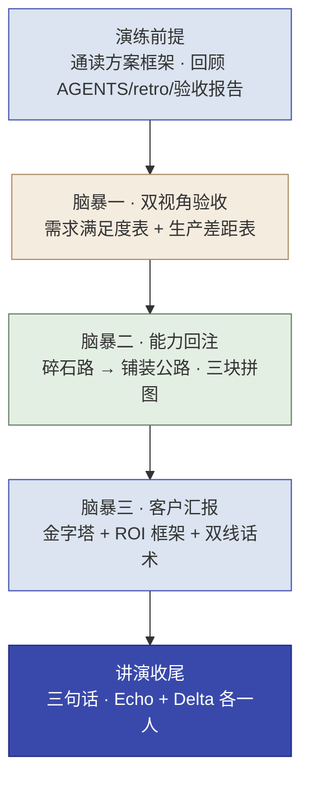

# 第 16 章  实操五 · 全团队交付与决策层汇报

> **本章定位：** 实操单元 · **角色 = 全团队（Echo + Delta）** · Scale / 收口阶段 · 模式 = **头脑风暴 + 汇报（不使用 AI）**
> **本章产出：** 一个完整的**交付包**——需求满足度表 + 生产差距表 + **内部能力回注总结** + 客户汇报稿 + 讲演汇报稿，整合三个 Demo 面向决策层汇报。
> **承接：** 第 6 章《解决方案框架》+ 第 8/10/12 章三个 Demo + 每轮的《AGENTS.md》《retro.md》+ 第 15 章（Echo 工作法 · 价值落地、组织采纳与能力回注）。
> **核心隐喻：** **碎石路 → 铺装公路**（哪些是"西岭的内容"、哪些能抽象成"给所有客户的能力"）。
> **延伸阅读：** 本书第 13 章（企业私有化部署与模型微调·生产回填底座）；在线全书见文末。
> **适配说明：** 沿用训练营"实操五"骨架；去现场计时；把讲师引导改写为自查问题。

---

## 本章导学

- **学习目标：**
  1. 用**双视角**验收全部成果：Echo 验"需求满足了吗"、Delta 验"能上生产吗"；
  2. 用**能力回注四步法**判断"哪些碎石路能铺装成公路"，看懂"三块拼图"；
  3. 用**ROI 框架 + 合规交代**面向决策层做"双线汇报"（对陈主任讲价值、对市数据局讲合规）；
  4. 完成完整的 FDE 交付闭环，理解"会做 ≠ 会说"。
- **前置知识：** 全书（尤其第 3 章能力回注四步法、第 6 章 Echo、第 8/10/12 章 Delta 成果）。
- **章节地图：** 这是全书收口（Scale + 能力回注）。五个实操以"汇报"开头（Ch6 Echo 向陈主任汇报方案）、也以"汇报"收尾（本章向全班汇报成果），首尾呼应、闭环完整。

> **一句话记住本实操：** 把三个独自成立的 Demo，从"西岭的定制（碎石路）"铺成"给所有客户的能力（公路）"，再用决策层听得懂的话讲清值不值——这一步走完，FDE 交付闭环才算真正闭合。

---

## 实战演练

### 演练背景

前四轮你们走完一个完整 FDE 交付闭环：Ch6（Echo）拆场景定方案，Ch8/10/12（Delta）做出三个可运行 Demo（分类器 / RAG 工单分级 Agent）。上一章（第 15 章）已带你把全程复盘到"价值落地与能力回注"——本实操就是把那些方法，落地成一份完整交付包。**本实操不做新功能**，只做三件事：**① 双视角回顾 ② 能力回注 ③ 客户汇报**。

**全程不用 AI**（同 Ch6 实操一）：这一步训练判断力与表达力，不训练产出力。"AI 能帮你写一份看起来对的总结，写不出你真正相信的总结。"

### 演练前提（课前准备）

- [ ] 全组通读第 6 章《解决方案框架》（尤其三个场景的需求定义、验收标准）
- [ ] 全组回顾实操二/三/四的《AGENTS.md》和《retro.md》
- [ ] 全组回顾三个 Demo 的验收报告（qa-report.md）
- [ ] 准备白板、便签、马克笔；打印**能力回注四步法模板**

### 知识背景（呼应第 15 章）

> 上一章（第 15 章）把全书收束成"价值落地与能力回注"。本实操的四个环节，正好把第 15 章讲过的四块能力各落地一次：

| 环节 | 用到的知识（第 15 章） |
|------|----------------------|
| 脑暴一 · 双视角验收 | Echo 验"需求满足吗"（验收 ≠ 需求满足）、Delta 验"能上生产吗"（MVP ≠ 生产）；数据出域"公网验证→本地回填"（15.2） |
| 脑暴二 · 能力回注 | 能力回注四步法；碎石路→铺装公路；优先级矩阵；三块拼图 + HITL 兜底（15.7.1） |
| 脑暴三 · 客户汇报 | ROI 给区间不给单点、书面锁口径；阻力三来源与变革推动；金字塔 + 双线话术（15.3 / 15.5） |
| 讲演收尾 · 三句话 | "门槛→动机→信任"判断系统用不用得起来；三句话收口（15.4 / 15.8） |


*图 16-1：本实操四个环节——双视角验收 → 能力回注 → 客户汇报 → 讲演收口（垂直）*

---

### 演练流程（三个头脑风暴 + 讲演收尾）

#### 脑暴一 · 双视角回顾：需求满足了吗？能上生产吗？

**Step 1 独立判断（先独立后碰撞）：** 每人对照方案框架左两件事——**Echo 视角**：三个场景各写一条"需求满足了吗？✅/⚠️/❌，为什么"；**Delta 视角**：三个场景各写一条"这个 Demo 能上生产吗？差距在哪"（从性能/可靠性/安全/合规/部署/数据六维想）。

> **自查追问：** 每个 Demo 验收都达标了（分类≥85%、RAG 双指标、Agent 零漏判），但——**验收达标就等于需求满足了吗？** 你量的到底是当初承诺的东西，还是客户真正要的东西？

**Step 2 组内讨论：** 需求满足度墙 + 生产差距墙；讨论"有没有验收达标但需求没满足的场景"、各 Demo 离生产多远、Echo 与 Delta 视角如何互补。

> **自查追问：** 分类器在 25 条样本上全对，你说"能上生产了"——可真实平台每天 1.2 万件诉求，分布/噪声/方言都不一样。**MVP 达标和生成可用，中间差几层工程化？**

> [!IMPORTANT]
> **关于"数据出域"（全组必须明交代）：** 需求文件里李工把"数据不出政务外网"列为红线，但前几轮 Demo 用的公网 LLM。这两件事怎么统一？要讨论出**明确工程决策**（分阶段：先用公网 LLM 跑通验证价值→确认功能，再回填本地部署），作为**明确交代**写进方案，别含糊带过。

**Step 3 达成共识 · 输出两张表：**
- **需求满足度表**（Echo）：场景 | 当初需求/验收标准 | 是否满足✅/⚠️/❌ | 差距 | 理由
- **生产差距表**（Delta）：场景 | 性能/可靠性/安全/合规/部署/数据六维差距 + **单独列"数据出域交代"**（红线、工程决策：本地部署模型选型/成本/工期）

#### 脑暴二 · 能力回注：哪些碎石路能铺装成公路？（本实操灵魂）

用能力回注四步法（Ch3），判断三个 Demo 里哪些能沉淀为平台能力。

**Step 1 识别（10 分钟）：** 白板画两区——**碎石路（西岭专属，做完就扔）+ 能铺路（通用价值，别的客户也要）**。每个场景逐条判断："能力去掉'西岭市民服务平台'这个壳，剩下的是什么？"

> **自查追问：** 分类器"市民诉求五分类"——抽象掉"市民/住建/人社"，剩下还有什么？**识别回注候选的关键，是去掉客户特定部分、看剩下有没有通用价值。**

**Step 2 抽象（10 分钟）：** 对每个"能铺路"候选，讨论怎么泛化成标准模块——去掉了哪些客户特定逻辑？剩下什么通用能力？怎么设计成可配置（如类别清单做成配置项，不写死在代码里）？

**Step 3 铺路优先级（10 分钟）：** 用**优先级矩阵（通用性 × 成本）**给候选定 P0/P1/P2。

> **自查追问：** 为什么某个候选值得"立即做"？——回注价值在于"以最低成本撬动最多客户"。**P0 应该是通用性高 + 成本低的"高杠杆候选"**（如通用文本分类器）。

**Step 4 产出《内部能力回注总结》。** 关键认知——**三块拼图**：
> 三个 Demo 回注的是**不同的通用模式**，合起来才是完整能力栈：
> - **分类器**（"是什么"：文本分类）
> - **RAG**（"依据"：知识库问答）
> - **Agent**（"怎么办"：分级路由 + 兜底）
> 以及三处都用的那个最通用的东西——**"拿不准就兜底转人工"**（Human-in-the-Loop）。

**输出物：** 碎石路/能铺路两区图 + 《内部能力回注总结》（三场景概览、可回注清单、三块拼图、回注价值、回注计划）。

#### 脑暴三 · 客户汇报：把价值讲给客户听

面向陈主任（决策层）和市数据局（监管层）。汇报不是"我们做了什么"，而是"**我们解决了你什么问题、值不值**"。

**Step 1 组内讨论话术（金字塔结构 5 分钟汇报）：**
- 第一层（结论）：三句话——做了什么、核心价值、投入产出
- 第二层（论据）：三个 Demo 各一个最有说服力的点（分类器降错分 / RAG 带引用 / Agent 敏感零漏判）
- 第三层（约束）：数据不出域、**公网验证→本地回填方案**、合规安排
- 第四层（下一步）：从 Demo 到生产的路径

**客户汇报 PPT 页骨架（可直接套，共 5 页）：**

```
第 1 页 · 结论       一句话：做了什么 + 核心价值（数字）+ 投入产出
第 2 页 · 业务问题    客户原来的痛点 / 当初的验收标准（第 6 章方案框架）
第 3 页 · 方案与价值  三个 Demo 各一个最有说服力的价值点 + ROI 框架（给区间，不给单点）
第 4 页 · 合规与约束  数据不出域 / 公网验证→本地回填 / 责任边界（谁负责）
第 5 页 · 下一步      从 Demo 到生产的路径 + "上线后 N 周出真实数字"承诺
```

> [!NOTE]
> **两种汇报人看两套重点页：** 面向陈主任（决策层）重点讲第 1 / 3 页（价值与 ROI）；面向市数据局（监管层）重点讲第 4 页（合规与责任边界）。先判断"谁在听、他最关心什么"，再决定放大哪几页。

> **自查追问：同项目对陈主任和市数据局的话术，能一样吗？** 对陈主任讲"值不值、能不能拿去汇报"；对市数据局讲"数据安全、算法合规、出了问题谁负责"。**先判断谁在听、他最关心什么、你该怎么讲。**

**Step 2 ROI 框架（不是编数字）：**
> **ROI 不是编数字，是给算账的方向和框架。** 用五步法搭出"哪些环节能省、省的是谁的成本、怎么测"：**假设 → 效率 → 质量 → 敏感度 → 锁定**。上一章（15.1.1）给了可直接套的**三类价值公式 + 保守/基准/乐观三场景**——用它把数字算出来，报给客户时**给区间不给单点**。在拿到真实运营数据前，承诺应是"**上线后 N 周出真实数字**"——任何"省 2000 万"式报价都是编的。

**Step 3 模拟汇报 + 预演客户追问：**
- 一组汇报，其他组扮陈主任/市数据局/小王提问
- 汇报必须：全业务语言、有数字、有 ROI 框架、有合规方案
- 预演常问：**快赢**（先上哪个？什么时候见效）、**追责**（数据泄露谁负责？怎么降险）、**失业**（AI 会不会让我失业？——用"机器干重复、人干判断"具体回应）

**输出物：** 客户汇报稿（开场结论/三 Demo 价值/合规交代/下一步）+ 客户汇报 PPT 页骨架（见脑暴三 Step 1）。

#### 讲演收尾 · 每组 5 分钟汇报

**汇报要求（强制做减法，三句话结构）：**
1. **① 双视角验收结论**：需求满足了吗？能不能上生产？
2. **② 能力回注清单**：碎石路铺成了哪条公路？
3. **③ 客户汇报核心**：做了什么、值不值？

**汇报人：** 建议 Echo 和 Delta **各一人上台**（检验全团队，不是个人）。听众扮"客户"可追问；讲师点评。

**评分维度（讲给观众听时自检）：** 判断力（讲得出"为什么满足/不满足"？）/ 能力回注（讲得出"铺了哪条公路"？）/ 客户视角（讲客户价值还是技术细节？有 ROI 吗？）/ 表达（全业务语言、能答追问吗？）。

---

### 产出物清单 & 验收标准（DoD）

**交付物：**
```
实操五-总结汇报/
├── 需求满足度表.md           # Echo 视角：三场景 ✅/⚠️/❌ + 理由
├── 生产差距表.md             # Delta 视角：三场景 + 六维度差距（含数据出域"公网验证→本地回填"方案）
├── 内部能力回注总结.md       # ★核心：碎石路/能铺路 + 内容vs机制 + 三块拼图 + 优先级
├── 客户汇报稿.md             # 面对陈主任/市数据局的金字塔汇报（含 PPT 页骨架 + ROI 区间 + 合规交代）
└── 讲演汇报稿.md             # 三句话结构：验收结论/能力回注/客户价值
```

**验收标准（DoD）：**
- [ ] **双视角回顾**：需求满足度表 + 生产差距表完成；数据出域及"公网验证→本地回填"方案已单独列出
- [ ] **能力回注**：碎石路/能铺路判断（内容 vs 机制）+ 识别 ≥4 候选 + 抽象泛化 + 优先级矩阵 + **三块拼图认知** + 内部总结完成
- [ ] **客户汇报**：金字塔 5 页骨架 + ROI 给区间不给单点 + 双线话术（陈主任价值/市数据局合规）+ 合规交代，模拟汇报过关
- [ ] **讲演收尾**：每组完成 5 分钟三句话汇报，能回答客户追问
- [ ] 三个问题卡的引导问题都讨论过；全团队协作（Echo/Delta 视角都发挥）
- [ ] 全程未用 AI，靠组内讨论产出

---

## 反模式与红线（本实操学习点）

- **验收只报流水账、不讲判断。** "需求满足了吗"要讲得出理由，不是复述 Demo。
- **能力回注只看定制性、看不到通用性。** 要把"文本分类/知识问答/分级路由"的通用机制从"西岭的内容"里抽出来。
- **把什么都标 P0。** 优先级靠"高杠杆"（通用性高+成本低）判断，不是"自己喜欢"。
- **讲成技术汇报。** 对陈主任讲 LangGraph/RAG/准确率=沟通失败——对陈主任讲价值、对市数据局讲合规。
- **编 ROI 数字。** "省 2000 万"式报价是编的；诚实做法是给算账框架 + "上线后 N 周出真实数字"的承诺。
- **绕开"数据出域"。** 这是红线，必须给"公网验证→本地回填"的明确交代，不能含糊带过——这正是 FDE 与"只做 Demo"的区别。

> [!IMPORTANT]
> **本书收官红线对照：** 三条政务红线在你的交付包中已全部闭环——**数据不出域**（本地回填方案已列在生产差距表）、**答案可追溯**（RAG 带引用）、**敏感件零漏判**（Agent 验收硬指标）。加上全程贯穿的**"人能判断、AI 能执行"**分工哲学——这四条红线 + 能力回注，就是 FDE 交付完整闭环的标准。

---

## 本章小结

- **双视角验收**：Echo 验需求满足（验收≠需求满足）、Delta 验生产可用（MVP≠生产）。
- **能力回注**：识别→抽象→集成→验证；**碎石路（内容）不铺、能铺路（机制）铺**；看懂**三块拼图**（分类=是什么/RAG=依据/Agent=怎么办）。
- **客户汇报**：金字塔 5 页骨架、双线话术（陈主任讲价值/市数据局讲合规）、ROI 给区间不给单点。
- **讲演收尾**：三句话结构，Echo+Delta 各一人上台；首尾呼应，闭环完整。
- **交付包**：五份文档构成完整 FDE 交付闭环。

**动手自检：**
- [ ] 我能用 150 字业务语言讲清"我们交付了什么、解决了你什么痛点、值不值"吗？
- [ ] 我能判断"验收达标但需求没满足"的差异吗？MVP 和生产差在哪？
- [ ] 我能把三个 Demo 抽象成通用能力（三块拼图）吗？能标出 P0 高杠杆项吗？
- [ ] 我能按 5 页 PPT 骨架搭客户汇报，对陈主任/市数据局讲两套话术吗？
- [ ] 我的 ROI 是"给区间 + 上线后 N 周出真实数字"，没有编单点数吗？
- [ ] 我的交付包有没有把"数据出域"作为明确交代写清楚？

---

## 练习与思考

- **基础：** 默写能力回注四步法；说出"碎石路 vs 能铺路""内容 vs 机制"的区别。
- **进阶：** 为"工单分流 Agent"做一次能力回注抽象：去掉"工单/西岭"，剩下什么通用能力？怎么做成可配置？属于三块拼图里的哪一块？
- **挑战（迁移练习/双线汇报）：** 为"诉求分类 Demo"准备两个版本的 5 分钟汇报——一版对看重 ROI 的决策层，一版对看重合规的监管层，用金字塔结构写出，注明两版取舍。

---

## 在线全书

- 想读 FDE 交付的 Scale 阶段（撤出/交接、客户自运营）、能力回注方法论与价值量化/变革管理延伸，见在线全书 **https://www.cloudzun.com/fde-course/**。
- 在线全书章节：第 8 章（Phase 4 Scale）、第 9 章（能力回注方法论）、第 15 章（AI FDE 落地：Echo 共识与对齐）。
- **随书资源包：** 能力回注四步法模板、客户汇报稿模板、客户汇报 PPT 页骨架（见脑暴三）、ROI 计算表、金字塔汇报结构。

---

## 全书收口的话

> 到这里，你跟着西岭市民服务平台的五个实操，走完了一整个 FDE 交付闭环：**Echo（Ch6）把模糊需求拆成施工图 → Delta（Ch8/10/12）把施工图做成三个能跑、能溯源、带安全底线的 Demo → 全团队（Ch16）把定制铺成平台能力、向决策层讲清价值。**
>
> 第 4 章最后问过你：**"你把位置测试当标签贴死了吗？"** 现在你应该体会到——Echo 和 Delta 不是两种人，而是 FDE 都要练的两种能力：**一端是挖真需求、做取舍、讲价值的"判断力"，另一端是让 AI 干活、把关、回注的"施工力"。** 合起来，才是 FDE"从卖人力到卖能力"的完整闭环。
>
> **回到公司，你要做的第一件事，就是把这套方法在你的真实项目上用起来——先找对问题，再让它跑起来，最后把碎石路铺成公路。**
