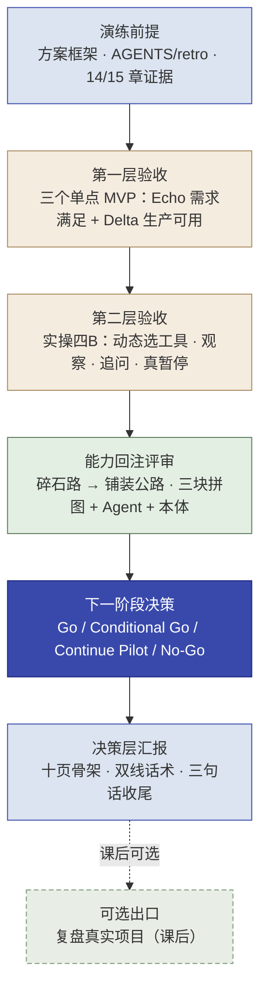

# 第 16 章  实操五 · 综合证据评审、能力回注与决策层汇报

> **本章定位：** 实操单元 · **角色 = 全团队（Echo + Delta）** · Scale / 收口阶段 · 模式 = **头脑风暴 + 评审 + 汇报**（关键判断不用 AI）
> **本章产出：** 一套完整的**综合评审与交付决策包**——两层验收结论（三个单点 MVP + 实操四B）、能力回注评审、每个场景的**下一阶段决策**（Go / Conditional Go / Continue Pilot / No-Go）、决策层汇报稿（十页骨架），并在收口前提供**"复盘真实项目"的可选出口**。
> **承接：** 第 6 章《解决方案框架》+ 第 8/10/12 章三个单点 MVP + **实操四B（Lab4B，如已完成）** + 每轮《AGENTS.md》《retro.md》+ 第 14 章（客户环境与接管证据）+ 第 15 章（价值、采用与回注证据）。
> **核心隐喻：** **碎石路 → 铺装公路**（哪些是"西岭的内容"、哪些能抽象成"给所有客户的能力"）。
> **延伸阅读：** 无编号"复盘真实项目"实验手册（资源包 `optional-labs/`）；在线全书见文末。
> **适配说明：** 沿用训练营"实操五"骨架；去现场计时；把讲师引导改写为自查问题；**本实操同时服务两条线**：西岭主线总结回顾（默认），以及学有余力学员的"复盘真实项目"（可选，用同一套方法）。

---

## 本章导学

- **学习目标：**
  1. 用**双层验收**评审全部成果：第一层对三个单点 MVP 做 Echo（需求满足）/ Delta（生产可用）双视角；第二层对**实操四B** 做受控 Agent 验收（动态选工具、观察后继续、追问、真暂停）；
  2. 用**能力回注四步法**判断"哪些碎石路能铺装成公路"，看懂"三块拼图 + 实操四B 的受控 Agent 能力"，并联合第 14/15 章证据给出回注候选；
  3. 为每个场景作出**下一阶段决策**：Go / Conditional Go / Continue Pilot / No-Go（当前决策 → 业务依据 → 技术依据 → 未关闭风险 → 责任人 → 下一 Gate）；
  4. 用**ROI 框架 + 合规交代**面向决策层做"双线汇报"（对陈主任讲价值、对市数据局讲合规），并完成**十页决策层汇报**；
  5. 理解"会做 ≠ 会说 ≠ 会决策"：交付不是演示，是**基于证据的下一阶段判断**；
  6. （可选）把同一套方法迁移到**复盘真实项目**：拆解、复盘、决策与汇报，检验方法能否带回工作。
- **前置知识：** 全书（尤其第 3 章能力回注四步法、第 6 章 Echo、第 8/10/12 章 Delta 成果、第 14 章客户落地证据、第 15 章价值与回注证据）。
- **章节地图：** 这是全书收口（Scale + 能力回注 + 交付决策）。五个实操以"汇报"开头（Ch6 Echo 向陈主任汇报方案）、也以"汇报"收尾（本章向决策层汇报成果），首尾呼应、闭环完整；实操四B 是三个单点 MVP 与综合收口之间的高级桥梁。

> **一句话记住本实操：** 把三个单点 MVP（+ 实操四B）从"西岭的定制（碎石路）"铺成"给所有客户的能力（公路）"，**基于证据为每个场景作出下一阶段决策**，再用决策层听得懂的话讲清值不值——这一步走完，FDE 交付闭环才算真正闭合。

---

## 实战演练

### 演练背景

前几轮你走完一个完整 FDE 交付闭环：Ch6（Echo）拆场景定方案，Ch8/10/12（Delta）做出三个单点 MVP（分类 / RAG / 固定路由工作流），实操四B（如已完成）综合为受控协同 Agent；第 14 章给出客户环境与接管证据，第 15 章给出价值、采用与回注判断。本实操**不做新功能**，只做四件事：**① 两层验收 ② 能力回注 ③ 下一阶段决策 ④ 决策层汇报**。

**AI 使用边界（判断归人，AI 辅助不越位）：** 本实操的关键判断——需求是否满足、能否上生产、是否回注、Go / Conditional Go / Continue Pilot / No-Go——由 **Echo + Delta 自己**完成；AI（可用但非必需）只允许作**辅助**：整理证据、汇总轨迹、把已定稿的逻辑润色成汇报文案、或在汇报预演中扮演"红队"追问。**"AI 能帮你写一份看起来对的总结，写不出你真正相信的、有判断的总结。"**

### 演练前提（课前准备）

- [ ] 全组通读第 6 章《解决方案框架》（尤其三个场景的需求定义、验收标准）
- [ ] 全组回顾实操二/三/四（及实操四B，若完成）的《AGENTS.md》和《retro.md》
- [ ] 全组回顾三个 MVP 与实操四B 的验收报告（qa-report.md）与演示材料
- [ ] 全组回顾第 14 章生产差距 / 接管证据、第 15 章价值与采用证据
- [ ] 准备白板、便签、马克笔；打印**能力回注四步法模板**与**下一阶段决策模板**

### 知识背景（呼应第 14 / 15 章）

> 第 14 章给出"系统能否进入客户环境、客户能否接管"的工程证据；第 15 章给出"值不值得、组织愿不愿意接、什么值得回注"的业务判断。本实操的每个环节，都用这些证据支撑：

| 环节 | 用到的知识 |
|------|-----------|
| 第一层验收 · 单点 MVP | Echo 验"需求满足吗"（验收 ≠ 需求满足）、Delta 验"能上生产吗"（MVP ≠ 生产）：用第 14 章生产差距与第 15 章价值证据逐项校准（15.2 / 15.8） |
| 第二层验收 · 实操四B | 受控 Agent 的验收口径：动态选工具、观察后继续、追问、真暂停（11.3.7 / 实操四B 手册） |
| 能力回注评审 | 四步法 + 碎石路→铺装公路 + 优先级矩阵；三块拼图 + **受控 Agent（实操四B）与业务本体**（15.7） |
| 下一阶段决策 | 八项 FDE 生产准入（14.5）+ 业务证据包（15.8）：Go / Conditional Go / Continue Pilot / No-Go |
| 决策层汇报 | ROI 给区间不给单点、书面锁口径；门槛·动机·信任；金字塔 + 双线话术（15.3 / 15.4 / 15.5） |


*图 16-1：本实操流程——两层验收 → 能力回注 → 下一阶段决策 → 决策层汇报 →（课后可选）复盘真实项目*

---

### 演练流程

#### 第一层验收 · 三个单点 MVP 的双视角评审

**Step 1 独立判断（先独立后碰撞）：** 每人对照方案框架做两件事——**Echo 视角**：三个场景各写一条"需求满足了吗？✅/⚠️/❌，为什么"；**Delta 视角**：三个场景各写一条"这个 MVP 能上生产吗？差距在哪"（对照第 14 章八项 FDE 生产准入的维度想：数据接入 / 系统集成 / 权限责任 / 异常兜底 / 过程追溯 / 发布回退 / 客户接管 / 回注准备）。

> **自查追问：** 每个 Demo 验收都达标了（分类≥85%、RAG 双指标、路由工作流零漏判）——但**验收达标就等于需求满足了吗？** 你量的到底是当初承诺的东西，还是客户真正要的东西？

**Step 2 组内讨论：** 需求满足度墙 + 生产差距墙；讨论"有没有验收达标但需求没满足的场景"、各 MVP 离生产多远、Echo 与 Delta 视角如何互补；对照第 14 章八项 Gate 与第 15 章价值证据，各场景能证明什么、不能证明什么。

**Step 3 达成共识 · 输出两张表：**

- **需求满足度表**（Echo）：场景 | 当初需求/验收标准 | 是否满足✅/⚠️/❌ | 差距 | 理由（证据）
- **生产差距表**（Delta）：场景 | 对照八项 FDE 生产准入的差距 + **单独列"数据出域交代"**（红线、工程决策：本地部署模型选型/成本/工期——口径见下方 NOTE）

> [!IMPORTANT]
> **关于"数据出域"（全组必须明交代）：** 课堂流程里，三个 MVP 与实操四B 使用**完全虚构 / 已脱敏的教学数据**调用公网 LLM 完成验证；**真实客户数据只能在组织批准的安全域内（本地部署或客户授权的环境）做验证、联调与生产落地，不得"先入公网再补救"。** 交付包里必须写明：哪些验证用了模拟数据、换成真实数据需要重新验证什么、本地回填的形态选型与工期（对照第 13 章 13.7 模型切换适配与第 14 章接入纪律）。

#### 第二层验收 · 实操四B（Lab4B）评审

已完成实操四B 的组，用受控 Agent 的口径单独评审（对照 11.3.7 与实操四B 手册）：

| 验收维度 | 通过判据 |
|---|---|
| 动态选工具 | 不同任务走不同工具路径，不强制"分类→查政策→查部门"固定顺序 |
| 观察后继续 | 工具结果（如信息冲突）会触发换工具或重新判断，而不是一条道走到黑 |
| 主动追问 | 信息不足时调用 `ask_clarification`，追问后能续跑 |
| 真暂停 | 敏感 / 高风险走 `request_human_review`（配合 interrupt + resume，真暂停—恢复） |
| 有限循环 | 达到完成条件即结束；达到最大步数 / 触及风险边界即暂停或停止 |
| 工作台可演示 | 毕业展示工作台可向领导演示：用户说了什么 → Agent 做了什么 → 为何交给人工 → 得到什么 |

> **若未做实操四B：** 在本环节改为"评审它的加入会不会改变三个 MVP 的决策"——即三个 MVP 各自仍需要独立的 Go/No-Go 判断，实操四B 是"未来可评估的综合形态"，不作为结业硬性依赖。

#### 脑暴二 · 能力回注：哪些碎石路能铺装成公路？

用能力回注四步法（Ch3），判断三个 MVP（+ 实操四B）里哪些能沉淀为平台能力。

**Step 1 识别（10 分钟）：** 白板画两区——**碎石路（西岭专属，做完就扔）+ 能铺路（通用价值，别的客户也要）**。每个场景逐条判断："能力去掉'西岭市民服务平台'这个壳，剩下的是什么？"

**Step 2 抽象（10 分钟）：** 对每个"能铺路"候选，讨论怎么泛化成标准模块——去掉了哪些客户特定逻辑？剩下什么通用能力？怎么设计成可配置（类别清单做成配置项）？

**Step 3 铺路优先级（10 分钟）：** 用**优先级矩阵（通用性 × 成本）**给候选定 P0/P1/P2。

> **自查追问：** 为什么某个候选值得"立即做"？——回注价值在于"以最低成本撬动最多客户"。**P0 应该是通用性高 + 成本低的"高杠杆候选"**（如通用文本分类器）。

**Step 4 产出《内部能力回注总结》。** 关键认知——**三块拼图 + 受控 Agent + 业务本体**：

> 三个 MVP 回注的是**不同的通用模式**，合起来才是完整能力栈：
> - **分类器**（"是什么"：文本分类）、**RAG**（"依据"：知识库问答）、**路由工作流**（"怎么办"：预编排分支 + 兜底）；
> - **实操四B 受控 Agent**（"下一步做什么"：动态选工具 + 追问 + 人工暂停——与三块拼图配合，才是完整能力栈）；
> - 以及处处都在的那个最通用的东西——**"拿不准就兜底转人工"**（Human-in-the-Loop）；
> - **业务本体**：把"请求—依据—责任主体—工单—人工审核"的结构与"等待市民补充 / 等待人工 / 工具调用记录 / 工单草稿 / 人工决定后迁移"等状态与动作（回注候选），按第 15 章 15.7 判断业务通用性（第 14 章 14.9 验证工程可执行性）。

**输出物：** 碎石路/能铺路两区图 + 《内部能力回注总结》（单点 MVP + 实操四B 概览、可回注清单、三块拼图 + Agent + 本体、回注价值、回注计划）。

#### 脑暴三 · 下一阶段决策 + 客户汇报

**Step 1 下一阶段决策（本实操新增的核心环节）：** 为每个场景（及实操四B）各写一份**下一阶段决策单**：

```text
当前决策：Go（正式推进）/ Conditional Go（附条件推进）/ Continue Pilot（继续试点）/ No-Go（停止或另起）
→ 业务依据（第 15 章证据：价值 / 采用 / 回注）
→ 技术依据（第 14 章证据：Gate 八项 / 接管）
→ 未关闭风险（数据出域、容量、责任、合规……）
→ 责任人（Echo / Delta / 客户方）
→ 下一 Gate（什么条件、什么时候复核）
```

> **决策不是投票，是拿证据说话。** 没有证据支撑的"Go"和"No-Go"都是态度，不是决策。"Continue Pilot"是合法的中间态——继续试点要写明试点范围与复核时间，不是拖延。若三个场景与实操四B 结论不一致（例如 A 可 Go、C 需 No-Go），如实呈现，不要统一成"全部 Go"。

**Step 2 客户汇报（金字塔结构，十页骨架）：**

```
第 1 页 · 结论       一句话：做了什么 + 核心价值（数字）+ 投入产出
第 2 页 · 业务问题    客户原来的痛点 / 当初的验收标准（第 6 章方案框架）
第 3 页 · 方案与价值  三个 MVP + 实操四B 各一个最有说服力的价值点 + ROI 框架（给区间，不给单点）
第 4 页 · 合规与约束  数据不出域 / 模拟数据边界与本地回填方案 / 责任边界（谁负责）
第 5 页 · 验证证据    盲测与用户反馈：能证明什么、不能证明什么（不把演示数字当生产保证）
第 6 页 · 能力回注    碎石路铺成哪些公路：三块拼图 + 受控 Agent + 本体回注清单
第 7 页 · 下一阶段    各场景 Go / Conditional Go / Continue Pilot / No-Go 一览（附条件）
第 8 页 · 风险        未关闭风险与降险动作（数据出域、容量、责任、合规）
第 9 页 · 需要的支持  决策层要批准什么：资源、试点范围、本地部署立项……
第 10 页 · 下一步     从 Demo 到生产的路径 + "上线后 N 周出真实数字"承诺
```

> [!NOTE]
> **两种汇报人看两套重点页：** 面向陈主任（决策层）重点讲第 1 / 3 / 7 / 9 页（价值、决策、支持）；面向市数据局（监管层）重点讲第 4 / 8 页（合规、责任与风险）。先判断"谁在听、他最关心什么"，再决定放大哪几页。

**Step 3 ROI 与追问演练（沿用第 15 章口径）：**
> **ROI 不是编数字，是给算账的方向和框架。** 用五步法搭出"哪些环节能省、省的是谁的成本、怎么测"：**假设 → 效率 → 质量 → 敏感度 → 锁定**；用第 15 章 15.3 的**三类价值公式 + 保守/基准/乐观三场景**算出区间，**给区间不给单点**；承诺"**上线后 N 周出真实数字**"。
> 预演常问：**快赢**（先上哪个？什么时候见效）、**追责**（数据泄露谁负责？怎么降险）、**失业**（AI 会不会让我失业？——用"机器干重复、人干判断"具体回应）、**No-Go 场景**（为什么这个不继续？怎么向发起人交代？）。

**输出物：** 下一阶段决策单（每场景一份）+ 客户汇报稿（十页骨架 + ROI 区间 + 合规交代）。

#### 讲演收尾 · 每组 5 分钟汇报

**汇报要求（强制做减法，三句话结构）：**
1. **① 验收结论**：两层验收结果——需求满足了吗？能不能上生产？（含实操四B，若完成）
2. **② 能力回注清单**：碎石路铺成了哪条公路？
3. **③ 下一阶段与客户价值**：每个场景的决策是什么？值不值？

**汇报人：** 建议 Echo 和 Delta **各一人上台**（检验全团队，不是个人）。听众扮"客户"可追问；讲师点评。

**评分维度：** 判断力（讲得出"为什么满足/不满足、为什么 Go/No-Go"？）/ 能力回注（讲得出"铺了哪条公路"？）/ 决策质量（有证据、有未关闭风险、有责任人吗？）/ 客户视角（讲客户价值还是技术细节？有 ROI 吗？）/ 表达（全业务语言、能答追问吗？）。

#### （可选）课后出口 · 复盘真实项目

完成西岭主线后，有真实项目且能匿名化的学员，可按《复盘真实项目》手册（资源包 `optional-labs/`）做**无编号、可选**迁移实验：不新增任何 FDE 方法，只用同一套 Echo/Delta 方法对你的真实项目做**拆解 → 复盘 → 决策与汇报**。本章的验收表、决策单、十页汇报骨架可直接复用于你的真实项目。完成与否不影响主线结业。

---

### 产出物清单 & 验收标准（DoD）

**交付物：**

```
实操五-总结汇报/
├── 需求满足度表.md           # Echo：三场景（+实操四B 若完成）✅/⚠️/❌ + 理由与证据
├── 生产差距表.md             # Delta：三场景 + 八项 Gate 差距（含数据出域交代与本地回填方案）
├── 实操四B验收表.md          # （若完成）第二层验收六维判定 + 演示记录
├── 内部能力回注总结.md       # ★核心：碎石路/能铺路 + 三块拼图 + 受控 Agent + 本体候选 + 优先级
├── 下一阶段决策单.md         # ★每场景：Go / Conditional Go / Continue Pilot / No-Go + 依据/风险/责任人/Gate
├── 客户汇报稿.md             # 十页骨架金字塔汇报（含 ROI 区间 + 合规交代 + 支持申请）
└── 讲演汇报稿.md             # 三句话结构：验收结论/能力回注/决策与价值
```

**验收标准（DoD）：**

- [ ] **两层验收**：需求满足度表 + 生产差距表完成；数据出域交代与本地回填方案单独列出（模拟数据边界写清）；实操四B（若完成）六维验收判定齐
- [ ] **能力回注**：碎石路/能铺路判断 + 识别 ≥4 候选 + 抽象泛化 + 优先级矩阵 + **三块拼图 + 受控 Agent + 本体回注候选**认知 + 内部总结完成
- [ ] **下一阶段决策**：每个场景一份决策单，含业务/技术依据、未关闭风险、责任人、下一 Gate；允许出现 Continue Pilot 与 No-Go，不统一"全 Go"
- [ ] **客户汇报**：十页骨架 + ROI 给区间不给单点 + 双线话术 + 合规交代 + 支持申请（第 9 页），模拟汇报过关
- [ ] **讲演收尾**：每组完成 5 分钟三句话汇报，能回答客户追问（含 No-Go 追问）
- [ ] 关键判断由人完成；AI 只作整理/润色/红队辅助（使用与否如实说明）
- [ ] 全团队协作（Echo/Delta 视角都发挥）

---

## 反模式与红线（本实操学习点）

- **验收只报流水账、不讲判断。** "需求满足了吗"要讲得出理由与证据，不是复述 Demo。
- **拿单点 MVP 当整体结论。** 三个 MVP 各自独立评审；A 能 Go ≠ C 也能 Go——统一"全 Go"是掩盖差异。
- **能力回注只看定制性、看不到通用性。** 要把"文本分类/知识问答/分级路由/受控 Agent"的通用机制从"西岭的内容"里抽出来。
- **把什么都标 P0。** 优先级靠"高杠杆"（通用性高+成本低）判断，不是"自己喜欢"。
- **跳过"未关闭风险"。** 决策单没有风险与责任人，等于没做决策——尤其数据出域、容量、责任、合规。
- **讲成技术汇报。** 对陈主任讲 LangGraph/RAG/准确率=沟通失败——对陈主任讲价值与决策、对市数据局讲合规。
- **编 ROI 数字。** "省 2000 万"式报价是编的；诚实做法是给算账框架 + 区间 + "上线后 N 周出真实数字"。
- **绕开"数据出域"。** 这是红线，必须交代模拟数据边界与本地回填方案，不能含糊带过——这正是 FDE 与"只做 Demo"的区别。

> [!IMPORTANT]
> **本书收官红线对照：** 四条政务红线在你的交付包中已全部闭环——**数据不出域**（模拟数据边界 + 本地回填方案已列在生产差距表）、**答案可追溯**（RAG 带引用）、**敏感件零漏判**（路由工作流与实操四B 验收硬指标）、**人能判断、AI 能执行**（决策与风险接受由 Echo/Delta 完成，AI 只辅助）——这四条红线 + 能力回注 + 下一阶段决策，就是 FDE 交付完整闭环的标准。

---

## 本章小结

- **两层验收**：第一层三场景双视角（Echo 需求满足 / Delta 生产可用，对照八项 Gate 与价值证据）；第二层实操四B（动态选工具/观察/追问/真暂停/有限循环/可演示）。
- **能力回注**：识别→抽象→集成→验证；**三块拼图（分类/RAG/路由） + 受控 Agent + 业务本体**；"拿不准就兜底转人工"是最通用的机制。
- **下一阶段决策**：Go / Conditional Go / Continue Pilot / No-Go，每项带业务与技术依据、未关闭风险、责任人、下一 Gate——**决策是拿证据说话，不是投票**。
- **客户汇报**：十页骨架、双线话术（陈主任讲价值与决策/市数据局讲合规与风险）、ROI 给区间不给单点、第 9 页申请支持。
- **讲演收尾**：三句话结构（验收结论/回注清单/决策与价值），Echo+Delta 各一人上台；首尾呼应，闭环完整。
- **可选出口**：复盘真实项目（课后、无编号、不影响结业）——同一套方法带回工作。

**动手自检：**

- [ ] 我能用 150 字业务语言讲清"我们交付了什么、解决了你什么痛点、下一阶段怎么走"吗？
- [ ] 我能判断"验收达标但需求没满足"的差异吗？MVP 和生产差在哪？
- [ ] 我能把三个 MVP（+实操四B）抽象成通用能力，并标出 P0 高杠杆项吗？
- [ ] 我能为每个场景写一份带依据、风险与责任人的下一阶段决策单吗？允许 No-Go 吗？
- [ ] 我能按十页骨架搭客户汇报，对陈主任/市数据局讲两套话术、并申请支持吗？
- [ ] 我的 ROI 是"给区间 + 上线后 N 周出真实数字"，没有编单点数吗？
- [ ] 我的交付包有没有把"数据出域"（模拟数据边界 + 本地回填）作为明确交代写清楚？

---

## 练习与思考

- **基础：** 默写能力回注四步法；说出"碎石路 vs 能铺路""内容 vs 机制"的区别；默写四类下一阶段决策及各自适用情况。
- **进阶：** 为"工单分级路由工作流"写一份**下一阶段决策单**：若你在第 12 章验收达标，给出 Go / Conditional Go / Continue Pilot / No-Go 之一，并写全业务依据、技术依据、未关闭风险、责任人、下一 Gate；再为"实操四B"列两条回注候选（如"等待市民补充/等待人工"状态、"工单草稿-人工决定后迁移"动作）说明为何值得抽象。
- **挑战（迁移练习/双线汇报）：** 为"诉求分类 MVP"准备两个版本的 5 分钟汇报——一版对看重 ROI 的决策层（重点讲第 1/3/7/9 页），一版对看重合规的监管层（重点讲第 4/8 页），用金字塔结构写出并注明两版取舍；若你有真实项目，按《复盘真实项目》手册走一遍"拆解—复盘—决策"的骨架。

---

## 在线全书

- 想读 FDE 交付的 Scale 阶段（撤出/交接、客户自运营）、能力回注方法论与价值量化/变革管理延伸，见在线全书 **https://www.cloudzun.com/fde-course/**。
- 在线全书章节：第 8 章（Phase 4 Scale）、第 9 章（能力回注方法论）、第 15 章（AI FDE 落地：Echo 共识与对齐）。
- **随书资源包：** 能力回注四步法模板、下一阶段决策单模板、客户汇报稿模板（十页骨架）、ROI 计算表、金字塔汇报结构；**无编号实验手册**（实操四B、复盘真实项目）见 `resources/optional-labs/`。

---

## 全书收口的话

> 到这里，你跟着西岭市民服务平台的五个实操（+ 实操四B），走完了一整个 FDE 交付闭环：**Echo（Ch6）把模糊需求拆成施工图 → Delta（Ch8/10/12）把施工图做成三个能跑、能溯源、带安全底线的单点 MVP → 实操四B 综合成受控协同 Agent → 第 14—15 章给出客户环境与价值证据 → 全团队（Ch16）把定制铺成平台能力、基于证据作出下一阶段决策、向决策层讲清价值。**
>
> 第 4 章最后问过你：**"你把位置测试当标签贴死了吗？"** 现在你应该体会到——Echo 和 Delta 不是两种人，而是 FDE 都要练的两种能力：**一端是挖真需求、做取舍、讲价值的"判断力"，另一端是让 AI 干活、把关、回注的"施工力"。** 合起来，才是 FDE"从卖人力到卖能力"的完整闭环。
>
> **回到公司，你要做的第一件事，就是把这套方法在你的真实项目上用起来——先找对问题，再让它跑起来，最后把碎石路铺成公路。** 有真实项目且能匿名化的同学，可以再做一遍《复盘真实项目》：检验这套方法能不能经得起"换一个项目、没有标准答案"的考验。